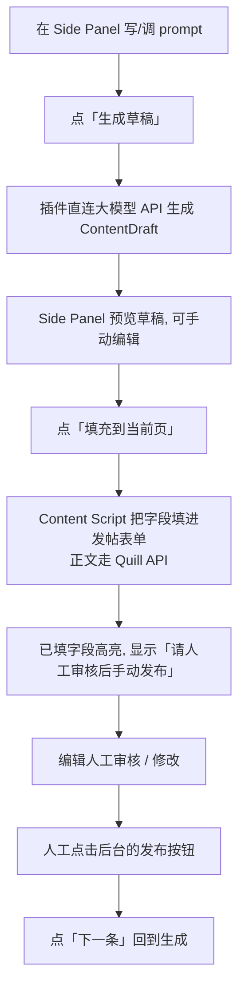

# 51publisher 发帖填充助手(Chrome 扩展)

## Problem Frame

内容运营在 51publisher 后台逐条发帖,每条都要把标题、副标题、分类、正文、标签手动敲进表单,重复且慢。目标是用一个 Chrome 扩展把"AI 生成草稿 → 填进发帖表单"这段机械劳动自动化,把人留在真正需要判断的环节:**审核、修改、点发布**。

**硬约束(不可妥协):插件只填充、只辅助,绝不自动提交、绝不自动点发布。最终发布动作必须是人工。**

## User Flow

## Requirements

**核心填充闭环**

- R1. 单条闭环:一次只处理一条草稿(生成 → 预览 → 填充 → 人工审核 → 人工发布 → 下一条)。**不做**后台任务队列、节流、失败重试。
- R2. Side Panel 提供三个主操作:「生成草稿」「填充到当前页」「下一条」。
- R3. 生成的草稿在填充前可在 Side Panel 内预览并手动编辑(改标题/正文/标签等)。
- R4. 填充只写入表单字段、触发必要的 input/change 事件;**绝不**触发表单提交或点击发布按钮。
- R5. 填充完成后高亮已填字段,并显式提示「插件不会自动发布,请人工审核后手动发布」。

**字段映射与表单交互**

- R6. 字段映射集中在一份可配置的 map 里(title / subtitle / category / body / tags),选择器优先用稳定属性(name / id / data-\* / aria-label),避免易变 class 链,方便后台改版时只改这一处。
- R7. 正文为 **Quill 编辑器**:通过 Quill 实例自身 API 设置内容(如 `clipboard.dangerouslyPasteHTML` / `setContents`),不直接覆盖 innerHTML,以免破坏编辑器内部状态。
- R8. 分类(category)等下拉:兼容原生 `<select>`(赋值 + 触发 change)与自定义下拉组件(模拟点击 + 选项文本匹配)。
- R9. 标签(tags)按后台实际输入形态填充(如逐个输入 + 回车,具体形态待页面确认)。

**AI 生成**

- R10. 插件直连大模型 API(如 OpenAI / Claude)。所有外部请求在 Background Service Worker 发起,集中处理鉴权与 CORS。
- R11. API key 存 `chrome.storage.local`,**不硬编码**;设置页保存时显式提示用户"明文存储于本地浏览器"的风险。
- R12. 设置页可配置:大模型 endpoint、API key、prompt 模板、字段映射。
- R13. 所有 AI 生成内容初始状态标记为 `draft`(待审核)。

**数据结构**

- R14. 定义 TypeScript `ContentDraft` 接口:`id, title, subtitle, category, coverImageUrl, body(HTML), tags[], status(draft|filled|published), createdAt`。`coverImageUrl` 字段保留(供预览/参考),但 MVP 不负责把它填进表单。

**安全与权限**

- R15. `host_permissions` 只声明 51publisher 自己的后台域名,最小权限原则。
- R16. 不存储任何敏感凭证明文(除用户自填的 API key,且需风险提示)。

## Success Criteria

- 在真实 51publisher 发帖页,点一次「填充到当前页」,标题/副标题/分类/正文/标签被正确填入,正文在 Quill 里显示正常(格式不乱、编辑器状态正常可继续编辑)。
- 全流程没有任何一步会自动提交或自动发布——发布按钮始终由人工点击。
- 后台若小改版,只需改字段映射 map 一处即可恢复,不必动核心代码。
- 一条草稿从「生成」到「填好待审核」的耗时,显著低于纯手工录入。

## Scope Boundaries(非目标)

- **不**自动提交 / 不自动点发布按钮(硬约束)。
- **不**做批量任务队列、节流、指数退避重试(已确认单条闭环)。
- **不**做封面图自动填充(MVP 由人工上传;`coverImageUrl` 仅作预览参考)。
- **不**做多编辑器泛化检测(后台正文确定是 Quill,只适配 Quill;CKEditor/TinyMCE 等不在范围)。
- **不**做草稿库/历史持久化管理(单条闭环,处理完即走;如需再议)。

## Key Decisions

- 草稿来源 = 插件直连大模型 API:prompt 模板与生成逻辑都在插件内,Background 负责发请求。
- 范围 = 单条闭环:砍掉队列/节流/重试,复杂度降一个量级,仍满足"连续高效发帖"。
- 正文编辑器 = Quill:填充策略具体化为 Quill API,放弃泛化检测。
- 封面图 = MVP 不碰:避免"下载 URL → 模拟上传"这个高成本且接近"自动化"的坑。

## Dependencies / Assumptions

- 假设 51publisher 后台发帖页可被 content script 注入,且 Quill 实例可通过向页面主世界注入脚本访问到。
- 假设用户自备可用的大模型 API key 与 endpoint。

## Outstanding Questions

### Resolve Before Planning

- (无)— 产品层面的范围与边界已锁定。

### Deferred to Planning

- [Affects R6/R7][Technical][Needs research] 51publisher 发帖页实际 DOM:各字段的稳定选择器、Quill 实例如何挂载与访问(主世界注入方式)、分类与标签控件的真实形态——需用浏览器实地打开发帖页检查后再写映射。
- [Affects R10/R12][Technical] 直连哪家大模型、请求/响应格式、流式与否、错误处理。
- [Affects 构建] 构建工具选型(倾向 **WXT**:对 MV3 + side panel + content script 主世界注入的脚手架与类型支持更完整,省去 crxjs 手工配置;最终在 plan 阶段定)。

## Next Steps

→ `/ce:plan` for structured implementation planning(产品边界已清晰,可直接进技术规划;规划第一步应实地检查 51publisher 发帖页 DOM)
