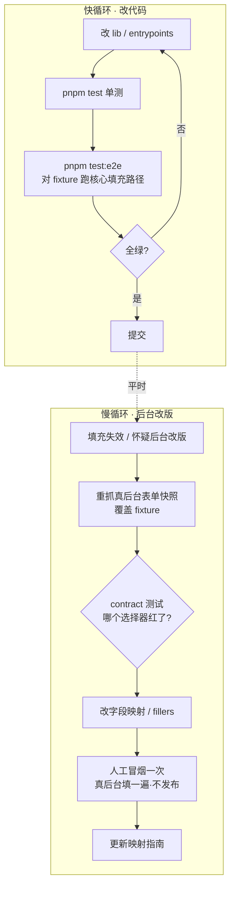

# 51publisher 填充助手:迭代节奏与 e2e 测试

## Problem Frame

填充助手主体已建完(56 个单测全绿、ce:review 判定可合并)。但单测都在 jsdom 里跑、靠 mock,**没有一处验证「真的把草稿填进了一个带真实 Quill 的发帖表单、且没触发提交」**。同时,这个插件的命脉是「字段映射对得上后台 DOM」——后台一改版,选择器失效,插件就静默挂掉。

所以缺两样东西:

1. **一条贴近真实的端到端验证**,守住核心填充路径(字段填对 + 正文进 Quill + 零提交)。
2. **一套迭代节奏**,让平时改代码有快循环(我方代码引入的回归由 fixture + contract 测试**自动、尽早**拦下),后台改版时有可控的修复流程。
   - ⚠️ **诚实的边界**:对方后台改版引入的漂移,本设计**只能被动发现**——要等填充失效被察觉后才会去重抓快照,不是主动预警;fixture / contract 测试全绿**不代表**真后台没变。「尽早」只对「我方代码漂移」成立,对「对方后台漂移」是「事后」。能否补一条主动探针见 Outstanding Questions。

受影响的人:维护这个插件的开发者(你 + AI 协作)。终端运营用户不直接感知,但他们的「填充突然失效」正是这套机制要提前拦下的。

## User Flow

迭代分两层:平时改代码的**快循环**,与后台改版时的**慢循环**。

## Requirements

**e2e 测试靶子(fixture)**

- R1. 用一份**静态 HTML fixture** 作为 e2e 主靶子:从真实发帖表单抓取,内含真实 Quill 2.0.2(`ql-snow`)、`#editor`、以及所有目标字段(`input[name="title"]`、`subtitle`、`select[name="type"]`、`textarea[name="description"]`、标签 checkbox 组等)的真实结构。
- R2. fixture 以「资源文件」形式纳入仓库(如 `tests/fixtures/webarticle-add.html` + 本地引入的 Quill),e2e 能在无网络、无真后台登录的前提下加载它。
- R3. fixture 顶部用注释记录:抓取日期、来源页(`/admin/webarticle/index` 的添加弹层)、抓取时后台版本线索(若有)。
- R14. **抓取 / 重抓 fixture 前必须脱敏**(安全硬要求)。真后台表单是在**登录态**下抓的,HTML 里可能夹带 CSRF token、session / 隐藏鉴权字段的 `value`、cookie、内部 API / 上传地址、真实用户 / 作品数据。提交进仓库前必须:① 剥除隐藏鉴权字段与 token;② 清掉内联 cookie / 凭证;③ 内部接口 URL 换成占位;④ 真实用户 / 媒体数据换成合成值。脱敏做成 **R8 重抓脚本里一道可核验的步骤**(如按 token 正则黑名单 grep,命中即拒绝提交),让「任何人(含 AI)重抓」都绕不过;R10 冒烟清单加一行「已确认脱敏后再提交」。**理由**:一旦带 token 的 HTML 进了 git 历史,几乎无法彻底撤回,且对所有有仓库读权限的人可见。

**e2e 覆盖范围(核心填充路径)**

- R4. e2e 加载 fixture 后,**绕过 Side Panel UI**,直接触发一次填充(调用 content/填充逻辑或派发 `FILL_PAGE`),用一条固定的 `ContentDraft` 作输入。
- R5. e2e 必须断言:
  - 每个映射字段被正确写入(text/textarea 值正确、`select` 选中正确 option、对应标签 checkbox 被勾选);
  - 正文 HTML 确实进入 Quill(`.ql-editor` 内容与**经 Quill clipboard 规范化后的预期 HTML**一致——Quill 自身白名单会改写标签,故断言对象是「过 Quill 后的规范输出」而非与草稿逐字相等;且写入前已过 `sanitize.ts` 消毒);
  - **表单 `submit` 事件计数 = 0、无导航发生、未点击任何提交/发布按钮**(零提交硬约束的端到端版,比现有单测更接近真实)。
- R6. e2e 覆盖一条「降级路径」:当 `window.Quill` 不可用时,正文走兜底写入并被标记为 `degraded`,断言此时**仍然零提交**。
- R7. **不**自动化 Side Panel 本身(它是扩展内部页,自动化成本远高于普通页);Side Panel 的交互继续由现有 jsdom 组件测试覆盖。

**防漂移机制(再抓快照 + 人工冒烟)**

- R8. 提供一份**可重复执行的「重抓快照」步骤/脚本**:把当前真后台发帖表单(含 Quill)另存为新的 fixture,覆盖旧的。步骤写进文档,任何人(含 AI)能照着重抓。
- R9. fixture 顶部维护一份**关键选择器清单**(title / subtitle / type / description / tags / #editor 等);配一个 **contract 测试**断言这些选择器在当前 fixture 中都存在。重抓快照后若某选择器消失,contract 测试立即变红,逼迫更新字段映射。
  - **R9 与 R5 的分工(不重复)**:R5 的 e2e 填充失败时只会说「填不进」,R9 直接点名**哪个**选择器消失了——定位更快、报错更准。R9 是 R5 的诊断辅助,不是冗余覆盖。
- R10. 维护一份**人工冒烟清单(checklist)**:后台改版或重抓快照后,人工在真后台打开发帖表单、用插件填一遍、肉眼核对每个字段、确认正文正常、**确认不发布**,逐项打勾。清单沉淀进 `docs/`。
- R11. 文档明确写出 fixture 路线的**已知局限**:fixture 是某一时刻真后台的快照,e2e 全绿只证明「对那一刻的结构」填充正确;真后台与 fixture 的一致性由 R8–R10 的重抓 + 冒烟来保障,而非 e2e 自动保障。且 fixture 已按 R14 脱敏,**并非生产 HTML 的逐字副本**(动态提交 handler、按键触发等无法被静态 fixture 复现)。

**迭代节奏**

- R12. 快循环:改代码 → `pnpm test`(单测)→ `pnpm test:e2e`(fixture 核心路径)→ 全绿才提交。e2e 跑得够快、可进 CI(高确定性、无外部依赖)。
- R13. 慢循环:怀疑/确认后台改版 → 重抓快照(R8,含 R14 脱敏)→ 看 contract 测试哪个选择器红了(R9)→ 改字段映射或 `lib/fillers.ts`(参照 `docs/field-mapping-guide.md` 已有的「Tier 分级」:Tier-A 只改 config、Tier-B 改 fillers、Tier-C 改架构)→ 人工冒烟(R10)→ 更新 `docs/field-mapping-guide.md`。

## Success Criteria

- 存在一条命令(如 `pnpm test:e2e`)能在无真后台、无网络下跑通,验证核心填充路径并断言零提交;能放进 CI。
- 故意改坏一个字段选择器后,e2e 或 contract 测试会变红(不会假绿放过)。
- 后台改版的修复流程被文档化到「照着做就能恢复」的程度:重抓快照、看红、改映射、冒烟,每步都有落点。
- 任何人能在 5 分钟内理解 fixture 路线「测什么、不测什么、漂移靠什么兜」,并清楚「对方后台漂移只能事后发现、不是主动预警」这条边界。
- 抓进仓库的 fixture 不含任何 token / cookie / 真实凭证 / PII(R14 脱敏生效)。

## Scope Boundaries(非目标)

- **不**自动化 Side Panel UI 的端到端(R7);它由组件测试覆盖。
- **不**做对真后台的自动化登录 + 自动填充回归(碰真后台、要存登录态、有风险且可能误触发);真后台只做**人工**冒烟。
- **不**做对真后台选择器的自动定期探针(本轮放弃该选项;漂移靠重抓快照 + 人工冒烟兜)。
- **不**追求 e2e 覆盖所有字段组合与边界;只守「核心填充路径 + 一条降级路径」。
- **不**新增重型 e2e 框架,除非现有工具链(WXT + Vitest)确实跑不动真实 Quill(选型留给 plan)。

## Key Decisions

- e2e 主靶子 = 本地 fixture:确定性高、可进 CI、不依赖真后台登录;真页只做人工冒烟。
- e2e 覆盖 = 核心填充路径 + 一条降级路径:守住「填对 + 进 Quill + 零提交」这条命脉,不铺开。
- **e2e 价值分层**(避免「真 Quill 跑不起来就退化成单测重跑」):**must-have = 真表单 DOM 上的「字段填对 + 零提交」**(只需 fixture,不依赖真 Quill);**value-add = 真 Quill 的 paste 保真**(依赖测试环境能跑真 Quill——探针显示 jsdom 多半可以)。即使真 Quill 最终跑不起来,e2e 靠 must-have 仍站得住,不必为它上重型 runner。
- **漂移检测接受「被动发现」**:不加主动探针;对方后台改版只能在填充失效后经重抓 + contract 红灯发现。已在 Problem Frame / Success Criteria 标明这条边界(2026-06-04 拍板)。
- 防漂移 = 再抓快照 + 人工冒烟:轻量、零真后台自动化风险;代价是漂移发现依赖人工触发,用 contract 测试(R9)把「重抓后选择器没了」这一刻变成强制红灯来部分补偿。
- 不自动化 Side Panel、不自动碰真后台:成本与风险都不划算,边界明确划出去。

## Dependencies / Assumptions

- 依赖能在测试环境里加载真实 Quill 2.0.2 并构造出 `Quill.find(#editor)` 可用的实例(fixture + 本地 Quill 资源)。这是 fixture 路线能否成立的**关键技术前提**,plan 阶段需先验证。
  - **初步探针(降风险)**:Quill 2.0.2 在 jsdom 29 下能实例化、`Quill.find(#editor)` 可取回实例、`setText('') + dangerouslyPasteHTML` 同步写入 `.ql-editor` 成功——正是 tier① 所需路径。故 **plain jsdom 很可能够用**,plan 的 spike 是「确认」而非「闸门」,别急着上 happy-dom / browser mode(那会拖进 Scope Boundaries 想避开的重型 runner)。注意验证完整生命周期(实例化→粘贴→读 `.ql-editor`)无未捕获的异步异常即可。
  - **Quill 目前不是项目依赖**(package.json 无),fixture 路线需把 Quill 2.0.2 作为**测试专用资产**引入(vendored 文件或 devDependency),且须是与真后台一致的 2.0.2 构建。
- 假设现有 `lib/fillers.ts` / `lib/quill-paste.ts` / `lib/sanitize.ts` 的逻辑可被 e2e 直接驱动(它们已是纯函数式、可注入 document/window)。
- 假设 WXT + Vitest 的测试环境(jsdom 或可切换的浏览器环境)能承载真实 Quill;若 jsdom 撑不住 Quill 的 DOM 依赖,可能需要 happy-dom 或 Vitest browser mode——留给 plan 验证。

## Outstanding Questions

### Resolve Before Planning

- (无)— 测试策略的产品/范围层面已锁定(靶子、覆盖、防漂移三项均已拍板)。

### Deferred to Planning

- [Affects R1/R2][Technical][Needs research] fixture 怎么抓最省事且最真:整页另存 vs. 只截表单 DOM 片段 + 本地挂 Quill。要保证 `Quill.find(#editor)` 在测试里真能拿到实例。
- [Affects R12][Technical][Needs research] 真实 Quill 在哪个测试环境跑得起来:jsdom 够不够(初步探针倾向够)、要不要 happy-dom 或 Vitest browser mode(headless Chromium)。这决定 e2e 跑多快、能否进 CI。
- [Affects R4][Technical] 「绕过 Side Panel 直接触发填充」的最稳入口,且要处理**两世界问题**:生产填充跨 ISOLATED↔MAIN 两个世界(`content.ts` 派发 CustomEvent,`quill-bridge.content.ts` 在 MAIN 世界接住调 `pasteIntoQuill`)。单 jsdom 只有一个 realm,e2e 要么把 MAIN 世界 bridge 监听也加载进同一 window 让 CustomEvent 往返(测到 body-bridge 的 timeout/reqId 路径)、要么绕过 bridge 直接调 `fillDraft` + `pasteIntoQuill`(更简单但测不到 bridge)。两条选一条,plan 须明确。
- [Affects R5][Technical] 零提交怎么插桩:spy `HTMLFormElement.prototype.submit` / `requestSubmit` + 在 fixture form 上 `addEventListener('submit')` 计数 + 断言发布按钮从未被 `click()`。jsdom 不会真导航,断言必须靠这套 spy 才不会「假绿」。
- [Affects R12][Technical] `pnpm test:e2e` 目前不存在,需新建 npm script;且要定 e2e 与现有 56 单测是**独立 vitest project** 还是共用 `vitest.config.ts` + 路径 glob。
- [Affects R6][Technical][需确认是否真 bug] **降级标记可能没被桥传出来**:`window.Quill` 不可用时 `pasteIntoQuill` tier② 返回 `{ok:true, degraded:true}`,但 `quill-bridge.content.ts` 目前把它收敛成 `{ok:res.ok}`,丢掉了 `degraded` 旗标 → `content.ts` 收到 `ok:true` 会记成 `filled` 而非 `degraded`。若属实,R6「断言标记 degraded」会对现有代码失败。plan 须二选一:(a) 把 `degraded` 旗标透传过桥(改 `quill-bridge.content.ts` 转发 `res.degraded`);(b) 降级断言只在 `pasteIntoQuill` 单测层做、不在 e2e 端到端断言。
- [Affects R8][Technical] 重抓快照做成 npm script(自动抓)还是纯文档步骤(人工另存)。受真后台需登录态影响,可能只能半自动;无论哪种,R14 脱敏闸门必须内嵌且无法绕过。

## Next Steps

→ `/ce:plan` for structured implementation planning(测试策略边界已清晰;规划第一步应验证「真实 Quill 能在哪个测试环境加载」这个关键前提,再据此定 e2e 落地形态)
