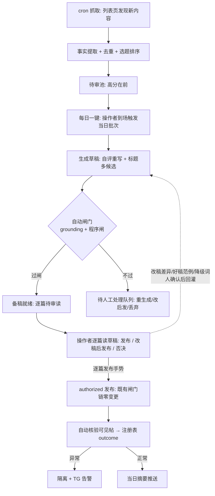

# 高度智能 AI 发帖项目 — 全面优化路线

## Problem Frame

首飞(2026-06-10,ID 121)证明端到端链路成立,但项目的「智能度」停留在一次性模板填充层级。六维多代理分析(7 agent,代码+git+文档交叉验证)确认四类核心短板:

1. **「自动」是账面幻觉**:自动管线(抓取→待审→生成→发布,路径 B)代码全部就位,但 `ACGS51_ENABLED` 默认关闭、从未端到端真实跑过;抓取器只会每 6 小时重抓同一个固定 URL——无发现、无去重、无评分,本质是「单 URL 定时重抓器」。
2. **系统不学习**:操作者改稿时 AI 原稿被原地覆盖(`patchBatchDrafts`),最宝贵的偏好数据每发一篇永久丢一篇;few-shot 可视化编辑器(6/9 需求 R11-R13)被标记完成但实际未实现(账实不符,由本文 R3 承接)。
3. **质量无闭环**:单发即终态、无自评重写、标签约束只有 prompt 祈使句无程序校验(已核实模型造词可直接进草稿)、无评测基准(改 prompt 全凭感觉)、无 temperature 参数(批量易篇篇雷同)。
4. **运营摩擦与盲区**:后端手动启动且绑定笔记本、发布后人工核验、零告警;LLM 成本无计量、封面图热链外站随时失效。

操作者的目标形态 = **质量优先(1-3 篇/天)的高度智能发帖系统**:自动选题、一键生成质量过闸的备稿、操作者逐篇读后发布(全程 ~10-15 分钟,管线与审读流水化并行)、发布后自动核验。

## 终态用户流

## 阶段总览(过闸推进,不并行抢跑)

| 阶段 | 主轴 | 进入下一阶段的闸门 |
|---|---|---|
| 1 点火与对账 | 路径 B 真实首飞 + 修已坐实 bug + 账实对齐 | 路径 B 端到端 ≥1 篇真实发布;cover_url 假设有实证结论 |
| 2 学习与度量地基 | 原稿留底、注册表、度量落档、成本计量、评测集 | 基线数字自动产出(直发率/degrade 率/每篇成本),基线判定规则成文(样本量/观察窗/计法) |
| 3 生成质量闭环 | 程序闸(含对抗检查)、自评重写、多候选标题、SEO | 评测集人工对照通过;直发率较基线上升(按阶段 2 成文的判定规则) |
| 4 选题智能与运维常驻 | 发现+去重+排序;统一回访作业;告警;后端常驻 | 待审池每日自动有新鲜去重候选;核验/告警全自动 |
| 5 每日一键备稿 | 一键端到端备稿 + 逐篇读后发布 | dry-run 灰度首批零事故后常态化 |

**过闸复核规则**:每次过闸时,依据该阶段产出的真实数据复核下一阶段的需求清单(增/删/降级)。**阶段 3-5 的需求是「候选方向」而非承诺范围**——例:若基线直发率已经很高,R13/R14 缩水;若 51acgs 列表页日新增 ≤ 日发量,R22 评分降级为「去重 + 时间排序」。此规则是对项目「先基线再建」纪律的延伸:闸门不只控制执行时序,也控制范围再验证。

## Requirements

**阶段 1:点火与对账(事实地基)**

- R1. 路径 B 真实首飞:启用 ACGS51 抓取,完成「抓取→事实提取→待审→内联编辑→批准→生成→填充→authorized 发布」端到端 ≥1 篇真实发布。过程中实证 `cover_url` 字段类型假设(hidden URL 输入 vs file upload),回填 run-sheet 空白表,完成 U13 CORS 现网实测(首飞成功后执行)与首飞后 data/ 二次异地备份(备份加密落异地,或确认 data/ 不含机密类配置并成文;`.env` 永不进备份集)。**首飞期间顺带完成五项零成本观察**(均不阻塞过闸,服务后续设计与候选项决策):① 以 dry-run 档实测「自动开后台表单 tab + 自动就位 layui 弹层 + 无人触碰完成填充」可行性(未来定时/隐藏态候选项的前置);② 后台 admin session 实际寿命(影响 R25);③ status=0 隐藏帖在未登录前台的 publishUrl 可访问性(隐藏态候选项的承重前提);④ save 响应是否携带前台 URL、不携带时能否由帖子 ID 按固定模板推导(影响 R8/R24);⑤ 帖子对外展示的时间戳行为。
- R2. 修复已坐实 bug:① `scheduler.ts` cron 路径解构丢失 `coverImageUrl`(静态证据确凿);② `ACGS51_START_URL` 默认值为首页而 adapter 是详情页解析器,开箱即坑。
- R4. 账本对账(在 R1 完成后执行):修正 plan 06-09-002 的「9/9 完成」假标记(R11-R13 标为未实现,由本文 R3 在阶段 2 承接);执行 06-10-002 要求的收工复盘(依真实数据量评估 SQLite 统一迁移与 06-09-001 延后项去留)。

**阶段 2:学习与度量地基**

- R5. AI 原稿留底:新增 `BatchItem.aiDraft`,人工改稿前留底原稿,自动计算编辑差异(改了哪些槽位、改动幅度)——这是学习闭环的不可逆数据资产,每拖一篇丢一篇。留底写入本身是小改动,可作阶段 1 随行项提前落地(差异计算留本阶段)。
- R6. 全档位度量落档:轨迹/度量不再仅 authorized 落档,off/dry-run 同样累积;补计时字段(生成耗时、审读耗时)与每篇 LLM token/成本(读 `response.usage`,不可得则按字符估算)。「直发率」(审读时无需改稿即发布的比例)的判定规则在本阶段成文,须明确:基线样本量与观察窗;标题候选一键切换/微调是否计入「改稿」;跨阶段工作流变更时基线是否重置。**采样参数管道**(请求体支持 temperature/max_tokens,默认值保持现状)随本阶段顺带落地,取值调优留阶段 3(R16)。
- R7. degrade/fillResults 聚合:聚合以**扩展本地数据为全集**(后端双写是 best-effort 有静默缺口,镜像不作聚合源)——聚合计算在扩展侧执行,或经全量上报后在后端聚合(通路规划时定);产出降级率与高频未命中词(词表维护从盲猜变数据驱动);累计样本 <20 条时只显累计不显趋势;报表 UI 延后,等聚合产出被高频使用证明需要再建。
- R8. 已发布帖注册表:后端建立可查询的已发布帖登记(作品名/publishUrl/发布时刻/状态/outcome),发布确认时写入。**写入可靠性**:失败时本地暂存重试,并提供与扩展 trajectory(publish-confirmed 记录)的对账补登;上线时一次性回填存量已发布帖(含首飞 ID 121),保证去重不对历史帖失明;publishUrl 缺失时登记帖子 ID 并按固定模板推导(推导失败标记「不可回访」留人工)。**权威域划分**:注册表 = 已发布帖记录的可变权威;trajectory = 不可变审计链;R7 度量 = 扩展本地为权威。消费方:R21 作品名去重、R24 回访、R18 互链、R7 聚合。outcome 定位为**发布后健康监控**(在线/渲染;收录依 R18 条件档联动)——无消费方不建采集,浏览量不采。
- R9. LLM 供应商逃生通道:至少配置并验证一个备用端点(扩展现有 fallbackModel 机制到备用 endpoint,密钥沿用 background/env 既有管理),或形成书面风险接受;换模型/端点时用 R10 评测集对照验证(注意备用端点的内容审查行为可能不同,对照需覆盖拒答模式)。成本数字并入 R6 度量与 R7 聚合,不建独立月度视图。
- R10. 评测金标准集:10-20 条 golden topics + **人工并排对照流程**作为基线评测手段(改 prompt/换模型/调 few-shot 前后对照);程序化评分脚本为候选项——变更频率证明需要再建,建则先过一次「与人工判定对照」的效度检验(吸取 edit-delta 误判「流畅的幻觉」的前车之鉴),通过后才可作闸门依据。
- R11. 一键回灌(人在环):审读判定的好稿一键存为 few-shot 范例,degrade 词与操作者补正值一键进推荐词表——**操作者主动的一键动作即时生效(动作本身就是确认),且可撤销**;「待确认队列 + diff 预览」仅用于系统生成的建议(如 degrade 词聚合推荐)。**严守 L2 边界:绝不静默改 prompt/词表**(继承 2026-06-05 既定决策)。few-shot 范例池设上限(默认 8 条),满时人工淘汰——防止范例只进不出膨胀 prompt 并干扰 R12 雷同检测。
- R3.(由阶段 1 移入,与 R11 同期落地——回灌的范例需要编辑器承接)补齐 few-shot 可视化编辑器(6/9 需求 R11-R13 账实对齐):Settings 中范例以卡片列表呈现、支持增删改、保存时序列化向前兼容(`fewShotPairs` 类型脚手架已就位);存量自由文本的迁移路径(自动拆分预填 + 人工校对)在规划时定。

**阶段 3:生成质量闭环(质量优先主轴)**

- R12. 出口程序闸(含对抗维度):① tags 与 recommendedTags 程序化求交集校验;② 与 few-shot 范例的雷同度检测(标记公式化开场;**与 R13 自评共用同一检测实现,不重复建**);③ 正文链接出口白名单——允许「来自事实块的来源链接」+「来自 R8 注册表的自家前台 publishUrl」(为 R18 互链预留;互链由组装器程序化注入,不经模型槽位),其余一律拦;④ 越界口吻/敏感词检查——**抓取源页面内容视为不可信输入**(防第三方页面提示注入经管线上线;注入可能同时骗过生成与自评两道 LLM,人工兜底见 R28 每篇必读)。
- R13. 自评重写一轮:生成后做廉价 rubric 自检(长度/雷同度/事实覆盖/口吻关键词),不合格带评语自动重生成一次;格式解析失败也带错误信息重试而非直接放弃。
- R14. 标题/副标题多候选:槽位改为 3 候选,按长度/去重/关键词覆盖程序化择优,审读区可一键切换;**切换绝不静默覆盖人工编辑**(已编辑时需确认,或将人工版保留为额外候选)。
- R15. 富结构正文:highlights 槽位改为列表渲染(`<ul><li>`,消毒白名单早已允许),帖子从「一段话」升级为结构化看点;verbatim 注入与转义防线不动。
- R16. 生成参数调优:在 R6 落地的参数管道上调优 temperature/max_tokens 取值;prompt 契约移入 system 角色,降低批量同质化;变更过 R10 对照验证。
- R17. 单条路径补齐:单条生成接入 facts 解析与 few-shot,消除「同一产品里两种智能水平」的割裂。
- R18. 站内 SEO(分两档):**承诺档**——description 面向搜索/列表页点击写作、帖内同题材相关帖互链块(消费 R8 注册表,经 R12③ 白名单豁免通道注入),不依赖外部收录即有站内价值;**条件档**——定时收录监测依调研结论再定(成人站常态是基本不被收录,若实证如此则删除该子项,R24 的收录检查项同步删除);若启用收录监测,须同时定义**收录/流量回退熔断线**(触发即暂停一键批次默认开关、由操作者确认恢复;阈值规划时定)。
- R19. 封面图资产化:抓取封面转存自家可控存储,或至少失效检测+告警。**安全约束**:封面拉取必须复用 ssrf-guard(每跳重验),走独立的「图片拉取 allowlist」而非放宽 scraper 主名单;上传前做 content-type 白名单 + 体积上限 + 图片解码校验(封面 URL 来自可被攻击者影响的第三方页面)。**凭据边界**:若转存上传需后台凭据,执行侧必须是扩展(操作者会话内);后端绝不持后台凭据,违背即触发单独安全评审。

**阶段 4:选题智能与运维常驻**

- R20. 列表页发现:acgs51 适配器增加列表模式,抓「最新更新」列表页,对未见过的详情 URL 自动走完整提取入池——从「定时器」变「选题雷达」。**安全约束**:发现的详情 URL 仅限同 host 且必须通过 scraper 主 allowlist + ssrf-guard(与手配 URL 同一通路,不另开口子);每抓取周期新 URL 入池数与 LLM 提取次数设上限(数值规划时定),超限截断并告警(防被操控的列表页构成抓取面扩大与成本放大)。
- R21. 选题去重(与 R20 同期规划,在启用列表发现前就位,对既有 cron 入池路径同样生效):① source_url 入池查重(UNIQUE 约束);② 作品名与 R8 注册表比对(防重复发同一作品)。内容 hash 短路 LLM 提取为候选项,待 R20 落地后依实测重复率再议。
- R22. 选题排序(依赖 R20/R21 产出的池子):字段完整度/新鲜度/与既往发布重合度/题材匹配度混合打分,待审池按分排序;低于阈值**折叠沉底(可展开捞回,绝不隐藏)**——评分器初期必然误杀,人是最后一道闸。按过闸复核规则:若列表页日新增 ≤ 日发量,本条降级为「去重 + 时间排序」。
- R23. 拒绝原因结构化:reject 时选结构化原因(重复/质量差/题材不符/事实缺失),聚合回流。**L2 边界**:回流排序器为参数权重自动生效;凡触及提取 prompt 文本的调整一律经待确认通道(绝不静默改)。批量拒绝时默认统一原因、允许逐条覆盖、允许跳过——错误归因的数据比没有数据更糟。
- R24. 统一回访作业(发布后自动核验 + 健康监控):**一个回访作业挂多个检查项,不建多套调度**——逐篇发布(人手势)后立即回访 publishUrl 核验在线/渲染正确(可见帖,无凭据前台核验天然成立;验证通过才算终态,失败自动降级隔离);同一作业定期复访已发布帖做健康监控(在线/渲染;收录仅当 R18 条件档启用,且搜索引擎查询走独立出口通路不进回访 allowlist),outcome 写入 R8 注册表。**执行侧与通路**:由后端执行,自家站前台 host 进专用回访 allowlist(不放宽 scraper 主名单)、走 ssrf-guard;核验结果由扩展轮询后端回写批次状态(通路细节规划时定)。「隔离自动核销」仅限暂时性失败(网络/超时)且复访确认帖子在线的窄类,内容类失败一律留人工。
- R25. 失败自动重试 + session 失效识别:仅幂等安全段(生成、填充)加重试预算与退避;**dispatched 绝不自动重发的铁律保留**;识别后台 session 过期模式并告警提示重登(寿命数据来自 R1 观察②)。后端 JWT:每日到场即登录,24h token 充分。
- R26. 告警通道:隔离区有货/批次失败超阈/核验不过/抓取连败时推送 Telegram;每日批次摘要(发了几篇+前台 URL 列表)作为记录。**安全边界**:bot token 纳入现有 fail-closed env-check 体系;摘要只携带前台公开 publishUrl,**绝不携带后台管理域 URL 或批次内部细节**;通道严格单向(只推送,不解析入站指令——与既有 TG bot 生态的远程触发能力隔离);chat_id 固定为操作者私聊。摘要在手机端仅作提醒,审读/发布动作入口在 Mac 扩展。
- R29a. 后端常驻(从 R29 前移,支撑本阶段「待审池每日自动补充」闸门):launchd 开机自启+崩溃拉起;睡眠策略——配置电源设置防睡眠,或接受睡眠期间抓取暂停、唤醒后补跑(规划时定)。

**阶段 5:每日一键备稿(读后发布)**

- R27. 每日一键备稿管线:操作者到场点「跑今日批次」→(第一步先跑一次增量抓取+去重,避免拉到陈池;或明示池内条目时间戳)→ 拉取 top-N 高分待审选题(操作者可先在待审池快速调整勾选,不强制逐题批准——最终把关在读后发布环节)→ 生成(R13 自评、R14 候选)→ 自动闸门(grounding 绿 + R12 程序闸绿)→ **备稿就绪,逐篇进入审读队列**;闸门不过的草稿进「待人工处理队列」(可重生成/改后手动发/丢弃,与备稿队列明确区分)。**流水化**:备好一篇即可开始读一篇,管线时延与审读并行,总预算 = max(管线时延, 审读时长) ≈ 10-15 分钟。**空态**:待审池空或不足 N 时明示原因(无新增/已去重/低分折叠)并引导展开折叠区捞回,不静默空跑。批次运行中 sidepanel 显示进度与急停入口(沿用 KILL_BATCH)。发布时刻随操作者到场时间自然散布,不建独立节奏系统(原 R30 并入)。chrome.alarms 定时触发仍为可选候选项(启用前置:弹层自动化实测通过 + 长效 token + 防睡眠)。
- R28. 审读发布流程(每篇必读):逐篇展示草稿渲染预览 + grounding/程序闸结果 + 自评重写差异(如有)→ 操作者**每篇读完**后选择「发布 / 改稿后发布 / 否决丢弃」。改稿在草稿上进行(BatchItem 内,R5 差异采集与 R11 回灌天然衔接);**发布 = 既有 authorized 逐篇手势,闸门链零变更**;未读的草稿绝不发布(防橡皮图章退化,也是防提示注入上线的人工兜底);否决 = 丢弃草稿,无生产库残留。首批跑 dry-run 灰度验证管线,再切真实发布。
- R29. Mac 常驻运维(收尾项):新增 /healthz 端点(进 PUBLIC_ROUTES 但仅返回 `{ok:true}`,不含版本/配置/路径);一键开机脚本(env 校验→build→启动→冒烟),消除「pnpm start 跑旧 dist」隐形坑;**机密注入**:launchd 不在 plist 内联机密,由启动脚本从权限 600 的 .env 加载后 exec。(launchd 自启与睡眠策略已前移至阶段 4 R29a。)

## Success Criteria

- **终态画面**:Mac 开机的日子,操作者到场一键触发当日批次,系统自动产出 1-3 篇过闸备稿;操作者逐篇读后发布,管线与审读流水化并行,全程 ≤10-15 分钟;发布后自动核验,异常必有 TG 告警,无静默故障。
- **质量可度量**:评测集与基线建立(判定规则成文,含候选切换计法与基线重置规则);「直发率」(审读时无需改稿即发布的比例)较基线上升;标签 degrade 率 <20%(沿用 6/9 既定标准)且趋势可见。
- **学习闭环成立**:AI 原稿留存率 100%(不再销毁);凡审读产生回灌建议(好稿/降级词补正),两周内被确认或显式丢弃,待确认积压为零(无货可灌不计为失败)。
- **安全边界可验证**:未读草稿零发布;急停可用;每篇成本数字自动产出。
- **账实一致**:所有计划文档完成标记与代码实况对齐,run-sheet 不再有空白回填表。

## Scope Boundaries

- 不做多平台分发(明确决策:本轮不做,架构中已有的多站基因保留不动)。
- 不做 VPS 迁移与 headless 后端直发(凭据托管+闸门重建+不可逆面扩大,属终局选项,需单独安全评审后另立计划)。
- **不做隐藏态自动发布**(第二轮评审三连坑:无凭据核验死锁、「改稿后转正」需编辑已发布帖的新契约面、授权模型与隐藏帖生命周期成本——降为阶段 5 过闸复核时的候选项;启用前提 = R1 观察③实证隐藏帖可免登录访问 + 操作者确认「审读已渲染真帖」的价值值得上述成本,并另过授权模型设计)。
- 不做「编辑已发布帖」的填充能力(读后发布形态下改稿发生在草稿阶段;个别已发布帖需修改时走后台人工编辑兜底)。
- 不做 chrome.alarms 定时自动触发(可选候选项,启用有三前置:弹层实测通过 + 长效 token + 防睡眠)。
- 不做 L3 静默自动学习:所有回灌一律人确认(L2),在质量验证成熟前不放开。
- 不做「未读发布」:终态保留每篇必读后逐篇发布手势。
- 不做浏览量采集与浏览量驱动的学习闭环(全路线无消费方,不为假设性未来建采集;若日后样本充足且有明确消费需求再议)。
- 不做独立的发布节奏系统(并入 R27,自然散布)。
- 不做 media_id 自动匹配(延后:1-3 篇/天量级下手填可忍;若日后提量再启)。
- 不做适配器配置化热加载(沿用代码注册+重启生效)。
- 不做封面图 file 上传注入(cover_url 字段类型验证结果将影响 R19 方案,见 Deferred to Planning)。

## Key Decisions

- **主轴 = 分阶段全都要**,顺序「点火→地基→质量→选题/常驻→一键备稿」:延续项目「先基线再建」纪律;质量闭环(阶段 3)排在度量地基(阶段 2)之后,否则改了也不知道有没有变好;阶段 3-5 为候选方向,过闸时复核。
- **触发形态 = 每日一键**(评审基线对照的结论):人反正每天要到场审读,定时触发只多省一次点击,却要多承担防睡眠/弹层无人就位/夜间 token 过期三项承重假设;一键形态用「人在场」消解大部分,剩余弹层依赖由读后发布形态进一步消解(填充发生在人逐篇操作时,与现行已验证流程一致)。
- **发布形态 = 读后发布**(第二轮评审拍板,替代此前的「隐藏态自动发+翻牌」):隐藏态先发被四个评审角度击穿(无凭据核验死锁 / 改稿需编辑已发布帖 / 授权模型变更 / 隐藏帖生命周期),而读后发布以「逐篇读草稿→点发布」达成几乎相同的每日体验,**闸门链零变更**,唯一损失「审读已渲染真帖」被判不值得上述成本。
- **审读语义 = 每篇必读**:质量优先 1-3 篇/天量级下完全可行(每篇 2-3 分钟);消解「批量审核退化橡皮图章」(项目既有未消解风险)与「提示注入内容未读上线」两大风险。
- **R8 = 健康监控而非学习回流**:浏览量数据全路线无消费方,不采;已发布帖注册表(可变权威)与 trajectory(不可变审计链)双轨并存、权威域分明(度量域权威在扩展本地)。
- **运行形态 = Mac 常驻**(launchd + Chrome 常开):零新增基建,代价(只在开机时段运转)被质量优先的低量级目标稀释;后端常驻前移至阶段 4 以支撑其闸门。
- **量级 = 质量优先 1-3 篇/天**:生成质量闭环优先级上移,高吞吐刚需(media_id 自动匹配)延后。
- **学习 = L2 人在环**:继承 2026-06-05 learning-instrument 评审划定的硬边界;操作者主动一键 = 确认本身,系统生成的建议才走待确认队列。
- **范围纳入 SEO(分档)/封面资产化/成本计量与供应商逃生,排除多平台**:操作者明确选择。

## Dependencies / Assumptions

- Mac 常驻可接受:开机时段即系统运转时段;抓取 cron 需机器醒着(防睡眠配置或接受暂停补跑,R29a 规划时定)。
- 操作者提供:51acgs 列表页 URL、推荐标签清单的持续维护、每日到场审读发布。
- 当前 LLM 端点(无审查代理)**短期可用**,以 R9 备用端点对冲断供;断供且无备选时阶段 2-5 停摆,该风险经 R9 显式处置(配置备选或书面接受)。
- 后台契约不发生大改版(漂移被动发现机制沿用;阶段 1 首飞会顺带重核一次;自动化放大漂移爆炸半径的风险由 R24 立即核验 + 每篇必读对冲)。
- 单一内容源(51acgs)集中度风险已知:源站枯竭/改版会让阶段 4 资产闲置,多源扩展不在本轮范围、依过闸复核再议。

## Outstanding Questions

### Resolve Before Planning

(无——cover_url 字段类型、弹层自动化可行性、隐藏帖可访问性、publishUrl 可得性等历史悬置项,均已内嵌为 R1 的实证/观察步骤,不阻塞阶段 1 规划。)

### Deferred to Planning

- [Affects R19, R8-R10 封面链][依赖 R1 结论] 若 R1 实证 cover_url 为 file upload 控件(而非 URL hidden input),封面相关需求方案需调整;当前所有封面需求假设 URL 字符串可用。
- [Affects R8, R24][依赖 R1 观察④] save 响应不含前台 URL 时的 ID→URL 推导模板;推导失败帖的「不可回访」处置。
- [Affects R18][Needs research] 收录监测手段:`site:` 查询的可行性与频率限制;成人站点 GSC 的适用性;若站点基本不被收录,该子项与 R24 收录检查项同步删除。
- [Affects R19][Needs research] 自家后台是否有图片上传接口可复用作图床;上传执行侧与凭据边界(扩展会话内 vs 触发安全评审)。
- [Affects R6][Technical] 当前 LLM 代理端点是否回传 `response.usage`;不回传则按字符数估算降级。
- [Affects R13, R22][Technical] 自评/选题排序用同一生成模型还是更便宜模型——待 R6 成本数据后定。
- [Affects R5, R11][Technical] 编辑差异驱动回灌建议的触发阈值(改动多大才提示「存为范例」)。
- [Affects R24][Technical] 后端核验结果回写扩展批次状态机的通路(扩展轮询的时机与冲突处理)。
- [Affects R7, R11, R27, R28][UX] sidepanel 信息架构:审读队列/待人工处理队列/回灌待确认队列/聚合视图的入口位置、层级与使用频率排序(审读 > 其他),规划时统一收敛,防止扩展长成并列入口的抽屉柜。
- [Affects R20][User decision] 列表页 URL 与抓取频率由操作者提供/确认;列表页日均新增量决定 R22 排序的建设深度。
- [Affects R20][Technical] 每抓取周期「新 URL 入池上限 / LLM 提取预算」的具体数值与超限行为。

## Next Steps

→ `/ce:plan` 进行结构化实现规划(建议按阶段分计划,先规划阶段 1)
