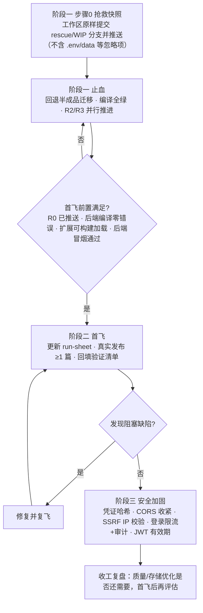

# 止血 → 首飞 → 安全：项目恢复与验证计划

## Problem Frame

51publisher 产品功能推进很快（0.2.0：自动抓取管线、标签约束、封面图、待审池均已实现），但 2026-06-10 实测发现工程底盘处于「三重不稳定」（下列数字为 2026-06-10 上午快照，工作树仍在被并发修改，规划首步必须重测基线）：

1. **仓库账本落后**：≈116 个文件未跟踪（含后端大部分源码、整个 shared 包、CI 配置）+ 83 个删除未提交。GitLab 远端分支不完整，硬盘故障即丢失成果。
2. **存储迁移半成品**：JSON→SQLite 迁移做到一半（batch/prompt 双存储并存）。当日 10:26 实测有 8 个 tsc 编译错误；10:30 前后被并发会话修复，编译恢复零错误——仓库存在并发修改，见 Dependencies。
3. **后端测试仍红**：10:51 快照为 7 失败 / 67 通过（失败集中在 `batch-routes.test.ts`，HTTP 500，与半成品迁移直接相关）。扩展侧单测 315/315 全绿。

同时，**产品核心闭环（选题→生成→审核→填充→发布）至今未经过一次真实发布验证**（G2 首飞未执行），且安全体检发现 4 个高危项（明文密码、CORS 全放行、DNS rebinding、密码比较无时序防护）。

06-09 的七维度优化计划（`docs/plans/2026-06-09-001-refactor-comprehensive-optimization-plan.md`）方向不错但顺序有误：大重构先于产品验证，执行到一半反而让仓库更脆弱。本轮按「先止血、早验证、后强化」重排。

## 执行流程

fresh clone 全量测试全绿（R2/R3/R13）是**收工条件**，与首飞并行推进，不作为首飞闸门（R2 设 1 个工作日时间盒，超时降级为并行修复项；首飞关键路径路由的失败除外，见 R2）。「后端冒烟通过」定义为：后端以有效 `.env` 启动 + 登录成功 + batch 与 pending 各一次 HTTP 往返（恰好覆盖两条首飞路径依赖的接口）。首飞 3 天窗口自 G1 首飞前置全部满足之日起算，由运营者宣布开窗并记录在 run-sheet。阶段三中与扩展↔后端通路无关的安全项（如 R10 SSRF、R11 审计日志）可在等待首飞窗口时穿插；**R9 CORS 收紧必须放在首飞成功之后**——它直接作用于首飞依赖的扩展→后端请求路径，提前收紧会让首飞失败难以归因（开发版与打包版扩展 ID 不同，收紧后需以现网配置实测）。

## Requirements

（需求编号为稳定 ID：新增项按时间追加编号、不按章节重排——R13 属止血组、R14 属首飞组。）

**A. 止血——工程恢复绿色并入库**

- R0. 抢救快照：在执行任何回退/删除之前，先对全部工作区文件（含未跟踪文件）执行与 R3 相同的密钥扫描——**扫描必须在推送之前**，否则 R3 的「推送前扫描」防线对这批文件失效；扫描干净后把工作区原样（排除 `.env`、`data/` 等忽略项）提交到独立的 rescue/WIP 分支并推送远端。R0 推送完成后方可开始 R1。另：回退前对 `data/`（含 pending.db）做一次带日期的本地异地副本（外置盘/云文件夹，分钟级一次性动作，不属于延后的备份设施）；首飞完成后再做一次。
- R1. 回退半成品 SQLite 迁移：注意当前 `batch-routes.ts` / `prompt-routes.ts` 已实际接在 SQLite 半成品上，回退是「改回接线」而非「保持现状」——把两个路由的 import 改回 JSON 版 `batch-store.ts` / `prompt-store.ts`，并移除或搁置 `batch-store-sqlite.ts`、`prompt-store-sqlite.ts`、`scraper/migrations/db.ts` 以及 `index.ts` 中 `initAppDb` 的接线（保留 pending-db 依赖的 `src/migrations/runner.ts`）。回退前检查 `data/app.db` 是否存在且有数据：有则导出合并进 JSON 文件或带注记归档；基线重测与回退之间不要启动后端服务（避免写入即将被孤儿化的库）。验收：后端 `pnpm compile` 零错误、启动路径无废弃迁移代码残留，且通过 HTTP 路由对 batch 与 prompt 各完成一次 create→read→update 实测往返（确认 JSON 存储生效）。
- R2. 修复后端测试：基线重测在 **R1 回退落地之后**进行——当前 7 个 `batch-routes.test.ts` HTTP 500 的直接原因正是 R1 要移除的 SQLite 接线（测试按 JSON 存储编写、未初始化 app.db），预期回退后自然转绿；时间盒只适用于回退后仍存活的失败。修复至后端测试全绿，不允许以 skip/xfail 方式绕过。时间盒 1 个工作日：超时未查明根因则降级为与首飞并行的修复项（仍是收工必要条件，但不阻塞首飞）。**例外：位于首飞关键路径的路由（batch-routes、pending-routes）的失败不得降级——它们直接阻塞对应的首飞路径。**
- R3. 版本控制恢复完整：所有应入库源码（packages/backend、packages/shared、扩展新增文件、CI、根配置）纳入 git 并推送远端；敏感与生成物（`.env`、`data/`、`coverage/`、`dist/`）确认被忽略；**推送前对全部待入库文件执行密钥扫描**（gitleaks/trufflehog 或等效模式扫描，覆盖 CI 配置、测试夹具、`.ai-memory/`）；`.env.example` 覆盖全部必需环境变量并与 README 安装说明一致；测试不得依赖被忽略的 `.env`/`data/` 才能通过（fresh-clone 测试以 `.env.example` 占位值或测试内置默认即可运行，不需要真实凭证）；密钥扫描装成可重复的本地 pre-push 钩子（覆盖阶段二/三持续提交的 run-sheet 回填与 `.ai-memory/`，非一次性动作）。验收：在干净目录 fresh clone 后 `pnpm install && pnpm --filter @51publisher/shared build && pnpm -r compile && pnpm -r test` 全部通过（或为 shared 包补 `compile` 脚本，使 `pnpm -r compile` 能按拓扑序自动构建其 dist——shared 的 dist 被 .gitignore 忽略，fresh clone 后必须先构建）。
- R4. 状态对账：`.ai-memory/` 与 06-09 优化计划文档标注实际执行状态（已完成/已回退/延后），避免下一轮会话再次基于过期账本决策。
- R13. 修复扩展侧 4 个既有 tsc 错误（`lib/link-source.ts`、`tests/e2e/probe-grounding.test.ts`、`tests/e2e/validate-grounding.test.ts`），使 workspace 级 `pnpm -r compile` 全绿——这些文件随 R3 入库，不修则 fresh-clone 验收必撞。

**B. 首飞——产品闭环真实验证**

- R5. 首飞检查单更新：`docs/run-sheet-首飞与基线.md` 与当前功能对齐（含 cover_url 封面字段、推荐标签清单、待审池/手动两条路径），列出逐步操作项和回填项。
- R6. 真实发布两条路径各 ≥1 篇：先走手动路径（变量少、易排错），成功后再走待审池路径（抓取→审核→生成，覆盖 0.2.0 新建链路），均完成「填充→后台人工提交发布」完整闭环；逐篇回填验证：分类、标签、封面图、正文格式是否正确落地——以**前台已发布页面**为准核验（正文渲染、封面显示、分类/标签可见性），不止于后台表单字段核对。`cover_url` 隐藏字段接受 URL 字符串的假设在此一并验证。
- R7. 首飞问题处置：阻塞性问题（填错/漏填/格式损坏/无法提交）纳入本轮修复并复飞验证；非阻塞问题记录归档为后续条目，不扩大本轮范围。
- R14. 首飞前最低加固：执行首飞前，先把 `.env` 中的 `JWT_ADMIN_PASSWORD`（现为弱默认值）与 `JWT_SECRET` 轮换为强随机值——分钟级成本、不依赖 R8 代码改动，确保真实账号不暴露在已知默认凭证之上。轮换后重启后端，并在首飞窗口开启前完成一次扩展端登录 + 认证往返验证，把认证类故障消化在窗口之外（轮换会使旧 token 失效，属预期行为）。

**C. 安全加固——高危必修 + 低成本中危**

- R8. 凭证安全：管理员密码改为哈希存储（如 bcrypt）+ 恒定时间比较，不再明文比较；启动时校验 `JWT_SECRET` 为弱默认值（如 `.env.example` 占位值 `change-this-to-a-random-secret`、现 `.env` 中的 `dev-secret-change-in-production`，以及空值/过短值）时拒绝启动（fail-closed，与项目既有 fail-closed 原则一致）；同样的启动校验覆盖 `JWT_ADMIN_PASSWORD`（或其哈希）——命中已知占位/默认值或长度不足时同样拒绝启动，防止 R14 轮换后的回归（旧 .env 还原、换机复制占位值）。
- R9. CORS 收紧：默认不再放行所有来源，默认仅允许扩展来源（`chrome-extension://<id>`）或显式配置的白名单。
- R10. SSRF 加固：抓取请求在 DNS 解析后校验目标 IP，采用**仅放行公网单播**（deny-unless-global-unicast）姿态——私网/环回/链路本地/CGNAT/IPv6 特殊段（127.0.0.0/8、10.0.0.0/8、172.16.0.0/12、192.168.0.0/16、169.254.0.0/16、0.0.0.0/8、100.64.0.0/10、`::1`、`::ffff:` 映射、`fc00::/7`、`fe80::/10`、NAT64 `64:ff9b::/96` 等）作为测试用例而非穷举依据；多记录 DNS 须校验全部解析地址，校验通过的 IP 钉死用于实际连接（防二次解析 TOCTOU）；重定向仅允许 http/https，目标同样受 allowlist 与 IP 校验约束。**LLM 出站路径同步钉死**：后端只向 env 配置的 `LLM_ENDPOINT` 发送 `LLM_API_KEY`，忽略请求体携带的 endpoint——现行 `settings.endpoint` 回退是凭证外送漏洞（持有 JWT 即可让后端把 API key 发往任意地址），钉死它是 LLM 出站豁免于 SSRF 拦截器的前提。
- R11. 登录防护：登录端点独立限流（≤10 次/分钟级别，复用已注册的 @fastify/rate-limit 做 per-route 配置）+ 登录成功/失败审计日志（仅记录时间、IP、结果，严禁记录提交的密码或 JWT；存放位置与保留期在规划中确定，且日志路径必须在 .gitignore 内）。同时盘点 `PUBLIC_ROUTES`，对每个免认证端点做显式去留决定——特别是 `/api/v1/models`（现状免认证即可触发付费 LLM 出站调用，建议改为需认证）。
- R12. JWT 有效期从 7 天收紧至 ≤24 小时；上线时再轮换一次 `JWT_SECRET`，使存量 7 天 token 全部失效（JWT 无状态，不轮换则旧 token 仍可用满一周）；不做 refresh token，过期重新登录（单运营者场景可接受）。

## Success Criteria

- 止血：rescue/WIP 快照分支经密钥扫描后先行推送（R0）；fresh clone 后 `pnpm install && pnpm --filter @51publisher/shared build && pnpm -r compile && pnpm -r test` 全绿（含 R13 扩展侧 tsc 修复）；`git status` 干净（除合理忽略项）；远端分支可独立还原构建。
- 首飞：两条路径（手动、待审池）各 ≥1 篇真实帖子经系统填充后成功发布，并以**前台已发布页面**核验（正文渲染、封面显示、分类/标签可见性）；R14 弱密钥轮换及轮换后登录验证在窗口开启前完成；run-sheet 验证项全部回填；无未处置的阻塞缺陷。若 3 个自然日窗口（自 G1 满足日起算）落空：阶段三以 **R8、R10-R12** 独立验收收工，**R9 与首飞捆绑**转入延期追踪项；若窗口内仅一条路径成功，已成功路径计入验证成果，未执行路径随延期项处理。
- 安全：R8-R12 各项有代码 + 对应测试或可复现的验证记录；R9 的验收必须含收紧后由打包版扩展发起的一次真实扩展→后端认证请求实测（兜底场景按上一条 R9 例外处理）；`.env` 保持从未入库状态（已核实历史干净）。
- 账本：`.ai-memory/` 与计划文档反映真实状态，下一轮会话可直接续接。

## Scope Boundaries

- 不做 SQLite 统一迁移——pending 与 config 维持 SQLite（均落在 pending.db），batch/prompt 回退为 JSON；是否统一在首飞后依据真实数据量再评估。
- 不做前端质量美化——组件拆分（BatchReviewPanel 549 行等）、CSS 治理、UI 框架引入全部延后。
- 不做后端测试覆盖率大补强——仅修复现有红测 + 安全项配套测试；auth/batch/config 路由的系统性补测延后。
- 不做运维设施——Docker、健康检查端点、优雅停机、备份策略、CI 安全扫描延后。
- 不做 refresh token、多管理员、密钥管理系统。
- 不做新产品功能——已实现的能力升级（06-09 需求文档的 R1–R13，与本文档编号无关）只验证不扩展。
- 不做自动提交（自主发布）验证——本轮首飞以「人工提交发布」收尾；zero-submit 解除后的自动提交属后续轮次，需在首飞验证填充质量之后再议。

## Key Decisions

- **顺序：止血→首飞→安全**：产品未经真实验证前，质量美化是低杠杆投资；仓库不稳时一切优化成果都有丢失风险。先恢复绿色基线，再用首飞检验产品，最后按暴露面修安全。
- **回退半成品迁移、保 JSON**：单运营者场景数据量小，JSON 足够用；完成迁移会把未知风险带进止血阶段。回退最快、风险最低。（2026-06-10 并发会话曾向「完成迁移」方向推进并修复了编译错误；运营者已决定停止该会话，本决策维持有效，规划首步重测基线。）
- **首飞完成才算收工 + 3 天窗口兜底**：把「真实世界验证」写进交付定义，避免工程自嗨；首飞发现的阻塞问题在本轮闭环。窗口为 3 个自然日，**自 G1 首飞前置全部满足之日起算**，由运营者宣布开窗并记录在 run-sheet；落空则阶段三以 R8、R10-R12 独立验收收工，R9 与首飞捆绑转入延期追踪项——延期必须产生**有日期的改期承诺**记录在 `.ai-memory/`，且延期首飞执行前不开启新功能开发（防止兜底变成永久搁置）。
- **首飞走两条路径各 ≥1 篇**：先手动（变量少）后待审池（覆盖 0.2.0 新链路），消除「只验证旧路径」的盲区。
- **R2 设 1 个工作日时间盒并与首飞闸门解绑**：首飞前置缩小为「R0 已推送 + workspace 编译全绿 + 后端冒烟可跑」；fresh-clone 全量测试全绿仍是收工必要条件。避免根因未明的测试修复无限期阻塞产品验证。
- **CORS 收紧移至首飞后且与首飞捆绑**：R9 直接作用于首飞依赖的扩展→后端请求路径，先验证后强化；其验收必须含收紧后打包版扩展的一次真实认证请求实测，兜底场景随首飞一同延期。
- **安全范围取「4 高危 + 3 低成本中危」**：4 高危 = 明文密码存储（R8）、无时序防护的密码比较（R8）、CORS 全放行（R9）、DNS rebinding（R10）；3 低成本中危 = 登录限流与审计（R11）、JWT 有效期（R12）、弱 JWT_SECRET 启动校验（R8 内含）。重运维项（备份/Docker/CI 安全扫描）不阻塞当前本机部署形态，延后。
- **R8 取 fail-closed**：弱 JWT_SECRET 直接拒绝启动而非告警——告警模式下弱密钥仍可继续使用，防线形同虚设。

## Dependencies / Assumptions

- 后端部署形态仍为运营者本机 `localhost:3001`；**若后续计划公网部署，安全范围需重估**（中危项需全修，且需健康检查/日志等运维设施）。
- 首飞需要运营者具备真实后台账号、发帖权限和操作时间窗口；窗口按 3 个自然日内排期，落空时按 Key Decisions 兜底规则处理。
- `.env` 从未进入 git 历史（已用 `git log --all` 核实），无需历史清洗。
- **并发修改警告（2026-06-10 发现）**：本文档写作期间另一会话/进程正在修改工作树（10:21–10:30 修复了迁移编译错误、pending 测试超时），其方向（继续完成 SQLite 迁移）与本轮「回退保 JSON」决策冲突；**运营者已确认将停止该会话**。进入规划前须确认其已停止，并重测基线（编译/测试/git 状态三项）。

## Outstanding Questions

### Resolve Before Planning

（无——关键产品决策已全部敲定）

### Deferred to Planning

- [Affects R2][Needs research] `batch-routes.test.ts` 7 个 HTTP 500 已定位为 SQLite 接线 + 测试未初始化 app.db 所致，预期 R1 回退后自愈；R1 落地后重测仍红才进入排查（pending-store 超时已被并发会话于 10:30 修复）。
- [Affects R3][Technical] git 提交切分策略：一次性整理提交 vs 按逻辑域分多提交；`coverage/` 等生成物的 .gitignore 补全。
- [Affects R3][Technical] `.github/workflows/ci.yml` 是 GitHub Actions 而远端是 GitLab（CI 入库即休眠）——转写为 `.gitlab-ci.yml`，还是先入库存档并显式标注休眠？
- [Affects R0][Technical] rescue/WIP 分支在 R3 整理推送后的生命周期（保留/归档/删除），由谁确认其中无密钥；GitLab 远端是否私有仓库（决定 rescue 分支的实际暴露面）。
- [Affects R8][Technical] 密码哈希落点：env 存 bcrypt hash vs 首次启动引导生成；与现有 `JWT_ADMIN_PASSWORD` 的迁移兼容；若哈希存 .env，启动校验如何区分真实哈希与占位哈希；fresh-clone 开发首跑需配 README 一行式强密钥生成指引（R8 fail-closed 会拒绝占位值）。
- [Affects R10][Technical] DNS rebinding 防护实现位置：fetch 前自定义 DNS lookup 校验 vs undici dispatcher 拦截；注意拦截范围只限 scraper 抓取，勿波及后端→LLM 的出站调用。
- [Affects R9][Technical] CORS 白名单如何同时覆盖开发版与打包版扩展 ID（CORS_ORIGIN 多值配置）；首飞后收紧前以现网配置实测。
- [Affects R11][Technical] 审计日志的存放位置与保留期。
- [Affects R7][Technical] 复飞产生的残次帖的清理/下架流程（若首飞失败需复飞）。

## Next Steps

→ `/ce:plan` 进行结构化实现规划
