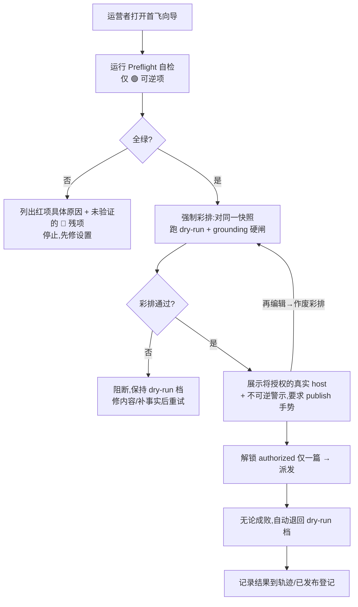

# Trustworthy First Flight

## Problem Frame

单运营者工具。**项目从未真正发布过一篇帖**——代码侧大体就绪(除一个已知前置:占位符填值修复,见 Dependencies),只剩 `docs/runbooks/first-flight-runbook.md` 里的运营动作。那份 runbook 是一张严格有序、人工勾选的清单,混着两类步骤:🟢 可逆/可验证(CORS id 匹配、key 不进 bundle、fail-closed 启动、dry-run 出绿报告…)与 🔴 不可逆(撤密钥、对真后端做 CORS 负向核验、那一次真发布)。

两个缺口让「首飞」一直停在愿望:

1. **可逆设置无法廉价自证。** 运营者无法在按下不可逆的第一次发布前,一键确认 🟢 那半设置确实正确——只能靠肉眼逐条核对清单,错配(如 `CORS_ORIGIN=*`、弱 JWT)可能直到真发布才暴露。
2. **不可逆首发缺结构性护栏。** 真发布可能在未彩排的内容上、或乱序地被触发;发完后扩展可能停在 `authorized` 档而被二次误发。

另有一个**前置正确性缺陷**(占位符填值 bug)会污染真帖,必须先落地——见 Dependencies。

「质量更高的版本」在这个项目里的定义,不是再加功能,而是**让那从未发生的第一次发布变得可信**:可逆设置确定性绿灯化,不可逆首发受结构护栏。

## User Flow

向导运行时的流程(🔴 撤密钥/CORS 负向核验等不可逆步骤在向导**之外**、由运营者先于此完成;preflight 只断言 🟢 半并列出它无法验证的 🔴 残项):

## Requirements

**Preflight 自检(🟢 半的确定性绿灯)**
- R1. 提供一个**可在 CI/命令行运行**的 preflight(如 `pnpm preflight` 或后端路由),机械验证 runbook 所有 🟢 可逆项,输出**一条红/绿总结论**;其结果同时作为向导第一步展示给运营者(同一来源,两个受众)。
- R2. Preflight 至少覆盖这些 🟢 检查(逐项对应 runbook):`CORS_ORIGIN` **配置值**为算得的扩展 id 单值(非 `*`/通配)——仅离线校验配置本身,真后端 CORS 负向核验属 🔴、不在 preflight;**构建产物不含疑似密钥**(扫 `.output/`(含 source map)找 secret-shaped 物料,如 `sk-`/`*_KEY`/`*_SECRET` 字面量——`LLM_API_KEY` 结构上仅后端读取,此检查防的是任何密钥回归泄漏进扩展 bundle,真正持有的 `local:apiKey` 取用面亦在视野);后端 fail-closed 启动(弱值/占位值被拒);对冻结 fixture 的一次 dry-run 产出绿色 DryRunReport(闸链正常、零提交);轨迹链 `verifyTrajectory` 通过;**占位符填值修复已在位**(回归断言:不同占位符得不同值、且填后重跑 `assembleDraft` 的快照随之更新——前置未落地即红)。metrics 自增本轮**不纳入**必检项(见 Outstanding Questions:当前 counter 为死指标)。
- R3. Preflight **只读、非破坏**:绝不触碰真实后端或线上站点,只跑 fixture/本地配置;绝不执行任何 🔴 不可逆动作。检查密钥时只报告布尔存在性,绝不回显密钥明文(日志与输出皆然)——命中即报「fail:含疑似密钥 + 文件/位置」,绝不打印匹配行或密钥片段(CI 文本与侧边栏两个受众皆然)。
- R4. 每项检查报告 pass/fail + 人类可读原因;任一项失败则总结论为红。Preflight 必须**清楚区分**「🟢 检查未过」与「🔴 运营步骤尚未做」——它只断言 🟢 半,并显式列出它无法代为验证的 🔴 残项(撤密钥、对真后端的 CORS 负向核验、真发布本身)。

**一键向导(不可逆首发的结构护栏)**
- R5. 侧边栏首飞向导把授权发布**锁在一次强制彩排之后**:运营者必须先产出绿色 dry-run + grounding 硬闸通过,`authorized` 才对该篇变为可选。**不变量:彩排所验的内容必须与最终派发的字节一致**——向导须把**同一个**规范产物贯穿彩排与派发。⚠️ 现状 `draft` 与 `assembledDraftSnapshot` 会合法分叉(`batch-orchestrator.ts:401` 闸读 `assembledDraftSnapshot ?? draft`,`:440` 却派发 `item.draft`),规划须钉死哪个为准(很可能走 batch 路径锁定快照——单条 `publish-orchestrator` 无快照概念,见 Outstanding Questions)。字节一致校验取**最后一次通过的彩排**与派发之间;前置占位符补全(补事实→重跑 `assembleDraft`→新快照)是**触发一次新彩排**、绝非豁免。
- R6. 向导展示**将被授权的真实 host**(与闸门同源——取自目标 tab,绝不取自消息携带的 host),让运营者在解锁前确认真实目标。
- R7. 向导只为**恰好一篇**解锁 `authorized`;该篇派发后(无论成败)**自动把安全档位退回 `dry-run`**,绝不把扩展留在 `authorized`。**Fail-safe 不变量:任何「已解锁但尚未确定性退档」的中间态(含 SW 被回收、向导被关闭、页面跳转)都必须按 `dry-run` 处理——授权是必须被显式确认才存在的瞬时状态,绝不因状态丢失而默认保持。** **结构性约束:持久化安全档位绝不跨 await 持有 `authorized`——授权表示为派发即消费的一次性凭证、持久档位恒为 `dry-run`;「持久翻档 + 启动复位」方案被排除(`evaluateGate` 实时读 `getSafetyMode()`,回收窗口内的并发触发会读到 authorized,违反本不变量)。** 凭证的具体落地形态见 Outstanding Questions。
- R8. 向导**不削弱任何既有不变量**:第三方站点零提交、`PUBLISH_GRANT` 仅由 background 发、host 取自 `chrome.tabs.get`、grounding 硬闸 fail-closed。它**叠加在现有闸门之上**(消费 `canSubmit` 不改其判定逻辑),不是绕过。**「解锁一篇」是新增特权面:其一次性凭证只能在 background 内、由 side panel 发起的用户 `publish` 手势铸造,与目标 `itemId`+`host` 绑定,`externally_connectable` 保持关闭;该消息绝不创建任何不依赖 `canSubmit` host 命中的发布路径。**
- R9. 向导明示这一步**不可逆**(这是真发布),并要求闸门本就需要的显式 `publish` 手势确认——向导只增加「时序/一次性/自动退档」,不新增任何发布旁路或 auto-approve。
- R10. 向导是**仅服务首飞的一次性脚手架**,不是日常发布路径:首飞成功后它可退化/隐藏,日常 `authorized` 发布仍走现有手动切档,向导不替代、不重构日常批量发布流程。
- R11. **向导交互状态**(防过度信任与中断误发):🔴 残项清单在**全绿路径也展示**(过度信任恰恰发生在绿灯页),与 🟢 检查结果视觉区分;向导被中断后(SW 回收/关闭/跳页)重开时显式提示「上次已中断、安全档位已确认在 `dry-run`」,并据轨迹/已发布登记区分「派发未发生→可重启」与「派发可能已发生→先查登记再行动」以防二次解锁;派发进行中显示「发布中,勿关」,成功与失败各有明确终态(失败须告知是否已派发,且重试须重新彩排)。

## Success Criteria
- 在配置正确的本地环境跑 preflight 全绿;人为破坏 R2 中**任一**检查(`CORS_ORIGIN=*`、弱 JWT、key 进 bundle、fail-closed 启动失败、dry-run 报告变红、轨迹链断裂、bundle 现疑似密钥)即转红并指名失败项。
- preflight 全绿**不等于**可安全发布——它只断言 🟢 可逆设置;🔴 残项(旧密钥撤销已生效、真后端 CORS 负向核验、内容正确)仍须运营者亲核,这一区分对运营者清晰可见。
- 向导让首篇的 `authorized` **仅在**同一快照的 dry-run + grounding 通过后可达;一次派发后安全档位已回到 `dry-run`,无需任何手动操作。
- 现有零提交 / grant / grounding / safety-gate 测试无回归。
- 占位符填值修复未落地时 preflight 转红——前置由一道闸把关,而非仅文档约定。
- Runbook 的 🟢 半被 preflight 完整覆盖(每个 🟢 项映射到一个检查);🔴 半被清楚标为运营者专属、代码无法验证。

## Scope Boundaries
- **不自动化任何 🔴 不可逆步骤**(撤密钥、对真后端的 CORS 负向核验、真发布本身)——按设计保持运营者受闸。
- **不改 safety-gate 匹配逻辑**(`canSubmit`/`labelBoundaryMatch`/`normalizeHost`)——向导原样消费。
- **不在本文档重写占位符填值修复**——它有独立的、已评审的需求文档,作为前置依赖引用(见下)。
- **不新增任何发布旁路、批量授权或 auto-approve**;向导严格「一篇即退档」,非多篇/常驻 authorized。
- **向导仅服务首飞**(R10):不替代、不重构日常批量发布流程;首飞成功后日常发布回归现有手动切档。
- 域名单一来源、可观测性漏斗、CI 覆盖率/审计闸、漂移 canary——属另两条主线(本轮已 defer),不在此。

## Key Decisions
- **Preflight 只断言 🟢 可逆半,🔴 半保持人工受闸。** 不可逆运营动作(撤销、真发布)无法被安全或有意义地自动化;混进来只会制造虚假信心。
- **向导一篇即自动退回 dry-run。** 首飞最主要的风险是停在 `authorized` 而二次误发;一次性 + 自动退档让 `authorized` 成为一个刻意的、瞬时的状态。
- **占位符修复作为前置依赖、不并入本文档。** 它已有完整且经评审的需求文档,重写只会重复并引入漂移。
- **向导叠加在现有闸门之上、零旁路。** 保住全部结构性安全不变量。
- **向导是仅首飞的一次性脚手架。** 一次性事件不该把「强制彩排+自动退档」的开销永久压在每次日常批量发布上;首飞过后「从未发过」这个最危险的风险已消解,日常发布回归现有手动切档。
- **占位符前置由 preflight 一道闸机械把关(R2)、非仅文档约定。** 把「修复须先落地」从口头顺序变成结构性阻止,杜绝带 bug 首飞。
- **R7 fail-safe 是硬要求、不可 defer;评审证明只有 token 形态能满足它**(持久翻档方案因 `evaluateGate` 实时读档而有回收窗口竞态,被排除)。锁死方向:持久档位恒为 `dry-run` + 派发即消费的一次性凭证;规划只定凭证的具体落地形态。
- **向导经评审挑战后保留(判定非过建)。** 评审(product/adversarial/scope)指其增量仅「时序+一次性+自动退档」。保留理由:这部分恰是手动清单**无法可靠提供**的——R7 fail-safe(回收/中断绝不残留 `authorized`)与 R11 中断恢复(防二次解锁误发)是结构性护栏,正是首飞这一不可逆动作最需要的;preflight 作可复用 CI 常驻独立成立。
- **Preflight 是复合脚本、非单一进程。** DryRunReport 检查须在 jsdom+真 Quill 的 e2e 环境跑,后端配置/fail-closed 检查在 node 跑,bundle 扫描是静态扫——三者运行时不同,`pnpm preflight` 在 `scripts/` 聚合,而非一个统一进程。

## Dependencies / Assumptions
- **前置(阻断真发布):** 占位符填值修复 `docs/brainstorms/2026-06-15-inline-placeholder-fill-requirements.md` 必须先落地——可信首飞不得在「不同占位符可能被写入同一值 / 填了也解不开闸」的状态下发出真帖。该修复单独规划/执行,但须先于 runbook 的 🔴 真发布步骤完成。**此前置现由 preflight 的一项检查机械把关(R2),不再只靠文档约定。** **关键路径提醒(评审 S2):它是唯一「preflight 全绿仍首飞失败」的场景,且当前尚未建;首飞实际可发布时点取决于它先落地——规划应把它排在 preflight/向导之前或并行,并先确认其当前状态。**
- 相关既有文档(背景,不重开):`docs/runbooks/first-flight-runbook.md`(本文档把其 🟢 半工具化)、`2026-06-10-stabilize-first-flight-security-requirements.md`、`2026-06-05-content-quality-and-first-flight-requirements.md`。
- 假设:preflight 可借现有 `scripts/check-all.sh` / `src/test-setup.ts` 等接缝内省构建产物(查 key)并以 fail-closed 测试态启动后端;向导可借现有 background messaging + `approveBatch` 的 `itemIdFilter`(单条)接缝读取/设置安全档与解析目标 host。均在规划阶段验证。

## Outstanding Questions

### Deferred to Planning
- [Affects R2][Technical] preflight 如何内省构建产物做 `LLM_API_KEY` 检查(扫 `.output/`?构建期断言?),以及如何在测试态以 fail-closed 启动后端。
- [Affects R5/R7][Technical] 向导承载首篇的载体:单条发布路径(`publish-orchestrator.ts`)还是批量路径 + `itemIdFilter`?两者读 `assembledDraftSnapshot` 的方式是否一致。
- [Affects R7][Needs research] **自动退档的跨 SW 回收持久性**:MV3 SW ~30s 生命周期,若在解锁 `authorized` 后、退档前 SW 被回收,如何保证仍退回 `dry-run`(类 tombstone 的档位持久化 / 启动时扫描复位)?这是首飞最危险的边角。候选方向(规划评估):不把「授权一篇」表示为持久化的档位翻转,而表示为派发即消费的一次性 grant token,持久化的安全档位**始终保持 `dry-run`**——SW 回收便永不可能遗留 `authorized`,R7 的 fail-safe 由结构而非时序成立。(本轮已确认:fail-safe 不变量为**硬要求**、见 R7 不可 defer;此处只 defer **机制选型**。)
- [Affects R1][Design] preflight 命令行结论与向导内展示同一结果的呈现方式(CI 文本 vs 侧边栏绿灯条);确保「同一来源」不退化成 CLI 与 UI 两套会漂移的实现。
- [Affects R2][Technical] metrics 检查本轮已移出必检项:`metrics.ts` 的 counter 当前恒为 0、生产路径从不自增(死指标)。若日后纳入 preflight,须先把自增接入真实生成/发布路径(独立前置,类比占位符修复)。
- [Affects R7][Needs research] R7 凭证落地形态:内存 only(SW 回收即丢=fail-safe 正确)vs 类 tombstone 持久件 + 启动扫描复用(`runStartupTombstoneScan`);确认「丢凭证⇒dry-run」与现有两处启动扫描的交互,不新增第三处扫描。

## Next Steps
→ `/ce:plan` for structured implementation planning
