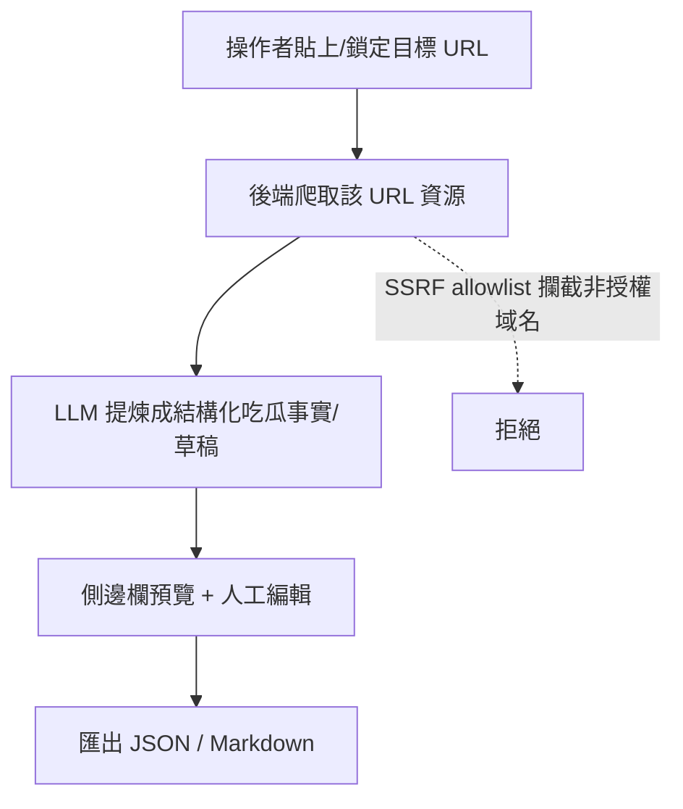

# 吃瓜小幫手 v0.1 — 品牌重塑 + 產品轉型

## Problem Frame

現有產品 `51publisher 發帖填充助手` 是一個「**AI 生成草稿 → 填入 51 後台發帖表單**」的工具。產品方向已變：

- 不再做**發布/填充**任何第三方後台。整套填充機器（三世界注入、Quill 橋接、安全發布閘門）失去存在理由。
- 真正要的是「**爬取目標站資源 → AI 提煉成吃瓜草稿**」。鎖定 URL 是核心能力。
- 品牌殘留「51publisher / 發帖」字樣，與新定位不符。
- 代碼庫已半路轉型（`gossip-*` 骨架已存在），但仍夾帶漫畫來源管線（`acgs51-adapter`、`ACGS51_*`、`51acgs.com`）這條舊尾巴。

v0.1 是「重新出發的第一個正式版」：砍掉發布半套、清掉漫畫殘留、完成品牌重塑。

## Product Shape（轉型前後對照）

| 維度 | 舊（51publisher） | 新（吃瓜小幫手 v0.1） |
|------|------------------|----------------------|
| 核心動作 | 生成草稿 → 填入後台發帖 | 鎖定 URL → 爬取 → AI 提煉草稿 |
| 終點 | 提交到第三方發帖表單 | 預覽編輯 → 匯出（不發布） |
| 注入面 | content / quill-bridge 三世界 | 不需要注入目標站，改為後端爬取 |
| 安全重點 | 零提交硬約束、發布閘門 | SSRF allowlist、爬取邊界、URL 鎖定 |
| 漫畫來源 | acgs51 adapter（保留） | 移除 |

## User Flow

## Requirements

**品牌重命名（Rename）**
- R1. 擴展顯示名與描述改為「吃瓜小幫手」，移除所有「51publisher / 發帖填充助手 / 發帖」字樣（manifest、README、UI 文案、面向用戶可見字串）。
- R2. npm 套件作用域 `@51guapi/*` → `@51guapi/*`；對應 4 個 `package.json` 的 `name` 與所有 import 路徑、`--filter` 引用同步更新。
- R3. 三包版本統一設為 `0.1.0`（root / extension / backend / shared），標記為新產品身分的首個正式版。
- R4. 代碼注釋與文檔中的品牌詞做替換，但不要求逐字清理歷史 plan 文檔（archive 可保留原樣）。

**移除發布/填充機器（Remove Publishing）**
- R5. 移除「填入目標後台」的整條鏈路：`content.ts` 三世界注入、`quill-bridge.content.ts`、`lib/fillers.ts`、`lib/safety-gate.ts` 發布閘門、`lib/grounding-gate.ts`、`lib/publish-orchestrator.ts`、`lib/batch-orchestrator.ts`、Quill 橋接、以及 `wxt.config.ts` 中針對發帖站的 `host_permissions` / content matches。
- R6. 移除與「發布」綁定的測試（零提交測試、e2e fixture 中針對 webarticle-add 表單的填充驗證）與相關 fixture。
- R7. 清理因 R5/R6 變成無人引用的型別、訊息橋接、設定項，保持 `pnpm compile` 全綠。

**移除漫畫來源（Remove Comic Source）**
- R8. 刪除漫畫來源 adapter `acgs51-adapter.ts`（含 test）。
- R9. 移除 `ACGS51_*` 環境變數（`ACGS51_ENABLED` / `ACGS51_START_URL` / `ACGS51_LIST_URL` / `ACGS51_CRON`）及其在 `env-check.ts`、`index.ts`、scheduler、`.env.example` 的條件分支。
- R10. 從 SSRF allowlist 與文檔中移除 `51acgs.com` 硬編碼；不以任何單一域名取代它（見 R11 的渠道模型）。

**強化爬取 + 提煉（Core Pipeline）**
- R11. **多渠道 URL 管理**是 v0.1 一級功能：操作者可持續新增多個爬取目標（每條渠道一個 URL/域名，例如 `https://51cg1.com/`），形成可累積的爬取渠道清單。每新增一個域名即進入 SSRF allowlist（fail-closed：清單外域名一律拒絕）。
- R12. 鎖定某條渠道後可對其 URL 發起爬取；保留並接上爬取結果 → `gossip-fact-extractor` LLM 提煉 → 結構化吃瓜草稿的流程，產出在側邊欄可預覽、可人工編輯。
- R13. 新增匯出能力：將提煉後的吃瓜草稿匯出為 JSON 與 Markdown（取代原本的「填入後台」終點）。

**倉庫（Repository）**
- R14. ✅ 已建立新 repo `redredchen02-rgb/51guapi`（public，空倉），作為 v0.1 正式起點（與舊 `51publisher` repo 切割）。改造完成後推首版代碼。

## Success Criteria

- 全代碼庫（面向用戶可見處 + 套件名）搜不到「51publisher / 發帖」字樣；顯示名為「吃瓜小幫手」。
- 搜不到 `acgs51` / `ACGS51_` / `51acgs.com` 漫畫殘留。
- 一條最小路徑可走通：新增一條爬取渠道（如 `51cg1.com`）→ 鎖定其 URL 爬取 → AI 提煉出吃瓜草稿 → 在側邊欄看到並編輯 → 匯出檔案。
- 可累積多條渠道，且非清單域名的爬取被 fail-closed 拒絕。
- `pnpm compile`、`pnpm test` 全綠（發布相關測試已隨機器一併移除，不是被跳過）。
- 後端 fail-closed 行為保持：非 allowlist 域名的爬取被拒。

## Scope Boundaries

- **不做任何發布/填充**——這是本次轉型的根本前提，不保留「以後可能要發帖」的開關或死代碼。
- 不重做欄位映射 / Quill 填充（整個刪除，不是改寫）。
- 不在 v0.1 引入新的爬取站 adapter 框架擴張；先讓單一目標站的 URL 鎖定爬取走通。
- archive 內歷史 plan 文檔不逐字清洗。

## Key Decisions

- **品牌**：顯示名「吃瓜小幫手」，npm scope `@51guapi`，版本歸零至 `0.1.0`（重新出發的正式版，刻意不延續 0.2.x）。
- **產品定位**：從「發帖填充」轉為「爬取 + AI 提煉吃瓜草稿」，終點是匯出而非發布。
- **複用而非重建**：吃瓜骨架（`gossip-routes` / `gossip-facts` / `gossip-fact-extractor` / `GossipView`）已存在，v0.1 是收尾與強化，不是從零打造。

## Dependencies / Assumptions

- 假設目標爬取站的內容可由現有 `scraper/` + adapter 機制處理；若目標站結構特殊，可能需新 adapter（規劃時確認）。
- 新 repo 的建立需要操作者授權的 GitHub 帳號/權限。

## Outstanding Questions

### Resolved
- ~~新目標爬取站域名~~ → 不是單一站。多渠道模型：操作者持續新增爬取目標（`51cg1.com` 為首個範例），各域名動態進 allowlist（見 R11）。
- ~~新 repo 名稱/owner~~ → owner 為 GitHub 帳號 `redredchen02-rgb`，用 `gh` CLI 建立；repo 名待 R14 最終確認（建議 `51guapi`）。

### Deferred to Planning
- [Affects R11][Technical] 渠道清單的儲存形式（SQLite 既有 config 軌 vs JSON）與 SSRF allowlist 如何即時讀取操作者新增的域名；新增渠道時的域名校驗規則。
- [Affects R13][Technical] 匯出格式除 JSON / Markdown 外是否要 CSV？欄位如何對應吃瓜事實結構。
- [Affects R5][Technical] 移除發布鏈路後，背景 service worker 的訊息路由與側邊欄狀態機需重新梳理，確認無懸空訊息類型。
- [Affects R12][Needs research] 現有 `gossip-fact-extractor` 的輸入是否假設了 acgs51 來源格式；若耦合需解耦成通用爬取輸入。

## Next Steps

→ 兩個阻塞問題已解決，可進 `/ce:plan`。建立新 repo 待操作者確認 repo 名後執行。
