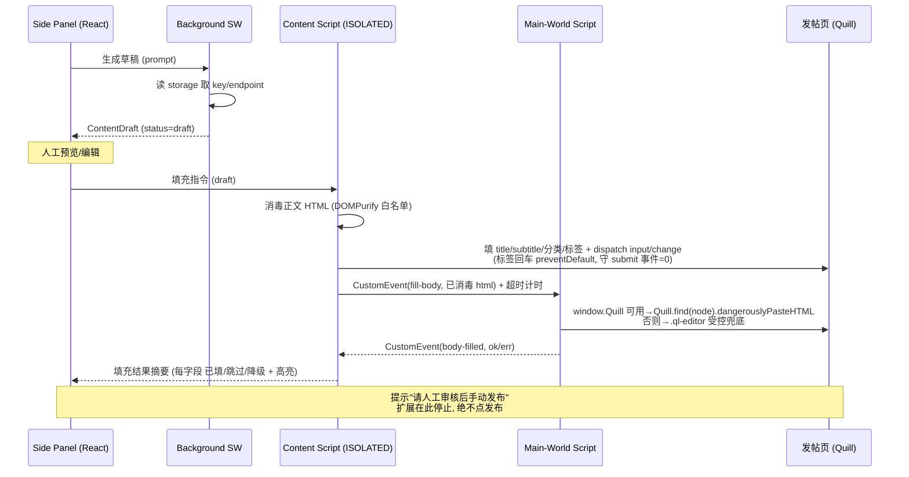
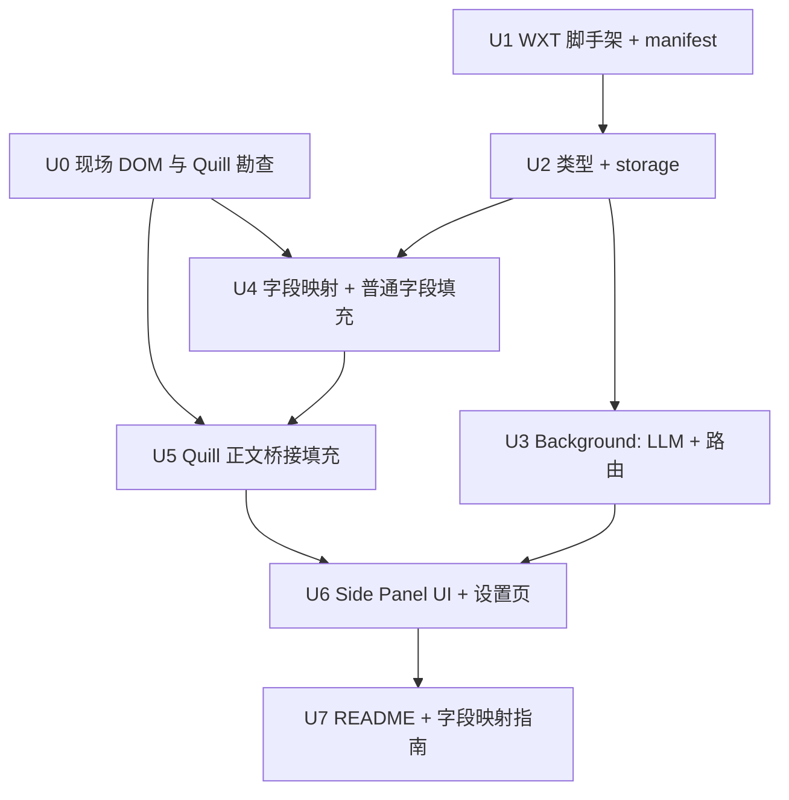

# feat: 51publisher 发帖填充助手(Chrome 扩展)

## Overview

构建一个 Manifest V3 Chrome 扩展,辅助 51publisher 后台的内容运营:在 side panel 里用大模型生成一条草稿 → 人工预览/编辑 → 一键填进后台发帖表单(正文走 Quill API)→ 人工审核修改 → **人工手动点发布**。扩展只"填充",绝不自动提交。技术栈:WXT + TypeScript + React。

## Problem Frame

运营逐条发帖,标题/副标题/分类/正文/标签全靠手敲,重复且慢(见 origin)。把"生成 + 填表"这段机械劳动自动化,人只留在审核、修改、发布的判断环节。**硬约束:绝不自动提交 / 不自动点发布,人工审核是硬性环节。**

## Requirements Trace

- R1. 单条闭环:一次处理一条,无后台队列/节流/重试(see origin: R1)
- R2. Side Panel 三个主操作:生成草稿 / 填充到当前页 / 下一条(see origin: R2)
- R3. 草稿填充前可在 side panel 内预览并手动编辑(see origin: R3)
- R4. 填充只写字段 + 触发必要事件,**绝不**触发提交或点发布(see origin: R4)
- R5. 填充后高亮已填字段 + 显式提示"请人工审核后手动发布"(see origin: R5)
- R6. 字段映射集中在一份可配置 map,选择器优先稳定属性(name/id/data-*/aria-label)(see origin: R6)
- R7. 正文用 Quill 实例 API(`dangerouslyPasteHTML`/`setContents`),不覆盖 innerHTML(see origin: R7)
- R8. 分类下拉:兼容原生 `<select>` 与自定义下拉(模拟点击 + 选项文本匹配)(see origin: R8)
- R9. 标签按后台实际输入形态填充(逐个输入 + 回车,形态待现场确认)(see origin: R9)
- R10. 插件直连大模型 API,请求统一在 background 发起(鉴权 + CORS)(see origin: R10)
- R11. API key 存 `chrome.storage.local`,不硬编码,设置页提示明文存储风险(see origin: R11)
- R12. 设置页可配:endpoint、API key、prompt 模板、字段映射(see origin: R12)
- R13. AI 生成内容初始状态 `draft`(see origin: R13)
- R14. 定义 `ContentDraft` 接口(id/title/subtitle/category/coverImageUrl/body/tags/status/createdAt);`coverImageUrl` 保留作预览,MVP 不填进表单(see origin: R14)
- R15. `host_permissions` 只声明 51publisher 后台域名(see origin: R15)
- R16. 不存储敏感凭证明文(用户自填 API key 除外,需风险提示)(see origin: R16)

**review 新增(深化派生,非新增产品范围)**
- R17. 正文 HTML 在写入 `dangerouslyPasteHTML` 前必须在隔离世界按白名单消毒(防 XSS,LLM 是最不可信输入)(deepen: security)
- R18. 用户可配 endpoint 限 `https://`、保存时校验 URL,并提示"API key 会发往该 endpoint"(防 key 外泄/SSRF)(deepen: security)
- R19. side panel 提供"填充结果摘要"面板:每字段显示 已填 / 跳过(未找到)/ 降级(需手动);存在跳过项时顶部汇总警示——服务"人工审核是硬性环节"的可靠性(deepen: design+product)
- R20. 字段映射 JSON 在设置页保存时做 JSON + schema 校验,给可读报错与"恢复默认/示例模板"(目标用户非技术)(deepen: design+security)

## Scope Boundaries

- **不**自动提交 / 不自动点发布(硬约束)
- **不**做批量队列、节流、指数退避重试(已确认单条闭环)
- **不**做封面图自动填充(MVP 人工上传;`coverImageUrl` 仅预览参考)
- **不**做多编辑器泛化检测(正文确定是 Quill,只适配 Quill)
- **不**做草稿库/历史持久化(单条闭环,处理完即走;**当前在编草稿的崩溃恢复除外**,见 U6)

## Success Criteria & Assumptions(deepen)

**省时价值验收门槛(deepen: product,P1)** — 整个项目核心价值是"显著快于纯手工录入"。这不能默认成立:写/调 prompt + 等 LLM + 通读审核改,对短文案可能比手敲还慢。验收时用 **5–10 条真实帖**对比"手工录入耗时"vs"生成+审核+填充耗时",不显著更快则需回 brainstorm 重审前提(也许真正省时点是"模板/片段库一键填充"而非每条都跑 LLM)。

**关键假设(deepen: product,P1)** — "下一条"的内容来源:假设**操作员自带选题清单**,逐条把主题贴进 prompt 输入框(U6 输入区据此设计,便于快速换主题)。若真实工作流是"一主题批量发多条"或"素材在外部表格",单条无队列设计会与节奏脱节,应回 brainstorm 确认。

## Context & Research

### Relevant Code and Patterns

- 全新项目,空目录,无既有代码可循。所有结构按 WXT 默认约定建立(`entrypoints/` 文件式入口、`lib/` 放共享代码)。

### Institutional Learnings

- `docs/solutions/` 无相关条目(项目全新)。

### External References

- WXT — 主世界注入:`world: 'MAIN'` content script(仅 Chromium,有限制)+ `injectScript` / `CustomEvent` 双向通信(https://wxt.dev/guide/essentials/content-scripts)。side panel / background 为一等入口。
- Quill — `Quill.find(domNode)` 从 DOM 节点取回已存在实例(**前提:页面把 `Quill` 暴露在主世界全局**);`quill.clipboard.dangerouslyPasteHTML(html)` 写入 HTML;`quill.setContents(delta)` 用 Delta 写入(https://quilljs.com/docs/api、/docs/modules/clipboard)。

## Key Technical Decisions

- **构建工具用 WXT(而非 Vite + @crxjs/vite-plugin)**:WXT 对 MV3 + side panel + 主世界 content script + TS 类型有内建脚手架与 HMR,省去 crxjs 的手工 manifest 拼装与已知的 side panel 配置坑;文件式入口让三层结构一目了然。成本侧与逃生路径:WXT 会替你生成 manifest 并约定 entrypoint/world,若其主世界封装与我们需要的注入时机/事件时序不吻合,需读懂 WXT 生成逻辑才能 debug;逃生路径是可手写 manifest 片段或退回原生。决策为低 reversal cost(早期换构建工具便宜),接受(deepen: adversarial)。
- **正文填充走"隔离世界 content script ↔ 主世界脚本"桥接,且优先用 WXT 文档化的 `injectScript`+`defineUnlistedScript` 模式**:隔离世界拿不到页面 `window.Quill` 与 Quill 实例,正文写入必须在主世界执行。两个独立注册的 content script 之间**没有加载顺序保证、也没有天然共享的事件目标**,所以采用 `injectScript` 返回的 script 元素作共享事件目标(天然解决就绪与目标约定);若坚持 `world:'MAIN'` 入口,则必须显式指定共享目标(`document`)+ 就绪握手(MAIN 加载后 dispatch `quill-bridge-ready`)+ 隔离端超时重试(deepen: feasibility)。
- **字段映射是一份可热改的配置对象,但其"可吸收范围"分级**:选择器集中一处。**Tier-A(选择器文本变化)= 改 config 即可;Tier-B(交互形态变化,如下拉变 combobox、标签变 chip)= 改 `fillers.ts` + config;Tier-C(编辑器更换 / shadow DOM / 字段动态化 / 多步表单)= 需改架构。** 不再宣称"任何改版只改一处"(deepen: adversarial)。
- **填充与提交彻底隔离 —— 边界守在"提交事件 + 导航"而非"按钮 click"**:代码不查询/不 click 任何发布/提交按钮、不调 `form.submit()`;**但更危险的是间接提交**——标签"输入+回车"在 `<form>` 内会触发浏览器原生提交(无 click、无 `submit()`)。因此零提交保证升级为:监听 `form` 的 `submit` 事件次数=0 + 页面无导航/无 `beforeunload`;标签回车 `preventDefault` 或走组件自身 add 触发器(deepen: adversarial,P0)。
- **正文 HTML 先消毒再过桥**:LLM 返回的 HTML 是系统里最不可信的输入,直接进 `dangerouslyPasteHTML` 会在主世界(你登录态的后台 origin)执行任意脚本。所以在隔离世界用 DOMPurify 按白名单(p/strong/em/ul·ol·li/a[href=http(s)]/标题等 Quill 支持的格式)消毒后,才把已消毒 HTML 交给主世界;主世界桥不做任何信任提升,且**永不接收/回传 API key 或任何扩展机密**,入站事件按不可信处理(deepen: security)。
- **大模型调用全部在 background,收敛到窄 provider adapter 接口**:side panel 只发指令,background 读 `chrome.storage.local` 里的 key/endpoint 后 fetch,规避 CORS 与 key 泄漏到页面上下文。`lib/llm.ts` 暴露 `buildRequest(prompt,settings)` / `parseResponse(raw)→ContentDraft` 的窄接口,首版只实现 OpenAI 兼容 provider,换厂商是"加一个 adapter"而非改 background 三处;endpoint 旁注明"仅支持 OpenAI 兼容格式"(deepen: adversarial)。

## Open Questions

### Resolved During Planning

- 用 WXT 还是 crxjs?→ WXT(理由见上)。
- 批量队列要不要做?→ 不做(origin 已锁单条闭环)。
- 封面图怎么处理?→ MVP 不填,人工上传。**U0 确认封面是 `input[type=file][name=file]` 上传,无 URL 输入框,跳过决策正确。**
- 正文编辑器是哪种?→ Quill,填充策略具体化为 Quill API。
- Quill 降级到底几档?→ 两档:① `window.Quill` 可用走 `Quill.find()`;否则 ② `.ql-editor` 受控兜底。删除原 tier ②"节点挂载实例引用"——Quill 不在 DOM 节点留可访问实例,该 API 不存在(deepen: feasibility,P0)。
- 零提交怎么证?→ 守 `submit` 事件 + 导航,而非按钮 click(deepen: adversarial,P0)。
- **【U0 已勘查,以下原"现场检查"项现已确认】**
  - 正文编辑器:**Quill 2.0.2,原生 vanilla(非 react-quill),`window.Quill` 全局可用**,容器 `#editor`。→ **P0-2 化解**:tier ① `Quill.find(document.querySelector('#editor')).clipboard.dangerouslyPasteHTML(html)` 直接可用;**P1 受控回写风险不适用**(vanilla 非 React)。
  - 字段选择器(均为 `name`):`title` / `subtitle`(text)、`type`(**原生 `<select>`**,选项 2=漫畫文章/4=動漫文章)、`tags[]`(**checkbox 多选,非 tag-input**,在 `div.tags-container`,约 3912 项,带搜索框)、`description`(textarea)、`status`(select)、`published_at`(date)、`media_id`、封面 `file`(上传)。
  - 分类形态:**原生 select**(非自定义下拉)→ U4 只需 native-select 分支。
  - 标签形态:**checkbox 勾选**(非"输入+回车")→ 原 tag-input 回车提交向量对本表单不适用;但表单含 `<form>`,零提交断言继续保留作保险。
  - 表单是 layui 弹层(`.layui-layer-content` 内联,非 iframe),由列表页「添加」按钮 JS 打开;`/add` 直接 GET 返回加密 JSON 错误——插件只前端填充,不碰其提交通道。
  - 域名:`dx-999-adm.ympxbys.xyz`(子域疑似可轮换,`host_permissions` 考虑 `*://*.ympxbys.xyz/*`)。
  - 详见 `docs/field-mapping-guide.md`。

### Deferred to Implementation

**现场 DOM 勘查 — ✅ U0 已完成**(2026-06-03,结果见上方 Resolved 与 `docs/field-mapping-guide.md`)。

范围问题(U0 新发现)— ✅ 已拍板:`description`/`postStatus`/`publishedAt`/`mediaId` **全部纳入填充**。`description` 由 AI 生成;其余三项在 side panel 由用户填写/默认值,随草稿填入(已写进 U2 ContentDraft 与 U4 fillers)。

其他延迟项:

- 直连哪家大模型、请求/响应 JSON 格式、是否流式;首版按"OpenAI 兼容 chat/completions"假设,设置页可配 endpoint。
- **[需实现时确认]** layui 日期组件(`published_at`,`x-date-time`)直接 set value 后能否正确回显与提交,还是需触发其内部 laydate 实例(实现时 devtools 验证;不行则改为模拟点击选日期或写其关联 hidden 字段)。

## High-Level Technical Design

> *以下用于沟通整体形态,是给 review 的方向性指引,不是实现规范。实现 agent 应将其当作上下文,而非照抄的代码。*

填充一条草稿时的跨层信息流:

## Implementation Units

单元依赖关系(非线性,U4/U5 并行后汇入 U6):

- [x] **Unit 0: 现场 DOM 与 Quill 勘查(前置,有交付物)— ✅ 已完成 2026-06-03**

**Goal:** 在真实 51publisher 发帖页实地勘查,产出 U4/U5 编码所需的事实,避免按假设返工。

**Requirements:** 解锁 R6/R7/R8/R9

**Dependencies:** 无(可与 U1 并行)

**Files:**
- Create: `docs/field-mapping-guide.md`(先落勘查结果;U7 再补使用说明)

**Approach:** 用浏览器 devtools 在发帖页确认并记录:① 各字段(title/subtitle/category/tags)的稳定选择器;② 分类是原生 `<select>` 还是自定义下拉、标签是 tag-input 还是别的形态;③ `typeof window.Quill` 与 `Quill.find(document.querySelector('.ql-editor'))` 是否可用,编辑器是否为受控组件(如 react-quill)——写入后手动触发一次无关 re-render,看正文是否被回写覆盖;④ 填一条后确认页面未发生 form submit / 未自动存为已发布 / 未跳转;⑤ 后台确切域名。

**Test scenarios:** Test expectation: none — 勘查单元,交付物是记录的事实。

**Verification:** ✅ `docs/field-mapping-guide.md` 已记结论:Quill 2.0.2 vanilla + `window.Quill` 可用(走 tier ①)、分类=原生 select、标签=checkbox 多选、封面=file 上传、表单为 layui 弹层、域名 `dx-999-adm.ympxbys.xyz`。

- [ ] **Unit 1: WXT 脚手架 + manifest 配置**

**Goal:** 建立 WXT + TS + React 项目骨架,配好 MV3 manifest(side panel、background、content scripts、最小 host_permissions)。

**Requirements:** R15

**Dependencies:** 无

**Files:**
- Create: `package.json`, `tsconfig.json`, `wxt.config.ts`, `.gitignore`
- Create: `entrypoints/background.ts`(占位)、`entrypoints/content.ts`(占位)、`entrypoints/sidepanel/index.html` + `main.tsx`(占位)

**Approach:**
- 用 WXT 的 React 模板初始化;`wxt.config.ts` 里声明 `host_permissions` 仅含 51publisher 域名占位符(实现时替换真实域名)。`permissions` 取最小:`['storage', 'sidePanel']`——**确认是否真需 `scripting`**:若 U5 走静态 `world:'MAIN'` 入口(WXT 自动写进 `content_scripts`)则不需要;若改走 `injectScript`,被注入脚本需声明为 unlisted + `web_accessible_resources`(deepen: feasibility,R15 最小权限)。
- side panel 用 `default_path` 指向 sidepanel 入口;在 `background.main()` 里调 `chrome.sidePanel.setPanelBehavior({ openPanelOnActionClick: true })` 实现点图标打开(deepen: feasibility)。

**Patterns to follow:** WXT 文件式入口默认约定。

**Test scenarios:**
- Test expectation: none — 纯脚手架/配置,无行为逻辑。验收靠构建产物正确。

**Verification:** `wxt build` 产出合法 MV3 manifest;扩展能加载,点图标能打开空 side panel。

- [ ] **Unit 2: 共享类型 + storage 封装**

**Goal:** 定义 `ContentDraft`、消息协议类型、设置(endpoint/key/prompt/字段映射)的 `chrome.storage.local` 读写封装。

**Requirements:** R11, R14, R16

**Dependencies:** U1

**Files:**
- Create: `lib/types.ts`(`ContentDraft`、`DraftStatus`、消息 union 类型、**字段映射类型 `FieldType`(枚举 text/quill/native-select/custom-dropdown/tag-input)与 `FieldDefinition`(selector + fieldType + label?)与 `FieldMapping`**)
- Create: `lib/storage.ts`(`getSettings`/`saveSettings`/`getApiKey`/`saveApiKey`)
- Test: `lib/storage.test.ts`

**Approach:**
- `ContentDraft`: `id, title, subtitle, category, coverImageUrl, body, tags[], status('draft'|'filled'|'published'), createdAt`。`coverImageUrl` 字段保留:U6 `DraftPreview` **应渲染其缩略图作预览**(否则该字段在 MVP 无消费者,见 deepen: scope-guardian)。
- **U0 新增字段(用户已确认全部纳入填充,deepen)**:`description`(描述/摘要)、`postStatus`(后台显示/隐藏,映射 0/1,**注意与内部 `status` 草稿状态字段区分**)、`publishedAt`(发布时间 yyyy-MM-dd)、`mediaId`(作品 id)。来源区分:**`description` 由 AI 生成**;`postStatus`/`publishedAt`/`mediaId` **不由 LLM 生成**,在 side panel 由用户填写或取默认值后随草稿一起填入。
- storage 封装提供带默认值的读取;key 单独存取,写入时不混入其他对象。
- 消息类型定义 side panel↔background↔content 的指令/响应形状,供三层共享。

**Patterns to follow:** WXT 的 `storage` API 或 `browser.storage.local` 包一层。

**Test scenarios:**
- Happy path:`saveSettings` 后 `getSettings` 取回同值。
- Edge case:storage 为空时 `getSettings` 返回带默认值的对象(不抛错)。
- Edge case:`getApiKey` 在未设置时返回空字符串/undefined 而非崩溃。

**Verification:** 测试通过;类型在三层入口均可 import。

- [ ] **Unit 3: Background — 大模型调用 + 消息路由**

**Goal:** background 接收 side panel 的"生成草稿"指令,读 storage 取 key/endpoint,fetch 大模型,返回 `ContentDraft`(status=draft)。

**Requirements:** R10, R13, R18

**Dependencies:** U2

**Files:**
- Modify: `entrypoints/background.ts`
- Create: `lib/llm.ts`(窄 provider adapter:`buildRequest`/`parseResponse`,首版只实现 OpenAI 兼容 chat/completions)
- Test: `lib/llm.test.ts`

**Approach:**
- background 注册消息监听,路由 `GENERATE_DRAFT` 到 `lib/llm.ts`。**消息契约钉死**:监听器**同步 `return true`**,fetch 完成后再 `sendResponse`(否则 MV3 会立即关通道,side panel 静默卡死——MV3 最常见坑);fetch 加 `AbortController` 超时(deepen: feasibility,P1)。
- `lib/llm.ts` 经 adapter `buildRequest(prompt,settings)` 发请求,`parseResponse(raw)` 解析出 title/subtitle/category/body/tags/**description** 组装 `ContentDraft`,`status='draft'`,`createdAt` 填当前时间。`postStatus`/`publishedAt`/`mediaId` 不由 LLM 产出(由 side panel 取默认/用户填)。
- endpoint 保存前已校验为 `https://`(R18);鉴权头从 storage 读,不硬编码。
- **错误脱敏**:结构化错误与任何日志**不得含 Authorization 头、API key、原始请求头**;返回前 redact(deepen: security,P3)。

**Patterns to follow:** WXT `defineBackground` + `browser.runtime.onMessage`(或封装好 promise 语义的 `@webext-core/messaging`)。

**Test scenarios:**
- Happy path:给定正常 LLM 响应(mock fetch),解析出完整 `ContentDraft`,status='draft'。
- Happy path:异步响应正确回传(监听器 `return true` 路径)——防实现者写成 `async` 直接 return(deepen: feasibility)。
- Error path:fetch 返回 4xx/5xx 时,返回结构化错误而非抛未捕获异常。
- Error path:响应结构与 OpenAI 不符 / JSON 缺字段时,降级并区分"网络错"与"格式不兼容",不崩溃(deepen: adversarial)。
- Error path:fetch 超时(AbortController 触发)返回可重试错误(deepen: feasibility)。
- Edge case:未配置 API key 时,直接返回"请先在设置页配置 key"的错误,不发请求。
- Security:错误对象/日志中不出现 key 或 Authorization 头(deepen: security)。

**Verification:** mock fetch 下测试通过;手动配好 key 后 side panel 能拿到一条草稿;断网/超时有可重试提示。

- [ ] **Unit 4: 字段映射 + 普通字段填充(隔离世界 content script)**

**Goal:** 定义可配置字段映射;content script 接收填充指令,填 title/subtitle/分类/标签并触发事件、高亮已填字段,**绝不提交**。

**Requirements:** R4, R5, R6, R8, R9, R17, R19

**Dependencies:** U0, U2

**Files:**
- Create: `lib/field-mapping.ts`(映射配置实例;**类型 `FieldType`/`FieldDefinition`/`FieldMapping` 从 U2 的 `lib/types.ts` 引入,本文件只提供配置数据**)
- Create: `lib/fillers.ts`(各类型填充函数 + 高亮 + 逐字段结果状态)
- Create: `lib/sanitize.ts`(正文 HTML 白名单消毒,基于 DOMPurify)
- Modify: `entrypoints/content.ts`(隔离世界,接收消息、调 fillers、消毒后转发正文给主世界、汇总结果回 side panel)
- Test: `lib/fillers.test.ts`、`lib/sanitize.test.ts`(jsdom)

**Approach:**
- 每个字段在映射里给:稳定选择器 + 类型。**U0 已确认本表单的实际形态,只实现命中的分支**(deepen: scope-guardian):
  - text(`title`/`subtitle`):set value + dispatch `input`/`change`。
  - native-select(`type` 分类):set value + dispatch `change`;按 value 或文本匹配(选项 2=漫畫文章/4=動漫文章)。**无需 custom-dropdown 分支。**
  - **checkbox 多选(`tags[]` 标签,非 tag-input)**:按标签名匹配 `div.tags-container` 内对应 checkbox 并勾选 + dispatch `change`;**不 dispatch 任何回车**(本表单标签无"输入+回车"形态,从源头避开回车提交)。可选:用搜索框 `input[placeholder="输入关键字自动筛选"]` 辅助定位。
  - `description`(`textarea[name=description]`):同 text(AI 生成内容)。
  - `postStatus`(`select[name=status]`):native-select,填用户所选/默认(0 隐藏/1 显示)。
  - `publishedAt`(`input[name=published_at]`,layui `x-date-time` 日期选择器):set value + dispatch `change`;**注意 layui 日期组件可能维护内部状态,直接赋值后是否回显需实现时确认**(见 Deferred)。
  - `mediaId`(`input[name=media_id]`):text,填用户所填的作品 id。
- 每字段产出结果状态:`已填 / 跳过(未找到)/ 降级`,汇总回 side panel(R19);已填元素加高亮(规格见 U6)。
- 正文先经 `lib/sanitize.ts` 白名单消毒(R17),再转发给主世界脚本(U5)。
- content script 不查询、不 click 任何提交/发布按钮(硬边界,可代码审查)。

**Execution note:** **零提交断言先行且升级监测面**(deepen: adversarial,P0):不再只数按钮 click,而是断言整个填充流程后 `form` 的 `submit` 事件次数=0、无导航(`beforeunload`/URL 不变)、无 `form.submit()` 调用。这覆盖"标签回车原生提交""change handler 自动保存/跳转"等间接路径。

**Patterns to follow:** WXT `defineContentScript`(ISOLATED)。

**Test scenarios:**
- Happy path(text):填 title → input.value 正确且 `input` 事件触发。
- Happy path(命中的下拉分支):按 U0 确认的形态(native-select 或 custom-dropdown)选中正确项并触发事件。
- Happy path(tag-input):多个 tag 写入;**回车被 `preventDefault`,不触发 form submit**。
- Edge case:选择器找不到元素时,该字段记为"跳过(未找到)"并继续其他字段(R19)。
- **Error/边界(硬约束,P0)**:完整填充后 `form` 的 submit 事件计数=0、无导航、无 `form.submit()`;即使某字段选择器误指向 submit 控件也不得提交。
- Security(消毒):正文含 `<script>` / `on*` 属性 / `javascript:` href 时被 `lib/sanitize.ts` 剥除(deepen: security,R17)。
- Edge case:已填字段被加上高亮 class,并产出对应结果状态。

**Verification:** jsdom 测试通过;零提交断言(submit 事件=0 + 无导航)绿灯;消毒测试绿灯。

- [ ] **Unit 5: Quill 正文桥接填充(主世界脚本)**

**Goal:** 主世界脚本接收**已消毒**正文 HTML,按两档策略写入 Quill,结果回传隔离世界;带就绪握手与超时,正文写不进时明确降级为"手动粘贴"。

**Requirements:** R7

**Dependencies:** U0, U4

**Files:**
- Create: 主世界脚本(优先 `injectScript` 注入的 unlisted 脚本;若用入口则 `entrypoints/quill-bridge.content.ts` 设 `world: 'MAIN'`)
- Modify: `entrypoints/content.ts`(dispatch `fill-body`、listen `body-filled` + ready 握手 + 超时)
- Test: `lib/quill-bridge.test.ts`

**Approach:**
- **就绪握手 + 共享目标**(deepen: feasibility,P1):优先用 WXT 文档化的 `injectScript`+`defineUnlistedScript`,以返回的 script 元素作共享事件目标;若用 `world:'MAIN'` 入口,则以 `document` 为目标,MAIN 加载后 dispatch `quill-bridge-ready`,隔离端发 `fill-body` 后启动**超时**(如 3s),超时未收 `body-filled` 即判定桥未就绪 → 降级"手动粘贴"。
- **写入策略 — U0 已确认走 tier ①**(deepen: feasibility,P0):`window.Quill`(2.0.2 vanilla)全局可用 → `Quill.find(document.querySelector('#editor')).clipboard.dangerouslyPasteHTML(已消毒 html)`。tier ②(`.ql-editor` 受控兜底)保留作极端情形,正常不会触发。不直接覆盖 `.ql-editor.innerHTML`。
- **受控组件回写防护 — U0 确认不适用**(deepen: adversarial,P1):本站为 vanilla Quill(非 react-quill),无 React re-render 回写覆盖问题。此防护降级为"仅在未来后台换成受控组件时才需要"的备注。
- 主世界桥**永不接收/回传 API key 或任何机密**,入站事件校验 payload 形状、忽略未知类型(deepen: security)。

**Execution note:** 依赖 U0 的勘查结论(Quill 可用性、是否受控、回写是否覆盖)决定走哪档与是否需受控入口。

**Technical design:** *(方向性指引,非实现规范)* `fill-body(已消毒 html)` → 主世界 handler → 取实例(档①)或受控兜底(档②)→ dispatch `body-filled{ok|err}`;隔离端超时未收即降级。

**Patterns to follow:** WXT `injectScript` / `world: 'MAIN'` + CustomEvent 双向通信(见 External References)。

**Test scenarios:**
- Happy path:给定可用 mock Quill 实例,已消毒 HTML 经 `dangerouslyPasteHTML` 以正确参数写入,回传 ok。
- Error path:拿不到任何 Quill 实例 → 回传结构化错误(side panel 提示"正文需手动粘贴"),不抛异常。
- Edge case:空 HTML 不报错。
- **说明**:跨世界(MAIN/ISOLATED)真实隔离、加载顺序、`Quill.find` 真实可用性**无法在 jsdom 单测证明**(jsdom 单一全局,事件必然收到,会"绿灯但无意义")——这些移出单测、列为 **U0/真机验证项**,与 System-Wide Impact 的 integration coverage 一致(deepen: feasibility)。

**Verification:** 单测覆盖上述实例可用/不可用/空三态;就绪握手与超时在真机验证;真实页填充后正文显示正常、可继续编辑,**且触发一次无关 re-render 后正文未被回写覆盖**。

- [ ] **Unit 6: Side Panel UI + 设置页**

**Goal:** React side panel:生成草稿 / 预览编辑 / 填充到当前页 / 下一条,顶部常驻"不会自动发布"提示;设置页配 endpoint/key/prompt/字段映射(key 存储带风险提示)。

**Requirements:** R1, R2, R3, R5, R11, R12, R18, R19, R20

**Dependencies:** U3, U5

**Files:**
- Modify: `entrypoints/sidepanel/main.tsx`
- Create: `entrypoints/sidepanel/App.tsx`、`Settings.tsx`、`DraftPreview.tsx`、`FillResultPanel.tsx`
- Create: `lib/messaging.ts`(side panel→background / →active tab content script 的发送封装)
- Test: `entrypoints/sidepanel/App.test.tsx`、`Settings.test.tsx`、`FillResultPanel.test.tsx`

**Approach:**
- 状态机:`empty → generating → draft(可编辑) → filling → filled | partial`;"下一条"重置回 empty。
- "生成草稿"发 `GENERATE_DRAFT`;"填充到当前页"把当前(可能已编辑的)草稿发给 active tab 的 content script。
- 预览/编辑区除 AI 生成字段(title/subtitle/category/body/tags/description)外,还提供 `postStatus`(默认显示/隐藏)、`publishedAt`(默认今天或留空)、`mediaId`(用户填)三项**非 AI 字段**的输入,随草稿一起填入(U0 新增)。
- **过渡态有内容**(deepen: design,P2):`generating`/`filling` 显示加载文案 + 禁用相关按钮防重复;`generating` 提供"取消";LLM/填充均设超时,超时入结构化错误并可重试。
- **填充结果摘要面板 `FillResultPanel`**(deepen: design+product,P1,R19):每字段显示 已填(绿)/ 跳过-未找到(黄,提示检查映射或手动填)/ 降级-需手动(红,如正文需手动粘贴);有跳过项时顶部汇总警示——让"人工审核"有可操作依据。
- **正文降级闭环**(deepen: design,P2):`partial` 状态下正文区提供"复制正文"(纯文本/HTML)按钮;`partial` 下点"下一条"二次确认("正文尚未确认填入,确定进入下一条?")。
- **当前草稿崩溃恢复**(deepen: product+adversarial,P2,≠草稿库):草稿状态变更(含人工编辑)写入 `chrome.storage.local` 一份,side panel 重开时回填"上一条未完成草稿",提供"清空";"下一条"/发布完成时清除。
- 顶部常驻提示条:"插件不会自动发布,请人工审核后手动发布"(R5)。
- 设置页:endpoint(保存时校验 `https://`,旁注"仅支持 OpenAI 兼容格式"+"key 会发往此 endpoint",R18)/ key(显式红字"明文存储于本地浏览器",R11)/ prompt 模板 / 字段映射。**字段映射编辑器**(deepen: design+security,R20):失焦/保存做 `JSON.parse` + schema 校验(每条含 selector+合法 fieldType),失败给可读报错,提供"恢复默认/示例模板";常见字段尽量表单化,JSON 作高级模式。
- **无障碍**(deepen: design,P3):三个主操作可 Tab 到并 Enter 触发;状态变更(草稿就绪/填充完成/错误)用 `aria-live` 播报;高亮/状态不只靠颜色(配图标/文字)。
- 轻量组件库:极简手写或轻量库,避免重型 UI 依赖(origin 约束)。

**Patterns to follow:** WXT React side panel 入口;`browser.runtime.sendMessage` / `browser.tabs.sendMessage`。

**Test scenarios:**
- Happy path:点"生成草稿"→ `generating`(显示加载+禁用按钮)→ 收到草稿渲染可编辑预览。
- Happy path:预览里改标题后"填充到当前页",payload 含编辑后的值(R3)。
- Happy path:`FillResultPanel` 按返回的逐字段状态渲染 已填/跳过/降级,有跳过项时显示顶部警示(R19)。
- Edge case:正文降级失败 → `partial` 态,正文区出现"复制正文";"下一条"二次确认(R19/P2)。
- Edge case:未配置 key 时点生成,展示"请先到设置页配置"。
- Edge case:LLM/填充超时 → 显示可重试错误,不卡在 generating/filling(deepen: feasibility)。
- Happy path(设置回填):保存后重开字段回填;key 区显示风险提示。
- Error path(设置校验):字段映射填非法 JSON / 缺 selector → 显示可读报错且不保存坏配置;endpoint 填 `http://` 被拒(R18/R20)。
- Edge case(恢复):编辑草稿后重开 side panel → 回填未完成草稿;点"清空"清除。

**Verification:** 组件测试通过;真机走通"生成→编辑→填充→(完整/partial)→下一条"全流程;提示条与结果摘要始终可见;键盘可走通全流程。

- [ ] **Unit 7: README + 字段映射填写指南**

**Goal:** 文档:安装、配置(endpoint/key/prompt)、使用流程、如何按自己后台页面填写字段映射、Quill 兜底路径的局限说明。

**Requirements:** R6(可维护性)、R5/R16(风险与边界说明)

**Dependencies:** U6

**Files:**
- Create: `README.md`
- Create: `docs/field-mapping-guide.md`

**Approach:**
- README:加载未打包扩展步骤、设置页配置、单条闭环用法、"绝不自动发布"边界声明;**安全说明**:API key 明文存储于本地浏览器、key 会发往所配 endpoint、仅 Chromium 内核支持。
- 字段映射指南(承接 U0 勘查结果):用 devtools 找稳定选择器的步骤、每种字段类型怎么填、**改版可吸收范围分级(Tier-A 改 config / Tier-B 改 fillers / Tier-C 需改架构)**、Quill **两档**写入路径与"正文可能需手动粘贴"的局限。

**Test scenarios:**
- Test expectation: none — 文档单元。

**Verification:** 一个没看过代码的人能照 README 装好、配好、填好映射并跑通一条。

## System-Wide Impact

- **Interaction graph:** side panel → background(LLM)、side panel → content script(ISOLATED)→ 主世界脚本(Quill)。三处用 runtime/tabs message + CustomEvent 解耦。
- **Error propagation:** LLM 失败、字段缺失、Quill 拿不到、桥超时——每层返回结构化错误,在 side panel 以逐字段状态/提示呈现;任何失败都不得回退成"自动提交"。
- **Shadow paths(下游静默缺席):** 主世界脚本未就绪/未收到事件时,隔离端 `fill-body` 后须有超时,否则 side panel 卡在 `filling`;超时 → `partial` + "正文手动粘贴"(deepen: feasibility)。
- **State lifecycle risks:** 不做草稿库,但**当前在编草稿(含人工编辑)写 `chrome.storage.local` 做崩溃恢复**——side panel 是独立文档、SW 会被回收、目标页可能刷新,否则"白干一条"(deepen: product+adversarial)。避免 content script 残留监听导致重复填充。
- **API surface parity:** 无外部对接方;字段映射是唯一"对页面契约",其可吸收范围分 Tier-A/B/C(见 Key Decisions)。
- **Integration coverage:** 跨世界 CustomEvent 往返、加载顺序、`Quill.find` 真实可用性 **jsdom 证不了**,列为 U0/真机验证;side panel↔content 的 tabs 消息同理。
- **Unchanged invariants(硬边界):** 不查询/点击发布或提交按钮、不调 `form.submit()`,**且不经由任何间接路径触发提交**(标签回车、change handler 自动保存/跳转);由 U4 升级后的零提交断言(`submit` 事件=0 + 无导航)守护。这是 R4 的实现级强约束,比"不点按钮"更严。

## Threat Model(deepen: security)

> 为一个持有 API key 并向登录态后台注入外部 HTML 的工具,先点名 top 攻击路径,确保缓解被设计进去而非事后补。

| 攻击路径 | 影响 | 缓解(对应单元) |
|---|---|---|
| LLM/endpoint 返回恶意 HTML,经 `dangerouslyPasteHTML` 在主世界(后台 origin)执行脚本 | 最可能;以运营登录态执行 | 隔离世界白名单消毒后再过桥(U4,R17) |
| 误配/恶意 endpoint 从特权 background fetch 时连带 Authorization 头外泄 key,或打内网/loopback(SSRF) | 最高影响 | endpoint 限 `https://` + URL 校验 + "key 会发往此处"提示(U3/U6,R18) |
| 页面自身 dispatch `fill-body` 驱动主世界桥,或监听 `body-filled` 探测 | 中;主世界与页面同上下文 | 桥只暴露正文填充、永不收发机密、入站事件按不可信校验(U5) |
| 错误日志/返回体带出 key 或 Authorization 头 | 中 | 返回前 redact(U3,P3) |

## Risks & Dependencies

| Risk | Mitigation |
|------|------------|
| ~~页面未暴露 `Quill`~~ | ✅ U0 已解:`window.Quill` 2.0.2 全局可用,走 tier ①;兜底档保留作极端情形 |
| ~~react-quill 受控回写覆盖~~ | ✅ U0 已解:本站 vanilla Quill,不适用;仅后台未来改受控组件时才需重审 |
| **间接自动提交**(标签回车原生提交 / change handler 自动保存跳转) | 零提交断言守 `submit` 事件=0 + 无导航;回车 `preventDefault`;U0 真机确认填一条不提交(U4,P0) |
| 后台改版导致选择器失效 | 选择器集中一处 + Tier-A/B/C 分级(不再宣称"任何改版只改一处");指南教用户更新 |
| 主世界↔隔离世界桥接竞态/未就绪 | 优先 `injectScript` 模式;否则 ready 握手 + 超时重试 + 降级(U5) |
| MV3 SW 在长 fetch 被回收 / 异步消息丢失 | 监听器同步 `return true` + `sendResponse`;`AbortController` 超时(U3) |
| LLM 返回恶意 HTML 经 `dangerouslyPasteHTML` 在后台 origin 执行 | 隔离世界白名单消毒后再过桥(U4,R17) |
| 可配 endpoint 致 key 外泄 / SSRF | 限 `https://` + URL 校验 + "key 会发往此处"提示(U3/U6,R18) |
| 主世界 content script 仅 Chromium 支持且有限制 | 目标即 Chrome,可接受;README 注明仅 Chromium |
| API key 明文存于 `chrome.storage.local`,或经日志泄露 | 设置页风险提示;不硬编码;错误/日志 redact(R11/R16) |
| LLM 响应格式因厂商而异 | 窄 provider adapter;首版只实现 OpenAI 兼容;失败区分"网络错/格式不兼容"不崩溃 |
| 核心省时价值不成立(生成+审核 ≥ 手敲) | 用 5–10 条真实帖做耗时对比当验收门槛(见 Success Criteria) |

## Documentation / Operational Notes

- README 与字段映射指南随 U7 交付。
- 仅支持 Chromium 内核浏览器(主世界 content script 限制),需在 README 注明。
- 无后端、无部署;以"加载未打包扩展"方式本地使用。

## Sources & References

- **Origin document:** [docs/brainstorms/2026-06-03-publisher-fill-assistant-requirements.md](docs/brainstorms/2026-06-03-publisher-fill-assistant-requirements.md)
- WXT 内容脚本与主世界注入:https://wxt.dev/guide/essentials/content-scripts
- WXT 入口配置:https://wxt.dev/guide/essentials/entrypoints
- Quill API(`find`/`setContents`):https://quilljs.com/docs/api
- Quill Clipboard(`dangerouslyPasteHTML`):https://quilljs.com/docs/modules/clipboard
