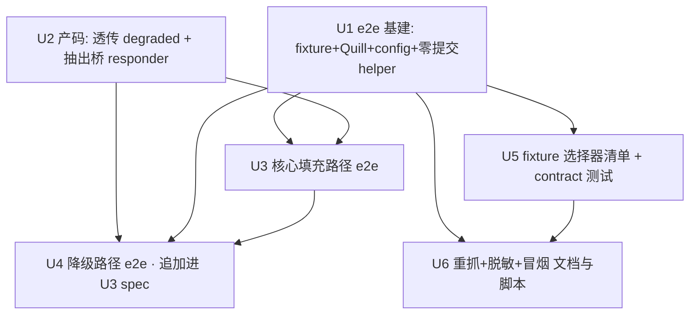

# feat: 迭代节奏与核心填充路径 e2e 测试

## Overview

填充助手主体已建完(56 单测全绿),但所有测试都在 jsdom 里靠 mock 跑,**没有一处验证「真的把草稿填进带真实 Quill 的发帖表单、且没触发提交」**。本计划补两样:① 一条对**本地 fixture**(真实 Quill 2.0.2 + 真表单结构)跑的核心填充路径 e2e,守住「字段填对 + 正文进 Quill + 零提交」;② 一套防漂移 + 迭代机制(重抓快照、contract 测试、人工冒烟、脱敏闸门)。

顺带修一个核对中发现的真 bug:降级写入(tier②)时 `quill-bridge.content.ts` 丢掉了 `degraded` 旗标,导致质量较差的兜底写入被面板误显示成绿色「已填」(用户已拍板修产码)。

## Problem Frame

(see origin: docs/brainstorms/2026-06-04-iteration-and-e2e-testing-requirements.md)

插件命脉是「字段映射对得上后台 DOM」。后台一改版选择器失效,插件**静默挂掉**。现有 mock 单测无法发现这类断裂,也无法证明真实 Quill 下正文写入与零提交成立。本计划用「贴近真实的 fixture e2e」补上验证盲区,用「重抓 + contract + 人工冒烟」管理后台漂移——并诚实承认:**对方后台漂移只能事后被动发现**,不是主动预警。

## Requirements Trace

- R1/R2/R3. 静态 HTML fixture(真 Quill 2.0.2、`#editor`、所有目标字段),纳入仓库、无网络无登录可加载,顶部注释记录抓取元信息 → **U1**
- R4. e2e 绕过 Side Panel,直接触发一次填充,用固定 `ContentDraft` → **U3**
- R5. e2e 断言:每字段正确写入、正文进 Quill(过 Quill 规范化后一致)、`submit`=0 / 无导航 / 未点发布 → **U3**
- R6. 降级路径(`window.Quill` 不可用 → 兜底 → 标记 `degraded`)端到端可断言,仍零提交 → **U2(产码透传)+ U4(e2e)**
- R7. 不自动化 Side Panel;由现有 jsdom 组件测试覆盖 → 范围排除,见 Scope Boundaries
- R8/R14. 可重复执行的重抓快照步骤 + **强制脱敏闸门**(剥 token/cookie/PII/内部 URL) → **U6**
- R9. fixture 顶部关键选择器清单 + contract 测试断言选择器存在 → **U5**
- R10. 人工冒烟清单(改版/重抓后人工真后台填一遍、确认不发布、逐项打勾) → **U6**
- R11. 文档写出 fixture 路线已知局限(快照、被动漂移发现、非逐字副本) → **U6**
- R12. 快循环:改码 → `pnpm test` → `pnpm test:e2e` → 全绿才提交,e2e 可进 CI → **U1(脚本/配置)**
- R13. 慢循环:重抓 → 看 contract 红 → 改映射/fillers(参 Tier 分级) → 人工冒烟 → 更新指南 → **U6(文档化)**

## Scope Boundaries

- **不**自动化 Side Panel UI 的端到端(R7);它由现有 `entrypoints/sidepanel/*.test.tsx` 覆盖。
- **不**做对真后台的自动化登录 + 自动填充回归;真后台只做**人工**冒烟(U6 的 checklist)。
- **不**做对真后台选择器的自动定期探针——**接受漂移被动发现**(2026-06-04 brainstorm 拍板)。
- **不**追求 e2e 覆盖所有字段组合/边界;只守「核心填充路径(U3)+ 一条降级路径(U4)」。
- **不**引入 Playwright / Vitest browser mode 等重型 runner,除非 U1 的 spike 证明真实 Quill 在 jsdom 跑不起来(初步探针显示能跑,见下)。

## Context & Research

### Relevant Code and Patterns

- `lib/fillers.ts` — `fillDraft(draft, mapping, doc)` 纯函数、可注入 `doc`;只 set value + input/change + checkbox 勾选,**绝不派发 Enter、绝不点提交**。e2e 直接调用即可驱动非正文字段。
- `lib/quill-paste.ts` — `pasteIntoQuill(html, selector, win, doc)` 纯函数、可注入 `win`/`doc`;tier① 走 `win.Quill.find(node).clipboard.dangerouslyPasteHTML`,tier② 兜底返回 `{ok:true, degraded:true}`。
- `lib/body-bridge.ts` — `requestBodyFill(html, selector, timeoutMs, target)` 隔离端协议,`target` 默认 `document`、可注入。类型 `FillBodyDetail` / `BodyFilledDetail`(**当前缺 `degraded`**)/ `BodyFillOutcome`。
- `entrypoints/quill-bridge.content.ts` — MAIN 世界监听 `EVT_FILL_BODY` → `pasteIntoQuill` → 回 `EVT_BODY_FILLED`。**第 24 行 `{ ok: res.ok }` 丢掉了 `res.degraded`**(本计划 U2 修)。监听逻辑目前内嵌在 `defineContentScript().main()` 里,e2e 无法直接 import → U2 抽出可复用的 responder 安装函数。
- `entrypoints/content.ts` — `handleFill` 调 `fillDraft` + `sanitizeBody` + `requestBodyFill`,`outcome.ok ? 'filled' : 'degraded'`(U2 后改为消费 `degraded` 旗标)。
- 现有测试范式:`lib/fillers.test.ts`(含零提交断言)、`lib/quill-paste.test.ts`(mock `window.Quill` + tier② 降级)、`lib/body-bridge.test.ts`(reqId + 超时)。e2e 沿用 vitest + jsdom 范式,但加载**真** Quill。
- `docs/field-mapping-guide.md` — U0 勘查的全部稳定选择器(`input[name="title"]`、`select[name="type"]`、`textarea[name="description"]`、`input[name="tags[]"]`、`#editor` 等)+ Tier 分级(A 改 config / B 改 fillers / C 改架构)。fixture 与 contract 清单据此构造。

### Institutional Learnings

- 无 `docs/solutions/`(本项目尚无沉淀);本计划 U6 产出的「重抓 + 脱敏 + 冒烟」流程是首条可复用运维知识。

### External References

- 未启用外部研究:WXT 0.20.26 / Vitest 4.1.8 / jsdom 29 / Quill 2.0.2 用法均已知且本会话已实践。

## Key Technical Decisions

- **e2e 跑在 jsdom + 真 Quill,不上重型 runner**:信心检查确认 jsdom 29 提供 Quill 所需全部原语(`getSelection`/`Range`/`MutationObserver`/`createRange`),`new Quill` 不会因缺 API 抛错,`dangerouslyPasteHTML` 能写进 `.ql-editor`。**但写入不是同步的**(jsdom 的 MutationObserver 走微任务、`getBoundingClientRect` 返回全 0),断言前需 flush 一拍微任务。故 U1 的 spike 是**真软门**(判据:构造不抛 + flush 后内容已变),不是走过场;失败则回退 happy-dom,见 U1 Approach。
- **e2e 价值分层(must-have / value-add)**:must-have = 真表单 DOM 上的「字段填对 + 零提交」(只需 fixture,不依赖真 Quill);value-add = 真 Quill 的 paste 保真。即使真 Quill 跑不起来,e2e 靠 must-have 仍站得住。
  - ⚠️ **诚实的 do-nothing baseline(评审拈出)**:must-have 这层其实与现有 `fillers.test.ts`/`body-bridge.test.ts` 单测**高度重叠**(它们已测字段填充与零提交)。e2e 真正的净新价值在 **value-add 层——真 Quill 在真实字段 DOM 上的 paste 保真 + 消毒落地**。所以这套 e2e 基建值不值得,系于 value-add 能否成立;信心检查 + 本轮可行性已验证「真 Quill 2.0.2 ESM 可 import、`find()` 静态存在、jsdom round-trip 通」,value-add 大概率成立,故建造成立。若 spike 与 happy-dom 双双失败导致 value-add 落空,应回退到「保留现有单测、不建 e2e」而非硬上重型 runner。
- **正文断言对象 = 过 Quill 规范化后的预期 HTML**,不是与草稿逐字相等(Quill clipboard 白名单会改写标签)。U3 用「已知良好的规范化输出」做断言基准。
- **修产码透传 degraded(R6)**(2026-06-04 拍板):`BodyFilledDetail` / `BodyFillOutcome` 加 `degraded` 字段、桥转发 `res.degraded`、`content.ts` 映射成 `status='degraded'`。修掉「兜底写入被误显示为绿色已填」的真 bug。
- **e2e 走「桥的完整往返」而非绕过桥**:U2 把 MAIN 端 responder 抽成可复用安装函数,e2e 在同一 jsdom realm 同时挂「隔离端 `requestBodyFill`」与「MAIN 端 responder」,让 `EVT_FILL_BODY`/`EVT_BODY_FILLED` 真往返——顺带覆盖 reqId/超时路径。
- **committed fixture 必须零机密**:R1 要「从真实表单抓」,但提交进仓库的 fixture 必须先过 R14 脱敏。初始 fixture 以勘查到的真实选择器**结构忠实**构造(挂真 Quill),不含任何 token/cookie/PII;R8/R14 流程管理未来从真后台的重抓。
- **e2e 与单测分离的测试拓扑**:新增独立 `vitest.e2e.config.ts` + `test:e2e` 脚本;主 `test` 排除 e2e 目录,保持快循环单测轻快。

## Open Questions

### Resolved During Planning

- **绕过 Side Panel 的最稳入口?** → e2e 直接 import 调用 `fillDraft`(纯逻辑)+ 挂桥 responder + `requestBodyFill`,不 mock 整个 messaging 层、不派发 `FILL_PAGE`(那要 mock `browser.runtime`)。
- **两世界问题怎么处理?** → 单 jsdom realm 同时挂隔离端与 MAIN 端 responder(U2 抽出的安装函数),走完整 CustomEvent 往返。
- **R6 降级断言怎么落?** → 修产码透传 degraded(U2),e2e 端到端断言 `status='degraded'`(U4)。
- **零提交怎么插桩?** → spy `HTMLFormElement.prototype.submit` / `requestSubmit` + fixture form 上 `addEventListener('submit')` 计数 + 断言发布按钮 `click` 计数为 0(U1 提供共享 helper)。
- **真 Quill 测试环境?** → jsdom(探针倾向够);spike 在 U1 确认。
- **e2e 脚本/配置拓扑?** → 独立 `vitest.e2e.config.ts` + `test:e2e`,主 `test` 排除 e2e。

### Deferred to Implementation

- **真 Quill 完整生命周期在 Vitest+jsdom 下有无未捕获异步异常**(MutationObserver/clipboard 定时器):U1 spike 时验证,若有未捕获 rejection 需在 setup 里处理(jsdom 提供 timer 全局,预期无碍)。
- **Quill 以 devDependency 引入还是 vendored 文件**:U1 实现时定;倾向 devDependency `quill@2.0.2`,需与真后台构建一致。
- **重抓快照做成 npm script(自动抓)还是纯文档步骤**:受真后台需登录态影响,可能只能半自动;U6 实现时定。无论哪种,R14 脱敏闸门必须内嵌且无法绕过。
- **`new Quill('#editor')` 传哪个 theme**(评审拈出):`snow` 要 toolbar fixture + snow CSS,`getBoundingClientRect` 全 0 时 snow 的定位代码可能在零尺寸节点上跑;default theme 更省。U1 spike 时定,并据此决定 fixture 要不要含 toolbar 容器、要不要 import `quill.snow.css`。fixture 的 `#editor` 须预置空 `.ql-editor` 以同时满足 U3(Quill 构造)与 U4(无 Quill 仍有 `.ql-editor`)两条路径。
- **e2e config 是否真需要 WxtVitest**(评审拈出):e2e 只 import `lib/` 纯模块 + 真 Quill、不碰 entrypoint。若两份 config 都挂 WxtVitest 出现 `#imports` 解析或 MAIN entrypoint 扫描异常,**直接从 `vitest.e2e.config.ts` 去掉 WxtVitest** 即可(`body-responder.ts` 不依赖任何 WXT 全局)。

> 注:「scrub 闸门落脚本内 vs pre-commit/CI」已不再 Deferred——安全闸门位置是设计决策,U6 定为 **pre-commit 强制 + 有 CI 再加 blocking job**。

## High-Level Technical Design

> *以下示意「e2e 如何在单 jsdom realm 内跑桥的 round-trip」,是评审用的方向性说明,不是实现规格。实现 agent 应当作上下文,而非照抄的代码。*
>
> ⚠️ **诚实的边界(评审拈出)**:生产里隔离世界与 MAIN 世界**真隔离**、不能共享 EventTarget,正是因此才用页面 DOM 上的 CustomEvent 通信。本 e2e 把两端挂在**同一个** jsdom document 上,**测的是「同一 realm 内的桥 round-trip」,不是真正的跨世界隔离/detail 序列化/跨世界时序**——那部分仍无任何测试覆盖。且这个同 realm round-trip 现有 `lib/body-bridge.test.ts` 已覆盖,本 e2e 的 reqId/超时是「复用」而非新增覆盖;e2e 的净新价值在「真 Quill + 真实字段 DOM」,不在桥往返本身。

```
单个 jsdom realm(一个 e2e 测试)
┌─────────────────────────────────────────────────────────────┐
│ document = fixture HTML(真表单结构 + #editor)                 │
│ window.Quill = 真 Quill 2.0.2;new Quill('#editor')           │
│                                                               │
│  ┌──「隔离端」──────────┐         ┌──「MAIN 端 responder」──┐  │
│  │ fillDraft(draft,     │         │ installBodyResponder(    │  │
│  │   mapping, document) │         │   document, window,      │  │
│  │ → 非正文字段直接填    │         │   pasteIntoQuill)        │  │
│  │                      │         │ 监听 EVT_FILL_BODY        │  │
│  │ requestBodyFill(     │  事件→  │ → pasteIntoQuill(...)     │  │
│  │   html, '#editor',   │ ──────► │ → 回 EVT_BODY_FILLED      │  │
│  │   target=document)   │ ◄────── │   {ok, degraded}         │  │
│  └──────────────────────┘         └──────────────────────────┘  │
│                                                               │
│  断言:字段值 / select / checkbox / .ql-editor 规范化内容 /     │
│        submit 计数=0(spy) / 无导航 / 发布按钮 click=0         │
└─────────────────────────────────────────────────────────────┘
```

## Implementation Units



- [x] **U1: e2e 基建 — fixture、真 Quill、独立配置、零提交 helper**

**Goal:** 让 `pnpm test:e2e` 能在无网络无登录下加载一份结构忠实、零机密的 fixture(挂真 Quill 2.0.2),并提供零提交断言的共享 helper。

**Requirements:** R1, R2, R3, R12

**Dependencies:** 无

**Files:**
- Create: `tests/e2e/fixtures/webarticle-add.html`(结构忠实、零机密;顶部注释记录抓取日期/来源/版本线索 + 关键选择器清单占位)
- Create: `tests/e2e/helpers/zero-submit.ts`(`installSubmitSpy(form, doc)` → 返回 `{ submitCount(), publishClickCount() }`,spy `HTMLFormElement.prototype.submit`/`requestSubmit` + `submit` 事件 + 发布按钮 `click`)
- Create: `tests/e2e/helpers/quill-fixture.ts`(加载 fixture HTML 进 jsdom、`import Quill from 'quill'`、`window.Quill = Quill`、`new Quill('#editor')`,返回 `{ window, document, quill }`)
- Create: `vitest.e2e.config.ts`(`include: ['tests/e2e/**/*.test.ts']`,jsdom 环境,沿用 WxtVitest 插件)
- Modify: `package.json`(加 `"test:e2e": "vitest run --config vitest.e2e.config.ts"`;主 `test` 改为排除 `tests/e2e`;加 `quill@2.0.2` 到 devDependencies)
- Modify: `vitest.config.ts`(`exclude` 加 `tests/e2e/**`,使 `pnpm test` 不跑 e2e)

**Approach:**
- **先做 spike(软门,有明确通过判据)**:验证 `new Quill('#editor')` 不抛 + `Quill.find(node).clipboard.dangerouslyPasteHTML('<p>x</p>')` 后 **flush 一个 microtask 再读** `.ql-editor` 含粘贴内容。⚠️ 信心检查确认:jsdom 29 提供了 Quill 所需全部原语(`getSelection`/`Range`/`MutationObserver`/`createRange` 都实现了,构造不会因缺 API 抛错),**但 jsdom 的 `MutationObserver` 是异步(微任务)触发、`getBoundingClientRect` 返回全 0**。所以「同步写入」不成立——断言前必须 `await Promise.resolve()` 刷一拍微任务。spike 判据 = 构造不抛 + flush 后 `.ql-editor` 内容已变。判据不过 → 回退 `happy-dom`(改 e2e config environment),仍不过才考虑 Vitest browser mode(回到用户确认,因触碰 Scope Boundary)。Quill 确实尚未是依赖、`node_modules/quill` 不存在,故这是该路径首次真实执行,spike 是**真软门**不是走过场。
- fixture 用 `docs/field-mapping-guide.md` 的真实选择器手工构造:`<form>` 内含 `input[name="title"]`、`input[name="subtitle"]`、`select[name="type"]`(option 2/4)、`textarea[name="description"]`、`input[name="media_id"]`、`select[name="status"]`、`input[name="published_at"]`、`div.tags-container` 内若干 `input[name="tags[]"]`+`label`、`#editor`(Quill 容器)、以及一个发布按钮。**不含**任何 token/cookie/隐藏鉴权字段/真实数据。
- 零提交 helper 必须能区分「`form.submit()` 程序提交」「`submit` 事件」「发布按钮被 click」三种,断言全为 0。

**Patterns to follow:** `lib/quill-paste.test.ts`(mock window.Quill 的范式,这里换成真 Quill);`vitest.config.ts`(WxtVitest 插件用法)。

**Test scenarios:**
- Happy path: `quill-fixture.ts` 加载后 `document.querySelector('#editor .ql-editor')` 存在且 `window.Quill` 为函数、`new Quill` 返回带 `clipboard.dangerouslyPasteHTML` 的实例。
- Happy path: `installSubmitSpy` 在未发生任何提交时 `submitCount()===0`、`publishClickCount()===0`;手工 `form.requestSubmit()` 后 `submitCount()===1`(证明 spy 真的在计数,避免「假绿」)。
- Edge case: fixture 里 `select[name="type"]` 仅有 option `2`/`4`,`status` 仅 `0`/`1` —— 断言选项集合与勘查一致。

**Verification:** `pnpm test:e2e` 能跑起来(哪怕此时只有 helper 自测);`pnpm test` 不再包含 e2e 目录;spike 结论(jsdom 是否够)写进 U1 提交说明。

---

- [x] **U2: 产码 — 透传 degraded 旗标 + 抽出可复用桥 responder**

**Goal:** 修掉「tier② 兜底写入被误标 `filled`」的真 bug,让 `degraded` 旗标从 `pasteIntoQuill` 一路传到 side panel 的 `status`;同时把 MAIN 端 responder 逻辑抽成可被 e2e 复用的纯安装函数。

**Requirements:** R6(端到端 degraded 断言的前提)

**Dependencies:** 无(可与 U1 并行)

**Files:**
- Modify: `lib/body-bridge.ts`(`BodyFilledDetail` 加 `degraded?: boolean`;`BodyFillOutcome` 加 `degraded?: boolean`;`requestBodyFill` 的 `onFilled` 把 `detail.degraded` 带进 outcome)
- Create: `lib/body-responder.ts`(`installBodyResponder(target, win, doc, paste=pasteIntoQuill)`:监听 `EVT_FILL_BODY` → 调 `paste` → 回 `EVT_BODY_FILLED` 含 `degraded`;并 dispatch `EVT_BRIDGE_READY`。供 entrypoint 与 e2e 共用)
- Modify: `entrypoints/quill-bridge.content.ts`(改为在 `main()` 里调 `installBodyResponder(document, window, document)`,删除内嵌逻辑)。⚠️ **WXT 纪律(信心检查标记)**:必须保留 `export default defineContentScript({ world:'MAIN', ... })` 默认导出不变,只把 `installBodyResponder` 从 `main()` 内部调用;**不要**把 `defineContentScript` 搬进 `lib/`(`lib/` 是普通模块,WXT 全局只在 entrypoint 有效)。抽出的函数只收 `target/win/doc/paste` 参数、不依赖任何 WXT 全局,才能在单 jsdom realm 里被 e2e 复用。
- Modify: `entrypoints/content.ts`(`handleFill` 改为读 `outcome.degraded` 决定 `status`:`degraded ? 'degraded' : (ok ? 'filled' : 'degraded')`,即真降级与失败都标 degraded,但语义来源不同——note 区分)
- Test: `lib/body-bridge.test.ts`(扩充)、`lib/body-responder.test.ts`(新增)

**Approach:**
- `installBodyResponder` 保持「入站事件按不可信处理、只写正文、不收发机密」的现有注释约束。
- `content.ts` 的 status 语义:`ok && !degraded → 'filled'`;`ok && degraded → 'degraded'`(兜底写入,note 提示「质量较差,建议手动粘贴」);`!ok → 'degraded'`(写入失败,note 提示「请手动粘贴」)。两种 degraded 的 note 文案不同,便于运营区分。

**Execution note:** 先写失败测试锁定「degraded 透传后 status 变 degraded」契约,再改桥与 content。信心检查已确认:① `App.test.tsx:69` 已硬编码 body `status:'degraded'`,**现有测试不会破**;② side panel 已正确处理 body `degraded`(`FillResultPanel.tsx:11` 有 degraded 样式、`App.tsx:75` `anyProblem` → partial → 复制正文流),改完会正确从「假绿」转进手动粘贴流;③ MAIN 端 responder 目前**无直接测试**,本单元新增的 `body-responder.test.ts` 是净新覆盖,别假设旧内嵌路径已被测。

**Patterns to follow:** `lib/body-bridge.ts` 现有协议与超时设计;`entrypoints/quill-bridge.content.ts` 的不可信入站注释。

**Test scenarios:**
- Happy path: `installBodyResponder` 收到 `EVT_FILL_BODY`,`paste` 返回 `{ok:true}` → 回 `EVT_BODY_FILLED` 含 `ok:true, degraded:undefined`。
- Happy path(降级): `paste` 返回 `{ok:true, degraded:true}` → 回 `EVT_BODY_FILLED` 含 `degraded:true`;`requestBodyFill` resolve 的 outcome 含 `degraded:true`。
- Error path: `paste` 抛异常 → 回 `{ok:false}`,outcome `ok:false`,note 为手动粘贴提示。
- Integration: 经 `requestBodyFill` ↔ `installBodyResponder` 完整往返(同一 `document` target),degraded 旗标端到端保真。
- Integration: `handleFill`(可注入 doc/mapping)在 paste 降级时,body 结果 `status==='degraded'` 而非 `'filled'`(回归这个 bug)。

**Verification:** `pnpm test` 全绿;降级写入时 side panel 收到的 body 结果 `status` 为 `degraded`;现有 56 单测不回归。⚠️ 单测数不变不能证明「filled→degraded」这条**用户可见状态翻转**无害——本质是行为变更:需手动确认一次降级时 side panel 确实进入 partial / 显示「复制正文」(信心检查已确认 `FillResultPanel`+`App.anyProblem` 会正确处理,这里只做一次肉眼复核)。

---

- [x] **U3: 核心填充路径 e2e(happy path)**

**Goal:** 一条 e2e:加载 fixture(真 Quill)→ 绕过 Side Panel 直接触发一次填充 → 断言每字段填对、正文进 Quill、零提交。

**Requirements:** R4, R5

**Dependencies:** U1(fixture/helper/config)、U2(桥 responder 安装函数)

**Files:**
- Create: `tests/e2e/fill-core-path.test.ts`
- Use: `tests/e2e/helpers/quill-fixture.ts`、`tests/e2e/helpers/zero-submit.ts`、`lib/fillers.ts`、`lib/body-bridge.ts`、`lib/body-responder.ts`、`lib/sanitize.ts`、默认 `fieldMapping`(`lib/storage.ts` 的 `DEFAULT_SETTINGS`)

**Approach:**
- 固定 `ContentDraft`:title/subtitle/category(`2`)/description/tags(选 fixture 里存在的 2 个标签)/body(含 `<p><strong>` 等会过 Quill 规范化的标签)/status/publishedAt/mediaId。
- 流程:`installBodyResponder(document, window, document)` → `installSubmitSpy(form, document)` → `fillDraft(draft, mapping, document)` → `requestBodyFill(sanitizeBody(draft.body), '#editor', 3000, document)`。
- **正文断言前先 flush microtask**(`await Promise.resolve()` / `await requestBodyFill` 自然已 await,但 Quill 的 MutationObserver 在 jsdom 异步,读 `.ql-editor` 前再保险刷一拍)——信心检查指出 jsdom 下不可即写即读。
- 正文断言:把 `draft.body` 过一遍「sanitize + Quill 规范化」得到**预期规范 HTML** 作基准(或断言关键结构:段落数、`<strong>` 保留、`<script>` 已剥),不与原始 draft 逐字比。

**Patterns to follow:** `lib/fillers.test.ts` 的字段断言风格;`lib/body-bridge.test.ts` 的往返等待。

**Test scenarios:**
- Happy path: `input[name="title"].value` === draft.title;`subtitle`、`description`、`media_id`、`published_at` 同理。
- Happy path: `select[name="type"]` 选中 value `2`;`select[name="status"]` 选中 draft.postStatus。
- Happy path: draft.tags 对应的 `input[name="tags[]"]` 被 `checked`,未列出的保持未选。
- Happy path(value-add): `#editor .ql-editor` 的规范化内容含 draft 正文结构,`<strong>` 保留。
- Error path(消毒): draft.body 内嵌 `<script>` / `onerror=` → `.ql-editor` 内不存在 `<script>`、无内联事件处理器。
- Integration(零提交,R5 核心): 全流程后 `submitCount()===0`、`publishClickCount()===0`、无 `location` 变化。
  - ⚠️ **诚实的边界(评审拈出)**:fixture 是惰性静态 DOM,**没有真后台的动态提交 handler**(按键/blur/layui 事件触发的自动提交)。所以此断言只证明「`fillDraft` + 桥路径本身不调用 `form.submit()`」——这一点 `lib/fillers.test.ts` 已用单测覆盖。它**不**证明真后台的动态 handler 不会自动提交。本 e2e 的零提交断言相对单测是「更真实的 DOM 上的重测」,**不是新增保证**;真后台动态提交风险靠人工冒烟(U6)兜,不靠 e2e。

**Verification:** `pnpm test:e2e` 此 spec 全绿;手工把某字段选择器改错(如 `title`→`titleX`)会让对应断言变红(证明非假绿)。

---

- [x] **U4: 降级路径 e2e(window.Quill 不可用)**

**Goal:** 验证 `window.Quill` 不可用时,正文走 tier② 兜底、被标记 `degraded`,且**仍然零提交**。

**Requirements:** R6

**Dependencies:** U1、U2(degraded 透传)、U3(共用同一 spec 文件)

**Files:**
- Modify: `tests/e2e/fill-core-path.test.ts`(**评审拈出:不另起文件**,把降级路径作为同一 spec 里的一个 `describe('降级路径')` 追加——与 U3 共用 fixture/helper/桥往返,只差「删 `window.Quill`」一处 setup,另起文件只会复制样板)
- Use: 同 U3 的 helper + `lib/body-responder.ts`

**Approach:**
- 加载 fixture 但**不**设 `window.Quill`(或删之),`#editor` 仍含 `.ql-editor` 空容器。
- 经 `installBodyResponder` + `requestBodyFill` 往返 → 断言 outcome `degraded:true`、`.ql-editor` 收到兜底 innerHTML。
- 同时挂零提交 spy,断言降级路径也零提交。

**Patterns to follow:** `lib/quill-paste.test.ts` 的 tier② 用例(这里端到端化)。

**Test scenarios:**
- Happy path(降级): 无 `window.Quill` → `requestBodyFill` outcome `ok:true, degraded:true`;`.ql-editor.innerHTML` 含正文。
- Integration: 经 `handleFill` 风格组装时 body 结果 `status==='degraded'`(消费 U2 的透传)。
- Integration(零提交): 降级路径后 `submitCount()===0`、`publishClickCount()===0`。
- Edge case: 连 `.ql-editor` 都不存在(选择器全错)→ outcome `ok:false`,note 为手动粘贴提示,仍零提交。

**Verification:** `pnpm test:e2e` 此 spec 全绿;degraded 断言依赖 U2 已合入(否则应失败,作为 U2 正确性的反向验证)。

---

- [x] **U5: fixture 选择器清单 + contract 测试**

**Goal:** 在 fixture 顶部维护关键选择器清单,配 contract 测试断言这些选择器在当前 fixture 中都存在——重抓快照后若某选择器消失,contract 立即变红、点名是哪个。

**Requirements:** R9

**Dependencies:** U1(fixture 存在)

**Files:**
- Modify: `tests/e2e/fixtures/webarticle-add.html`(顶部注释补全 `<!-- CONTRACT-SELECTORS: ... -->` 清单)
- Create: `tests/e2e/fixtures/selectors.ts`(`KEY_SELECTORS` **从 `lib/storage.ts` 的 `DEFAULT_SETTINGS.fieldMapping` 派生**——`Object.values(fieldMapping).map(d => d.selector)`,外加发布按钮选择器,而非手抄一份)
- Create: `tests/e2e/fixture-contract.test.ts`

**Approach:**
- **关键(评审拈出):`KEY_SELECTORS` 必须从生产的 `DEFAULT_SETTINGS.fieldMapping` 派生,不能手抄**。否则它和 fixture 由同一人同一刻手写、会一起静默漂移,contract 沦为自证。派生后,contract 验证的是「fixture 是否兑现**生产真正用的**那套选择器」,且选择器只有一处可编辑(`storage.ts`)。
- contract 测试遍历 `KEY_SELECTORS` 断言每个在 fixture DOM 中 `querySelector` 命中;缺失时明确输出「缺失:`select[name="type"]`」——对应 R9「点名哪个选择器死了」。
- 与 U3 分工注释:contract 只查存在性(诊断哪个没了),U3 查「真能填进去」。

**Patterns to follow:** U1 的 fixture 加载 helper。

**Test scenarios:**
- Happy path: 当前 fixture 下所有 `KEY_SELECTORS`(派生自 `DEFAULT_SETTINGS`)命中,测试全绿。
- Error path(防假绿): 从 fixture 临时删一个字段(测试内构造 DOM 变体)→ contract 对该选择器断言失败且报出名字。
- Integration: 若 `DEFAULT_SETTINGS.fieldMapping` 改了某 selector 但 fixture 没跟上 → contract 红(派生带来的额外好处:映射与 fixture 不一致也能抓)。

**Verification:** `pnpm test:e2e` 含 contract;故意从 fixture 删 `select[name="type"]` 会让 contract 红并点名。
> ⚠️ **诚实的边界(评审拈出)**:contract 绿只代表「fixture 兑现了**冻结快照**那套选择器」,**不**代表「真后台当前选择器仍是这套」。`故意改坏选择器→变红` 验的是**自伤改动**(fixture 内的改动),不是真后台漂移;真后台漂移仍只能靠人工重抓时被 contract 抓到(被动)。

---

- [ ] **U6: 重抓快照 + 脱敏闸门 + 人工冒烟 — 流程文档与脚本**

**Goal:** 把慢循环(后台改版时的修复流程)文档化到「照着做就能恢复」,并提供**强制脱敏**的可核验闸门,杜绝 token/cookie/PII 进 git。

**Requirements:** R8, R10, R11, R13, R14

**Dependencies:** U1(fixture 路径)、U5(选择器清单)

**Files:**
- Create: `docs/e2e-and-iteration-guide.md`(重抓快照步骤、脱敏清单、人工冒烟 checklist、fixture 路线已知局限、快/慢循环图)
- Create: `scripts/check-fixture-secrets.sh`(**allowlist 为主、denylist 为辅**的脱敏闸门,见 Approach;含自检样本)
- Create: `tests/e2e/fixtures/.poisoned-sample.html`(投毒样本:含假 Bearer token / Set-Cookie / hex 串,**必须**被闸门拒绝——闸门的自检)
- Modify: `package.json`(加 `"check:fixtures": "bash scripts/check-fixture-secrets.sh"`)
- Create: `.husky/pre-commit` 或等价 git hook(**强制**:任何 `tests/e2e/fixtures/*.html` 变更必跑 `check:fixtures`,不绿挡提交)
- Modify: `README.md`(开发章节补 `pnpm test:e2e` / `pnpm check:fixtures` 与慢循环指引链接)
- Modify: `docs/field-mapping-guide.md`(补一句「改版修复后回到本指南更新选择器」闭环指引)

**Approach:**
- **脱敏闸门改 allowlist 语义(评审拈出,安全边界要 fail-closed)**:denylist(只拦 `csrf`/`_token`/`session`/`Bearer`/`Set-Cookie`/长 hex-base64/内部路径)是 fail-open——拦不住没枚举到的字段名(`_wpnonce`、`x-auth`、厂商私有 session key、短不透明 ID)。改为:闸门**剥/清空所有 hidden input 的 `value`、所有不在 allowlist 上的属性**,只放行「可见表单结构 + 合成占位值 + Quill 容器」;任何 allowlist 外的非占位 input 值 → **拒绝**。denylist 正则保留作**二次 tripwire**,不作主边界。文档明说「denylist 没命中 ≠ 安全」。
- **强制而非可选(评审拈出)**:闸门挂 git pre-commit hook(挡提交),有 CI 时再加一道 blocking job。**不**把它当「可选的 test:e2e 前置」——安全闸门的位置是设计决策,不是按成本后议;故从 Deferred 移出。
- **重抓步骤(R8)**:① 登录真后台打开添加弹层;② **存到仓库外的 scratch 路径**(gitignore 或 `/tmp`),**不**把 DevTools「另存」整页 / HAR / 截图直接进仓库;③ 在 scratch 副本上**跑脱敏**(allowlist 剥洗,真实用户/媒体数据→合成);④ `pnpm check:fixtures` 必须绿;⑤ 才覆盖仓库 fixture、更新顶部注释抓取日期;⑥ 删 scratch 产物。
- **抓取期卫生(评审拈出)**:闸门只看进仓库的文件,管不住抓取副产物。文档明令:截图/HAR/scratch dump 不进仓库、不喂给 AI/聊天;浏览器 profile/cookie 不外带。
- **人工冒烟 checklist(R10)**:打开真后台添加表单 / 插件填一遍 / 肉眼核对每字段 / 确认正文正常 / **确认未点发布** / **已确认脱敏(allowlist 剥洗)且 check:fixtures 绿后**才提交 fixture。
- **已知局限(R11)**:fixture 是某刻快照、对方后台漂移只能事后被动发现、fixture 已脱敏非逐字副本、静态 fixture 无法复现动态提交 handler;**首次 commit 因合成而结构安全,但此后每次真后台重抓都重新引入风险、全靠闸门兜——这条不对称要写明,别让人误读成「风险已彻底解决」。**

**Execution note:** 以文档为主;`check-fixture-secrets.sh` 是核心代码产物且**它本身是安全控制**——必须能正确拒绝投毒样本(用 `grep -E` 显式区分「无命中」与「出错」,避免脚本静默 fail-open)。保持轻量,别做成爬虫。

**Patterns to follow:** `docs/field-mapping-guide.md` 的结构与中文风格;README 现有「开发」章节。

**Test scenarios:**
- **闸门自检(必须,安全控制不能无自检)**:`.poisoned-sample.html`(含假 Bearer / Set-Cookie / hex 串)→ `check:fixtures` **必须**非零退出;干净 fixture → 退 0。这条自检接进 git hook / CI,闸门若变 no-op 会大声失败。
- Test expectation(文档部分): none —— guide 与 checklist 是文档,无 vitest。

**Verification:** `pnpm check:fixtures` 对干净 fixture 退 0、对 `.poisoned-sample.html` 退非零;pre-commit hook 在 fixture 变更时确实拦截;`docs/e2e-and-iteration-guide.md` 让一个新人 5 分钟看懂「测什么、不测什么、漂移靠什么兜、被动发现的边界」。

## System-Wide Impact

- **Interaction graph:** U2 改 `lib/body-bridge.ts` / `entrypoints/quill-bridge.content.ts` / `entrypoints/content.ts` 三处协作;degraded 语义变化只影响 side panel 的 body 结果展示(`status` 由 `filled`→`degraded`),不影响其他字段。
- **Error propagation:** degraded(兜底写入成功但质量差)与 fail(写入失败)现在都映射到 `status='degraded'` 但 note 文案不同;side panel 已有「复制正文」降级出口,无需改 UI 逻辑。
- **State lifecycle risks:** 无持久化变更;e2e 全在内存 jsdom,无副作用。fixture 是静态资产。
- **API surface parity:** `installBodyResponder` 抽出后,entrypoint 与 e2e 共用同一份 responder 逻辑——避免「测试里复刻一份、和生产漂移」。这是本计划刻意的 parity 保证。
- **Integration coverage:** U3/U4 经真 Quill + 完整桥往返,覆盖 mock 单测覆盖不到的「真实 Quill 写入 + degraded 透传 + 零提交」交叉路径。
- **Unchanged invariants:** 零提交硬约束不变;`fillDraft` / `pasteIntoQuill` 签名不变;现有 56 单测不应回归(U2 仅扩字段、不改既有调用形态)。注:U3/U4 对零提交是「更真实 DOM 上的重测」,真正的端到端保证(真后台动态 handler 不自动提交)只能靠人工冒烟,见 U3 零提交边界说明。

## Risks & Dependencies

| Risk | Mitigation |
|------|------------|
| 真 Quill 在 jsdom 跑不起来,被迫上重型 runner(碰 Scope Boundary) | U1 先 spike;探针已倾向能跑。退路:happy-dom → 仍不行才回到用户确认 browser mode。must-have(零提交+字段)不依赖真 Quill,可降级保住核心价值 |
| committed fixture 夹带真后台机密进 git 历史(进 git 历史几乎不可撤回) | 初始 fixture **合成无机密**(首次 commit 结构性安全);未来每次真抓靠 U6 的**allowlist fail-closed 闸门 + pre-commit 强制 + 投毒样本自检**把守。⚠️ 不对称:仅首次安全靠构造,此后全靠闸门——已在 U6 写明 |
| 抓取期副产物(HAR/截图/scratch dump)泄密,闸门看不到 | U6 文档强制:抓到仓库外 scratch、副产物不进仓库不喂 AI、抽完即删 |
| PII(真实用户/媒体数据)denylist 抓不到 | allowlist 剥洗把非占位值一律拒绝;冒烟 checklist 含「真实数据已换合成」一项 |
| U2 改 degraded 语义导致现有行为回归 | 先写失败测试锁契约;保留「fail 也标 degraded」兼容;跑全量 56 单测确认不回归 |
| contract/e2e 假绿(选择器改错却不红) | U3/U5 各含一条「故意改错应变红」的反向验证场景 |
| 漂移仍只能事后发现(设计性局限) | 已在 brainstorm 拍板接受;U6 文档诚实写明边界,不夸大「主动预警」 |

## Documentation / Operational Notes

- 新增 `docs/e2e-and-iteration-guide.md` 为运维主文档;README 与 `field-mapping-guide.md` 加交叉链接。
- 无生产部署影响(纯测试基建 + 一处 side-panel 展示语义修正);扩展仍为本地加载未打包,无 CI/CD 管道变更——但 `test:e2e` / `check:fixtures` 适合接进未来 CI。
- **Post-Deploy 验证**:本变更无线上运行时影响(扩展本地加载)。验证方式 = `pnpm test`(56 单测不回归)+ `pnpm test:e2e`(新 e2e 全绿)+ `pnpm check:fixtures`(退出 0)+ 一次人工冒烟(真后台填一遍、确认不发布、确认 degraded 显示正确)。

## Sources & References

- **Origin document:** [docs/brainstorms/2026-06-04-iteration-and-e2e-testing-requirements.md](../brainstorms/2026-06-04-iteration-and-e2e-testing-requirements.md)
- 字段映射与勘查:[docs/field-mapping-guide.md](../field-mapping-guide.md)
- 既有计划:[docs/plans/2026-06-03-001-feat-publisher-fill-assistant-plan.md](2026-06-03-001-feat-publisher-fill-assistant-plan.md)
- 关键代码:`lib/fillers.ts`、`lib/quill-paste.ts`、`lib/body-bridge.ts`、`entrypoints/quill-bridge.content.ts`、`entrypoints/content.ts`
