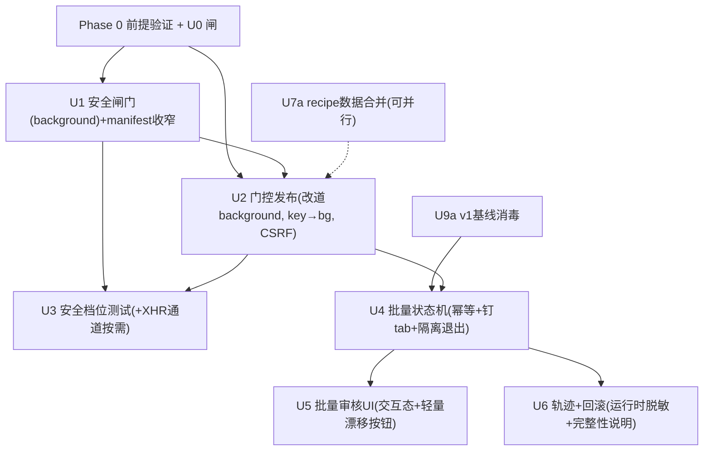

# feat: 自主发布器转向 — 授权站点门控 + 批量审核 + 信任阶梯(Hybrid C, 瘦身版)

## Overview

把 51publisher 从「只填充、人逐条点发布」的扩展,改造成「**自家站点的自主发布器**」:
选题队列 → AI 生成 → 脱敏 → 填充 → **批量审核闸门** → 自动发布(授权站点+授权模式才放行)
→ 落盘轨迹 → 回滚。借 Webwright 三个理念(可重跑漂移探针、工作区即状态、SWE 式 recipe),
但**不导入其代码**。

关键现实:当前代码里**根本不存在提交路径**——零提交铁律是「物理实现」。故「解除铁律」= **新增**
一条被门控的发布路径。v1 在后台 admin 站(`dx-999-adm.ympxbys.xyz`)验证,跑通后切正式环境
(授权名单显式配置,切换不改代码)。

> **二次评审整合(2026-06-04 deepened):** 安全 + 架构 + 7 视角文档评审后,本计划做了两类修改:
> **(甲)瘦身(用户决策"C 保自动发但瘦身")**:推迟投机部分到自主档真正需要时——U7 只做数据合并(执行策略抽象延后)、
> U8 主动探针延后、抽样/全自动档延后、U9 只做 v1 基线消毒(完整威胁模型随自主档走);**新增 Phase 0 前提验证**;**U0 升为 go/no-go 闸**。
> **(乙)承重技术修正**:① 发布**改道经 background**、host 取 `chrome.tabs.get(tabId).url`(side panel 直连 content 拿不到 sender.tab);
> ② API key 调 LLM **只在 background**(现在被读进 content 渲染进程,与 LLM-HTML 登录态后台同进程);
> ③ 通配匹配标签边界 + 必拒样本集;④ 发布幂等(dispatched 前写 + 恢复隔离待核);
> ⑤ https/授权域**收窄落到具体单元**;⑥ XHR 提交 CSRF 现读不重放;⑦ 隔离态人工退出 + 不可重入。

## Problem Frame

帖子全发**自家站点**(可撤下/改/删、无封号风险),逐条人工点发布是产能瓶颈而非安全必需。
但评审指出三个前提风险,Phase 0 须先验证或显式承担:
1. **"自家站=可安全自动发"忽略 Google 域名级惩罚**:规模化低质内容拖垮**整站**排名,且"撤下"不回滚已抓取计入的域名信号。
2. **批量审核未必移瓶颈**:认真读 N 条 AI 草稿的认知成本 ≈ 点 N 次;退化成橡皮图章则等于事实全自动但把关失效。
3. **真约束可能是草稿生成质量而非吞吐**:若 AI 草稿合格率低,自动发布只是更快推次品上域名。
详见 origin:`docs/brainstorms/2026-06-04-autonomous-publisher-pivot-requirements.md`。

## Requirements Trace

- **R1** 解除零提交:授权站点可执行自动提交/发布 → U0, U1, U2
- **R2** 人工闸门改「批量审核」(v1 默认且**唯一档**;抽样/全自动**延后**) → U4, U5
- **R3** 零提交测试 → 安全档位测试 → U3
- **R4** 可移植 recipe(v1 只做**数据合并**;执行策略抽象延后) → U7a
- **R5** 填充/发布轨迹存档 → U6
- **R6** 可重跑漂移探针(v1 仅 U5 内轻量按钮;无人值守探测**延后**) → U5(轻量)/ 延后 U8
- **R7** 急停开关 → U4
- **R8** dry-run(background 层结构性保证不点击) → U1, U4
- **R9** 先草稿后转正 → U6(v1 因审核在提交前把关**不强制**;随自主档启用)
- **R10** 可回滚(基于 R5 轨迹) → U6
- **(安全)** LLM HTML 进登录态后台的 **v1 基线**消毒 → U9a(完整威胁模型 U9b 随自主档)
- **(前提)** 验证瓶颈/草稿质量/SEO 风险 → Phase 0

## Scope Boundaries

- **不**支持第三方平台自动发布;仅授权自家站点。
- **v1 只做"批量审核"一档**;抽样档、全自动零审核档及其前置(完整 U9b 威胁模型、R9 强制草稿态)**延后**到吞吐瓶颈被实测确认、自主档真正要做时。
- **不**做 Webwright 通用 web-agent;只做"发帖到自家 CMS"窄任务。
- **不**在 v1 做无头 B 终态;v1 **不**建执行策略抽象(U7 只合并数据);B 口等第二消费者真出现再分层。
- **U8 主动漂移探针(无人值守)延后**;v1 仅在 U5 放一个轻量"检测当前页选择器缺失"按钮。
- **不**扩张封面/媒体自动上传。

## Context & Research

### Relevant Code and Patterns

**架构(三层 + 双世界,务必沿用)**
- Side Panel(React, 隔离)`entrypoints/sidepanel/App.tsx` — 状态机 `Mode`,挂载崩溃恢复
- 调度中心 `entrypoints/background.ts` — 当前**只**认领 `GENERATE_DRAFT`,监听器签名 `(message)` **无 sender**;**MV3 SW 长任务被回收**,批量循环更易复发
- 隔离世界 content `entrypoints/content.ts` — 认领 `FILL_PAGE`;**当前 `content.ts:3,28` 把 apiKey 读进 content 调 `generateDraft`(渲染进程含密,须挪 background)**;当前**无任何** `.click()`/`form.submit()`
- 主世界 content `entrypoints/quill-bridge.content.ts`(`world:'MAIN'`,`matches:*://*.ympxbys.xyz/*`)— 经 `lib/body-bridge.ts` CustomEvent(reqId + 3s 超时)往返 →**此桥是 MV3 专属管道,不可移植**
- 消息层 `lib/messaging.ts:10-18` — `requestFill` 走 `tabs.query({active})` → `tabs.sendMessage` **直连 content,不经 background**(发布要改道)

**填充引擎 / 字段映射 / 脱敏 / LLM / 存储**
- `lib/fillers.ts:12-16 fireValueEvents`(只 input/change,绝不 Enter)**保留不变**;结果模型 `lib/types.ts:75-79 FieldFillResult{field,status,note?}` = 轨迹天然数据源
- `lib/field-mapping.ts DEFAULT_FIELD_MAPPING`(单一事实源,不依赖 `#imports`);`lib/quill-paste.ts pasteIntoQuill`(tier①`dangerouslyPasteHTML`/tier② 兜底)
- `lib/sanitize.ts sanitizeBody`(DOMPurify 白名单)→ U9a 强化;`scripts/check-fixture-secrets.sh`(**commit 期**文件扫描,**非运行时**)→ U6 须 TS 端口
- `lib/llm.ts`(OpenAI 兼容,只校验 `isHttps`,**无 endpoint allowlist**;全错误结构化、绝不带 key);`lib/storage.ts:36-50`(WXT storage,缺失回落;`local:apiKey` 明文;currentDraft 幂等恢复**对"发布"不成立**)

**测试基建**
- `vitest.e2e.config.ts` jsdom,**只 import `lib/`、不碰 entrypoint**(故**测不了** sender/tabs/background,见 U3 边界)
- `tests/e2e/helpers/zero-submit.ts installSubmitSpy`(三通道:form.submit/requestSubmit、submit 事件、按钮 click;**无 XHR/fetch 通道** → 若 U0 发现 XHR 提交须加第 4 通道)
- `tests/e2e/fixtures/selectors.ts KEY_SELECTORS`(派生自 DEFAULT_FIELD_MAPPING)+ `fixture-contract.test.ts` → U5 轻量探针 / 延后 U8 的骨架

### Institutional Learnings

- 无 `docs/solutions/`;学习来自 `docs/brainstorms/` 与两份 `docs/plans/`。
- **诚实边界(不可夸大)**:单 jsdom realm 测不了真跨世界隔离;惰性 fixture 证不了真后台动态提交;真后台漂移只能被动发现。→ authorized 档首发**必须人工 admin 冒烟**。
- 旧 MVP **刻意不做**批量/队列/草稿库 → U4/U5/U6 从零新建。

### External References

- 未做外部研究:本地模式已强。参照 [microsoft/Webwright](https://github.com/microsoft/Webwright)(仅理念,代码不导入)。

**Webwright 实读源码后的移植对照(2026-06-04,浏览器读 `agents/default.py` 468 行 / `environments/local_workspace.py` 297 行 / `tools/self_reflection.py` 612 行):**

Webwright 是 Python+Playwright 外部自主 agent:`DefaultAgent.run→step→query→execute_actions`,模型写 bash 驱动真浏览器,工作区落盘 `plan.md/steps.md/screenshots/logs/final_script.py`,带上下文压缩、自反思截图判官、落盘前 `_sanitize_message_for_disk`、凭据从 env 注入(不进模型上下文)。对照本产品:

| Webwright 机制 | 对 51publisher 的处置 | 落点 |
|---|---|---|
| **工作区即状态**(steps/logs/screenshots 逐步落盘 + 落盘前脱敏) | **移植** → 每帖轨迹:填充结果 + `/save` 请求(脱敏)+ 响应 + 快照;`_sanitize_message_for_disk` 印证 U6 运行时脱敏闸门是对的 | U6 |
| **任务=可重跑脚本**(`final_script.py`) | **移植理念** → 本站"脚本"=参数化 `POST /admin/webarticle/save`;可重跑=漂移探针重放该请求 | U2 / U7a / U8(延后) |
| **凭据从 env、不进模型上下文** | **已对齐**(评审独立得出同结论)→ apiKey 只在 background、绝不进 content/模型 | Key Decisions |
| **自反思闸门**(两段式截图判官) | **降配** → v1 用轻量"填充落位自检"(绿/黄/红雏形),**不**上 LLM 截图判官 | U5 |
| **上下文压缩 / prune 快照** | **v1 跳过**(填充无长上下文);仅无头 B 长任务需要 | 延后 B |
| **模型写 bash + python sandbox 循环** | **v1 跳过**(扩展跑不了 sandbox)——这是无头 B 形态 | 延后 B |
| **打包成 Claude Code/Codex skills** | **跳过**(与本产品分发无关) | — |

结论:**Webwright 代码不可搬;能搬的是"工作区即状态→轨迹存档"、"任务=可重跑请求→漂移探针"、"凭据隔离"三件,且 v1 都已在计划里。其自主循环/沙箱/压缩/截图判官属无头 B 终态,本次不做。**

## Key Technical Decisions

- **闸门在 background,host 取自浏览器**:发布消息**改道** side panel → background → content。host 由 background 用 **`chrome.tabs.get(tabId).url`**(扩展页 sender 无 `sender.tab`,故不能用 `sender.tab.url`)取;`sender.tab.url` 仅用于 content 自身发起的消息。**绝不**接受消息里携带的 host;content **永不自我授权**(background 通过后才发一次性"准许点击")。
- **LLM 调用(含 apiKey)只在 background**:现把 key-bearing fetch 从 content 移到 background,content/side panel 永不接触 key —— 与"background 拥有机密"一致,避免渲染进程(被 LLM-HTML 注入的登录态后台同进程)泄密。
- **通配匹配 = 标签边界算法 + 必拒样本集**:lowercase→去尾点→拒非法 hostname(含 `@`/`:`/`/`/IP 字面量)→按 label 切→要求精确 `['ympxbys','xyz']` 在标签边界结尾、通配吃 ≥1 整 label;裸 apex 默认不匹配;拒 IDN/punycode。
- **dry-run/off 结构性不可绕过**:off/dry-run 下 background **根本不发**准许 → content 无可点路径(诚实表述:发布代码会存在于 content,但无准许即从不被调用;真正约束由 U3 矩阵 + background 不发准许共同保证,**不**等同今天"代码不存在"的物理保证)。
- **授权配置只许用户经 background 写**:`safetyMode`/`authorizedHosts` 仅 side panel 用户动作可写并校验;content 只读;解析/校验失败 **fail-closed → off + 空名单**。
- **注入面=闸门面(落到单元)**:`content.ts` 与 `quill-bridge.content.ts` 的 `matches` + `host_permissions` **收窄到 `https://dx-999-adm.ympxbys.xyz/*`**(U1 的 manifest 交付物,非"应该")。
- **发布幂等**:`publishing` 拆 `publish-dispatched`(副作用**前** await 写盘成功**再**发准许)/`publish-confirmed`;崩溃恢复见 dispatched(无回执)→ `needs-human-verification` 隔离**绝不自动重发**;但"已回执 `no-publish-target`(确未触发)"→ 清回 `error` 而非隔离。
- **CSRF(若 U0 判定 XHR 提交)**:每次提交从页面**现读** token,**绝不重放**捕获的请求;token 绝不进 `PublishResult`/轨迹/错误。
- **recipe 瘦身**:v1 只把选择器/白名单/发布配置合并成 `SiteRecipe` **数据**单一事实源;`RecipeExecutor` 执行策略抽象**延后**(当前仅一个消费者=投机)。
- **截图取舍**:v1 默认存结构化字段摘要 + 已消毒 DOM 快照(零新权限);位图截图 opt-in。
- **U0 是 go/no-go 闸**:真后台提交机制 + 草稿态须先勘查;无草稿态则全自动档线整体不承诺。

## Open Questions

### Resolved During Planning

- 授权站点 → `dx-999-adm.ympxbys.xyz` 先用,显式配置可切正式(用户确认)。
- 闸门跑哪 / host 哪来 → background + `chrome.tabs.get(tabId).url`(见 Key Decisions)。
- v1 档位 → **仅批量审核**;抽样/全自动延后(用户决策 C 瘦身)。
- manifest → **收窄到 https + admin 子域**(U1 交付物)。
- **[U0 已实测 — 浏览器勘查 2026-06-04] 真后台 = layui + jQuery 后台「51漫画管理系统」**:新增表单是列表页内联 layui layer(`.layui-layer-page`,**非 iframe**),由表格工具栏 `lay-event="add"` 打开。
- **[U0 已实测] 提交机制 = XHR/AJAX,无 CSRF token(已确认)**:`<form lay-filter="form-save">` + `<button lay-submit lay-filter="save">` → `/static/backend/util.js` 的通用 `form.on('submit')` → AJAX POST 到 **`/admin/webarticle/save`**。API 风格佐证:列表数据走 `GET /admin/webarticle/listAjax?page=&limit=`(纯 cookie GET)。**CSRF 确认无**:表单无 `_token`/`csrf` 字段;`common.js`/`util.js` 均无 `ajaxSetup`/`csrf`/`token`;listAjax 实测为纯 cookie 鉴权。→ **U2 走 XHR、靠 session cookie(自动带),无需 token;推荐"门控复用页面自身 layui 提交"**(填字段→gated 触发 `lay-submit`,让 util.js 通用处理器按站点逻辑序列化+POST,免去自己复刻线格式);**U3 必加 fetch/XHR spy 通道**(form.submit 不触发)。
- **[U0 已实测] 有"草稿/不公开"态**:字段 `status` = **隐藏/显示**(select)。→ **R9 先草稿后转正可行**(自动发成"隐藏"、审核后转"显示");列表页可按 status 筛选,批量转正可行。
- **[U0 已实测] 字段映射低漂移**:实测表单字段 = `media_id`(作品id) `title`(標題) `subtitle`(副標題) `type`(類型 select:漫畫文章/動漫文章) `file`(封面 file 上传)+`cover_url`(hidden) `status`(隱藏/顯示) `description`(textarea) `published_at`(發佈時間) `html_content`(hidden,正文)`tags[]`(checkbox 多选,多个)正文编辑器 **Quill `#editor`**。与 `DEFAULT_FIELD_MAPPING` 结构吻合;注意 `type` 仅 2 选项,AI 草稿的"分类"须映射到这二者之一。

- **[U0 已实做发帖 — 2026-06-04 浏览器实测,3 条隐藏测试帖 id 110/111/112]**:
  - **保存 = `POST /admin/webarticle/save`**(urlencoded,`X-Requested-With`),**无 CSRF token 也"操作成功"**(`{code:0,msg:"操作成功"}`),往返 **~390–440ms**。列表 = **`POST /admin/webarticle/listAjax`**(GET 返回空)。
  - **关键坑(U2 必须知道)**:naive `button.click()` 提交按钮**不触发 layui AJAX**,而是**掉回原生 GET 到 /index(全字段进 query、不保存)**。→ U2 **不能简单点按钮**,须 **POST /save** 或正确复刻 layui 的 `form.on('submit(save))`。
  - **枚举值**:`status` 隐藏=`0`/显示=`1`;`type` 漫畫=`2`/動漫=`4`;`media_id`(作品id)必填,`1` 被接受。
  - **机械耗时**:程序化填充(8 字段+Quill API)**14ms** + 保存 ~0.4s → **单帖机械发布 < 0.5s**。结论:**"点发布"机械成本可忽略,瓶颈在生成/人审,不在点击**(印证评审 product/adversarial 担忧)。
  - **站点性质**:NSFW 里番/成人动画介绍站,现有文章是固定"51娘"口吻 + 具体里番作品 + 漢化/無修连结。→ **草稿合格率是真风险**:AI 须命中该小众题材+口吻+逐作品事实,且**无法编造**漢化/無修连结与准确剧情(幻觉风险高)。generic 主流热血漫草稿在此站=跑题。

### Deferred to Implementation

- **[剩余 Phase 0 项,需用户] 瓶颈基线 + 草稿合格率**:浏览器勘查只能定"机制/字段/草稿态"(✅ 已定);"点发布是否真是瓶颈、AI 草稿合格率"是操作/主观判断,仍需用户实测(见 `docs/phase-0-validation-worksheet.md` 检查 3)。
- **[U2] 触发方式二选一**:推荐**门控复用页面自身 layui 提交**(填字段→gated 触发 `lay-submit` 让 layui 自己序列化 html_content + 发 AJAX,最稳),备选自己构造 `$.post /webarticle/save`(更脆)。
- **trajectory 完整性**:`chrome.storage.local` 可被任意扩展上下文改写;v1 接受此限并文档化,必要时加序号 + 轻量 hash 链做**篡改可检**(非阻止)。
- **endpoint 信任边界**:`lib/llm.ts` 无 endpoint allowlist;v1 文档化"endpoint 是第三方信任边界",自主档前再考虑 host allowlist。
- **trajectory 完整性**:`chrome.storage.local` 可被任意扩展上下文改写;v1 接受此限并文档化,必要时加序号 + 轻量 hash 链做**篡改可检**(非阻止)。
- **endpoint 信任边界**:`lib/llm.ts` 无 endpoint allowlist;v1 文档化"endpoint 是第三方信任边界",自主档前再考虑 host allowlist。

## High-Level Technical Design

> *方向性示意,供评审验证"形状",非实现规范。*

```mermaid
flowchart TB
    SP["Side Panel (批量审核 UI)"] -->|RUN_BATCH topics[], 钉 tabId| BG["background.ts 调度 + 闸门 + LLM(含key)"]
    BG --> GEN["lib/llm.ts 逐条生成(key 只在此)"]
    GEN --> Q["lib/batch.ts 状态机<br/>queued→generating→filled→awaiting-approval→publish-dispatched→publish-confirmed→done<br/>(恢复: dispatched→needs-human-verification)"]
    Q -->|每条 FILL_PAGE 到钉住 tab| CT["content.ts (隔离) fillDraft + 正文过桥(U9a 消毒)"]
    CT --> TRJ["lib/trajectory.ts 落盘(运行时内存脱敏)"]
    TRJ --> SP
    SP -->|人工 APPROVE_BATCH / KILL| Q
    Q --> GATE{"background: canSubmit(chrome.tabs.get(tabId).url 的 host, mode, allowlist)"}
    GATE -->|off / dry-run / host 不符| REPORT["不发准许;只记'将发布'"]
    GATE -->|authorized 且 host 符| MARK["await 写 publish-dispatched(无密标记)"]
    MARK -->|一次性准许| PUB["content: lib/publish.ts 触发(按 U0: click / XHR现读CSRF)"]
    PUB --> CONFIRM["写 publish-confirmed + URL → 回滚依据"]
```

```
canSubmit(host, mode, allowlist):
    host := normalize(host)   # lowercase, 去尾点, 非法(@/:/IP/...)即拒
    return mode == "authorized" AND labelBoundaryMatch(host, allowlist)
# host 必须 background 从 chrome.tabs.get(tabId).url 取; 永不接受消息里的 host
```

## Implementation Units



### Phase 0 — 前提验证 + U0 go/no-go 闸(先验证再投入)

- [ ] **P0: 验证瓶颈、草稿质量、提交机制,再决定是否值得自动发**

**Goal:** 用最小成本验证三个承重前提,避免为错误问题修高速路;同时完成 U0 勘查。**这是 go/no-go,不过则回退到"只自动化生成+填充、人工点发布"。**

**Requirements:** R1 前置、(前提)

**Dependencies:** admin 凭据 + DevTools 访问

**Files:**
- Modify: `docs/field-mapping-guide.md`(记录:① 真后台提交机制 form/button/XHR + 是否 CSRF;② 草稿态可用性;③ 人工"逐条填+点发布"基线耗时/点击数;④ 抽样 N 条 AI 草稿的合格率)

**Approach:**
- **U0 勘查**(go/no-go):DevTools 看 admin 提交时网络/事件,记触发元素 + 是否 XHR + CSRF + 草稿态。
- **瓶颈基线**:现状发 ~10 条,记"读+填+点发布"各段耗时 → 确认"点发布"是否真占大头(若不是,自动提交收益小,考虑回退 A)。
- **草稿质量**:抽 ~10 条 AI 草稿,人工标"可直接发/需小改/不合格"比例 → 合格率太低则先改 prompt/生成,暂缓自动发。

**Execution note:** 勘查/度量性质,产出文档,非可测代码。

**Test scenarios:** Test expectation: none —— 验证单元;产出 go/no-go 结论与 U2 实现分支输入。

**Verification:** 文档记录三项结论;明确 go(继续 Phase 1)或 no-go(回退轻方案)。

### Phase 1 — 让自主发布"可能且安全"

- [ ] **U1: 授权站点安全闸门(background)+ manifest 收窄**

**Goal:** 纯函数 `canSubmit` + 配置管理,**在 background 求值**,host 取 `chrome.tabs.get(tabId).url`,通配用标签边界;**并把 manifest 注入面收窄到 https+admin**。

**Requirements:** R1, R8

**Dependencies:** None

**Files:**
- Create: `lib/safety-gate.ts`(`canSubmit`/`normalizeHost`/`labelBoundaryMatch`)+ `lib/safety-gate.test.ts`
- Modify: `lib/storage.ts`(`local:safetyMode`/`local:authorizedHosts`,种子 `dx-999-adm.ympxbys.xyz`;解析失败 fail-closed→off+空)
- Modify: `lib/types.ts`(`SafetyMode='off'|'dry-run'|'authorized'`)
- Modify: `entrypoints/background.ts`(闸门求值:`chrome.tabs.get(tabId).url` 取 host,自读 storage 配置)
- Modify: `wxt.config.ts`、`entrypoints/content.ts`、`entrypoints/quill-bridge.content.ts`(`matches`/`host_permissions` → `https://dx-999-adm.ympxbys.xyz/*`,**三处同步**)

**Approach:** 见 Key Decisions(normalize/labelBoundary/配置写入限制)。manifest 三处一并收窄,避免注入面宽于发布面、且防 body-bridge 因主世界脚本 matches 不一致而静默超时。

**Patterns to follow:** `lib/storage.ts` 缺失回落;`lib/field-mapping.ts` 单一事实源。

**Test scenarios:**
- Happy: `authorized` + `dx-999-adm.ympxbys.xyz` ∈ 名单 → 真。
- **必拒样本集(全假)**:`ympxbys.xyz.evil.com`、`aympxbys.xyz`、`evilympxbys.xyz`、`notympxbys.xyz`、`dx-999-adm.ympxbys.xyz.evil.com`、裸 `ympxbys.xyz`、尾点 `...xyz.`、大写(规范化后真)、`user@...`、`...:8080`、`evil.com#...ympxbys.xyz`、`evil.com?x=...`、IP `1.2.3.4`/`[::1]`/`0x7f.1`、punycode/IDN 同形、含 `\0` 拼接。
- 安全: dry-run/off 即便 host 在名单→假;名单空→假;配置坏值 fail-closed→假;storage `mode=authorized` 但 host 不在名单→假。

**Verification:** 提交前均过 background `canSubmit`;必拒集全假;manifest 三处收窄一致。

---

- [ ] **U2: 门控发布(改道 background + LLM key 移 bg + 按 U0 分支)**

**Goal:** 发布消息改道 side panel→background→content;background 闸门通过且 await 写 dispatched 后才发一次性准许;content 据准许触发(U0 结论:button-click 或 XHR 现读 CSRF)。LLM key-bearing 调用一并移到 background。返回 `PublishResult{ok,url?,error?,dryRun}`。

**Requirements:** R1, R8

**Dependencies:** P0/U0(机制)、U1(闸门)

**Files:**
- Create: `lib/publish.ts`(button-click 分支 / XHR 分支)+ `lib/publish.test.ts`
- Modify: `entrypoints/background.ts`(发布编排:闸门→await dispatched→准许;**LLM `generateDraft` 调用移此**)
- Modify: `entrypoints/content.ts`(收准许才触发;**移除 apiKey 读取/LLM 调用**)
- Modify: `lib/messaging.ts`(`requestPublish(tabId,...)` 经 background;**显式 tabId**,不查 active)

**Approach:** 决策与 dry-run 短路都在 background;authorized→await `storage.set(dispatched)` 成功→发准许→content 触发→回 result。XHR 分支每次现读 CSRF、绝不重放、绝不入 result/日志。错误结构化,绝不带登录态/key/CSRF。

**Execution note:** 先写失败的 gate 契约测试(blocked/dry-run/authorized/无准许无触发),再实现。

**Patterns to follow:** `lib/fillers.ts` 注入 doc + 结构化结果;`lib/llm.ts` 错误纪律。

**Test scenarios:**
- Happy: authorized + 准许 + fixture 有发布元素 → 触发,spy 计数=1,`ok:true`。
- 安全: 无 background 准许 → content 不触发,spy 三通道(必要时含 XHR 通道)全 0。
- dry-run/off: 不发准许 → spy 全 0,报告"将发布"。
- Edge: 发布元素找不到 → `ok:false,error:'no-publish-target'`(确未触发)→ U4 清回 error,不隔离。
- 安全: key 不出现在 content 上下文/任何 PublishResult/错误中。

**Verification:** 仅 background 准许后触发;off/dry-run/blocked 零提交;content 无 key。

---

- [ ] **U3: 安全档位测试(取代零提交 spy,按需加 XHR 通道)**

**Goal:** "零提交恒 0" 反转为授权矩阵;**显式区分三层验证边界**(纯函数 / e2e 无触发 / 防伪造只能人工冒烟)。

**Requirements:** R3

**Dependencies:** U1, U2

**Files:**
- Create: `tests/e2e/helpers/authorized-submit.ts`(由 `zero-submit.ts` 演化 + 授权矩阵;**若 U0=XHR 则加 patch fetch/XMLHttpRequest 第 4 通道**)
- Modify: `tests/e2e/fill-core-path.test.ts`(原"零提交"→"off/dry-run 零提交")
- Create: `tests/e2e/publish-gate.test.ts`(矩阵)

**Approach:** 矩阵只有 (host∈名单, authorized, 已准许) 期望 submit 可>0。**验证边界写清**:`lib/safety-gate.test.ts` 证纯谓词;e2e 证"无准许则 content 无触发";"host 来自浏览器、防伪造"**只**靠人工 admin 冒烟,jsdom 证不了。

**Patterns to follow:** `fill-core-path.test.ts` spy 风格。

**Test scenarios:**
- 矩阵: (在名单,authorized,准许)→可=1;(dry-run)→0;(不在名单,authorized)→0;(off,*)→0;(authorized,无准许)→0。
- 防假绿: host 非授权但 mode=authorized → 0。
- 边界声明: 文档/注释标注 jsdom 不覆盖"防伪造 host",由人工冒烟兜。

**Verification:** `pnpm test:e2e` 通过;矩阵符预期;验证边界不被误读为覆盖了防伪造。

---

- [ ] **U9a: v1 基线消毒强化(完整威胁模型 U9b 随自主档延后)**

**Goal:** v1 即便有人审,LLM HTML 仍进登录态后台 origin → 做**基线**硬化:剥/限远程 `src`/`href`、禁 `data:`/`javascript:`、禁事件属性、`<a target=_blank>` 加 `rel`、钉 DOMPurify 版本。**完整 mXSS round-trip + 远程资源外泄模型(U9b)随抽样/全自动档启用**。

**Requirements:** (安全) v1 基线

**Dependencies:** None(可并行)

**Files:**
- Modify: `lib/sanitize.ts` + `lib/sanitize.test.ts`(基线威胁语料 + 版本钉定)
- Modify: `docs/field-mapping-guide.md`(白名单策略)

**Approach:** v1 范围限"白名单收紧 + 远程资源剥离 + 危险 URI/事件属性拒绝 + 版本钉定";把 round-trip mXSS 证明、CSS 外泄模型标注为 U9b(随自主档,见 Scope)。

**Patterns to follow:** 现有 `lib/sanitize.ts` 白名单;"防假绿"思路。

**Test scenarios:**
- 安全: `` 剥/拒;`data:text/html`、`data:image/svg+xml` 拒;`href=javascript:` 拒;`onerror` 拒。
- 版本钉定: DOMPurify 版本/配置变更触发测试失败。

**Verification:** 基线语料全拦;版本钉定生效。U9b 列入延后清单。

### Phase 2 — 批量流程 + 护栏(R2/R7/R8)

- [ ] **U4: 批量队列状态机(幂等 + 钉 tab + 隔离退出 + 急停 + dry-run)**

**Goal:** "单条"→"批次",带发布幂等、钉住目标 tab、隔离态人工退出、急停、dry-run。

**Requirements:** R2, R7, R8

**Dependencies:** U2

**Files:**
- Create: `lib/batch.ts`(`status`: `queued|generating|filled|awaiting-approval|publish-dispatched|publish-confirmed|needs-human-verification|aborted|error`)+ `lib/batch.test.ts`
- Modify: `lib/storage.ts`(`local:batch` 持久化 + 崩溃恢复)
- Modify: `entrypoints/background.ts`(`RUN_BATCH`(钉 tabId)/`APPROVE_BATCH`/`KILL_BATCH`/`RELEASE_QUARANTINE` 编排)

**Approach:**
- **幂等**:background **await** `storage.set(publish-dispatched)` 成功**再**发准许;`publish-confirmed` 回执后写。恢复见 dispatched 无回执→`needs-human-verification`(**可能含已发**,设计如此)**绝不自动重发**;回执 `no-publish-target`(确未触发)→清回 `error`。
- **隔离退出**:`needs-human-verification` **只**能经显式人工动作(`RELEASE_QUARANTINE`,区别于 `APPROVE_BATCH`)离开;**新 RUN_BATCH 不得自动重入**已隔离的同选题;U5 醒目展示。
- **钉 tab**:`RUN_BATCH` 解析一次 tabId 并钉;每步前断言活动 tab==钉住 id 且 host 在名单,否则**暂停**批次提示"请切回 admin 标签页";`chrome.tabs.get` 失败(tab 关)→ 闸门 fail-closed 不发准许。
- 急停:KILL 当前及后续→aborted;已 confirmed 不回退(走 U6)。dry-run:走 background 不发准许分支出报告。单条失败标 error 不阻断其余。

**Patterns to follow:** `lib/storage.ts currentDraft` 恢复写法;`background.ts` 同步 return + AbortController。

**Test scenarios:**
- Happy: 3 topics → 全 awaiting-approval;approve → dispatched→confirmed→done。
- **幂等(关键)**:模拟"已 dispatched 无回执"重读 storage → 转 `needs-human-verification`,不重发;"已回执 no-publish-target" → 清回 error。
- 隔离退出: 隔离态仅 `RELEASE_QUARANTINE` 可离开;新 RUN_BATCH 不重入同隔离选题。
- 钉 tab: 批量中 tab 切走 / `tabs.get` 失败 → 暂停 + 不发准许,不误发。
- 急停/dry-run: KILL 即时;dry-run 真实 submit=0。
- 顺序: dispatched 写盘 await 成功后才发准许(断言顺序)。

**Verification:** 批准前不发布;崩溃不重复发帖;隔离只人工退出;tab 漂移不误发。

---

- [ ] **U5: 批量审核 UI(交互态完整 + 轻量漂移按钮)**

**Goal:** side panel 批量视图,**专为"在窄面板里高效审 N 条"设计**,覆盖全部交互态,醒目且不可混淆地展示发布模式/授权 host/钉住 tab。

**Requirements:** R2, R7, R6(轻量)

**Dependencies:** U4

**Files:**
- Create: `entrypoints/sidepanel/BatchReviewPanel.tsx` + `.test.tsx`
- Modify: `entrypoints/sidepanel/App.tsx`(`Mode` 增 `batch-review`)
- Modify: `entrypoints/sidepanel/FillResultPanel.tsx`(复用绿/黄/红,**加非颜色标签/图标**)

**Approach(须落实的设计决策,评审 design-lens):**
- **信息架构(规模化)**:顶部批次摘要带(如"27 绿 / 2 黄 / 1 红 — 3 项需注意");按填充结果严重度排序(红优先);行**默认折叠**、展开看草稿+快照;明确 50 条时的分页/虚拟化。
- **交互态全覆盖**:空态(未选题)、generating(逐条进度/能否边生成边审)、error 行样式、publish 阶段逐行指示 + 末尾"X 发布/Y 失败"、**`needs-human-verification` 必须在面板有醒目独立表示**(安全关键)。
- **模式/host/tab 状态区**:常驻状态带——off/dry-run/authorized 用**显著不同**视觉(authorized 必须一眼区别于 dry-run);**字面**展示授权 host(供核对真域名)+ 钉住 tab 健康;tab 漂移→面板进入独立"已暂停"态。
- **二次确认(authorized)**:弹窗文案**插值 count + host**("发布 27 条到 dx-999-adm.ympxbys.xyz?");需主动手势(输数量/输"publish"/长按)防肌肉记忆;确认时**重检** tab/host 不变。
- **切 tab 中断流**:检测漂移→面板**阻断式**提示(非一行 toast)→显式"我已切回,继续"/"放弃";说明落在哪条、在途条是否安全。
- **快照查看**:每行折叠控件后打开(渲染视图/源码切换),标注"已脱敏快照"。
- **轻量漂移按钮(R6)**:复用 `fixture-contract` 派生逻辑,对当前页查 KEY_SELECTORS 缺失并提示(无人值守探测延后 U8)。
- **可达性/效率**:状态非仅靠颜色(加文字/图标);键盘 triage(上下移、切剔除、急停带防误触快捷键);kill/确认控件 focus 处理。

**Patterns to follow:** `App.tsx` 状态机;`FillResultPanel.tsx`/`DraftPreview.tsx`。

**Test scenarios:**
- Happy: 渲染批次 + 摘要带 + 严重度排序;点批准→`APPROVE_BATCH`。
- 交互态: 空/generating/error/publishing/`needs-human-verification` 各有明确渲染(尤其隔离态醒目)。
- 安全: authorized 批准→插值 count+host 的二次确认 + 主动手势 + 确认时重检 tab/host;dry-run 文案"预演发布"。
- 中断: tab 漂移→阻断式提示 + 显式继续/放弃。
- 漂移按钮: 缺选择器→提示。
- 可达性: 状态有非颜色编码;键盘可 triage。

**Verification:** 窄面板能高效审 N 条;authorized 不会被误当 dry-run;隔离态人能看见并处置;中断流安全。

### Phase 3 — 轨迹耐久层(R5/R10/R9)

- [ ] **U6: 轨迹存档 + 回滚(运行时内存脱敏 + 完整性说明)**

**Goal:** 每条发布落盘可审计轨迹,作回放/回滚依据;脱敏是**运行时内存预写闸门**(非 git hook),含机密拒写;文档化完整性限制。

**Requirements:** R5, R10, R9

**Dependencies:** U4

**Files:**
- Create: `lib/trajectory.ts` + `lib/trajectory.test.ts`
- Create: `lib/secret-scrub.ts`(TS 脱敏,供 trajectory 用;与 `scripts/check-fixture-secrets.sh` 规则对齐)
- Modify: `lib/storage.ts`(`local:trajectory` 追加式)
- Modify: `entrypoints/sidepanel/BatchReviewPanel.tsx`(展示轨迹 + 回滚/撤下入口)

**Approach:**
- `TrajectoryRecord{id,topic,fields:FieldFillResult[],snapshot(已脱敏),publishUrl?,status,ts,publishedAsDraft?,seq,hash?}`。
- **脱敏 fail-closed**:快照在内存内扫描(allowlist + 投毒自检),**默认剥所有表单 value(含 hidden)** + CSRF/`<meta csrf>`/nonce/`Authorization`/`Bearer`/长 hex/`data-*` ID;检出即拒写报警;原始快照**永不**在扫描前 `storage.set`。
- **幂等标记解耦**:`publish-dispatched`(无密极小标记)**不**走快照脱敏闸门,避免脱敏失败堵前置幂等写。
- **完整性**:`local:trajectory` 可被任意扩展上下文改写——v1 接受并文档化;加 `seq`+轻量 `hash` 链做**篡改可检**(非阻止)。
- 回滚:有 URL→撤下/改回动作或人工指引(依赖 U0 草稿态结论);dry-run 无 URL 仅记录。R9:`publishedAsDraft` 标记,v1 不强制。

**Patterns to follow:** `lib/sanitize.ts` 白名单;`check-fixture-secrets.sh` allowlist+投毒自检;`lib/storage.ts` 追加。

**Test scenarios:**
- Happy: 发 1 条→轨迹含字段+消毒快照+URL+ts,可读回。
- 安全(fail-closed): 快照含 hidden value/Bearer/CSRF/长 hex→拒落盘+报警;原始快照扫描通过前无 `storage.set`。
- 防 no-op: 投毒样本必被检出。
- 解耦: dispatched 标记写入不受快照脱敏影响。
- 完整性: 篡改某记录→seq/hash 链可检出。
- 回滚: 由 URL 定位撤下;dry-run 无 URL 不提供撤下。

**Verification:** 每条可审计;含机密快照写不出;幂等不被堵;篡改可检;能回滚。

### Phase 4 — Recipe 数据合并(R4,可并行;执行抽象/U8 延后)

- [ ] **U7a: recipe 数据合并(单一事实源)**

**Goal:** 把选择器 + 脱敏白名单 + 发布配置 + 漂移选择器集合并成 `SiteRecipe` **数据**单一事实源,消除分散硬编码。**执行策略抽象(RecipeExecutor)延后到 B 端真出现**。

**Requirements:** R4

**Dependencies:** 概念汇入 U2;可并行

**Files:**
- Create: `lib/recipe.ts`(`SiteRecipe` 纯数据,不 import `#imports`/chrome)+ `lib/recipe.test.ts`
- Modify: 调用点读 recipe 数据(`fillers`/`content`/`publish` 的选择器/白名单/发布配置来源)
- Modify: `docs/field-mapping-guide.md`(recipe 数据说明)

**Approach:** 只做数据合并:渐进重构,先抽 `SiteRecipe` 类型+默认实例,调用点改读,**行为不变**。**不**引入 executor 接口(一个消费者=投机,延后)。

**Execution note:** 特征化优先——先保现有 e2e 绿,再切调用点。

**Patterns to follow:** `lib/field-mapping.ts` 单一事实源;`fixtures/selectors.ts` 派生。

**Test scenarios:**
- Happy: 从 `SiteRecipe` 取值 == 现有默认(行为不变)。
- 纯净: `lib/recipe.ts` 不 import chrome/`#imports`。
- 防分叉: recipe 选择器集与 `DEFAULT_FIELD_MAPPING` 一致。
- Integration: 切 recipe 后 `fill-core-path.test.ts` 仍绿。

**Verification:** 行为不变;recipe 纯数据;单一事实源不分叉。

> **延后清单(随自主档/B 端启用,非 v1):** U7b 执行策略抽象(`RecipeExecutor`,需第二消费者验证接口);U8 无人值守主动漂移探针(定时对真后台);U9b 完整消毒威胁模型(mXSS round-trip + CSS/远程资源外泄模型);抽样档 + 全自动零审核档(前置:U9b 已测试 + R9 草稿态强制 + U0 确认草稿态可用)。

## Success Metrics

> v1 目标是**吞吐**,故须可度量(评审 product-lens F1/F5):

- **N**:admin 站单次批准批量发布 ≥ **10 条**,全程零手动点击提交。
- **吞吐代理(前后对比)**:"每 10 条帖的人工点击数"从基线(逐条 ~10+ 次)降到 ~1 次批准;"审+批一批 10 条的耗时" ≤ 现状"逐条填+点发布 10 条"耗时(Phase 0 取基线)。
- **闸门不成新瓶颈**:批量审核耗时主要花在红/黄项;绿项默认低成本通过(U5 设计目标)。
- **质量底线**:Phase 0 测得 AI 草稿合格率达可接受阈(否则暂缓自动发、先改生成)。
- **安全**:authorized 首发人工 admin 冒烟通过;必拒样本集全绿;基线消毒语料全拦。

## System-Wide Impact

- **Interaction graph:** 新增 `PUBLISH_PAGE`(经 background, 显式 tabId)/`RUN_BATCH`/`APPROVE_BATCH`/`KILL_BATCH`/`RELEASE_QUARANTINE`;**闸门 + LLM key 在 background**;发布**改道**(不再 side panel 直连 content)。
- **Error propagation:** 单条失败隔离;gate 拒绝/发布失败/脱敏失败结构化返回,绝不抛裸异常、绝不带登录态/key/CSRF。
- **State lifecycle risks:** 新增 `local:batch`/`local:trajectory`/`local:safetyMode`/`local:authorizedHosts`;**既有 `local:apiKey` 明文**——v1 文档化此风险(自主档放大暴露面);发布幂等;轨迹完整性仅"可检"。
- **API surface parity:** 所有触发提交统一过 background `canSubmit`;content 无自我授权路径;`fireValueEvents` 仍永不 Enter。
- **Integration coverage:** 真后台动态提交/真实漂移/防伪造 host,e2e 证不了 → authorized 首发**必须人工 admin 冒烟**。
- **注入面=闸门面:** content + quill-bridge 的 `matches`/`host_permissions` 收窄到 `https://dx-999-adm.ympxbys.xyz/*`(U1 交付)。
- **Unchanged invariants:** off 档==今天;`fireValueEvents` 永不 Enter;消毒白名单只紧不松;仅 Chromium。

## Risks & Dependencies

| Risk | Mitigation |
|------|------------|
| **自家站自动发伤 Google 域名级排名(撤下不回滚)** | Phase 0 测草稿合格率;v1 保留逐条人工审(批量);质量不达标暂缓;先草稿后转正随自主档 |
| **批量审核退化为橡皮图章 = 事实全自动** | U5 严重度排序 + 二次确认主动手势 + 红/黄强制注意;Success Metrics 量化审核耗时 |
| **真瓶颈是草稿质量而非吞吐** | Phase 0 go/no-go:合格率低则先改生成,不投自动发 |
| SW 回收致重复发帖(不可逆) | dispatched await 写盘后才发准许;恢复隔离待人工核,绝不自动重发(U4) |
| e2e 证不了真后台自动提交/防伪造 host | authorized 首发强制人工 admin 冒烟;U3 标注验证边界 |
| 闸门被绕过(host 伪装/自我授权) | 闸门在 background + host 取 `chrome.tabs.get(tabId).url`;标签边界 + 必拒样本集;content 只读配置 |
| **API key 在 content 渲染进程泄露** | LLM 调用移 background,content/side panel 永不接触 key |
| LLM endpoint 无 allowlist(源信任边界) | v1 文档化"endpoint 是第三方信任";自主档前再考虑 host allowlist |
| LLM HTML 进登录态 origin XSS | U9a 基线硬化(远程 src/data:/事件属性/版本钉定);完整模型 U9b 随自主档 |
| dry-run 被绕过误发 | off/dry-run 下 background 不发准许,content 无被调用路径 |
| 轨迹泄露机密 / 被篡改 | 运行时内存脱敏(剥 hidden value/CSRF;allowlist+投毒自检)拒写;seq+hash 链篡改可检 |
| 批量误发到非 admin tab | RUN_BATCH 钉 tabId;每步断言 tab+host;`tabs.get` 失败 fail-closed |
| 真后台提交机制/草稿态未知 | **U0 go/no-go 闸**前置;XHR 则 U3 加 fetch/XHR spy 通道、CSRF 现读 |
| 隔离态被静默重入/再发 | `needs-human-verification` 仅 `RELEASE_QUARANTINE` 退出;新 RUN_BATCH 不重入同选题 |
| U0 需 admin 凭据 + DevTools(无 remote) | 列为全 Phase 1 硬访问前提 |
| 正式环境换顶域 | 授权名单 + manifest 用配置 + 显式扩展,有清单不漏 |

## Phased Delivery

### Phase 0(go/no-go,先)
P0:U0 勘查 + 瓶颈基线 + 草稿合格率。**门槛:点击确为瓶颈 + 草稿合格率达标 + 提交机制清楚;否则回退"只自动化生成+填充"。**

### Phase 1(关键路径)
U1 闸门(background)+manifest 收窄 → U2 门控发布(改道+key 移 bg) → U3 安全档位测试 → U9a 基线消毒。
**里程碑:admin 人工冒烟,authorized 真发一条、off/dry-run 零提交、必拒样本集全绿、key 不进 content。**

### Phase 2
U4 幂等批量状态机 + U5 审核 UI。**里程碑:一屏审 10 条、崩溃不重复发、隔离只人工退、tab 漂移不误发、模式不可混淆。**

### Phase 3
U6 轨迹 + 回滚 + 运行时脱敏。**里程碑:可审计、含机密写不出、篡改可检、能回滚。**

### Phase 4(可并行/收尾)
U7a recipe 数据合并。**里程碑:站点知识单一事实源,行为不变。**(U7b/U8/U9b/抽样·全自动档 = 延后清单。)

## Documentation / Operational Notes

- 更新 `README.md`、`docs/field-mapping-guide.md`:safety-mode 三档、授权名单、批量审核、轨迹/回滚、v1 基线消毒、**Phase 0 结论**、apiKey/endpoint 信任说明。
- 启用 pre-commit:`git config core.hooksPath scripts/git-hooks`。
- 上线姿态:Phase 0 验证 → admin 验证 → 配置加正式域 + 收窄 matches → 切 authorized;全程 off/dry-run 兜底。
- 命令:`pnpm test` / `pnpm test:e2e` / `pnpm check:fixtures` / `pnpm compile` / `pnpm build`。

## Sources & References

- **Origin document:** [docs/brainstorms/2026-06-04-autonomous-publisher-pivot-requirements.md](docs/brainstorms/2026-06-04-autonomous-publisher-pivot-requirements.md)
- 前序计划:`docs/plans/2026-06-03-001-feat-publisher-fill-assistant-plan.md`(零提交实现地图)、`docs/plans/2026-06-04-001-feat-iteration-e2e-testing-plan.md`(e2e + 真 Quill)
- 站点知识:`docs/field-mapping-guide.md`、`docs/e2e-and-iteration-guide.md`
- 理念来源:[microsoft/Webwright](https://github.com/microsoft/Webwright)(仅理念,代码不导入)
- 项目记忆:`autonomous-publisher-pivot.md`、`zero-submit-hard-constraint.md`(已定向解除)、`repo-ops-gotchas.md`
- 加固/评审来源:security-sentinel、architecture-strategist(深化),coherence/feasibility/security-lens/scope-guardian/adversarial/design-lens/product-lens(7 视角文档评审)
