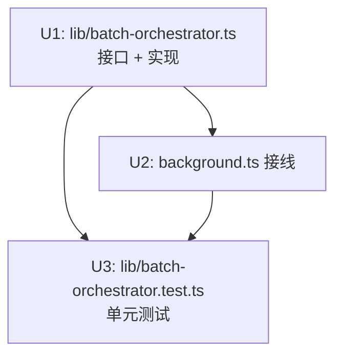

# refactor: Extract BatchOrchestrator to enable unit testing

## Overview

把 `background.ts` 中内联的批量生成循环（`handleRunBatch`）和批量发布循环（`handleApproveBatch`）抽出为独立的 `lib/batch-orchestrator.ts`，采用与 `lib/publish-orchestrator.ts` 完全一致的**效果注入模式**，使核心编排逻辑可在不 mock chrome API 的情况下完整单测。

## Problem Frame

`background.ts` 的两个批量处理函数各约 60–70 行，把编排逻辑（状态机推进顺序、守卫条件、break 时机）与 chrome 副作用（`browser.tabs.get`、`browser.tabs.sendMessage`、`storage.*`）内联混合。效果是：

- 核心的"生成循环逻辑"、"发布循环逻辑"**完全没有单测**；现有 161 条测试全在 `lib/` 层，background.ts 是盲区。
- `batchSeq` 是模块级可变状态，SW 重启后重置，且测试间污染。
- 与 `lib/publish-orchestrator.ts` 的成熟可测模式形成割裂——后者已被 6 条专项单测覆盖。

## Requirements Trace

- R1. 批量生成循环（RUN_BATCH）的守卫条件和状态推进逻辑可被独立单测，无需 chrome API。
- R2. 批量发布循环（APPROVE_BATCH）的守卫条件、orchestratePublish 调用时机、轨迹落档逻辑可被独立单测。
- R3. background.ts 在重构后功能语义不变，现有 161 条单测 + 23 条 e2e 全绿。
- R4. 消除模块级可变状态 `batchSeq`，注入 `genBatchId` 依赖使 ID 生成可控。

## Scope Boundaries

- **不做**：修改批量状态机本身（`lib/batch.ts`）。
- **不做**：修改 `publish-orchestrator.ts` 接口。
- **不做**：改变任何消息协议（`RuntimeMessage` 类型）。
- **不做**：在此 PR 内补 background.ts 的 integration test（属另一议题）。

## Context & Research

### Relevant Code and Patterns

- **参照模式**：`lib/publish-orchestrator.ts` + `lib/publish-orchestrator.test.ts`
  - `OrchestratorDeps` 接口把所有 chrome/storage 效果注入为普通 async 函数。
  - 测试用 `vi.fn()` 注入，不需 mock `browser.*`。
  - background.ts 的 `handlePublish` 只做接线（< 20 行）。
- **目标文件**：`entrypoints/background.ts`
  - `handleRunBatch`：~60 行，含生成循环 + pinnedHostOk + 状态转移 + 存储。
  - `handleApproveBatch`：~70 行，含发布循环 + sendFill + orchestratePublish 5 lambda + 轨迹。
  - `batchSeq`：module-level `let`，不可注入测试。
- **纯函数层**：`lib/batch.ts` 的所有状态机函数（markGenerating/markFilled/...）已是纯函数，可直接在 batch-orchestrator 中调用（不属于"副作用"）。
- **类型**：`lib/types.ts` 的 `ContentDraft`、`FillPageResponse`、`PublishResult`；`lib/batch.ts` 的 `Batch`、`BatchItem`；`lib/trajectory.ts` 的 `TrajectoryInput`；`lib/publish-orchestrator.ts` 的 `GateDecision`、`OrchestratorDeps`。

### Institutional Learnings

- `lib/publish-orchestrator.ts` 的做法已被 e2e/review 轮次验证，是本项目公认可测模式。
- background.ts 中 chrome 消息回调返回 `Promise` 即作为响应，接线代码越薄越好。
- `orchestratePublish` 在 `handleApproveBatch` 里**逐条调用**，每次 deps 都需要闭合当前 `batch` 变量（因为 `isAlreadyDispatched` 读当前 item 状态，`writeDispatched`/`writeConfirmed` 写当前 batch）。这是接口设计的核心约束。

## Key Technical Decisions

- **RunBatchDeps 和 ApproveBatchDeps 采用扁平注入，不嵌套工厂**：`ApproveBatchDeps` 直接注入 `evaluateGate`、`sendGrant` 等，由 `approveBatch` 内部构造 `OrchestratorDeps` 并调 `orchestratePublish`。避免双层嵌套，测试验证点清晰。
- **`genBatchId: () => string` 注入**：替换 `batchSeq` 模块状态；background.ts 用 `() => \`batch*\${Date.now()}*\${++localSeq}\`` 接线，本地变量、不污染测试。
- **`pinnedHostOk` 接口签名为 `(batch: Batch) => Promise<boolean>`**：tabId 在 background.ts 侧通过闭包传入，不暴露进接口；与现有调用模式一致。
- **轨迹记录（`appendTrajectory`）进 ApproveBatchDeps**：与发布结果在同一循环迭代，属"发布编排"的一部分，而非独立副作用。
- **batch 纯函数调用留在 orchestrator 内部**：`markGenerating`、`markFilled` 等状态机函数是纯函数（`lib/batch.ts`），直接 import 调用，不注入——不属于副作用。

## Open Questions

### Resolved During Planning

- `orchestratePublish` 在发布循环每条 item 时能否复用？是，batch-orchestrator 内部为每个 item 动态构造 `OrchestratorDeps` 闭合当前 `batch` 引用，再调 `orchestratePublish`。
- `batchSeq` 丢失会不会影响 BatchId 唯一性？不会，唯一性由 `Date.now()` + 局部自增序列保证，行为与现在等效。

### Deferred to Implementation

- `ApproveBatchDeps` 中 `sendFill` 是否需要额外超时保护？留到实现时对照 `lib/llm.ts`/`lib/publish.ts` 的 AbortController 纪律判断。

## High-Level Technical Design

> _This illustrates the intended approach and is directional guidance for review, not implementation specification._

```
background.ts                       lib/batch-orchestrator.ts
──────────────────                  ─────────────────────────
handleRunBatch(topics, tabId)
  └─ 构造 RunBatchDeps ──────────►  runBatch(deps: RunBatchDeps)
      resolveHost  ◄── browser.tabs      ├─ 守卫: host 解析/重入检查
      generateDraft ◄── lib/llm          ├─ 生成循环:
      save ◄── storage                   │  pinnedHostOk? → markGenerating
      pinnedHostOk  ◄── browser.tabs     │  → generateDraft → markFilled/Failed
      ...                                └─ presentForApproval → save

handleApproveBatch(tabId)
  └─ 构造 ApproveBatchDeps ─────►  approveBatch(deps: ApproveBatchDeps)
      evaluateGate ◄── safety-gate        ├─ for each awaiting-approval item:
      sendFill ◄── browser.tabs           │  pinnedHostOk?
      sendGrant ◄── browser.tabs          │  sendFill → orchestratePublish(...)
      appendTrajectory ◄── storage        │    └─ 内部构造 OrchestratorDeps 闭合 batch
                                          └─ appendTrajectory(非 dryRun)
```

## Implementation Units



---

- [ ] **Unit 1: 新建 `lib/batch-orchestrator.ts`**

**Goal:** 定义 `RunBatchDeps`、`ApproveBatchDeps` 接口并实现 `runBatch`/`approveBatch`，把 background.ts 中的两个编排循环逻辑搬入，所有 chrome/storage 副作用通过注入接口传入。

**Requirements:** R1, R2, R4

**Dependencies:** 无（纯 lib 层新文件）

**Files:**

- Create: `lib/batch-orchestrator.ts`

**Approach:**

`RunBatchDeps` 包含：`topics`（string[]）、`tabId`（number）、`resolveHost` (→ `string | null`)、`getExistingBatch` (→ `Batch | null`)、`pinnedHostOk` (`Batch` → `boolean`)、`generateDraft` (`topic` → `GenerateDraftResponse`)、`save` (`Batch` → `void`)、`genBatchId` (→ `string`)、`genItemId` (`index` → `string`)、`now` (→ `string`)。

`ApproveBatchDeps` 包含：`getBatch` (→ `Batch | null`)、`save` (`Batch` → `void`)、`pinnedHostOk` (`Batch` → `boolean`)、`sendFill` (`ContentDraft` → `FillPageResponse`)、`evaluateGate` (→ `GateDecision`)、`sendGrant` (→ `PublishResult`)、`appendTrajectory` (`TrajectoryInput` → `{ snapshotDropped: boolean }`)。

`approveBatch` 内部：为每条 `awaiting-approval` item 构造 `OrchestratorDeps` 闭合可变 `batch` 引用，调 `orchestratePublish`；非 dryRun 后调 `appendTrajectory`；`blocked` 时 `break`。逻辑语义与当前 `handleApproveBatch` 完全一致，只去除 `browser.*` 直接调用。

**Patterns to follow:**

- `lib/publish-orchestrator.ts`：接口定义风格、deps 扁平结构、错误结构化返回
- `lib/batch.ts`：直接 import 纯函数（markGenerating、markFilled 等）不注入
- `lib/llm.ts`、`lib/publish.ts`：超时处理纪律（如 sendFill 需要时补 AbortController，实现时决定）

**Test scenarios:** 见 Unit 3

**Verification:**

- `tsc --noEmit` 干净
- 文件不 import `#imports` 或 `browser.*`（纯 lib 层）

---

- [ ] **Unit 2: 更新 `entrypoints/background.ts`**

**Goal:** `handleRunBatch` 和 `handleApproveBatch` 改为纯接线代码（各 < 25 行），构造 deps 并调 `runBatch`/`approveBatch`；删除模块级 `batchSeq`，改为函数内局部自增。

**Requirements:** R3, R4

**Dependencies:** Unit 1

**Files:**

- Modify: `entrypoints/background.ts`

**Approach:**

`handleRunBatch` 结构：

1. 构造 `RunBatchDeps`，chrome/storage 调用通过 lambda 接线
2. `resolveHost` → `resolveTabHost(tabId)`（现有函数）
3. `generateDraft` → `generateDraft(buildPrompt(settings.promptTemplate, topic), { settings, apiKey })` 但 settings/apiKey 须**一次性**在 deps 构造时 await（不在循环内重复 await，性能 + 正确性）
4. `pinnedHostOk` → lambda 调现有 `pinnedHostOk(batch)` 工具函数

`handleApproveBatch` 结构：

1. 构造 `ApproveBatchDeps`
2. `evaluateGate` → lambda 调现有 `evaluateGate(tabId)`
3. `sendGrant`/`sendFill` → lambda 调 `browser.tabs.sendMessage`（现有逻辑）
4. `appendTrajectory` → 直接透传

`batchSeq`：删除模块级声明，改为在 `handleRunBatch` 内声明 `let seq = 0`（局部）；或在 `genBatchId` lambda 里用闭包。两种都可，实现时选更清晰的。

**Patterns to follow:**

- 现有 `handlePublish` 的接线写法（~20 行，对照参考）

**Test scenarios:**

- Test expectation: none — 接线代码属 chrome 边界层，现有 e2e 套件已覆盖端到端路径（23 条），不要在此添加单测

**Verification:**

- `pnpm test`（161 条）全绿，无新增 failure
- `pnpm test:e2e`（23 条）全绿
- `tsc --noEmit` 干净
- background.ts 中 `handleRunBatch`/`handleApproveBatch` 各 ≤ 25 行

---

- [ ] **Unit 3: 新建 `lib/batch-orchestrator.test.ts`**

**Goal:** 覆盖 `runBatch` 和 `approveBatch` 的核心守卫条件与状态推进逻辑，不依赖任何 chrome API。

**Requirements:** R1, R2

**Dependencies:** Unit 1

**Files:**

- Create: `lib/batch-orchestrator.test.ts`

**Approach:**

用 `vi.fn()` mock 所有注入效果，直接调 `runBatch`/`approveBatch`，断言返回的 `Batch` 状态和副作用调用顺序/次数。

**Patterns to follow:**

- `lib/publish-orchestrator.test.ts`：`makeDeps` helper 模式，`vi.fn()` + `expect(...).toHaveBeenCalledOnce()`

**Test scenarios:**

_runBatch_

- Happy path — 2 个 topic 均生成成功：最终 batch items 全部 `'filled'`，调 `presentForApproval` 后变 `'awaiting-approval'`；`generateDraft` 被调用 2 次，`save` 在每次状态变化后被调用。
- tab 漂移中断：`pinnedHostOk` 第 2 次返回 `false`，第 2 个 topic 不被生成（`generateDraft` 只调用 1 次），循环提前 break。
- 生成失败降级：`generateDraft` 返回 `{ ok: false }`，对应 item 变为 `error` 状态，循环继续处理下一条（不整体 abort）。
- 重入守卫：`getExistingBatch` 返回含隔离 topic 的批次，重复 topic 被 `filterReentrantTopics` 过滤，不重新生成。
- host 解析失败（resolveHost 返回 null）：不创建批次，直接返回 null。

_approveBatch_

- Happy path — authorized 真发：`sendFill` 成功 → `orchestratePublish`（内部 `evaluateGate` 返回 allowed=true）→ `sendGrant` 成功 → item 变 `publish-confirmed`；`appendTrajectory` 被调用 1 次（非 dryRun）。
- 填充失败：`sendFill` 返回 `{ ok: false }`，item 变 `error`，循环继续下一条；`appendTrajectory` 不被调用。
- 闸门拒绝（blocked）：`evaluateGate` 返回 `allowed=false`，item 留在 `awaiting-approval`，循环 break（不继续后续条目）。
- dry-run：`evaluateGate.mode === 'dry-run'` → `sendGrant` 不被调用，item 状态不变；`appendTrajectory` 不被调用（dryRun=true）。
- tab 漂移：`pinnedHostOk` 返回 false → 循环 break，后续条目不处理。
- 快照丢弃告警：`appendTrajectory` 返回 `{ snapshotDropped: true }`，不抛出，正常继续（告警由调用方的 `console.warn` 处理，测试可用 `vi.spyOn(console, 'warn')` 验证是否调用，可选）。

**Verification:**

- `pnpm test` 新增 ~11 条，全绿；总数 ≥ 172 条

## System-Wide Impact

- **Interaction graph:** `background.ts` 是扩展的消息路由唯一入口，接线变薄后路由行为不变；`lib/batch-orchestrator.ts` 不直接参与消息路由。
- **Error propagation:** 原有 try/catch 结构保留在 background.ts 接线层（生成失败/发布失败各自的 `console.error` 保留）。
- **State lifecycle risks:** `batchSeq` 模块级状态删除后，批次 ID 仍唯一（Date.now + 局部递增）；批次状态仍通过 `saveBatch` 持久化，SW 回收重启行为不变。
- **Unchanged invariants:** `executePublish`（content 侧）、`orchestratePublish`（lib 层）、`lib/batch.ts` 纯函数，均不改动。

## Risks & Dependencies

| Risk                                                              | Mitigation                                                                          |
| ----------------------------------------------------------------- | ----------------------------------------------------------------------------------- |
| `ApproveBatchDeps` 中 `sendFill` 缺超时保护                       | 实现 U1 时对照 `lib/publish.ts` 的 AbortController 纪律；若无超时守护则作 TODO 记录 |
| batchSeq 删除后 ID 生成逻辑出错                                   | U2 完成后 `pnpm test:e2e` 23 条（含批量路径）覆盖                                   |
| `orchestratePublish` 在 approveBatch 内部的 deps 闭合模式理解偏差 | U3 的 happy path 测试直接覆盖此路径，实现偏差会导致测试红                           |

## Sources & References

- Related code: `lib/publish-orchestrator.ts`, `lib/publish-orchestrator.test.ts`
- Related code: `entrypoints/background.ts`（`handleRunBatch`/`handleApproveBatch`）
- Related code: `lib/batch.ts`（状态机纯函数）、`lib/trajectory.ts`（appendRecord）
- Origin plan: `docs/plans/2026-06-04-002-feat-autonomous-publisher-pivot-plan.md`（U4/U6 已实现，此计划针对其可测性债务）
