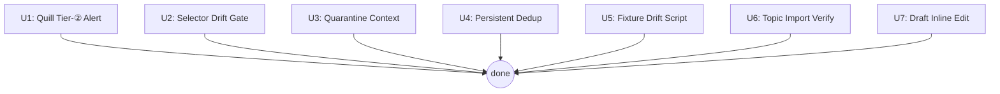

# feat: Batch reliability & UX hardening (7 improvements)

## Overview

Seven targeted improvements derived from open ideation on 2026-06-04. All are bounded changes to existing subsystems — no new external dependencies, no new chrome permissions. They fall into three themes: **silent failure observability** (U1, U2), **context on recovery** (U3, U4), **testing infrastructure** (U5, U6), and **batch workflow UX** (U7).

## Problem Frame

The core batch publish flow is functional but has multiple silent failure paths:
- Quill tier-② degradation is set but never surfaced to the operator
- Selector drift is detectable but only checked on demand — operators discover it after empty fills
- Quarantine releases are blind (no signal whether the post actually landed)
- Published topic history is lost on SW restart, allowing duplicate posts
- The fixture contract test runs through vitest but there is no standalone drift script
- Draft editing in batch requires exiting and re-generating, wasting LLM tokens

Each failure is small individually; together they erode operator trust in the automation.

## Requirements Trace

- R1. Quill tier-② degradation must be visible in the batch approval UI, not just in the single-topic flow
- R2. A selector drift warning must appear before fill is attempted, not after empty fields are produced
- R3. Quarantine release must show publishUrl and fill results when available
- R4. Published topics must survive SW restarts and exclude from future batches
- R5. A standalone `pnpm check:fixture-drift` command must exist and report missing selectors clearly
- R6. Batch topic textarea (already present) must be verified and documented; extend if needed
- R7. Batch approval must allow inline editing of draft fields before approving

## Scope Boundaries

- No new chrome permissions
- No changes to publish flow, safety gate, or trajectory chain structure
- No multi-user or multi-device sync
- No Playwright or headless browser mode
- Feature 3 (batch topic textarea) is **already implemented** in `BatchView.tsx:66–127`; U6 is a verify-and-extend unit only

## Context & Research

### Relevant Code and Patterns

- `lib/batch.ts` — Pure state machine. All `BatchItemStatus` transitions; `BatchItem.draft?: ContentDraft`; `BatchItem.publishUrl?`; `needs-human-verification` quarantine state
- `lib/batch-orchestrator.ts` — Effect-injection orchestration pattern. `approveBatch()` calls `sendFill()` then `appendTrajectory()`; fill results not surfaced to caller
- `lib/storage.ts` — All `chrome.storage.local` access. Existing keys: `local:batch`, `local:trajectory`, `local:settings`, `local:authorizedHosts`. Fail-closed reads (invalid → safe default)
- `lib/quill-paste.ts` — `pasteIntoQuill()` returns `PasteResult { ok, degraded? }`. Tier② path sets `degraded: true` at line 52
- `lib/body-bridge.ts` — `bodyResultFromOutcome()` maps `BodyFillOutcome.degraded` → `FieldFillResult { status: 'degraded' }`
- `lib/body-responder.ts` — MAIN-world Quill bridge; emits `BodyFilledDetail` with `degraded` field
- `lib/selectors.ts` — `checkSelectorDrift(doc, mapping): DriftReport { ok, missing[] }` — pure function
- `lib/messaging.ts` — `checkSelectors(tabId)` sends `CHECK_SELECTORS` and returns `DriftReport`
- `lib/field-mapping.ts` — `DEFAULT_FIELD_MAPPING` — no `#imports`, ESM-safe for scripts
- `lib/trajectory.ts` — `TrajectoryRecord { publishUrl?, fields: FieldFillResult[], id, seq, hash }`
- `entrypoints/sidepanel/BatchReviewPanel.tsx` — Pure/controlled component; props: `batch`, callbacks `onApprove/onKill/onRelease`. Quarantine card at lines 109–121
- `entrypoints/sidepanel/BatchView.tsx` — Owns batch state + trajectory state (line 34). `handleStart()` at lines 66–80 already splits topics on `\n`
- `entrypoints/sidepanel/DraftPreview.tsx` — Existing draft editor component with `onChange` prop
- `tests/e2e/fixtures/selectors.ts` — `KEY_SELECTORS` derived from `DEFAULT_FIELD_MAPPING`
- `tests/e2e/fixture-contract.test.ts` — Existing selector-presence contract test
- `scripts/check-fixture-secrets.sh` — Fail-closed script pattern reference
- `scripts/` — Custom scripts registered in `package.json`

### Institutional Learnings

- **Degraded propagation chain** (already repaired and merged): `quill-bridge.content.ts` previously dropped `degraded` on tier②; this is fixed. The chain from `quill-paste.ts → body-bridge.ts → body-responder.ts → FieldFillResult` is complete for the single-topic flow. **U1 adds only the batch-orchestrator and UI layers** — it does not repair the chain again.
- **Fail-closed storage**: every new storage read must return a safe default on invalid/missing values — never throw.
- **Batch write cadence**: `saveBatch()` called after every state transition; SW can be recycled at any moment.
- **Thin background wiring**: business logic belongs in `lib/`; `background.ts` handlers should be < 25 lines.
- **KEY_SELECTORS must be derived**: never hand-copy selectors into test fixtures — derive from `DEFAULT_FIELD_MAPPING` to prevent self-certifying contracts.
- **Two vitest configs**: unit tests use `vitest.config.ts` + WxtVitest; e2e tests use `vitest.e2e.config.ts` (no WxtVitest, plain jsdom). New scripts using `lib/` pure modules should use the e2e config or a plain Node.js runner.

### External References

No external research needed — local patterns are well-established for all 7 units.

## Key Technical Decisions

- **U7 draft edits: local React state (not new message type)**: Edits in the approval panel are transient — they don't need to survive a panel reload. A `Map<itemId, Partial<ContentDraft>>` in `BatchView` state merged at approve-time avoids a new `RuntimeMessage` variant and a background round-trip. Rejected: `PATCH_BATCH_DRAFT` message (unnecessary complexity for ephemeral UX).

- **U4 dedup store: max-1000 prune on write**: Persist published topics as `string[]` under `local:publishedTopics`. On every write, trim to the most recent 1000 entries. Simpler than TTL-based expiry; 1000 topics is months of production use before any entry is lost. Fail-closed read: non-array → empty array.

- **U5 fixture drift script: vitest e2e test file, not a raw Node.js script**: `lib/field-mapping.ts` has no `#imports` and can be imported in plain ESM, but running `.ts` in a `.mjs` script requires `tsx` (not yet a project dep). A new `tests/e2e/fixture-drift.test.ts` run via `vitest run --config vitest.e2e.config.ts tests/e2e/fixture-drift.test.ts` reuses the existing jsdom infrastructure with zero new deps. Rejected: raw `.mjs` script (requires tsx devDep or bundling step).

- **U2 drift gate: warn-and-proceed vs hard-block**: A hard block (prevent fill entirely) is the right default for batch — a batch of 10 that silently skips all fields is wasted LLM spend. For the single-topic flow, surface as a dismissible warning. Gate runs in `BatchView` by calling the existing `checkSelectors(tabId)` before `approveBatch`.

- **U3 quarantine context: look up trajectory by item.id**: `BatchView` already loads `trajectory` state (line 34). Pass a `trajectoryByItemId: Map<string, TrajectoryRecord>` prop to `BatchReviewPanel`. Rejected: separate `FETCH_TRAJECTORY_ITEM` message (unnecessary; data is already in scope).

## Open Questions

### Resolved During Planning

- **Is Feature 3 (batch topic textarea) already implemented?** Yes — `BatchView.tsx:66–127` has a textarea that splits on `\n` and strips empty lines. U6 verifies this behavior, documents it, and considers the "add topics to an active batch" extension as optional scope.
- **Does `checkSelectorDrift` need the full `FieldMapping` or just KEY_SELECTORS?** Full `FieldMapping` — the gate should catch any mapped field missing, not just the contract subset.
- **Where does U1 (Quill degradation) need to change?** The `degraded` flag already propagates to `FieldFillResult` in the single-topic flow. The gap is in `batch-orchestrator.ts:approveBatch()` which does not expose fill results to the batch item status, and in `BatchReviewPanel.tsx` which does not render degraded fill results.

### Deferred to Implementation

- **DraftPreview reuse in U7**: Editable fields in the batch approval card are: **title** (text input), **tags** (text input), **category** (select). Body is shown read-only. Reuse `DraftPreview.tsx` if it supports partial field binding via a fields prop or field-subset rendering; otherwise create a focused inline form rendering only those three fields. The `onChange` prop already exists on `DraftPreview.tsx`.

## High-Level Technical Design

> *This illustrates the intended approach and is directional guidance for review, not implementation specification. The implementing agent should treat it as context, not code to reproduce.*

**U7 draft edit flow (state + data):**
```
BatchView (state: draftOverrides: Map<itemId, Partial<ContentDraft>>)
  │
  ├─ BatchReviewPanel (props: batch, draftOverrides, onDraftPatch, ...)
  │    └─ per item in awaiting-approval:
  │         DraftPreview (value: merge(item.draft, draftOverrides.get(itemId)),
  │                       onChange: patch => onDraftPatch(item.id, patch))
  │
  └─ handleApprove(itemId):
       effectiveDraft = merge(item.draft, draftOverrides.get(itemId) ?? {})
       sendApprove(itemId, effectiveDraft)   ← existing APPROVE_BATCH message + effectiveDraft
```

**U2 drift gate (batch approval path):**
```
BatchView.handleApprove()
  → checkSelectors(batch.tabId)          ← existing messaging.ts helper
  → if !report.ok:
      show blocking alert(missing: report.missing)
      return (do not proceed)
  → approveBatch(itemId, draft)          ← existing path
```

**Implementation unit dependency graph:**



All 7 units are independent and can be executed in any order.

## Implementation Units

- [ ] **U1: Quill Tier-② Degradation Alert**

**Goal:** Propagate `PasteResult.degraded` into the batch approval UI so operators know when body content was written via innerHTML fallback, not Quill delta.

**Requirements:** R1

**Dependencies:** None

**Files:**
- Modify: `lib/batch-orchestrator.ts` — expose fill results on approved items
- Modify: `lib/batch.ts` — add `fillResults?: FieldFillResult[]` to `BatchItem` (this is the definitive file; `BatchItem` lives here, not in `lib/types.ts`; `FieldFillResult` is imported from `lib/types.ts` alongside the existing `ContentDraft` import)
- Modify: `entrypoints/sidepanel/BatchReviewPanel.tsx` — render degraded fill result badge/note on approved items
- Test: `lib/batch.test.ts` — verify `fillResults` stored on markFilled or markConfirmed

**Approach:**
- In `approveBatch()` (batch-orchestrator.ts), capture `fill.results` from the existing `sendFill()` response (the `fill` variable is already `FillPageResponse`; the capture point is already there). After the `fill.ok` guard (~line 105), persist via a new `markFillResultsRecorded(batch, itemId, results)` pure transition in `lib/batch.ts`, or a `patchItem` helper — either way, call `save(batch)` immediately after so SW recycle cannot lose the results.
- `BatchItem.fillResults?: FieldFillResult[]` holds the array after fill completes
- `BatchReviewPanel.tsx`: for approved/confirmed items, render a degraded badge when `fillResults.some(r => r.status === 'degraded')`, with expandable detail showing which fields degraded
- Reuse `FillResultPanel.tsx` styles/patterns for the per-field status display

**Patterns to follow:**
- `FillResultPanel.tsx` — existing per-field status rendering with color coding
- `bodyResultFromOutcome()` in `lib/body-bridge.ts` — how degraded maps to FieldFillResult

**Test scenarios:**
- Happy path: `approveBatch()` with tier① Quill fill → `item.fillResults` contains status `'filled'` for body field
- Error path: `approveBatch()` with tier② (no `window.Quill`) → `item.fillResults` contains status `'degraded'` for body field with a non-empty note
- Happy path: approved item with no degraded fields → no degraded badge in BatchReviewPanel
- Edge case: approved item with degraded body → degraded badge visible; expanding shows the field name and note

**Verification:**
- After approving a batch item in a jsdom fixture without `window.Quill`, the item renders a degraded indicator in the review panel
- Existing `pnpm test` passes with no regressions

---

- [ ] **U2: Proactive Selector Drift Gate**

**Goal:** Block batch approval (and optionally single-topic fill) when KEY_SELECTORS are missing from the live page, surfacing a clear warning before any fill is attempted.

**Requirements:** R2

**Dependencies:** None

**Files:**
- Modify: `entrypoints/sidepanel/BatchView.tsx` — call `checkSelectors()` before `approveBatch`, block on drift
- Modify: `entrypoints/sidepanel/App.tsx` — optionally call `checkSelectors()` before single-topic FILL_PAGE
- Test: `lib/messaging.test.ts` or new `lib/selectors.test.ts` — unit-test the gate logic path

**Approach:**
- Replace the direct `onApprove()` trigger in `BatchView.tsx` with an async wrapper: `async function handleApproveWithDriftCheck(itemId) { const report = await checkSelectors(batch.tabId); if (!report.ok) { setError(...); return; } onApprove(itemId); }`. Wire this to the approve button. If `!report.ok`, set a visible error state listing `report.missing` selectors — do not call `approveBatch`.
- For single-topic flow (App.tsx): surface as a dismissible warning (not hard-block) since the operator may intentionally fill a partially-configured page
- The gate uses the full `FieldMapping` (via existing `checkSelectors(tabId)` → content-side `checkSelectorDrift(document, mapping)`) — not just the e2e KEY_SELECTORS subset
- Keep the existing manual `CHECK_SELECTORS` button in the UI (unchanged); the proactive gate is additive

**Patterns to follow:**
- `checkSelectors(tabId)` in `lib/messaging.ts:61–67` — existing helper returns `DriftReport`
- Existing busy-state error handling in `BatchView.tsx` — how errors are shown to the user

**Test scenarios:**
- Happy path: all selectors present → `checkSelectors` returns `ok: true` → fill proceeds without warning
- Error path: one selector missing → `checkSelectors` returns `ok: false, missing: ['#title']` → blocking alert shown, fill does not start
- Edge case: `checkSelectors` throws (tab closed, content script not injected) → graceful error shown, fill does not start silently
- Integration: batch with 3 items, selector drift → warning blocks all 3 before any LLM spend on generation

**Verification:**
- In a test fixture where a mapped selector is absent, triggering batch approval renders an error message and does not call `sendFill`

---

- [ ] **U3: Quarantine Release with Context**

**Goal:** Show trajectory record data (publishUrl, fill results, failure reason) alongside the Release button for `needs-human-verification` items, so operators can decide to re-publish or discard with real information.

**Requirements:** R3

**Dependencies:** Reads `trajectory` state already managed in `BatchView` (line 34 — existing state, not new)

**Files:**
- Modify: `entrypoints/sidepanel/BatchView.tsx` — build `trajectoryByItemId` map and pass to BatchReviewPanel
- Modify: `entrypoints/sidepanel/BatchReviewPanel.tsx` — render trajectory context in quarantine card
- Test: `entrypoints/sidepanel/BatchReviewPanel.test.tsx` — verify context rendering for quarantined items

**Approach:**
- `BatchView.tsx` already loads `trajectory: TrajectoryRecord[]` in state (line 34)
- Build `Map<string, TrajectoryRecord>` keyed by `record.id` (which matches `BatchItem.id`)
- Pass as `trajectoryContext?: Map<string, TrajectoryRecord>` prop to `BatchReviewPanel`
- In `BatchReviewPanel`, for quarantined items, look up `trajectoryContext?.get(item.id)` and conditionally render:
  - If found with `publishUrl`: "可能已發布: [publishUrl]" (green link, labeled as unverified)
  - If found without `publishUrl`: "未收到發布確認" + fill result degraded/skipped summary
  - If not found: "無發布記錄 — 安全重試"
- This gives the operator a concrete signal before deciding to Release (re-publish) or Kill (discard)

**Patterns to follow:**
- Existing quarantine card in `BatchReviewPanel.tsx:109–121`
- `TrajectoryRecord` shape in `lib/trajectory.ts:9`

**Test scenarios:**
- Happy path: quarantined item with trajectory record including `publishUrl` → "可能已發布" with URL displayed
- Happy path: quarantined item with trajectory record but no `publishUrl` → "未收到發布確認" shown
- Edge case: quarantined item with no trajectory record → "無發布記錄 — 安全重試" shown
- Happy path: trajectory record with degraded body field → fill result summary highlights degraded field in quarantine card

**Verification:**
- BatchReviewPanel unit test renders all three context states correctly
- No change to Release/Kill button behavior — purely additive display

---

- [ ] **U4: Persistent Topic Deduplication Store**

**Goal:** Persist published/quarantined topics to `chrome.storage.local` so the dedup filter survives service worker restarts, preventing duplicate posts across sessions.

**Requirements:** R4

**Dependencies:** None

**Files:**
- Modify: `lib/storage.ts` — add `getPublishedTopics()`, `addPublishedTopics(topics)` with max-1000 prune
- Modify: `entrypoints/background.ts` — load persistent topics in `handleRunBatch` deps construction
- Modify: `lib/batch-orchestrator.ts` — extend `BatchOrchestratorDeps` with `getPublishedTopics`, persist confirmed topics after `appendTrajectory`
- Test: `lib/storage.test.ts` — new unit tests for the two new storage functions

**Approach:**
- New storage key `local:publishedTopics` stores `string[]`
- `getPublishedTopics()`: read → validate array → return; on invalid → return `[]` (fail-closed)
- `addPublishedTopics(newTopics: string[])`: read existing → Set-merge to dedup → trim to most recent 1000 → write back
- In `handleRunBatch` (background.ts): add `getPublishedTopics` to `BatchOrchestratorDeps`, pass result as seed for `filterReentrantTopics()`
- After `appendTrajectory` in `approveBatch`: call `deps.addPublishedTopics([item.topic])` — fire-and-forget, do not block the publish flow
- `filterReentrantTopics()` in batch.ts already accepts a seed set — extend or use as-is

**Patterns to follow:**
- `getAuthorizedHosts()` / `setAuthorizedHosts()` in `lib/storage.ts` — same fail-closed string[] pattern
- `filterReentrantTopics()` in `lib/batch.ts` — existing dedup logic to hook into

**Test scenarios:**
- Happy path: `addPublishedTopics(['topicA'])` → subsequent `getPublishedTopics()` returns `['topicA']`
- Edge case: add 1001 topics → store contains at most 1000 entries (oldest trimmed)
- Error path: storage returns invalid value (null, number) → `getPublishedTopics()` returns `[]` without throwing
- Integration: `handleRunBatch` with stored `['topicA']` → batch with `['topicA', 'topicB']` → only `['topicB']` queued

**Verification:**
- Unit tests pass for all storage scenarios
- After simulating a SW restart (clearing in-memory state), `getPublishedTopics()` still excludes previously published topics

---

- [ ] **U5: Fixture Freshness Watcher Script**

**Goal:** Add `pnpm check:fixture-drift` — a fast, standalone command that verifies all `DEFAULT_FIELD_MAPPING` selectors exist in the test fixture HTML, reporting any gaps clearly.

**Requirements:** R5

**Dependencies:** None

**Files:**
- Create: `tests/e2e/fixture-drift.test.ts` — new test file
- Modify: `package.json` — add `"check:fixture-drift"` script entry

**Approach:**
- New test file: `tests/e2e/fixture-drift.test.ts`
  - Imports `DEFAULT_FIELD_MAPPING` from `lib/field-mapping.ts` (no `#imports`, safe for e2e config)
  - Loads `tests/e2e/fixtures/webarticle-add.html` via `fs.readFileSync`
  - Parses with jsdom `new JSDOM(html).window.document`
  - For each entry in `DEFAULT_FIELD_MAPPING`, uses `document.querySelector(def.selector)` — fails with a clear message naming the selector if null
  - Derives the check from `DEFAULT_FIELD_MAPPING` directly (never hand-codes selector strings)
- `package.json` script: `"check:fixture-drift": "vitest run --config vitest.e2e.config.ts tests/e2e/fixture-drift.test.ts"`
- Reuse the existing e2e vitest config — no new deps needed

**Patterns to follow:**
- `tests/e2e/fixture-contract.test.ts` — existing fixture + jsdom selector-check pattern
- `tests/e2e/fixtures/selectors.ts` — how `KEY_SELECTORS` is derived from `DEFAULT_FIELD_MAPPING`

**Test scenarios:**
- Happy path: all DEFAULT_FIELD_MAPPING selectors present in fixture → test suite passes
- Error path: a selector from DEFAULT_FIELD_MAPPING absent from fixture → test fails with message identifying the missing selector by field name
- Contract: selector list is derived from DEFAULT_FIELD_MAPPING, not hand-coded — verified by reading the test source

**Verification:**
- `pnpm check:fixture-drift` exits 0 on current clean fixture
- Temporarily removing a selector from the fixture causes the command to fail with a clear message

---

- [ ] **U6: Batch Topic Import Verification and Documentation**

**Goal:** Verify that the existing batch textarea already handles newline-separated topic input correctly; document behavior; extend to support adding topics to an active batch if the existing behavior is insufficient.

**Requirements:** R6

**Dependencies:** None

**Files:**
- Read: `entrypoints/sidepanel/BatchView.tsx:66–127` — verify existing behavior
- Modify (if needed): `entrypoints/sidepanel/BatchView.tsx` — add trim/dedup to existing parse path
- Modify (if needed): `lib/batch.ts`, `entrypoints/background.ts` — add `ADD_BATCH_TOPICS` message for in-flight additions (optional scope)

**Approach:**
- Review `handleStart()` (BatchView.tsx:66–80) to confirm: (a) topics split on `\n`, (b) blank lines removed, (c) whitespace trimmed, (d) deduplication applied before `RUN_BATCH`
- Current code (`line 67`): `topics.split('\n').map(t => t.trim()).filter(Boolean)` — splits and trims but does **NOT** dedup. Dedup is missing and must be added: `[...new Set(topics.split('\n').map(t => t.trim()).filter(Boolean))]`
- The "add topics to an active batch" extension (for batches already in progress) is **out of scope for v1** unless the basic textarea is missing one of the above — adding new message types for mid-batch topic injection is a separate feature
- Add a comment in `BatchView.tsx` near `handleStart` documenting the supported input format

**Patterns to follow:**
- Existing `handleStart()` parse logic

**Test scenarios:**
- Happy path: textarea with 3 topics separated by `\n` → batch starts with 3 items
- Edge case: textarea with blank lines between topics → blank lines stripped, only non-empty topics queued
- Edge case: topic with leading/trailing whitespace → trimmed before queuing
- Edge case: duplicate topic in textarea → deduped before queuing

**Verification:**
- `pnpm test` unit tests for BatchView cover the parse edge cases
- Manual smoke: paste `"topicA\n\ntopicB\n  topicC  "` → 3 items in batch, none blank

---

- [ ] **U7: Draft Inline Edit Before Batch Approval**

**Goal:** Allow operators to edit draft fields (title, tags, category, body) directly in the side panel approval card before approving, eliminating the need to reject and regenerate for minor LLM output fixes.

**Requirements:** R7

**Dependencies:** None (can be done independently, but benefits from U1 being done first so degraded state is visible alongside the editable fields)

**Files:**
- Modify: `entrypoints/sidepanel/BatchView.tsx` — add `draftOverrides: Map<string, Partial<ContentDraft>>` state; pass to BatchReviewPanel; merge at approve time
- Modify: `entrypoints/sidepanel/BatchReviewPanel.tsx` — add `draftOverrides` and `onDraftPatch` props; render editable fields for `awaiting-approval` items
- Modify: `entrypoints/sidepanel/DraftPreview.tsx` — verify `onChange` prop is already wired and sufficient for partial field updates
- Test: `entrypoints/sidepanel/BatchReviewPanel.test.tsx` — edit flow tests

**Approach:**
- `BatchView` adds state: `const [draftOverrides, setDraftOverrides] = useState<Map<string, Partial<ContentDraft>>>(() => new Map())`
- `handleDraftPatch(itemId: string, patch: Partial<ContentDraft>)`: update the map with merged patch for that item
- Pass `draftOverrides` and `onDraftPatch` as props to `BatchReviewPanel`
- In `BatchReviewPanel`, for items in `awaiting-approval` state, render `DraftPreview` (or a focused subset: title input + tags input + category select) with `value={merge(item.draft, draftOverrides.get(item.id) ?? {})}` and `onChange={patch => onDraftPatch(item.id, patch)}`
- At approve time in `BatchView.handleApprove(itemId)`: compute `effectiveDraft = { ...item.draft, ...draftOverrides.get(itemId) }` and pass to the approve message
- Do NOT persist `draftOverrides` to storage — edits are intentionally ephemeral (survive panel usage session, not SW restart)
- If the approve message already accepts a draft parameter, use it; otherwise confirm with the background handler how `APPROVE_BATCH` carries the draft

**Patterns to follow:**
- `DraftPreview.tsx` — existing draft editor with `onChange?: (draft: ContentDraft) => void` prop
- Controlled component pattern in `BatchReviewPanel.tsx` — all state flows through props

**Test scenarios:**
- Happy path: user edits title → approves → `approveBatch` called with edited title in draft
- Happy path: user approves without editing → original LLM draft used unchanged
- Edge case: user edits then kills item → edit discarded, Map entry removed on kill
- Edge case: multiple items in awaiting-approval; user edits item A → only item A's draft is modified; item B approved with original draft
- Edge case: panel re-renders (e.g., another batch state update) → edits for awaiting-approval items preserved in Map state
- Integration: edited draft flows through `sendFill()` → fills page with edited title, not LLM title

**Verification:**
- Unit test: editing title in BatchReviewPanel and approving produces correct draft in onApprove callback
- `pnpm test` passes with no regressions in existing batch tests

## System-Wide Impact

- **Interaction graph:** All changes are confined to side panel UI (U1, U3, U7), `lib/storage.ts` (U4), `lib/batch-orchestrator.ts` (U1, U4), content-side drift check (U2), and e2e test infrastructure (U5). No changes to `lib/publish.ts`, `lib/trajectory.ts`, `lib/safety-gate.ts`, or the publish grant flow.
- **Error propagation:** U2 drift gate fails loudly (blocks with warning) rather than silently. U4 storage errors fail-closed (empty set, not thrown). U3 context rendering is purely additive and gracefully degrades when trajectory record is absent.
- **State lifecycle risks:** U4 adds a storage key that grows over time — max-1000 prune prevents unbounded growth. U7 draft overrides are ephemeral React state — no risk of stale storage state.
- **API surface parity:** `APPROVE_BATCH` message may need to carry the effective draft (for U7); verify the existing message shape in `lib/types.ts:RuntimeMessage` to confirm whether draft is already a parameter or must be added.
- **Integration coverage:** U7's critical integration path (edited draft → fill) requires a test that mocks `sendFill` and verifies it receives the patched draft, not the original.
- **Unchanged invariants:** Zero-submit invariant is unchanged — none of these features alter the form submission path. Safety gate, authorized host check, and trajectory hash chain are all unchanged.

## Risks & Dependencies

| Risk | Mitigation |
|------|------------|
| U7: `APPROVE_BATCH` message may not currently carry a draft parameter | Read `lib/types.ts` ApproveBatchMessage before implementing; add `draft?: ContentDraft` to the message type if absent |
| U5: `vitest run` with a specific file path may behave differently across vitest versions | Verify locally before committing the script |
| U4: fire-and-forget `addPublishedTopics` may race with subsequent reads | Acceptable for v1; topic dedup is best-effort, not a safety gate. Document this in code. |
| U2: `checkSelectors` round-trip adds ~50–100ms before every approval | Acceptable latency for a blocking confirmation action; no background polling needed |
| U5: `vitest run` with a specific file path may behave differently across vitest versions | Verify locally before committing the script |

## Documentation / Operational Notes

- U5 adds `pnpm check:fixture-drift` — document in `docs/e2e-and-iteration-guide.md` alongside existing `pnpm check:fixtures`
- U6: If the batch textarea trim/dedup already works correctly, add a one-line comment in `BatchView.tsx` near `handleStart` documenting the supported format (newline-separated, blank lines stripped)
- All 7 units should be committed as separate, atomic commits for easy bisect

## Sources & References

- **Origin document:** [docs/ideation/2026-06-04-open-ideation.md](../ideation/2026-06-04-open-ideation.md)
- Related plans: `docs/plans/2026-06-04-003-refactor-batch-orchestrator-plan.md` (batch state machine refactor — verify compatibility with U1 BatchItem changes)
- Related code: `lib/batch.ts`, `lib/batch-orchestrator.ts`, `lib/body-bridge.ts`, `lib/selectors.ts`, `entrypoints/sidepanel/BatchView.tsx`, `entrypoints/sidepanel/BatchReviewPanel.tsx`
