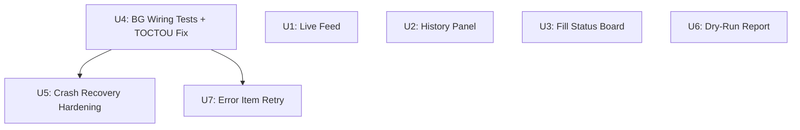

# feat: Batch Observability & Reliability Hardening

## Overview

Seven targeted improvements to the batch publish pipeline, grouped around three themes: **Observability** (see what is happening in real time), **Reliability** (harden crash recovery and state machine edges), and **UX completeness** (surface existing data that currently goes unused).

All 7 units build on the `feat/batch-reliability-ux` commit (`da275da`) and share the same foundational patterns: pure-function state machine in `lib/batch.ts`, effect-injection in `lib/batch-orchestrator.ts`, and fail-closed storage in `lib/storage.ts`.

## Problem Frame

After the first UX hardening round (U1–U7 in plan-004), the system has solid reliability _mechanisms_ but poor _visibility_ into them. The user sees a static UI during batch runs, cannot query publish history, and has no notification when crash-recovered items require attention. Simultaneously, several reliability gaps remain: background wiring is untested, the `evaluateGate` TOCTOU race persists, tombstoned fill-dispatches have no recovery path, and a single errored batch item forces a full batch restart.

## Requirements Trace

- R1. Batch state transitions are visible in real time without polling — `storage.watch` subscription on `local:batch`.
- R2. Publish history is queryable in the side panel — `trajectory.ts` infrastructure surfaced in a History view.
- R3. All three fill statuses (filled / skipped / degraded) are shown at approval time — not just degraded.
- R4. Background handler logic is independently unit-testable — `createHandlers(deps)` factory pattern.
- R5. `evaluateGate` reads tab host and safety mode in a single atomic snapshot — no TOCTOU window.
- R6. Fill-dispatched items that survive a SW restart without an ACK are detected and quarantined — tombstone protocol.
- R7. SW startup proactively notifies the operator of items requiring human verification.
- R8. Dry-run mode produces a structured fill-result report instead of a silent `ok:true`.
- R9. A single errored or aborted batch item can be retried without restarting the whole batch.

## Scope Boundaries

- No parallel LLM generation (MV3 SW ~30s lifecycle makes it unsafe).
- No auto-approve fast-path (removes human safety gate).
- No cross-device export/import for `publishedTopics` (single-operator, YAGNI).
- No fuzzy topic deduplication (NLP complexity, exact dedup covers the use case).
- No full background pre-warm (second batch while reviewing first violates single-batch invariant).
- The TERMINAL set in `lib/batch.ts` is not modified — `retryBatchItem()` uses an explicit operator-override path that bypasses guards with documented intent.

## Context & Research

### Relevant Code and Patterns

- `lib/batch.ts` — pure state machine; `transition()` guard; `TERMINAL` set; `patchItem()` internal helper
- `lib/batch-orchestrator.ts` — effect-injection pattern via `RunBatchDeps` / `ApproveBatchDeps`; `approveBatch` loop at lines 100–155
- `lib/storage.ts` — all `local:` keys; `getTrajectory()`, `getBatch()`, `saveBatch()`, `getPublishedTopics()`
- `lib/trajectory.ts` — `verifyTrajectory()`, `rollbackTargets()`, `TrajectoryRecord` shape
- `entrypoints/background.ts` — `evaluateGate()` (TOCTOU at lines 80–85); current if-chain message router
- `entrypoints/sidepanel/BatchView.tsx` — container; `refresh()` callback; conditional section rendering
- `entrypoints/sidepanel/BatchReviewPanel.tsx` — approval panel; `DegradedBadge` component; `FieldFillResult` rendering
- `lib/batch-orchestrator.test.ts` — canonical injection-pattern test; colocated with source
- `lib/types.ts` — `RuntimeMessage` union at lines 100–114; message shape conventions

### Institutional Learnings

- Background handlers must stay < 25 lines each; business logic goes in `lib/` — established in plan-003.
- Effect injection (not mock patching) is the test pattern for all orchestrator functions — established in plan-003 and proven in `batch-orchestrator.test.ts`.
- Storage reads are fail-closed: `Array.isArray(v) ? v : []` pattern; never throw on invalid data.
- MV3 SW can restart at any time; every meaningful state transition must be persisted before returning.
- `#imports` (WXT-specific) must stay out of e2e tests — use plain imports in `vitest.e2e.config.ts` test files.

### External References

- None required: all patterns (storage.watch, chrome.storage.onChanged, BroadcastChannel) are WXT-wrapped and precedent is sufficient from local code.

## Key Technical Decisions

- **storage.watch vs chrome.storage.onChanged**: Use WXT's `storage.watch('local:batch', cb)` in `BatchView.tsx` `useEffect`; returns an `unwatch()` cleanup function. Debounce the React setState call at ~100ms to coalesce rapid transitions on large batches. This is the MV3-correct push path; no polling needed.

- **History Panel placement**: Add a simple toggle ("批次" / "历史") in `BatchView.tsx` header rather than a new route. The side panel is single-page; a state variable `view: 'batch' | 'history'` controls which section renders.

- **Background handler extraction approach**: Keep `background.ts` as the entry point but export `createHandlers(deps: BackgroundHandlerDeps)` for testing. The live `defineBackground` block calls `createHandlers(liveDeps)` and wires it to `runtime.onMessage`. Test file co-located: `entrypoints/background.test.ts`.

- **TOCTOU fix sequencing**: Change `evaluateGate` to run `Promise.all([getSafetyMode(), getAuthorizedHosts(), resolveTabHost(tabId)])` in a single concurrent read, eliminating the window between the two existing `await` points. The host is now always snapshotted in the same microtask as mode/hosts.

- **Tombstone storage shape**: Single key `local:fillTombstones` → `Record<itemId, { tabId: number; ts: string }>`. Simpler than N individual keys; a single `setItem` and `getItem` handles the full map. Add `writeFillTombstone`, `clearFillTombstone`, `getFillTombstones` to `lib/storage.ts`.

- **SW startup quarantine alert mechanism**: Persist `local:pendingQuarantineAlert: number` (count of items requiring attention). Side panel reads this on mount and shows a dismissible banner. Dismissed by clearing the key. This avoids the `chrome.notifications` permission requirement and works even if the side panel was closed during the crash.

- **DryRunReport shape**: `local:dryRunReport` → `DryRunReport` type: `{ batchId: string; ts: string; items: DryRunItemResult[] }` where `DryRunItemResult = { itemId, topic, fillResults: FieldFillResult[], draftTitle?: string }`. Written after every dry-run `approveBatch` call; overwritten each time. Side panel shows it when `safetyMode === 'dry-run'` and report is present.

- **RETRY_BATCH_ITEM operator override**: Add `retryBatchItem(batch, itemId): Batch` to `lib/batch.ts` — directly calls `patchItem` bypassing `transition` guards. Documented as an explicit operator-override: `error` and `aborted` remain in `TERMINAL` for all _automated_ paths. A new `retryItem(deps, itemId)` orchestrator function in `lib/batch-orchestrator.ts` runs: `retryBatchItem` → `save` → `markGenerating` → `generateDraft` → `markFilled` → `presentForApproval` → `save` → return batch. (Two saves: one after retryBatchItem to flush the status change before any concurrent reader sees `queued`, one after presentForApproval to flush the approval-ready state.)

## Open Questions

### Resolved During Planning

- **Should `error` be removed from TERMINAL for retry?** No — TERMINAL remains unchanged. `retryBatchItem` is an explicit operator bypass, not an automated transition. This preserves all invariants that depend on `isTerminal()`.
- **Can fillResults in dry-run be collected before the early return?** Yes — `markFillResultsRecorded` is called at batch-orchestrator.ts L117–118, which is before the `if (r.dryRun) return` at L133. The data is already in the batch state; only persistence and rendering are missing.
- **Does WXT's storage.watch work in side panel context (not SW)?** Yes — WXT wraps `chrome.storage.onChanged` and the side panel is a privileged extension page; the watch API is available in any extension context.

### Deferred to Implementation

- **Exact debounce value for storage.watch**: 100ms is the starting point; tune based on perceived jank on a 20-item batch in the real panel.
- **Whether tombstone scan on SW startup adds measurable latency**: Measure at implementation time; if scan is slow, gate behind a config flag.
- **`presentForApproval` side-effect in retryItem**: Check whether calling it mid-batch (when other items are already `awaiting-approval`) re-transitions them or only advances the retried item. The implementation of `presentForApproval` in batch.ts transitions all `filled` → `awaiting-approval`, so only the retried item (which just became `filled`) will be advanced.

## High-Level Technical Design

> _This illustrates the intended approach and is directional guidance for review, not implementation specification. The implementing agent should treat it as context, not code to reproduce._

**Dependency graph — implementation units:**



U1, U2, U3, U6 are fully independent and can be implemented in any order or in parallel. U5 and U7 benefit from U4's handler extraction being complete first (adding new handlers and deps to the refactored factory is cleaner than adding them to the original if-chain).

**Storage.watch live feed flow:**

```
background.ts
  └─ save(batch) after every transition
       └─ chrome.storage.local.set('local:batch', ...)
            └─ storage.onChanged fires
                 └─ BatchView.tsx storage.watch listener
                      └─ debounced setState(batch) → re-render progress
```

**DryRunReport data flow:**

```
approveBatch (dry-run mode)
  ├─ sendFill(item.draft) → fill.results
  ├─ markFillResultsRecorded(batch, itemId, fill.results)   [existing]
  ├─ orchestratePublish → { ok:true, dryRun:true }          [existing]
  │   └─ (NEW) collect item summary into dryRunItems[]
  └─ (NEW) saveDryRunReport({ batchId, ts, items: dryRunItems })
       └─ side panel reads local:dryRunReport when mode === dry-run
```

## Implementation Units

- [ ] **U1: Batch Progress Live Feed**

**Goal:** Side panel receives real-time batch state updates via storage.watch, eliminating the need for manual refresh or polling.

**Requirements:** R1

**Dependencies:** None

**Files:**

- Modify: `entrypoints/sidepanel/BatchView.tsx`
- Test: `entrypoints/sidepanel/BatchView.test.tsx` (new or extend)

**Approach:**

- In `BatchView`'s `useEffect`, call `storage.watch('local:batch', handler)` after the initial `refresh()`. Store the returned `unwatch` function and call it on cleanup.
- The handler receives `(newBatch, oldBatch)`. Debounce calling `setBatch(newBatch)` at ~100ms. Also refresh `safetyMode` and `tabHealthy` on change (or keep them as separate watch subscriptions).
- Remove the dependency on manual refresh for in-progress batch updates. The "完成批量" button should still trigger a `refresh()` to pick up final trajectory state.
- Do NOT break the existing `refresh()` call pattern — it must still work for initial load and post-action updates.

**Patterns to follow:**

- `BatchView.tsx` `useEffect` with `useCallback` (`refresh` is already a `useCallback`)
- WXT `storage.watch` returns an unwatch function (same cleanup pattern as `browser.runtime.onMessage.addListener` removal)

**Test scenarios:**

- Happy path: storage.watch fires with updated batch → setBatch called with new value, UI reflects new status
- Edge case: watch fires with null/undefined → falls back gracefully, no setState(null) crash
- Edge case: rapid fire (5 events within 50ms) → debounce coalesces into 1 setState call
- Cleanup: component unmounts → unwatch called, no setState after unmount (memory leak check)
- Integration: background calls `saveBatch(updatedBatch)` → side panel re-renders without explicit refresh call

**Verification:**

- Side panel shows per-item status updates during a batch run without the user pressing refresh
- No console errors on component unmount
- Existing test suite passes (no regressions from the new effect)

---

- [ ] **U2: Publish History Panel**

**Goal:** Operators can review publish history from the side panel, including chain integrity status and post links.

**Requirements:** R2

**Dependencies:** None

**Files:**

- Modify: `entrypoints/sidepanel/BatchView.tsx`
- Create: `entrypoints/sidepanel/HistoryPanel.tsx`
- Test: `entrypoints/sidepanel/HistoryPanel.test.tsx` (new)

**Approach:**

- Add `view: 'batch' | 'history'` state to `BatchView.tsx`. Toggle button in the header row ("批次" / "历史").
- `HistoryPanel` reads `local:trajectory` via `getTrajectory()` on mount. Shows records newest-first in a scrollable list.
- Each row: topic, status badge (`publish-confirmed` / `error` / etc.), timestamp (relative), publish URL as a clickable link, fill-degraded count from `fields` if present.
- Run `verifyTrajectory(records)` once on load; show a ✓ chain-intact / ⚠ chain-anomaly banner at the top.
- `rollbackTargets(records)` rows get an additional "查看帖子" CTA next to the URL.
- Paginate at 20 records (simple slice + "加载更多" button).
- History panel is read-only: no delete, no re-publish from here (those belong to other units).

**Patterns to follow:**

- `BatchView.tsx` conditional section rendering pattern
- `TrajectorySection` component in BatchView.tsx (already exists for the trajectory section — HistoryPanel replaces/extends this)
- Existing `verifyTrajectory` + `rollbackTargets` calls in BatchView.tsx lines 159–186

**Test scenarios:**

- Happy path: 3 trajectory records → renders 3 rows with topic, URL, timestamp
- Happy path: verifyTrajectory returns true → chain-intact banner shown
- Edge case: empty trajectory → "暂无发布记录" empty state, no error
- Edge case: trajectory with no publishUrl → row renders without URL link (no broken href)
- Edge case: verifyTrajectory returns false → chain-anomaly warning banner shown
- Edge case: 25 records → only 20 shown, "加载更多" button available
- Integration: `getTrajectory()` resolves with records → component renders them (no mock storage)

**Verification:**

- History tab accessible from side panel header toggle
- All trajectory records display with correct fields
- Chain integrity badge reflects actual `verifyTrajectory()` result
- Clicking a publish URL opens in a new tab

---

- [ ] **U3: Fill-Skip Full Status Board**

**Goal:** At approval time, operators can see filled / skipped / degraded counts for every batch item, not just the degraded badge.

**Requirements:** R3

**Dependencies:** None

**Files:**

- Modify: `entrypoints/sidepanel/BatchReviewPanel.tsx`
- Test: `entrypoints/sidepanel/BatchReviewPanel.test.tsx` (new or extend)

**Approach:**

- Replace the existing `DegradedBadge` component (shown only for degraded fields) with a new `FillStatusTable` component that accepts `results: FieldFillResult[]` and renders a compact 3-column table: filled (green) / skipped (amber) / degraded (red) with counts.
- Expand row on click: show each skipped/degraded field's `note` string.
- Show `FillStatusTable` for any item that has `fillResults` (not just degraded), collapsed by default.
- If `fillResults` is all-filled and no degraded/skipped, show a minimal "✓ 全部字段已填" inline (not a table).
- Keep the existing `DegradedBadge` import chain — replace the `DegradedBadge` usage site in the expanded item card, not the component definition (or rename and extend).

**Patterns to follow:**

- `DegradedBadge` component in `BatchReviewPanel.tsx` (lines 9–29) for expand/collapse pattern
- `STATUS_LABEL` map pattern for status-to-display-string mapping
- `FieldFillResult.status` three-state: `'filled' | 'skipped' | 'degraded'`

**Test scenarios:**

- Happy path: 3 fields — 2 filled, 1 skipped → table shows filled:2 skipped:1 degraded:0
- Happy path: all fields filled → "✓ 全部字段已填" shown, no table
- Happy path: expand skipped row → note "category 无匹配选项: 2" visible
- Edge case: `fillResults` is empty array → treat as "no data", no table shown
- Edge case: `fillResults` is undefined → falls back gracefully (same as before, only degraded badge logic applied)
- Edge case: 1 degraded field → red badge with note shown (regression check: preserves plan-004 DegradedBadge behavior from plan-004's U1)

**Verification:**

- Opening an approval-card item shows fill status for all three states
- Skipped fields display their `note`
- No regression on degraded-only display from existing U1 badge

---

- [ ] **U4: Background Wiring Unit Tests + TOCTOU evaluateGate Fix**

**Goal:** Background handlers are independently unit-testable; `evaluateGate` eliminates the TOCTOU race.

**Requirements:** R4, R5

**Dependencies:** None (foundational; should land before U5 and U7 to simplify their handler additions)

**Files:**

- Modify: `entrypoints/background.ts`
- Create: `entrypoints/background.test.ts`

**Approach:**

- Extract all five `handleXxx` functions plus `evaluateGate` into a `createHandlers(deps: BackgroundHandlerDeps)` exported factory. The `defineBackground` block calls `createHandlers(liveDeps)` and wires the result to `runtime.onMessage`.
- `BackgroundHandlerDeps` includes: `getBatch`, `saveBatch`, `getSettings`, `getApiKey`, `getPublishedTopics`, `addPublishedTopics`, `appendTrajectory`, `getSafetyMode`, `getAuthorizedHosts`, `tabsGet(tabId)`, `tabsSendMessage(tabId, msg)`, `storageSetItem`, `storageGetItem`, `generateDraftFn`, `buildBatchId`, `buildItemId`, `now`.
- **TOCTOU fix**: In `evaluateGate`, change from two sequential awaits to `Promise.all([getSafetyMode(), getAuthorizedHosts(), resolveTabHost(tabId)])`. All three reads happen in the same microtask batch. Use the snapshotted host in `canSubmit`.
- Test file at `entrypoints/background.test.ts` (colocated, same as `lib/batch.test.ts` pattern). Import `createHandlers` directly; pass stub deps.

**Execution note:** Write at least one failing test for `evaluateGate` TOCTOU _before_ applying the fix to confirm the test catches the original race.

**Patterns to follow:**

- `lib/batch-orchestrator.ts` `RunBatchDeps` / `ApproveBatchDeps` interface + factory pattern
- `lib/batch-orchestrator.test.ts` injection-based test structure (describe / it / vi.fn() stubs)
- `defineBackground` should remain ≤ 25 lines after extraction (per plan-003 principle)

**Test scenarios:**

- Happy path: `handleRunBatch` called with valid topics + tabId → `generateDraftFn` called once per topic
- Happy path: `handleApproveBatch` called → `tabsSendMessage` called with FILL_PAGE
- Error path: `tabsGet` throws → `handleRunBatch` returns `null` (not throws)
- Error path: `tabsSendMessage` rejects → `handleApproveBatch` marks item error, does not throw
- TOCTOU fix: mock `getSafetyMode` to return `authorized` and `tabsGet` to return a different host between two reads; new implementation reads atomically → gate returns `allowed: false`
- Edge case: `GET_BATCH` message → routes to `getBatch()` stub, not to a `handleXxx` function
- Integration: `KILL_BATCH` message → `abortBatch` applied to stored batch, result returned

**Verification:**

- `entrypoints/background.test.ts` runs under `vitest run --config vitest.config.ts` without `#imports` errors
- All 5 handler functions have ≥ 1 passing test
- TOCTOU test passes after fix, was failing before
- `background.ts` `defineBackground` block is ≤ 25 lines

---

- [ ] **U5: Crash Recovery Hardening — Tombstone Protocol + SW Startup Quarantine Alert**

**Goal:** Items whose fill was dispatched but SW died before ACK are detected and quarantined on restart; operator is notified.

**Requirements:** R6, R7

**Dependencies:** U4 (easier to add tombstone deps to the extracted `BackgroundHandlerDeps` than to the original if-chain)

**Files:**

- Modify: `lib/storage.ts`
- Modify: `lib/batch-orchestrator.ts`
- Modify: `entrypoints/background.ts`
- Modify: `entrypoints/sidepanel/BatchView.tsx`
- Test: `lib/batch-orchestrator.test.ts` (extend)

**Approach:**

- **Storage**: Add `FILL_TOMBSTONES_KEY = 'local:fillTombstones'` and `QUARANTINE_ALERT_KEY = 'local:pendingQuarantineAlert'` to `lib/storage.ts`. Add `writeFillTombstone(itemId, { tabId, ts })`, `clearFillTombstone(itemId)`, `getFillTombstones()`, `setPendingQuarantineAlert(count)`, `clearPendingQuarantineAlert()`, `getPendingQuarantineAlert()` functions (all fail-closed).
- **Orchestrator**: Add `writeTombstone(itemId)` and `clearTombstone(itemId)` to `ApproveBatchDeps`. In `approveBatch` loop, call `writeTombstone(item.id)` before `sendFill`, then `clearTombstone(item.id)` after a successful fill ACK. If fill fails (fill.ok === false), still call `clearTombstone` (the item went to error state, not dispatched-limbo).
- **SW startup**: In `defineBackground` startup block — call `getBatch()` (which runs `recoverBatch` on dispatched items), then call `getFillTombstones()`. Any tombstone entries that remain for items now in `needs-human-verification` confirm the recovery path. Items in tombstone with no corresponding batch entry are stale — clear them. After reconciliation, count total `needs-human-verification` items; if > 0, call `setPendingQuarantineAlert(count)`.
- **Side panel**: In `BatchView.tsx` `refresh()`, also read `getPendingQuarantineAlert()`. If non-zero, show a dismissible banner: "N 条帖子在上次关机时状态不确定，请前往历史面板核对后再继续。" Button: "我知道了" → calls `clearPendingQuarantineAlert()` + re-read.

**Patterns to follow:**

- `lib/storage.ts` fail-closed read pattern: `const v = await storage.getItem<unknown>(KEY); return isValidShape(v) ? v : defaultValue`
- `ApproveBatchDeps` injection in `lib/batch-orchestrator.ts` (add two new optional deps with safe defaults)
- `lib/batch-orchestrator.test.ts` existing test for `sendFill` failure path

**Test scenarios:**

- Happy path: `writeFillTombstone('item1')` → `getFillTombstones()` returns `{ item1: { tabId, ts } }`
- Happy path: `clearFillTombstone('item1')` after fill ACK → tombstone removed
- Edge case: `getFillTombstones()` with no stored data → returns `{}`
- Edge case: `getFillTombstones()` with corrupt data → returns `{}` (fail-closed)
- Integration: `approveBatch` flow — tombstone written before sendFill, cleared after successful fill
- Integration: `approveBatch` flow — sendFill fails → tombstone cleared (item marked error, not dispatched-limbo)
- SW startup: `pendingQuarantineAlert` set to 2 after `getBatch()` returns batch with 2 `needs-human-verification` items
- Side panel: `getPendingQuarantineAlert()` returns 2 → banner rendered; "我知道了" click → banner dismissed

**Verification:**

- A batch item's tombstone is always cleared before the item's final state is written
- SW restart with residual tombstone entries triggers `needs-human-verification` for those items
- `pendingQuarantineAlert` banner appears in BatchView when alert count > 0
- New storage functions have fail-closed behavior under invalid/missing data

---

- [ ] **U6: Dry-Run Fill Report**

**Goal:** Dry-run mode produces a per-field fill-result report instead of a silent `ok:true`.

**Requirements:** R8

**Dependencies:** None

**Files:**

- Modify: `lib/types.ts`
- Modify: `lib/storage.ts`
- Modify: `lib/batch-orchestrator.ts`
- Create: `entrypoints/sidepanel/DryRunReport.tsx`
- Modify: `entrypoints/sidepanel/BatchView.tsx`
- Test: `lib/batch-orchestrator.test.ts` (extend)

**Approach:**

- **Types**: Add `DryRunItemResult = { itemId: string; topic: string; fillResults: FieldFillResult[]; draftTitle?: string }` and `DryRunReport = { batchId: string; ts: string; items: DryRunItemResult[] }` to `lib/types.ts`.
- **Storage**: Add `DRY_RUN_REPORT_KEY = 'local:dryRunReport'` and `saveDryRunReport(report)` / `getDryRunReport()` to `lib/storage.ts`. Fail-closed read.
- **Orchestrator**: Add `saveDryRunReportFn?: (report: DryRunReport) => Promise<void>` to `ApproveBatchDeps` (optional, no-op default). In `approveBatch` loop, after the `if (r.dryRun) return` branch (which now becomes: collect `DryRunItemResult` from the batch item), continue accumulating. After the loop completes in dry-run mode, call `saveDryRunReportFn?.({ batchId, ts, items })`.
- **UI**: `DryRunReport.tsx` — reads `getDryRunReport()` on mount; renders a table: topic / filled count / skipped count / degraded count / title preview. Collapsed detail row with per-field status. "清除报告" button clears `local:dryRunReport`.
- **BatchView**: Show `<DryRunReport />` below the review panel when `safetyMode === 'dry-run'` and a report exists in storage. Load on refresh.

**Patterns to follow:**

- `addPublishedTopics` fire-and-forget pattern (optional dep with no-op default)
- `HistoryPanel.tsx` table rendering (same visual conventions)
- `lib/storage.ts` `getPublishedTopics` fail-closed array read pattern

**Test scenarios:**

- Happy path: `approveBatch` runs in dry-run with 2 items → `saveDryRunReportFn` called with report containing 2 `DryRunItemResult` entries
- Happy path: each `DryRunItemResult` contains `fillResults` matching what `markFillResultsRecorded` recorded
- Edge case: `saveDryRunReportFn` throws → `approveBatch` does not rethrow (best-effort, same as `addPublishedTopics`)
- Edge case: `getDryRunReport()` on empty/corrupt storage → returns `null` (no crash)
- Edge case: `approveBatch` called in non-dry-run mode → `saveDryRunReportFn` NOT called
- Integration: `DryRunReport` component mounts → reads storage, renders report; "清除报告" click → storage cleared, component re-renders to empty state

**Verification:**

- After a dry-run batch approval, `local:dryRunReport` is populated with fill results per item
- `DryRunReport` UI renders when `safetyMode === 'dry-run'` and report data present
- No-op when `saveDryRunReportFn` is not provided (backwards compatible)
- Non-dry-run approval does not write to `local:dryRunReport`

---

- [ ] **U7: Batch Error-Item Granular Retry (RETRY_BATCH_ITEM)**

**Goal:** A single `error` or `aborted` batch item can be re-queued and re-generated without restarting the whole batch.

**Requirements:** R9

**Dependencies:** U4 (add `RETRY_BATCH_ITEM` handler to the extracted `createHandlers` factory)

**Files:**

- Modify: `lib/batch.ts`
- Modify: `lib/batch-orchestrator.ts`
- Modify: `lib/types.ts`
- Modify: `entrypoints/background.ts`
- Modify: `entrypoints/sidepanel/BatchReviewPanel.tsx`
- Modify: `entrypoints/sidepanel/BatchView.tsx`
- Test: `lib/batch.test.ts` (extend)
- Test: `lib/batch-orchestrator.test.ts` (extend)

**Approach:**

- **State machine**: Add `retryBatchItem(batch: Batch, itemId: string): Batch` to `lib/batch.ts`. This function directly calls `patchItem(batch, itemId, { status: 'queued', error: undefined, fillResults: undefined })` — intentionally bypassing `transition` guards. Document with a comment: _"Operator-override path; only reachable via explicit RETRY_BATCH_ITEM message. `error` and `aborted` remain TERMINAL for all automated transitions."_
- **Orchestrator**: Add `retryItem(deps: RunBatchDeps, itemId: string): Promise<Batch | null>` to `lib/batch-orchestrator.ts`. Logic: `getBatch` → `retryBatchItem(batch, itemId)` → `save` → run the generate pipeline for only that item (same as `runBatch` single-item: `markGenerating` → `generateDraft` → `markFilled`) → `presentForApproval` → `save` → return batch.
- **Types**: Add `{ type: 'RETRY_BATCH_ITEM'; itemId: string }` to `RuntimeMessage` union in `lib/types.ts`.
- **Background**: Add `RETRY_BATCH_ITEM` case to the `createHandlers` router; handler calls `retryItem(deps, message.itemId)`.
- **UI**: In `BatchReviewPanel.tsx`, for items with `status === 'error' || status === 'aborted'`, show a "重试此条" button in the expanded card. Add `onRetryItem?: (itemId: string) => void` prop. In `BatchView.tsx`, wire it to a new `withBusy` handler that calls `retryItem` (new message).

**Patterns to follow:**

- `patchItem` usage in `lib/batch.ts` (direct internal mutation bypass — only three existing call sites)
- `runBatch` single-item loop structure in `lib/batch-orchestrator.ts` (mirror for retryItem)
- `RELEASE_QUARANTINE` message type pattern in `lib/types.ts`
- `onRelease` prop + button in `BatchReviewPanel.tsx` — mirror for `onRetryItem`

**Test scenarios:**

- Happy path: `retryBatchItem(batch, 'item1')` where item1.status === 'error' → returns batch with item1.status === 'queued', item1.error === undefined
- Happy path: `retryBatchItem(batch, 'item1')` where item1.status === 'aborted' → same as above
- Edge case: `retryBatchItem(batch, 'nonexistent-id')` → returns batch unchanged (patchItem is a no-op for missing IDs)
- Edge case: `retryBatchItem` called on item with status 'publish-confirmed' → still succeeds (operator override, no guard — document as intentional risk)
- Integration: `retryItem(deps, itemId)` orchestrates full generate pipeline for one item; other items in batch are not modified
- Integration: `retryItem` calls `generateDraft` once for the retried item's topic
- Error path: `generateDraft` fails in `retryItem` → item marked `error` again, no throw to caller
- UI: "重试此条" button visible for error/aborted items; triggers `onRetryItem` callback

**Verification:**

- `retryBatchItem` moves error/aborted item to queued without touching other items
- `retryItem` orchestrates the full generate-fill-present pipeline for one item
- RETRY_BATCH_ITEM message routes to correct handler
- "重试此条" button appears in the expanded card for error and aborted items only

---

## System-Wide Impact

- **Interaction graph:** `storage.watch` in BatchView creates a new subscription path from background → side panel that did not exist before. Must be cleaned up on unmount. `createHandlers` refactor touches the message routing table — all existing message types must continue to route correctly. Adding `writeTombstone`/`clearTombstone` to `ApproveBatchDeps` adds two optional deps that existing callers need to satisfy or accept no-ops.
- **Error propagation:** Tombstone ops are best-effort (same as `addPublishedTopics`); failure to write tombstone should not abort the fill dispatch. Failure to clear tombstone after fill ACK is a false-positive on next restart (the item will be quarantined even though it succeeded) — this is conservative and acceptable.
- **State lifecycle risks:** `local:dryRunReport` is overwritten on each dry-run; no accumulation. `local:fillTombstones` accumulates entries if clearFillTombstone is never called (SW died before ACK) — the startup scan must clear stale entries for items that are no longer in-flight. `local:pendingQuarantineAlert` must be cleared by the user dismiss action to avoid persistent false positives.
- **API surface parity:** `ApproveBatchDeps` gains two new optional fields — existing callers (background.ts) must be updated; test stubs in `batch-orchestrator.test.ts` should add no-op stubs to avoid type errors.
- **Integration coverage:** The `storage.watch → setBatch` path is a new cross-layer interaction; the existing unit tests cannot verify it (jsdom). A manual smoke test for the live-feed behavior is required.
- **Unchanged invariants:** Zero-submit guard in `lib/fillers.ts` is not touched. TERMINAL set in `lib/batch.ts` is not modified (operator override in `retryBatchItem` is explicit). `verifyTrajectory` hash chain is read-only in the History Panel. Safety gate (`canSubmit`) logic is unchanged; only its read sequencing in `evaluateGate` changes.

## Risks & Dependencies

| Risk                                                                              | Mitigation                                                                    |
| --------------------------------------------------------------------------------- | ----------------------------------------------------------------------------- |
| `storage.watch` debounce value wrong → jank or stale UI                           | Start at 100ms; tune empirically during smoke test                            |
| Tombstone write failure on slow device → false quarantine on restart              | Log warning; acceptable false-positive (conservative recovery)                |
| `createHandlers` refactor breaks message routing silently                         | U4 tests cover all message types; run full test suite before merging          |
| `retryBatchItem` called on `publish-confirmed` item (operator mistake)            | Document the risk; no guard by design (operator override)                     |
| `presentForApproval` in `retryItem` transitions already-`awaiting-approval` items | Check implementation: only `filled` items are promoted; other items unchanged |
| DryRunReport storage grows without bound                                          | Report is overwritten each run; no accumulation risk                          |
| SW startup tombstone scan adds latency                                            | Measure; gate behind flag if > 50ms                                           |

## Documentation / Operational Notes

- After this plan lands, the `ce:work` agent should run `pnpm test` and `pnpm check:fixture-drift` before committing.
- Smoke test: run a 3-item batch in dry-run mode → verify `local:dryRunReport` is populated and rendered; run in authorized mode → verify report is not written.
- Manual verify: kill and reopen the extension mid-batch → confirm quarantine banner appears in side panel.
- `background.test.ts` must be added to `vitest.config.ts` include path (or confirm that colocated discovery picks it up automatically).

## Sources & References

- **Origin document:** [docs/ideation/2026-06-04-open-ideation-r2.md](../ideation/2026-06-04-open-ideation-r2.md)
- Batch state machine: `lib/batch.ts`
- Effect injection pattern: `lib/batch-orchestrator.ts`, `lib/batch-orchestrator.test.ts`
- Storage patterns: `lib/storage.ts`
- Trajectory infrastructure: `lib/trajectory.ts`
- Background wiring: `entrypoints/background.ts` (TOCTOU at lines 80–85)
- Existing UI patterns: `entrypoints/sidepanel/BatchReviewPanel.tsx`, `entrypoints/sidepanel/BatchView.tsx`
- Plan-003 (background refactor principles): `docs/plans/2026-06-04-003-refactor-batch-orchestrator-plan.md`
- Plan-004 (first hardening round): `docs/plans/2026-06-04-004-feat-batch-reliability-ux-plan.md`
