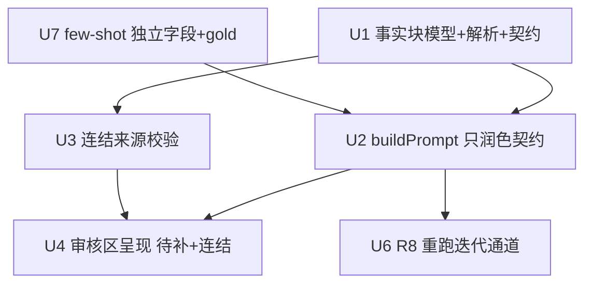

# 阶段 1 — 源接地生成(防幻觉)R4–R8

## Overview

阶段 0 实测确认:现版无接地生成**幻觉 100%**(作品名/集数/原作/具体本子/漢化·無修连结全现编且伪装成真),
而 51娘**口吻 AI 满分**。结论 conditional GO。本阶段把生成模型从"光给标题→AI 全编"改为
"**喂事实 + AI 只润色组织**":AI 仅用操作者提供的结构化事实 + 套 51娘口吻成帖,缺的标【待补】、
连结只能来自输入。劳动沿正确的缝切——难活(事实)给人、AI 擅长的(写作)留给 AI。

## Problem Frame

本站是 NSFW 成人動畫/裏番介紹 + 成人同人漫畫推薦,固定 51娘口吻,每篇含逐作品事实 + 漢化/無修连结。
AI 一旦编造这些,就是把错误信息发上自家域名,伤读者信任与 SEO 且难撤回。源接地从源头消除编造空间。
(see origin: docs/brainstorms/2026-06-05-content-quality-and-first-flight-requirements.md)

## Requirements Trace

- R4. 输入模型 "纯选题" → "选题 + 事实块";贯穿 RUN_BATCH / BatchItem / ContentDraft / buildPrompt 契约。
- R5. Prompt「只润色、不造事实」契约;buildPrompt 改签名接收 facts;未提供事实留空标【待补】。
- R5b. 事实三态:零事实→全【待补】草稿;部分→填已知其余【待补】;全【待补】不计入合格率。
- R6. 连结只能来自输入:抽正文 `<a href>` 归一化比对,未命中=违规;审核区显著呈现【待补】+连结(独立于 sanitize)。
- R7. 51娘 few-shot 固化为**独立 Settings 字段**,gold 范例取真帖。
- R8. 改 prompt/few-shot 重跑同批对比(肉眼;绕过 publishedTopics 重入闸;diff/存储 OUT)。

## Scope Boundaries

- 不含阶段 0 已完成项(R0/RB/R2/GATE)。
- 不做结构化表单输入(走分隔符约定)、不做源数据自动抓取、不做连结可达性网络探测、不做并排 diff/草稿存储。
- 不动批量状态机/轨迹/崩溃恢复/历史面板等已建可靠性设施。

## Context & Research

### Relevant Code and Patterns

- `lib/llm.ts` — `buildPrompt(template, topic)`(`{{topic}}` 替换);`toDraft` 产出 `ContentDraft`;`response_format: json_object`。
- `lib/storage.ts` — `DEFAULT_SETTINGS`(`promptTemplate` 单串,通用"内容编辑助手"——不含 51娘);`getSettings` 缺失回落。
- `lib/types.ts` — `Settings`、`ContentDraft`、消息协议(`RUN_BATCH { topics: string[]; tabId }`)。
- `lib/batch.ts` — `createBatch(topics)` = `topics.map(topic => ({ topic }))`;`BatchItem.topic: string`;`filterReentrantTopics(topics, blocked)`。
- `lib/sanitize.ts` — `sanitizeBody` 钉 DOMPurify;**原样放行远程 https `href`** → 连结核验须独立另起。
- `entrypoints/sidepanel/` — `BatchView`(输入 textarea + 容器)、`BatchReviewPanel`(审批卡、受控、`FillStatusTable`)、Settings 页(promptTemplate / fieldMapping 编辑)。
- `entrypoints/background.ts` — `buildPrompt` 调用处(生成草稿);`createHandlers(deps)` 工厂。

### Institutional Learnings

- `docs/solutions/developer-experience/claude-in-chrome-script-redaction-backend-verify-2026-06-05.md` — 后台勘查打码绕法(R0 已用)。
- 阶段 0 RB ground truth:真帖 109/108(動畫介紹)、100/97(同人推薦)、88(题材精选)可作 R7 gold few-shot。

## Key Technical Decisions

- **输入走分隔符约定**(非结构化表单):保留 textarea 心智、好扩到 5–10 条;代价是需解析+预览回显。(origin Resolve-Before-Planning 已拍)
- **事实是消息契约一等公民**:`BatchItem` / `ContentDraft` / `RUN_BATCH` 都带 `facts`,不靠把事实塞进 topic 字符串。
- **连结核验独立于 sanitize**:`sanitizeBody` 放行远程链接,故另起一道"来源闸"——抽 href、归一化(小写 host、去尾斜杠)、与输入 facts 里的 URL 比对。
- **few-shot 独立 Settings 字段**:因 R8 要单独调 few-shot 与 prompt,二者必须分离存储,不能合成一个 promptTemplate 串。
- **R8 走"只生成不发"迭代通道**:绕过 `publishedTopics`/隔离重入闸(否则真发后重跑静默丢题);对比靠肉眼,不建 diff/版本存储。
- **【待补】是字符串约定**:模型在缺事实处输出固定标记 `【待补】`;审核区按该标记渲染醒目提示。

## Open Questions

### Resolved During Planning

- 事实字段集:作品名 / 集数·话数 / 制作或原作 / 漢化连结 / 無修连结 / 题材或标签 / 简介要点(已拍)。
- 分隔符语法:行级 `选题 || k=v | k=v`,key 用固定中/英别名表(见 U1)。
- 连结匹配:归一化(小写 host、去尾斜杠、去 `www.`)后子串/相等比对(已拍)。
- few-shot 来源:真帖 109/108/100/97/88 的口吻 + 结构(已拍)。
- 事实三态与基线计入口径:R5b(已拍)。

### Deferred to Implementation

- `【待补】` 标记的确切字符串与是否需要 i18n —— 实现时定一个不易与正文冲突的串。
- 解析失败(分隔符写错)的兜底:整行当纯 topic 还是报错提示 —— 实现时按手感定,倾向"宽容解析+预览回显让人自查"。
- few-shot 注入 prompt 的确切位置/格式(system vs user 消息)——看 llm.ts 现有 messages 结构定。

## High-Level Technical Design

> *直观示意,审阅向导,非实现规范。实现者当上下文,别照抄。*

```
输入(每行一条):
  少女彈珠汽水系列成人動畫介紹 || 作品名=少女彈珠汽水 | 集数=6 OVA | 漢化=https://a/x | 無修=https://b/y | 简介=夏日悸动
        │  parseTopicLine()              (U1)
        ▼
  { topic, facts: { 作品名, 集数, 制作, 漢化, 無修, 题材, 简介 } }   ← 贯穿 RUN_BATCH/BatchItem/ContentDraft
        │  buildPrompt(template, topic, facts, fewShot)   (U2/U7)
        ▼
  LLM(只润色契约:只用 facts、缺的标【待补】、连结只用 facts 里的)
        ▼  ContentDraft(body 含 51娘口吻 + 事实 + 连结/【待补】)
        │  verifyLinks(body, facts)   (U3)  抽 href→归一化→比对 facts URLs
        ▼
  审核卡(U4):【待补】计数徽章 + 连结清单(来源✓/✗红) → 人审 → 发
                                                            └ R8:改 prompt/few-shot → 只生成不发重跑(U6)
```

## Implementation Units

> **进度(2026-06-05,247 单测/tsc/23 e2e/脱敏/build 全绿):**
> **增量 1(基础层)✅**:`lib/facts.ts`、`lib/link-source.ts`、`buildPrompt` 扩展、`DEFAULT_SETTINGS` 接地 prompt、`Settings.fewShotExamples`+默认范例、few-shot 接入批量生成。
> **增量 2(接线)✅**:facts 端到端贯穿 `BatchView 逐行 parseTopicLine → RUN_BATCH(topics,facts) → background → runBatch → createBatch(item.facts) → generateDraft(topic,facts) → buildPrompt(facts)`;U4 审核区 GroundingStrip(【待补】计数+连结来源✓/✗);U6 R8 迭代通道(bypassReentry+「重跑生成」按钮);+3 接线单测。
> **增量 3(U5 UI)✅**:Settings 页加 few-shot 编辑器(载入/保存/恢复默认)+ prompt 模板恢复默认按钮 + 占位符说明。**R4–R8 全部完成。**
> **剩验证(操作者手动)**:源接地版"阶段 1 RB"复测合格率↑/找事实成本 + R2 一次 authorized 真发。



- [x] **Unit 1: 事实块数据模型 + 分隔符解析 + 消息契约**

**Goal:** 让事实成为一等公民,从输入贯穿到生成入口。

**Requirements:** R4

**Dependencies:** 无

**Files:**
- Modify: `lib/types.ts`(加 `FactsBlock` 接口;`BatchItem.facts?`、`ContentDraft` 不必带 facts 但生成需读;`RUN_BATCH` 载荷 `topics: string[]` → `items: {topic; facts}[]` 或并列 `facts[]`)
- Create: `lib/facts.ts`(`parseTopicLine(line): {topic; facts}`、`FACT_KEYS` 别名表、`formatFactsForPrompt(facts)`)
- Modify: `lib/batch.ts`(`createBatch` 接收带 facts 的条目)
- Modify: `entrypoints/background.ts`(RUN_BATCH 处理传递 facts)
- Test: `lib/facts.test.ts`、`lib/batch.test.ts`(扩充)

**Approach:**
- `FactsBlock = { 作品名?; 集数?; 制作?; 漢化?; 無修?; 题材?; 简介? }`,全可选。
- 分隔符:`topic || key=value | key=value`;`||` 分 topic 与 facts 段,`|` 分字段,`=` 分键值;key 走别名表(作品名/name、集数/话数/ep、漢化/hanhua、無修/uncen、题材/标签/tags、简介/desc)。
- 无 `||` 的行 = 纯 topic(零事实),向后兼容现有 textarea 用法。
- 宽容解析:未知 key 收进 `简介` 或忽略并在预览标注。

**Patterns to follow:** `lib/batch.ts` 纯函数风格;`lib/field-mapping.ts` 的别名/默认表组织。

**Test scenarios:**
- Happy path:`A || 作品名=X | 集数=6 | 漢化=http://h` → `{topic:'A', facts:{作品名:'X',集数:'6',漢化:'http://h'}}`
- Edge:无 `||` 整行 → `{topic:line, facts:{}}`;空行跳过;`key=` 空值 → 该字段 undefined 或空
- Edge:重复 key → 后者覆盖;value 内含 `=` → 只按首个 `=` 切
- Error:`||` 后无任何 `=` → facts 空 + 预览提示"未解析到事实"
- 别名:`name=` / `ep=` / `tags=` 映射到中文规范键

**Verification:** 解析单测全绿;RUN_BATCH→BatchItem 链路带上 facts(batch 单测可验)。

---

- [x] **Unit 2: buildPrompt 改签名 + 只润色契约 + 事实三态**

**Goal:** 让 LLM 只用给定事实润色成帖,缺的标【待补】,绝不编造。

**Requirements:** R5, R5b

**Dependencies:** U1(facts 类型)、U7(few-shot,可并行后接)

**Files:**
- Modify: `lib/llm.ts`(`buildPrompt(template, topic, facts, fewShot)`;组装 messages)
- Modify: `lib/storage.ts`(`DEFAULT_SETTINGS.promptTemplate` 改为只润色契约版,含 51娘口吻 + 【待补】规则 + "连结只用我给的"硬约束)
- Modify: `entrypoints/background.ts`(两处 buildPrompt 调用传 facts/fewShot)
- Test: `lib/llm.test.ts`(扩充)

**Approach:**
- 新 prompt 契约要点:① 你是 51娘;② 只用【事实】区内容,不得新增作品名/集数/原作/连结;③ 缺的字段在文中写`【待补】`;④ 连结只能原样使用【事实】里给的 URL;⑤ 仍以 JSON 返回既有字段。
- `formatFactsForPrompt(facts)`(U1)把 facts 渲成清晰的【事实】块塞进 prompt;空 facts → 明确写"无事实提供 → 通篇【待补】骨架"。
- 不改 `response_format`/`toDraft`/JSON 解析路径。

**Execution note:** 先写 buildPrompt 的契约断言测试(给定 facts→prompt 含事实块+【待补】指令;空 facts→含全待补指令),再改实现。

**Test scenarios:**
- Happy:full facts → prompt 含全部事实 + 只润色指令 + few-shot
- Edge(零事实):facts={} → prompt 含"通篇【待补】"指令,不含任何具体事实
- Edge(部分):facts 缺漢化 → prompt 不含漢化值、指示该处【待补】
- Edge:`{{topic}}` 仍被替换;facts 块独立于 topic
- 回归:旧的 `buildPrompt(template, topic)` 两参调用点已全部改为新签名(grep 确认无漏)

**Verification:** llm 单测全绿;tsc 干净(签名变更无遗漏调用点)。

---

- [x] **Unit 3: 连结来源校验(独立于 sanitize)**

**Goal:** 草稿正文里任何 URL 必须能在输入 facts 找到来源,否则标违规。

**Requirements:** R6

**Dependencies:** U1

**Files:**
- Create: `lib/link-source.ts`(`extractLinks(html): string[]`、`normalizeUrl(u)`、`verifyLinks(html, facts): {url; sourced: boolean}[]`)
- Test: `lib/link-source.test.ts`

**Approach:**
- `extractLinks`:从 body HTML 抽 `<a href>`(用 DOMParser / 现有 jsdom 路径,勿用正则裸抓)。
- `normalizeUrl`:小写 host、去尾 `/`、去 `www.`、忽略大小写比较 path。
- `verifyLinks`:facts 里的 URL(漢化/無修/简介中的)归一化成允许集;body 每条 href 归一化后是否 ∈ 允许集 → `sourced`。
- 纯函数,返回结果给 U4 渲染;**不自动改写/剥除**(由人在审核区决定),与 `sanitizeBody`(防 XSS)正交。

**Patterns to follow:** `lib/sanitize.ts` 的 jsdom/DOMPurify 用法;纯函数 + 单测风格。

**Test scenarios:**
- Happy:body 链接全部来自 facts → 全 `sourced:true`
- Error(幻觉):body 含 facts 里没有的 URL → 该条 `sourced:false`
- Edge:归一化等价(`http://A.com/x/` vs `https://a.com/x`)→ 视为命中(注意 scheme 是否计较,默认忽略 scheme 差异)
- Edge:body 无链接 → 空数组;facts 无链接但 body 有 → 全 false
- Edge:相对链接 / `javascript:`(应已被 sanitize 剥)→ 不计或标违规

**Verification:** link-source 单测全绿,含幻觉链接被标 false 的关键用例。

---

- [x] **Unit 4: 审核区呈现(【待补】计数 + 连结来源徽章)**

**Goal:** 操作者批准前一眼看到缺口与可疑连结。

**Requirements:** R6

**Dependencies:** U2(草稿含【待补】)、U3(连结校验结果)

**Files:**
- Modify: `entrypoints/sidepanel/BatchReviewPanel.tsx`(审批卡顶部加只读摘要条)
- Modify: `entrypoints/sidepanel/BatchView.tsx`(若需把 verifyLinks 结果接入)
- Test: `entrypoints/sidepanel/BatchReviewPanel.test.tsx`(或现有测试文件扩充)

**Approach:**
- 摘要条:① 【待补】计数徽章——0 绿 / N 高对比警告 + 列出哪些字段;② 连结清单——每条 URL + 来源✓(绿)/✗(红)。
- 三态:全事实(绿、可折叠)/ 部分【待补】(警告、展开列缺项)/ 全【待补】(强警告,提示"建议补事实再发")。
- 只读条,**非 checklist**(scope 已定不做勾验流);不阻塞批准但醒目。

**Patterns to follow:** `FillStatusTable` 三态徽章渲染;`BatchReviewPanel` 受控组件风格。

**Test scenarios:**
- Happy:草稿无【待补】、连结全 sourced → 绿色摘要、折叠
- Edge:含 2 个【待补】→ 徽章显示 "2 待补" + 字段名
- Error:含 1 个 unsourced 链接 → 该链接红色✗
- Edge:全【待补】草稿 → 强警告态
- 交互:摘要条不阻断"批准"按钮(设计为提示非强制)

**Verification:** 组件测试覆盖三态渲染 + unsourced 红标;side panel 手测摘要条出现。

---

- [x] **Unit 5: few-shot 独立 Settings 字段 + 51娘 gold 范例**

**Goal:** 把 51娘口吻+结构用少量真帖范例固化,且可与 prompt 分开调。

**Requirements:** R7

**Dependencies:** 无(U2 注入时依赖此字段存在)

**Files:**
- Modify: `lib/types.ts`(`Settings.fewShotExamples: string`,或结构化 `{topic; facts; body}[]`)
- Modify: `lib/storage.ts`(`DEFAULT_SETTINGS.fewShotExamples` 预置 1–2 条取自真帖 109/100 的口吻骨架)
- Modify: `entrypoints/sidepanel/` Settings 页(加 few-shot 编辑区 + 校验 + 恢复默认)
- Test: `lib/storage.test.ts`(扩充:默认含 few-shot、缺失回落)

**Approach:**
- 默认 few-shot 取真帖口吻(「嗨嗨~大家好我是51娘ヾ(≧▽≦*)o…準備好衛生紙和飛機杯…(*/ω＼*)」开合 + 逐作品事实 + 漢化/無修连结结构),但**用占位事实**,避免把真实连结/敏感内容写进仓库默认值(脱敏)。
- Settings 编辑区复用 promptTemplate 编辑控件模式(textarea + 校验 + 恢复默认)。

**Patterns to follow:** Settings 页 `promptTemplate` / `fieldMapping` 编辑器;`getSettings` 回落默认。

**Test scenarios:**
- Happy:`getSettings()` 返回含 `fewShotExamples` 默认
- Edge:storage 缺该字段 → 回落默认(向后兼容老 storage)
- 脱敏:默认 few-shot 不含真实漢化/無修 URL(用占位)—— 断言默认值不含真实域名

**Verification:** storage 单测全绿;Settings 页可编辑/恢复 few-shot;`pnpm check:fixtures` 脱敏闸过(默认值无机密)。

---

- [x] **Unit 6: R8 重跑迭代通道(只生成不发,绕重入闸)**

**Goal:** 操作者改 prompt/few-shot 后能对同批题目重跑看效果,不被已发/隔离题目静默丢弃。

**Requirements:** R8

**Dependencies:** U2(新生成路径)

**Files:**
- Modify: `lib/batch.ts` / `entrypoints/background.ts`(加"迭代生成"路径:跳过 `filterReentrantTopics` 对 `publishedTopics` 的过滤,仅生成草稿不进发布态)
- Modify: `entrypoints/sidepanel/BatchView.tsx`(加"重跑生成"入口)
- Test: `lib/batch.test.ts`(扩充:迭代路径不丢已发题目)

**Approach:**
- 新增 message/path(如 `REGENERATE_BATCH`)或给 RUN_BATCH 加 `iterate: true` 标志,该路径**不查 publishedTopics、不写发布态**,产出草稿覆盖当前批的草稿供肉眼对比。
- 对比 = 肉眼读两轮输出;**不存上轮草稿、不做并排 diff**(scope OUT)。
- 仍受 dry-run/authorized 档位约束:迭代只到"草稿/审批"态,不触发真发。

**Patterns to follow:** `createHandlers(deps)` 工厂;`filterReentrantTopics` 现有签名(加旁路参数而非删守卫)。

**Test scenarios:**
- Happy:同批含 1 个已 published 题目,迭代重跑 → 该题目**仍生成**草稿(不被过滤)
- Edge:迭代路径不产生发布态/不写 publishedTopics(断言无副作用)
- 回归:正常 RUN_BATCH 仍过滤 publishedTopics(守卫未被破坏)

**Verification:** batch 单测证迭代路径保留已发题目且无发布副作用;正常路径守卫不变。

## System-Wide Impact

- **Interaction graph:** 输入解析(新)→ RUN_BATCH 契约(改)→ createBatch/BatchItem(改)→ background buildPrompt(改)→ llm(改)→ ContentDraft → verifyLinks(新)→ BatchReviewPanel(改)。
- **Error propagation:** 解析失败应宽容降级为纯 topic(不崩批量);verifyLinks 异常不应阻断渲染(降级为"未校验")。
- **State lifecycle risks:** facts 进 `local:batch` 持久化 → 崩溃恢复/`storage.watch` 需带上 facts;确认序列化无遗漏。
- **API surface parity:** `buildPrompt` 签名变更须改全部调用点(background 两处);`RUN_BATCH` 载荷变更须改 side panel 发送端 + background 接收端。
- **Unchanged invariants:** 批量状态机/轨迹/崩溃恢复/发布档位/sanitize 防 XSS 不变;`sanitizeBody` 仍是 XSS 闸,连结来源校验是新增正交闸,不替代它。

## Risks & Dependencies

| Risk | Mitigation |
|------|------------|
| `buildPrompt`/`RUN_BATCH` 签名变更漏改调用点 | tsc 强约束 + grep 全调用点;U2 回归用例 |
| facts 未随 batch 持久化 → 刷新后丢 | U1 把 facts 纳入 BatchItem 序列化;崩溃恢复用例覆盖 |
| 默认 few-shot 写入真实漢化/無修连结 = 仓库夹带敏感内容 | U5 用占位事实脱敏;`check:fixtures` 闸把关 |
| 连结归一化过宽/过严(漏报/误报幻觉连结) | U3 多归一化用例;默认忽略 scheme、去 www/尾斜杠,记录口径 |
| 模型不遵守【待补】契约仍编造 | 这是阶段 1 第一批真跑要验证的;审核区呈现 + 连结校验作为兜底网 |

## Documentation / Operational Notes

- 更新 README 与 `docs/field-mapping-guide.md`:新增"事实块输入语法"+ few-shot 设置说明。
- 阶段 1 落地后,操作者做"源接地版 RB"(同 5–10 题材带事实重跑),精确验证合格率↑与找事实成本——这是 GATE 的未闭合条件。
- 提醒:R2 一次 authorized 真发仍待操作者执行。

## Sources & References

- **Origin document:** [docs/brainstorms/2026-06-05-content-quality-and-first-flight-requirements.md](docs/brainstorms/2026-06-05-content-quality-and-first-flight-requirements.md)
- 阶段 0 计划/数据:`docs/plans/2026-06-05-001-feat-stage0-premise-baseline-plan.md`、`docs/stage0-baseline-worksheet.md`
- 相关代码:`lib/llm.ts`、`lib/batch.ts`、`lib/storage.ts`、`lib/sanitize.ts`、`lib/types.ts`、`entrypoints/sidepanel/BatchReviewPanel.tsx`
- 学习:`docs/solutions/developer-experience/claude-in-chrome-script-redaction-backend-verify-2026-06-05.md`
