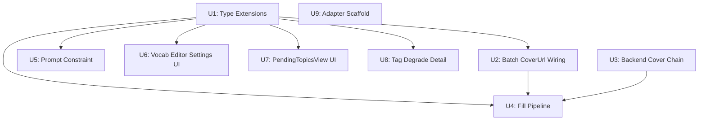

# feat: Capability Upgrade — Prompt Quality, Pending UI & Few-shot Editor

## ⚠️ 对账记录(2026-06-10,由 2026-06-10-003 计划 Unit 6a 执行)

**账面 9/9 unit 全勾 ≠ 需求全实现。实际:origin 需求 R1-R13 中 10/13 完成(≈77%)。**

- **R11-R13(few-shot 可视化编辑器)未实现**:单元拆分时遗漏——Unit 6 实际只做了 recommendedTags、Unit 7 只做了 PendingTopicsView;`fewShotPairs` 仅有类型脚手架(shared/types.ts + storage.ts),Settings.tsx 至今仍是原始 textarea。**由 roadmap(2026-06-10-intelligent-publisher-roadmap)阶段 2 R3 承接,与一键回灌同期落地。**
- **Unit 3 存在 cron 路径缺口**:其 Files 清单从未包含 `scheduler.ts`,导致 cron 入池路径丢失 coverImageUrl(对单元文字范围勾选为真,对 R10「flows through fact-extraction into PendingTopic storage」的目标为假)。**已由 2026-06-10-003 计划 Unit 1 修复。**
- 另:`ACGS51_START_URL` 默认首页与详情页 adapter 不匹配的「开箱即坑」,已由 2026-06-10-003 Unit 2 以条件 fail-closed 校验修复。

## Overview

Four targeted improvements that transform 51publisher from a manually-fed draft machine into a system an operator can run daily without JSON editing or copy-paste gymnastics:

1. **Auto-scraping pipeline completion** — PendingTopicsView inline fact editing, cover thumbnail preview, scraper trigger button, and a developer scaffold for new adapters.
2. **Category/tag accuracy** — Prompt-level constraint (embed curated vocab in every generation call) + fine-grained degrade messages in fillers.ts to close the feedback loop.
3. **CoverImageUrl fill pipeline** — End-to-end chain from SiteAdapter → PendingTopic → RUN_BATCH → ContentDraft → `cover_url` hidden input.
4. **Few-shot visual editor** — Replace raw `fewShotExamples` textarea with a structured card-list UI; no JSON required.

**Relationship to plan 001:** `2026-06-09-001-feat-auto-scraping-content-pipeline-plan.md` covers G3 (cover_url FieldMapping selector in DEFAULT_FIELD_MAPPING) and G4 (runtime tag fuzzy matching in `fillCheckboxMulti`). This plan assumes those changes land first or in parallel; where overlap exists it is called out explicitly per unit.

## Problem Frame

51publisher's engine is technically sound but operators face three daily friction points:

- **Scraping review is read-only** — expanding a pending topic shows facts as uneditable text, forcing the operator to approve imperfect facts or reject and restart.
- **Tags degrade silently** — model outputs free-text tag words that miss the checkbox list, the fill silently degrades, and the operator only discovers missing tags after checking the form. No signal which words to add to a curated list.
- **Few-shot tuning is painful** — adjusting post style requires editing a raw JSON string in a textarea; one syntax error silently resets to default.

(see origin: Problem Frame section)

## Requirements Trace

| Req | This plan | Plan 001 |
|-----|-----------|----------|
| R1 — inline fact editing in PendingTopicsView | Unit 7 | — |
| R2 — cover thumbnail in PendingTopicsView | Unit 7 | — |
| R3 — scraper trigger button in extension | Unit 7 | endpoint already built |
| R4 — template-adapter.ts scaffold | Unit 9 | — |
| R5 — prompt-level category/tag constraint | Unit 5 | — |
| R6 — Settings recommendedTags vocab editor | Unit 6 | — |
| R7 — fillers.ts detailed degrade messages | Unit 8 | runtime matching (Unit 2) |
| R8 — FieldMapping.coverUrl + fill | Unit 4 | selector default (Unit 1) |
| R9 — ContentDraft.coverImageUrl → fill | Unit 4 | — |
| R10 — SiteAdapter/PendingTopic coverUrl chain | Unit 3 | — |
| R11-R13 — few-shot visual editor | Unit 6/7 | — |

## Scope Boundaries

- No adapter config-file hot-reload; adapters register in code, restart to activate.
- No CATEGORY_VOCAB migration to Settings UI (stays in code; 2 options, rarely changes).
- No full 3912-tag sync; operator maintains a curated ~20-50 tag subset.
- No cover image file download; only URL string fill to `cover_url` hidden input.
- No UI for postStatus/publishedAt scheduling.
- G2 first-flight (authorized real publish) remains operator-driven, not automated.

## Context & Research

### Relevant Code and Patterns

- `packages/extension/lib/types.ts:114` — `RUN_BATCH` message type; add `coverImageUrls?: string[]` here.
- `packages/extension/lib/types.ts:18` — `ContentDraft.coverImageUrl` exists as `string`, hardcoded `''` in `toDraft()`.
- `packages/extension/lib/types.ts:40-54` — `FieldMapping` type; add `coverUrl?: FieldDefinition`.
- `packages/extension/lib/messaging.ts:64-70` — `runBatch()` function; extend signature parallel to `facts?: FactsBlock[]`.
- `packages/extension/lib/batch-orchestrator.ts:38-45` — `RunBatchDeps.facts`; mirror pattern for `coverImageUrls`.
- `packages/extension/lib/batch-orchestrator.ts:75-93` — `factsByTopic` map; mirror for `coverUrlsByTopic`.
- `packages/extension/lib/fillers.ts:84` — `valueFor` switch; add `case 'coverUrl': return draft.coverImageUrl`.
- `packages/extension/lib/fillers.ts:58-80` — `fillCheckboxMulti`; degrade messages at lines 78-79.
- `packages/extension/lib/storage.ts:74` — `getSettings()` spread-merge pattern; any new `Settings` field with a default in `DEFAULT_SETTINGS` auto-backfills old storage entries.
- `packages/extension/entrypoints/sidepanel/PendingTopicsView.tsx:54` — `handleApproveSelected`; currently maps `t.facts` to factsList.
- `packages/extension/entrypoints/sidepanel/PendingTopicsView.tsx:176` — expand card renders `Object.entries(t.facts)` read-only.
- `packages/extension/entrypoints/sidepanel/Settings.tsx:169` — `fewShotExamples` textarea pattern to replace.
- `packages/extension/lib/facts.ts::applyPromptTemplate` — prompt assembly function; tag constraint injection point.
- `packages/backend/src/scraper/site-adapter.ts` — `RawContent` and `SiteAdapter` interfaces.
- `packages/backend/src/scraper/fact-extractor.ts:95` — confidence calculation; coverImageUrl is DOM-extracted, not LLM-inferred, so not part of confidence.
- `packages/backend/src/scraper/pending-store.ts` — JSON file store; `PendingTopic` type and CRUD helpers.
- `packages/backend/src/scraper/pending-routes.ts:73` — `PATCH /api/v1/pending-topics/:id`; already supports `facts` patch.
- `packages/backend/src/scraper/scraper-routes.ts` — `POST /api/v1/scraper/trigger` already exists.
- `packages/backend/src/scraper/adapters/demo-adapter.ts` — reference implementation to base template on.

### Institutional Learnings

- No directly relevant `docs/solutions/` entries for inline editing, few-shot management, or serialization patterns.
- **From gap-list 2026-06-05**: `cover_url` is a hidden input added to the backend form; direct `element.value =` assignment works for hidden inputs — no special FieldType handling needed.
- **From solutions 2026-06-05**: Backend has 3912 tag options; approach is operator-curated subset (~20-50 tags) not full sync.

### External References

- No external framework research needed; all patterns exist in-repo.

## Key Technical Decisions

- **CoverImageUrl passthrough is DOM extraction, not LLM inference**: adapters extract `coverImageUrl` directly from page HTML (``). It bypasses the LLM facts schema and is passed through as metadata. Confidence score is unaffected.
- **Prompt constraint in background.ts handlers, not buildPrompt or backend**: `packages/backend/src/llm.ts::buildRequest` uses a user-only message format (no system role). The simplest injection point is `background.ts`: in `handleGenerateDraft` (single-topic) and inside the `generateDraft` closure in `handleRunBatch` (batch), append the constraint block to the prompt string before the LLM call. Settings.recommendedTags is available in background.ts through the deps/settings injection. This avoids modifying llm.ts interface or the backend.
- **fewShotPairs as separate Settings field**: Add `fewShotPairs?: FewShotPair[]` alongside the existing `fewShotExamples: string`. Saves from both: new code reads `fewShotPairs`; old backend prompt-store and display code continues reading `fewShotExamples` (derived from pairs on save). Storage spread-merge pattern provides zero-config backward compatibility.
- **Inline fact edits: local state + PATCH before approve**: React state holds per-topic fact overrides. On approve, PATCH the backend first (`PATCH /api/v1/pending-topics/:id` with updated facts), then pass the local overridden facts to `runBatch`. Backend and extension stay consistent.
- **Hidden input fill: existing `fillTextLike` path**: `cover_url` is an `<input type="hidden">` whose `value` can be set with `element.value =`. No new FieldType enum value; the existing `text`/`fillTextLike` dispatch handles it. Add `coverUrl` case to `valueFor` switch only.
- **Prompt constraint format**: Append a structured constraint block after the main prompt body: `\n\n---\n分类约束：只能选 "漫畫文章" 或 "動漫文章"。\n标签约束：只能从以下列表选（如无匹配可留空）：[comma-joined list]`. An empty `recommendedTags` array skips tag constraint entirely.

## Open Questions

### Resolved During Planning

- **cover_url hidden input fill**: Grounded in gap-list 2026-06-04 ("cover_url(hidden)"). `fillTextLike` handles hidden inputs. Resolved: no new FieldType; add `case 'coverUrl'` to `valueFor` only.
- **fewShotExamples serialization strategy**: Separate `fewShotPairs` field; derive `fewShotExamples` on save. `getSettings()` spread-merge makes backward compat automatic.
- **POST /api/v1/scraper/trigger availability**: Confirmed present in `scraper-routes.ts`. Extension-side trigger button is a UI-only addition.
- **PATCH /api/v1/pending-topics/:id for facts**: Confirmed at `pending-routes.ts:73`. Inline fact edit flow uses it.

### Deferred to Implementation

- **Where exactly is `/api/v1/drafts/generate` handled on the backend**: Check `packages/backend/src/index.ts` for route registration. The tag-constraint injection goes into that handler's system message construction.
- **batch-orchestrator.ts background wiring**: With `entrypoints/background.ts` deleted, `batch-orchestrator.ts` must be invoked from a different entry point. Locate the caller before modifying `generateDraft` injection in Unit 5.
- **Exact `applyPromptTemplate` signature in facts.ts**: Verify whether `recommendedTags` constraint is best appended inside `applyPromptTemplate` (for single-topic path) or only at the backend handler (for both paths). Prefer backend-only if the backend is the sole LLM call site.

## High-Level Technical Design

> *This illustrates the intended approach and is directional guidance for review, not implementation specification. The implementing agent should treat it as context, not code to reproduce.*

**CoverImageUrl end-to-end data flow:**

```
SiteAdapter.fetchContent()
  └─ RawContent{ title, body, url, metadata, coverImageUrl? }  ← U3 adds field
        ↓
extractFacts()                    ← U3: passthrough coverImageUrl
  └─ ExtractedFacts{ facts, confidence, coverImageUrl? }
        ↓
pending-routes.ts: create PendingTopic
  └─ PendingTopic{ …, coverImageUrl? }  ← U3 adds field to store + client type
        ↓
PendingTopicsView.handleApproveSelected()     ← U4: pass coverImageUrls[]
  └─ runBatch(topics, tabId, facts, coverImageUrls)
        ↓                                     ← U1: extend RUN_BATCH + runBatch()
background.ts:handleRunBatch(topics, tabId, facts, iterate, coverImageUrls)
  ← U2 adds coverImageUrls forwarding here ← CRITICAL LINK
        ↓
batch-orchestrator.ts: per-topic loop
  └─ ContentDraft{ …, coverImageUrl: coverUrlsByTopic.get(topic) ?? '' }
        ↓
fillers.ts: valueFor('coverUrl')  → draft.coverImageUrl
fillTextLike(input[name=cover_url], value)   ← hidden input, direct assignment
```

**Tag constraint injection point:**

```
Settings.recommendedTags: string[]  (stored local:settings)
   ↓ passed with generate request
backend /api/v1/drafts/generate handler
   └─ systemMsg += "\n分类约束: …\n标签约束: [list]"
   └─ LLM({system: systemMsg, user: userPrompt})
   └─ toDraft() → ContentDraft.tags[]  (constrained vocab)
```

## Implementation Units

**Dependency graph:**



---

- [x] **Unit 1: Type Extensions Foundation**

**Goal:** Add new fields to shared types so all downstream units have consistent type contracts before any behavioral change.

**Requirements:** R1, R6, R8, R9, R10, R11-R13 (prerequisites for all)

**Dependencies:** None. Land first.

**Files:**
- Modify: `packages/extension/lib/types.ts`
- Modify: `packages/extension/lib/storage.ts`
- Modify: `packages/extension/lib/messaging.ts`
- Modify: `packages/extension/lib/pending-client.ts`
- Test: `packages/extension/lib/storage.test.ts`

**Approach:**
- `types.ts` → `Settings`: add `recommendedTags?: string[]`, add `fewShotPairs?: FewShotPair[]`; mark existing `fewShotExamples?: string` as `@deprecated` (source of truth becomes `fewShotPairs`; `fewShotExamples` is derived on save for backend compat). `FieldMapping`: add `coverUrl?: FieldDefinition`. `RUN_BATCH` message: add `coverImageUrls?: string[]`. Define and export `FewShotPair = { input: string; output: string }`.
- `storage.ts` → `DEFAULT_SETTINGS`: add `recommendedTags: []`, `fewShotPairs: []`; `getSettings()` spread-merge already handles missing keys from old storage.
- `messaging.ts` → `runBatch(topics, tabId, facts?, coverImageUrls?, iterate?)` — extend signature, pass through to RUN_BATCH message.
- `pending-client.ts` → `PendingTopic` interface: add `coverImageUrl?: string`.

**Patterns to follow:**
- `Settings.fallbackModel?: string` for optional Settings fields (already in types.ts)
- `DEFAULT_SETTINGS` merge pattern in storage.ts line 74

**Test scenarios:**
- Happy path: `getSettings()` on empty storage returns `recommendedTags: []` and `fewShotPairs: []` from DEFAULT_SETTINGS.
- Backward compat: `getSettings()` with storage containing old Settings object (no `recommendedTags` key) returns `recommendedTags: []` without throwing.
- Happy path: `runBatch(topics, tabId, facts, ['http://cover.jpg'])` produces RUN_BATCH message with `coverImageUrls: ['http://cover.jpg']`.
- Edge case: `runBatch` with `coverImageUrls` undefined produces message without the key (no regression on existing callers).

**Verification:** TypeScript compilation passes. Existing storage tests pass. `runBatch` message shape test passes.

---

- [x] **Unit 2: Batch-Orchestrator CoverUrl Wiring**

**Goal:** Thread `coverImageUrls` from `RUN_BATCH` message through batch-orchestrator into `ContentDraft.coverImageUrl`.

**Requirements:** R9

**Dependencies:** Unit 1

**Files:**
- Modify: `packages/extension/lib/batch-orchestrator.ts`
- Modify: `packages/extension/lib/batch-orchestrator.test.ts` (or matching test file)
- Modify: `packages/extension/entrypoints/background.ts` — extend `handleRunBatch` signature and forwarding call to include `coverImageUrls`

**Approach:**
- `batch-orchestrator.ts`: extend `RunBatchDeps` with `coverImageUrls?: (string | undefined)[]` mirroring the existing `facts` pattern (line 38). Build `coverUrlsByTopic` map (same index-alignment as `factsByTopic`, lines 75-77). Inject into ContentDraft at the `toDraft()` call site.
- `background.ts`: extend `handleRunBatch(topics, tabId, facts, iterate, coverImageUrls?)` — pass `message.coverImageUrls` from the `RUN_BATCH` branch (line 380-381) and forward it to `runBatch({..., coverImageUrls})`. **This is the critical link; without it, coverImageUrls are silently dropped.**

**Patterns to follow:**
- `factsByTopic` map construction and lookup (batch-orchestrator.ts:75-93)
- `handleRunBatch` signature at background.ts:152

**Test scenarios:**
- Happy path: batch run with 2 topics and `coverImageUrls: ['http://a.jpg', 'http://b.jpg']` — resulting ContentDrafts have `coverImageUrl` matching their respective topic.
- Edge case: `coverImageUrls` undefined → all drafts get `coverImageUrl: ''` (no regression).
- Edge case: `coverImageUrls` shorter than topics array → missing entries default to `''`.

**Verification:** Existing batch-orchestrator tests pass. New cover-url tests pass.

---

- [x] **Unit 3: Backend CoverImageUrl Passthrough Chain** *(对账注记 2026-06-10:本单元 Files 未含 scheduler.ts,cron 入池路径丢 coverImageUrl——缺口已由 2026-06-10-003 计划 Unit 1 修复)*

**Goal:** Extend backend types so adapters can supply a cover image URL that flows through fact-extraction into PendingTopic storage.

**Requirements:** R10

**Dependencies:** None (backend-only, can run in parallel with Unit 1).

**Files:**
- Modify: `packages/backend/src/scraper/site-adapter.ts`
- Modify: `packages/backend/src/scraper/fact-extractor.ts`
- Modify: `packages/backend/src/scraper/pending-store.ts`
- Modify: `packages/backend/src/scraper/scraper-routes.ts`

**Approach:**
- `site-adapter.ts`: add `coverImageUrl?: string` to `RawContent` and `ExtractedFacts` interfaces (Option B — explicit typed field, not metadata map).
- `fact-extractor.ts`: after LLM extraction, passthrough `rawContent.coverImageUrl` to `ExtractedFacts.coverImageUrl` verbatim. No change to LLM schema — this is DOM-derived metadata, not inferred content.
- `pending-store.ts`: add `coverImageUrl?: string` to `PendingTopic` type.
- `scraper-routes.ts` (pending topic creation path): include `coverImageUrl: extractedFacts.coverImageUrl` when constructing the stored `PendingTopic`.
- Confidence calculation is unaffected (coverImageUrl is not a FactsBlock field).

**Patterns to follow:**
- `demo-adapter.ts` for the adapter interface usage pattern.
- `pending-store.ts` PendingTopic type for field addition.

**Test scenarios:**
- Happy path: `extractFacts({ …, coverImageUrl: 'http://img.jpg' })` returns `ExtractedFacts.coverImageUrl: 'http://img.jpg'`.
- Edge case: `extractFacts({ …, coverImageUrl: undefined })` returns `ExtractedFacts.coverImageUrl: undefined` (no default injection).
- Integration: scraper-routes pending topic creation stores `coverImageUrl` when adapter provides it; `loadPendingTopic` returns it.

**Verification:** Backend type checks pass. fact-extractor test for passthrough passes.

---

- [x] **Unit 4: ContentDraft CoverImageUrl Fill Pipeline**

**Goal:** Wire cover URL from PendingTopic approval → fill form's `cover_url` hidden input. Also adds `valueFor('coverUrl')` case to fillers.ts.

**Requirements:** R8, R9

**Dependencies:** Unit 1 (types), Unit 2 (batch wiring), Unit 3 (backend supply). Assumes plan 001 Unit 1 adds `coverUrl` selector to `DEFAULT_FIELD_MAPPING`; if not yet landed, add the default selector here.

**Files:**
- Modify: `packages/extension/lib/fillers.ts`
- Modify: `packages/extension/entrypoints/sidepanel/PendingTopicsView.tsx`
- Modify: `packages/extension/lib/field-mapping.ts` (add default coverUrl selector if not in plan 001 Unit 1)
- Test: `packages/extension/lib/fillers.test.ts` (if it exists — otherwise unit behavior verified via integration)

**Approach:**
- `fillers.ts::valueFor`: add `case 'coverUrl': return draft.coverImageUrl` before default. The hidden input dispatch already falls through to `fillTextLike` via the `text` FieldType — verify this is the case; if not, add `'coverUrl'` to the `fieldType === 'text'` dispatch branch.
- `field-mapping.ts::DEFAULT_FIELD_MAPPING`: add `coverUrl: { selector: 'input[name=cover_url]', fieldType: 'text', label: 'cover_url' }` — only if plan 001 Unit 1 has not already done this.
- `PendingTopicsView.tsx::handleApproveSelected`: extract `coverImageUrls` list from selectedTopics (using `t.coverImageUrl ?? ''`); pass as fourth argument to `runBatch`.
- Remove the `// 仅作预览参考,MVP 不填进表单` comment from `types.ts` ContentDraft.coverImageUrl jsdoc.

**Patterns to follow:**
- `valueFor` switch structure in fillers.ts
- `handleApproveSelected` factsList extraction pattern (PendingTopicsView.tsx:70-71)

**Test scenarios:**
- Happy path: `valueFor('coverUrl', draft)` where `draft.coverImageUrl = 'http://img.jpg'` returns `'http://img.jpg'`.
- Edge case: `valueFor('coverUrl', draft)` where `coverImageUrl: ''` returns `''` (not undefined; fillTextLike sets empty string).
- Happy path: `fillPage` with a draft containing `coverImageUrl: 'http://x.jpg'` and a mapping that includes `coverUrl` fills `input[name=cover_url]` with that URL.
- Integration: PendingTopicsView approve with a topic having `coverImageUrl: 'http://x.jpg'` passes `['http://x.jpg']` to `runBatch`.

**Verification:** fillers.ts tests pass. Manual e2e: approve a pending topic with a cover URL, open the form, confirm `input[name=cover_url]` has the expected value.

---

- [x] **Unit 5: Prompt-Level Category/Tag Constraint**

**Goal:** Every AI generation call includes an explicit constraint block that limits model output to the approved category and tag vocabulary.

**Requirements:** R5

**Dependencies:** Unit 1 (Settings.recommendedTags type)

**Files:**
- Modify: `packages/backend/src/llm.ts` (or whichever module builds LLM messages for `/api/v1/drafts/generate`)
- Modify: `packages/backend/src/llm.test.ts`

**Approach:**
- Locate the backend handler or function that constructs the LLM `messages` array for draft generation. Confirm this is in `packages/backend/src/llm.ts` or the route handler (check `packages/backend/src/index.ts`).
- Extract `recommendedTags: string[]` from the `settings` payload the extension sends.
- Append a constraint block to the **system message** (not user message):
  ```
  ---
  分类约束：只能选「漫畫文章」或「動漫文章」，不能使用其他分类。
  标签约束：只能从以下列表中选择标签（如无匹配可留空，不要自造新词）：[comma-joined tags]
  ```
  If `recommendedTags` is empty, append category constraint only.
- Do not modify `applyPromptTemplate` / `facts.ts` — keep constraint injection server-side.

**Patterns to follow:**
- Existing system message construction in `packages/backend/src/llm.ts`

**Test scenarios:**
- Happy path: generate call with `recommendedTags: ['漢化', '無修正', '校園']` — system message contains "标签约束：" with those tags.
- Edge case: `recommendedTags: []` — system message contains category constraint but no tag constraint block.
- Edge case: `recommendedTags` key absent in settings payload — treated same as empty list (no crash).
- Constraint format: generated draft's `tags` field contains only values from the provided list (integration test with real LLM is deferred; unit test verifies system message shape).

**Verification:** Backend llm.ts tests pass. System message shape test for constraint block passes.

---

- [x] **Unit 6: Settings Vocab Editor (recommendedTags)**

**Goal:** Add a usable multi-line tag editor in the Settings panel so operators can maintain their curated tag subset without touching JSON.

**Requirements:** R6

**Dependencies:** Unit 1 (Settings.recommendedTags type + DEFAULT_SETTINGS)

**Files:**
- Modify: `packages/extension/entrypoints/sidepanel/Settings.tsx`
- Modify: `packages/extension/entrypoints/sidepanel/Settings.test.tsx`

**Approach:**
- Add a new section below the existing prompt template fields: "推荐标签清单 (每行一个或逗号分隔)".
- State: `const [tagsText, setTagsText] = useState('')` initialized from `settings.recommendedTags.join('\n')`.
- On save: parse `tagsText` by splitting on `\n` and `,`, trimming, filtering empty → `string[]` → `saveSettings({ …, recommendedTags: parsed })`.
- Display: simple `<textarea>` (same style as promptTemplate textarea). Placeholder: "漢化\n無修正\n校園日常\n…（每行一个）".
- Label "约 20–50 条为宜" as helper text.

**Patterns to follow:**
- `promptTemplate` textarea pattern in Settings.tsx (same render style, same save flow)

**Test scenarios:**
- Happy path: textarea with "漢化\n無修正" → save → `settings.recommendedTags: ['漢化', '無修正']`.
- Edge case: comma-separated "漢化, 無修正" → parsed to `['漢化', '無修正']` (trim whitespace).
- Edge case: empty textarea → `recommendedTags: []` (not `['']`).
- Load: `settings.recommendedTags: ['A', 'B']` → textarea initializes with "A\nB".
- Backward compat: `settings.recommendedTags` missing from storage → textarea initializes empty (DEFAULT_SETTINGS provides `[]`).

**Verification:** Settings.test.tsx passes. Manual: add tags, save, reload Settings — tags persist correctly.

---

- [x] **Unit 7: PendingTopicsView — Inline Edit, Cover Preview, Trigger Button**

**Goal:** Make the pending review UI fully operational: facts are editable inline, cover images are visible, and an operator can trigger an immediate scrape without leaving the extension.

**Requirements:** R1, R2, R3

**Dependencies:** Unit 1 (PendingTopic.coverImageUrl type). Unit 3 (backend provides cover URLs) for R2 to show real images, but R1/R3 can be developed independently.

**Files:**
- Modify: `packages/extension/entrypoints/sidepanel/PendingTopicsView.tsx`
- Test: (inline via existing vitest; add new test cases to the component test file if one exists)

**Approach:**

**R1 — Inline fact editing:**
- Add state: `const [localFacts, setLocalFacts] = useState<Record<string, Record<string, string>>>({})` keyed by topic id.
- `initLocalFacts(id, facts)` called on expand — populates `localFacts[id]` from `t.facts` if not yet set (preserves edits across collapse/expand).
- Expand card: replace `Object.entries(t.facts).map(…plain text…)` with a form of labelled `<input>` per FactsBlock key. FactsBlock keys: 作品名/集数/制作/漢化/無修/题材/简介 (7 fields).
- `handleApproveSelected`: for each selected topic, use `localFacts[t.id] ?? t.facts`; PATCH the backend first (`PATCH /api/v1/pending-topics/:id` with `{ facts: localFacts[t.id] }`) before passing to `runBatch`.
- Update `pending-client.ts` with a `patchPendingTopic(id, patch)` helper (if not already present).

**R2 — Cover thumbnail:**
- In expand card: if `t.coverImageUrl`, render `` at the top of the expand card.
- No image → no element (no broken image icon).

**R3 — Trigger button:**
- Add `triggerScrape(siteName)` in `pending-client.ts`: calls `POST /api/v1/scraper/trigger` with `{ siteName }`, returns `{ ok }`.
- Header row: add「⚡ 立即抓取」button. On click: show a small inline site selector (if multiple adapters registered) or call trigger directly. After trigger, auto-refresh list after 2s (trigger is async; toast "抓取中…" while waiting).
- For MVP simplicity: if only one adapter is registered, trigger without selection; if multiple, show a simple `<select>` dropdown populated from `GET /api/v1/scraper/adapters` — this endpoint **already exists** in `scraper-routes.ts:82`, no new route needed.

**Patterns to follow:**
- `refresh()` + `setBusy()` pattern already in the component
- `updatePendingStatus` in pending-client.ts for the patchPendingTopic helper shape

**Test scenarios:**
- Happy path (R1): topic facts rendered as inputs in expand card; editing "作品名" field updates `localFacts[id]['作品名']`.
- Happy path (R1): approve with edited facts → PATCH called with updated facts before runBatch.
- Edge case (R1): collapse and re-expand same topic → edits are preserved (localFacts state retained).
- Edge case (R1): approve multiple topics — each uses its own `localFacts[id]` independently.
- Happy path (R2): topic with `coverImageUrl: 'http://img'` → `` rendered in expand card.
- Edge case (R2): topic with `coverImageUrl: undefined` → no `` element.
- Happy path (R3): trigger button click → `POST /api/v1/scraper/trigger` called; list refreshes.

**Verification:** Component tests pass. Manual: expand a topic, edit a fact, approve — confirm backend PATCH called and batch launched with edited facts.

---

- [x] **Unit 8: fillers.ts Tag Degrade Detail**

**Goal:** Replace the generic `degrade` note for tag mismatches with a specific message naming which tags missed and what the curated list is, so operators know exactly which words to add.

**Requirements:** R7

**Dependencies:** None (standalone change to fillers.ts; can land anytime after 001 Unit 2 which touches the same function).

**Files:**
- Modify: `packages/extension/lib/fillers.ts`
- Test: add cases to whichever test file covers `fillCheckboxMulti`

**Approach:**
- Locate `fillCheckboxMulti` lines 78-79 (current degrade messages: `'无匹配标签:…'` and `'部分标签未匹配:…'`).
- Extend the note: append `" (推荐列表中缺失: ${missing.join('、')}; 请在「设置→推荐标签清单」中补充)"` when `missing.length > 0`.
- Keep the message concise — append, don't rewrite. The operator needs to know: (a) which tags from draft.tags didn't match any checkbox, and (b) where to fix it.
- No change to degrade status itself; just the `note` string.

**Patterns to follow:**
- Existing `degrade(field, note)` pattern at fillers.ts:20

**Test scenarios:**
- Happy path: `fillCheckboxMulti` with tags `['漢化', '未知词']` where `漢化` matches a checkbox and `未知词` does not → degrade note includes `"未知词"` and mentions the settings path.
- Edge case: all tags miss → full-miss degrade note lists all missing words.
- Edge case: all tags match → no degrade, no note change.

**Verification:** fillers.ts tests pass. Manual: draft with a new tag word, fill form, check FillResultPanel degrade note shows the specific unmatched word.

---

- [x] **Unit 9: template-adapter.ts Scaffold**

**Goal:** Provide a well-commented, copy-paste-ready starting point for implementing the first real site adapter.

**Requirements:** R4

**Dependencies:** None.

**Files:**
- Create: `packages/backend/src/scraper/adapters/template-adapter.ts`

**Approach:**
- Implement `SiteAdapter` fully: `name`, `fetchContent`, optional robots/rate config.
- `fetchContent` body: comments for each step — fetch HTML, extract title (`document.title` equivalent), extract body text, extract `coverImageUrl` from `` pattern, populate `metadata`.
- Include a `// TODO: replace with actual selectors for your target site` comment block at every extraction point.
- Include an example of populating `RawContent.coverImageUrl` from a common pattern (e.g., `document.querySelector('meta[property="og:image"]')?.content`).
- Use `demo-adapter.ts` naming conventions; register the adapter in `index.ts` as a `// TODO: uncomment when ready`.

**Patterns to follow:**
- `packages/backend/src/scraper/adapters/demo-adapter.ts`

**Test expectation: none** — this is a documentation/scaffold artifact. No behavioral logic to test. Adapter implementation tests are the first-real-adapter author's responsibility.

**Verification:** TypeScript compiles without error. `scraperConfig.registerAdapter(new TemplateAdapter())` type-checks.

---

## System-Wide Impact

- **Interaction graph:** `PendingTopicsView` now calls `runBatch` with an extra argument; background handler for `RUN_BATCH` must forward `coverImageUrls` to batch-orchestrator deps. If background.ts was replaced by another entry point, that caller must be updated alongside batch-orchestrator.
- **Error propagation:** PATCH failure before approve in `handleApproveSelected` should surface as an inline error, not silently proceed with stale backend facts. Approve should abort if PATCH fails.
- **State lifecycle risks:** `localFacts` state in PendingTopicsView is page-scoped; SW restart or panel close resets it. Inline edits are persisted only when the operator explicitly approves (PATCH call). Unsaved edits can be lost if panel is closed — this is acceptable for MVP; operator can re-expand and re-edit.
- **API surface parity:** `runBatch` in messaging.ts grows a new optional parameter; existing callers (App.tsx single-topic flow, batch approval) pass no `coverImageUrls` and continue to work unchanged.
- **Integration coverage:** Cover URL fill chain requires an e2e test (pending topic with coverImageUrl → approve → check fill result). This goes beyond unit tests; document as a manual verification step until e2e harness is extended.
- **Unchanged invariants:** Zero-submit guard (`lib/fillers.ts` zero-submit test) is unaffected. `publish-orchestrator` safety gate is unaffected. Trajectory hash chain is unaffected. All existing field fill types (quill, native-select, checkbox-multi, date) are unaffected.

## Risks & Dependencies

| Risk | Mitigation |
|------|------------|
| cover_url hidden input rejects URL string (backend requires file upload instead) | Assumption grounded in "cover_url(hidden)" from gap-list 2026-06-04. Verify at G2 first-flight. If wrong: R8-R10 deferred; coverImageUrl fill stripped from this plan. |
| background.ts deleted — RUN_BATCH handler location unclear | Deferred to implementation: locate the caller before modifying batch-orchestrator. Plan 001 may have already resolved this; check 001 implementation. |
| Plan 001 Unit 1 (cover_url FieldMapping) conflicts with Unit 4 here | Both touch DEFAULT_FIELD_MAPPING. Coordinate — one plan owns the selector; the other adds the type only. Prefer 001 owns the selector; this plan adds `coverUrl` to FieldMapping type only (types.ts), not the default value. |
| fewShotPairs serialization adds a second Settings field — old frontend code reading `fewShotExamples` needs to stay in sync | On Settings save: always derive and write both `fewShotPairs` and `fewShotExamples` from pairs. Backend prompt-store continues to receive `fewShotExamples` as string. |
| tag constraint in system message may conflict with existing system prompt structure | Check the backend LLM handler for existing system message; append rather than replace. |

## Documentation / Operational Notes

- After Unit 6 lands, inform the operator to populate `推荐标签清单` in Settings → copy ~20-50 commonly used tags from the backend admin tag list.
- `template-adapter.ts` includes inline TODO comments as the operator's implementation guide; no separate doc needed.
- `cover_url` fill should be tested at G2 first-flight — verify the hidden input is filled and the backend accepts the URL.

## Sources & References

- **Origin document:** [docs/brainstorms/2026-06-09-comprehensive-capability-upgrade-requirements.md](../brainstorms/2026-06-09-comprehensive-capability-upgrade-requirements.md)
- **Related plan:** [docs/plans/2026-06-09-001-feat-auto-scraping-content-pipeline-plan.md](2026-06-09-001-feat-auto-scraping-content-pipeline-plan.md) — G3/G4 runtime fixes; this plan builds on top
- **Gap list:** [docs/brainstorms/2026-06-05-release-readiness-gap-list-requirements.md](../brainstorms/2026-06-05-release-readiness-gap-list-requirements.md) — G3 cover_url field drift, G4 tag degrade
- Key code: `packages/extension/lib/types.ts`, `lib/fillers.ts`, `lib/batch-orchestrator.ts`, `entrypoints/sidepanel/PendingTopicsView.tsx`, `entrypoints/sidepanel/Settings.tsx`, `packages/backend/src/scraper/site-adapter.ts`, `pending-store.ts`, `pending-routes.ts`
