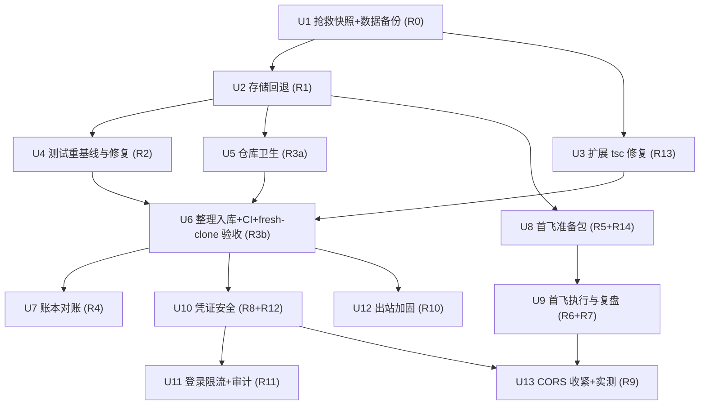

# fix: 止血→首飞→安全 — 仓库恢复、产品首飞与安全加固

## Execution Status (2026-06-10)

**已完成并本地提交（分支 feat/batch-reliability-ux，未推送）**：U1（本地快照+data 备份）、U2、U3、U4、U5、U6（CI 文件 + fresh-clone 本地验证全绿）、U7、U8（run-sheet 对齐，R14 操作步骤写入 Part 0）、U10、U11、U12。基线：后端 111 测试、扩展 315 测试、`pnpm -r compile` 全绿；干净 fresh clone install→build→compile→test 全部通过。

**待运营者动作（自主会话止步于此）**：
- **U6 推送**：✅ 已完成（2026-06-10）。gitleaks 扫描通过，两分支已推 GitLab：`feat/batch-reliability-ux`（MR !2）、`rescue/wip-2026-06-10`（新分支）。
- **U8 操作步骤**（详见 `docs/run-sheet-首飞与基线.md` Part 0）：运行 `hash-password.mjs` 生成 `JWT_ADMIN_PASSWORD_HASH`、生成强 `JWT_SECRET`、在供应商轮换 `LLM_API_KEY`，写入 `.env` 重启后端，做扩展登录验证确认 G1。
- **U9 首飞**：两条路径各 ≥1 篇真实发布 + 前台核验 + 首飞后再备份 data/（详见 run-sheet Part 2–4）。
- **U13 CORS 收紧**：首飞成功后做，需打包扩展真实请求实测。

## Overview

把 51publisher 从「三重不稳定」（约 116 个文件未入库、存储迁移半成品、后端测试红）恢复为绿色可还原的基线，随后用两条路径的真实发布完成产品闭环首飞（G2），最后修复 4 个高危 + 3 个低成本中危安全项。三阶段强顺序、阶段内并行，全部决策承接自源需求文档（经两轮六人格评审定稿）。

## Problem Frame

详见源文档（docs/brainstorms/2026-06-10-stabilize-first-flight-security-requirements.md）。要点：

- 工作区有大量未入库源码（后端主体、整个 shared 包、CI 配置），GitLab 远端不完整，硬盘故障即丢失成果。**前提漂移（2026-06-10 下午评审实测）**：并发会话已把几乎全部文件加入暂存区（约 153 个 staged 新增、71 个重命名，其中 88 个是 coverage/ 生成物，至少 1 个文件暂存后又被修改），`scripts/probe-grounding.mjs` 已从工作区消失——U1 按「热索引」流程处理，以工作区状态为准
- JSON→SQLite 存储迁移半途而废：`batch-routes.ts`/`prompt-routes.ts` 已接到 SQLite 半成品上，测试 7 失败（HTTP 500）
- 产品核心闭环（选题→生成→审核→填充→发布）从未经过一次真实发布验证
- 安全体检 4 高危：明文密码与无时序防护比较、CORS 全放行、SSRF 缺 DNS rebinding 防护、登录可暴力枚举
- **执行前置**：2026-06-10 曾有并发会话修改工作树（方向与回退决策冲突），运营者已承诺停止；执行第一步必须确认其已停止并重测基线（编译/测试/git 状态三项）

## Requirements Trace

承接源文档 R0–R14（编号为源文档稳定 ID）：

- R0 抢救快照（扫描先于推送）→ Unit 1
- R1 回退半成品 SQLite 迁移 → Unit 2
- R13 扩展侧 4 个既有 tsc 错误 → Unit 3
- R2 后端测试全绿（1 天时间盒 + 首飞关键路径例外）→ Unit 4
- R3 版本控制恢复完整（密钥扫描、.gitignore/.env.example、fresh-clone 验收）→ Units 5–6
- R4 状态对账 → Unit 7
- R5 run-sheet 对齐 + R14 首飞前轮换 → Unit 8
- R6/R7 两条路径真实发布与问题处置 → Unit 9
- R8/R12 凭证安全 + JWT 有效期 → Unit 10
- R11 登录限流 + 审计日志 + PUBLIC_ROUTES 盘点 → Unit 11
- R10 出站加固（SSRF + LLM endpoint 钉死）→ Unit 12
- R9 CORS 收紧（首飞后，与首飞捆绑）→ Unit 13

## Scope Boundaries

承接源文档（see origin），不重复展开。要点：不做 SQLite 统一迁移（pending+config 维持 SQLite，batch/prompt 回退 JSON）、不做前端美化、不做后端覆盖率大补强、不做运维设施（Docker/健康检查/备份策略/CI 安全扫描）、不做 refresh token/多管理员/密钥管理系统、不做新功能、不做自动提交验证。

## Context & Research

### Relevant Code and Patterns

- **回退接线点**（已实证）：`packages/backend/src/batch-routes.ts:12` 与 `packages/backend/src/scraper/prompt-routes.ts:11` 的 import 是仅有的两处路由级改动；JSON 版 `batch-store.ts` / `scraper/prompt-store.ts` 导出同名函数全集，调用处已全 `await`（await 同步值合法），无需改调用代码。`index.ts:22/28` 删 `initAppDb` import 与调用。`src/migrations/runner.ts` + `001-initial.sql` 是 pending.db 设施，**保留**。
- **半成品实锤**：两个 sqlite store 导入 `initAppDb` 但从不调用，测试不走 `index.ts` → `getDb()` 抛错 → 7 个 500。`data/` 下无 `app.db`、无 `.bak-*` 目录 → 迁移从未真正执行，无数据善后（执行前再 `ls` 复核一次）。
- **后端路由测试模板**：`src/scraper/scraper-routes.test.ts`（fastify inject + 模块 mock + process.env 注入/清理）；文件隔离参考 `batch-routes.test.ts` 的 `cleanData()`——**注意它会 rmSync 整个 `data/`，审计日志不得落在 `data/` 下**。
- **git hooks**：本仓库用 `git config core.hooksPath scripts/git-hooks`（非 husky，**fresh clone 不自动生效**，须文档化）；现有 `pre-commit`（tsc + fixture 脱敏检查）。pre-push 密钥扫描 hook 加在同目录。
- **shared 包编译缺口**：`packages/shared/package.json` 无 `compile`/`test` 脚本 → `pnpm -r compile` 跳过 shared，backend/extension 类型检查依赖过期 dist。
- **.env.example 缺口**：缺 `ACGS51_START_URL` / `ACGS51_CRON` / `ACGS51_ENABLED`（index.ts:76-78 在读）。
- **PUBLIC_ROUTES**：`src/auth-middleware.ts:11` 含 `/api/v1/models`（定义在 `index.ts:87`，免认证即触发付费 LLM 出站调用）。
- **LLM endpoint 漏洞确认**：`index.ts` 生成路由 `process.env.LLM_ENDPOINT || settings.endpoint` —— env 未设时凭证发往请求体指定地址。

### Institutional Learnings（docs/solutions/ 与 .ai-memory/）

- **Claude-in-Chrome 打码**（docs/solutions/developer-experience/claude-in-chrome-script-redaction-backend-verify-2026-06-05.md）：浏览器验证脚本只返回布尔/存在性/结构（`indexOf>=0`、`.test()`、字段名枚举），不抠字面值；勘查后 `layui.layer.closeAll()` 清理；全程不真提交。
- **后台 iframe 架构**：发帖表单在 layuiAdmin 同源子 iframe 内，top frame 查询必然落空，走 `lib/frame-resolve.ts`；「字段全未找到」先想 iframe。
- **改 content script 后**：重载扩展（chrome://extensions ↻）+ 刷新已开后台页，两个都要做。
- **填充守则**（zero-submit 护栏）：只 set value + dispatch input/change，绝不 dispatch Enter / 点提交 / form.submit()；登录密码运营者自输；先发 status=0 隐藏帖再转正。
- **G5 未闭合项**：LLM API key 有「已曝光须轮换」记录 → 并入 Unit 8 轮换清单。
- **G7**：`scripts/probe-grounding.mjs` 因含端点/key 风险长期未入库 → Unit 6 须显式处置（fail-closed：扫描不干净则 .gitignore）。
- **验证策略**：tsc → vitest → curl QA 全生命周期（POST→GET list→GET by id→PUT→DELETE→404）；加固后补 401/429 用例。
- **扩展 fail-closed 不可破坏**：本地存储 PRIMARY、后端同步 SECONDARY；后端 401/429 时扩展必须仍能本地工作，`handleUnauthorized()` 链路要回归。
- **扩展测试 mock**：auth-client 的 getToken 必须 mock，避免真实 chrome API。

### External References（framework-docs 核实结论）

- **@fastify/rate-limit v11**：路由级 `config: { rateLimit: { max, timeWindow } }` 是覆盖不是叠加，自动获得独立计数器；全局注册保持不变。
- **@fastify/cors**：`origin` 数组精确字符串匹配，`chrome-extension://<id>` 可用；content script 发起的请求 Origin 是页面 origin（本项目请求全部来自 sidepanel/background，已核实为扩展 origin）。
- **SSRF IP 钉死**（undici 官方无内置方案，issue #2019）：自定义 `Agent({ connect: { lookup } })` 在 lookup 内解析+校验+回传已校验 IP（连接即钉死，SNI/Host 仍用原域名，消除 TOCTOU）；`fetch(url, { dispatcher: ssrfAgent })` 按请求生效不污染全局（dispatcher 直接传 fetch init，不要包进 new Request）；`redirect: 'manual'` 逐跳校验 Location。私网判断自写 CIDR 或 ipaddr.js，**勿用 npm `ip` 包**（已知误判 CVE）。
- **密码哈希**：用 Node 内置 `scrypt`（随机 salt ≥16B，存 `salt:derivedKey`）+ `timingSafeEqual`（输入不等长会抛错而非返回 false——永远比较定长派生 key）。**取消引入 bcrypt**（原生 addon + 72 字节截断，无必要）。
- **pino 审计日志**：child logger 无法换输出目的地 → 用独立 pino 实例 + `pino/file` transport（`mkdir: true`）+ `redact` 配置。
- **jsonwebtoken**：`expiresIn: '24h'` 与 payload 手写 exp 互斥；verify 加 `clockTolerance: 30`；旧 7d token 改码后仍有效到原 exp → 部署时轮换 secret 强制失效（源文档 R12 已定）。

## Key Technical Decisions

- **密码哈希用 node:crypto scrypt 而非 bcrypt**：零新增原生依赖、无 72 字节截断、强度不低于 bcrypt；哈希以 `JWT_ADMIN_PASSWORD_HASH=salt:hex` 存 .env，README 提供一行式生成指引。（修订源文档「如 bcrypt」的示例性表述，满足其「哈希存储+恒定时间比较」实质要求。）
- **审计日志落 `packages/backend/logs/auth-audit.log`**（独立 pino 实例 + redact），**不落 `data/`**——`batch-routes.test.ts` 的 cleanData 会清空 data/。`logs/` 加入 .gitignore。
- **SSRF 实现位置**：`connect.lookup` 自定义 Agent + per-request dispatcher，只作用于 scraper 三个 adapter 调用点，不碰 LLM 出站（LLM 出站以「endpoint 钉死到 env」为补偿控制，见 Unit 12）。
- **CI 处置**：`.github/workflows/ci.yml` 入库存档并在文件头注明休眠（远端是 GitLab）；新增最小 `.gitlab-ci.yml`（install → shared build → compile → test），让「远端可独立还原」有持续防回归。
- **提交切分**：rescue 分支一次性 WIP 快照；feat 分支按逻辑域整理提交（backend / shared / extension / CI+配置 / docs）。
- **hooksPath 文档化**：fresh clone 后 hooks 不自动生效，README/AGENTS 写明 `git config core.hooksPath scripts/git-hooks` 为安装步骤。

## Open Questions

### Resolved During Planning

- batch-routes 7 个 500 根因：已实证为 SQLite 接线 + 测试未初始化 app.db；R1 回退即修复（预期）。
- 哈希落点：scrypt + .env 存 `salt:hash`（见 Key Technical Decisions）。
- DNS rebinding 实现位置：connect.lookup 钉死（官方确认 undici 无内置方案）。
- CORS 多扩展 ID：`CORS_ORIGIN` 逗号分隔多值（现有解析已支持 split(',')），同时容纳开发版与打包版 ID。
- 审计日志位置与脱敏：独立 pino 实例 → `logs/auth-audit.log`，redact paths 覆盖 password/token/authorization。
- CI GitHub vs GitLab：存档休眠 + 最小 .gitlab-ci.yml。
- git 提交切分：rescue 快照 + 逻辑域整理提交。

### Deferred to Implementation

- rescue 分支生命周期（首飞完成后 tag 归档再删 vs 保留）——执行时由运营者确认，默认：归档 tag 后删除分支（注意：远端 tag 仍可被 fetch，归档并不真正缩小暴露面，私有仓库前提下可接受）。
- `scripts/probe-grounding.mjs` 已从工作区消失——运营者确认是否有意删除（疑为并发会话所为）；仓库外残留副本一律视为已暴露，LLM_API_KEY 轮换无条件执行（已并入 U8）。
- `data/` 目录是否存在 `.bak-*` 残留——执行前 `ls` 复核（研究判断为无，八成正确）。
- R2 时间盒触发后存活失败的具体处置——只有看到回退后的真实测试结果才能定。
- 测试数据隔离的具体注入方式（store/db 模块读 env vs 测试 setup 重定向）——U4 实施时按改动最小原则定。
- 后端/扩展测试数量基线（74/315 为快照记忆）——执行首日重测为准。

## Implementation Units

依赖关系（阶段内可并行项见图；首飞 3 天窗口自 G1 满足之日起算）：

> 首飞前置闸门 G1 = U1 已推送 + 后端编译零错误 + 扩展可构建加载 + 后端冒烟通过（启动+登录+batch/pending 各一次 HTTP 往返）。U10–U12 与首飞窗口可穿插；U13 必须在首飞成功之后。

### Phase A — 止血

- [x] **Unit 1: 抢救快照与数据备份（R0）**

**Goal:** 在任何回退/删除前，把全部工作区成果置于 git 保护下，并备份运行数据。

**Requirements:** R0

**Dependencies:** 前置（推送前必须全部满足）：①确认并发会话已停止（运营者动作）；②运营者确认 GitLab 仓库为私有（评审时未认证 API 查询返回 404，与私有一致，仍须最终确认——确认先于推送，公开仓库即不可逆暴露）。

**Files:**
- 无代码改动（流程单元）；产出 rescue/WIP 分支（如 `rescue/wip-2026-06-10`）推送远端；`data/` 带日期副本到仓库外第二位置。

**Approach（严格按序，顺序本身就是安全设计）:**
1. **停服**：确认无后端进程在跑（查 3001 端口）——data/ 含 WAL 态 SQLite，开着服复制会拷出损坏快照。
2. **先备份 `data/`**：用 `sqlite3 data/pending.db ".backup '<dest>'"` 或停服后连同 `-wal/-shm` 一起复制到仓库外第二位置。**此步必须先于任何测试运行**——`batch-routes.test.ts` 的 cleanData 会 rmSync 整个 `data/`（含待审池与 config），「重测基线」若先跑测试，等于在备份前删掉要保护的数据。
3. **重测基线**：此时只测「编译 + git 状态」两项；测试项留到备份完成后再跑。
4. **装扫描工具**：`brew install gitleaks`（本机实测 gitleaks/trufflehog 均未安装——模式 grep 只能作补充，不可作为首次大规模推送的唯一防线）。
5. **热索引整理**：`git status --porcelain -uall` 审计；88 个已暂存的 coverage/ 生成物 `git rm -r --cached` 退出索引（后续 Unit 5 再补 .gitignore）；暂存与工作区有分歧的文件以**工作区**为准。
6. **fixture 闸门**：`pnpm --filter publisher-fill-assistant check:fixtures`（该脚本只在 extension 包内，根目录直接跑会报错）。
7. **密钥扫描**：gitleaks 扫全部待快照文件（重点：`.ai-memory/`、CI 配置、测试夹具）——**扫描先于推送**；命中则先排除/轮换再推。
8. **快照提交并推送**：以工作区状态提交 rescue 分支（排除 .env、data/ 等忽略项）；推送成功后才允许开始 Unit 2。
- `scripts/probe-grounding.mjs` 已不在工作区：运营者确认是否有意删除；仓库外任何残留副本（废纸篓/备份盘/其他 checkout）一律视为已暴露——**Unit 8 的 LLM_API_KEY 轮换因此无条件执行**。

**Test scenarios:**
- Test expectation: none — 流程单元，无行为代码；验证以下列 Verification 为准。

**Verification:**
- 远端存在 rescue 分支且包含全部未跟踪源码；扫描记录无命中（或命中已处置）；`data/` 副本存在于第二位置。

- [x] **Unit 2: 回退半成品 SQLite 迁移（R1）**

**Goal:** batch/prompt 回到 JSON 文件存储，消除半成品双初始化与 batch-routes 500。

**Requirements:** R1

**Dependencies:** Unit 1

**Files:**
- Modify: `packages/backend/src/batch-routes.ts`（import 行 → `./batch-store.js`）
- Modify: `packages/backend/src/scraper/prompt-routes.ts`（import 行 → `./prompt-store.js`）
- Modify: `packages/backend/src/index.ts`（删 `initAppDb` import 与调用）
- Delete: `packages/backend/src/scraper/batch-store-sqlite.ts`、`packages/backend/src/scraper/prompt-store-sqlite.ts`、`packages/backend/src/scraper/migrations/db.ts`、`packages/backend/scripts/migrate-json-to-sqlite.ts`
- Keep: `packages/backend/src/migrations/runner.ts` + SQL（pending.db 设施）
- Test: 既有 `packages/backend/src/batch-routes.test.ts`（应转绿，无需改）

**Approach:**
- 回退前 `ls packages/backend/data/`：确认无 `app.db` 与 `.bak-*`（有则先导出/还原再删）；基线重测与回退之间不启动后端服务。
- JSON store 函数签名同名兼容、调用处全 await，预期零调用代码改动。

**Test scenarios:**
- Happy path：`batch-routes.test.ts` 全部用例转绿（create→get→list→patch 走 JSON 存储）。
- Integration：后端启动后 curl QA：batch 与 prompt 各完成 POST→GET→PUT 往返，`data/batches/`、`data/prompts/` 出现 JSON 文件。
- Edge case：`data/` 为空目录时首次写入自建子目录（ensureDir 既有行为）。

**Verification:**
- `pnpm --filter publisher-backend compile` 零错误；启动路径无废弃迁移代码；上述往返实测通过。

- [x] **Unit 3: 扩展侧 tsc 错误修复（R13）**

**Goal:** 修复 4 个既有类型错误，使 workspace 级 `pnpm -r compile` 全绿。

**Requirements:** R13

**Dependencies:** Unit 1（可与 Unit 2 并行）

**Files:**
- Modify: `packages/extension/lib/link-source.ts`、`packages/extension/tests/e2e/probe-grounding.test.ts`、`packages/extension/tests/e2e/validate-grounding.test.ts`
- Test: 以 `pnpm --filter publisher-fill-assistant compile` 全绿为验收（类型层修复）

**Approach:**
- 只修类型错误，不改运行行为；e2e 测试文件如硬编码真实 LLM endpoint 默认值，顺手改为占位/env 读取（与 Unit 1 扫描联动）。

**Test scenarios:**
- Happy path：扩展包 tsc 零错误；既有 315 个单测保持全绿。
- Edge case：修复不引入新的 lint/biome 告警。

**Verification:**
- `pnpm -r compile`（含 shared build，见 Unit 5）零错误。

- [x] **Unit 4: 后端测试重基线与修复（R2）**

**Goal:** 回退后重测，修复存活失败至全绿；时间盒 1 个工作日。

**Requirements:** R2

**Dependencies:** Unit 2

**Files:**
- Test: `packages/backend/src/**/*.test.ts`（按存活失败定位，预期主要是 batch-routes 已自愈）

**Approach:**
- 仅处理回退后仍红的用例；禁止 skip/xfail。时间盒超时 → 降级为与首飞并行的修复项（收工必要条件），**batch-routes/pending-routes 的失败除外（阻塞对应首飞路径）**。
- **测试与运行数据隔离（根治）**：本单元顺手为后端测试注入隔离数据目录（store/db 模块读 `DATA_DIR` env 或测试 setup 重定向到临时目录），使测试永不触碰真实 `data/`——否则阶段 C 与首飞窗口穿插时，任何一次跑测试都会清空待审池（首飞路径之一的数据源）。隔离落地前的过渡纪律：**首飞准备（U8）到首飞完成（U9）之间禁止运行后端测试**。

**Test scenarios:**
- Happy path：`pnpm --filter publisher-backend test` 全绿（快照预期 74/74）。
- Error path：若存活失败 → 按「重测基线→定位→修复→复测」循环，记录根因。

**Verification:**
- 后端测试全绿，或时间盒触发后留有书面存活清单（不含首飞关键路径路由）。

- [x] **Unit 5: 仓库卫生（R3a：忽略规则/环境样例/构建脚本/钩子）**

**Goal:** 让「fresh clone 可还原」的工程前提全部就位。

**Requirements:** R3

**Dependencies:** Unit 1（可与 Unit 2/3 并行）

**Files:**
- Modify: `.gitignore`（补 `coverage/`、`packages/backend/logs/`、必要的生成物）
- Modify: `packages/backend/.env.example`（补 `ACGS51_START_URL`/`ACGS51_CRON`/`ACGS51_ENABLED`，取消注释并说明 `CORS_ORIGIN`/`ALLOWED_HOSTS`/`LLM_MODEL`）
- Modify: `packages/shared/package.json`（加 `compile` 脚本使 `pnpm -r compile` 覆盖 shared 构建）
- Create: `scripts/git-hooks/pre-push`（密钥扫描，fail-closed）
- Modify: `README.md` / `AGENTS.md`（hooksPath 安装步骤、env 变量清单、强密钥生成一行式指引）

**Approach:**
- pre-push hook 复用 Unit 1 的扫描逻辑，成为持续防线（覆盖阶段 B/C 的 run-sheet 回填与 .ai-memory 提交）。
- fresh-clone 测试不得依赖真实 .env/data（以 .env.example 占位值或测试内置默认运行）。
- shared 的新脚本形态：`compile` = 产出 dist 的 `tsc` 构建（不是 --noEmit）——backend/extension 的类型检查依赖 shared dist 存在。

**Test scenarios:**
- Happy path：**临时 clone 已推送的 rescue 分支**到 scratch 目录，跑 `pnpm install && pnpm --filter @51publisher/shared build && pnpm -r compile && pnpm -r test` 全绿（rescue 分支天然无 .env/data，正好满足「无凭证环境」要求）。**禁用 `git stash -u` 方案**：它不会移除被忽略的 .env（验证无效），且在 153 个暂存新文件未提交时 stash 会把工作区打回旧布局、stash-pop 冲突正是阶段 A 要消灭的数据风险。
- Error path：pre-push hook 对注入的假密钥样本（如 `AKIA...` 测试串）正确拦截。

**Verification:**
- 上述命令链在无 .env 环境通过；hook 拦截实测有效。

- [x] **Unit 6: 整理入库、CI 与 fresh-clone 验收（R3b）**

**Goal:** 全部应入库文件按逻辑域整理提交并推送，远端可独立还原。

**Requirements:** R3

**Dependencies:** Units 2、3、4（或 R2 时间盒触发）、5

**Files:**
- Create: `.gitlab-ci.yml`（install → shared build → compile → test，最小形态）
- Modify: `.github/workflows/ci.yml`（文件头注明「GitHub Actions 存档，远端为 GitLab，当前休眠」）
- 提交范围：packages/backend、packages/shared、扩展新增文件、CI、根配置、docs；`scripts/probe-grounding.mjs` 按扫描结果处置（不干净则 .gitignore）

**Approach:**
- 按逻辑域分多提交（backend / shared / extension / CI+配置 / docs）；推送前 pre-push 扫描自动把关。
- 推送后在干净目录真实 fresh clone 验收一次。
- **GitLab runner 预检**：先确认命名空间有可用 runner（Settings → CI/CD → Runners；gitlab.com 免费命名空间可能需身份验证才放行共享 runner）。**预定兜底**：runner 不可用时，以「本地 fresh-clone 验收记录」作为 R3 验收，CI 记为延后项，不阻塞本单元。
- **验收口径与 R2 时间盒的关系**：入库推送不被 R2 阻塞；但「fresh-clone test 全绿」这一收工验收在 R2 完成后执行——R2 时间盒触发期间只记录存活清单，不得以「已知差异」名义把真实失败收进验收。

**Test scenarios:**
- Integration：fresh clone → install → shared build → compile → test 全绿（时点见上）；`.gitlab-ci.yml` 在 GitLab 上跑通（或触发预定兜底并记录）。

**Verification:**
- `git status` 干净（除忽略项）；远端分支完整；GitLab CI 绿或已触发预定兜底。

- [x] **Unit 7: 账本对账（R4）**

**Goal:** 让记忆与计划文档反映真实状态，杜绝下轮会话基于过期账本决策。

**Requirements:** R4

**Dependencies:** Unit 6

**Files:**
- Modify: `.ai-memory/project_51publisher.md`、`.ai-memory/MEMORY.md`
- Modify: `docs/plans/2026-06-09-001-refactor-comprehensive-optimization-plan.md`（标注：已完成/已回退/延后逐项）
- Modify: `docs/plans/2026-06-10-001-refactor-tech-debt-optimization-plan.md`（并发会话产物——标注其与本计划的关系与废止/吸收结论）

- 收工时在 `.ai-memory/` 记录**收工复盘**结论：依据首飞真实数据量评估 SQLite 统一迁移与 06-09 质量优化项的去留（源文档执行流程终点 D 节点的承接，防「延后」滑向「永久搁置」）。

**Test scenarios:**
- Test expectation: none — 纯文档对账。

**Verification:**
- 三份文档的状态描述与 `git log`/测试结果一致；收工复盘条目存在。

### Phase B — 首飞（3 天窗口自 G1 满足日起算）

- [x] **Unit 8: 首飞准备包（R5 run-sheet 对齐 + R14 密钥轮换）**

**Goal:** 运营者拿到一份与现状完全一致的执行单，且后端不再运行在已知默认凭证上。

**Requirements:** R5、R14

**Dependencies:** Unit 2（G1 其余项：Unit 1 已推送、扩展可构建加载、冒烟通过）

**Files:**
- Modify: `docs/run-sheet-首飞与基线.md`

**Approach:**
- run-sheet 对齐项：cover_url 隐藏字段、推荐标签清单、待审池/手动两条路径步骤、iframe 注意事项（frame-resolve）、扩展重载+刷新页双动作、status=0 隐藏帖先行、media_id 手填、旧测试帖 110/111/112 清理提示、逐项回填表。
- R14 轮换：`JWT_ADMIN_PASSWORD`、`JWT_SECRET`、**以及 LLM_API_KEY**——后者是规划层对源文档 R14 的显式扩充（依据机构记忆 G5「已曝光须轮换」+ probe-grounding.mjs 下落不明，无条件执行）；注意 LLM key 轮换依赖供应商侧操作（生成新 key/旧 key 失效窗口），应在开窗前预留提前量。轮换后重启后端，窗口开启前完成一次扩展端登录+认证往返（旧 token 失效属预期）。
- 冒烟核查单（G1 第四项）：启动 + 登录 + batch 与 pending 各一次 HTTP 往返。**G1 评估时点 = 本单元完成时**：「后端编译零错误」以该时点实测为准（U2 之后即应满足）；冒烟前先恢复 Unit 1 的 `data/` 备份（或重新抓取+配置下发）——阶段 A 的测试运行会清空 data/，待审池路径的首飞数据源必须在开窗前确认就位。

**Test scenarios:**
- Integration：轮换后扩展端登录成功、带 token 请求 200、旧 token 401 且扩展 fail-closed 行为正常（本地仍可用）。

**Verification:**
- G1 四项全部满足并记录；运营者宣布开窗时间写入 run-sheet。

- [ ] **Unit 9: 首飞执行与复盘（R6 两路径发布 + R7 问题处置）**

**Goal:** 两条路径各 ≥1 篇真实发布，前台核验通过，阻塞问题闭环。

**Requirements:** R6、R7

**Dependencies:** Unit 8

**Files:**
- Modify: `docs/run-sheet-首飞与基线.md`（回填）；阻塞缺陷修复按实际定位（执行时确定）

**Approach:**
- 先手动路径（变量少）后待审池路径；填充守则不变（不替提交、不替输密码）；先 status=0 隐藏帖核验再转正。
- 前台核验：已发布页面的正文渲染、封面显示、分类/标签可见性。
- 浏览器侧验证遵循 Claude-in-Chrome 打码绕法（布尔/结构返回）。
- 阻塞问题（填错/漏填/格式损坏/无法提交）修复后复飞；非阻塞问题记录归档；复飞产生的残次帖按 run-sheet 清理流程下架。

**Test scenarios:**
- Happy path：两路径各 1 篇发布成功且前台核验全过。
- Error path：任一字段落地异常 → 定位（iframe/映射/归一化）→ 修复 → 复飞同路径。
- Edge case：`cover_url` 实际为 file upload 而非 URL 字符串 → 记录为缺陷，封面项降级为「待定」（源文档既定边界）。

**Verification:**
- run-sheet 全部回填；两路径成功记录（或窗口落空触发兜底：阶段 C 以 R8/R10-R12 收工，R9 随首飞延期，改期承诺写入 .ai-memory）。
- **首飞完成后对 `data/` 再做一次带日期异地副本（R0 第二次备份）**，并写入 run-sheet 收尾段。

### Phase C — 安全加固（U10–U12 可与首飞窗口穿插；U13 必须在首飞成功后）

- [x] **Unit 10: 凭证安全（R8 哈希+fail-closed 启动校验；R12 JWT 24h）**

**Goal:** 密码不再明文比较/存储；弱配置无法启动；token 有效期收紧。

**Requirements:** R8、R12

**Dependencies:** Unit 6（代码基线已入库）

**Files:**
- Modify: `packages/backend/src/auth-routes.ts`（scrypt 校验 + timingSafeEqual；expiresIn 24h；status 端点 verify 加 clockTolerance + `algorithms: ['HS256']` 钉死）
- Modify: `packages/backend/src/auth-middleware.ts`（**requireAuth 的 jwt.verify 同步加 clockTolerance 与算法钉死**——真正把关 API 访问的 verify 在这里，不在 auth-routes）
- Modify: `packages/backend/src/index.ts` 或新建 `packages/backend/src/env-check.ts`（启动 fail-closed 校验）
- Modify: `packages/backend/.env.example`（`JWT_ADMIN_PASSWORD_HASH` 形态 + 生成指引注释）
- Modify: `README.md`（一行式强密钥/哈希生成指引——R8 fail-closed 会拒绝占位值，须配套）
- Create: `packages/backend/src/auth-routes.test.ts`

**Approach:**
- scrypt（随机 salt，存 `salt:hex`）；比较定长派生 key（timingSafeEqual 不等长抛错）。
- 启动校验拒绝：JWT_SECRET 为已知占位/默认/空/过短；JWT_ADMIN_PASSWORD_HASH 为占位或缺失。
- 部署本单元时再轮换一次 JWT_SECRET（强制存量 7d token 失效，R12）。

**Test scenarios:**
- Happy path：正确密码 → 200 + token；token 24h 内 verify 通过。
- Error path：错误密码 → 401（恒定时间路径）；弱 JWT_SECRET 启动 → 进程拒绝启动并输出可读原因；占位哈希 → 同上。
- Edge case：超长/空密码输入不抛 timingSafeEqual 长度错误（先派生再比较）。
- Integration：扩展端 401 后 `handleUnauthorized()` 清 token、本地功能不受影响（fail-closed 回归）。

**Verification:**
- 新测试全绿；curl QA 含 401 用例；启动校验手测两种拒绝场景。

- [x] **Unit 11: 登录防护（R11 限流+审计日志+PUBLIC_ROUTES 盘点）**

**Goal:** 登录不可暴力枚举，认证事件可审计，免认证面收敛。

**Requirements:** R11

**Dependencies:** Unit 10（同文件区域，顺序施工）

**Files:**
- Modify: `packages/backend/package.json`（**新增 pino 直接依赖**——pino 目前只是 fastify 的传递依赖，pnpm 隔离布局下 `import pino` 解析不到；主版本与 fastify 内置 pino 对齐）
- Modify: `packages/backend/src/auth-routes.ts`（路由级 `config.rateLimit`，~10/min；`/api/v1/auth/status` 同享该限流配置——它是免认证的 token 有效性"神谕"端点）
- Create: `packages/backend/src/audit-log.ts`（独立 pino 实例 → `logs/auth-audit.log`，redact: password/token/authorization；只记时间/IP/结果）
- Modify: `packages/backend/src/auth-middleware.ts`（PUBLIC_ROUTES 移除 `/api/v1/models`）
- Test: 扩展 `packages/backend/src/auth-routes.test.ts`

**Approach:**
- @fastify/rate-limit 路由级覆盖（独立计数器，全局 100/min 不变）；用 `onExceeded` 钩子给被限流（429）的尝试也写审计行（result=rate_limited）——否则暴力爆破最强信号段恰好无审计。
- PUBLIC_ROUTES 盘点结论（显式去留）：`/api/v1/auth/login` 保留（引导入口，已限流）；`/api/v1/auth/status` 保留（AuthView 依赖）但纳入登录同级限流；`/api/v1/models` 移除（免认证触发付费 LLM 调用）。测试断言最终 PUBLIC_ROUTES 集合与此一致。
- 审计日志不落 `data/`（测试 cleanData 会清空）；`logs/` 已在 Unit 5 加入 .gitignore。**保留期决定**：单运营者本机形态不做自动轮转，全量保留；单文件超 ~10MB 由运营者手动归档，公网部署时再引入轮转。

**Test scenarios:**
- Happy path：登录成败均产生审计行（时间/IP/结果），日志中无密码与 token 字样。
- Error path：第 11 次/分钟登录请求 → 429 且产生 result=rate_limited 审计行；429 不产生 token。
- Integration：`/api/v1/models` 无 token → 401；扩展端（始终带 token）不受影响；429 时扩展 fail-closed 本地可用；PUBLIC_ROUTES 最终集合断言。

**Verification:**
- 新增用例全绿；curl QA 含 429 用例；审计文件内容抽查无敏感值。

- [x] **Unit 12: 出站加固（R10 SSRF IP 钉死 + LLM endpoint 钉死）**

**Goal:** 抓取出站只允许公网单播且校验与连接同 IP；LLM 凭证只发往 env 配置的地址。

**Requirements:** R10

**Dependencies:** Unit 6（可与 U10/U11 并行）

**Files:**
- Modify: `packages/backend/package.json`（**新增 undici 直接依赖**——当前不是任何包的依赖，pnpm 隔离布局下导入不到）
- Create: `packages/backend/src/scraper/ssrf-guard.ts`（自定义 undici Agent：connect.lookup 校验+钉死；deny-unless-global-unicast，私网/环回/链路本地/CGNAT/IPv6 特殊段/NAT64 为测试用例；自写 CIDR 判断或 ipaddr.js，勿用 npm `ip` 包）
- Modify: 三个 adapter 调用点（`acgs51-adapter.ts`、`template-adapter.ts`、`demo-adapter.ts`）改为 `fetch(url, { dispatcher: ssrfAgent, redirect: 'manual' })` + 逐跳校验循环（http/https only，最大跳数）。**版本钉死规则：fetch 与 Agent 必须从同一个 npm undici 包导入**——Node 22 内置 fetch 捆绑 undici v6、npm undici 是 v7，dispatch handler 协议在两版间有变化，npm Agent 混用全局 fetch 是隐性故障源；ssrf-guard.test.ts 用真实回环拒绝实测定案兼容性
- Modify: `packages/backend/src/index.ts`（生成路由删除 `settings.endpoint` 回退，LLM_API_KEY 只发往 env `LLM_ENDPOINT`；env 未设时返回配置错误而非使用请求体值）
- Modify: `packages/backend/src/scraper/ssrf-allowlist.ts`（与 guard 协同；既有 hostname allowlist 与测试保留）
- Create: `packages/backend/src/scraper/ssrf-guard.test.ts`

**Approach:**
- dispatcher 直接传 fetch init（不要包进 new Request）；per-request 生效不污染全局，LLM 出站不经过 guard（补偿控制：endpoint 钉死）。
- 运营者影响说明：endpoint 钉死后，扩展 Settings 中的 endpoint 字段实质失效（env 已设被覆盖、未设报配置错误）——在该字段旁或文档中注明「由后端 env 配置」，避免误导排障。

**Test scenarios:**
- Happy path：公网域名解析为公网 IP → 放行且连接钉死在校验 IP。
- Error path：解析为 127.0.0.1 / 10.x / `::1` / `::ffff:127.0.0.1` / `169.254.169.254` / `64:ff9b::...` → 拒绝；多记录 DNS 含一条私网 → 拒绝。
- Error path：重定向到非 http(s) 或 allowlist 外域名 → 拒绝；超过最大跳数 → 拒绝。
- Error path：请求体携带 endpoint 且 env 已设 → 忽略请求体值；env 未设 → 返回配置错误，不外发凭证。
- Integration：既有 `ssrf-allowlist` 测试与 scraper-routes 测试保持全绿。

**Verification:**
- 新旧 SSRF 测试全绿；以本机回环目标做一次真实拒绝实测。

- [ ] **Unit 13: CORS 收紧与现网实测（R9，首飞成功后）**

**Goal:** 默认不再放行所有来源；以打包版扩展真实请求验收。

**Requirements:** R9

**Dependencies:** Unit 9（首飞成功）+ Unit 10（复用其 env-check fail-closed 启动校验机制）；兜底场景随首飞延期

**Files:**
- Modify: `packages/backend/src/index.ts`（CORS：默认值从 `'*'` 改为必须显式配置；`CORS_ORIGIN` 逗号分隔数组精确匹配，容纳开发版+打包版扩展 ID；遗留 `'*'` 值 **fail-closed 拒绝启动**——复用 Unit 10 的 env-check 机制，告警模式防线形同虚设与 R8 同理）
- Modify: `packages/backend/.env.example`（CORS_ORIGIN 双 ID 示例与说明）
- Test: 扩展 `packages/backend/src` 相应测试（inject 带 Origin 头断言）

**Test scenarios:**
- Happy path：Origin 为配置内 `chrome-extension://<id>` → CORS 头正确返回。
- Error path：Origin 为任意网页域 → 无 CORS 放行头；`CORS_ORIGIN` 缺失或为 `'*'` → 启动拒绝/告警。
- Integration：收紧后由打包版扩展对真实后端完成一次认证填充往返（记录在 run-sheet）——这是 R9 的验收主体，不可用单测替代。

**Verification:**
- 测试全绿 + 现网实测记录。

## System-Wide Impact

- **Interaction graph:** auth-middleware preHandler（PUBLIC_ROUTES 收敛影响所有免认证调用方）；扩展侧 auth-client/batch-sync 的 401/429 处理链路；scraper scheduler 经过 ssrf-guard。
- **Error propagation:** 后端新增 401/429/启动拒绝三类失败面——扩展双写 fail-closed（本地 PRIMARY）不得被破坏，是 U10/U11 的回归断言；后端启动 fail-closed 使弱配置从「静默风险」变为「显式不可用」，README 指引是配套必需品。
- **State lifecycle risks:** 回退窗口期写入 app.db 的数据会被孤儿化（U2 已含检查与禁启动约束）；JWT_SECRET 两次轮换（U8、U10）各使存量 token 失效——均为预期并写入 run-sheet。
- **API surface parity:** `/api/v1/models` 从免认证转需认证——扩展端调用处已带 token（核实过均走 auth-client），无需改动，但需回归。
- **Integration coverage:** 单测无法证明的三件事：fresh-clone 全链路（U6 真实 clone）、轮换后扩展登录（U8）、CORS 收紧后打包扩展真实请求（U13）——均已列为显式验收。
- **Unchanged invariants:** pending/config 的 SQLite 存储、`migrations/runner.ts`、既有 SSRF hostname allowlist 行为与测试、扩展填充守则（不替提交）、双写 fail-closed 模式——本计划不改变。

## Risks & Dependencies

| Risk | Mitigation |
|------|------------|
| 并发会话未真正停止，执行期间工作树再变 | 执行第一动作=确认停止+重测基线（编译/git；测试在 data/ 备份后）；U1 快照兜底工作区现存文件的丢失（注意：无法找回此前已被删除的未跟踪文件，probe-grounding.mjs 即是先例） |
| 后端测试运行清空 data/（待审池/config 同目录） | U1 备份先于一切测试；U4 落地测试数据隔离；隔离前 U8→U9 期间禁跑后端测试 |
| gitleaks 未安装、GitLab runner 可用性未知 | U1 第 4 步显式安装；U6 runner 预检+预定兜底（本地 fresh-clone 验收顶替） |
| R2 回退后仍有存活失败且超时间盒 | 时间盒降级规则+首飞关键路径例外（源文档 R2 既定） |
| 首飞窗口落空 | 3 天兜底规则：R8/R10-R12 收工，R9 随首飞延期，带日期改期承诺（源文档既定） |
| 密钥扫描误放行（模式不全） | gitleaks/trufflehog 优先；pre-push hook 持续防线；GitLab 仓库私有性运营者确认 |
| scrypt 参数/maxmem 配置失误导致启动抛错 | 用默认参数（N=16384）起步；测试覆盖启动校验路径 |
| CORS 收紧误伤扩展（dev/prod ID 差异） | U13 排在首飞后+现网实测验收+双 ID 配置示例 |
| 审计日志被测试 cleanData 误删 | 日志落 `logs/` 不落 `data/`（规划期已定位该坑） |
| fresh clone 后 hooks 不生效（hooksPath 不随仓库走） | README/AGENTS 安装步骤显式化（U5） |

## Documentation / Operational Notes

- `docs/run-sheet-首飞与基线.md` 是首飞唯一执行入口（U8 对齐、U9 回填）。
- README/AGENTS 更新：hooksPath 安装、env 变量清单、强密钥生成指引、`.github/` 休眠标注。
- `.ai-memory/` 与两份旧计划的状态对账（U7）；首飞兜底触发时改期承诺也写入 `.ai-memory/`。
- 运维提示：U8 与 U10 各有一次「全员重新登录」（token 失效），单运营者场景影响极小。

## Sources & References

- **Origin document:** [docs/brainstorms/2026-06-10-stabilize-first-flight-security-requirements.md](../brainstorms/2026-06-10-stabilize-first-flight-security-requirements.md)
- Related code: `packages/backend/src/batch-routes.ts`、`packages/backend/src/auth-routes.ts`、`packages/backend/src/scraper/ssrf-allowlist.ts`、`packages/extension/lib/frame-resolve.ts`
- Institutional: `docs/solutions/developer-experience/claude-in-chrome-script-redaction-backend-verify-2026-06-05.md`、`.ai-memory/feedback_frontend-backend-separation.md`
- External: fastify-rate-limit/fastify-cors README、undici Client.md 与 issue #2019、Node crypto 文档、pino redaction/transports 文档、node-jsonwebtoken README
- Related MR: GitLab MR !2（feat/batch-reliability-ux）
