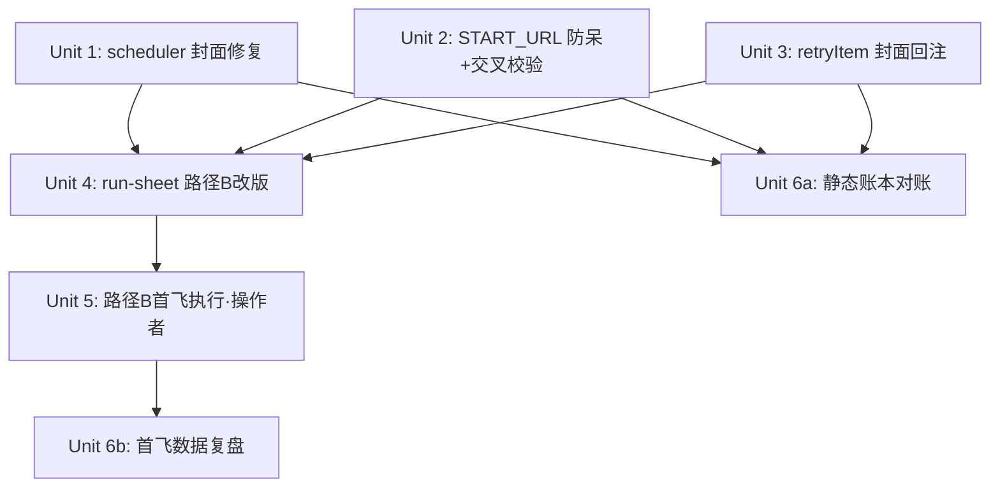

# feat: 阶段 1 点火与对账——路径 B 首飞、坐实 bug 修复、账本对账

## Overview

智能化路线图(origin)的阶段 1:让从未真实跑过的自动管线(路径 B:抓取→待审→批准→生成→填充→authorized 发布)端到端点火一次,飞前修掉三个会污染实证结论的坐实 bug,飞后完成账本对账。阶段 2-5 不在本计划范围(过闸后另立计划)。

## Problem Frame

路径 A(手动)首飞已成功(2026-06-10,ID 121),但路径 B 的全部代码(R1-R10 能力)从未端到端运行——「已投运」是账面幻觉(see origin: Problem Frame)。同时存在账实不符:plan 06-09-002 标记 9/9 完成但 few-shot 编辑器未实现;06-10-002 的收工复盘未做。本计划是后续一切阶段(学习地基/质量闭环/选题智能)决策的事实地基:首飞会实证 cover_url 字段类型、弹层自动化可行性等承重假设。

## Requirements Trace

(R 编号沿用 origin 文档)

- **R1**. 路径 B 端到端 ≥1 篇真实发布;实证 cover_url 字段类型;回填 run-sheet;U13 CORS 现网实测(首飞成功后);data/ 二次异地备份(加密或「无机密」结论成文,`.env` 永不进备份集);五项零成本观察(**尽力采集,不阻塞过闸**,见 origin R1):①弹层自动化 dry-run 实测 ②admin session 寿命 ③隐藏帖免登录可访问性 ④save 响应 URL/ID→URL 模板 ⑤时间戳行为。
- **R2**. 修复坐实 bug:① `scheduler.ts` cron 路径丢 `coverImageUrl`;② `ACGS51_START_URL` 默认首页与详情页 adapter 不匹配。本计划依据流程分析追加 ③ `retryItem` 重试路径不回注封面(同为静态坐实,且直接影响 R1 封面实证有效性,见 Key Technical Decisions)。
- **R4**. 账本对账:静态对账(标记修正)不依赖首飞、提前执行(Unit 6a);首飞数据复盘(SQLite 去留等)在 Unit 5 完成后执行(Unit 6b)。

**阶段 1 过闸条件**(origin 阶段总览):路径 B 端到端 ≥1 篇真实发布,**且发布帖必须源自 scraper 真实入池的选题(手注待审条目仅限排障演练,不计过闸)**;cover_url 假设有实证结论。

## Scope Boundaries

(origin Scope Boundaries 的阶段 1 投影,全部为硬红线)

- 不做列表页发现/选题去重/评分排序(阶段 4 候选;cron 重抓同 URL 重复入池在首飞期间是已知可接受现象,观察完关回 `ACGS51_ENABLED` 即可)
- 不做 media_id 自动匹配(操作者手填,但操作位必须是 DraftPreview,见决策 4)
- 不做隐藏态自动发布/定时触发(已在 origin 中降为候选)
- 不做 SQLite 统一迁移(收工复盘只做去留评估,不动代码)
- 不做 pending↔batch 关联键、批准事务化、抓取进度反馈等流程改进(C2/I2/I4 走 run-sheet 预案,等阶段 2+ 依真实痛点再议)
- 不做 `extractionMode` 入库(仅日志用途,待审池不展示 strict/fallback 来源)
- 不做 coverImageUrl 的 scheme/host 代码级校验(首飞人在环可控;列入 Unit 6b 收工复盘的阶段 2 评估项)

## Context & Research

### Relevant Code and Patterns

- **R2① 现场**:`packages/backend/src/scraper/scheduler.ts` L83 解构 `{ facts, confidence, extractionMode }` 丢 `coverImageUrl`;L90-101 构造 PendingTopic 无该字段。上游 `fact-extractor.ts` L128 返回含 `coverImageUrl`;下游 `pending-store.ts` L17 类型/L101 绑定/`cover_image_url` 列均就绪。**修复参照**:`scraper-routes.ts` L83 解构 + L100 `...(coverImageUrl ? { coverImageUrl } : {})` 透传写法。cron 任务体是 `startScheduler` 内约 90 行 async 闭包(L39-126,含三次指数退避、错误隔离、结构化日志)——**已核实,不是假设**。
- **R2② 现场**:`packages/backend/src/index.ts` L78 `process.env.ACGS51_START_URL || 'https://51acgs.com'`(首页默认)/ L80 `ACGS51_ENABLED === 'true'`;`adapters/acgs51-adapter.ts` 头注释明确是「单条详情页适配器」;`.env.example` L33-36 示例也写首页,需一并修。**校验模式参照**:`env-check.ts` `checkEnv()` 逐项 push 带生成指引的错误文案 + `validateEnv()` 聚合 throw(`index.ts` L162 启动调用);注意现有三项校验是无条件的,新校验必须以 `ACGS51_ENABLED==='true'` 为前置条件,否则破坏未启用抓取的部署;CORS_ORIGIN 校验有 trim 先例,空白串处理对齐。
- **R2③ 现场**:`packages/extension/lib/batch-orchestrator.ts`——封面仅在 runBatch 闭包内的 `coverUrlsByTopic` Map 存活(L82-86),注入成功条目的 `draft.coverImageUrl`(L117-118)后即丢弃;`BatchItem`(`batch.ts:28-40`)无封面字段;**「生成失败」条目从未有过 draft,封面零痕迹——而这恰是 retry 主场景**。`retryItem` 在 L296-320,L316 用 `generateDraft` 全新返回 `markFilled`(`toDraft` 把 coverImageUrl 硬编码 `''`,`llm.ts:135`)。
- **测试模式**:scheduler 目前**零测试**(空白区)。参照 `scraper-routes.test.ts`:模块级 `vi.mock('./fact-extractor.js')`/`vi.mock('./pending-store.js')`、mock adapter 工厂、自增 testId 生成唯一 siteName(scraperConfig 是只增不去重的模块单例,防跨用例污染)、env var 在 beforeEach/afterEach 设删。数据目录隔离由 `src/test-setup.ts` 兜底。backend 基线:11 文件 120 测试全绿(06-10-002 计划写的「111」已过期,对账时修正)。
- **retryItem 测试模板**:`batch-orchestrator.test.ts` describe L380-450(`makeRetryDeps` L381-388、`errorBatch` L390-398、happy path L400-408);runBatch coverImageUrls 接线「传入/未传入/长度不足」三用例 L456-508;`DRAFT` 常量 L13-27 含 `coverImageUrl: ''`(L18)。
- **run-sheet 落点**:`docs/run-sheet-首飞与基线.md`(278 行)——Part 3 路径 B(L150-173,现版较薄,B-1 含三个兜底方案)、Part 4 收尾(L177,含 U13 段 L205-217 与备份段 L184-192)、Part 5 回填表(L221,现 8 列)、附录 Q1-Q6(Q6 的窗口落空兜底援引上一计划语境,已失效)与扩展重载速查。
- **对账落点**:`docs/plans/2026-06-09-002-...-plan.md`(L4 `status: active` 与全勾矛盾;Unit 3/L244 的 Files 从未含 scheduler.ts——勾选对单元文字范围为真、对 R10 目标为假);`docs/plans/2026-06-10-002-...-plan.md`(L18 U9 行、L344 唯一未勾 checkbox、L13 过期基线、L19 U13 待实测注记)。

### Institutional Learnings

- **首飞操作陷阱**(`.ai-memory/`、自动记忆 repo-ops-gotchas/content-quality-gated-baseline):iframe 下钻已修但排障先想 iframe;改 content script 必须「重载扩展 + F5 后台页」两步;naive `button.click()` 不保存,真保存 = `POST /admin/webarticle/save`;save 非 code:0 不要连续重试;timeout 时帖子可能实际已保存,先查后台列表再决定。
- **R14 密钥轮换是首飞硬前置**(run-sheet Part 0):弱值会被 fail-closed 拒启;LLM_API_KEY 无条件轮换,依赖供应商侧需留提前量。
- **U13 故意排首飞后**(避免归因困难),必须用打包扩展真实请求验证,非 curl。
- **备份纪律**:备份先于任何测试运行;`.env` 永不进备份集。
- **过度建设纪律**:脏首飞优先——bug 修复严格限定坐实项,其余等真数据;收工复盘是义务,防「延后」滑向「永久搁置」。

### 流程分析关键发现(spec-flow,均经代码核实)

- **C1【首飞最大实际风险】**:批量路径「填充+发布」在一次批准动作里连续完成,无人工窗口;`fillers.ts` L25 无条件 `el.value = value` 会用草稿值覆盖表单手填值——run-sheet 现版「在表单里设 status=0 / 手填 media_id」的指引会被覆盖,**首飞帖可能跳过隐藏态直接公开**(草稿默认 `postStatus:'1'`,`llm.ts` L139)。正确操作位 = `DraftPreview.tsx`(L85 有 mediaId 输入,同组有 postStatus)。
- **C2**:批准是单向门——PATCH approved 在前、runBatch 在后,中途失败选题从 UI 永久消失(列表只拉 pending);恢复 = curl PATCH 回 pending。
- **C4**:run-sheet Part 0-D env 清单缺 `ACGS51_ENABLED`/`ACGS51_START_URL`;带 url 参数的 curl 触发要过 `ALLOWED_HOSTS`(空=fail-closed 全拒),**不带 url 走 config.url 不查 allowlist**——cron/config.url 路径绕过主机名 allowlist,而 ssrf-guard 的 DNS TOCTOU 残余风险注明由「上游 allowlist」兜底,该假设在 cron 路径不成立(Unit 2 以交叉校验关掉此不对称)。
- **I1**:fill 失败/grounding 拦截时 `markGenerateFailed` 从 awaiting-approval 出发是无效转移(`batch.ts` L114 合法起点不含它)→ 条目静默留待审,操作者易反复点批准(测试中写明的既知行为)。
- **I2**:触发抓取后 UI 固定 2 秒清提示,后端链路实际 45-90s——误判失败重按会重复入池。
- **I4**:pending 选题与 batch 条目间无关联键,机器无法对照(首飞用回填表手记)。
- **I5**:Part 4 备份要求停后端,U13 要求后端在跑——顺序应为 U13 → 停后端 → 备份。
- **E2**:grounding 只拦「有链接无来源」与【待补】,不拦「无链接」;degrade 不阻塞发布——审读时必须看 FillStatusTable 黄色项再放行。
- **E6**:批准/批次期间活动 tab 必须是后台发帖页,tab 漂移触发 pinnedHostOk 静默暂停。
- **E9**:publish-confirmed 后同名 topic 被重入守卫过滤(「点了没反应」)——路径 B 的 topic 名源自抓取标题,**前缀须在批次创建前生效**,故规避方式 = 选用从未发布过的新作品详情页(而非依赖改名)。
- **E10**:首飞收尾须显式决定 ACGS51_ENABLED 关回或保持(cron 不关则每 6 小时重复入池)。
- **E11**:侧边栏「立即抓取」在 >1 个 adapter 时用 `window.prompt` 选择,side panel 对 prompt() 支持存疑——兜底 curl 触发(与风险表同一预案)。
- **五项观察的嵌入点**:①弹层实测 = 主线之外的独立实验(可挪至真发布完成后,限时 15 分钟);②session 寿命 = t0(G1 登录)/t1(收尾)/**t2(次日,后补采点,不阻塞)**;③隐藏帖可访问性 = status=0 发布成功后、转正前的**唯一窗口,须显式插停顿步**;④save 响应 = A-5 F12 顺带记录(**入库前脱敏**);⑤时间戳 = save 时刻/前台显示/转正后是否刷新三元组(草稿 `publishedAt` 默认空串,fill 会清空表单时间字段——「空值后台落什么」本身就是天然实验)。

## Key Technical Decisions

1. **R2 修复先于首飞**:cron 路径丢封面 + START_URL 指首页时,R1 的 cover_url 实证必然失真(抓不到封面 ≠ 字段不可用)。修复是实证有效性的前置,不是顺手优化。
2. **START_URL 防呆 = 条件 fail-closed + allowlist 交叉校验**:去掉 `index.ts` 的首页默认值;`env-check.ts` 新增「`ACGS51_ENABLED==='true'` 时 `ACGS51_START_URL` 必填(trim 后非空)且其 host 必须在 `ALLOWED_HOSTS` 内」。后者一行成本关掉 cron 路径绕过主机名 allowlist 的不对称(C4/安全评审),让 ssrf-guard 的「上游 allowlist 兜底」假设在所有抓取路径成立。不做 URL 形态深校验(填错详情页属操作者错误,adapter throw 后日志可见)。
3. **追加 R2③ retryItem 封面回注**:静态证据与 R2① 同级,且「批准后生成失败→重试」是首飞现实路径。设计已钉死(BatchItem 持久化封面,零 shared 改动,见 Unit 3);若实施撞出超预期级联,允许降级为「旧 draft 读取(仅覆盖生成后失败场景)+ 缺口记录留阶段 2」。三个修复之外的流程缺口(C2/I1/I2/I4)一律不改代码,走 run-sheet 预案——守脏首飞纪律。
4. **首飞操作位改写**:status=0 与 media_id 一律在审读面板 DraftPreview 的草稿字段里改,绝不在后台表单里改(C1:fill 会覆盖表单)。这是 run-sheet 改版的核心订正。
5. **Part 4 收尾顺序定为 U13(后端在跑)→ 停后端 → 备份**(消解 I5 矛盾)。
6. **观察③需要显式停顿点**:转正动作会永久关闭「隐藏帖免登录可访问性」的实证窗口,A-6 必须插入「转正前用无痕窗口访问 publishUrl」一步。
7. **过闸帖必须源自真实抓取入池**:run-sheet B-1 的手注条目兜底(方案 2/3)降级为「仅限排障演练,不计阶段 1 过闸」——否则抓取受挫时沿现成兜底换道,全部 Verification 字面通过而抓取管线(本计划要消灭的账面幻觉主体)依然从未点火。
8. **中飞热修资格边界**(替代笼统的「10 分钟能修则修」):现场只允许修「阻断首飞继续、且不触碰闸门链/发布/消毒面」的问题(触碰即中止改期);修后必须跑受影响文件的单测再继续;凡在热修后的代码上产出的实证结论,回填表须注明「当时代码 = 基线 commit + 未提交改动摘要」——防止首飞证据由不可复现的代码版本产出。
9. **首飞中止协议**(Unit 4 写入 run-sheet,替代已失效的旧 Q6):中止判据 = dry-run 连续 3 次失败 / 单一问题排障超 30 分钟 / authorized 发布失败 1 次 / 触发热修资格边界外的问题;中止动作 = 关回 `ACGS51_ENABLED`、记录已完成步骤与中止原因到回填表、保持 data/ 现状;改期 = 带日期写入 run-sheet 首飞完成声明区,缺陷修复走正常快循环后再开窗。

## Open Questions

### Resolved During Planning

- 修复范围是否扩到 C2/I1/I2 等流程缺口:否——脏首飞纪律,只修坐实且影响实证有效性的三处(决策 3)。
- env-check 新校验是否影响现有部署:不影响——以 ENABLED 为前置条件,未启用抓取的部署不触发。
- `extractionMode` 是否入库展示:明确排除(PendingTopic 类型本就无此字段,牵动 schema,无当前消费方)。
- Unit 3 封面回注方案:已查清——封面不持久化于 BatchItem,且生成失败条目无 draft 可读,故「读旧 draft」方案无法覆盖 retry 主场景;选定「BatchItem 持久化封面」方案(零 shared 改动),细节见 Unit 3 Approach。
- Unit 1 测试方案:已查清任务体确为闭包——首选 `vi.mock('node-cron')` 捕获 schedule 回调直接调用(**生产代码零改动**),抽函数重构降为该方案确认不可行后的次选(过度建设纪律)。
- cron 路径 allowlist 不对称:在 Unit 2 以 env-check 交叉校验关掉(决策 2),不动 ssrf-guard/scraper 运行时代码。
- 手注待审条目是否计过闸:不计(决策 7)。

### Deferred to Implementation

- `window.prompt` 在 Chrome side panel 中的实际行为(E11):首飞时实测,失败即走 curl 兜底,不预先改代码(风险表同一预案)。
- save 响应 `data.url` 是否真实存在(`publish.ts` L62 extractUrl 已会取):观察④实证,影响阶段 2 R8 注册表设计,本计划不依赖。
- 待审池内联编辑能否修改 topic 名/作品名(影响重入守卫规避的备用手段):首飞时顺带确认;主规避手段 = 选用未发布过的新作品详情页(E9)。
- 旧批次(无 BatchItem.coverImageUrl 字段)重试时静默无封面:条件读取天然优雅降级;首飞封面实证须区分「字段缺失(旧数据)」与「抓取无封面」两种来源。
- coverImageUrl 的 scheme/host 校验与抓取正文注入检测的立项阶段:列入 Unit 6b 收工复盘评估(阶段 2+ 自动化前必须从纪律变代码闸)。

## Implementation Units

依赖关系:Unit 1/2/3 互相独立可并行;Unit 6a(静态对账)仅依赖 Unit 1-3,可与 Unit 4 并行;Unit 4 依赖 1-3 结论;Unit 5 依赖 4(且 Unit 1-3 测试全绿是开飞前置);Unit 6b 依赖 5。

> **执行记录(2026-06-10)**:Unit 1/2/3/4/6a 已完成(后端 132 / 扩展 324 单测全绿,e2e 23 全绿,compile 干净)。执行期补充一项计划外小修:e2e fixture 契约测试在基线上即红(预存,G3 漂移——真后台 2026-06-05 已记录新增 `cover_url` hidden 字段而 fixture 未更新),按已记录漂移给 fixture 补入该 hidden input,脱敏闸门+e2e 恢复全绿。Unit 5(首飞)待操作者择日执行,Unit 6b 随其后。

- [x] **Unit 1: 修复 scheduler cron 路径丢失 coverImageUrl(R2①)**

**Goal:** cron 抓取入池的选题携带封面 URL,与手动 trigger 路径行为一致。

**Requirements:** R2①;支撑 R1 封面实证。

**Dependencies:** 无。

**Files:**
- Modify: `packages/backend/src/scraper/scheduler.ts`
- Create: `packages/backend/src/scraper/scheduler.test.ts`(scheduler 目前零测试)
- Test: 同上

**Approach:**
- L83 解构补 `coverImageUrl`,PendingTopic 构造按 `scraper-routes.ts` L100 的条件展开写法透传。**生产代码改动仅此两处**。
- 测试方案首选 `vi.mock('node-cron')` 捕获 `schedule` 注册的回调后直接调用(任务体闭包无需重构,生产代码零额外改动);模块级 mock fact-extractor/pending-store 沿用 scraper-routes.test.ts 纪律。抽函数重构仅在该方案确认不可行后作为次选(行为不变)。

**Patterns to follow:**
- `scraper-routes.test.ts` 的 mock 模式(模块级 mock、mock adapter 工厂、自增 testId 唯一 siteName 防单例污染、env 设删纪律)。
- `fact-extractor.test.ts` L48-60 的 coverImageUrl 透传断言写法。

**Test scenarios:**
- Happy path:extractFacts 返回含 `coverImageUrl` → `savePendingTopic` 收到的 topic 含同值 `coverImageUrl`。
- Edge case:extractFacts 返回无 `coverImageUrl` → topic 不含该字段(条件展开,不写 undefined)。
- Happy path:topic 其余字段(sourceUrl=site.url、siteName、title、facts、confidence、status='pending')不受影响。
- Error path:extractFacts 抛错 → 不调用 savePendingTopic,错误被吞入日志不向 node-cron 外层抛(既有隔离设计不回归)。

**Verification:** backend 单测全绿(基线 120 + 新增);用例证明 cron 与手动两条路径对封面行为一致;scheduler.ts 生产改动不超过解构与构造两处。

- [x] **Unit 2: ACGS51_START_URL 防呆 + allowlist 交叉校验(R2②)**

**Goal:** 消除「开箱即坑」:启用抓取时必须显式提供详情页 URL 且其 host 在 allowlist 内,不再有误导性首页默认值;关掉 cron 路径绕过主机名 allowlist 的不对称。

**Requirements:** R2②。

**Dependencies:** 无。

**Files:**
- Modify: `packages/backend/src/index.ts`(去 L78 默认值)
- Modify: `packages/backend/src/env-check.ts`(新增条件校验)
- Modify: `packages/backend/.env.example`(L33-36 示例改为详情页 URL 形态 + 注释说明 adapter 是详情页解析器、host 须在 ALLOWED_HOSTS)
- Test: `packages/backend/src/env-check.test.ts`

**Approach:**
- `index.ts`:`url: process.env.ACGS51_START_URL ?? ''`(或等价),配置缺失时该站点交由 env-check 拦截/scheduler 的 enabled 过滤兜底。
- `env-check.ts` `checkEnv()` 追加(仅当 `ACGS51_ENABLED === 'true'`):① `ACGS51_START_URL` trim 后非空(对齐 CORS_ORIGIN 的 trim 先例),文案含「须为具体内容详情页 URL(adapter 是详情页解析器),示例见 .env.example」;② 其 host 必须包含于 `ALLOWED_HOSTS`(与手动 trigger 路径同一信任锚)。

**Patterns to follow:** `env-check.ts` 既有三项校验的「错误文案带生成/修复指引」风格;`env-check.test.ts` 既有用例结构。

**Test scenarios:**
- Happy path:ENABLED='true' + START_URL 已设且 host ∈ ALLOWED_HOSTS → 无错误。
- Error path:ENABLED='true' + START_URL 缺失/空串/纯空白 → 返回含指引文案的错误。
- Error path:ENABLED='true' + START_URL host ∉ ALLOWED_HOSTS(或 ALLOWED_HOSTS 未设)→ 返回错误。
- Edge case:ENABLED 未设或 'false' + START_URL 缺失 → 无错误(不破坏未启用抓取的部署)。
- Edge case:既有三项校验(JWT_SECRET 等)行为不变(回归)。

**Verification:** env-check 测试全绿;启用抓取但漏配 URL/allowlist 时后端拒绝启动并给出可操作文案。

- [x] **Unit 3: retryItem 封面回注(R2③)**

**Goal:** 「批准后生成失败 → 重试此条」路径不再丢封面,与 runBatch 首次生成行为一致。

**Requirements:** R2③;支撑 R1 封面实证(重试路径)。

**Dependencies:** 无。

**Files:**
- Modify: `packages/extension/lib/batch.ts`(BatchItem 类型 + createBatch)
- Modify: `packages/extension/lib/batch-orchestrator.ts`(runBatch 调用点 + retryItem)
- Test: `packages/extension/lib/batch-orchestrator.test.ts`(必要时含 `batch.test.ts`)

**Approach:**(设计已在规划期钉死,见 Resolved During Planning)
- 选定方案:`BatchItem` 加可选 `coverImageUrl?: string`(命名与 `pending-client.ts:15` 一致)→ `createBatch`(`batch.ts:65-84`)接平行参数、runBatch 调用点(`batch-orchestrator.ts:102`)同步传入 → `retryItem`(L296-320)在 `markFilled`(L316)前读 `item.coverImageUrl`、存在时覆盖注入。**零 shared 类型改动**。
- 降级出口(决策 3):若实施撞出超预期级联,退回「旧 draft 读取」方案(仅覆盖生成后失败场景)+ 缺口记录留阶段 2。

**Patterns to follow:** `batch-orchestrator.test.ts` retryItem 既有用例(describe L380-450:`makeRetryDeps` L381-388、`errorBatch` L390-398、happy path L400-408);runBatch coverImageUrls 接线的「传入/未传入/长度不足」三用例结构(L456-508)直接套用。

**Test scenarios:**
- Happy path:批次创建时带封面、条目生成失败 → retryItem 成功后 draft.coverImageUrl = 创建时注入值。
- Edge case:无封面 topic retry → 不报错、draft.coverImageUrl 保持 `''`(不被覆盖为 undefined;对齐 runBatch 既有「未传入时保持 ''」用例 L476 的断言形态——ContentDraft.coverImageUrl 是必填 string,生成恒置 `''`)。
- Edge case:coverImageUrls 数组长度不足/含 undefined → 对应条目无封面、其余正常(对齐 runBatch 既有三用例)。
- 回归:retryItem 既有行为(status 重回 awaiting-approval、facts 透传 L309)不变;BatchItem 新增可选字段不破坏 `batch.test.ts` 既有用例(旧持久化批次无此字段时条件读取优雅降级)。

**Verification:** extension 单测全绿(基线 315+);重试路径与首次路径封面行为一致。

- [x] **Unit 4: run-sheet 路径 B 首飞准备包改版**

**Goal:** `docs/run-sheet-首飞与基线.md` 成为路径 B 首飞的完整可执行手册,修正会导致事故的旧指引,写入中止协议。

**Requirements:** R1(执行载体)。

**Dependencies:** Unit 1-3(env 说明与重试预案需反映修复后行为)。

**Files:**
- Modify: `docs/run-sheet-首飞与基线.md`

**Approach:**(扩充既有结构,不另起新文档)
- **Part 0-D env 清单补**:`ACGS51_ENABLED=true`、`ACGS51_START_URL=<具体详情页URL,host 须在 ALLOWED_HOSTS>`(Unit 2 后必填)、`ALLOWED_HOSTS` 含 51acgs.com;写清触发分叉:curl 带 url 触发额外过 allowlist,cron/不带 url 走 config.url(经 Unit 2 交叉校验)。
- **【核心订正】A-3/A-5 操作位改写**:media_id 与 status=0 一律在审读面板 DraftPreview 的草稿字段修改,加显眼警告「绝不在后台表单里手改——批准时填充会用草稿值覆盖表单」(C1)。
- **Part 3 路径 B 扩充**:B-1 增加 ACGS51 启用步骤与三种触发方式(cron 等待/侧边栏按钮[注明 prompt 兜底]/curl 带详情页 url);**手注条目兜底(原方案 2/3)降级标注「仅限排障演练,不计阶段 1 过闸」**(决策 7);选题指引「选用从未发布过的新作品详情页」(E9,重入守卫在批次创建前按 topic 名过滤);触发后「2 秒提示消失 ≠ 失败,后端链路 45-90s,等 90 秒再刷新,勿重按(重复入池)」(I2);B-2 补内联编辑事实→批准→批次衔接,注明批准前确认活动 tab=后台发帖页(E6)。
- **审读步加一句**:事实与正文须与源页人工核对,警惕源页夹带的指令性文本(抓取内容是不可信输入;E2 提醒 degrade 黄色项必看)。
- **中止协议与改期规则**(决策 9,更新已失效的旧 Q6):中止判据/中止动作/改期记录格位。
- **五项观察嵌入**(按嵌入点,统一标注「尽力采集,不阻塞过闸」):①弹层实测(限时 15 分钟,超时记「未决留阶段 2」并刷新后台页恢复干净状态;可整项挪到真发布完成后做——它实证的是阶段 2 候选能力,非本次发布前置);②session 三时间戳(t0 复用 G1 登录栏/t1 收尾/**t2 次日后补,空白不算回填缺口**);③**A-6 转正前显式插入「无痕窗口访问 publishUrl」停顿步**(若实证可公开访问,同时记录为站点访问控制观察,反馈站点侧处置);④A-5 记 save 响应 JSON+帖子 ID——**入库前脱敏:剥除 token/cookie/Set-Cookie/会话类字段,只保留 code/msg/data.id/data.url 等结构性字段,原始完整响应放仓库外 scratch 路径**(check-fixture-secrets 闸门不扫 docs/,靠操作纪律);转正后反推 ID→URL 模板;⑤时间戳三元组。
- **Part 4 顺序订正**:U13(后端在跑)→ 停后端 → 备份(I5);备份段补「备份加密落异地或确认 data/ 不含机密并成文(经核实 config 库只存 field_mappings 无凭证,但含抓取原文与草稿,异地落点访问控制一并记录);`.env` 永不进备份集」;收尾决定栏:「ACGS51_ENABLED 关回或保持」(E10)+「ALLOWED_HOSTS 中 51acgs.com 去留」(防首飞后长期残留)。
- **Part 5 回填表扩列**:抓取段(触发方式/耗时/extractionMode/confidence/facts 内联修正原值→改值/封面入池与 cover_url 实证结论/**pending 来源校验列(id 前缀 scheduled_ 或手动 trigger 产物,证明非手注)**/pending id↔batch id 手记);审读段(postStatus 与 media_id 已在 DraftPreview 改的勾选确认/grounding 结果/隔离区记录);五项观察各一栏;热修记录栏(**当时代码 = 基线 commit + 未提交改动摘要**,决策 8);U13 实测扩展 ID 与响应头(同样脱敏:排除 Set-Cookie 类字段)。
- **附录排障补四条**:「批准后条目状态不变 → 查 service worker console,勿连点批准」(I1);「approved 选题从列表消失 → curl PATCH status 回 pending 找回」(C2,附命令形态);「save timeout → 先查后台列表是否已存在,再决定」(E7);「批量点了没反应 → 疑重入守卫,确认选题名未与历史发布重复」(E9)。

**Test expectation: none** —— 纯文档变更;质量由 Unit 5 实际执行检验。

**Verification:** run-sheet 自洽(顺序无矛盾、env 清单完整、五项观察各有记录格位、中止协议在案);操作者按 sheet 可不依赖口头补充完成首飞或体面中止。

- [ ] **Unit 5: 路径 B 首飞执行(操作者主导)**

**Goal:** 端到端真实发布 ≥1 篇(源自真实抓取入池);观察+U13+备份回填——产出阶段 1 过闸证据与阶段 2-5 的实证输入。

**Requirements:** R1 全部;阶段 1 过闸条件。

**Dependencies:** Unit 4 完成;**Unit 1-3 测试全绿且已提交**(开飞前置,首飞实证必须跑在已提交基线上);run-sheet Part 0(R14 密钥轮换,LLM key 供应商侧留提前量,轮换未完成不开飞)与 Part 1(G1 冒烟、data/ 备份就位)。

**Files:**
- Modify: `docs/run-sheet-首飞与基线.md`(回填)

**Approach:**
- 操作者照 run-sheet 执行;Claude 在场协助排障(iframe/重载两步/SW console 排查),但 authorized 发布手势与所有后台不可逆动作由操作者执行。
- 选用从未发布过的新作品详情页(E9);先 dry-run 全链路绿再切 authorized;过闸帖必须源自真实抓取入池(决策 7)。
- 期间完成观察记录(尽力采集,①可后移/②t2 后补)、U13 打包扩展实测、二次备份;收尾删测试帖、决定 ENABLED 与 allowlist 去留;任何中止判据触发即按中止协议改期(决策 9)。

**Execution note:** 操作者主导的运营单元。中飞热修按决策 8 的资格边界执行:只修阻断性且非闸门面问题、修后跑受影响单测、回填表记录代码版本——其余一律记录留阶段 2,不现场扩范围。

**Test expectation: none** —— 运营执行单元;验证即 run-sheet 回填本身。

**Verification:** ≥1 篇真实发布且前台核验通过,回填表「pending 来源」列证明源自真实抓取;回填表无空白(②t2 与①超时项除外,标注后补);U13 响应头记录在案(已脱敏);备份完成且机密结论成文;或——中止协议触发时,中止原因与改期日期在案(此时阶段 1 未过闸,计划保持 active)。

- [x] **Unit 6a: 静态账本对账(可提前,与 Unit 4 并行)**

**Goal:** 不依赖首飞数据的账实不符今天就修正——账面幻觉每多存在一天都是规划噪音。

**Requirements:** R4(静态部分)。

**Dependencies:** Unit 1-3(需引用其修复结论)。

**Files:**
- Modify: `docs/plans/2026-06-09-002-feat-capability-upgrade-prompt-pending-fewshot-plan.md`
- Modify: `docs/plans/2026-06-10-002-fix-stabilize-first-flight-security-plan.md`

**Approach:**
- 06-09-002:frontmatter `status` 改为反映实况;Unit 3(L244)加注「cron 路径缺口由本计划 Unit 1 修复」;R11-R13 对应处标「未实现,由 roadmap 阶段 2 R3 承接」;加 2026-06-10 对账记录段(账面 9/9 → 实际 10/13 ≈ 77%)。
- 06-10-002:L13 基线「后端 111」更新为实测值(120+);U13(L460)注记引用本计划 Unit 5 的实测安排;U9 行改为「路径 A 完成(ID 121)/ 路径 B 由 2026-06-10-003 计划承接」。

**Test expectation: none** —— 文档对账单元。

**Verification:** 两份计划的状态标记与代码实况一致,无「假完成」残留。

- [ ] **Unit 6b: 首飞数据复盘(R4 收尾)**

**Goal:** 收工复盘落档,防「延后」滑向「永久搁置」;首飞观察结论回流 origin 文档。

**Requirements:** R4(复盘部分)。

**Dependencies:** Unit 5(复盘依据首飞真实数据)。

**Files:**
- Modify: `docs/plans/2026-06-10-002-fix-stabilize-first-flight-security-plan.md`(U9 路径 B 完成日期)
- Modify: `.ai-memory/project_51publisher.md`(收工复盘结论)
- Modify: `docs/brainstorms/2026-06-10-intelligent-publisher-roadmap-requirements.md`(Deferred 清单旁补观察结论引用,一行即可)

**Approach:**
- 执行 06-10-002 要求的收工复盘:依首飞真实数据量评估 SQLite 统一迁移与 06-09-001 延后项去留(做/不做/再延期+条件),结论写入 `.ai-memory/project_51publisher.md`。
- 复盘一并评估:coverImageUrl 代码级校验与抓取正文注入检测的立项阶段(安全评审输入);抓取内容(第三方物料)在 data/ 的保留/清理策略。
- 五项观察结论回流 origin 文档 Deferred 清单(隐藏帖可访问性→隐藏态候选、save URL→R8 注册表、弹层→定时候选)。

**Test expectation: none** —— 文档复盘单元。

**Verification:** 复盘结论含明确去留判定;origin 文档 Deferred 项有观察结论引用;阶段 1 过闸声明在案。

## System-Wide Impact

- **Interaction graph:** Unit 2 的 env-check 新校验影响后端启动路径(仅 ACGS51_ENABLED=true 时,且新增 ALLOWED_HOSTS 联动);Unit 1 影响 cron 入池数据完整性(下游 PendingTopicsView 封面预览、批准后封面链);Unit 3 影响扩展批次创建与重试路径(BatchItem 新增可选字段,旧持久化批次优雅降级)。无 API 契约变更、无消息协议变更。
- **Error propagation:** Unit 1 保持「单站失败不向 node-cron 外层抛」的既有隔离;Unit 2 的启动失败是 fail-closed 设计意图(文案须可操作)。
- **State lifecycle risks:** 首飞期间 cron 开启会重复入池(无去重)——run-sheet 收尾决定 ENABLED 去留;批准单向门(C2)有预案无代码改动;`local:batch` 旧数据与新 BatchItem 字段兼容(可选字段)。
- **API surface parity:** cron 与手动 trigger 两条入池路径在封面行为与 allowlist 信任锚上达成一致(本计划的核心一致性修复)。
- **Integration coverage:** 真正的端到端验证由 Unit 5 首飞承担(这正是本阶段的目的);单测只证明各段行为。
- **Unchanged invariants:** 发布闸门链(background 求值/host 钉死/publish 手势/grounding/dispatched 不重发)零变更——**中飞热修触碰此面即中止**(决策 8);存储双轨(JSON+SQLite)不动;注入面/host_permissions 不动;shared 类型零改动。

## Risks & Dependencies

| 风险 | 缓解 |
|------|------|
| 首飞撞出新 bug(历史:路径 A 首飞撞出 iframe/tab 两个 bug) | 预期内;排障附录+陪飞;热修按决策 8 资格边界,超界即按决策 9 中止改期 |
| 首飞帖意外公开(C1) | run-sheet 核心订正(操作位=DraftPreview)+ 先 dry-run 后 authorized;万一发生:后台列表改 status=0 |
| 过闸被手注条目空心化 | 决策 7:手注仅限排障演练;回填表「pending 来源」校验列 |
| approved 选题消失(C2) | 排障附录 curl PATCH 预案 |
| save timeout 二义性(E7) | 先查后台列表再决定,绝不连续重试 |
| 抓取源页 prompt injection(源内容不可信) | 首飞人在环:审读步与源页人工核对 + grounding/degrade 必看;代码级闸列入 6b 复盘评估 |
| side panel 不支持 window.prompt(E11) | curl 触发兜底已写入 run-sheet(与 Open Questions Deferred 同一预案) |
| LLM key 轮换依赖供应商侧,阻塞开窗 | Part 0 前置留提前量;轮换未完成不开飞;窗口落空按中止协议改期 |
| 观察②t2 跨日采点拖住收尾 | t2 标记后补,不阻塞 Unit 5 判定与 Unit 6b 启动 |
| 观察①弹层实验发散拖主线 | 15 分钟时间盒 + 可整项后移至真发布完成后 |

## Documentation / Operational Notes

- run-sheet 是唯一运营入口(U8 既定),本计划所有运营变更收敛于它,不另起文档。
- 首飞产出的观察结论是 origin 文档多个 Deferred 项的输入(R8 注册表 URL 方案、隐藏态候选、定时候选)——Unit 6b 负责回流。
- 写入 run-sheet 的任何后台响应记录一律脱敏(决策见 Unit 4 观察④),原始材料放仓库外 scratch。

## Sources & References

- **Origin document:** [docs/brainstorms/2026-06-10-intelligent-publisher-roadmap-requirements.md](../brainstorms/2026-06-10-intelligent-publisher-roadmap-requirements.md)(阶段 1)
- Related code: `packages/backend/src/scraper/scheduler.ts`、`scraper-routes.ts`、`fact-extractor.ts`、`pending-store.ts`、`ssrf-guard.ts`、`packages/backend/src/index.ts`、`env-check.ts`、`packages/extension/lib/batch-orchestrator.ts`、`batch.ts`、`fillers.ts`、`llm.ts`、`entrypoints/sidepanel/DraftPreview.tsx`、`PendingTopicsView.tsx`
- Related plans: `docs/plans/2026-06-09-002-...`(对账对象)、`docs/plans/2026-06-10-002-...`(对账对象+U13/备份要求来源)
- Related runbook: `docs/run-sheet-首飞与基线.md`
- 机构记忆:`.ai-memory/project_51publisher.md`、自动记忆 `repo-ops-gotchas` / `content-quality-gated-baseline` / `intelligent-publisher-roadmap`
