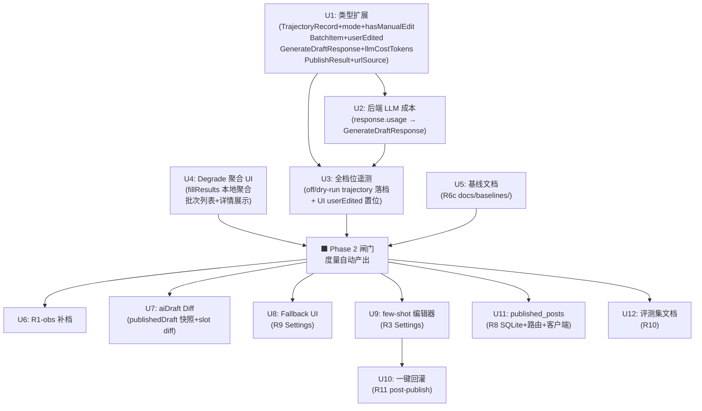

# feat: Phase 2 — Learning & Measurement Foundation

## Overview

阶段 1 首飞完成，基本链路成立。Phase 2 建立度量与学习地基，目标是让「直发率 / degrade 率 / 每篇成本」三个指标自动产出，并建立 few-shot 学习闭环基础设施，为 Phase 3 质量提升奠定可度量的基准。

执行顺序：**闸门优先** — U1-U5（类型扩展 + 度量落地 + 基线文档）通过阶段 2 闸门后，再执行 U6-U12（首飞补档 + 学习工具 + 注册表）。

## Problem Frame

当前三个结构性盲区（见 origin 文档 Problem Frame 节）：
1. **度量缺失**：trajectory 仅 authorized 档位落档；`response.usage` 完全被丢弃（`llm.ts:206`）
2. **学习闭环断裂**：few-shot 无结构化 UI；改稿数据永久丢失；无一键回灌路径
3. **首飞观察项未入档**：影响 Phase 3/4 方案的五项实证结论仍在人脑中

## Requirements Trace

- R6a. 全档位度量落档（三档均写 trajectory，含 `hasManualEdit` + `llmCostTokens`）
- R6b. 每篇 LLM 成本计量（从 `response.usage` 提取；不可得时字符估算）
- R6c. 直发率基线判定规则成文（`docs/baselines/direct-publish-rate.md`）
- R7. 批次级 degrade/fillResults 汇总（扩展本地聚合，degrade 批次方有显示）
- R1-obs. 首飞五项观察项补档
- R5b. `publishedDraft` 快照 + slot-level diff 落 trajectory
- R9. fallbackModel Settings UI 字段
- R3. few-shot 可视化编辑器（结构化卡片替换自由文本）
- R11. 一键「存为 few-shot 范例」按钮（L2 人在环）
- R8. `published_posts` SQLite 表 + 路由 + 扩展客户端

## Scope Boundaries

- 不做交互式趋势图 / 预测模型报表；批次级 degrade 汇总条（U4）和基线规则文档（U5）属必交付，不是「报表」
- R8 V1 只做注册表写入 + 基础查重查询，不做回访健康监控（Phase 4 R24）；因采用 best-effort 写入，Phase 4 R21 查重若后端记录缺失应 fallback 到本地 trajectory scan（Phase 4 规划时须处理此 fallback）
- `hasManualEdit` 用 UI 置位标记，不依赖 R5b slot-level diff
- R7 degrade 汇总仅在批次进入 `done` 阶段后显示（防 pre-approval 误导数据）
- R10 评测集为纯文档任务，不交付程序化评分脚本

## Context & Research

### Relevant Code and Patterns

| 文件 | 作用 |
|------|------|
| `packages/extension/lib/batch-orchestrator.ts:248–262` | authorized-only trajectory 落档（`!result.dryRun` 守卫） |
| `packages/extension/lib/trajectory.ts` | `appendTrajectory()` + `TrajectoryRecord` 类型 |
| `packages/extension/lib/batch.ts:28–42` | `BatchItem` 接口（当前无 `aiDraft`；`draft` 是 AI 草稿） |
| `packages/extension/lib/fillers.ts` | `fillDraft()` → `FieldFillResult[]`；degrade 触发：select/checkbox 无匹配 |
| `packages/extension/lib/storage.ts:74` | `spread-merge` 模式：读 storage 时 DEFAULT_SETTINGS 自动回填缺失字段 |
| `packages/backend/src/llm.ts:206–212` | `response.usage` 被完全丢弃（只取 `choices[0].message.content`） |
| `packages/backend/src/scraper/pending-db.ts` | SQLite 初始化 + migrations runner |
| `packages/backend/src/migrations/runner.ts` | 迁移基础设施；现有 001 (pending_topics) + 002 (config_store) |
| `packages/extension/entrypoints/sidepanel/Settings.tsx:169` | 待替换的 `fewShotExamples` textarea |
| `packages/shared/src/types.ts:6–9` | `FewShotPair = { input: string; output: string }` 已定义 |
| `packages/shared/src/types.ts:92–101` | `Settings` 接口：`fewShotPairs?: FewShotPair[]` 字段已存在 |

### Institutional Learnings

- **SQLite 半成品陷阱**：batch/prompt 曾尝试 SQLite 迁移因 `getDb()` 测试环境报错被整体回退。R8 必须挂靠现有 `migrations/runner.ts` 体系，测试走 `src/test-setup.ts` 的 `PUBLISHER_DATA_DIR` 隔离。详见 `docs/plans/2026-06-10-002-fix-stabilize-first-flight-security-plan.md`
- **fewShotPairs 双字段并行**：保存时从 `fewShotPairs` 派生 `fewShotExamples` 字符串写两个字段；后端 prompt-store 消费 `fewShotExamples`，不感知变化。详见 `docs/plans/2026-06-09-002-feat-capability-upgrade-prompt-pending-fewshot-plan.md`
- **度量权威域 = 扩展本地**：后端双写是 best-effort，R7 聚合在扩展侧执行
- **扩展 fetch 标准模式**：`authHeaders()` + `handleUnauthorized()` + `withBackendSync(localSave)` 三件套

## Key Technical Decisions

1. **`hasManualEdit` = UI 置位，非 diff 计算**
   新增 `BatchItem.userEdited?: boolean`；批次审读 UI 中任何字段变更触发 onChange → 置 `true`；`approveBatch` 读 `item.userEdited ?? false` 作为 trajectory 的 `hasManualEdit` 字段。R5b 的 slot-level diff 是后闸门补充，不阻塞本字段落地。

2. **off/dry-run 落档点 = 生成/填充阶段完成后**
   - `off` 模式：fill 完成后（不论成功或失败）写 trajectory，status = `fill-completed` / `fill-failed`
   - `dry-run` 模式：在现有 `!result.dryRun` 判断外，另补 `else` 分支写 trajectory，status = `dry-run-completed`
   - `authorized` 模式：现有落档路径不动，补充 `hasManualEdit` 和 `llmCostTokens` 字段
   - 同一 `item.id` 允许多条 trajectory 记录（append-only，基线计算取最新记录）
   - `trajectory.ts` 暴露 `recordStageEvent(item, stage, mode, extras)` helper，让 orchestrator 调用语义动词而非内联 `appendTrajectory` 三次，减少散射耦合

3. **degrade 统计分母 = 有 `fillResults` 的条目数**
   批次列表徽章和批次详情汇总仅在批次 `batchPhase === 'done'` 后出现，分母为 `items.filter(i => i.fillResults?.length)` 的长度，避免 pre-approval 误导。「高频降级字段」= 按 `FieldFillResult.field` 名聚合，不解析 `note` 自由文本。

4. **R3 freetext 迁移 = 导入 banner（无 dismissal tracking）**
   Settings 加载时 `fewShotExamples` 非空 且 `fewShotPairs` 为空 → 显示 banner。点导入 → 按 `\n\n` 分割，取前 8 块（超出提示截断），每块作为 `output`，`input` 置空，预填卡片供人工补全。用户保存后 `fewShotPairs` 非空，banner 不再出现。关闭 banner 不追加 dismissal 标记；只要条件满足则显示。

5. **保存结构化编辑器 = 双写（`fewShotPairs` 为 canonical source）**
   `handleSave` 中由 `fewShotPairs` 推导 `fewShotExamples`（格式保持现有约定），两字段同时写入 `chrome.storage.local` 和后端 prompt-store。旧 `fewShotExamples` 值由派生值覆盖，后续不再人工维护。**不变式**：`fewShotPairs` 是唯一权威来源；`fewShotExamples` 是只写派生字段，供后端 prompt-store 消费。后端 prompt-store 不独立修改 `fewShotExamples`（只读取扩展写入的值），因此不存在外部覆盖风险。

6. **R11 few-shot input 内容 = topic + serialized facts（匹配 prompt 注入格式）**
   `FewShotPair.input` = `item.topic` + `\n` + facts 块序列化（key: value 格式，与 `post-assembler.ts` 注入 facts 的格式保持一致）。`output` = `ContentDraft.body`。实现时验证实际 prompt 模板中 user message 的格式，确保 input 结构匹配。

7. **R11 达 8 条上限 = 阻止 + toast，不 FIFO 自动淘汰**
   点击「存为范例」时若 `fewShotPairs.length >= 8`，显示 toast 警告「范例已满（8/8），请先在设置中删除旧条目」，不写入。成功写入时显示 5 秒可撤销 toast；撤销 = 移除刚追加的最后一条（不影响其他条目）。

8. **R8 `published_posts` SQLite 设计**
   - 挂靠 `packages/backend/src/migrations/`，新增 `003-published-posts.sql`
   - `source_title` 建普通 INDEX（非 UNIQUE），允许同一 source_title 多次发布
   - `publish_url_source` 枚举：`from_save | derived_id | not_available`
   - `PublishResult` 类型（shared/extension）新增 `urlSource` 字段，供 R8 写入时准确赋值
   - 写入为 best-effort（`withBackendSync` 模式）；本地 trajectory 为 source of truth

## Open Questions

### Resolved During Planning

- **R7 degrade 显示位置**：批次列表行 compact 徽章（有降级的条目数/总条目数）+ 批次详情顶部汇总条（每篇 N/M 字段降级 + top 5 高频降级字段）；仅 `batchPhase === 'done'` 后显示
- **R3 banner 关闭行为**：无 dismissal 存储标记；关闭后条件仍满足时下次仍显示（提醒未迁移数据）
- **R3 >8 块截断**：截取前 8 块 + 显示警告「检测到 N 个范例块，已截取前 8 条，请检查并补全」
- **R11 8 条上限行为**：阻止写入 + toast 提示；不自动 FIFO
- **R8 POST 保障级别**：`withBackendSync` 模式（best-effort），本地 trajectory 永不依赖后端成功
- **R8 `source_title` 约束**：普通 INDEX，查询端去重，不用 UNIQUE constraint
- **`urlSource` 来源建模**：在 `PublishResult` 加 `urlSource` 字段，`publish.ts:62` 的 `extractUrl` 返回带来源的结果

### Deferred to Implementation

- **`response.usage` 字段名**：不同代理端点字段名可能不同（`prompt_tokens` vs `inputTokens`）；实现时检查实际端点响应并加字段名映射
- **off 模式 fillResults 可用性**：off 模式 `approveBatch` 是否有 fillResults — 依实际代码确认；不可得时落空 fillResults
- **R5b diff 触发提示阈值**：改了 ≥1 个槽位即弹「存为范例」提示（初期建议值，实现时可调）
- **R3 few-shot cards 排序交互**：优先实现固定顺序 + 上下移按钮；拖拽排序为可选升级
- **R11 input 格式验证**：实现时对照 `post-assembler.ts` + 背景脚本的 prompt 构造代码，确认 input 序列化格式与 LLM 收到的 user message 结构一致

---

## High-Level Technical Design

> *本图说明整体方案形态，是方向性指引，不是实现规范。实现时以 Approach 节为准。*



---

## Implementation Units

### 闸门优先组

---

- [ ] **U1: 类型扩展**

**Goal:** 为 Phase 2 所有度量字段在类型系统中建模，确保 TypeScript 编译时约束。

**Requirements:** R6a, R6b, R5b（部分）, R8

**Dependencies:** 无

**Files:**
- Modify: `packages/extension/lib/trajectory.ts` — 扩展 `TrajectoryRecord`
- Modify: `packages/extension/lib/batch.ts` — 扩展 `BatchItem`
- Modify: `packages/shared/src/types.ts` — 扩展 `GenerateDraftResponse` 和 `PublishResult`（若在 shared）；或修改 backend 中对应响应类型
- Test: `packages/extension/lib/trajectory.test.ts`（若存在），`packages/shared/src/types.test.ts`（若有类型测试）

**Approach:**
- `TrajectoryRecord` 新增：`mode: 'off' | 'dry-run' | 'authorized'`；`hasManualEdit?: boolean`；`llmCostTokens?: { prompt: number; completion: number }`；`generationDurationMs?: number`。所有新字段为可选以保持现有记录向后兼容
- `BatchItem` 新增：`userEdited?: boolean`（UI 置位，发布前读取）；`llmCostTokens?: { prompt: number; completion: number }`（generation 时写入）；`publishedDraft?: ContentDraft`（R5b 用，此处只建模）
- `GenerateDraftResponse`（backend → extension 的 ok 响应）新增：`llmCostTokens?: { prompt: number; completion: number }`
- `PublishResult` 新增：`urlSource: 'from_save' | 'derived_id' | 'not_available'`；若该类型在 extension/publish.ts，则仅改 extension 包

**Patterns to follow:**
- `packages/extension/lib/batch.ts` 现有接口扩展模式
- `packages/shared/src/types.ts` 新字段均加 `?` optional 保持向后兼容

**Test scenarios:**
- `Test expectation: none — pure type definitions, validated by tsc compile pass`

**Verification:**
- `pnpm compile`（workspace 全量类型检查）零错误
- `pnpm test` 不引入新失败（existing trajectory 测试仍通过）

---

- [ ] **U2: 后端 LLM 成本提取**

**Goal:** 从 LLM 响应的 `response.usage` 中提取 token 用量，携带在 `GenerateDraftResponse` 中返回给扩展。

**Requirements:** R6b

**Dependencies:** U1（`GenerateDraftResponse` 类型已扩展）

**Files:**
- Modify: `packages/backend/src/llm.ts:206–212` — 提取 usage 字段
- Modify: `packages/backend/src/types.ts` 或 `packages/shared/src/types.ts` — `GenerateDraftResponse` 新字段（已在 U1 建模）
- Test: `packages/backend/src/llm.test.ts`（若存在）

**Approach:**
- 在 `extractContent(raw)` 调用后，从 `(raw as any).usage` 提取 `prompt_tokens` 和 `completion_tokens`（或端点实际字段名）
- 若字段缺失（端点未返回 usage）：`llmCostTokens` 置 `undefined`；在响应体中加 `llmCostEstimated: true` 标记——按 response content 字符数估算 token（1 token ≈ 4 chars 作为保守估算，标注「估算」）
- 将 `llmCostTokens`（和估算标记）追加到现有 `ok: true` 响应体中返回

**Patterns to follow:**
- `packages/backend/src/llm.ts` 现有 JSON 解析和响应构造模式

**Test scenarios:**
- Happy path: 模拟 LLM 响应含 `{ usage: { prompt_tokens: 100, completion_tokens: 200 } }` → `llmCostTokens = { prompt: 100, completion: 200 }`，`llmCostEstimated` 为 falsy
- Edge case: LLM 响应无 `usage` 字段 → `llmCostTokens` 为 undefined，`llmCostEstimated = true`，成本按正文字符数估算
- Edge case: LLM 响应的 usage 字段名与常见不同（如 `input_tokens`）→ 字段名映射后正确提取
- Error path: JSON 解析失败 → 现有错误路径不变，usage 提取不影响错误传播

**Verification:**
- `pnpm test --filter publisher-backend`（后端单测全绿）
- 手动调用 generate-draft 端点，检查响应体含 `llmCostTokens` 字段

---

- [ ] **U3: 全档位遥测落档 + userEdited UI 置位**

**Goal:** 使 off/dry-run 模式在生成/填充完成后写 trajectory；authorized 模式补充 `hasManualEdit` 和 `llmCostTokens` 字段；批次审读 UI 跟踪操作者是否改稿。

**Requirements:** R6a, R6b（消费 U2 成果）

**Dependencies:** U1（类型），U2（后端返回 llmCostTokens）

**Files:**
- Modify: `packages/extension/lib/batch-orchestrator.ts` — 补 off/dry-run 落档点；authorized 路径补字段
- Modify: `packages/extension/lib/trajectory.ts` — `TrajectoryInput` 新增 `mode` + `hasManualEdit` + `llmCostTokens` 参数
- Modify: `packages/extension/entrypoints/sidepanel/` 中负责批次审读/草稿编辑的组件 — 任何字段 onChange 置 `BatchItem.userEdited = true`
- Test: `packages/extension/lib/batch-orchestrator.test.ts`

**Approach:**
- 在 `appendTrajectory` 调用处（`batch-orchestrator.ts:251`）补充 `mode` 参数，authorized 路径传 `'authorized'`
- 在 `!result.dryRun` 判断的 `else` 分支（dry-run 路径）新增 `appendTrajectory` 调用，status = `'dry-run-completed'`，`fillResults` 传 dryRun 的 fill 结果（若可得），`hasManualEdit` = undefined
- off 模式：找到 fill 完成（含 fill-failed）的代码分支，新增 `appendTrajectory`，status = `'fill-completed'` / `'fill-failed'`
- authorized 路径：在现有 `appendTrajectory` 调用中追加 `hasManualEdit: item.userEdited ?? false` 和 `llmCostTokens: item.llmCostTokens`
- 批次审读 UI：在草稿字段（title/body 等）的 onChange handler 中调用 `updateBatchItem(id, { userEdited: true })`（或等效的 setter），仅在 `userEdited` 为 false 时置位（避免重复 setState）
- generation 完成时：从 `GenerateDraftResponse.llmCostTokens` 读取，写入 `BatchItem.llmCostTokens`（在 background.ts 或 batch-orchestrator 的生成回调中）

**Patterns to follow:**
- `batch-orchestrator.ts:248–262` 现有 appendTrajectory 调用模式
- 批次 UI 组件现有 onChange/update 模式

**Test scenarios:**
- Happy path (off mode): 生成 + 填充完成 → trajectory 记录存在，`mode='off'`，`hasManualEdit` 为 undefined，`llmCostTokens` 已填
- Happy path (dry-run): 生成 + dry-run fill → trajectory 记录，`mode='dry-run'`，`status='dry-run-completed'`
- Happy path (authorized, no edit): approve 不改稿直接发布 → trajectory `hasManualEdit=false`，`llmCostTokens` 已填
- Happy path (authorized, with edit): 批次审读中修改 title → `userEdited=true` → trajectory `hasManualEdit=true`
- Edge case (off, fill-failed): fill 某字段报错 → trajectory 仍写入，`status='fill-failed'`，`fillResults` 含错误详情
- Edge case (no usage returned): `llmCostTokens` 为 undefined → trajectory 记录该字段为 undefined（不报错）
- Integration: authorized 发布仍正常完成，现有 authorized 测试全绿

**Verification:**
- `pnpm test --filter publisher-fill-assistant`（扩展单测全绿）
- 手动跑 off 模式一批 → `chrome.storage.local` 中确认 trajectory 数组新增 off 记录
- 改稿后发布 → trajectory 记录 `hasManualEdit=true`

---

- [ ] **U4: 批次 degrade 聚合 UI**

**Goal:** 在批次列表和批次详情两处展示 degrade 统计，数据从扩展本地 `fillResults` 计算。

**Requirements:** R7

**Dependencies:** 无（数据已就位）

**Files:**
- Create: `packages/extension/lib/degrade-stats.ts` — `aggregateDegradeStats(items: BatchItem[])` 工具函数
- Modify: 批次列表 UI 组件 — 添加 compact badge
- Modify: 批次详情 UI 组件 — 添加 degrade 汇总条
- Test: `packages/extension/lib/degrade-stats.test.ts`

**Approach:**
- `aggregateDegradeStats(items)` 返回：`{ itemsWithAnyDegrade: number, totalItemsWithResults: number, topFields: Array<{field: string, count: number}> }`；仅统计 `item.fillResults?.length > 0` 的条目；`topFields` 按降级次数降序取前 5，`field` 来自 `FieldFillResult.field`（非 note 文本）
- 批次列表：当 `batchPhase === 'done'` 且 `itemsWithAnyDegrade > 0` 时，渲染 `N 条降级` 橙色徽章（N = `itemsWithAnyDegrade`）
- 批次详情顶部：当 `batchPhase === 'done'` 时，渲染汇总条「本批次 M/K 条目有字段降级 | 高频：field1（3x）, field2（1x）...」；M = `itemsWithAnyDegrade`，K = `totalItemsWithResults`；无降级时展示「所有字段填充成功」
- 每个 BatchItem 卡片：「N/M 字段降级」inline 标注（M = 该条目 fillResults 总数，N = degraded 数）

**Patterns to follow:**
- `packages/extension/lib/` 现有纯函数工具模式
- 批次 UI 组件现有 badge / status 展示模式

**Test scenarios:**
- Happy path: 3 条 BatchItem，1 条有 `fillResults: [{field:'tags', status:'degraded'}, {field:'category', status:'ok'}]` → `{ itemsWithAnyDegrade: 1, totalItemsWithResults: 3, topFields: [{field:'tags',count:1}] }`
- Edge case: 所有 `fillResults` 为空 / undefined → `{ itemsWithAnyDegrade: 0, totalItemsWithResults: 0, topFields: [] }`
- Edge case: 批次 `batchPhase !== 'done'` → 批次列表不渲染 badge，批次详情不渲染汇总条
- Edge case: 2 条 BatchItem 无 fillResults，1 条有 → `totalItemsWithResults = 1`（分母不含无 fillResults 的条目）
- Happy path: 同一字段在 3 条 item 中均降级 → `topFields[0] = { field: 'tags', count: 3 }`

**Verification:**
- `pnpm test --filter publisher-fill-assistant`（degrade-stats 测试全绿）
- 手动运行一批 → 批次详情顶部显示正确汇总

---

- [ ] **U5: 直发率基线规则文档**

**Goal:** 成文「直发率」的计法规则，使 Phase 3 的质量改进有可比基准。

**Requirements:** R6c

**Dependencies:** U3（hasManualEdit 字段落地后，规则才有操作化依据）

**Files:**
- Create: `docs/baselines/direct-publish-rate.md`

**Approach:**
- 文档需明确：① 基线样本量（建议：累计 ≥10 篇 authorized 发布且跨 ≥3 批次）；② 观察窗（建议：最近 30 天或最近 50 篇，取先到）；③ 「直发」定义 = `hasManualEdit === false`（UI 未置位 userEdited）；④ `hasManualEdit` 为 `undefined` 的记录（pre-Phase 2 发布）不计入基线；⑤ 标题候选切换不计入「改稿」（不触发 `userEdited`）；⑥ 阶段工作流变更（如 Phase 3 引入自评重写）时基线重置并注明重置时间；⑦ trajectory 同一 `item.id` 多条记录时取最新记录（避免重试导致重计）

**Test scenarios:**
- `Test expectation: none — documentation artifact, not code`

**Verification:**
- `docs/baselines/direct-publish-rate.md` 文件存在，包含上述 7 项规则

---

### 后闸门组

---

- [ ] **U6: 首飞观察项补档（R1-obs）**

**Goal:** 将首飞中的五项关键观察结论记录到 run-sheet，消除后续阶段规划依赖「尚不确定」的备注。

**Requirements:** R1-obs

**Dependencies:** 无（纯文档，但需要操作者提供观察结论）

**Files:**
- Modify（若不存在则新建）: `docs/run-sheet-首飞与基线.md` — 填写空白回填表中的五项观察

**Approach:**
- 操作者需提供（或可从首飞过程中查看）五项结论：① cover_url 字段类型（hidden URL input vs file upload）；② admin session 实际寿命；③ status=0 隐藏帖在未登录前台的可访问性；④ save 响应是否携带前台 URL；⑤ 帖子对外时间戳行为
- 结论写入对应的表格行，并注明「实证来源：首飞 2026-06-10/11，ID 121 或具体帖 URL」
- 若某项观察未能在首飞中确认，注明「待二次核实」及计划核实时间

**Test scenarios:**
- `Test expectation: none — documentation task`

**Verification:**
- run-sheet 空白回填表五行均有内容（或标注「待核实」）

---

- [ ] **U7: aiDraft 快照 + slot-level diff（R5b）**

**Goal:** 在发布确认时保存 AI 原稿快照，计算 slot-level 编辑差异，并落 trajectory。

**Requirements:** R5b

**Dependencies:** U1（`BatchItem.publishedDraft` 类型已建模），U3（trajectory 落档已扩展）

**Files:**
- Modify: `packages/extension/lib/batch-orchestrator.ts` — 生成完成时快照 `aiDraft` 到 `BatchItem.publishedDraft`；`approveBatch` 时计算 diff
- Create: `packages/extension/lib/draft-diff.ts` — `computeSlotDiff(aiDraft: ContentDraft, finalDraft: ContentDraft): SlotDiff`
- Modify: `packages/extension/lib/trajectory.ts` — `TrajectoryRecord` 接受 `slotDiff?: SlotDiff`
- Test: `packages/extension/lib/draft-diff.test.ts`

**Approach:**
- 生成完成后（background.ts 写 BatchItem.draft 时），同时写 `BatchItem.publishedDraft = deepCopy(draft)`（快照时刻，不随后续编辑变化）
- `computeSlotDiff` 逐字段对比 `aiDraft` 和 `finalDraft`，返回 `{ changedSlots: string[], totalSlots: number }`
- diff 结果与 trajectory 记录一起写入（authorized 路径），供 R11 回灌提示阈值判断（≥1 个 changedSlot 即触发「存为范例」提示）
- `publishedDraft` 字段对 pre-Phase 2 的 BatchItem 为 undefined；diff 函数对 aiDraft 为 undefined 时返回 `{ changedSlots: [], totalSlots: 0, unknown: true }`

**Patterns to follow:**
- `packages/extension/lib/batch.ts` 现有 BatchItem 更新模式

**Test scenarios:**
- Happy path: aiDraft title = 「A」，finalDraft title = 「B」，body 相同 → `changedSlots = ['title']`，`totalSlots = N`
- Happy path: aiDraft === finalDraft (no changes) → `changedSlots = []`
- Edge case: `aiDraft` 为 undefined → `{ changedSlots: [], totalSlots: 0, unknown: true }`，不报错
- Edge case: ContentDraft 含嵌套字段（若有）→ 逐顶层字段对比，不深度比较嵌套
- Integration: authorized 发布后 trajectory 记录含 `slotDiff`，`hasManualEdit` 与 `changedSlots.length > 0` 一致（一致性验证）

**Verification:**
- `pnpm test --filter publisher-fill-assistant`（draft-diff 测试全绿）
- 发布改稿后的帖子 → trajectory 记录 `slotDiff.changedSlots` 列出改动字段

---

- [ ] **U8: Fallback LLM 端点 Settings UI（R9）**

**Goal:** 在 Settings 面板中提供 fallbackModel 配置入口（端点 URL + 模型名）。

**Requirements:** R9

**Dependencies:** 无

**Files:**
- Modify: `packages/extension/entrypoints/sidepanel/Settings.tsx` — 新增 fallbackModel 输入区
- Modify: `packages/extension/lib/storage.ts` 的 `DEFAULT_SETTINGS`（若 `fallbackModel` 未有默认值）

**Approach:**
- 在 Settings 表单中新增「备用 LLM 端点」可折叠区（默认收起），含两个输入框：fallback 端点 URL 和 fallback 模型名
- 保存时写入 `Settings.fallbackModel`（类型已在 `shared/src/types.ts:92` 存在）
- 清空时写 `undefined`（后端 `llm.ts` 的 fallback 逻辑已处理 undefined：不走 fallback）
- 不需要修改后端逻辑（fallback 路径已就位）

**Patterns to follow:**
- Settings.tsx 现有输入字段的保存/读取模式

**Test scenarios:**
- Happy path: 输入 fallback URL + model name → 保存 → `Settings.fallbackModel` 更新
- Edge case: 清空 fallback URL → 保存 → `Settings.fallbackModel` 变为 undefined / null
- Edge case: 只填 URL 不填 model name → 应当仍可保存（model name 可选，后端已有默认值）

**Verification:**
- Settings 面板显示 fallback 输入区；保存后 `chrome.storage.local` 中 fallbackModel 字段正确

---

- [ ] **U9: few-shot 可视化编辑器（R3）**

**Goal:** 将 Settings 中的 `fewShotExamples` 自由文本替换为结构化卡片列表（FewShotPair []），支持增删改，保存时双写。

**Requirements:** R3

**Dependencies:** 无（类型脚手架已就位）

**Files:**
- Create: `packages/extension/entrypoints/sidepanel/components/FewShotPairEditor.tsx` — 卡片列表组件
- Modify: `packages/extension/entrypoints/sidepanel/Settings.tsx:169` — 替换 textarea 为 FewShotPairEditor
- Test: `packages/extension/entrypoints/sidepanel/components/FewShotPairEditor.test.tsx`

**Approach:**
- `FewShotPairEditor` props：`pairs: FewShotPair[]; onChange: (pairs: FewShotPair[]) => void`
- 每张卡片：input textarea（标签「输入上下文」）+ output textarea（标签「范例输出」）+ 删除按钮；卡片间有上移/下移按钮
- 底部「添加范例」按钮；当 `pairs.length >= 8` 时 disabled 并显示「已达上限（8/8），请先删除旧条目」
- **导入 banner**：Settings 组件加载时，若 `settings.fewShotExamples` 非空 且 `settings.fewShotPairs.length === 0`，在编辑器上方显示 banner「检测到旧格式范例，点击导入→结构化编辑器」；点击导入：按 `\n\n` 分割，取前 8 块（超出显示警告「检测到 N 块，已截取前 8 条，请检查并补全 input 字段」），每块作为 output，input 置空字符串，pre-fill 卡片
- **保存时双写**：`handleSave` 中将 `fewShotPairs` 序列化为 `fewShotExamples` 字符串（格式：每条 `input\n---\noutput`，条间 `\n\n` 分隔，与后端 prompt-store 消费格式对齐），两字段同时写 `chrome.storage.local` 和后端

**Patterns to follow:**
- Settings.tsx 现有组件结构和 `handleSave` 流程
- `packages/shared/src/types.ts:6–9` `FewShotPair` 类型

**Test scenarios:**
- Happy path: 添加一张卡片 (input='A', output='B') → `pairs = [{input:'A',output:'B'}]`
- Happy path: 删除卡片 → pairs 缩短
- Happy path: 8 张卡时「添加」按钮 disabled
- Happy path: 保存 3 对 pairs → `fewShotPairs` 和 `fewShotExamples` 均更新（派生格式验证）
- Edge case (import banner): `fewShotExamples='block1\n\nblock2'`，`fewShotPairs=[]` → banner 显示；点导入 → 2 张预填卡（input 空，output 分别为 'block1'/'block2'）
- Edge case (>8 import): `fewShotExamples` 按 `\n\n` 分成 10 块 → 导入截取前 8 + 显示截断警告
- Edge case (banner 不显示): `fewShotPairs` 非空 → 不显示 banner
- Edge case: 上移第一张 / 下移最后一张 → 按钮 disabled

**Verification:**
- `pnpm test --filter publisher-fill-assistant`（FewShotPairEditor 测试全绿）
- Settings UI 可见结构化卡片；保存后 `chrome.storage.local` 双字段正确

---

- [ ] **U10: 一键存为 few-shot 范例（R11）**

**Goal:** 在发布确认后提供「存为 few-shot 范例」按钮，L2 人在环操作即时生效可撤销。

**Requirements:** R11

**Dependencies:** U9（FewShotPairEditor 已落地；保存路径已建立），U7（可选：如果 slotDiff 可得，触发提示）

**Files:**
- Modify: 批次发布确认后的 UI 组件（BatchItem 卡片的 post-publish 状态视图）— 添加按钮
- Modify: `packages/extension/lib/storage.ts` 或 few-shot 相关存储函数 — `addFewShotPair(pair)` 工具

**Approach:**
- 在 `status = 'published'` 的 BatchItem 卡片底部添加「存为范例 💡」按钮（仅发布后状态可见）
- 点击时：① 若 `fewShotPairs.length >= 8` → 显示 toast「范例已满（8/8），请先在设置中删除旧条目」，不写入；② 否则构建 `FewShotPair`：`input` = 序列化的 `item.topic + '\n' + formatFacts(item.facts)`（格式对照实际 prompt 中 user message 构造逻辑），`output` = `item.draft.body`；写入 `fewShotPairs` + 派生更新 `fewShotExamples`；显示 5 秒可撤销 toast「已保存为范例 [撤销]」
- 撤销 = 移除刚追加的最后一条 `fewShotPairs`（LIFO，安全：不影响其他条目）；写回 storage
- U7 集成（可选）：若 `item.slotDiff?.changedSlots.length > 0`（有改稿）且用户未在 5 秒内撤销，在撤销 toast 消失后额外提示「你改了 N 个字段，这个版本更适合作为范例」（轻提示，不强制）

**Patterns to follow:**
- Settings.tsx 的 `saveSettings` 模式（保存 + 后端同步）
- 扩展 toast 通知现有模式

**Test scenarios:**
- Happy path: fewShotPairs 5 条，点击「存为范例」→ fewShotPairs 变为 6 条，toast 出现
- Happy path: 点撤销 → fewShotPairs 恢复 5 条
- Edge case: fewShotPairs 8 条满，点击「存为范例」→ toast 警告，pairs 不变
- Edge case: item.facts 为 undefined → input 只含 topic，不报错
- Integration: 保存后 `chrome.storage.local` 的 `fewShotPairs` 和 `fewShotExamples` 均更新

**Verification:**
- 发布后 BatchItem 卡片显示按钮；点击后 Settings → few-shot 编辑器可见新增条目

---

- [ ] **U11: published_posts SQLite 注册表（R8）**

**Goal:** 后端建立可查询的已发布帖登记，扩展在发布确认时写入；支持按 `source_title` 查重。

**Requirements:** R8

**Dependencies:** U1（`PublishResult.urlSource` 类型），U3（authorized 发布流程）

**Files:**
- Create: `packages/backend/src/migrations/003-published-posts.sql`
- Modify: `packages/backend/src/scraper/pending-db.ts` — 暴露 `getPublishedPostsDb()` 或复用 `getPendingDb()`（同一 db 文件，新表）
- Create: `packages/backend/src/published-posts-routes.ts` — REST 路由
- Modify: `packages/backend/src/index.ts` — 注册新路由
- Create: `packages/extension/lib/published-posts-client.ts` — 扩展写入客户端
- Modify: `packages/extension/lib/batch-orchestrator.ts` — authorized 发布后调用 `recordPublishedPost()`
- Test: `packages/backend/src/published-posts-routes.test.ts`

**Approach:**
- `003-published-posts.sql`：
  ```sql
  CREATE TABLE IF NOT EXISTS published_posts (
    id TEXT PRIMARY KEY,
    batch_item_id TEXT NOT NULL,
    source_title TEXT NOT NULL,
    publish_url TEXT,
    publish_url_source TEXT NOT NULL DEFAULT 'not_available',
    published_at TEXT NOT NULL,
    outcome TEXT DEFAULT 'unknown',
    created_at TEXT NOT NULL
  );
  CREATE INDEX IF NOT EXISTS idx_published_posts_source_title ON published_posts(source_title);
  ```
- 路由（均需 JWT 鉴权）：
  - `POST /api/v1/published-posts` — 写入一条记录
  - `GET /api/v1/published-posts` — 列表（分页，`?limit=50&offset=0`）
  - `GET /api/v1/published-posts?source_title=X` — 按 source_title 查重（R21 消费）
- `publish_url_source` 来自 `PublishResult.urlSource`（U1 建模）；`publish.ts:62` 的 `extractUrl` 需返回带 urlSource 的结果
- 扩展客户端（`published-posts-client.ts`）遵循 `authHeaders()` + `withBackendSync(localSave)` 模式；localSave = 无本地等效存储（仅远程记录，失败吞噬，trajectory 是本地 source of truth）
- 测试：`src/test-setup.ts` 的 `PUBLISHER_DATA_DIR` 已指向临时目录，确保新表走同一隔离路径

**Patterns to follow:**
- `packages/backend/src/scraper/pending-db.ts` + `migrations/runner.ts` 现有 SQLite 初始化模式
- `packages/backend/src/*-routes.ts` 现有路由注册和 JWT preHandler 模式
- `packages/extension/lib/batch-sync.ts` 的双写包装模式（`withBackendSync`）

**Test scenarios:**
- Happy path: `POST /api/v1/published-posts` 含完整字段 → 201 Created，记录存入
- Happy path: `GET /api/v1/published-posts?source_title=某作品` → 返回该 source_title 的所有记录
- Edge case: `publish_url = null`，`publish_url_source = 'not_available'` → 写入成功，不报错
- Error path: 缺少 JWT → 401 Unauthorized
- Error path: 缺少必填字段（`source_title` 为空）→ 400 Bad Request
- Integration: 扩展客户端调用 POST 后 GET 可查到对应记录；后端不可达时本地 trajectory 仍成功写入（best-effort 验证）
- Test isolation: 运行测试不碰真实 `pending.db`（PUBLISHER_DATA_DIR 指向临时目录）

**Verification:**
- `pnpm test --filter publisher-backend`（published-posts-routes 测试全绿）
- authorized 发布后，`GET /api/v1/published-posts` 能查到新记录

---

- [ ] **U12: 评测金标准集文档（R10）**

**Goal:** 建立 10–20 条 golden topics 评测集和人工对照流程，为 Phase 3 prompt 改进提供可重复的评估手段。

**Requirements:** R10

**Dependencies:** 无

**Files:**
- Create: `docs/eval/golden-set.md` — golden topics 列表 + 对照流程说明

**Approach:**
- 从已发布帖中选 10–20 条代表性 topics（覆盖不同题材、不同 facts 完整度）
- 每条记录：`topic`、`facts 块`（脱敏处理）、`期望输出方向`（非逐字，而是「应覆盖的要点 + 口吻要求」）
- 附加「人工并排对照流程」：改 prompt 或换模型时，用相同 golden topics 各生成一次，逐条对照「覆盖要点 / 口吻 / 雷同度」三维打分（1-3 分），汇总比较
- 注明「程序化评分脚本为候选项，待变更频率证明需要再建，且首次建立需过人工判定效度检验」

**Test scenarios:**
- `Test expectation: none — documentation artifact`

**Verification:**
- `docs/eval/golden-set.md` 存在，含 ≥10 条 golden topics 和对照流程说明

---

## System-Wide Impact

- **Interaction graph:** trajectory 写入点从 1 处扩展到 3 处（off/dry-run/authorized），需确认无重复调用；`published_posts` 写入在 `approveBatch` 的 authorized 分支末尾，属于 publish 后事件
- **Error propagation:** off/dry-run trajectory 写入失败不应中断填充流程（参照现有 authorized 路径的错误处理）；`published_posts` POST 失败吞噬（`withBackendSync`）；本地 trajectory 写入失败仍应向上报错（与现有行为一致）
- **State lifecycle risks:** `BatchItem.userEdited` 重置时机 = item 进入 `generating` 状态时（不是 retry 初始化时）——这样可保留「retry 前已有改稿」的信号；`publishedDraft` 快照在生成后立即写入，之后不被业务逻辑修改
- **API surface parity:** `published_posts` 新路由须加入 JWT preHandler（与现有 `*-routes.ts` 一致），不能进 PUBLIC_ROUTES
- **Integration coverage:** U11 的端到端（扩展客户端 → 后端 API → SQLite → GET 查重）需要手动冒烟验证，单测只覆盖后端路由；U3 的 off/dry-run trajectory 落档需手动验证（扩展 E2E 测试不涵盖后台发布流程）
- **Unchanged invariants:** authorized 发布闸门链（grounding-gate + safety-gate + 零提交铁律）零变更；扩展 content script 不接触新增逻辑；`fewShotExamples` 字段对后端 prompt-store 的接口不变（通过双写维护）

## Risks & Dependencies

| 风险 | 缓解 |
|------|------|
| `response.usage` 字段名因代理端点不同而变化，成本提取失败 | 字段名映射兜底 + `llmCostEstimated` 降级标记；U2 实现时检查实际端点响应格式 |
| off 模式 `approveBatch` 无 `fillResults`，落档点不存在 | 实现时确认 off 模式代码路径；不可得时落空 fillResults，不报错 |
| `BatchItem.userEdited` 在 retry 场景下遗留 `true`，导致「改稿」误报 | U3 明确：item 进入 `generating` 状态时重置 `userEdited = false`（不在 retry 初始化时重置，以保留 retry 前的改稿信号） |
| SQLite 迁移 runner 在测试环境未被触发（历史教训） | U11 测试必须覆盖「migration 003 被执行」的 integration 场景；`test-setup.ts` 确认新表走临时目录 |
| fewShotPairs 保存后 `fewShotExamples` 派生格式与后端 prompt-store 期待格式不一致 | U9 实现时核对现有 `fewShotExamples` 被 prompt-store 消费的解析逻辑，确保派生格式兼容 |
| `publish.ts:62` `extractUrl` 改动影响现有发布流程 | U1 + U11 中 `urlSource` 字段添加为 optional；extractUrl 改动需通过现有 authorized 发布 E2E 验证 |

## Documentation / Operational Notes

- `docs/baselines/direct-publish-rate.md`：Phase 3 开始前应有 ≥10 篇 authorized 发布数据作为基线样本
- `docs/eval/golden-set.md`：内含脱敏 facts 块，提交前通过 `pnpm check:fixtures` 验证无机密
- 首飞观察项补档（U6）优先级：R8 `publishUrl` 策略、R19 封面方案均依赖其结论；建议 U6 与 U8-U12 并行完成

## Sources & References

- **Origin document:** [docs/brainstorms/2026-06-11-phase-2-learning-measurement-foundation-requirements.md](../brainstorms/2026-06-11-phase-2-learning-measurement-foundation-requirements.md)
- Related plan (SQL 迁移陷阱): `docs/plans/2026-06-10-002-fix-stabilize-first-flight-security-plan.md`
- Related plan (few-shot 类型脚手架): `docs/plans/2026-06-09-002-feat-capability-upgrade-prompt-pending-fewshot-plan.md`
- Related code: `packages/extension/lib/batch-orchestrator.ts:248–262`, `packages/backend/src/llm.ts:206–212`
- Related code: `packages/backend/src/migrations/runner.ts`, `packages/backend/src/scraper/pending-db.ts`
