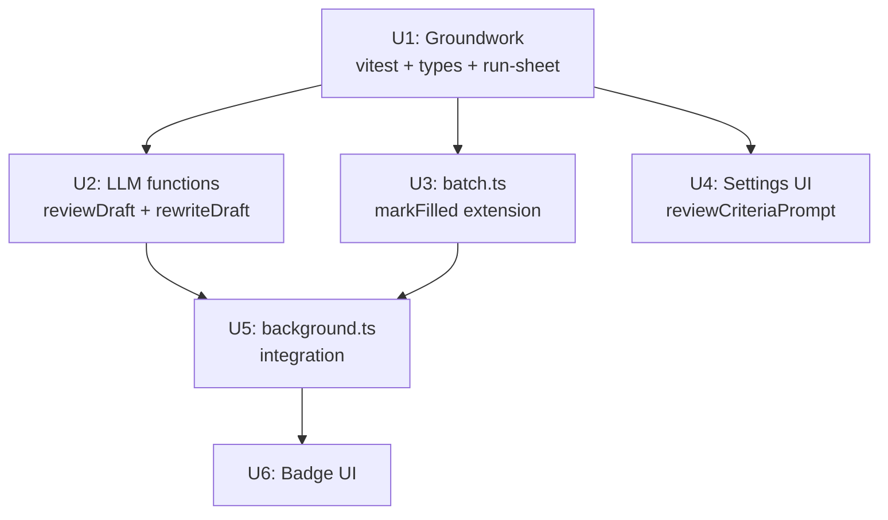

# feat: Phase 3 质量引擎 — AI 自评重写

## Overview

在草稿生成后增加一次 AI 评审 LLM 调用（四维打分），对不通过维度发起定向重写；操作者只看最终草稿，badge 轻量标注重写事实。同时修复 P0 测试失败（vitest 误扫 `packages/`）、补档首飞观察 run-sheet 模板，并在 Settings 中提供评审 criteria prompt 配置入口。

目标：草稿直发率（`hasManualEdit === false`）在 ≥10 篇 authorized 发布窗口内稳定达到 ≥70%。

## Problem Frame

Phase 2 建立了度量与学习地基（直发率追踪、few-shot 编辑器、trajectory 记录），但核心痛点未解决：AI 草稿四维质量普遍偏低（正文内容单薄、口吻/风格不对、标题不吸引、分类/标签错误），每条都需要大量手动改稿。Phase 3 在 `background.ts` 生成循环内插入评审→重写 pass，让操作者看到的草稿质量显著提升。（见 origin: docs/brainstorms/2026-06-11-phase-3-quality-engine-requirements.md）

## Requirements Trace

- R0-fix. vitest `packages/**` 排除，`pnpm test` 零失败
- R1. AI 二次评审：生成后第二次 LLM 调用，四维打分，全通过则原稿进队列，任一维度不通过则触发 R2
- R2. 定向重写：仅针对不通过维度，最多 1 次，重写结果白名单合并回草稿
- R3. 成本透明：`reviewCostTokens` 独立记录到 trajectory；`BatchItem.aiReviewTriggered?: boolean` 三态语义
- R4. badge UI：`aiReviewTriggered === true` 时显示「✦ 已自评优化」徽章；批次汇总显示 N 条已优化
- R5. 评审 prompt 可配置：`Settings.reviewCriteriaPrompt`，空时使用内置四维默认标准
- R6. run-sheet 模板：`docs/run-sheet-首飞与基线.md`，五项首飞观察结构化表格
- Success: `pnpm test` 零失败；`pnpm compile` 零错误；trajectory 中 `aiReviewTriggered` 可读；run-sheet 文件存在

## Scope Boundaries

- 不做自动发布；操作者仍需批准每批次（see origin）
- 不做 A/B prompt 框架；单一 prompt 优化循环
- R7（直发率仪表盘）和 R8（快捷键）延后到闸门通过后评估
- service worker keepalive（大 batch 超 30s timeout 风险）本阶段仅记录，不解决
- KILL_BATCH AbortSignal 传播至 reviewDraft/rewriteDraft 本阶段不解决

## Context & Research

### Relevant Code and Patterns

- **`lib/llm.ts`**：`generateDraft()` 调用链 — `buildRequest()` → `fetchFn()` → `extractContent()` → `parseContentJson()` → `toDraft()`；评审调用完全平行此路径。错误全部结构化返回 `{ ok: false, kind }` 不 throw。
- **`lib/batch.ts`**：`patchItem()` + `transition()` 不可变状态机；`markFilled(batch, id, draft, llmCostTokens?, genDurationMs?)` 接受 `['generating', 'queued']` 两个 from 状态。
- **`lib/trajectory.ts`**：`buildRecord()` 使用 optional-spread 模式添加可选字段（`...(input.x !== undefined ? { x: input.x } : {})`）；`canonical()` 中的哈希字段列表**不可扩展**，否则旧记录验证失败。
- **`entrypoints/background.ts`** 第 183–197 行：串行生成循环；Phase 3 评审调用插入 `gen.ok` 分支内、`markFilled` 之前。
- **`parseContentJson`**（`lib/llm.ts` module-private）：已处理 ` ```json ``` ` 围栏剥离；`parseReviewResult` 必须复用此逻辑。
- **`fallbackModel`**（`lib/types.ts` line 85）：`{ endpoint: string; model?: string }`，当前整个 codebase 无 call site，Phase 3 是第一个使用方。

### Institutional Learnings

- `canonical()` 哈希字段列表固定；新增 `reviewCostTokens`/`aiReviewTriggered` 到 `TrajectoryRecord` 时**不能**加入 `canonical()`。
- `generateDraft` 的 `llmCostTokens` 字段当前永远返回 `undefined`（`lib/llm.ts` 不提取 `response.usage`）；Phase 3 作为 llmCostTokens 修复的载体一并修复。
- 测试注入模式：`lib/llm.test.ts` 通过 `fetchFn` 参数 mock 网络调用；`lib/batch.test.ts` 直接对纯函数断言。

### External References

无需外部文档研究——本地已有完整调用模式可直接复用。

## Key Technical Decisions

- **markFilled 扩展（而非独立 markReviewed()）**：评审发生在 `generating` 状态期间，不需要独立状态节点；扩展 `markFilled` 签名加可选 `reviewMeta?` 参数实现原子写入，避免 `aiReviewTriggered` 写入时机竞态（spec flow gap 1a）。（see origin 架构决策 4）
- **aiReviewTriggered 四状态语义**：`undefined` = 评审未触发（fail-open 或 Phase 3 部署前）；`false` = 评审通过，无重写；`true` = 评审失败 + 重写**成功**；重写触发但失败视为 fail-open，同样设 `undefined`，确保 badge 只在真正改善时出现。
- **fallbackModel fail-open（不双重回退）**：fallbackModel 未配置 → 用 main endpoint；fallbackModel 配置了但失败 → fail-open，不回退 main endpoint。原因：避免双重计费和语义歧义；失败成本（丢失评审）低于双重调用成本。
- **rewrite 白名单合并**：`mergeRewriteResult(original, rewrite, failedDims)` 根据失败维度决定合并字段：`title_quality` → `title`；`body_richness` / `community_tone` → `body`；`category_accuracy` → `categories` + `tags`；`id`、`coverImageUrl`、`mediaId` 始终保留原草稿值。（see origin 架构决策 3）
- **4 维度 canonical 名称**：`body_richness`、`community_tone`、`title_quality`、`category_accuracy`；评审 prompt 要求 LLM 以这些名称返回结构化 JSON，确保 failedDims 字符串与合并白名单一致。
- **extractUsage 函数**：单独封装可测试函数，兼容 `usage.prompt_tokens`/`completion_tokens`（OpenAI 标准）和 `usage.inputTokens`/`outputTokens`（部分代理）两种格式；无法识别时返回 `undefined`（不是 `{ estimated: true }`），避免虚假数据。

## Open Questions

### Resolved During Planning

（见 Key Technical Decisions，所有设计分叉已在规划期闭合。）

### Deferred to Implementation

- **内置 default criteria prompt 文字**：四维打分标准具体文本需结合 `docs/eval/golden-set.md` 的「期望输出方向」制定；实现时从该文件取材。
- **extractUsage 字段名确认**：实际端点 `response.usage` 字段名在真实调用中确认（`prompt_tokens` vs `inputTokens`）。
- **service worker keepalive（大 batch 风险）**：Phase 3 每 item 处理延长约 5-9s，10+ item batch 有超 30s idle timeout 风险；记录到 TODOS.md，本阶段不解决。

---

## High-Level Technical Design

> *本图说明评审重写管道的意图形状，为方向性指导，不是实现规范。实现时以 Key Technical Decisions 和 Implementation Units 为准。*

```
handleRunBatch（每个 BatchItem 串行）
────────────────────────────────────────────────────────
markGenerating(batch, id)
  ↓
generateDraft(prompt, deps)
  ↓ ok
[Phase 3 插入]
  ↓
reviewDraft(draft, criteriaPrompt, reviewDeps)
  ├── ok: false  (网络/格式失败)
  │     → finalDraft = gen.draft
  │       aiReviewTriggered = undefined   [fail-open]
  │
  └── ok: true
        ├── all dims pass
        │     → finalDraft = gen.draft
        │       aiReviewTriggered = false
        │
        └── any dim fails
              ↓
          rewriteDraft(gen.draft, failedDims, rewriteDeps)
              ├── ok: false
              │     → finalDraft = gen.draft
              │       aiReviewTriggered = undefined
              │
              └── ok: true
                    → finalDraft = mergeRewriteResult(gen.draft, rewrite, failedDims)
                      aiReviewTriggered = true
  ↓
markFilled(batch, id, finalDraft, totalTokens, genDurationMs,
           reviewMeta: { triggered: aiReviewTriggered, reviewCostTokens })
────────────────────────────────────────────────────────
```

---

## Implementation Units



---

- [ ] **Unit 1: Groundwork — vitest 修复 + 类型地基 + run-sheet**

**Goal:** 让 `pnpm test` 零失败；建立 Phase 3 所有新类型；提供首飞观察模板。

**Requirements:** R0-fix, R3（类型部分）, R5（类型部分）, R6

**Dependencies:** 无

**Files:**
- Modify: `vitest.config.ts`
- Modify: `.gitignore`
- Modify: `lib/types.ts`（Settings + BatchItem）
- Modify: `lib/trajectory.ts`（TrajectoryRecord + TrajectoryInput + buildRecord）
- Create: `docs/run-sheet-首飞与基线.md`

**Approach:**
- `vitest.config.ts`：`exclude` 数组末尾追加 `'packages/**'`（单行改动）
- `.gitignore`：追加 `packages/` 条目（长期方案，防止后续意外追踪）
- `lib/types.ts`：
  - 新增 `ReviewResult` 类型：`{ ok: boolean; dimensions?: Array<{ name: string; pass: boolean; reason?: string }> }`（放在 `GenerateDraftResponse` 附近）
  - `BatchItem` 新增 `aiReviewTriggered?: boolean`（放在 `llmCostTokens` 后）
  - `Settings` 新增 `reviewCriteriaPrompt?: string`（放在 `fewShotPairs` 后）
- `lib/trajectory.ts`：
  - `TrajectoryRecord` + `TrajectoryInput` 各新增：`reviewCostTokens?: { prompt: number; completion: number; estimated?: boolean }` 和 `aiReviewTriggered?: boolean`
  - `buildRecord()` 用 optional-spread 模式透传两个新字段（参照 `llmCostTokens` 的处理方式，**不加入 `canonical()`**）
- `docs/run-sheet-首飞与基线.md`：建立 5 行观察表格（cover_url 类型、session 寿命、隐藏帖可见性、save 响应 URL、发布时间戳），每行含「待填」占位

**Patterns to follow:**
- `lib/trajectory.ts` 中 `llmCostTokens` 的 optional-spread 模式（第 106–108 行）
- `lib/types.ts` 中 `BatchItem` 现有可选字段列表（`lib/types.ts` ~36 行）

**Test scenarios:**
- Happy path: `buildRecord({ aiReviewTriggered: true, reviewCostTokens: {...} })` → record 包含两个新字段
- Edge case: `buildRecord({ aiReviewTriggered: undefined })` → record 不含 `aiReviewTriggered` 键（非 `false`）
- Edge case: 旧记录（无新字段）反序列化 → `verifyTrajectory()` 仍返回 `true`（证明 canonical 未改动）

**Verification:**
- `pnpm test` 零失败（8 个 backend test 不再出现）
- TypeScript 编译通过：`pnpm compile`
- `docs/run-sheet-首飞与基线.md` 存在且含 5 行观察条目

---

- [ ] **Unit 2: LLM functions — extractUsage, reviewDraft, rewriteDraft**

**Goal:** 在 `lib/llm.ts` 实现评审与重写所需的全部 LLM 调用函数，并修复 `generateDraft` 不提取 `response.usage` 的长期 bug。

**Requirements:** R1, R2, R3（token 提取部分）

**Dependencies:** Unit 1（ReviewResult 类型）

**Files:**
- Modify: `lib/llm.ts`
- Modify: `lib/llm.test.ts`

**Approach:**
- **`extractUsage(raw: unknown)`（export）**：从 LLM 响应 `raw` 中提取 token 用量，兼容 `usage.prompt_tokens`/`completion_tokens`（OpenAI）和 `usage.inputTokens`/`outputTokens`（部分代理）；无法识别时返回 `undefined`（不伪造数据）
- **`generateDraft` 修复**：在 `return { ok: true, draft }` 前调用 `extractUsage(raw)` 并填入 `llmCostTokens`
- **`parseReviewResult(content: string): ReviewResult | null`**：内联 `parseContentJson` 的围栏剥离 + JSON.parse 逻辑，再验证返回对象包含 `dimensions` 数组（避免 export parseContentJson 扩大接口面）；维度名称按 canonical 集合验证（`body_richness` / `community_tone` / `title_quality` / `category_accuracy`）
- **`buildReviewRequest(draft, criteriaPrompt, settings)`**：构建评审 LLM 请求；若 `criteriaPrompt` 为空字符串，使用内置 default criteria（四维）；若 `settings.fallbackModel` 已配置，使用其 endpoint + （`model ?? settings.model`）；否则用主 endpoint
- **`reviewDraft(draft, criteriaPrompt, deps)`**：调用 `buildReviewRequest` → `fetchFn` → `extractContent` → `parseReviewResult`，全程结构化 `{ ok: false, kind }` 不 throw；成功时返回 `{ ok: true, result: ReviewResult, reviewCostTokens? }`
- **`buildRewriteRequest(draft, failedDims, criteriaPrompt, settings)`**：构建重写请求，prompt 中明确说明只重写指定维度对应字段（`failedDims` → 白名单字段名），要求 LLM 返回完整 `ContentDraft` JSON；endpoint 使用同 `buildReviewRequest` 相同策略
- **`mergeRewriteResult(original, rewrite, failedDims): ContentDraft`（export）**：白名单合并，`title_quality` → 取 `rewrite.title`；`body_richness`/`community_tone` → 取 `rewrite.body`；`category_accuracy` → 取 `rewrite.categories` + `rewrite.tags`；`id`/`coverImageUrl`/`mediaId` 始终保留 `original` 值；`rewrite` 中没有对应字段时保留 `original` 值
- **`rewriteDraft(draft, failedDims, criteriaPrompt, deps)`**：调用重写 LLM → `toDraft` 解析 → `mergeRewriteResult`；失败时返回 `{ ok: false }`，不 throw

**Patterns to follow:**
- `generateDraft` 的结构化错误返回模式（`lib/llm.ts` 第 94–144 行）
- `fetchFn` + `LlmDeps` 依赖注入模式（用于测试 mock）

**Test scenarios:**
- Happy path: `extractUsage` 解析标准 OpenAI `usage.prompt_tokens`/`completion_tokens` → 正确对象
- Happy path: `extractUsage` 解析代理格式 `inputTokens`/`outputTokens` → 正确对象
- Edge case: `extractUsage(undefined)` / `extractUsage({})` → `undefined`
- Happy path: `generateDraft` 成功后 `llmCostTokens` 已填入（验证修复生效）
- Happy path: `reviewDraft` — fetchFn 返回所有维度 pass → `result.ok: true`, `result.result.dimensions` 均 pass
- Happy path: `reviewDraft` — fetchFn 返回 `body_richness` fail → `result.result.dimensions` 包含一个 `pass: false` 的条目
- Error path: `reviewDraft` — fetchFn throws → `{ ok: false, kind: 'network' }`
- Error path: `reviewDraft` — fetchFn 返回 malformed JSON → `{ ok: false, kind: 'format' }`
- Happy path: `mergeRewriteResult` — failedDims 含 `title_quality` → 返回 draft 的 `title` 来自 rewrite，`id`/`body` 保留 original
- Happy path: `mergeRewriteResult` — failedDims 含 `body_richness` + `community_tone` → `body` 来自 rewrite，`title`/`categories` 保留 original
- Happy path: `rewriteDraft` — 成功 → 返回 merged ContentDraft，必含全部 required 字段
- Error path: `rewriteDraft` — fetchFn 失败 → `{ ok: false }`

**Verification:**
- `lib/llm.test.ts` 全部测试绿；新增测试覆盖所有 happy path + error path
- TypeScript 通过

---

- [ ] **Unit 3: batch.ts — markFilled 扩展**

**Goal:** 扩展 `markFilled` 接受可选 `reviewMeta` 参数，实现评审结果的原子写入。

**Requirements:** R3（batch 状态部分）

**Dependencies:** Unit 1（`BatchItem.aiReviewTriggered` 类型）

**Files:**
- Modify: `lib/batch.ts`
- Modify: `lib/batch.test.ts`

**Approach:**
- `markFilled` 签名增加可选第六参数 `reviewMeta?: { triggered?: boolean; reviewCostTokens?: BatchItem['llmCostTokens'] }`
- `patchItem` 时将 `reviewMeta.triggered` 写入 `aiReviewTriggered`；`reviewMeta.reviewCostTokens` 独立保存（不累加到 `llmCostTokens`，因为前者是生成成本，后者是评审成本）
- `reviewMeta` 为 `undefined` 时，`aiReviewTriggered` 不写入（保持 `undefined` 而非 `false`，确保三态语义不被污染）
- 现有调用方不传 `reviewMeta` → 行为完全不变（向后兼容）

**Patterns to follow:**
- `markFilled` 现有 patchItem 调用（`lib/batch.ts` 第 109–124 行）
- Phase 2 中 `llmCostTokens` 字段的写入模式

**Test scenarios:**
- Happy path: `markFilled(..., { triggered: true, reviewCostTokens: {...} })` → `item.aiReviewTriggered === true`，`item.reviewCostTokens` 已设
- Happy path: `markFilled(..., { triggered: false })` → `item.aiReviewTriggered === false`
- Edge case: `markFilled(..., undefined)` → `item.aiReviewTriggered === undefined`（未设）
- Edge case: `markFilled(..., { triggered: undefined })` → `item.aiReviewTriggered === undefined`（非 false）
- Invariant: 无 reviewMeta 的现有调用 → 所有已有字段行为不变（回归测试）

**Verification:**
- `lib/batch.test.ts` 全部测试绿
- TypeScript 通过

---

- [ ] **Unit 4: Settings UI — reviewCriteriaPrompt 文本框**

**Goal:** 在 Settings 面板新增「评审标准 prompt」文本区域，让操作者可针对社区风格覆盖内置评审标准。

**Requirements:** R5

**Dependencies:** Unit 1（`Settings.reviewCriteriaPrompt` 类型）

**Files:**
- Modify: `entrypoints/sidepanel/Settings.tsx`
- Modify: `entrypoints/sidepanel/Settings.test.tsx`

**Approach:**
- 在 `fewShotPairs` 编辑器之后新增一个 `<textarea>` 区域，label 为「评审标准 prompt（可选）」
- placeholder 文字描述四维内置默认标准（告知操作者不填时的行为）
- 读写 `settings.reviewCriteriaPrompt`，空字符串存储时与 `undefined` 等效（均回落到内置默认）
- 样式参照 `promptTemplate` 文本区域的现有样式

**Patterns to follow:**
- `promptTemplate` 文本区域的读写模式（`Settings.tsx` 中的现有 textarea 实现）
- 其他可选 Settings 字段的 save/load 模式

**Test scenarios:**
- Happy path: `reviewCriteriaPrompt` textarea 渲染正确；初始值来自 settings.reviewCriteriaPrompt
- Happy path: 用户输入后保存 → storage 中 settings.reviewCriteriaPrompt 更新
- Edge case: 清空字段后保存 → storage 中值为 `''` 或 `undefined`（两者均触发内置默认，无需强制一种）

**Verification:**
- `Settings.test.tsx` 新增测试绿
- TypeScript 通过
- UI 视觉：textarea 出现在 fewShotPairs 编辑器之后，有合理 label 和 placeholder

---

- [ ] **Unit 5: background.ts — 评审重写管道集成**

**Goal:** 在 `handleRunBatch` 生成循环中插入评审→重写逻辑，将最终草稿和评审元数据写入 BatchItem 与 trajectory。

**Requirements:** R1, R2, R3

**Dependencies:** Unit 2（reviewDraft, rewriteDraft, mergeRewriteResult）, Unit 3（markFilled 扩展）

**Files:**
- Modify: `entrypoints/background.ts`

**Approach:**
- 在 `gen.ok` 分支内、原 `markFilled` 调用之前插入评审重写逻辑（按 High-Level Technical Design 流程图）：
  1. 从 `settings.reviewCriteriaPrompt` 或内置 default 构造 `effectiveCriteriaPrompt`
  2. 构造 `reviewDeps`：若 `settings.fallbackModel` 已配置，用其 endpoint；否则用主 endpoint；`apiKey` 相同
  3. 调用 `reviewDraft(gen.draft, effectiveCriteriaPrompt, reviewDeps)`
  4. 根据结果确定 `finalDraft`、`aiReviewTriggered`、`reviewCostTokens`（按四状态规则）
  5. 若 `review.ok && failedDims.length > 0`：调用 `rewriteDraft(gen.draft, failedDims, effectiveCriteriaPrompt, reviewDeps)`
  6. 调用 `markFilled(batch, item.id, finalDraft, gen.llmCostTokens, genDurationMs, { triggered: aiReviewTriggered, reviewCostTokens })`
- `appendTrajectory` 调用中传入 `aiReviewTriggered` 和 `reviewCostTokens` 新字段
- `reviewDraft` / `rewriteDraft` 必须在 per-item try-catch 内或采用 never-throw 封装，确保任一 item 失败不中断整个 batch loop
- `reviewCostTokens` 独立于 `llmCostTokens`（生成成本）传入 trajectory

**Patterns to follow:**
- 现有 `handleRunBatch` 循环结构（`background.ts` 第 183–197 行）
- `appendTrajectory` 现有调用位置和 input 结构

**Test scenarios:**
- Integration: reviewDraft 全维度通过 → `item.aiReviewTriggered === false`，`item.draft` 是 gen.draft，`item.reviewCostTokens` 有值
- Integration: reviewDraft 失败一个维度，rewriteDraft 成功 → `item.aiReviewTriggered === true`，`item.draft` 是 merged draft
- Error path: reviewDraft 返回 `{ ok: false }` → `item.aiReviewTriggered === undefined`，`item.draft` 是 gen.draft，loop 继续（下一个 item 不受影响）
- Error path: reviewDraft 通过但 rewriteDraft 失败 → `item.aiReviewTriggered === undefined`，`item.draft` 是 gen.draft
- Integration: trajectory record 包含 `aiReviewTriggered` 和 `reviewCostTokens` 字段
- Edge case: `settings.reviewCriteriaPrompt === ''` → 使用内置 default criteria（不传空字符串给 LLM）
- Edge case: `settings.fallbackModel` 未配置 → `reviewDeps` 使用主 endpoint（不崩溃）

**Verification:**
- `pnpm test` 全绿
- TypeScript 通过
- 手动测试：在 dry-run 模式生成一批次，观察 BatchItem 的 `aiReviewTriggered` 字段被正确设置

---

- [ ] **Unit 6: Badge UI — 批次审核 badge**

**Goal:** 在 `BatchReviewPanel` 对被重写的草稿显示低调 badge；在批次汇总条显示总计数。

**Requirements:** R4

**Dependencies:** Unit 5（`aiReviewTriggered` 字段被实际设置）

**Files:**
- Modify: `entrypoints/sidepanel/BatchReviewPanel.tsx`
- Modify: `entrypoints/sidepanel/BatchReviewPanel.test.tsx`

**Approach:**
- 在每个 BatchItem 卡片标题区域，当 `item.aiReviewTriggered === true` 时渲染 `<span>✦ 已自评优化</span>` badge（灰色调，低调不抢眼）
- 在批次详情顶部汇总条（`done` 阶段）新增「N 条自评已优化」文本，`N = items.filter(i => i.aiReviewTriggered === true).length`
- `aiReviewTriggered === false` 或 `undefined` 时不渲染任何 badge

**Patterns to follow:**
- 现有 `degrade` 徽章的 inline badge 渲染模式（`BatchReviewPanel.tsx` 第 159–161 行）
- 批次汇总条的现有统计展示格式

**Test scenarios:**
- Happy path: `item.aiReviewTriggered === true` → badge 「✦ 已自评优化」出现在卡片中
- Edge case: `item.aiReviewTriggered === false` → 无 badge
- Edge case: `item.aiReviewTriggered === undefined` → 无 badge
- Happy path: 2 个 item 的 `aiReviewTriggered === true` → 汇总条显示「2 条自评已优化」
- Edge case: 零个 item 触发重写 → 汇总条不显示「0 条自评已优化」（隐藏或省略）

**Verification:**
- `BatchReviewPanel.test.tsx` 全绿
- TypeScript 通过
- 视觉：badge 低调（灰色），不干扰主操作流；汇总计数仅在 done 阶段可见

---

## System-Wide Impact

- **Interaction graph:** `handleRunBatch` 现在在每个 item 的生成之后增加最多 2 次 LLM 调用（review + optional rewrite）；`markFilled` 签名扩展但向后兼容；`appendTrajectory` 新增两个可选字段
- **Error propagation:** `reviewDraft` / `rewriteDraft` 永不 throw，所有失败转为结构化 `{ ok: false }`；per-item 失败不阻塞 batch loop
- **State lifecycle risks:** `aiReviewTriggered` 通过 `markFilled` 原子写入，避免写入竞态；trajectory `canonical()` 不变，旧记录验证不受影响
- **Performance:** 每个 item 处理时间由 ~3s 增至约 6–12s（+review LLM call + optional rewrite call）；service worker 30s idle timeout 对 5+ item batch 存在风险（记录于 Deferred to Implementation）
- **Integration coverage:** Unit 5 的集成测试覆盖 review+rewrite 的四条路径（see Unit 5 test scenarios）；`lib/llm.test.ts` 通过 `fetchFn` mock 覆盖无网络环境
- **Unchanged invariants:** `BatchItem` 现有字段（`draft`、`userEdited`、`llmCostTokens`、`fillResults`）行为不变；`markFilled` 无 reviewMeta 时 behavior identical；trajectory `canonical()` 不变

## Risks & Dependencies

| Risk | Mitigation |
|------|------------|
| reviewDraft 永远不 throw 的契约被破坏 → batch loop 中断 | Unit 2 测试显式覆盖 throw 场景；Unit 5 per-item try-catch 作为最后防线 |
| 4 维度 default criteria prompt 质量低 → 直发率不提升 | Phase 3 闸门：10 篇数据后测量直发率；若 <70% 迭代 R5 评审 prompt |
| fallbackModel endpoint 用相同 apiKey 导致 401 → fail-open | fail-open 行为确保不阻塞；操作者配置时文档说明 apiKey 复用语义 |
| extractUsage 字段名不匹配 → llmCostTokens 永远 undefined | `extractUsage` 返回 `undefined` 而非 `{ estimated: true }`；成本追踪失效但不阻塞发布 |
| service worker 30s idle timeout（5+ item batch） | 已记录 TODOS.md；建议操作者初期用小 batch（3–5 item）验证 |
| `canonical()` 意外修改 → 旧 trajectory 验证失败 | Unit 1 测试验证旧记录 `verifyTrajectory()` 仍为 true |

## Documentation / Operational Notes

- Phase 3 上线后，建议操作者先用 dry-run 模式跑小 batch（3 item），观察 aiReviewTriggered 字段是否正确设置
- `docs/run-sheet-首飞与基线.md` 中的五项观察需要在真实首飞后填写，结论影响后续 R19（封面）和 publishUrl 规划
- Phase 3 闸门：`authorized` 档位累计 ≥10 篇发布后，通过 trajectory 读取 `hasManualEdit === false` 比例；目标 ≥70%

## Sources & References

- **Origin document:** [docs/brainstorms/2026-06-11-phase-3-quality-engine-requirements.md](../brainstorms/2026-06-11-phase-3-quality-engine-requirements.md)
- Core LLM pattern: `lib/llm.ts` — `generateDraft`, `parseContentJson`, `LlmDeps`
- State machine pattern: `lib/batch.ts` — `markFilled`, `patchItem`, `transition`
- Trajectory pattern: `lib/trajectory.ts` — `buildRecord`, `canonical`, optional-spread
- Golden set (for default criteria prompt text): `docs/eval/golden-set.md`
- Baseline definition: `docs/baselines/direct-publish-rate.md`
