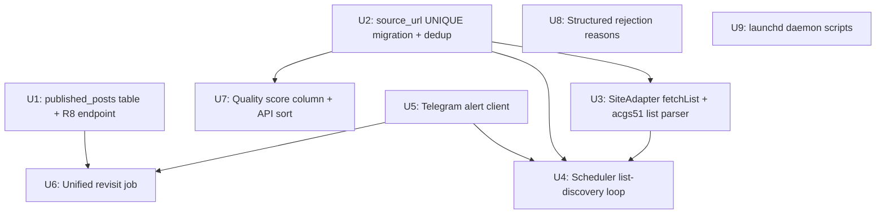

# feat: Phase 4 — Topic Intelligence & Ops Residency

## Overview

Phase 4 transforms the 51publisher backend from a "single-URL periodic re-fetcher" into an
automated topic radar: list-page discovery, 2-layer deduplication, quality scoring, post-publish
revisit/health monitoring, Telegram alerting, and a macOS launchd daemon.

**Phase gate**: 待审池每日自动有新鲜去重候选；核验/告警全自动

## Problem Frame

The acgs51 scraper re-fetches one fixed detail-page URL every 6 hours — no discovery, no
cross-session dedup, no quality ranking. The backend must be manually started and does not survive a
Mac restart. The `/api/v1/published-posts` endpoint the extension already calls after every publish
has never been implemented (silent 404). Phase 4 closes all four gaps and lays the backend
infrastructure required for Phase 5 one-click daily drafts.
(see origin: docs/brainstorms/2026-06-10-intelligent-publisher-roadmap-requirements.md)

## Requirements Trace

- R20. 列表页发现 — acgs51 adapter gains optional `fetchList`; scheduler drives batch discovery
- R21. 选题去重 — 2-layer: session-level in-memory Set + cross-session `UNIQUE(source_url)` index
- R22. 选题排序 — `quality_score` column computed on save; fold-to-bottom API param; no LLM scoring
- R23. 拒绝原因结构化 — shared `RejectionReason` enum; reject endpoint validates typed reason
- R24. 统一回访作业 — one revisit cron with multiple check items; outcome written to `published_posts`
- R25. (部分) session 失效识别告警 — revisit 401/403 → TG alert; scraper fetch-retries already exist
- R26. 告警通道 — Telegram Bot one-way push; no inbound command parsing; bot token fail-closed
- R29a. 后端常驻 — macOS launchd plist + install/uninstall scripts; secrets from chmod-600 `.env`

## Scope Boundaries

- Phase 4 does **not** include R27/R28 (one-click daily batch, read-then-publish) — Phase 5
- Extension-side pending topics browsing UI — Phase 5 sidepanel redesign
- R15–R19 (content quality improvements) — Phase 3 follow-on
- Multi-source scraper adapters — explicit non-goal across all phases
- launchd energy-saver enforcement — origin doc accepted sleep = pause + resume
- R23 extension UI rejection reason picker — deferred to Phase 5

## Context & Research

### Relevant Code and Patterns

- Adapter interface: `packages/backend/src/scraper/site-adapter.ts` — add optional `fetchList?`
- Existing adapter: `packages/backend/src/scraper/adapters/acgs51-adapter.ts` — detail-page-only
- Template adapter: `packages/backend/src/scraper/adapters/template-adapter.ts`
- Scheduler: `packages/backend/src/scraper/scheduler.ts` — `startScheduler(deps)`, module-level
  `jobs` Map singleton; extend in-place for list-discovery loop
- SSRF guard: `packages/backend/src/scraper/ssrf-guard.ts` — `safeFetch`, `assertUrlSafe`
- SSRF allowlist: `packages/backend/src/scraper/ssrf-allowlist.ts` — `loadSSRFAllowlist(env)` lazy;
  revisit job passes a separate env subset
- Env check: `packages/backend/src/env-check.ts` — fail-closed; all new vars go here
- Migrations: `packages/backend/src/migrations/runner.ts` — inline SQL in `MIGRATIONS` object,
  key `NNN-name.sql` alphabetical
- DB patterns: `packages/backend/src/scraper/pending-queue.ts` — `WriteQueue`, sync better-sqlite3
- Published-posts client stub: `packages/extension/lib/published-posts-client.ts` — already calls
  `POST /api/v1/published-posts` (currently 404s); U1 closes this gap
- Existing `pending_topics` schema: id PK, source_url (no UNIQUE today), title, raw_content, facts,
  confidence, status, rejected_reason, cover_image_url, created_at, updated_at
- Route registration: `register*Routes(server)` pattern in `packages/backend/src/index.ts`

### Institutional Learnings

- **Dotenv ordering trap**: never read `process.env` at module-import time. All env reads must be
  deferred to call time (fixed in commit `80e4eb2`; `ssrf-allowlist.ts` is the canonical pattern).
- **Scraper singleton**: `scraperConfig` and `jobs` Map are module-level singletons; tests must use
  unique siteName/adapterName per case to prevent cross-case pollution.
- **SQLite ALTER TABLE ADD COLUMN** on an existing column errors. Use `IF NOT EXISTS` index syntax;
  for column additions on older SQLite, wrap in try/catch or check `pragma table_info`.
- **better-sqlite3 is synchronous**. Async callers must route DB writes through `WriteQueue`.
- **R8 backend never implemented**: extension silently swallows 404. U1 is a pure implementation of
  a contract that already exists.

## Key Technical Decisions

- **Optional `fetchList?` on SiteAdapter** — avoids breaking existing adapters; scheduler checks
  `typeof adapter.fetchList === 'function'` before entering the list loop. Rejected separate
  `ListAdapter` type: unnecessary parallel hierarchy for one adapter.

- **Two separate SSRF allowlists** — `ALLOWED_HOSTS` for scraping (third-party content sites);
  `REVISIT_ALLOWED_HOSTS` for revisit (self-hosted front-end domain). `loadSSRFAllowlist(env)` is
  already parameterized; revisit job passes `{ ALLOWED_HOSTS: process.env.REVISIT_ALLOWED_HOSTS }`.
  Mixing the two allowlists would let a compromised scraper target your own front-end.

- **Quality score computed on save, stored in column** — simple formula:
  `fieldCompleteness × freshnessDecay × (1 − publishedPenalty)`. Avoids per-query computation.
  Per origin doc: if daily new ≤ daily publish, R22 degrades to `created_at DESC` sort; the stored
  column can be ignored without API changes.

- **Revisit job watches `published_posts` table, no new protocol** — extension already calls
  `POST /api/v1/published-posts` after every `publish-confirmed` event. Once U1 is live, the
  revisit cron sweeps `outcome IS NULL` records. No new message type or extension change needed.

- **Telegram uses native `fetch`, no SDK** — single `sendMessage` HTTPS POST; one endpoint, no
  inbound parsing. `api.telegram.org` does NOT enter either SSRF allowlist (it is outbound push,
  not a scraping or revisit target).

- **launchd: `StartCalendarInterval` not `StartInterval`** — fires on next scheduled time after
  wake rather than accumulating missed intervals. Simpler than energy-saver enforcement and aligns
  with origin doc's accepted tradeoff.

## Open Questions

### Resolved During Planning

- **How does revisit get triggered?** Extension calls `POST /api/v1/published-posts` on
  `publish-confirmed` (already wired in `background.ts` → `published-posts-client.ts`). Backend
  revisit job sweeps `outcome IS NULL` on a short cron. No new protocol needed.
- **Does Phase 4 require extension changes for the pending topics pool?** No. The gate only requires
  the backend pipeline to work. Extension browsing UI is Phase 5.
- **Sleep strategy for launchd?** Origin doc explicitly accepted pause + resume. Use
  `StartCalendarInterval`; missed firings run on next wake.
- **Does R23 need extension UI changes?** No for Phase 4. Backend validates typed reason; operator
  uses the existing reject API directly or via whatever UI exists. Extension picker is Phase 5.

### Deferred to Implementation

- **acgs51 list page HTML structure**: implementer must inspect actual `ACGS51_LIST_URL` page to
  determine selectors/regex for extracting detail page URLs. Constraint: same hostname only.
- **Score formula weights**: initial constants for field-completeness factor, freshness-decay
  half-life, and published-penalty magnitude are implementation-time choices.
- **Pagination depth for list discovery**: default = page 1 only per cycle. Deeper pagination
  deferred to observed need.
- **Revisit HTTP verb**: default HEAD; fall back to GET on 405.
- **`published_posts` exact schema**: implementer aligns with `PublishedPostRecord` type in
  `published-posts-client.ts` and the Phase 2 trajectory fields.
- **Consecutive-failure TG alert threshold**: default 3 consecutive scrape failures; env-configurable.

## High-Level Technical Design

> *This illustrates the intended approach and is directional guidance for review, not implementation
> specification. The implementing agent should treat it as context, not code to reproduce.*

```
Discovery pipeline (node-cron every 6h, configurable):

  acgs51Adapter.fetchList(ACGS51_LIST_URL)
    └─ [ detailUrl, ... ]  (same-host filter + SSRF allowlist + ssrf-guard per hop)

  for each url NOT in (sessionSet ∪ pending_topics.source_url):
    if budget exhausted → truncate + log + (optional) sendAlert
    fetchContent(url) → extractFacts() → savePendingTopic()
      └─ quality_score = completeness × freshnessDecay × (1 − publishedPenalty)
    if 3+ consecutive failures → sendAlert("scraper: N consecutive failures")

  daily summary → sendAlert("发帖日报: N 条新候选入池")

Revisit pipeline:

  Immediate sweep (cron every 5 min):
    SELECT * FROM published_posts WHERE outcome IS NULL AND created_at > now − 2h
    HEAD publishUrl (REVISIT_ALLOWED_HOSTS + ssrf-guard)
    200 → outcome = 'online'
    4xx/5xx → outcome = 'failed' + sendAlert
    401/403 → sendAlert("session may have expired, please re-login")

  Health sweep (cron every 24h):
    SELECT * FROM published_posts WHERE outcome = 'online'
    HEAD publishUrl → update outcome, last_checked_at
    failure → sendAlert
```

## Implementation Units



---

- [x] **U1: `published_posts` backend table + R8 endpoint**

**Goal:** Implement the backend half of the already-wired `published-posts-client.ts` contract.
Closes the silent-404 gap. Provides the `published_posts` table that R21 cross-session dedup and
R24 revisit depend on.

**Requirements:** R8, R21 (cross-session title dedup), R24 (revisit job source)

**Dependencies:** None

**Files:**
- Create: `packages/backend/src/migrations/003-published-posts.sql` (inline in runner.ts MIGRATIONS)
- Create: `packages/backend/src/published-posts-routes.ts`
- Modify: `packages/backend/src/index.ts` (register route)
- Test: `packages/backend/src/published-posts-routes.test.ts`

**Approach:**
- Migration `003-published-posts.sql`: table `published_posts` with columns: `id TEXT PK`,
  `source_url TEXT`, `work_title TEXT`, `publish_url TEXT UNIQUE`, `published_at TEXT`,
  `outcome TEXT DEFAULT NULL`, `last_checked_at TEXT DEFAULT NULL`, `created_at TEXT`
- `POST /api/v1/published-posts`: validate `publish_url` scheme is `http` or `https` (reject
  `file://`, `data:`, and other schemes with 400). Upsert by `publish_url` (ON CONFLICT DO UPDATE
  outcome/checked fields); returns 200 on upsert, 201 on insert. JWT-protected.
- `GET /api/v1/published-posts`: optional `?workTitle=` filter; returns array. JWT-protected.
- Register via `registerPublishedPostsRoutes(server)` in index.ts

**Patterns to follow:**
- `packages/backend/src/scraper/pending-routes.ts` — route handler shape
- `packages/backend/src/migrations/runner.ts` — inline SQL key pattern (`003-published-posts.sql`)
- `packages/backend/src/scraper/pending-queue.ts` — WriteQueue + sync DB calls

**Test scenarios:**
- Happy path: POST `{ publishUrl, workTitle, publishedAt }` → 201 Created, GET returns the record
- Upsert: POST same `publishUrl` twice → second returns 200, no duplicate row, outcome updated
- GET with `?workTitle=X` → returns only matching entries
- GET with no records → returns empty array `[]`
- Integration: After migration runs, `published_posts` table exists and `runner.ts` marks migration
  applied; re-running `runMigrations()` does not duplicate the table
- Scheme validation: POST `{ publishUrl: 'file:///etc/passwd' }` → 400; POST `{ publishUrl:
  'data:text/html,XSS' }` → 400; POST with valid `https://…` → 201

**Verification:**
- `pnpm test` in `packages/backend/` passes with new test file green
- `GET /api/v1/published-posts` returns 200 with `[]` on a fresh DB
- Extension's `published-posts-client.ts` POST no longer silently 404s (manual smoke-test)

---

- [x] **U2: `source_url` UNIQUE migration + `savePendingTopic` dedup**

**Goal:** Implement 2-layer topic deduplication: cross-session via UNIQUE index (DB layer) + within
a single cron run via an in-memory Set (scheduler layer, added in U4).

**Requirements:** R21

**Dependencies:** None (migration is independent; scheduler Set is in U4)

**Files:**
- Create: inline `004-source-url-unique.sql` in `packages/backend/src/migrations/runner.ts`
- Modify: `packages/backend/src/scraper/pending-queue.ts` (handle UNIQUE conflict gracefully)
- Test: `packages/backend/src/scraper/pending-queue.test.ts`

**Approach:**
- Migration `004-source-url-unique.sql`:
  `CREATE UNIQUE INDEX IF NOT EXISTS idx_pending_source_url ON pending_topics(source_url)`
- Update `savePendingTopic` (or its WriteQueue wrapper): catch the UNIQUE constraint error; return a
  typed result `{ inserted: boolean }` so callers can log/skip without throwing. Alternatively use
  `INSERT OR IGNORE` pattern and check `changes` count.
- Do NOT change the existing `ON CONFLICT(id)` upsert path — the ID conflict path is for
  intentional updates; the source_url path is for dedup-skips.

**Patterns to follow:**
- Existing `pending-queue.ts` WriteQueue pattern
- SQLite `INSERT OR IGNORE` / `changes` idiom

**Test scenarios:**
- Happy path: insert topic with source_url 'A' → inserted; insert again with same source_url →
  second call returns `{ inserted: false }` with no DB error
- Different source_url: two topics with different URLs → both rows persist
- Edge case: source_url is empty string → behavior is consistent (empty string is a valid unique key
  in SQLite; document this)
- Regression: existing `savePendingTopic` with unique id still upserts on id conflict

**Verification:**
- Test file green; `pnpm test` passes
- `SELECT COUNT(*) FROM pending_topics WHERE source_url = 'X'` never exceeds 1

---

- [x] **U3: `SiteAdapter.fetchList` interface + acgs51 list parser + `ACGS51_LIST_URL` env**

**Goal:** Give the acgs51 adapter the ability to discover new detail-page URLs from a list page.
Add the env var + env-check validation required to enable it safely.

**Requirements:** R20

**Dependencies:** U2 (source_url UNIQUE must be ready before we start saving discovered URLs)

**Files:**
- Modify: `packages/backend/src/scraper/site-adapter.ts` (add optional `fetchList?` method)
- Modify: `packages/backend/src/scraper/adapters/acgs51-adapter.ts` (implement `fetchList`)
- Modify: `packages/backend/src/env-check.ts` (validate `ACGS51_LIST_URL` and budget env vars)
- Modify: `packages/backend/.env.example` (document `ACGS51_LIST_URL`, `ACGS51_LIST_BUDGET`)
- Test: `packages/backend/src/scraper/adapters/acgs51-adapter.test.ts`

**Approach:**
- `SiteAdapter` interface: add `fetchList?(listUrl: string, deps?: { safeFetch }): Promise<string[]>`
  as optional method. Existing adapters (template, future adapters) unaffected.
- `acgs51Adapter.fetchList`: fetch `listUrl` via `safeFetch`, extract all `<a href>` links matching
  the same hostname, filter to paths that match the detail-page URL pattern (implementer determines
  pattern from actual HTML). Return deduplicated array.
- env-check: in the `ACGS51_ENABLED` conditional block, validate `ACGS51_LIST_URL`:
  - Must be set (if list mode is desired; make it optional — if absent, adapter falls back to single
    URL mode)
  - hostname must be in `ALLOWED_HOSTS` (same check as `ACGS51_START_URL`)
- Add `ACGS51_LIST_BUDGET` (default 20): max new URLs to process per cron cycle; validated as
  positive integer.

**Patterns to follow:**
- `acgs51-adapter.ts` existing `fetchContent` for fetch + regex pattern
- `env-check.ts` `ACGS51_ENABLED` block for conditional validation pattern
- `ssrf-allowlist.ts` `isHostAllowed` for hostname check

**Test scenarios:**
- Happy path: `fetchList` with mocked list HTML containing 5 detail-page hrefs → returns 5 URLs
- Filtering: list page includes external-domain hrefs → filtered out, only same-host returned
- Dedup within response: list page has 3 duplicate hrefs → returns 3 unique URLs
- Error: HTTP fetch fails → `fetchList` returns `[]` (no throw; caller handles empty gracefully)
- Malformed HTML: no matching hrefs → returns `[]`
- env-check: `ACGS51_ENABLED=true`, `ACGS51_LIST_URL` absent → startup proceeds (list mode
  optional); `ACGS51_LIST_URL` present but hostname not in `ALLOWED_HOSTS` → startup rejected
- env-check: `ACGS51_LIST_BUDGET` non-numeric string → startup rejected

**Verification:**
- Test file green; `pnpm test` passes
- `fetchList` is invocable on the exported `acgs51Adapter` object without error

---

- [x] **U4: Scheduler list-discovery loop**

**Goal:** Wire the list-discovery pipeline into the cron scheduler: per-cycle session Set,
budget cap, UNIQUE-guarded save, consecutive-failure tracking.

**Requirements:** R20, R21 (session-level Set dedup), R25 (consecutive failure detection)

**Dependencies:** U2, U3, U5 (Telegram for failure alerts)

**Files:**
- Modify: `packages/backend/src/scraper/scheduler.ts`
- Modify: `packages/backend/src/scraper/scraper-config.ts` (add `listUrl` field to
  `ScraperSiteConfig`)
- Test: `packages/backend/src/scraper/scheduler.test.ts`

**Approach:**
- Add `listUrl?: string` to `ScraperSiteConfig`; populate from `ACGS51_LIST_URL` in `index.ts`
- In the cron callback (per site): if `adapter.fetchList` exists and `site.listUrl` is set:
  1. Initialize per-run `sessionSet = new Set<string>()`
  2. Call `adapter.fetchList(site.listUrl)`
  3. Filter: `url not in sessionSet AND DB source_url lookup returns no row`
  4. Apply budget cap (`ACGS51_LIST_BUDGET`); truncate + log + optional alert if exceeded
  5. For each remaining URL: add to sessionSet, call `fetchContent` + `extractFacts` +
     `savePendingTopic`; track consecutive failures
  6. After N consecutive failures (default 3): `sendAlert("scraper: N consecutive failures on
     siteName")`; reset counter
- If `fetchList` absent or `listUrl` unset: fall back to existing single-URL behaviour (no change)
- Daily summary: after each successful cron run, count new insertions and call `sendAlert` with
  brief summary if count > 0 (configurable; default: only send if new > 0)

**Patterns to follow:**
- `scheduler.ts` existing per-site cron callback structure
- `node-cron` mock pattern in existing scheduler tests (`vi.mock('node-cron')`)
- `jobs` Map singleton — add revisit job entry here too (see U6)

**Test scenarios:**
- Happy path: 3 new URLs from `fetchList`, all within budget → 3 `fetchContent` calls, 3 saves
- Budget cap: 5 URLs from `fetchList`, budget = 3 → 3 processed, log entry records truncation
- Session Set dedup: `fetchList` returns URL 'A' twice (within one run) → `fetchContent` called once
- DB dedup: URL 'B' already in `pending_topics` (source_url UNIQUE) → `fetchContent` not called for 'B'
- Consecutive failures: `fetchContent` fails 3 times in a row → `sendAlert` called once
- Fallback: adapter has no `fetchList` → existing single-URL cron path unchanged (regression)
- `stopScheduler()` called → no further cron triggers fire

**Verification:**
- Test file green; `pnpm test` passes
- With `ACGS51_LIST_URL` set and `ACGS51_ENABLED=true`, a manual trigger produces new rows in
  `pending_topics` (smoke-test on real list page)

---

- [x] **U5: Telegram alert client**

**Goal:** One-way Telegram push channel. Fire-and-forget helper used by scheduler (U4), revisit
job (U6), and any future alerting call sites.

**Requirements:** R26

**Dependencies:** None

**Files:**
- Create: `packages/backend/src/telegram.ts`
- Modify: `packages/backend/src/env-check.ts` (TG vars, conditional on `TG_ENABLED`)
- Modify: `packages/backend/.env.example`
- Test: `packages/backend/src/telegram.test.ts`

**Approach:**
- `sendAlert(message: string): Promise<void>` — if `TG_ENABLED !== 'true'`, return immediately
  (no-op). Otherwise POST to `https://api.telegram.org/bot${TG_BOT_TOKEN}/sendMessage` with
  `{ chat_id: TG_CHAT_ID, text: message }`. Catch and swallow all errors; log via `console.warn`.
- No `getUpdates`, no webhook listener, no inbound command parsing.
- `api.telegram.org` is called with plain `fetch`. Before the request, call `assertUrlSafe` on the
  resolved IP of `api.telegram.org` (private-IP range check) and set `redirect: 'error'` on the
  `fetch` call. Telegram's API is a fixed HTTPS endpoint and never legitimately redirects; this
  closes the redirect-chain SSRF path without adding it to any allowlist.
- env-check: if `TG_ENABLED === 'true'`, require `TG_BOT_TOKEN` non-empty, non-placeholder, and
  matching the Bot Token format regex `^\d+:[A-Za-z0-9_-]{35,}$` (invalid format → startup
  blocked, surfaces misconfiguration early). Require `TG_CHAT_ID` non-empty.
- Env vars: `TG_ENABLED` (default false), `TG_BOT_TOKEN`, `TG_CHAT_ID`.
- Content safety: before calling the TG API, `sendAlert` filters out any substring that matches
  the admin domain (derived from `CORS_ORIGIN` env), replacing it with `[REDACTED]`, and emits a
  `console.warn`. Upgrading from "caller contract" to "function self-protection" prevents future
  callers from accidentally leaking the admin URL.

**Patterns to follow:**
- `env-check.ts` `ACGS51_ENABLED` conditional validation block
- Node.js built-in `fetch` (no axios/got)

**Test scenarios:**
- Happy path: `TG_ENABLED=true`, valid token → `fetch` called with correct URL and payload
  `{ chat_id, text }`
- No-op: `TG_ENABLED` absent or `false` → `fetch` not called at all
- API error: `fetch` rejects → `sendAlert` resolves without throwing (error swallowed)
- HTTP 4xx from TG API: → resolves without throwing
- env-check: `TG_ENABLED=true`, `TG_BOT_TOKEN` empty string → `checkEnv()` throws (startup blocked)
- env-check: `TG_ENABLED=true`, `TG_BOT_TOKEN` has wrong format (e.g. `"notatoken"`) → startup
  blocked (format regex fails)
- env-check: `TG_ENABLED=false` → `TG_BOT_TOKEN` absence does not block startup
- Content filter: message containing admin domain hostname → delivered with `[REDACTED]`, `console.warn` emitted

**Verification:**
- Test file green; `pnpm test` passes
- `TG_ENABLED=true` with a real token: manual `sendAlert("test")` delivers message to chat

---

- [x] **U6: Unified revisit job**

**Goal:** One cron-based job that (a) immediately validates newly published posts and (b) performs
periodic health checks on all online posts. Outcomes written to `published_posts`; failures trigger
TG alerts.

**Requirements:** R24, R25 (session expiry detection)

**Dependencies:** U1 (published_posts table), U5 (Telegram)

**Files:**
- Create: `packages/backend/src/revisit-job.ts`
- Modify: `packages/backend/src/index.ts` (call `startRevisitJob` in `start()`)
- Modify: `packages/backend/.env.example` (`REVISIT_CRON`, `REVISIT_ALLOWED_HOSTS`)
- Modify: `packages/backend/src/env-check.ts` (validate `REVISIT_ALLOWED_HOSTS` when revisit
  enabled)
- Test: `packages/backend/src/revisit-job.test.ts`

**Approach:**
- `startRevisitJob(deps)` registers two node-cron tasks using reserved-prefix Map keys
  `"__revisit_immediate"` and `"__revisit_health"` (reserved prefix prevents collision with site
  names). Both added to the shared `jobs` Map so `stopScheduler()` stops them.
- **Each cron callback must wrap its entire body in `try/catch`** (launchd restart-loop risk; see
  System-Wide Impact). Uncaught promise rejections crash the process under `KeepAlive=true`.
  1. **Immediate sweep** (cron `*/5 * * * *`, env-configurable `REVISIT_IMMEDIATE_CRON`):
     `SELECT * FROM published_posts WHERE outcome IS NULL AND created_at > (now − 2h)`; for each
     record, HEAD `publish_url` via `safeFetch` with REVISIT allowlist; update outcome.
  2. **Health sweep** (cron `0 4 * * *`, env-configurable `REVISIT_HEALTH_CRON`):
     `SELECT * FROM published_posts WHERE outcome = 'online'`; re-check; update.
- On HTTP 200 → `outcome = 'online'`, update `last_checked_at`.
- On HTTP 404 / 5xx → `outcome = 'failed'`; `sendAlert("帖子不可访问: {workTitle} {publishUrl}")`.
- On HTTP 401/403 → `outcome = 'failed'`; `sendAlert("后台 session 可能已过期,请重新登录")`.
- SSRF: create a revisit-specific allowlist loader: `loadSSRFAllowlist({ ALLOWED_HOSTS:
  process.env.REVISIT_ALLOWED_HOSTS })`. Self-hosted front-end hostname must be in
  `REVISIT_ALLOWED_HOSTS`; it must NOT be in scraper `ALLOWED_HOSTS`.
- env-check: when revisit is enabled, `REVISIT_ALLOWED_HOSTS` must be non-empty and must not
  contain `*` (fail-closed, same constraint as `CORS_ORIGIN`). If `REVISIT_ALLOWED_HOSTS` is
  absent or `*`, startup is rejected.
- All DB writes go through `WriteQueue`.

**Patterns to follow:**
- `packages/backend/src/scraper/scheduler.ts` — `startScheduler`, `jobs` Map, cron callback shape
- `packages/backend/src/scraper/ssrf-guard.ts` — `safeFetch` with custom allowlist
- `packages/backend/src/telegram.ts` (U5) — `sendAlert`

**Test scenarios:**
- Happy path: published post with `outcome=null`, HEAD → 200 → outcome updated to `'online'`,
  `sendAlert` not called
- Failure: HEAD → 404 → outcome `'failed'`, `sendAlert` called with post title + URL in message
- Session expiry: HEAD → 401 → outcome `'failed'`, `sendAlert` called with session-expiry message
- Health sweep: post with outcome `'online'`, HEAD → 200 → `last_checked_at` updated
- SSRF guard: `publish_url` hostname NOT in `REVISIT_ALLOWED_HOSTS` → request blocked, not sent
- Scheme gate: `publish_url` with `file://` scheme in DB (legacy data) → revisit job skips the row
  rather than passing it to `safeFetch` (defensive check at revisit time)
- Already-checked: post with `outcome='online'` not picked up by immediate sweep (window filter)
- `stopScheduler()` → both revisit cron tasks stopped (no further firing)
- Error: `fetch` throws network error → error caught, outcome set to `'failed'`, `sendAlert` fires

**Verification:**
- Test file green; `pnpm test` passes
- After a `publish-confirmed` event and U1 POST, the immediate sweep updates outcome within 5 min

---

- [x] **U7: Quality score column + API sort params**

**Goal:** Compute a simple quality score on topic save and expose it via the pending-topics API so
operators can see high-value topics first.

**Requirements:** R22

**Dependencies:** U2 (UNIQUE constraint migration must run before this migration runs)

**Files:**
- Create: inline `005-score-column.sql` in `packages/backend/src/migrations/runner.ts`
- Modify: `packages/backend/src/scraper/pending-queue.ts` (compute score on save)
- Modify: `packages/backend/src/scraper/pending-routes.ts` (add `sort_by`, `fold_threshold` params)
- Test: `packages/backend/src/scraper/pending-queue.test.ts`
- Test: `packages/backend/src/scraper/pending-routes.test.ts`

**Approach:**
- Migration `005-score-column.sql`: `ALTER TABLE pending_topics ADD COLUMN score REAL DEFAULT NULL`
  (wrap in try/catch for idempotency if SQLite version < 3.37).
- Score formula (implementation-time constants; documented in code comment):
  `score = fieldCompleteness(topic) × freshnessDecay(created_at) × (1 − publishedPenalty(workTitle))`
  - `fieldCompleteness`: fraction of non-empty fields in {title, body, facts, coverImageUrl}
  - `freshnessDecay`: `exp(-daysSinceCreation / 7)` (half-life ≈ 5 days)
  - `publishedPenalty`: 0.8 if `work_title` matches any entry in `published_posts`; else 0
- `pending-routes.ts` `GET /api/v1/pending-topics`: add optional `sort_by=score` query param
  (default: `created_at DESC`). Add optional `fold_threshold` (float 0–1): items with
  `score < threshold` get `folded: true` flag in response but are still present (never hidden).

**Patterns to follow:**
- `pending-queue.ts` `savePendingTopic` for the insertion path
- `pending-routes.ts` existing GET handler shape

**Test scenarios:**
- Score computation: topic with all 4 fields populated + created today + work_title not in
  published_posts → score ≈ 1.0
- Score: topic missing body + coverImageUrl + created 14 days ago → score significantly < 1.0
- Published penalty: work_title matches `published_posts` entry → score reduced by 0.8 factor
- GET with `sort_by=score` → response array ordered score descending
- GET with `fold_threshold=0.4`: topics with score < 0.4 have `folded: true`; all topics still
  present in response (regression: no items hidden)
- GET without `sort_by` → returns existing `created_at DESC` order (no regression)
- Migration idempotency: running `005` twice does not error

**Verification:**
- Test file green; `pnpm test` passes
- GET `/api/v1/pending-topics?sort_by=score` returns topics with `score` populated

---

- [x] **U8: Structured rejection reasons**

**Goal:** Replace the free-text `rejected_reason` field with a typed enum at the API + type layer.
Enables downstream aggregation (R23's "聚合回流") without DB schema changes.

**Requirements:** R23

**Dependencies:** None

**Files:**
- Modify: `packages/shared/src/types.ts` (add `RejectionReason` type)
- Modify: `packages/shared/src/index.ts` (export `RejectionReason`)
- Modify: `packages/backend/src/scraper/pending-routes.ts` (validate reason in reject endpoint)
- Test: `packages/backend/src/scraper/pending-routes.test.ts`

**Approach:**
- `RejectionReason` type in `shared/types.ts`:
  `'duplicate' | 'quality' | 'topic_mismatch' | 'missing_facts' | 'other'`
- The `pending_topics.rejected_reason` column stays `TEXT`; the DB layer stores the string value.
- Reject endpoint (`PATCH /api/v1/pending-topics/:id/reject`): accept optional `reason:
  RejectionReason`; if provided, validate against the enum (400 if invalid); store as-is.
- If `reason` is absent, store `null` (existing behaviour unchanged).
- R23 also specifies: bulk reject → default unified reason; per-item override allowed; skip
  allowed. This is the API-layer contract; the UI is Phase 5.

**Patterns to follow:**
- `packages/shared/src/types.ts` existing type definitions
- `pending-routes.ts` existing patch/reject handler

**Test scenarios:**
- Happy path: PATCH with `{ reason: 'duplicate' }` → 200, DB stores `'duplicate'`
- Invalid reason: PATCH with `{ reason: 'made_up' }` → 400
- No reason: PATCH without `reason` → 200, `rejected_reason` stored as null
- GET topic after rejection → includes `rejectedReason: 'duplicate'` in response

**Verification:**
- `pnpm compile` passes (shared type exported correctly)
- Test file green; `pnpm test` passes in both `shared` and `backend`

---

- [x] **U9: launchd daemon scripts**

**Goal:** Enable the backend to start automatically on Mac boot, restart on crash, and load secrets
from a chmod-600 `.env` file. Aligns with R29a "后端常驻".

**Requirements:** R29a

**Dependencies:** None (independent of backend feature changes)

**Files:**
- Create: `scripts/launchd/com.51publisher.backend.plist` (template with placeholders)
- Create: `scripts/launchd/start-backend.sh` (env-loading wrapper)
- Create: `scripts/launchd/install.sh`
- Create: `scripts/launchd/uninstall.sh`
- Modify: `packages/backend/.env.example` (document `PUBLISHER_LAUNCHD_DIR`, note `.env` chmod)
- Test expectation: none — shell scripts and plist are configuration artifacts, not behavior-bearing
  code. Manual verification against checklist below.

**Approach:**
- `com.51publisher.backend.plist`:
  - `Label`: `com.51publisher.backend`
  - `ProgramArguments`: `["/bin/bash", "/path/to/start-backend.sh"]`
  - `KeepAlive`: `true` (restart on crash)
  - `StartCalendarInterval`: fires at a fixed time (e.g. `{ Hour: 0, Minute: 0 }`); use this
    instead of `StartInterval` so missed firings during sleep run on next wake, not all at once
  - `StandardOutPath` / `StandardErrorPath`: log to `~/.51publisher/backend.log`
  - **No `EnvironmentVariables` key with secret values** — all secrets loaded at runtime
- `start-backend.sh`:
  ```
  #!/bin/bash
  set -euo pipefail
  ENV_FILE="${PUBLISHER_ENV_PATH:-$HOME/.51publisher/.env}"
  if [[ ! -f "$ENV_FILE" ]]; then exit 1; fi
  chmod_result=$(stat -f "%OLp" "$ENV_FILE" 2>/dev/null || stat -c "%a" "$ENV_FILE")
  if [[ "$chmod_result" != "600" ]]; then echo "ERROR: .env must be chmod 600"; exit 1; fi
  # macOS extended ACL check: chmod 600 is insufficient if ACL grants other users read access
  if ls -le "$ENV_FILE" 2>/dev/null | grep -q "+"; then
    echo "ERROR: .env has extended ACL; run 'chmod -N $ENV_FILE' to clear it"; exit 1
  fi
  set -a; source "$ENV_FILE"; set +a
  exec node /path/to/packages/backend/dist/index.js
  ```
- `install.sh`: resolve the actual `dist/index.js` path at install time (e.g. via `realpath`) and
  substitute it into `start-backend.sh`. Do not leave a placeholder requiring manual edit.
  Copies plist to `~/Library/LaunchAgents/`; calls `launchctl load`; idempotent (unloads first if
  already loaded).
- `uninstall.sh`: `launchctl unload`; removes plist.
- Document in `.env.example`: operator must `chmod 600 ~/.51publisher/.env` before running install.

**Patterns to follow:**
- macOS launchd plist conventions (no inline secrets, `KeepAlive`, `StartCalendarInterval`)

**Test expectation:**
Verified manually via checklist:
- [x] plist XML is well-formed (`plutil -lint`)
- [x] plist contains no keys from `EnvironmentVariables` that carry secrets
- [x] `start-backend.sh` rejects `.env` with permissions other than 600
- [x] `start-backend.sh` rejects `.env` that has a macOS extended ACL (`ls -le` shows `+`)
- [x] `install.sh` is idempotent (second run does not error)
- [x] `install.sh` embeds resolved absolute `dist/index.js` path (not a placeholder)
- [x] After `install.sh`, `launchctl list | grep 51publisher` shows the daemon
- [x] `data/` directory exists and is writable before first boot (verify in install checklist)

**Verification:**
- `plutil -lint scripts/launchd/com.51publisher.backend.plist` exits 0
- Backend starts and stays up after a reboot test (manual)

---

## System-Wide Impact

- **Interaction graph**: `index.ts` `start()` gains two new `register*` calls (U1, U6) and wires
  `ACGS51_LIST_URL` into `scraperConfig.addSiteConfig` (U3). `startRevisitJob` adds two entries to
  the shared `jobs` Map using reserved-prefix keys (`"__revisit_immediate"`,
  `"__revisit_health"`) to prevent silent collision with site names from `startScheduler`. Key
  naming convention must be documented in U6. `stopScheduler()` stop-and-delete semantics apply to
  all `jobs` entries including revisit tasks — intentional. In-flight cron callbacks are not
  awaited on stop; WAL rollback protects data integrity, but an interrupted sweep silently re-runs
  on the next cycle.
- **Error propagation**: `sendAlert` is always fire-and-forget; TG API failures must never bubble
  to scheduler or revisit job callers. `savePendingTopic` UNIQUE conflicts return a typed result,
  not a thrown error.
- **State lifecycle risks**: `published_posts` UPSERT on `publish_url` prevents duplicates if the
  extension fires `POST /api/v1/published-posts` more than once. The revisit job performs a bare
  read outside the WriteQueue followed by per-row WriteQueue updates (check-then-act). This is safe
  under the current single-process model because all HTTP handlers and cron callbacks share one
  event loop and `better-sqlite3` is synchronous — no two writes can overlap. If Phase 5 adds
  worker-thread parallelism, the revisit update should become `UPDATE ... WHERE outcome IS NULL
  AND id = ?` to collapse read + write into one atomic statement.
- **launchd restart-loop surface**: `KeepAlive=true` restarts on any process exit, including
  `process.exit(1)` from `validateEnv`. A bad `.env` produces a ~10 s throttle loop rather than a
  clean halt; operator should check `launchctl list` and the log file. More critically, any
  unhandled promise rejection in a cron callback crashes the process and triggers an immediate
  restart loop. Both revisit cron callbacks (U6) and any new scheduler cron callbacks must wrap
  their entire body in `try/catch` — this is a **correctness requirement**, not a nice-to-have.
- **Single DB file invariant**: `published_posts` is created via migration `003` in the same
  `pending.db` file as `pending_topics`, sharing the same `getDb()` connection and
  `pendingWriteQueue` singleton. Future migrations must not open a separate DB connection for
  `published_posts` without also routing its writes through a `WriteQueue` instance to preserve the
  single-writer invariant.
- **Boot ordering**: `initPendingDb()` is called at module-import time, before `validateEnv()`. A
  data-directory permission failure at this step produces a raw uncaught exception rather than a
  clean startup error. The launchd install checklist (U9) must verify the `data/` directory exists
  and is writable before first boot.
- **`start-backend.sh` path binding**: `install.sh` must resolve the actual `dist/index.js`
  absolute path at install time, not embed a template placeholder the operator must manually edit.
  A stale path silently fails on next reboot.
- **API surface parity**: `RejectionReason` is added to `packages/shared/src/types.ts`; both
  backend and extension must rebuild after this change. The extension does not yet use this type;
  no breaking change.
- **Unchanged invariants**: existing scraper single-URL fallback path is untouched when
  `fetchList` is absent. JWT auth, CORS origin checks, fail-closed env-check, SSRF guard — all
  unchanged. `dispatched` items are never auto-re-sent (Phase 1 invariant preserved).
- **Integration coverage**: The full discovery-to-dedup pipeline (U3+U4) must be smoke-tested
  against the real `ACGS51_LIST_URL` page, since the list-page HTML structure is deferred to
  implementation.

## Risks & Dependencies

| Risk | Mitigation |
|---|---|
| acgs51 list page structure unknown at plan time | Defer regex to implementation; plan specifies same-host-filter + ssrf-guard constraints |
| Phase 3 gate not yet formally passed (direct-publish rate) | Phase 4 plan is being written proactively; implementation should start only after Phase 3 gate data is available per roadmap over-gate rules |
| SQLite `ALTER TABLE ADD COLUMN` on existing column (migration idempotency) | Use `IF NOT EXISTS` syntax (SQLite 3.37+) or try/catch in migration runner |
| Revisit cron fires while extension is mid-publish | Race is safe: revisit reads `outcome IS NULL` records; the record is written only after `publish-confirmed`, so a concurrent publish + revisit on the same post produces at worst a benign double-check |
| Telegram bot token leaked in plist or git | `EnvironmentVariables` must not appear in plist; `.env` must be in `.gitignore` (already is); `start-backend.sh` enforces chmod-600 |
| launchd wakes up and runs while operator is away | Scraper only reads public pages + writes to local DB; no publish actions occur outside operator-triggered batch |
| Score formula misrates topics (too many low-score items folded) | Fold flag is non-hiding (items remain visible); operator can expand; weights are easy to tune post-launch |
| launchd restart loop on unhandled rejection in revisit cron callback | Both revisit cron callbacks must wrap entire body in `try/catch`, matching the `scheduler.ts` pattern; one uncaught network rejection under `KeepAlive=true` converts a transient error into a process restart loop |
| `REVISIT_ALLOWED_HOSTS` wildcard or empty allows SSRF via `publish_url` injection | env-check must reject `*` or empty for `REVISIT_ALLOWED_HOSTS` (same pattern as `CORS_ORIGIN`); U1's `POST /api/v1/published-posts` must validate `publish_url` scheme is `http` or `https` only (reject `file://`, `data:`, etc.) |

## Documentation / Operational Notes

- Add to `packages/backend/.env.example`:
  - `ACGS51_LIST_URL=` (list page URL for discovery)
  - `ACGS51_LIST_BUDGET=20` (max new URLs per cycle)
  - `REVISIT_ALLOWED_HOSTS=` (self-hosted front-end domain, separate from scraper ALLOWED_HOSTS)
  - `REVISIT_IMMEDIATE_CRON=*/5 * * * *`
  - `REVISIT_HEALTH_CRON=0 4 * * *`
  - `TG_ENABLED=false`
  - `TG_BOT_TOKEN=`
  - `TG_CHAT_ID=`
- Operator setup checklist (new section in README or run-sheet):
  1. Set `ACGS51_LIST_URL` to the "latest updates" list page URL
  2. Add list-page hostname to `ALLOWED_HOSTS`
  3. Add self-hosted front-end hostname to `REVISIT_ALLOWED_HOSTS`
  4. Create Telegram bot, add `TG_BOT_TOKEN` + `TG_CHAT_ID` to `.env`; set `TG_ENABLED=true`
  5. `chmod 600 ~/.51publisher/.env`
  6. `bash scripts/launchd/install.sh`
  7. Verify: `launchctl list | grep 51publisher`
- Phase 4 gate verification: after running overnight with `ACGS51_ENABLED=true` + list URL set:
  - Morning: `SELECT COUNT(*) FROM pending_topics WHERE DATE(created_at)=DATE('now')` > 0
  - After a publish: `SELECT * FROM published_posts` shows record with `outcome='online'`
  - Simulate failure: temporarily break `REVISIT_ALLOWED_HOSTS` → TG alert fires

## Sources & References

- **Origin document:** [docs/brainstorms/2026-06-10-intelligent-publisher-roadmap-requirements.md](../brainstorms/2026-06-10-intelligent-publisher-roadmap-requirements.md)
- Related plan: [docs/plans/2026-06-11-001-feat-phase3-quality-engine-plan.md](2026-06-11-001-feat-phase3-quality-engine-plan.md)
- Scraper adapter: `packages/backend/src/scraper/adapters/acgs51-adapter.ts`
- Scheduler: `packages/backend/src/scraper/scheduler.ts`
- SSRF guard: `packages/backend/src/scraper/ssrf-guard.ts`
- SSRF allowlist: `packages/backend/src/scraper/ssrf-allowlist.ts`
- Migration runner: `packages/backend/src/migrations/runner.ts`
- Published-posts client stub: `packages/extension/lib/published-posts-client.ts`
- Env check: `packages/backend/src/env-check.ts`
