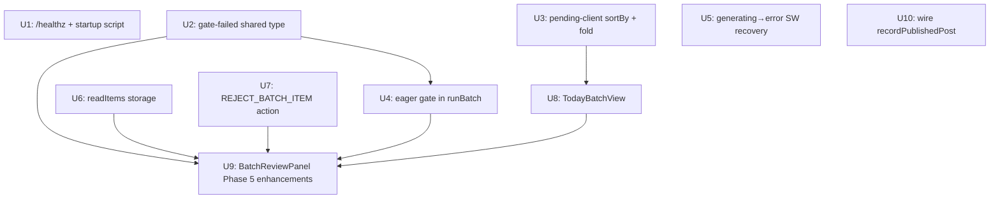

# Phase 5 — 每日一键备稿 & 逐篇审读发布

## Overview

Phase 5 将"每日操作"从"手动选题 → 手动触发批次"升级为"一键触发 → 自动备稿 → 逐篇审读发布"。
核心流程：操作者到场点"跑今日批次" → 系统自动拉取高分待审选题 → 生成草稿 → 提前跑 grounding gate 分流 → 备稿就绪队列等待逐篇审读 → 操作者每篇读完后选择发布/改稿后发布/否决。
全程 ≤10-15 分钟，发布手势不变，闸门链零修改。

**Prerequisites：** Phase 4 (MR!6) 已合并 — `published_posts` 表、quality score API、revisit job 全部就位。

## Problem Frame

当前痛点：
- 操作者需要手动从 PendingTopicsView 选题、点批准、再触发批次
- 没有"今日配额"概念 — 每次触发数量不定，体验割裂
- 草稿生成完成后没有 gate 预筛 — 所有草稿（包括含【待补】占位符的）都堆入审读队列
- `recordPublishedPost` 是死代码 — published_posts 表从未被实际写入，去重功能名存实亡

(see origin: docs/brainstorms/2026-06-10-intelligent-publisher-roadmap-requirements.md — R27/R28/R29)

## Requirements Trace

- R27. 每日一键备稿管线：top-N 高分选题 → 生成 → 自动 gate 分流 → 备稿就绪队列
- R28. 逐篇审读发布：每篇必读 → 发布/改稿/否决；未读草稿绝不发布
- R29. Mac 常驻运维收尾：`/healthz` 端点 + 一键启动脚本
- R21. 选题去重：否决后 topic 标记 rejected，防下次批次重选
- R8. published_posts 回写：`publish-confirmed` 后实际写入注册表（修死代码）

## Scope Boundaries

- **不含** `chrome.alarms` 定时触发（Phase 5 是"到场一键"，非自动定时）
- **不含** 内容 hash 跨批次雷同检测（R21 高级候选项，待实证后再议）
- **不含** SEO 收录监测（R18 条件档，依调研结论）
- **不含** R16 生成参数调优（独立迭代）
- **不含** 封面图资产化（R19，独立迭代）
- **draftOverrides 不跨侧边栏会话保存** — 改稿必须在同一打开会话内完成发布（接受此限制，文档注明）

## Context & Research

### Relevant Code and Patterns

- **Sidepanel 路由**：`packages/extension/entrypoints/sidepanel/App.tsx` — `useState<'main'|'settings'|'batch'|'pending'|'auth'>` 枚举 + 级联 if，无 React Router；新视图加 union 成员 + 在 App.tsx 新增分支
- **Batch 状态机**：`packages/extension/lib/batch.ts` — `BatchItemStatus` union，`transition()` 纯函数，`ALLOWED_TRANSITIONS` 常量表
- **BatchOrchestrator 生成管线**：`packages/extension/lib/batch-orchestrator.ts:67` — `runBatch(deps)` → 每条 item 的生成 / Phase 3 review / `markFilled` → `presentForApproval`
- **批量审批管线**：`batch-orchestrator.ts:182` — `approveBatch(deps)` → grounding gate（当前在此处触发）→ `sendFill` → tombstone → `orchestratePublish`
- **Grounding gate**：`packages/extension/lib/grounding-gate.ts` — `evaluateGrounding(draft, facts)` 返回 `GroundingVerdict`；检查【待补】占位符和无来源链接
- **Pending client**：`packages/extension/lib/pending-client.ts` — `fetchPendingTopics(status?)` 缺少 `sortBy`/`foldThreshold` 参数
- **Published posts client**：`packages/extension/lib/published-posts-client.ts` — `recordPublishedPost()` 已实现但**是死代码**（background.ts 有 import 但无调用）
- **Messaging timeout 表**：`packages/extension/lib/messaging.ts:16` — `RUN_BATCH`/`APPROVE_BATCH` 注册为 300s，其余默认 30s
- **SW keepalive**：`background.ts:366` — `chrome.alarms.create('keep-alive', {periodInMinutes:1})` 已注册
- **Settings 存储**：`packages/extension/lib/settings.ts` — `getSettings()`/`saveSettings()` 管理 `Settings` 类型，Phase 5 在此加 `dailyBatchSize`
- **PendingTopicsView**：`packages/extension/entrypoints/sidepanel/PendingTopicsView.tsx:82` — 选题勾选 → `resolveAdminTabId()` → `runBatch(...)` 的现有路径

### Institutional Learnings

- **SW 30s idle timeout**：Phase 3 将此问题 defer 到 Phase 5；10 条批次生成 = 150-450 秒，`chrome.alarms` 每分钟一次已注册但 alarm 周期内仍有 30s 静默窗口
- **Tombstone 协议**：保护的是"填充阶段"（approveBatch 时），不保护"生成阶段"；`generating` 状态 SW kill 后会永久卡死
- **RunBatchDeps / ApproveBatchDeps 注入模式**：business logic 在 `lib/`，background.ts 只做 deps 构造（< 25 行接线原则）
- **draftOverrides 是刻意的 ephemeral React state**：不持久化，approve 时 merge；Phase 5 接受此限制
- **tab 定位**：必须用 `resolveAdminTabId()`（`chrome.tabs.query` 按 host 全窗口匹配），禁用 active-tab query

### External References

- 无需外部研究 — 本地模式已完备

## Key Technical Decisions

- **`gate-failed` 作为独立 BatchItemStatus**（非复用 `error`）：grounding gate 失败的草稿（含占位符、无来源链接）是可修复的内容问题，语义上与"LLM 调用失败"的 `error` 不同；UI 需要分别呈现"重新生成"和"内容问题待修"两种引导；`gate-failed → queued` (retry) 允许重新生成修复
- **`readItems` 写入 `chrome.storage.local`**（非纯 React state）：R28 的"每篇必读"是硬约束；SW kill 后 React state 丢失，read 标记消失会强迫操作者重读（可接受降级）但会破坏"未读草稿绝不发布"的 UI 保障；持久化保证约束跨 SW kill 依然有效
- **`runBatch` 内提前跑 grounding gate**（备稿阶段分流，非 approve 时）：Phase 5 需要在操作者交互前已经区分"备稿就绪"和"待人工处理"两个队列；继续依赖 `approveBatch` 里才跑 gate 则无法提前显示分流结果；trade-off：`approveBatch` 里仍需保留 gate（authorized 档安全闸不移除），`runBatch` 的 gate 是"内容预筛"额外一层
- **`generating → error` SW 重启恢复**（非 `needs-human-verification`）：生成过程未触碰任何后台表单，无"是否已提交"歧义；`needs-human-verification` 的语义是"submit-dispatched 后无回执"（有提交歧义）；`error` 允许重试，体验更好
- **否决 → PendingTopic status = `rejected`**：防止同一话题在下次"跑今日批次"时重新进入 top-N；使用 Phase 4 已实现的 `RejectionReason` enum；`updatePendingStatus(topicId, 'rejected', reason)` 已就绪
- **`dailyBatchSize` 存扩展 Settings**（默认 5，最大 20）：操作者控制；不需要后端 env 配置；最大 20 防止无限长批次
- **TodayBatchView 作为独立"起飞"视图**：与 BatchView（进度/审读）分离；TodayBatchView 负责预检（显示池状态 + top-N 预览）和触发；触发后导航 → BatchView（已有批次监控视图）；不改 BatchView 的核心逻辑

## Open Questions

### Resolved During Planning

- **fold_threshold 默认值**：`0.5`。已发布话题 score ≤ 0.2（publishedPenalty=0.8），设 0.5 可稳定过滤已发布话题；操作者可在待审池视图展开折叠区捞回低分话题
- **N < 实际池大小时**：静默取实际数量，不报错，UI 提示"池中仅有 X 条可用选题"
- **并发侧边栏**：第二个侧边栏检测到 `batch.status === 'running'` 时显示只读进度视图，禁用"跑今日批次"按钮
- **gate 失败类型**：仅 grounding gate 失败（内容问题，可修复）进 `gate-failed`；safety gate 的 host 检查在备稿阶段不适用（未到 publish），不影响备稿分流

### Deferred to Implementation

- **`exclude_published` 后端查询参数 vs. score 过滤**：若实测发现 fold_threshold=0.5 不足以过滤已发布话题，实现时可选加 backend JOIN 参数；初期依赖 score 折叠
- **AI diff 显示格式**：BatchReviewPanel 已有 `aiReviewTriggered` badge，per-draft diff 详情展示方式（side-by-side vs. inline highlight）在实现时按现有 UI 风格决定
- **BatchReviewPanel vs. 新 DraftReviewView**：能否在现有 BatchReviewPanel 内增强，还是需要新建 per-draft 视图，取决于实现时的 UI 复杂度

## High-Level Technical Design

> *这是方向性指引，供评审验证意图，不是实现规格。实现者以此为上下文，不要逐行复现。*

### 状态机变更（U3）

```
现有:
  filled → awaiting-approval

Phase 5:
  filled → [grounding gate check in runBatch]
               ├─ pass → awaiting-approval  (备稿就绪)
               └─ fail → gate-failed        (待人工处理)

新增转换:
  gate-failed → queued  (retry — 重新生成)

R28 新增约束:
  awaiting-approval → publish-dispatched
    ONLY IF readItems.has(itemId)
    (否则 UI 禁用发布按钮)
```

### 每日批次启动流（R27）

```
TodayBatchView
  │
  ├─ GET /api/v1/pending-topics?sort_by=score&status=pending&fold_threshold=0.5
  │    ├─ 0 条 → 显示空态引导（触发抓取 / 展开折叠）
  │    └─ N 条 → 预览前 dailyBatchSize 条（过滤 folded=true）
  │
  └─ "跑今日批次" clicked
       │
       ├─ resolveAdminTabId()
       ├─ topics[0..N-1] → runBatch(deps)
       └─ navigate → BatchView
```

### SW Kill 恢复（U5）

```
background.ts onStartup / service_worker 重新激活
  │
  └─ getBatch() → 扫描 items
       ├─ status === 'generating' → transition → 'error'  (可重试)
       └─ 其余状态 → 不变（tombstone 协议不变）
```

### 审读发布流（R28）

```
BatchReviewPanel (per item)
  │
  ├─ item.status === 'awaiting-approval'
  │    ├─ readItems.has(itemId) = false
  │    │    → 显示草稿 + gate 结果
  │    │    → 操作者向下滚动/展开 → markAsRead(itemId) → readItems 写 storage
  │    │    → 发布按钮解锁
  │    └─ readItems.has(itemId) = true
  │         → 发布 / 改稿后发布 / 否决 按钮均可用
  │
  ├─ item.status === 'gate-failed'
  │    → 显示 gateFailReason（哪个检查失败）
  │    → "重新生成" 按钮 → retry → queued
  │
  └─ 否决 → REJECT_BATCH_ITEM(itemId, rejectionReason)
       → item.status = aborted
       → updatePendingStatus(topicId, 'rejected', reason)
```

## Implementation Units



---

- [ ] **U1: 后端 `/healthz` 端点 + 一键启动脚本**

**Goal:** R29 运维收尾 — 无鉴权健康检查端点 + 消除"pnpm start 跑旧 dist"的一键启动脚本

**Requirements:** R29

**Dependencies:** 无（独立）

**Files:**
- Modify: `packages/backend/src/index.ts` (注册 /healthz)
- Modify: `packages/backend/src/auth-middleware.ts` (PUBLIC_ROUTES 加 /healthz)
- Create: `scripts/start-backend.sh`
- Test: `packages/backend/src/index.test.ts` 或新建 `packages/backend/src/healthz.test.ts`

**Approach:**
- GET `/api/v1/healthz` 返回 `{ok: true}`；加入 `PUBLIC_ROUTES` Set；不暴露版本/配置/路径
- `scripts/start-backend.sh`：① 调用 `scripts/launchd/start-backend.sh`（env 校验已在其中）② 构建检测：若 `packages/backend/dist/index.js` 不存在或 `packages/backend/src/**` 比 dist 新则 `pnpm build:backend` ③ 启动进程 ④ 等待 /healthz 返回 200（最多 10s）作为冒烟测试

**Patterns to follow:**
- `PUBLIC_ROUTES` Set in `auth-middleware.ts`
- 现有 Fastify 路由注册风格 (`server.get(...)`)

**Test scenarios:**
- Happy path: GET /api/v1/healthz → 200 `{ok:true}` 无需 Authorization header
- Error path: /healthz 不在保护路由中（不返回 401）
- 边界：/healthz 不泄露 PORT / HOST / data path 等配置信息

**Verification:**
- `curl http://localhost:3001/api/v1/healthz` 返回 `{"ok":true}`，无需 token
- `bash scripts/start-backend.sh` 在 dist 过期时触发重构，在 dist 新鲜时跳过构建

---

- [ ] **U2: `gate-failed` BatchItemStatus + gateFailReason 字段**

**Goal:** 扩展状态机支持"内容 gate 失败"语义，与"系统错误"分离；同步更新 `abortBatch`、`batchPhase`、后端 ALLOWED_TRANSITIONS

**Requirements:** R27（自动 gate 分流）

**Dependencies:** 无（基础类型，其他 U 依赖此 U）

**Files:**
- Modify: `packages/shared/src/types.ts` (BatchItemStatus union, BatchItem interface)
- Modify: `packages/extension/lib/batch.ts` (ALLOWED_TRANSITIONS, transition(), abortBatch ABORTABLE set, batchPhase)
- Modify: `packages/backend/src/batch-routes.ts` (ALLOWED_TRANSITIONS 同步)
- Test: `packages/extension/lib/batch.test.ts`

**Approach:**
- `BatchItemStatus` 加 `'gate-failed'`
- `BatchItem` 加可选字段 `gateFailReason?: string` 和 `pendingTopicId?: string`（U7 需要，在此一并加入）
- `ALLOWED_TRANSITIONS`：`filled → gate-failed`；`gate-failed → queued`（retry）
- `abortBatch` 的 `ABORTABLE` 集合加入 `gate-failed`（否则急停操作 KILL_BATCH 不会终止 gate-failed items，留下状态残留）
- `batchPhase` 函数的 `awaiting-approval` 分支同时检查 `gate-failed`（否则含 gate-failed item 的 batch 会被错误识别为 `done` phase，导致 TodayBatchView 的"起飞视图"被错误展示）
- `recoverBatch()`：`gate-failed` 不是崩溃态，不触发隔离恢复逻辑
- backend `ALLOWED_TRANSITIONS` 同步（`batch-routes.ts`）：加入 `filled → gate-failed` 和 `gate-failed → queued`

**Patterns to follow:**
- `packages/extension/lib/batch.ts` 中的 `ALLOWED_TRANSITIONS` 常量表 + `transition()` 纯函数模式
- `ABORTABLE` 集合在 `abortBatch` 函数内（约第 205 行）

**Test scenarios:**
- Happy path: `transition({status:'filled'}, 'gate-failed')` → `{status:'gate-failed'}`
- Happy path: `transition({status:'gate-failed'}, 'queued')` → `{status:'queued'}`
- Edge case: `transition({status:'awaiting-approval'}, 'gate-failed')` → 保持原状（不允许）
- Edge case: `gateFailReason` 字段不影响其他状态的 transition
- Edge case: `abortBatch` 对 `gate-failed` item 执行 → item 变为 `aborted`（验证 ABORTABLE 集合生效）
- Edge case: `batchPhase` 对含 gate-failed item 的 batch → 返回 `awaiting-approval`（不返回 `done`）
- Integration (backend): `PATCH /api/v1/batches/:id/items/:itemId` with `{status:'gate-failed'}` from `filled` → 200；`{status:'queued'}` from `gate-failed` → 200

**Verification:**
- `pnpm -r compile` 通过（类型无报错）
- `pnpm test` 相关 batch.test.ts 和 batch-routes.test.ts 全绿
- 急停操作（KILL_BATCH）能终止 gate-failed items

---

- [ ] **U3: `pending-client.ts` 扩展 sortBy + foldThreshold 参数**

**Goal:** 让扩展前端能使用 Phase 4 已实现的 `sort_by=score` 和 `fold_threshold` API

**Requirements:** R27（top-N 高分选题）

**Dependencies:** 无（独立）

**Files:**
- Modify: `packages/extension/lib/pending-client.ts`
- Modify: `packages/shared/src/types.ts` 或 `packages/extension/lib/settings.ts` (加 `dailyBatchSize?: number`)
- Test: `packages/extension/lib/pending-client.test.ts` (若存在) 或新建

**Approach:**
- `fetchPendingTopics(status?, sortBy?: 'score'|'created_at', foldThreshold?: number)` — 构建查询字符串，追加 `sort_by` / `fold_threshold` 参数
- `Settings` 类型加 `dailyBatchSize?: number`，默认值 `5`，`saveSettings` 中 clamp 到 [1, 20]
- 响应中每条 topic 的 `folded?: boolean` 字段透传给调用方

**Patterns to follow:**
- `pending-client.ts` 中现有的 `fetchPendingTopics` 实现 + `authHeaders()` 模式

**Test scenarios:**
- Happy path: `sortBy='score'` 时 URL 含 `sort_by=score`
- Happy path: `foldThreshold=0.5` 时 URL 含 `fold_threshold=0.5`
- Happy path: 不传 sortBy 时 URL 不含 sort_by 参数
- Edge case: `dailyBatchSize` clamp — 传 0 存为 1，传 99 存为 20

**Verification:**
- 调用 `fetchPendingTopics('pending', 'score', 0.5)` 发出正确 URL
- 返回的 topics 数组包含 `folded` 字段

---

- [ ] **U4: `runBatch` 内提前跑 grounding gate（备稿阶段分流）**

**Goal:** 在 `markFilled` 后立即做内容质量预筛，gate 失败进 `gate-failed`，通过进 `awaiting-approval`

**Requirements:** R27（自动 gate 分流到两个队列）

**Dependencies:** U2（gate-failed 状态必须先存在）

**Files:**
- Modify: `packages/extension/lib/batch-orchestrator.ts`
- Test: `packages/extension/lib/batch-orchestrator.test.ts`

**Approach:**
- `runBatch()` 的每个 item 循环中，`markFilled(...)` 之后，调用 `evaluateGrounding(draft, facts)`
- 通过 → `presentForApproval()`（现有逻辑不变）
- 失败 → `transition(item, 'gate-failed')` + 写 `gateFailReason`（verdict.reason 的字符串摘要）
- `approveBatch()` 中的 grounding gate 保持不变，**失败仍走 `markGenerateFailed → error`（不改为 gate-failed）**：到 approve 阶段遭遇内容 gate 失败意味着上游预筛有疏漏，`error` 允许重试是正确语义；`gate-failed` 只表示"备稿阶段提前分流的内容问题"。这一语义区分需在 U9 的 BatchReviewPanel 中体现：`error` 状态若含 `gateFailReason` 前缀（如 `'grounding-blocked: ...'`）应以独立样式展示，避免操作者混淆
- `RunBatchDeps` 注入 `evaluateGrounding` 函数（可选，有默认 import），方便 mock 测试（遵循 deps injection 模式）

**Patterns to follow:**
- `batch-orchestrator.ts:130` 处 Phase 3 review/rewrite 的 deps 注入模式

**Test scenarios:**
- Happy path: grounding gate 通过 → item 最终状态为 `awaiting-approval`
- Error path: grounding gate 失败（含【待补】）→ item 状态为 `gate-failed`，`gateFailReason` 非空
- Error path: grounding gate 失败（无来源链接）→ item 状态为 `gate-failed`
- Integration: runBatch 结束后，batch 中既有 awaiting-approval 又有 gate-failed 的 items

**Verification:**
- `batch-orchestrator.test.ts` 中 gate 失败场景全绿
- `approveBatch` 仍然有 grounding gate，不移除

---

- [ ] **U5: SW 重启时 `generating → error` 恢复**

**Goal:** 消除"生成阶段 SW kill"后永久卡死在 `generating` 的僵尸 items

**Requirements:** R27（可靠性）

**Dependencies:** 无（独立）

**Files:**
- Modify: `packages/extension/entrypoints/background.ts`（启动扫描逻辑）
- Test: `packages/extension/entrypoints/background.test.ts` 或 `packages/extension/lib/batch-recovery.test.ts`

**Approach:**
- background.ts 启动时（`browser.runtime.onStartup` 及 SW 被激活的首次执行）：调用 `getBatch()`，扫描所有 items
- 找到 `status === 'generating'` 的 item → `transition(item, 'error')`（`error → queued` 可重试）
- 写回 batch storage
- 此逻辑与现有 tombstone 协议（填充阶段）并存，不冲突

**Patterns to follow:**
- background.ts 中 `browser.runtime.onStartup` 的现有注册模式
- `getBatch()` + `saveBatch()` 存储模式

**Test scenarios:**
- Happy path: 启动时无 generating items → batch 不变
- Happy path: 启动时有 1 个 generating item → 该 item 变为 error，其余不变
- Edge case: batch 不存在（null）→ 静默跳过
- Integration: transition to error 后，`retryBatchItem` 可将 error → queued

**Verification:**
- 模拟 batch 含 generating item → 调用 startup hook → item 变为 error

---

- [ ] **U6: `readItems` 持久化 + read gating**

**Goal:** 将"已读"标记写入 `chrome.storage.local`，保证"每篇必读"约束跨 SW kill 有效

**Requirements:** R28（每篇必读）

**Dependencies:** 无（独立）

**Files:**
- Modify: `packages/extension/lib/storage.ts` 或新建 `packages/extension/lib/read-tracker.ts`
- Test: `packages/extension/lib/read-tracker.test.ts`

**Approach:**
- `storage.local.readItems: string[]`（itemId 数组）
- 暴露：`markItemRead(itemId: string): Promise<void>` 和 `isItemRead(itemId: string): Promise<boolean>` / `getReadItems(): Promise<Set<string>>`
- **清空时机：在 background.ts 的 `handleRunBatch` 开头（`runBatch(...)` 调用前）清空 readItems**（而非 UI 侧）；原因：background.ts 是 batch 状态的单一权威，readItems 生命周期应跟随 batch 生命周期在同一侧管理，避免 UI 侧 race condition
- BatchView / BatchReviewPanel 读取 readItems 决定发布按钮是否可用

**Patterns to follow:**
- `packages/extension/lib/storage.ts` 中其他 `local:*` 存储键的模式

**Test scenarios:**
- Happy path: `markItemRead('item-1')` → `isItemRead('item-1')` returns true
- Happy path: `isItemRead('item-2')` 在未标记时 returns false
- Edge case: 重复 markItemRead 同一 id → 不重复插入（Set 语义）
- Edge case: readItems 清空 → isItemRead 全部 false

**Verification:**
- 调用 `markItemRead` 后 `chrome.storage.local` 实际有写入
- SW 重启后 `isItemRead` 仍返回之前标记的结果

---

- [ ] **U7: 扩展 `DISCARD_BATCH_ITEM` 支持否决语义**

**Goal:** 操作者可对单条草稿执行否决，BatchItem → aborted，PendingTopic → rejected

**Requirements:** R28（否决），R21（防重选）

**Dependencies:** 无（独立）

**架构决策：扩展现有 `DISCARD_BATCH_ITEM`，而非新建 `REJECT_BATCH_ITEM`**

`DISCARD_BATCH_ITEM` 已在 background.ts 中存在，逻辑为 `transition(item, 'aborted')`。否决操作的本质是"丢弃单条 + 可选地标记来源 topic 为 rejected"，与 discard 语义完全重叠，仅增加两个可选参数。新建消息类型会造成两个几乎相同的 handler 并存，违反 DRY 原则。

**Files:**
- Modify: `packages/shared/src/types.ts` (`DISCARD_BATCH_ITEM` 消息类型加 `rejectionReason?: RejectionReason`)
- Modify: `packages/extension/entrypoints/background.ts` (`handleDiscardBatchItem` 扩展：若 item 有 `pendingTopicId` 且传了 `rejectionReason`，fire-and-forget 调用 `updatePendingStatus`)
- Test: `packages/extension/entrypoints/background.test.ts`

**Approach:**
- `DISCARD_BATCH_ITEM` 消息加可选字段 `rejectionReason?: RejectionReason`
- `BatchItem` 已在 U2 中加入 `pendingTopicId?: string`，此处直接使用（无需再加）
- handler 新逻辑：`transition(item, 'aborted')` → `saveBatch()` → if `item.pendingTopicId && rejectionReason`：`updatePendingStatus(topicId, 'rejected', reason)` fire-and-forget
- 无 `pendingTopicId` 或无 `rejectionReason` 时，仅做 discard，不调用 `updatePendingStatus`（向后兼容现有调用方）

**Patterns to follow:**
- background.ts 中现有 `handleDiscardBatchItem` 函数（找到该函数后在末尾扩展）
- `updatePendingStatus` 已在 `pending-client.ts` 中

**Test scenarios:**
- Happy path: discard `awaiting-approval` item（无 rejectionReason）→ status → `aborted`；`updatePendingStatus` 不调用
- Happy path: discard 含 `pendingTopicId` 的 item + 传 `rejectionReason` → status → `aborted`；`updatePendingStatus` 被调用，参数含 `rejected` 和 rejectionReason
- Error path: itemId 不存在 → handler 静默忽略（不 throw）
- Error path: `updatePendingStatus` 失败 → 不影响 batch item 状态变更（fire-and-forget）
- Edge case: 无 `pendingTopicId` 但传了 `rejectionReason` → 仅 discard，不调用 `updatePendingStatus`

**Verification:**
- 发送含 `rejectionReason` 的 `DISCARD_BATCH_ITEM` 消息后，batch item 为 `aborted`
- 对应 PendingTopic 的 `status` 变为 `rejected`（可通过 GET /api/v1/pending-topics 验证）
- 不含 `rejectionReason` 的现有调用行为不变（向后兼容）

---

- [ ] **U8: `TodayBatchView.tsx` — 每日批次起飞视图**

**Goal:** 新的侧边栏视图，展示待审池状态、top-N 预览、触发今日批次

**Requirements:** R27（一键触发），R27 空态引导

**Dependencies:** U3（扩展后的 fetchPendingTopics）

**Files:**
- Create: `packages/extension/entrypoints/sidepanel/TodayBatchView.tsx`
- Modify: `packages/extension/entrypoints/sidepanel/App.tsx` (加 `'today-batch'` 视图)
- Modify: `packages/extension/entrypoints/sidepanel/Settings.tsx` (加 dailyBatchSize 设置)

**Approach:**
- `TodayBatchView` props: `{ onBatchStarted: () => void }` — 批次启动后由 App.tsx 路由到 BatchView
- 挂载时：`fetchPendingTopics('pending', 'score', 0.5)` → 分类：available（`folded !== true`）/ folded
- 显示：可用选题数 / 折叠选题数 / top-N 预览（title + score badge）
- 三种空态：① 0 条 available & 0 条 folded → "待审池为空，触发一次抓取？" ② 0 条 available & >0 条 folded → "高分候选不足，展开折叠区捞回" ③ available < dailyBatchSize → "仅有 X 条可用，将全部纳入批次"
- "跑今日批次"按钮：disabled 时 = 0 条 available or batch in progress
- 点击后：`resolveAdminTabId()`（此时已挂载过，用缓存结果）→ `sendMsg({type:'RUN_BATCH', topics: top-N, tabId, ...})` → `onBatchStarted()`
- 在 Settings 页加 `dailyBatchSize` 数字输入（1-20，标注"每次批次选题数"）
- **提前预检（挂载时调用 resolveAdminTabId）**：组件挂载时（而非等到点击按钮时）立即调用 `resolveAdminTabId()`；若 admin tab 不存在，挂载时即显示警告横幅"未检测到后台管理页，请先打开后台"；点击按钮时 reuse 已有结果，而非重新查询；原因：把错误发现从"点击后 0.5s"提前到"视图打开即刻"，避免操作者填好意图后才看到错误

**Patterns to follow:**
- `PendingTopicsView.tsx` 的选题触发模式
- `App.tsx` 的 view 路由模式（useState union + 级联 if）
- Settings.tsx 中已有的设置项 UI

**Test scenarios:**
- Happy path: 5 条 available topics → 预览前 5 条，按钮可用
- Happy path: available < N → 显示"仅有 X 条"提示，仍可触发
- Edge case: 0 条 available → 按钮 disabled，显示引导文案
- Edge case: 全部 folded → 显示"展开折叠区"引导
- Edge case: batch in progress → 按钮 disabled，显示"批次进行中"
- Integration: 点击按钮后，App 视图切换到 BatchView

**Verification:**
- 视图正确分类并展示 available / folded 选题数
- 三种空态均有明确 UI 提示
- 触发后 App.tsx 路由到 BatchView

---

- [ ] **U9: BatchReviewPanel Phase 5 增强**

**Goal:** 在现有 BatchReviewPanel 中集成 read gating、gate-failed 展示、单条否决，完成 R28 审读发布流

**Requirements:** R28（每篇必读，发布/改稿/否决）

**Dependencies:** U2（gate-failed 状态）、U6（readItems）、U7（REJECT_BATCH_ITEM）

**Files:**
- Modify: `packages/extension/entrypoints/sidepanel/BatchReviewPanel.tsx`
- Modify: `packages/extension/entrypoints/sidepanel/BatchView.tsx` (如需传入 readItems)
- Test: `packages/extension/entrypoints/sidepanel/BatchReviewPanel.test.tsx` (若存在)

**Approach:**
- 挂载时 `getReadItems()` 加载已读集合
- 每条 `awaiting-approval` item：
  - 展示草稿 HTML 预览（现有）+ gate 结果 + AI diff（若 `aiReviewTriggered`）
  - 显示"未读"指示器；操作者展开/滚到底部 → `markItemRead(itemId)` → 发布按钮解锁
  - 解锁后显示：发布 / 改稿后发布 / 否决 三个按钮
- 每条 `gate-failed` item：
  - 显示 `gateFailReason` 摘要（"内容含未填写占位符"/"正文链接来源缺失"）
  - 显示"重新生成"按钮 → `sendMsg({type:'RETRY_BATCH_ITEM', itemId})` → `gate-failed → queued`
- 否决按钮 → 弹出 RejectionReason 选择器 → `sendMsg({type:'REJECT_BATCH_ITEM', itemId, rejectionReason})` 
- 未读状态下发布/改稿按钮 disabled，tooltip 显示"请先阅读草稿"

**Patterns to follow:**
- `BatchReviewPanel.tsx` 现有的 draft 展示和 approve 触发模式
- `RETRY_BATCH_ITEM` 已在 background.ts 中注册（参照 `handleRetryBatchItem`）

**Test scenarios:**
- Happy path: 未读 item → 发布按钮 disabled
- Happy path: 调用 `markItemRead(itemId)` → 发布按钮启用
- Happy path: 点击否决 → 选择 RejectionReason → REJECT_BATCH_ITEM 消息发出
- Happy path: gate-failed item 显示 gateFailReason 和重新生成按钮
- Edge case: 点击"重新生成" → item 状态变 queued，UI 更新为 queued 状态
- Edge case: 所有 items 均为 publish-confirmed → 批次完成提示

**Verification:**
- 未读草稿无法点发布
- 已读草稿发布/改稿/否决按钮均可用
- gate-failed 草稿有明确失败原因 + 重新生成入口

---

- [ ] **U10: 接通 `recordPublishedPost`（修死代码）**

**Goal:** `publish-confirmed` 后实际写入 `published_posts` 表，使去重和 revisit job 能正常工作

**Requirements:** R8（published_posts 回写），R21（已发布话题不重选）

**Dependencies:** 无（独立，可与其他 U 并行）

**Files:**
- Modify: `packages/extension/entrypoints/background.ts`（在 publish-confirmed 回调中调用 `recordPublishedPost`）
- Test: `packages/extension/entrypoints/background.test.ts`

**Approach:**
- `handleApproveBatch()` 处理 `writeConfirmed` 回调（每条 item publish-confirmed 后）：调用 `recordPublishedPost({ sourceTitle: item.topic, publishUrl: item.publishUrl ?? '', ... })` fire-and-forget（失败不影响主流程）
- `recordPublishedPost` 已在 `published-posts-client.ts` 中，只需调用
- `publishUrl`：从 `item.publishUrl` 取（PATCH batch item 时已写入）；若为空字符串，仍调用（后端 upsert 会处理）

**Patterns to follow:**
- `published-posts-client.ts` 中 `recordPublishedPost` 的接口
- 现有的 fire-and-forget 错误处理模式（`sendAlert` 等）

**Test scenarios:**
- Happy path: item publish-confirmed → `recordPublishedPost` 被调用，参数含 sourceTitle 和 publishUrl
- Error path: `recordPublishedPost` 抛出错误 → 不影响批次继续（fire-and-forget）
- Edge case: `publishUrl` 为空字符串 → 仍调用（后端处理）
- Integration: 发布后 GET /api/v1/published-posts → 能查到该条记录

**Verification:**
- 端到端：publish-confirmed 后，GET /api/v1/published-posts 返回该条记录
- 后续"跑今日批次"时，该话题 score = fieldCompleteness × 0.2（publishedPenalty），折叠在 fold_threshold=0.5 以下

## System-Wide Impact

- **Interaction graph**：
  - `BatchItemStatus` union 修改影响所有消费此类型的组件：`BatchView`、`BatchReviewPanel`、`batch-routes.ts` 的 `ALLOWED_TRANSITIONS`、`recoverBatch()`、消费 batch 状态的任何条件渲染；实现前需 grep 确认影响面
  - `background.ts` 新增 `REJECT_BATCH_ITEM` handler → `RuntimeMessage` union 需同步更新
  - `runBatch` 内新增 grounding gate 调用 → `RunBatchDeps` 接口扩展（向后兼容，`evaluateGrounding` 有默认 import，可作可选 dep）
  
- **Error propagation**：
  - gate 失败 → `gate-failed` 状态（不抛出，不触发 batch error 计数）
  - `recordPublishedPost` 失败 → fire-and-forget，不 throw，不影响批次终态
  - SW recovery（generating → error）失败 → log + 不 throw（不阻塞 SW 启动）
  
- **State lifecycle risks**：
  - `readItems` 清空时机：新批次启动时清空（而非 batch 完成后），防止操作者重开侧边栏后"已读状态"因旧批次而错误继承
  - `gate-failed` items 在 `recoverBatch()` 中不应被错误地转入 `needs-human-verification`（需确认 `recoverBatch` 只对 `publish-dispatched` 超时处理）
  - `pendingTopicId` 字段：若 BatchItem 不存在此字段，U7 的 reject → topic update 链路断裂
  
- **API surface parity**：
  - `RuntimeMessage` union 须在 shared types 中更新，确保 content/background/sidepanel 三端类型一致
  - backend `ALLOWED_TRANSITIONS` 需与 extension 侧同步（两处独立定义，人工确保一致）
  
- **Integration coverage**：
  - 完整 Phase 5 端到端：fetchPendingTopics(sort_by=score) → TodayBatchView 触发 → runBatch → gate check → awaiting-approval/gate-failed → markItemRead → 发布 → recordPublishedPost → GET /api/v1/published-posts 确认写入
  - 单元测试 mock 覆盖各 U 的逻辑；端到端冒烟由操作者手工验证
  
- **Unchanged invariants**：
  - PUBLISH_GRANT 安全链不变：authorized 发布仍需 background.ts 的 host 检查 + 一次性 grant
  - Zero-submit 铁律：PUBLISH_GRANT 只在 authorized 档且 host 在授权清单时发出
  - `approveBatch` 中的 grounding gate 不移除（两道门：runBatch 内容预筛 + approveBatch 安全闸）
  - `draftOverrides` ephemeral 设计不变：改稿仅在当前 React 会话内有效

## Risks & Dependencies

| Risk | Mitigation |
|------|------------|
| Phase 4 (MR!6) 未合并：published_posts 表、score API 均不存在 | 在 Phase 4 合并后再开始实现；Phase 5 分支从合并后的 main 拉取 |
| `BatchItemStatus` 扩展影响面未充分 grep | U2 实现前先 grep `BatchItemStatus` 和 `batch.status` 所有消费点；后端 ALLOWED_TRANSITIONS 与扩展侧人工同步 |
| `generating → error` 恢复误触正常进行中的批次 | 恢复逻辑仅在 SW 重启时触发（`onStartup`），正常运行中不执行；`generating` 时间窗口内 SW 重启才触发 |
| `readItems` 清空时机错误导致"已读"标记错误继承 | 在 `runBatch` 开始时（非 batch 完成后）清空 readItems；加单测覆盖清空时机 |
| `pendingTopicId` 字段缺失导致 reject → topic update 链路断裂 | U7 中先验证 BatchItem 是否有此字段；若无，同步添加并在 `runBatch` 创建 batch 时赋值 |
| 10 条批次生成仍可能触发 SW kill（alarm 周期内 30s 静默） | SW keepalive alarm 已注册；U5 的 error 恢复允许操作者重试 generating 失败的 items；Phase 5 为"到场一键"，操作者在场可立即重试 |
| `recordPublishedPost` 写入失败导致已发布话题被重选 | fire-and-forget 设计接受此 best-effort 语义；score-based fold_threshold=0.5 作为降级保障（published 话题 score ≤ 0.2）|

## Documentation / Operational Notes

- `scripts/start-backend.sh` 需要文档说明前置条件（`PUBLISHER_ENV_PATH` 指向 chmod 600 的 `.env`）
- 部署时：Phase 4 MR!6 合并 + 后端重启后，首次"跑今日批次"将触发 `recordPublishedPost` 写入；若有历史已发布帖子未写入，score 折叠会将其降到 0.2（自然沉底），无需手动回填
- BatchItemStatus 新增 `gate-failed` 需要后端 ALLOWED_TRANSITIONS 同步——注意两处独立维护，部署时需一起发布

## Sources & References

- **Origin document:** [docs/brainstorms/2026-06-10-intelligent-publisher-roadmap-requirements.md](docs/brainstorms/2026-06-10-intelligent-publisher-roadmap-requirements.md) — R27/R28/R29/R8/R21
- Phase 4 plan: [docs/plans/2026-06-11-002-feat-phase4-topic-intelligence-ops-plan.md](docs/plans/2026-06-11-002-feat-phase4-topic-intelligence-ops-plan.md) — pending_posts 表/score API
- Phase 3 plan: [docs/plans/2026-06-11-001-feat-phase3-quality-engine-plan.md](docs/plans/2026-06-11-001-feat-phase3-quality-engine-plan.md) — SW timeout defer 记录、RunBatchDeps 注入模式
- Related code: `lib/batch-orchestrator.ts`, `lib/grounding-gate.ts`, `lib/batch.ts`, `lib/pending-client.ts`, `lib/published-posts-client.ts`, `entrypoints/background.ts`, `entrypoints/sidepanel/App.tsx`
