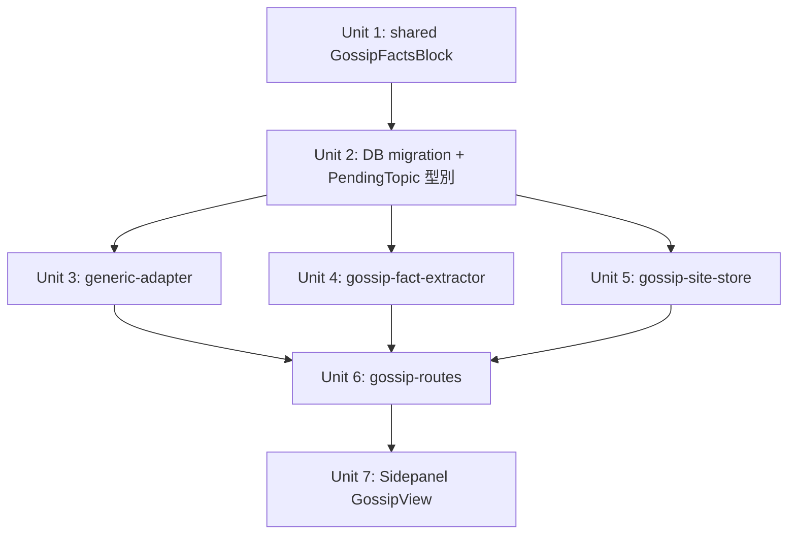

# feat: 吃瓜素材管線 — 用戶自定義站點爬取 + 文章生成

## Overview

將現有 ACG 專屬的 scraper pipeline 擴展為支援「吃瓜」（娛樂八卦）題材的通用管線。
用戶在 Sidepanel 輸入任意吃瓜站點的主站 URL，後端自動發現最新文章、提取吃瓜事實（新
schema），Sidepanel 呈現清單並提供一鍵生成文章入口。

**不替換**現有 ACG pipeline，兩套並存（shared 型別、pending_topics 表共用）。

## Problem Frame

現有 pipeline 硬綁 51acgs.com 和 ACG FactsBlock schema，無法支援吃瓜題材。
需要：通用爬蟲 adapter、吃瓜事實型別、站點管理 API、以及 Sidepanel 入口。
（詳見 origin document）

## Requirements Trace

- R1–R3: 站點管理（後端 CRUD + Sidepanel UI）
- R4–R6: 通用 adapter 資源發現（heuristic + URL 去重 + 最多 20 條）
- R7–R9: GossipFactsBlock 型別 + LLM 事實提取 + pending_topics 存放
- R10–R12: Sidepanel「吃瓜素材」頁籤（清單 + 刷新 + 生成文章按鈕）
- R13–R17: 後端 API（/gossip/sites CRUD + discover + from-url）

成功標準：用戶輸入 URL → Sidepanel 顯示 ≥5 條標題 → 點選後當事人/事件摘要不為 null → 草稿不含 ACG 欄位。

## Scope Boundaries

- **不在範圍**：Quill 填充欄位映射（下一個計劃）
- **不在範圍**：cron 自動排程
- **不在範圍**：per-site 專屬 adapter
- **不在範圍**：吃瓜文章審閱/編輯 UI（沿用現有）
- **已知 gap**：吃瓜草稿可進入 pending 佇列並顯示在 PendingTopicsView，但最終「填充 Quill 欄位 → 發布」需等待下一個計劃完成 Quill 欄位映射；本計劃交付「抓取 + 暫存」而非完整發布閉環。

## Context & Research

### Relevant Code and Patterns

- `packages/backend/src/scraper/adapters/acgs51-adapter.ts` — adapter 完整實作參考，heuristic HTML 解析模式
- `packages/backend/src/scraper/adapters/template-adapter.ts` — generic adapter 的起手模板
- `packages/backend/src/scraper/fact-extractor.ts` — json_schema structured output + two-pass 容錯模式，吃瓜 extractor 直接 fork
- `packages/backend/src/scraper/prompt-store.ts` + `packages/backend/src/utils/json-store.ts` — JsonFileStore 持久化模式，站點設定存儲照此實作
- `packages/backend/src/scraper/pending-store.ts` — `pendingTopicExistsBySourceUrl()` 提供 R5 去重，`PendingTopic.facts` 為 TEXT JSON
- `packages/backend/src/scraper/scraper-routes.ts` — 現有路由結構（手動 if 驗證、鑑權繼承）
- `packages/backend/src/scraper/ssrf-guard.ts` — `safeFetch()` 已封裝私有 IP 阻擋，generic adapter 直接呼叫即可
- `packages/backend/src/migrations/001-initial.sql` + `runner.ts` — migration 執行模式
- `packages/shared/src/facts.ts` — 現有 FactsBlock，新 GossipFactsBlock 獨立新建
- `packages/extension/entrypoints/sidepanel/App.tsx` — view union type + useState 分支，無獨立 router

### Institutional Learnings

- `docs/solutions/` 目前無相關記錄

### External References

- 無需外部研究：本地 adapter、JsonFileStore、Sidepanel 均有成熟範例可循

## Key Technical Decisions

- **API 路徑用 `/gossip/` 不用 `/scraper/`**：現有 `GET /api/v1/scraper/sites` 已返回 in-memory ACG 站點設定，同路徑衝突；新建 `gossip-routes.ts` 掛載在 `/api/v1/gossip/` 下，兩套完全隔離，不需改舊路由。

- **GossipFactsBlock 獨立新檔案**：`shared/src/gossip-facts.ts`，不修改 `facts.ts`；避免 ACG json_schema 被污染，兩套型別各自 export 清晰。

- **pending_topics 加 `domain` 欄位（DB migration）**：在 `PendingTopic` 加 `domain?: 'acg' | 'gossip'`，同步新增 `migrations/008-add-domain.sql` 加 `domain TEXT NOT NULL DEFAULT 'acg'` 欄位，使列表查詢可按 domain 過濾，避免 Sidepanel 吃瓜頁籤混入 ACG 選題。

- **ssrf-guard 無需改動，但需輸入層補位**：`safeFetch()` 內建私有 IP 阻擋，但 `ssrf-guard.ts` 原始碼注釋明確說明存在 TOCTOU 殘差（DNS 解析時間窗口），該殘差在現有 ACG pipeline 靠 `ssrf-allowlist.ts` 補償。對用戶提交的 URL（`POST /gossip/sites` 的 listUrl 和 `POST /gossip/topics/from-url` 的 url），需在輸入驗證層加 IP literal 拒絕：`new URL(input).hostname` 如果是 IP 地址（IPv4 / IPv6 literal）直接返回 400，強制只接受 hostname，消除不需 DNS 的直達私有 IP 路徑。

- **站點設定用 JsonFileStore 持久化**：新建 `gossip-site-store.ts`，存放在 `data/gossip-sites/`，模式與 `prompt-store.ts` 完全一致，啟動後不再 hardcode。

- **URL 去重複用 `pendingTopicExistsBySourceUrl()`**：發現的 URL 逐條查 pending_topics，已存在直接跳過（R5），不另建去重表。

## Open Questions

### Resolved During Planning

- **SSRF 策略**：用戶確認「只禁私有 IP」；`safeFetch()` 已滿足，無需改 guard。（see origin: R2）
- **API 路徑衝突**：`/scraper/sites` GET 已存在，改用 `/gossip/` namespace 解決。
- **DB domain 欄位**：requirements 要求 domain 區分，DB TEXT 型別支援 migration 追加，不影響現有資料（DEFAULT 'acg'）。

### Deferred to Implementation

- **吃瓜站點 heuristic 精準度**：詳情頁 URL 過濾 regex（路徑含數字 ID 或日期段）在不同站點的命中率需實測調整。
- **LLM gossip prompt 召回率**：「當事人」「事件摘要」從不同結構的吃瓜文章中的提取準確率，需用真實文章測試。
- **`computeScore()` 對 GossipFactsBlock 的適用性**：現有評分邏輯 `Object.values(facts).some(v => ...)` 支援任何 object，預期可直接用，但需驗證。

## High-Level Technical Design

> *這是方向性設計指引，非實作規範。實作者以此為背景，不應直接複製。*

```
用戶輸入主站 URL
        │
        ▼
POST /api/v1/gossip/sites            ← gossip-routes.ts
        │  (gossip-site-store.ts 持久化)
        ▼
POST /api/v1/gossip/sites/:id/discover
        │
        ▼
generic-adapter.fetchList(listUrl)   ← 提取 <a href>，path regex 過濾
        │  去重：pendingTopicExistsBySourceUrl()
        │  截斷：最多 20 條
        ▼
返回 discovered URLs 清單
(Sidepanel GossipView 展示)
        │ 用戶點選一條
        ▼
POST /api/v1/gossip/topics/from-url
        │
        ├─ generic-adapter.fetchContent(url)  → RawContent
        │    └─ safeFetch()（ssrf-guard 私有 IP 阻擋）
        │
        └─ gossipExtractFacts(rawContent)     → GossipFactsBlock
             └─ json_schema strict + two-pass fallback
                 │
                 ▼
        savePendingTopic({ domain: 'gossip', facts: GossipFactsBlock, ... })
                 │
                 ▼
        Sidepanel → 現有草稿生成流程
```

## Implementation Units



---

- [ ] **Unit 1: shared — GossipFactsBlock 型別定義**

**Goal:** 在 shared 新增吃瓜事實型別，供後端 extractor 和前端展示使用

**Requirements:** R7

**Dependencies:** 無

**Files:**
- Create: `packages/shared/src/gossip-facts.ts`
- Modify: `packages/shared/src/index.ts`（新增 export）

**Approach:**
- 定義 `GossipFactsBlock` interface，欄位：`當事人`、`事件摘要`、`起因`、`經過`、`結果`、`來源連結`、`發生時間`、`熱度標籤`，全部為 `string | null`
- 定義對應的 `GOSSIP_FACT_KEYS` 常數陣列（與現有 `FACT_ORDER` 模式一致）
- 定義 `GOSSIP_FACTS_SCHEMA`（json_schema 物件，`additionalProperties: false`），供 extractor 直接引用
- 不修改 `facts.ts`

**Patterns to follow:**
- `packages/shared/src/facts.ts` — FactsBlock interface + FACT_ORDER + CORE_FACT_KEYS 模式

**Test scenarios:**
- Happy path: `GossipFactsBlock` 所有欄位可為 string 或 null，型別推導正確
- Edge case: `GOSSIP_FACTS_SCHEMA` 的 `required` 陣列與 `properties` key 一致，無遺漏
- Test expectation: 純型別/常數，無執行邏輯；在 `shared` 的 build + tsc 型別檢查中驗證

**Verification:**
- `pnpm --filter @51publisher/shared build` 成功，`dist/` 含新 export
- `pnpm compile` 全包型別檢查通過

---

- [ ] **Unit 2: backend — DB migration + PendingTopic domain 欄位**

**Goal:** 在 pending_topics 加 `domain` 欄位，使吃瓜 / ACG 選題可分開查詢

**Requirements:** R9（pending_topics 存放 GossipFactsBlock）

**Dependencies:** Unit 1

**Files:**
- Create: `packages/backend/src/migrations/008-add-domain.sql`
- Modify: `packages/backend/src/scraper/pending-store.ts`（型別 + 查詢）
- Modify: `packages/backend/src/scraper/pending-db.ts`（如有 schema hardcode 需更新）
- Modify: `packages/backend/src/scraper/pending-routes.ts`（GET /pending-topics 加 domain? query param，透傳至 listPendingTopics）
- Test: `packages/backend/src/scraper/pending-store.test.ts`（加 domain 相關案例）

**Approach:**
- migration SQL：`ALTER TABLE pending_topics ADD COLUMN domain TEXT NOT NULL DEFAULT 'acg'`（加 NOT NULL + CHECK 確保不存在 NULL，現有資料自動獲得 'acg' 預設值）
- `PendingRow` 加 `domain: string | null`
- `PendingTopic` 加 `domain?: 'acg' | 'gossip'`；`PendingTopicPatch` 同步加 `domain?`
- `rowToTopic()` 映射 domain 欄位
- `savePendingTopic()` 的 INSERT / UPDATE SQL 加 domain 欄位（`@domain`）
- `listPendingTopics()` 加可選 `domain` 過濾參數
- `facts` 欄位型別從 `FactsBlock` 改為 `FactsBlock | GossipFactsBlock`（runtime 不驗證，type assertion 即可）

**Patterns to follow:**
- `packages/backend/src/migrations/001-initial.sql` — migration 格式
- `packages/backend/src/migrations/runner.ts` — migration 自動執行（啟動時掃描目錄）

**Test scenarios:**
- Happy path: 舊 pending topic（無 domain 欄位）讀取後 domain 為 `undefined` 或 `'acg'`
- Happy path: 儲存 domain: 'gossip' 的 topic，`listPendingTopics(50, undefined, undefined, 'gossip')` 只返回 gossip 項
- Edge case: migration 在已有資料的 DB 上重跑，舊資料 domain 預設值為 'acg'（DEFAULT 已設定）
- Integration: `savePendingTopic` + `listPendingTopics` 端對端資料完整性
- Integration: `GET /api/v1/pending-topics?domain=acg` 不返回 domain='gossip' 的條目（防止 PendingTopicsView ACG 視圖被污染）

**Verification:**
- `pnpm test` 全包通過，pending-store 新增案例全綠
- 手動在 test DB 執行 migration，確認舊行 domain = 'acg'

---

- [ ] **Unit 3: backend — generic-adapter**

**Goal:** 通用 HTML adapter，可爬取任意公開站點的清單頁和詳情頁，取代 acgs51 hardcode

**Requirements:** R4, R6

**Dependencies:** Unit 2（僅測試時需 pending-store 去重）

**Files:**
- Create: `packages/backend/src/scraper/adapters/generic-adapter.ts`
- Test: `packages/backend/src/scraper/adapters/generic-adapter.test.ts`

**Approach:**
- **不實作 `SiteAdapter` interface**：`generic-adapter` 是獨立模組，只由 `gossip-routes.ts` 直接呼叫，不掛入現有 ACG adapter registry，避免破壞 `fetchList()` 的 `string[]` 合約（ACG adapter 返回 string[]，gossip adapter 需返回 `{url, title?}[]`）
- `fetchList(listUrl)`：回傳型別改為 `{ url: string; title?: string }[]`（而非純 URL 字串），把列表頁 `<a>` 標籤的 anchor text 順帶帶回（列表頁通常以文章標題為 anchor，比 URL 末段數字有意義得多）；提取所有 `<a href>`，過濾路徑符合 `DETAIL_PATH_RE`（複用 acgs51 的 `/^\/[a-z0-9_-]+\/\d+(?:\.html?)?/i` 模式），同時支援日期型路徑 `/^\/(\\d{4}\/\\d{2}\/|\\d{8})/`；同 hostname only；去除重複；截斷 20 條
- `fetchContent(url)`：`safeFetch()` 取 HTML，提取 `<title>` / `<h1>` 為 title，提取 meta description + `og:description` + 主要內容 div 為 body，提取 `og:image` 為 coverImageUrl，提取 `article:published_time` / `og:updated_time` 為 metadata.publishedTime
- User-Agent 與 acgs51 保持一致（`Mozilla/5.0 ...`）
- 不走 `ssrf-allowlist.ts`，只走 `safeFetch()`（已內建私有 IP 阻擋）

**Patterns to follow:**
- `packages/backend/src/scraper/adapters/acgs51-adapter.ts` — `fetchList` + `fetchContent` 完整模式
- `packages/backend/src/scraper/adapters/template-adapter.ts` — 起手骨架

**Test scenarios:**
- Happy path: mock `safeFetch` 返回含有多條 `<a href>` 的 HTML，`fetchList` 正確返回過濾後 URL
- Edge case: HTML 超過 20 條詳情頁 URL，`fetchList` 截斷為 20
- Edge case: `<a href>` 都是外站連結，`fetchList` 返回空陣列
- Edge case: `safeFetch` 返回非 200 status，`fetchList` 返回空陣列（不拋出）
- Happy path: `fetchContent` 從有 `og:title` + `og:description` + `og:image` 的 HTML 中正確提取三個欄位
- Error path: `fetchContent` 在 `safeFetch` 返回 4xx 時拋出含 HTTP status 的 Error

**Verification:**
- `npx vitest run packages/backend/src/scraper/adapters/generic-adapter.test.ts` 全通過
- `pnpm compile` 型別無錯誤

---

- [ ] **Unit 4: backend — gossip-fact-extractor**

**Goal:** 吃瓜專用 LLM 事實提取器，從 RawContent 提取 GossipFactsBlock

**Requirements:** R8

**Dependencies:** Unit 1

**Files:**
- Create: `packages/backend/src/scraper/gossip-fact-extractor.ts`
- Test: `packages/backend/src/scraper/gossip-fact-extractor.test.ts`

**Approach:**
- fork `fact-extractor.ts`，替換 `FACTS_SCHEMA` 為 `GOSSIP_FACTS_SCHEMA`（來自 shared），替換提取 prompt
- Prompt 要點：只從原文提取，不編造；「當事人」從標題/正文找人名；「事件摘要」一兩句概括；缺失欄位設 null；「熱度標籤」如「出軌」「解約」「撕逼」「公開戀情」等，從文章情緒/關鍵詞推斷
- 保留 two-pass 容錯邏輯（strict 失敗 → `json_object` 模式，confidence 上限 0.3）
- 函數簽名：`gossipExtractFacts(raw: RawContent, config: LLMConfig): Promise<ExtractedGossipFacts>`
- 返回型別：`{ facts: GossipFactsBlock; confidence: number; coverImageUrl?: string; extractionMode: 'strict' | 'fallback' }`

**Patterns to follow:**
- `packages/backend/src/scraper/fact-extractor.ts` — 完整 fork 起點

**Test scenarios:**
- Happy path: mock LLM 回應含合法 JSON，`gossipExtractFacts` 返回 confidence > 0.5，當事人 / 事件摘要不為 null
- Error path: strict 模式 LLM 返回 HTTP 400，fallback 到 json_object，confidence ≤ 0.3
- Edge case: LLM 回應 JSON 中所有欄位為 null，confidence 接近 0
- Edge case: `rawContent.body` 超過 8000 字，sliced 後仍能正確提取

**Verification:**
- `npx vitest run packages/backend/src/scraper/gossip-fact-extractor.test.ts` 全通過

---

- [ ] **Unit 5: backend — gossip-site-store**

**Goal:** 吃瓜站點設定的 JSON 持久化存儲（CRUD）

**Requirements:** R1

**Dependencies:** 無（純存儲層）

**Files:**
- Create: `packages/backend/src/scraper/gossip-site-store.ts`
- Test: `packages/backend/src/scraper/gossip-site-store.test.ts`

**Approach:**
- 定義 `GossipSiteConfig` interface：`{ id, name, listUrl, enabled, createdAt, updatedAt }`
- 使用 `JsonFileStore<GossipSiteConfig>`，目錄 `data/gossip-sites/`（讀自 `PUBLISHER_DATA_DIR`）
- export：`listGossipSites()`, `getGossipSite(id)`, `saveGossipSite(config)`, `deleteGossipSite(id)`
- 測試時透過 `PUBLISHER_DATA_DIR` env var 指向臨時目錄（與 `prompt-store.ts` 測試模式相同）

**Patterns to follow:**
- `packages/backend/src/scraper/prompt-store.ts` — JsonFileStore 完整模式
- `packages/backend/src/test-setup.ts` — 臨時目錄 setup

**Test scenarios:**
- Happy path: `saveGossipSite` 寫入 → `getGossipSite` 讀回，資料完整
- Happy path: `listGossipSites` 返回所有已存站點
- Edge case: `deleteGossipSite` 刪除不存在的 id，返回 false 不拋出
- Edge case: `listGossipSites` 在空目錄返回空陣列

**Verification:**
- `npx vitest run packages/backend/src/scraper/gossip-site-store.test.ts` 全通過

---

- [ ] **Unit 6: backend — gossip-routes 及 app 註冊**

**Goal:** 實作 R13–R17 的 5 個 API 端點，串接 site-store、generic-adapter、gossip-extractor

**Requirements:** R1, R4, R5, R6, R13–R17

**Dependencies:** Unit 3, 4, 5

**Files:**
- Create: `packages/backend/src/scraper/gossip-routes.ts`
- Modify: `packages/backend/src/index.ts`（`registerGossipRoutes(app)`）
- Test: `packages/backend/src/scraper/gossip-routes.test.ts`

**Approach:**

五個端點：

| Method | Path | 行為 |
|--------|------|------|
| POST | `/api/v1/gossip/sites` | body `{name, listUrl}` → validate → saveGossipSite → 返回 site |
| GET | `/api/v1/gossip/sites` | listGossipSites() → 返回陣列 |
| DELETE | `/api/v1/gossip/sites/:id` | deleteGossipSite(id) → 404 if not found |
| POST | `/api/v1/gossip/sites/:id/discover` | 取 site → generic-adapter.fetchList(listUrl) → 逐條 pendingTopicExistsBySourceUrl 去重 → 截斷 20 → 返回 URLs |
| POST | `/api/v1/gossip/topics/from-url` | body `{url, siteName}` → generic-adapter.fetchContent → gossipExtractFacts → savePendingTopic(domain:'gossip') → 返回 pendingTopic |

驗證：
- POST /gossip/sites：`name` 和 `listUrl` 必填；`listUrl` 用 `new URL()` 解析（若無效返回 400）；`new URL(listUrl).hostname` 若為 IP literal（IPv4 / IPv6）直接返回 400；不走 allowlist，`safeFetch` 在 discover 階段自動阻擋私有 IP
- POST /gossip/topics/from-url：`url` 和 `siteName` 必填；同樣進行 IP literal 拒絕驗證（`new URL(url).hostname` 是 IP → 400）
- DELETE /gossip/topics: 返回標準錯誤格式（`err()` helper）
- LLM env var 檢查（`LLM_ENDPOINT` / `LLM_API_KEY`）同現有 scraper-routes 模式

**Patterns to follow:**
- `packages/backend/src/scraper/scraper-routes.ts` — 手動 if 驗證、`err()` helper、鑑權繼承模式
- `packages/backend/src/index.ts` — `register*Routes(server)` 模式

**Test scenarios:**
- Happy path: `POST /gossip/sites` 含有效 name + listUrl → 201 返回 site with id
- Error path: `POST /gossip/sites` 缺 listUrl → 400
- Error path: `POST /gossip/sites` listUrl 為 IP literal URL（如 `http://192.168.1.1/`）→ 輸入驗證層直接返回 400（`new URL().hostname` 是 IP literal，與 Key Technical Decisions 一致）
- Happy path: `POST /gossip/sites/:id/discover` mock generic-adapter 返回 25 URL → response 截斷為 20
- Happy path: discover 中 5 條 URL 已在 pending_topics → 這 5 條被過濾，返回 ≤ 20 條新 URL
- Happy path: `POST /gossip/topics/from-url` mock fetchContent + gossipExtractFacts → PendingTopic domain='gossip' 被存入
- Error path: `GET /gossip/sites/:id` 不存在 → 404

**Verification:**
- `npx vitest run packages/backend/src/scraper/gossip-routes.test.ts` 全通過
- `pnpm compile` 無型別錯誤
- 手動 curl 測試 POST sites → discover → from-url 完整流程

---

- [ ] **Unit 7: extension — Sidepanel GossipView + App.tsx 頁籤**

**Goal:** 新增「吃瓜素材」頁籤，提供站點管理 + 資源清單 + 生成文章入口（R3, R10–R12）

**Requirements:** R3, R10, R11, R12

**Dependencies:** Unit 6（後端 API）

**Files:**
- Create: `packages/extension/entrypoints/sidepanel/GossipView.tsx`
- Modify: `packages/extension/entrypoints/sidepanel/App.tsx`（union type + toolbar 按鈕 + view 分支）
- Modify: `packages/extension/entrypoints/sidepanel/PendingTopicsView.tsx`（fetchPendingTopics 加 domain=acg 參數）
- Test: `packages/extension/entrypoints/sidepanel/GossipView.test.tsx`

**Approach:**
- `App.tsx`：view union type 加 `"gossip"`；在 toolbar 加「吃瓜」tab 按鈕；加 `view === 'gossip' && <GossipView />`
- `GossipView.tsx` 兩個子區塊：
  1. **站點管理**：列出已存站點（GET /gossip/sites）；文字輸入框 + 「新增站點」按鈕（POST /gossip/sites）；每條站點旁有「刪除」
  2. **素材清單**：每個啟用站點各顯示已發現 URLs 的 title；「刷新」按鈕 → 呼叫 POST /gossip/sites/:id/discover；每條資源旁有「生成文章」按鈕 → 呼叫 POST /gossip/topics/from-url → 成功後切換至現有 PendingTopicsView（`setView('pending')`）
- 狀態管理：純 useState，不引入新狀態管理庫
- 清單 title 來源：discover 端點返回 URL 陣列，前端再呼叫 GET URL 取 title（或後端在 discover 回應中直接帶 `{url, title?}`，title 來自 generic-adapter.fetchList 返回的 URL 本身無 title，**決策**：discover 只返回 URL，前端先顯示 URL 末段作為 placeholder title；「生成文章」點擊後 from-url 回傳完整 PendingTopic.title 再更新顯示）
- API 呼叫用現有 `authHeaders()` + 401 清 token 模式

**Patterns to follow:**
- `packages/extension/entrypoints/sidepanel/PendingTopicsView.tsx` — 清單展示 + API 呼叫模式
- `packages/extension/entrypoints/sidepanel/Settings.tsx` — 表單輸入模式
- `packages/extension/entrypoints/sidepanel/App.tsx` — view 切換模式

**Test scenarios:**
- Happy path: 渲染 GossipView，mock GET /gossip/sites 返回 2 站點 → 顯示 2 筆站點列表
- Happy path: 輸入 name + listUrl 點新增 → mock POST /gossip/sites 201 → 站點列表更新
- Happy path: 點「刷新」→ mock discover 返回 5 URL → 清單顯示 5 條（以 URL 末段為佔位標題）
- Happy path: 點「生成文章」→ mock POST from-url 成功 → view 切換至 'pending'
- Error path: POST /gossip/sites 返回 400（缺欄位）→ 顯示錯誤訊息，不 crash
- Loading state: 刷新/生成過程中按鈕顯示 loading 狀態，防止重複提交
- Empty state: GET /gossip/sites 返回空陣列 → 顯示「尚未新增站點」提示文字
- Error state: discover API 返回 500 → 顯示錯誤橫幅（banner），清單不清空保留上次結果

**Verification:**
- `npx vitest run packages/extension/entrypoints/sidepanel/GossipView.test.tsx` 全通過
- `pnpm dev:extension` 啟動後在 Chrome 中可見「吃瓜」頁籤，基本互動無 console error
- `pnpm compile` 無型別錯誤

---

## System-Wide Impact

- **Interaction graph**: `gossip-routes.ts` 新增呼叫 `pendingTopicExistsBySourceUrl()`（現有函數）和 `savePendingTopic()`（現有函數，加了 domain 欄位）；其餘現有 ACG 路由未受影響
- **Error propagation**: generic-adapter 的 `fetchContent` 拋出 HTTP 錯誤由 gossip-routes 捕獲，返回標準 500 格式；`gossipExtractFacts` fallback 容錯，不拋出
- **State lifecycle risks**: `savePendingTopic` upsert 邏輯以 `source_url` 為唯一鍵，gossip / ACG 共用同一張表，domain 欄位不影響 upsert 邏輯（已驗證：`source_url` unique constraint 不重複爬取）
- **API surface parity**: 新增 `/gossip/` 路徑族，不修改任何現有 `/scraper/` 路徑，擴展端的插件消費者（Sidepanel）需增加對應 API 呼叫
- **Integration coverage**: Unit 6 需整合測試「discover → URL 去重 → 截斷」的完整流程，避免邊界值錯誤
- **Unchanged invariants**: 現有 ACG 發帖流程（batch-orchestrator、publish-orchestrator、field-mapping、Quill 填充）不受任何影響；`FactsBlock` schema 不變

## Risks & Dependencies

| Risk | Mitigation |
|------|------------|
| 吃瓜站點 HTML 結構多樣，heuristic URL 過濾命中率差 | generic-adapter 支援兩種 regex（數字 ID + 日期路徑）；最差情況 UI 顯示 0 條，用戶可手動輸入單條 URL from-url |
| LLM gossip prompt 提取吃瓜事實準確率不穩定 | two-pass fallback 確保不 crash；confidence 欄位讓用戶知道品質，低分條目可手動調整 |
| DB migration 在生產環境失敗（ALTER TABLE 鎖表） | SQLite 的 `ALTER TABLE ADD COLUMN` 是非阻塞操作，對小型單用戶 SQLite 無鎖表風險 |
| `pending_topics` 混入吃瓜 / ACG 后渲染錯誤 | `pending-routes.ts` 的 GET 端點加 `domain?` query param；`PendingTopicsView` 呼叫時帶 `domain=acg`；`GossipView` 呼叫時帶 `domain=gossip`；三端協調確保過濾有效 |
| DNS rebinding 攻擊 `POST /gossip/topics/from-url`（`safeFetch()` TOCTOU 殘差） | 輸入驗證層拒絕 IP literal URL（`new URL().hostname` 是 IP 直接返回 400），強制 hostname only，顯著降低攻擊面；DNS rebinding 殘差在單用戶威脅模型下接受 |

## Documentation / Operational Notes

- `.env.example` 無需新增變數（LLM_ENDPOINT / LLM_API_KEY 已存在）
- `data/gossip-sites/` 目錄由 JsonFileStore 自動創建（首次寫入時 mkdir -p）
- migration `008-add-domain.sql` 在應用啟動時由 migration runner 自動執行

## Sources & References

- **Origin document:** [docs/brainstorms/2026-06-12-001-gossip-site-pipeline-requirements.md](../brainstorms/2026-06-12-001-gossip-site-pipeline-requirements.md)
- Related code: `packages/backend/src/scraper/adapters/acgs51-adapter.ts`
- Related code: `packages/backend/src/scraper/fact-extractor.ts`
- Related code: `packages/backend/src/scraper/prompt-store.ts`
- Related code: `packages/extension/entrypoints/sidepanel/App.tsx`
