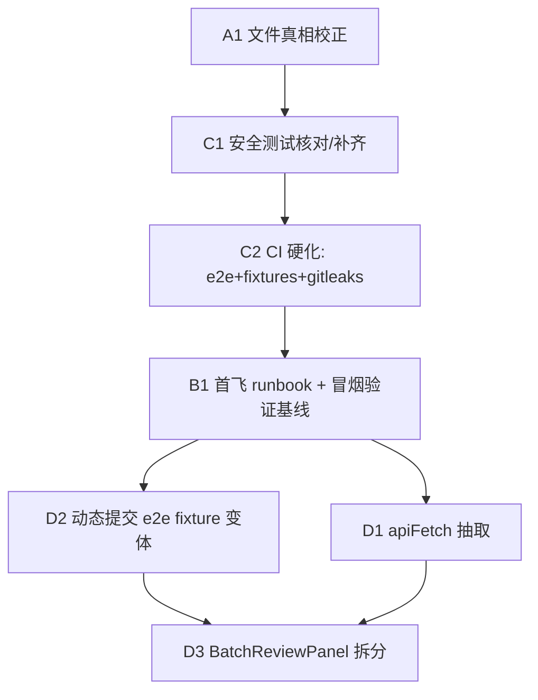

# refactor: 全面优化迭代 — 上线就绪修复

## Overview

一次四维度体检（安全/技术债/测试/DX-Ops）确认：51publisher 的核心逻辑（三世界模型、防幻觉事实注入、安全闸门链）健康，风险集中在边缘——项目文件与现实脱节、首飞运营未执行、CI/测试被动漂移、扩展侧有重复样板与巨组件。

本计划按文件审查后定的顺序 **A（真相校正）→ C（CI/测试硬化）→ B（首飞冒烟验证基线）→ D（代码重构）** 落地。E 组（P2 卫生）已拆到跟进迭代，不在本轮。核心排序逻辑：先让文件可信、补好测试与 CI，用一次真实发布**证实「可上线」假设**，再在验证过的填充基线上做重构——避免在「从没真发过一篇」的状态下先大改填充 UI。

## Problem Frame

受影响者是单人运营者。当前两个硬现实：(1) `CLAUDE.md` / `.ai-memory` 仍写「remote 是 GitLab、活跃 CI 是 `.gitlab-ci.yml`」，但仓库**已迁到 GitHub**（`git remote -v` = `github.com/redredchen02-rgb/51publisher`，`.gitlab-ci.yml` 不存在，活跃 CI 是 `.github/workflows/ci.yml`）——照旧文件行事会浪费除错时间；(2) 项目**从未真正发布过一次**，「可上线」是愿望而非事实。详见 origin: `docs/brainstorms/2026-06-15-project-optimization-iteration-requirements.md`。

## Requirements Trace

- R1（A）. 修正 `CLAUDE.md` / `.ai-memory/*` 的 GitLab→GitHub、CI、路由注册位置陈述。
- R2（A）. 修正路由注册描述：实际在 `app.ts`，`index.ts` 仅 `registerDraftRoutes`。
- R3/R4（B）. 首飞 runbook：密钥轮换（含 LLM key **撤销旧 key + 清史**，非仅生成新 key）、真实发布冒烟、CORS 收紧、push；衔接 06-11-004 Unit 5（路径 B 真实批次验收，仍未完成）。
- R5（C）. CI 增加 `test:e2e` + `check:fixtures` job。
- R6/R7（C）. CI 加无条件强制 gitleaks job（本地 hook 已由 `postinstall` 设 `core.hooksPath`，仅作快速反馈）。
- R8（C）. 核对/补齐 SSRF DNS-rebind 与 grounding-gate「host 不在 facts → block」测试。
- R9（D）. 加动态提交 handler 的 e2e fixture 变体（R11 硬前置）。
- R10（D）. 抽 `apiFetch()` 统一 6 client 样板。
- R11（D）. 拆 `BatchReviewPanel.tsx`（保 gate-failed UI 行为）。

## Scope Boundaries

- **不**重写安全闸门链 / 三世界模型（体检确认健康）。
- **不**新增产品功能。
- **不**做 E 组 P2 卫生（route 归位 / 清 deprecated / 归档计划 / 观测性，含 pino redaction）——整组拆到跟进迭代，单独开计划（origin brainstorm 的 R12-R16 范畴，不在本计划 trace）。
- **不**给 manifest 新增 `key`：06-11-004 已决「用现有 `EXTENSION_KEY` 派生 id + 逗号分隔多值 allowlist」，扩展 id 已固定，无需改 manifest（见 Key Decisions）。
- 密钥轮换 / 真实 push 等**不可逆运营动作**由运营者亲手执行；本计划只产代码侧前置与 runbook。

## Context & Research

### Relevant Code and Patterns

**A — 文件真相**
- `CLAUDE.md:13`（GitLab/`.gitlab-ci.yml` 误述）、`CLAUDE.md:69`（路由「在 index.ts 统一 register*Routes」误述）。
- `.ai-memory/project_51publisher.md:14, 19, 27`（GitLab push / `.gitlab-ci.yml 已加` 等过期陈述）。
- `AGENTS.md` 已干净（无需改）。历史 `docs/brainstorms/*` `docs/plans/*` 的 GitLab 引用是**带日期的历史档**，保留不改。
- 实证：`app.ts:85–97` 是全部 `register*Routes` 调用处；`index.ts:14` 仅 `registerDraftRoutes(app)`。

**C — CI/测试**
- `.github/workflows/ci.yml`：单 job `verify`（install → shared build → `-r compile` → lint+`git diff --exit-code` → `-r test`）。**缺** `test:e2e` 与 `check:fixtures`。
- `.github/workflows/release.yml`：`pnpm -r test` 带 `continue-on-error: true`（测试不阻断发布——可顺带硬化）。
- 根 `package.json`：已有 `"postinstall": "git config core.hooksPath scripts/git-hooks"`（**勿重复造，勿引 husky——06-09-001 已否决**）。
- `packages/extension/package.json`：`test:e2e`、`check:fixtures`（`bash scripts/check-fixture-secrets.sh`）、`check:fixture-drift`。
- **CWD 陷阱**：`scripts/check-fixture-secrets.sh` 在 **repo 根**，只在 CWD=根时解析；CI step 须在根目录跑。
- `scripts/git-hooks/pre-push`：已优先用 `gitleaks`，未装则 regex 兜底。
- 测试结构镜像：`packages/backend/src/scraper/ssrf-guard.test.ts`（node env，表驱动 IP allow/block）；`packages/extension/lib/grounding-gate.test.ts`（`// @vitest-environment jsdom`，`draftFrom(facts, slots)` helper）。

**B — 首飞**
- dry-run 入口：`packages/extension/lib/publish-orchestrator.ts` `orchestratePublish()`（line 29，dry-run 返回 `{ ok:true, dryRun:true }`）；`lib/safety-gate.ts` `canSubmit()`（line 105）。
- 运营 runbook 现落点：`AGENTS.md:8+`（fresh clone / env / JWT 生成命令）、`packages/backend/.env.example`。
- 真发踩坑（06-11-004 学到）：后台是 **layuiAdmin iframe** 架构（字段找不到先想 iframe，走 `lib/frame-resolve.ts`）；改 content script 须「重载扩展 + 刷新后台页」；`filterReentrantTopics` 会静默过滤已发布题目，重跑同批需 `bypassReentry`。

**D — 重构**
- 6 client 全在 `packages/extension/lib/`：`auth-client.ts` `config-client.ts` `gossip-client.ts` `pending-client.ts` `prompt-client.ts` `published-posts-client.ts`。
- 共享三 helper：`getBackendUrl()`（`lib/backend-url.ts`，含 module 缓存 + `127.0.0.1:3001` fallback）、`fetchWithTimeout`（`@51publisher/shared` ← `shared/src/fetch.ts`）、`getAuthHeaders`/`clearToken`（`lib/auth-client.ts`）。
- 规范 per-request 形状（`pending-client.ts:86–97`）：`getAuthHeaders()` → `getBackendUrl()` → `fetchWithTimeout(url,{...headers})` → `if (res.status===401){ await clearToken(); ...}`，每方法重复。
- 重构杠杆（helper token 计数）：pending 18 / gossip 18 / config 10 / prompt 10 / auth 3 / **published-posts 0（异类，不用共享 helper——重构时排除或单独核实）**。
- 现有测试镜像：`pending-client.test.ts`、`published-posts-client.test.ts`。
- 批量视图：`packages/extension/entrypoints/sidepanel/{BatchReviewPanel,BatchView,TodayBatchView}.tsx`；编排在 `lib/batch-orchestrator.ts`。
- 配置锚：`wxt.config.ts:25–35`（`EXTENSION_KEY` 默认值 + `key:`）；`vitest.e2e.config.ts:12`（`environment:"jsdom"`）；e2e fixture `tests/e2e/fixtures/{webarticle-add.html,selectors.ts}`。

### Institutional Learnings

- `docs/plans/2026-06-11-005`（**completed**）：grounding-gate「重写绕过」洞已修（`assembledDraftSnapshot` 持久化重写前原稿）。**残留暴露面（已知接受）**：重写在合格稿上新引入的幻觉不过任何 gate，靠人工审核——R8 别把它当新 bug。
- `docs/plans/2026-06-11-004`（active）：CORS（Unit 4 `[x]`）= 逗号分隔多值 + dev/打包双 ID，**不加 manifest key**；**Unit 5（路径 B 真实批次验收）仍 `[ ]`** —— B 组衔接它。
- `docs/plans/2026-06-10-002`：SSRF（U12 `[x]`）用自定义 undici `Agent({connect:{lookup}})` 钉死 IP；**铁律**：fetch 与 Agent 必须同一 npm undici 包；私网判断勿用 npm `ip` 包（CVE 误判）。
- `docs/plans/2026-06-09-001`：husky 引入、e2e 自动化进 CI、前端 CSS Modules/拆分——多数**当年延后或否决**。本轮把 e2e 推进 CI 是**推翻该决定**（理由：现为 GitHub Actions + jsdom，旧 GitLab runner 鉴权坑已不适用）。
- 通用坑：改 shared types 后须先 `pnpm --filter @51publisher/shared build` 再验证（否则读过期 dist 假绿）；后端测试 `cleanData()` 会 `rmSync data/`，审计/备份绝不落 `data/`。
- `docs/solutions/` 几乎为空——本轮落地后应把 CI/SSRF/CORS 可复用经验沉淀进去。

### External References

无。本轮全部基于 repo 内既有模式（vitest / Fastify / WXT / 现成 gitleaks hook），不需外部研究。

## Key Technical Decisions

- **排序 A→C→B→D，首飞前置于重构**：北极星「可信上线」只有 B 能达成；先冒烟验证填充基线真实有效，再动 D 重构。不可逆运营动作（轮换/CORS/push）仍由运营者后段执行。（see origin: Key Decisions）
- **e2e 进 CI 推翻 06-09-001**：现 CI 是 GitHub Actions + e2e 跑 jsdom（非真浏览器，见 `vitest.e2e.config.ts:12`），无需 headless，旧 GitLab runner 鉴权坑不适用。
- **CORS 不改 manifest**：沿用 06-11-004 决定（`EXTENSION_KEY` 已固定 id + 逗号分隔 allowlist 已原生支持），避免改动已装扩展身份。R3 runbook 只需把 dev+打包 id 填进 `CORS_ORIGIN`。
- **gitleaks「且」非「或」**：本地 hook（`postinstall` 已设）作快速反馈，CI 加**固定版本、无条件 fail-pipeline** 的 gitleaks job 作强制闸——拦截不依赖任何 clone 端配置。
- **apiFetch 保 fail-closed 双写**：抽取必须保留 `handleUnauthorized`/`clearToken` 链路与本地 PRIMARY 语义；测试 mock `auth-client.getToken` 避免真实 chrome API。`published-posts-client`（0 helper 使用）单独核实再决定是否纳入。
- **R9 是 R11 硬前置**：BatchReviewPanel 拆的正是提交手势/审批栏/diff 等互动，落在 jsdom e2e 现盲区；不先闭合 R9，R11「零回归」无法自动验证。

## Open Questions

### Resolved During Planning

- e2e 是否需 headless 浏览器？**否**——`vitest.e2e.config.ts:12` 已是 jsdom，CI 只需确认 jsdom 下 Quill 依赖可装。
- 扩展 id 是否固定？**默认 key 下是**——`wxt.config.ts` 硬编 `EXTENSION_KEY` 默认值 → id 确定；CORS 用其派生 id。**唯一残留变量**：CI/release 是否经 env 覆盖 `EXTENSION_KEY`（见 Deferred）——若覆盖，dev/prod id 不同，allowlist 须含两者；B1 push 前必须定。
- git hook 自动启用要不要新建脚本？**否**——根 `package.json` 已有 `postinstall` 设 `core.hooksPath`；真缺口仅 CI 侧无条件 gitleaks。
- A 组要不要改历史 brainstorm/plan 的 GitLab 引用？**否**——历史带日期档保留，只改 `CLAUDE.md` + `.ai-memory`（活跃指南）。

### Deferred to Implementation

- `scripts/check-fixture-secrets.sh` 实际检测逻辑细节（C2 接线前 `cat` 确认，决定 CI step CWD 与调用方式）。
- `ssrf-guard.test.ts` 现有用例是否已含「多记录 DNS 含一私网」与「DNS-rebind」——C1 先读测试再决定补哪几条，勿重复造。
- CI/release 构建是否经 env 覆盖 `EXTENSION_KEY`（决定 dev 与 prod 的 `chrome-extension://<id>` 是否一致）——B1 runbook 标注待运营者确认。
- BatchReviewPanel 拆分以哪个 state 容器为锚（现有 hook vs 新 context）——D3 读代码后定，视为硬前置非细节。

## Implementation Units

- [x] **Unit A1: 文件真相校正**

**Goal:** 让 `CLAUDE.md` / `.ai-memory` 准确反映 GitHub remote、活跃 CI、路由注册位置。

**Requirements:** R1, R2

**Dependencies:** None

**Files:**
- Modify: `CLAUDE.md`（line 13 GitLab→GitHub + 活跃 CI `.github/workflows/ci.yml`；line 69 路由「app.ts 注册，index.ts 仅 registerDraftRoutes」）
- Modify: `.ai-memory/project_51publisher.md`（line 14/19/27 去 GitLab、改 GitHub push、修正「.gitlab-ci.yml 已加」反述）

**Approach:**
- 逐行替换；措辞勿写「全部路由移到 app.ts」（会造新漂移），写「`register*Routes` 集中在 `app.ts:85–97`，`index.ts:14` 仅在启动路径单独调 `registerDraftRoutes(app)`」——**说明 index.ts 为何独留这一条**（启动路径单独挂载），使不对称读起来是有意而非新漂移。
- 保留历史 `docs/` 档不动。

**Test scenarios:**
- Test expectation: none — 纯文档修正，无行为变更。验收用 grep 而非单测。

**Verification:**
- `git grep -n -i 'gitlab\|\.gitlab-ci' CLAUDE.md .ai-memory/` 零命中；CI/路由描述与 `app.ts:85–97` / `index.ts:14` 一致。

- [x] **Unit C1: 安全边角测试核对与补齐**

**Goal:** 核对 SSRF DNS-rebind 与 grounding host 测试覆盖，仅补真正未覆盖的路径，并产出一份覆盖说明（即使「全已覆盖」也有交付物）。

**Requirements:** R8

**Dependencies:** A1（建议先校正文件）。**注**：C2 不硬依赖 C1 的测试内容产出——C2 的 CI 接线是独立基建；二者真实关系是「C1 先让 backend/extension 测试基线已知全绿」，可与 C2 配置编写并行，仅在 C2 把 e2e/test job 设为阻断前需 C1 绿。

**Files:**
- Modify/Test: `packages/backend/src/scraper/ssrf-guard.test.ts`（按核对结果）
- Modify/Test: `packages/extension/lib/grounding-gate.test.ts`（很可能无需改，见下）
- Create: 覆盖说明（写入本计划落地记录或 `docs/solutions/`）

**Approach:**
- **grounding「host 不在 facts → block」已存在**：`grounding-gate.test.ts:60–68`（`注入无来源连结 → 拦`，构造 `href="https://evil.com/x"` 断言 `reasons` 含「无来源连结」）。本项**降级为核对确认**，仅在发现 host-集合 的未覆盖变体时才补，勿造重叠用例。
- **SSRF rebind 的测试面要先确认**：`ssrf-guard.test.ts` 现 14 例全是字符串 IP 表驱动 `assertUrlSafe` + `vi.stubGlobal` mock fetch 测 redirect-to-loopback，**无 `dns.lookup` mock**。rebind/多记录防护实际在 `ssrf-guard.ts` 的自定义 undici `Agent({connect:{lookup}})` 钉死 IP 里——而 `assertUrlSafe` 判断的是已给定 IP/host 字符串，**mock `dns.lookup` 未必改变其行为**。实施前先读 `assertUrlSafe` 是否真触发 DNS 解析：若否，多记录/rebind 用例属于针对 Agent lookup 钩子的**集成测试**（新测试面），或记录「已由 Agent IP-pinning 覆盖」；不要硬塞进现有表驱动文件。

**Execution note:** 先核对再补——避免与 06-10-002（SSRF）/06-11-005（grounding，已 completed）已落地用例重复。**最小交付物**：一份覆盖说明，逐条标注每个目标场景是「已覆盖（文件:行）」还是「新增（路径）」。

**Patterns to follow:** `ssrf-guard.test.ts` 表驱动；`grounding-gate.test.ts` 的 `// @vitest-environment jsdom` + `draftFrom`。

**Test scenarios:**
- 核对：grounding host-not-in-facts → 确认 `grounding-gate.test.ts:60–68` 已覆盖（预期无需新增）。
- 核对：SSRF 多记录 DNS / rebind → 先判定测试面（assertUrlSafe vs Agent lookup 集成测试），记录结论。
- 新增（仅当上面判定为未覆盖）：针对 Agent lookup 钩子的集成测试，mock lookup 返回含私网 IP → 期望 `SsrfError`。

**Verification:** `pnpm --filter publisher-backend test` + 扩展 grounding 测试全绿；产出覆盖说明，每个目标场景有「已覆盖/新增」明确结论（不留「假设已覆盖」）。

- [x] **Unit C2: CI 硬化（e2e + check:fixtures + 无条件 gitleaks）**

**Goal:** 把产品核心风险（填充正确性、防夹带机密）从「只在本地验」搬进 CI。

**Requirements:** R5, R6, R7

**Dependencies:** C1 绿（在把 e2e/test job 设为阻断前，测试基线须已知全绿）。CI 配置编写本身可与 C1 并行。

**Files:**
- Modify: `.github/workflows/ci.yml`（`verify` job 后增 step 或并列 job：`pnpm --filter publisher-fill-assistant test:e2e`；在 **repo 根** 跑 `pnpm --filter publisher-fill-assistant check:fixtures`）
- Modify: `.github/workflows/ci.yml`（增固定版本 gitleaks job，无条件、失败即 fail）
- Modify（**必做**，非可选）: `.github/workflows/release.yml`（去掉测试 `continue-on-error: true` 使测试阻断发布——这是「可信上线」最直接的一条）。**注**：release.yml 有 **两处** `continue-on-error: true`（约 line 40 test step + line 50 另一 step），实施前确认 line 50 对应哪个 step、是否一并硬化。

**Approach:**
- e2e 在 jsdom 下跑（无需 headless）；接现有 install→shared build 之后。
- `check:fixtures` 注意 CWD 陷阱：脚本在 repo 根，CI step 须 `working-directory:` 显式设为仓库根。
- **gitleaks 范围明确**：用 pin 版本 action/二进制；(1) 对 push/PR 扫**完整变更文件**（非仅行 delta，避免 false-negative）；(2) C1 清史后跑**一次全史扫描**确认旧 key 已除；(3) 在所有 PR 与 push 上跑（含 main），命中即红。本地 hook 维持快速反馈层。

**Execution note:** e2e 进 CI 推翻 06-09-001「保持手动」决定——在 PR/commit 说明理由（GitHub Actions + jsdom，旧 GitLab runner 鉴权坑已不适用）。

**Test scenarios:**
- Integration（破坏性手动验收，非 none）：分支引入一处 fixture 含假密钥 → push → gitleaks/check:fixtures job 变红；移除后绿。此为有意失败注入测试，须在真实分支 push 上跑一次确认闸有效。
- Integration：引入一处会被 e2e 捕获的填充回归 → e2e job 红。

**Verification:** CI 一次运行即跑 compile + test + e2e + check:fixtures + gitleaks；故意注入的机密/漂移/回归会让对应 job 失败；release.yml 在测试红时阻断发布。

- [x] **Unit B1: 首飞 runbook（文档已产出；真发冒烟为运营者动作）**

**Goal:** 把散落的首飞待办固化成可勾选 runbook，并由运营者跑一次真实发布冒烟，确立「填充基线真实有效」——D 组重构的前提。

**Requirements:** R3, R4

**Dependencies:** C2（CI 绿后再上线更稳）。衔接 `docs/plans/2026-06-11-004` Unit 5（不重开）。

**Files:**
- Create: `docs/runbooks/first-flight-runbook.md`（新建可勾选清单）
- Modify: `.ai-memory/project_51publisher.md`（把首飞待办指针指向新 runbook）

**Approach:**
- runbook 分两类明确标注：**代码侧前置**（可由本计划/agent 做）vs **不可逆运营动作**（运营者亲手），并是**严格有序清单**——任何激活线上后端的部署/push 不得先于密钥撤销。
- **Step 1（先于一切暴露）密钥撤销+轮换**：
  - `LLM_API_KEY`：**无条件**先在供应商端 revoke 旧 key（与是否曾进 git 史无关——revoke 是唯一可靠边界），并验证旧 key 从供应商返回 401；然后生成新 key 经 env/GitHub Actions secrets 注入（绝不提交）。**force-push 清史是纵深防御，不是主控**——它清不掉 fork/已有 clone/GitHub 缓存 SHA。确认 release 构建不把 `LLM_API_KEY` 打进扩展 bundle。
  - `JWT_SECRET` / `JWT_ADMIN_PASSWORD_HASH`：scrypt，命令见 `AGENTS.md:24–26`；轮换后旧 token 全失效（扩展须重登）。
  - 若旧 key 曾进 git 史：filter-repo/BFG 清史 + force-push；清史后跑**一次全史 gitleaks**（C2 的能力）确认旧 key 已除。
- **Step 2 CORS 收紧**：用 `EXTENSION_KEY` 派生 id 填 `CORS_ORIGIN`（逗号分隔，含 dev+打包 id），**不改 manifest**；禁放宽到 `*`。**push 前先定 dev/prod 的 `EXTENSION_KEY` 是否一致**（见 Open Questions）——若 CI/release 经 env 覆盖产生不同 id，allowlist 须含两 id，**绝不为迁就 id 不符而放宽**。
- **Step 3 dry-run**：`orchestratePublish` 返回 `dryRun:true`，确认闸链行为。
- **Step 4 真发冒烟**（接 06-11-004 Unit 5）：真实批次 ≥3 项含 ≥1 人为 gate-failed，验证分流/重试/隔离，而非单篇成功。
- 标注踩坑：iframe（`frame-resolve.ts`）、改 content script 须重载扩展+刷新页、`bypassReentry` 重跑同批；**重抓 fixture/D2 变体若在登录态下产生，须过 `check:fixtures` 脱敏闸再提交**（登录窗口是新攻击面）。

**Execution note:** 冒烟的真实发布是运营者动作；本单元产出 runbook + 标注代码侧前置就绪。**B1→D 是排序偏好（先验证基线再投入重构），非硬技术闸**——D1（纯 client 重构）技术上不依赖真发；运营者迟不执行不应无限期阻塞 D1，但 D2/D3 触及填充 UI，建议待基线验证后再做。

**Test scenarios:**
- Manual acceptance（非 none，最重验收）：运营者按有序清单走完——旧密钥确认失效、CORS 拒绝非 allowlist origin、dry-run 通过、≥1 篇真发成功 + 前台核验。
- Integration（CORS 反向）：伪造非 allowlist `Origin` 请求后端 → 期望 CORS 拒绝（fail-closed）；真实扩展 `Origin` → 放行。

**Verification:** runbook 可勾选、严格有序、两类动作分明；运营者走完后旧密钥已 revoke 并验证失效、CORS 负向测试通过、≥1 篇真发成功，确认填充基线有效。

- [ ] **Unit D1: 抽取 apiFetch 统一 client 样板**

**Goal:** 把 6 client 重复 20+ 次的 `getBackendUrl`+`getAuthHeaders`+`fetchWithTimeout`+`401→clearToken` 收成单点 helper。

**Requirements:** R10

**Dependencies:** B1 为**排序偏好**（先在验证过的基线上重构），非硬技术依赖——D1 是纯 client→后端 plumbing 重构，与「是否真发过」无技术耦合，可在 B1 真发未完成时并行推进。

**Files:**
- Create: `packages/extension/lib/api-fetch.ts`
- Create: `packages/extension/lib/api-fetch.test.ts`
- Modify: `lib/{pending,gossip,config,prompt,auth}-client.ts`（改用 apiFetch）
- **显式排除**: `lib/published-posts-client.ts`（**不纳入 apiFetch**，见下）

**Approach:**
- `apiFetch(path, init)`：内部解析 `getBackendUrl()` + `getAuthHeaders()`，调 `fetchWithTimeout`，401 时 `clearToken()` 并走既有 `handleUnauthorized` 语义后抛/返回。
- **铁律**：保 fail-closed 双写——后端 401/429/不可达时扩展仍本地工作；helper 不得吞掉让上层无法 fallback 的错误。
- **`published-posts-client.ts` 显式排除**，其三处不可归并特性：(1) 走 `getSettings().backendUrl`（无 `getBackendUrl` 的 127.0.0.1 fallback + 缓存）；(2) 内联 localhost/127.0.0.1 正则约束（不匹配即静默 return，是其他 client 没有的安全约束）；(3) 裸 `fetch` 无 timeout + 空 catch best-effort 静默吞错——与 apiFetch「错误向上可见」语义直接冲突。强行归并会破坏 localhost-only 与 best-effort 语义。
- **迁移前先确认测试存在**：仅 `pending-client.test.ts` / `published-posts-client.test.ts` 已知存在；`gossip/config/prompt/auth-client` 若**无**测试，则迁移前先补一条 characterization 测试（覆盖其 happy + 401 路径）作为零回归 backstop——否则「行为零回归」对这些 client 无守护。
- 逐个 client 迁移，每迁一个跑其测试。

**Execution note:** 先为 apiFetch 写 401→clearToken 与 timeout 的失败测试，再迁移 client（保护双写不变量）。

**Patterns to follow:** `pending-client.ts:86–97` 的 per-request 形状；`pending-client.test.ts` / `published-posts-client.test.ts` 的 mock 方式（mock `auth-client.getToken`，不碰真实 chrome API）。

**Test scenarios:**
- Happy path：`apiFetch` 注入 auth header + backendUrl，返回解析后的 `{ok,...}`。
- Edge case：`getBackendUrl` 用 fallback `127.0.0.1:3001`（settings 无 backendUrl）。
- Error path：res.status=401 → 调 `clearToken()` 一次并走 unauthorized 链路。
- Error path：后端不可达/超时 → 抛可被上层 catch 的错误，本地双写 PRIMARY 不受影响。
- Integration：迁移后 `pending-client` / `gossip-client` 既有测试全绿（行为零回归）。

**Verification:** 6 client（除核实后的 published-posts）走单一 apiFetch；`pnpm --filter publisher-fill-assistant test` 全绿。

- [ ] **Unit D2: 动态提交 e2e fixture 变体（R11 前置）**

**Goal:** 补上「永不自动提交」不变量目前唯一靠人工冒烟兜底的盲区——证明 fillers 不触发 blur/keydown 动态提交。

**Requirements:** R9

**Dependencies:** B1

**Files:**
- Create: `packages/extension/tests/e2e/fixtures/webarticle-add-dynamic-submit.html`（在静态 fixture 基础上挂合成 blur/keydown 提交 handler）
- Create/Modify: `packages/extension/tests/e2e/*.test.ts`（针对该变体的填充→断言 submit 计数=0）

**Approach:**
- fixture 挂一个监听 blur/keydown/change 的合成 handler，handler 内对 `<form>.submit` 与 click 计数。
- 跑现有填充路径，断言填充后这些计数仍为 0（与 `lib/fillers.ts` 零提交测试同精神，但覆盖动态触发）。
- 脱敏铁律照旧：不夹带真实数据，`check:fixtures` 须绿。

**Patterns to follow:** `tests/e2e/fixtures/webarticle-add.html` + `selectors.ts`；现有 e2e submit=0 断言。

**Test scenarios:**
- Happy path：填充全字段 → 合成 submit/click 计数 = 0。
- Edge case：触发 body Quill 写入后 blur → 计数仍 0。
- Edge case：填充中模拟 Enter/keydown → 不触发表单提交。

**Verification:** 新 e2e 变体绿；`check:fixtures` 绿；该变体确实能在「故意让 filler 提交」的反例下变红（自检有效性）。

- [ ] **Unit D3: 拆分 BatchReviewPanel 巨组件**

**Goal:** 把 `BatchReviewPanel.tsx`（~1236 行）拆为 item-card / approval-bar / diff 子组件，抽离与 `TodayBatchView`/`BatchView` 重叠的 batch-state 逻辑，行为零回归。

**Requirements:** R11

**Dependencies:** D1（client 已稳）、D2（动态提交盲区已闭合，零回归方可自动验证）

**Files:**
- Modify: `packages/extension/entrypoints/sidepanel/BatchReviewPanel.tsx`
- Create: `packages/extension/entrypoints/sidepanel/batch-review/{ItemCard,ApprovalBar,DraftDiff}.tsx`（子组件，确切命名实施时定）
- Modify: `BatchView.tsx` / `TodayBatchView.tsx`（共用抽离的 batch-state hook）
- Test（必须，非可选）: gate-failed 渲染路径的组件测试——若现无 `BatchReviewPanel.test.tsx` 则新建，覆盖 gate-failed 三项必保行为，作为 D3 零回归的组件级守护（与 D2 的 e2e 变体互补）

**Approach:**
- 先定 state 锚（现有 hook vs 新 context）——读代码后定，**视为硬前置**。
- 拆分**必须保留**的 gate 相关行为（用符号锚，非行号）：gate-failed 渲染分支（`it.status === "gate-failed"`，约 864–906 行：显示 `gateFailReason` at ~880 + `assembledDraftSnapshot` 原稿 at ~883）、gate-failed label、`onRetryItem` 回流（gate-failed→queued 经 `retryItem`，retry 按钮 ~903）。
- 集中 inline style 为 style token（不引入新 CSS 框架——06-09-001 CSS Modules 已延后）。

**Execution note:** 特征载体组件——以保 gate-failed UI 行为为首要验收；拆分前后跑 D2 的 e2e 变体证明提交不变量与互动未回归。

**Patterns to follow:** `lib/batch-orchestrator.ts` 的 batch-state 形状；现有 gate-failed 渲染逻辑。

**Test scenarios:**
- Happy path：渲染一批含 queued/approved/gate-failed 项 → 各状态正确呈现。
- Integration：gate-failed 项显示 `gateFailReason` + 原稿快照（拆分后仍在）。
- Integration：点 retry → gate-failed 项回 queued（`onRetryItem`/`retryItem` 链路未断）。
- Integration（接 D2）：拆分后填充/审批互动不触发自动提交（submit=0）。

**Verification:** `pnpm --filter publisher-fill-assistant test` + `test:e2e`（含 D2 变体）全绿；gate-failed UI 三项行为肉眼+测试确认保留。

## System-Wide Impact

- **Interaction graph:** apiFetch（D1）是所有 client→后端的单点；改动波及 pending/gossip/config/prompt/auth 全链路，但**不碰** `withBackendSync` 双写包装与 `batch-orchestrator`。CI（C2）影响所有 PR 的合并门槛。
- **Error propagation:** apiFetch 必须让 401/429/超时/不可达**向上可见**，使扩展 fail-closed 本地工作；吞错会破坏双写 PRIMARY 语义。
- **State lifecycle risks:** D3 拆分若丢 `assembledDraftSnapshot`/gate-failed 状态分支，会让防幻觉残留稿失去人工审核入口——零回归的关键守点。
- **API surface parity:** 6 client 中 `published-posts-client` **显式排除**于 apiFetch（getSettings backendUrl 无 fallback / localhost-only 正则 / best-effort 静默吞错三处不可归并）；其余 5 个迁移前确认各有测试，无则先补 characterization。
- **Integration coverage:** D2 的 e2e 变体是 D3 零回归的唯一自动守护；B1 真发冒烟是「填充基线有效」的唯一真实证据（jsdom e2e 证不了真后台动态 handler）。
- **Unchanged invariants:** 不改安全闸门链、三世界模型、grounding-gate（06-11-005 已修）、SSRF 实现（06-10-002 已落地）、CORS 多值策略（06-11-004 已定，不加 manifest key）、`postinstall` hooksPath 机制。

## Risks & Dependencies

| Risk | Mitigation |
|------|------------|
| e2e 进 CI 在 GitHub runner 不稳（jsdom 下 Quill range/selection） | C2 先小步验证；若不稳，e2e 设为非阻断 job 并记录，compile/test/gitleaks 仍阻断 |
| C1 重复造已存在的 SSRF/grounding 测试 | 先读既有用例再补，仅针对未覆盖路径 |
| apiFetch 抽取破坏 fail-closed 双写 | 先写 401/超时失败测试；逐 client 迁移，每步跑既有测试；`published-posts-client` 单独核实 |
| D3 拆分丢失 gate-failed UI 行为 | 明列三项必保行为；拆分前后跑 D2 e2e 变体 + 组件测试 |
| 运营者迟迟不执行 B1 真发，目标停在"愿望" | runbook 标注冒烟为重构前置；本计划不替执行，但把它排在 D 之前形成节奏压力 |
| 改 shared/类型后读过期 dist 假绿 | 验证前 `pnpm --filter @51publisher/shared build` 或删 `*.tsbuildinfo` |
| LLM 旧 key 仅轮换未撤销 | B1 runbook：供应商端 revoke **无条件**先行并验证旧 key 返回 401；清史是纵深防御（清不掉 fork/clone/缓存 SHA），revoke 才是真边界 |
| 部署/push 先于密钥撤销，线上跑在已泄漏凭证上 | B1 严格有序：Step1 revoke→Step2 CORS→Step3 dry-run→Step4 真发/push |
| gossip/config/prompt/auth client 无测试 → D1 迁移无零回归守护 | 迁移前确认测试存在，无则先补 characterization 测试 |

## Documentation / Operational Notes

- 落地后把 CI（e2e/gitleaks 接线）、apiFetch 双写守则、SSRF/CORS 经验沉淀到 `docs/solutions/`（当前几乎为空）。
- E 组（P2 卫生 + R16 pino redaction）记为跟进迭代，单独开计划。
- B1 真发冒烟后更新 `.ai-memory/project_51publisher.md` 首飞状态。

## Sources & References

- **Origin document:** [docs/brainstorms/2026-06-15-project-optimization-iteration-requirements.md](docs/brainstorms/2026-06-15-project-optimization-iteration-requirements.md)
- 相关计划：`docs/plans/2026-06-11-004-feat-release-readiness-ops-plan.md`（Unit 5 衔接）、`docs/plans/2026-06-11-005-...`（grounding completed）、`docs/plans/2026-06-10-002-...`（SSRF/CORS/JWT）
- 关键代码：`packages/backend/src/app.ts:85–97`、`packages/extension/lib/{backend-url,auth-client,publish-orchestrator,safety-gate}.ts`、`.github/workflows/ci.yml`、`wxt.config.ts:25–35`、`vitest.e2e.config.ts:12`
</content>
</invoke>
