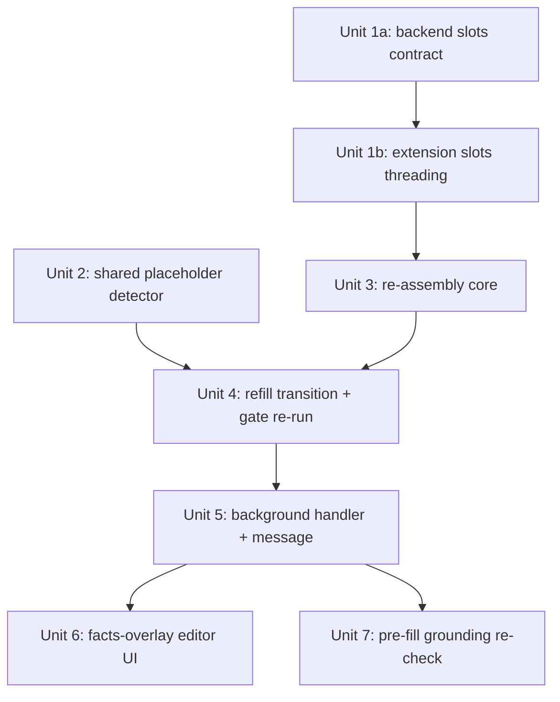

# feat: Fill Missing Facts via Structured Overlay + Re-assemble

## Overview

Replace the `prompt()` + global `.replace(/【待补】/g, val)` fact-fill at `BatchReviewPanel.tsx:126-139` with a structured editor where the operator fills missing **fact slots** (作品名/集数/制作/漢化/無修/简介). On commit, merge the operator facts into the item and **re-run the pure `assembleDraft(slots, facts)`** to regenerate `draft` and `assembledDraftSnapshot` together, then re-run the grounding gate on the new snapshot. This fixes two correctness defects (distinct placeholders no longer collide on one value; the snapshot is regenerated so authorized publish actually unblocks) while preserving the anti-hallucination and anti-wash invariants by construction (the trusted assembler is the only writer of the snapshot).

## Problem Frame

See origin: `docs/brainstorms/2026-06-15-inline-placeholder-fill-requirements.md`. Two code-verified defects in today's fill path: (1) global replace writes the same value into every `【待补】` (work name lands in the episode slot); (2) fill updates only `draft`, never `assembledDraftSnapshot`, and the authorized gate reads `assembledDraftSnapshot ?? item.draft` (`batch-orchestrator.ts:401`), so a correct fill stays blocked — and the orchestrator loop skips non-`awaiting-approval` items entirely, so a gate-failed item never re-flows.

## Requirements Trace

- R1. Operator fills missing fact slots as discrete fields keyed to real `FactsBlock` keys (no free-text placeholder substitution). (origin R1)
- R2. On commit, merge facts and re-run `assembleDraft` to regenerate `draft` + `assembledDraftSnapshot`; never string-substitute. (origin R2)
- R3. Operator-provided facts persisted on the item (provenance = operator), re-assembly reproducible. (origin R3)
- R4. Snapshot written **only** by the deterministic assembler; AI rewrite never touches it; no AI draft string copied into the snapshot. (origin R4)
- R5. Gate detection matches any `【待补…】` by the opening marker `【待补` via one shared helper, replacing **every** `【待补`-matching site found by grep (incl. `grounding-gate.ts` which currently uses the `PLACEHOLDER` *const* exact-match — this becomes a const→prefix semantic widening — and `quality-gate.ts` which uses the literal). Detection must cover **all four assembled fields: title, body, subtitle, description** (subtitle/description also receive `【待补】` via `sanitizeToPlainText` bare-URL rewrite but are not gate-checked today). (origin R5)
- R6. Gate-failed item re-enters approval **only** by re-running the grounding gate on the updated snapshot and passing; residual `【待补` keeps it blocked. New transition, distinct from `retryFromGateFailed`. The re-run uses the SAME argument shape as the authorized publish gate (`evaluateGrounding(snapshot, mergedFacts, qualityScore)`) so the promotion verdict and the publish verdict cannot diverge. (origin R6)
- R7. Operator values XSS-safe wherever rendered (preview/title/snapshot/Quill); preview reuses `sanitizeBody` if it renders HTML. (origin R7)
- R8. Operator-supplied URL-bearing facts (漢化/無修) validated via a strict allowlist before accepted as a sourced fact: parse with `URL()` (not regex), `scheme === "https"` only (reject http/javascript/data/relative), reject embedded credentials (`user:pass@`), reject loopback/internal/IDN-confusable hosts, enforce a max length. The operator URL becomes its own gate "source", so it must clear a stricter bar than other fact fields. (origin R8)
- R9. Editor replaces the `prompt()` global-replace; previews re-assembled result before commit; empty/whitespace blocks commit; cancel discards. (origin R9)
- R10. **Post-promotion anti-wash:** after a refill promotes an item to `awaiting-approval`, draft/snapshot must not be allowed to silently diverge in a way that reaches the form. The authorized publish path must re-validate grounding against the **actually-filled** content (`item.draft`) immediately before `sendFill`, not rely solely on the snapshot gated earlier — closing the inline-edit-after-promotion bypass. (review: adversarial P0)
- R11. **Two-writer precedence:** when an item is gate-failed awaiting facts, inline draft edits (`patchBatchDrafts`) and facts-refill must have a defined precedence (facts-refill regenerates `draft` wholesale → inline edits on gate-failed items are discarded or blocked). (review: coherence/architecture)

## Scope Boundaries

- **No model-prompt change.** Model still writes bare `【待补】` in prose; no labeled placeholders. (origin)
- **Model-prose `【待补】` is out of scope (but must still be DETECTED).** Bare-URL→placeholder rewrites land inside `slots.intro/highlights/subtitle` (`post-assembler.ts:61-62`), surfacing in body/subtitle/description, and are reproduced verbatim by re-assembly — they are NOT fixed by this feature. Such items are resolved by supplying facts and **regenerating** (`retryFromGateFailed`); the gate (now covering all four fields per R5) keeps blocking until clear. The overlay drives off **missing fact slots**, not off counting `【待补】`.
- **Optional link facts on already-passing items are out of scope.** The overlay is reachable only for gate-failed items; adding a missing optional 漢化/無修 link to an item that already passes the gate has no affordance here.
- **No gate-logic change** — detection format/predicate only (R5).
- **Batch path only.** The single-item publish path (`publish-orchestrator.ts`) does not read `assembledDraftSnapshot` and has no grounding hard-gate today; bringing it to parity is out of scope (noted under System-Wide Impact).
- **No storage migration.** Detection is prefix-tolerant; existing stored bare `【待补】` keeps working. Items generated before this feature lack `slots` → overlay is unavailable for them; they fall back to regenerate.

## Context & Research

### Relevant Code and Patterns

- `packages/shared/src/post-assembler.ts` — `assembleDraft(slots, facts): {title,subtitle,body,description}` (`:96`), pure/dependency-free, exported via `shared/src/index.ts`. Body fully regenerated each call: facts header (`esc()`-escaped, `:113-116`), prose via `sanitizeToPlainText()`+`esc()` (`:119-122`), fact-URL link block (`:124-129`). `PLACEHOLDER` (`:15`); `sanitizeToPlainText` bare-URL→placeholder (`:61-62`); title=PLACEHOLDER when 作品名 empty (`:103`).
- `packages/shared/src/draft.ts` — `toDraft(assembled, category, tags, id, now)` (5 params) wraps `AssembledDraft` into `ContentDraft`; **hardcodes `coverImageUrl: ""`** (no cover param).
- `packages/shared/src/facts.ts` — `FactsBlock` (exported via `shared/index.ts`): slots `{作品名, 集数, 制作, 漢化, 無修, 简介}`. The overlay (Unit 6) renders one input per empty key; no custom slots added. (`原作` is an alias of `制作`; links live inside `漢化`/`無修`.)
- **`assembleDraft` is called server-side ONLY** at `packages/backend/src/services/llm.ts:388`; `DraftSlots` from `slotsFromParsed` (`:248`) is consumed and dropped — not returned, not persisted. The extension `generateDraft` (`packages/extension/lib/llm.ts:82`) is a thin proxy to `POST /api/v1/drafts/generate` receiving only the finished `ContentDraft`.
- `packages/shared/src/batch.ts:16-40` — `BatchItem` stores `facts?`, `draft?`, `assembledDraftSnapshot?` but **NOT `slots`** (the gating gap).
- `packages/extension/lib/batch.ts` — state machine via `transition(batch,itemId,fromStatus,patch)` guard: `markGateFailed` filled→gate-failed (`:164`); `retryFromGateFailed` gate-failed→queued, clears draft+fillResults (`:179`); `patchBatchDrafts` only awaiting-approval, draft only (`:212`); `markFilled` sets draft+snapshot (`:107`); `presentForApproval` filled→awaiting-approval (`:188`). **No gate-failed→awaiting-approval edge exists.**
- `packages/extension/lib/batch-orchestrator.ts:388-413` — approve loop skips `status!=="awaiting-approval"` (`:392`), gate reads `assembledDraftSnapshot ?? item.draft` (`:401`), authorized-only (`:398`).
- `packages/extension/lib/grounding-gate.ts` — imports `PLACEHOLDER` (`:7`), checks title (`:26`) + body (`:29`). `packages/shared/src/quality-gate.ts:73` — hardcoded literal `"【待补】"` (not the const).
- UI seam: `BatchReviewPanel.tsx` → `ItemCard.tsx:307-311` (`draftOverrides`/`onDraftChange`; `it.facts` already passed `:374`; `it.assembledDraftSnapshot` displayed `:267,:283`); state in `BatchView.tsx:44`; sent to background `:362-374`; `background.ts:345-351` applies `patchBatchDrafts`.
- sanitize: `esc()` escapes facts inside `assembleDraft`; `sanitizeToPlainText` strips prose; `sanitizeBody` (DOMPurify) at Quill write (`quill-paste.ts:54`). Re-assembly routes through `assembleDraft` → XSS-safe by construction.

### Institutional Learnings

- `docs/plans/2026-06-11-005-fix-grounding-gate-rewrite-bypass-plan.md` — **the anti-wash invariant**: `assembledDraftSnapshot` is the sole gate judge, holds pre-rewrite assembler output; both gates read `snapshot ?? draft`. Regeneration paths must **re-capture the snapshot** (via `markFilled`'s seam) or "gate-failed 重试后无快照". Invariant ④: gate-failed must not auto-promote to awaiting without explicit human action + gate re-run. Keep `?? item.draft` fallback for old batches.
- `docs/plans/2026-06-05-003-feat-structured-generation-anti-hallucination-plan.md` — `assembleDraft(slots, facts)` is the pure choke point; verbatim fact injection; prose force-sanitized inside the assembler. Operator-fill = mutate `FactsBlock`, model never re-runs.
- `docs/solutions/.../extension-http-client-testability-injection-seam-2026-06-15.md` — backend clients call shared `fetchWithTimeout`, not bare `fetch`; don't assume a mock seam — inject `fetchFn`. Keep new logic in the pure `assembleDraft`/facts layer, not behind chrome/network.
- `docs/solutions/.../fixture-secret-gate-false-green-relative-path-2026-06-15.md` — a no-op gate looks identical to a passing gate. Add a **negative assertion** that re-assembly actually re-runs and the new snapshot reflects new facts (anti false-green).

## Key Technical Decisions

- **Persist `DraftSlots` to enable client-side re-assembly** (vs. a new backend re-assemble endpoint). Rationale: `assembleDraft` is pure and already in `shared/`; the only missing input is `slots`. Returning `slots` from the generate endpoint + storing them on `BatchItem` lets the extension re-assemble directly with no new server round-trip. A backend endpoint would also need to persist slots server-side anyway.
- **Operator-fill = facts mutation → re-run `assembleDraft` → re-capture snapshot → re-run gate** (the only shape preserving the anti-wash invariant). The snapshot is written solely by the assembler fed (existing slots + merged facts), never by copying `item.draft`.
- **New guarded transition `gate-failed → awaiting-approval`** that writes draft+snapshot+facts, clears `gateFailReason`, and promotes **only after** `evaluateGrounding` passes on the new snapshot. Never bypass the gate (invariant ④).
- **Single shared placeholder detector** matching the `【待补` opening marker (fail-safe for unclosed/labeled/bare), replacing all literal sites.
- **Overlay keys off missing fact slots, not `【待补】` count.** Prose-embedded placeholders can't be filled here and route to regenerate.

## Open Questions

### Resolved During Planning

- *Does BatchItem retain enough to re-run assembleDraft?* — **No.** `slots` is dropped server-side; must be returned by the generate endpoint and persisted (Unit 1).
- *Does re-assembly fix all `【待补】`?* — **No.** Only fact-derived (missing 作品名→title; missing facts omit lines). Prose-embedded `【待补】` (bare-URL rewrite) is reproduced verbatim → out of scope, route to regenerate.
- *Transition path?* — New guarded `gate-failed → awaiting-approval` after gate re-run; do **not** route through `retryFromGateFailed` (it discards the fill).
- *Single-item path parity?* — `publish-orchestrator.ts` has no grounding hard-gate; out of scope.
- *Sanitize wiring?* — Free via `assembleDraft` (`esc()` + `sanitizeToPlainText`) + `sanitizeBody` at Quill write; preview must reuse `sanitizeBody` if it renders HTML.

### Deferred to Implementation

- Exact `DraftSlots` serialization shape on the generate response and `BatchItem` (mirror existing `ContentDraft` serialization; no schema migration needed via `JSON.stringify`).
- Whether the new transition clears `fillResults` (as `retryFromGateFailed` does) or preserves them — decide when wiring the re-fill flow.
- Final editor host: extend `ItemCard` facts block vs. dedicated "补全缺失事实" sub-block. (The two-writer precedence vs. U7 inline-edit is now an explicit Unit 6 requirement/test, not deferred.)

## High-Level Technical Design

> *Directional guidance for review, not implementation specification. Treat as context, not code to reproduce.*

```
operator edits missing fact fields (作品名/集数/...) in ItemCard
        │  factsOverrides: Map<itemId, Partial<FactsBlock>>
        ▼
background handler (new message, e.g. REFILL_ITEM_FACTS)
        │  mergedFacts = { ...item.facts, ...operatorFacts }   (validate URL facts — R8)
        │  assembled   = assembleDraft(item.slots, mergedFacts) (pure, shared)
        │  newDraft    = toDraft(assembled, item.draft.category, item.draft.tags, item.id, now)
        ▼
new transition: refillGateFailed(batch, itemId)
        │  writes draft = newDraft, assembledDraftSnapshot = newDraft, facts = mergedFacts
        │  re-run evaluateGrounding(snapshot)
        │     pass → gate-failed → awaiting-approval (clear gateFailReason)
        │     fail → stay gate-failed (residual 【待补 / prose placeholder)
        ▼
save batch (local primary; backend best-effort)
```

## Implementation Units



- [ ] **Unit 1a: Backend `DraftSlots` wire contract (schema + service + route)**

**Goal:** Make the generate endpoint actually return `slots` through Fastify serialization.
**Requirements:** R2, R3 (enabling)
**Dependencies:** None
**Files:**
- Modify: `packages/backend/src/services/llm.ts:388` (lift `slotsFromParsed(parsed)` to a named const; return it from the service alongside the draft)
- Modify: the backend generate **route handler** (grep `ok: true` + `draft` near the `/drafts/generate` registration; `app.ts:199` binds `response: { 200: GenerateDraftResponse }`) to include `slots` in the response payload
- Modify: **TypeBox schema** `packages/backend/src/.../schemas.ts:46-63` — add a `DraftSlots` `Type.Object` and a `slots: Type.Optional(...)` member to the `ok:true` arm of `GenerateDraftResponse`. **Without this the field is silently stripped by Fastify serialization** and the whole feature is inert.
- Modify: `packages/shared/src/types.ts:217` (`GenerateDraftResponse` TS type, `ok:true` arm: `slots?: DraftSlots`)
- Test: `packages/backend/src/services/llm.test.ts` + a **route-boundary `app.inject` test** asserting `slots` survives the real request/response (a service-level test bypasses schema stripping).
**Approach:** Additive optional field; old clients tolerate its presence, old responses omit it. The TypeBox schema edit is the load-bearing step.
**Test scenarios:**
- Happy path (route-level, `app.inject`): POST generate returns a body containing a non-empty `slots` (proves it survives Fastify serialization, not just the service return).
- Edge case: response without `slots` still validates.
- Anti-false-green: a freshly generated (non-legacy) draft **has** `slots` (guards the silent-strip → all-items-degrade failure).
**Verification:** A real generate request returns `slots` in its JSON body.

- [ ] **Unit 1b: Thread `slots` into `BatchItem` and persist**

**Goal:** Carry `slots` from the proxy onto the item so re-assembly has its input.
**Requirements:** R2, R3 (enabling)
**Dependencies:** Unit 1a
**Files:**
- Modify: `packages/extension/lib/llm.ts:82,127` (carry `slots` through the proxy `as GenerateDraftResponse`)
- Modify: `packages/shared/src/batch.ts` (add `slots?: DraftSlots` to `BatchItem`)
- Modify: `packages/extension/lib/batch.ts` (`markFilled` threads `slots`), `packages/extension/lib/batch-orchestrator.ts:292-302` (store `slots` on the item)
- Test: `packages/extension/lib/batch.test.ts`
**Approach:** No storage migration (JSON serialization). Old items simply have `slots` undefined → overlay falls back to regenerate.
**Patterns to follow:** existing `facts` threading RUN_BATCH→BatchItem.facts→runBatch/retryItem; existing `ContentDraft` serialization.
**Test scenarios:**
- Happy path: orchestrator stores `slots` on the item; `markFilled` persists it alongside `draft`/`snapshot`.
- Edge case: a batch item generated without slots (legacy/`undefined`) serializes and loads without error.
- Integration: round-trip through storage is deserialize-identical (no re-validation on load — storage layer is inert).
- Security (round-trip): a `slots.intro` containing `<script>`/bare URL survives storage round-trip and is **neutralized only after re-assembly** (stored slots are inert until `assembleDraft` runs). **Note for the `BatchItem.slots` field: it is model-untrusted text; never render it directly — only `assembleDraft` may consume it.**
**Verification:** A freshly generated item carries `slots`; reload retains it byte-for-byte.

- [ ] **Unit 2: Shared `【待补` detection helper (fail-safe), replace literal sites**

**Goal:** One prefix-based detector so labeled/bare/unclosed placeholders all hard-block.
**Requirements:** R5
**Dependencies:** None
**Files:**
- Modify: `packages/shared/src/post-assembler.ts` (export `containsPlaceholder(text): boolean` keyed on the `【待补` opening marker)
- Modify: **every site found by `grep -rn '【待补' packages/{shared,extension}`** — at least `packages/extension/lib/grounding-gate.ts:26,29` (currently `PLACEHOLDER` const exact-match → becomes prefix-helper, a semantic widening) and `packages/shared/src/quality-gate.ts:73` (and any other quality-gate body/description checks) — do not trust the two cited line numbers alone.
- Extend `evaluateGrounding` to run the detector over **all four assembled fields (title, body, subtitle, description)**, not just title+body.
- Test: `packages/extension/lib/grounding-gate.test.ts`, `packages/shared/src/post-assembler.test.ts` (or quality-gate test)
**Approach:** Match on opening marker (e.g. regex `/【待补/`), not a closing-bracket-anchored pattern, so unclosed/malformed variants still block. Keep `evaluateGrounding`'s `?? item.draft` fallback untouched.
**Patterns to follow:** existing `PLACEHOLDER` export + `.includes` call sites.
**Test scenarios:**
- Happy path: bare `【待补】` detected (title and body).
- Edge case: labeled `【待补:作品名】` detected; unclosed `【待补` (no `】`) detected; clean text returns false.
- Edge case: `【待补】` in **subtitle** or **description** is now detected and blocks the gate (previously slipped through).
- Error path: empty/undefined field does not throw and returns false.
- Behavior change (state it, don't claim "preserving"): a labeled/unclosed variant in a quality-gate-scored title now scores as a placeholder (stricter than the prior exact-match). Add a test asserting the intended score for a labeled-variant title; assert the canonical bare `【待补】` score is unchanged.
- Integration: `evaluateGrounding` still hard-blocks authorized publish for each variant via the new helper.
**Verification:** All placeholder variants block the gate; quality-gate scores via the shared helper.

- [ ] **Unit 3: Re-assembly core (merge facts → assembleDraft → toDraft)**

**Goal:** A pure function producing the new draft+snapshot from existing slots + merged facts, with URL-fact validation.
**Requirements:** R1, R2, R4, R7, R8
**Dependencies:** Unit 1b
**Files:**
- Create: `packages/extension/lib/refill.ts` (or co-locate in `shared/`) — `reassembleWithFacts(item, operatorFacts): { draft, snapshot, facts }`
- Modify: `packages/shared/src/post-assembler.ts` only if a URL-validation helper belongs there
- Test: `packages/extension/lib/refill.test.ts`
**Approach:** `mergedFacts = {...item.facts, ...operatorFacts}`; validate URL-bearing fact fields (漢化/無修) per the R8 allowlist (URL() parse, https-only, no userinfo, no loopback/internal/IDN) before accepting; `assembled = assembleDraft(item.slots, mergedFacts)`. **`toDraft(assembled, category, tags, id, now)` takes 5 params and hardcodes `coverImageUrl: ""`** — so reconstruct as `{ ...toDraft(assembled, item.draft.category, item.draft.tags, item.id, now), coverImageUrl: item.draft.coverImageUrl }`, mirroring the orchestrator's `{...gen.draft, coverImageUrl: item.coverImageUrl}` spread (`batch-orchestrator.ts:255`). This is **load-bearing, not gold-plating**: a naive `toDraft` call silently zeroes the cover, dropping it from the re-published draft. Return identical object for both `draft` and `assembledDraftSnapshot`. XSS safety is inherited from `assembleDraft` (`esc()` + `sanitizeToPlainText`); do not hand-build HTML.
**Patterns to follow:** pure `assembleDraft` choke point; `toDraft` wrapper.
**Test scenarios:**
- Happy path: missing 作品名+集数 filled → title `《某作》第3集` with distinct correct values; both returned drafts identical and placeholder-free.
- Edge case: only one of two missing facts filled → result still contains `【待补` (fact-derived) and is reported as not-clean.
- Edge case (out-of-scope guard): a prose-embedded `【待补】` (in `slots.intro`) survives re-assembly → core returns a draft still flagged by the detector (proves prose case is not silently "fixed").
- Error path: operator URL fact `http://…` or `javascript:…` or malformed → rejected, not injected. **(R8)**
- Error path: item without `slots` → core refuses (caller routes to regenerate).
- Edge case (subtitle/description): `slots.subtitle` containing a bare URL → re-assembled `subtitle`/`description` carries `【待补】` → detector (Unit 2) flags it (proves the new four-field gate coverage works end-to-end).
- Error path: operator URL fact with `user:pass@`, loopback/internal host, or `data:`/`javascript:` scheme → rejected (R8 allowlist), not injected.
- Error path: item without `slots` → core refuses (caller routes to regenerate).
- Anti-false-green (negative assertion): re-assembly with changed facts produces a snapshot whose content actually differs from the stale one.
- coverImageUrl preservation: re-assembling an item that had a non-empty `coverImageUrl` keeps it (guards the `toDraft` zeroing regression) — and the re-assembled snapshot is field-for-field shape-equivalent to an originally-generated one.
**Verification:** Given slots+new facts, returns a clean, distinct-valued draft+snapshot with cover preserved; rejects bad URLs and missing-slots.

- [ ] **Unit 4: New guarded transition `gate-failed → awaiting-approval` with gate re-run**

**Goal:** Promote a re-filled item only after the grounding gate passes on the fresh snapshot.
**Requirements:** R4, R6
**Dependencies:** Unit 2, Unit 3
**Files:**
- Modify: `packages/extension/lib/batch.ts` (new `refillGateFailed(batch, itemId, {draft, snapshot, facts})` via the `transition` guard from `gate-failed`)
- Test: `packages/extension/lib/batch.test.ts`
**Approach:** Make the gate re-run **atomic with the transition** — `refillGateFailed` takes the gate fn as input, evaluates `evaluateGrounding(newSnapshot, mergedFacts, qualityScore)` — **same argument shape as the authorized publish gate at `batch-orchestrator.ts:399-402` (must pass `mergedFacts`; the unsourced-link check reads `factUrls(facts)`, so omitting facts would over-block legitimate refills and diverge from the publish verdict)** — and decides the terminal status in one commit: pass → write draft+snapshot+facts, clear `gateFailReason`, promote to `awaiting-approval`; fail → write draft+snapshot+facts but **keep `gateFailReason`** (updated to the residual reason) and stay `gate-failed`. This removes the write/promote window where an SW recycle could leave a cleared `gateFailReason` on a still-blocked item. Mirror `patchBatchDrafts`' state-restricted guard. Decide `fillResults` handling (deferred; note stale `fillResults` reference the old draft and may mislead the approve UI).
**Patterns to follow:** `transition(...)` guard; `markFilled` snapshot capture seam; invariant ④.
**Test scenarios:**
- Happy path: gate-failed item with clean re-assembled snapshot → transitions to awaiting-approval, `gateFailReason` cleared.
- Edge case: re-assembled snapshot still has `【待补` → stays gate-failed, `gateFailReason` retained/updated (never cleared on a non-promoting write).
- Edge case (atomicity): the function returns one consistent (status, gateFailReason) pair — no intermediate state where `gateFailReason` is cleared but status is still `gate-failed` (SW-recycle safety).
- Verdict-agreement: the promotion gate and the authorized-publish gate return the same verdict for the same `(snapshot, mergedFacts)` (proves identical argument shape — incl. an operator-supplied link that must count as sourced).
- Error path: calling the transition from a non-`gate-failed` status is rejected by the guard.
- Integration: after promotion the approve loop (`batch-orchestrator.ts:388`) now sees the item (`awaiting-approval`) and the authorized gate reads the new snapshot and passes.
**Verification:** Only gate-passing re-fills reach awaiting-approval; a non-promoting refill never clears the failure reason; invariant ④ holds.

- [ ] **Unit 5: Background handler + message wiring**

**Goal:** Route operator fact edits from the panel to re-assembly + transition + save.
**Requirements:** R2, R3, R6
**Dependencies:** Unit 3, Unit 4
**Files:**
- Modify: `packages/extension/lib/messaging.ts` (new message, e.g. `REFILL_ITEM_FACTS(itemId, facts)`)
- Modify: `packages/extension/entrypoints/background.ts:345-351` (handler: load item, `reassembleWithFacts`, `refillGateFailed`, re-gate, `saveBatch`)
- Test: `packages/extension/__tests__/entrypoints/background.test.ts`
**Approach:** Mirror the existing `draftOverrides`→`patchBatchDrafts` handler shape but for facts. Persist via local save primary; backend mirror best-effort (per double-write convention). Re-gate runs extension-side. **Access control:** `REFILL_ITEM_FACTS` is a privileged channel — it mutates `facts`/`draft`/`assembledDraftSnapshot` and drives promotion toward publish. Accept it only from the extension UI (side panel) origin, never from content/page worlds (consistent with the three-world model: content `绝不自我授权`). It must NOT itself grant publish — the gate re-run remains the sole promoter. If the messaging layer exposes sender identity, validate it and add a handler test rejecting an unexpected sender.
**Patterns to follow:** existing approve handler `draftOverrides` flow (`background.ts:345-351`); `createHandlers` factory + its tests.
**Test scenarios:**
- Happy path: message with valid facts on a gate-failed item → item ends awaiting-approval and is saved.
- Edge case: item without `slots` → handler returns a clear "regenerate required" result, no mutation.
- Error path: unknown itemId / item not in gate-failed → no-op with error result.
- Integration: handler invokes the real `reassembleWithFacts` + `refillGateFailed` and the saved batch reflects new facts/draft/snapshot.
- Integration (no-mock, mirrors 2026-06-11 Unit 4): a zero-/missing-fact gate-failed item → refill facts → assert it now PASSES the real **authorized** `checkGrounding(item.assembledDraftSnapshot ?? item.draft)` at `batch-orchestrator.ts:401` with real functions, no mocks (proves the refill actually reaches and clears the publish hard-gate).
**Verification:** End-to-end (sans UI) a fact refill moves an item to awaiting-approval, persists, and clears the real authorized gate.

- [ ] **Unit 6: Facts-overlay editor UI (replaces prompt())**

**Goal:** Operator-facing structured editor for missing fact slots with preview, replacing the `prompt()` global-replace.
**Requirements:** R1, R7, R8, R9
**Dependencies:** Unit 5
**Files:**
- Modify: `packages/extension/entrypoints/sidepanel/batch-review/ItemCard.tsx:307-311,373-380` (render missing-fact fields from `it.facts`/snapshot)
- Modify: `packages/extension/entrypoints/sidepanel/BatchView.tsx:44` (add `factsOverrides` state; send on commit)
- Modify: `packages/extension/entrypoints/sidepanel/BatchReviewPanel.tsx:126-139` (remove `handleFixPlaceholder`; wire new commit)
- Test: `packages/extension/entrypoints/sidepanel/batch-review/ItemCard.test.tsx` (or BatchReviewPanel test)
**Approach:** Show one input per **missing fact slot** (empty `FactsBlock` keys), captioned by slot name; preview the re-assembled title+body before commit (reuse `sanitizeBody` if rendering HTML — R7). Trim inputs; block commit on empty/whitespace with inline message; cancel discards (confirm if typed) — R9. For prose-placeholder-only items (no fillable fact slot), show a "需重新生成" affordance instead of the overlay.
**Patterns to follow:** `draftOverrides`/`onDraftChange` seam; existing ItemCard editor (`:307-311`).
**Test scenarios:**
- Happy path: missing 作品名/集数 render as two fields; filling both + commit dispatches `REFILL_ITEM_FACTS` with distinct values; preview shows the substituted title.
- Edge case: whitespace-only input blocks commit with inline error; cancel after typing prompts discard-confirm.
- Edge case: item whose only placeholder is prose-embedded shows the regenerate affordance, not editable fact fields.
- Error path: invalid URL fact surfaces an inline validation error (mirrors R8 core rejection).
- Two-writer precedence: when an item has both a pending inline draft-edit (`patchBatchDrafts` path) and a facts-refill, the intended precedence holds — a facts-refill regenerates `draft` wholesale, so inline edits on a gate-failed item are expected to be discarded (or inline-edit is blocked while fact slots are missing). Test the chosen rule explicitly.
- Integration: committing updates the panel to reflect the item moving out of gate-failed (post-handler state).
**Verification:** Operator can fill missing facts per-slot with preview; `prompt()` path is gone; distinct values land correctly.

- [ ] **Unit 7: Pre-fill grounding re-check on `item.draft` (close the post-promotion bypass)**

**Goal:** Ensure the content actually filled into the form is grounding-clean, not just the snapshot gated earlier.
**Requirements:** R10
**Dependencies:** Unit 2 (detector), Unit 5
**Files:**
- Modify: `packages/extension/lib/batch-orchestrator.ts` (approve loop ~`:399-423`) — re-run `evaluateGrounding(item.draft, item.facts, …)` immediately before `sendFill(item.draft)` (`:423`); block on failure with a `grounding-blocked:` reason.
- Test: `packages/extension/lib/batch-orchestrator.test.ts`
**Approach:** Today the gate reads `assembledDraftSnapshot ?? item.draft` (`:401`) but fill reads `item.draft` (`:423`); `patchBatchDrafts` can edit `draft` (not snapshot) on `awaiting-approval` items, so a post-promotion inline edit can re-introduce `【待补`/an unsourced URL into the filled draft while the earlier gate passed on the clean snapshot. A pre-fill re-check against the **actually-filled** `item.draft` closes this. (This is a defense-in-depth gap that predates the feature but is widened by it — see open question on whether to fix here or accept.)
**Execution note:** Start with a failing regression test for the bypass (refill→promote→inline-edit injects `【待补`→publish must block).
**Test scenarios:**
- Bypass regression: refill promotes an item → operator inline-edits `draft` to add `【待补`/an unsourced URL → authorized publish is blocked at the pre-fill re-check (not filled).
- Happy path: a clean promoted item passes the pre-fill re-check and fills normally.
- Integration: re-check uses the same detector (four fields) and `factUrls` source as the snapshot gate.
**Verification:** No post-promotion draft edit can carry `【待补`/unsourced content into `sendFill`.

## System-Wide Impact

- **Interaction graph:** generate endpoint (backend) → `BatchItem.slots` → re-assembly core → new transition → approve loop gate. Touches the generate API response contract (new `slots` field) — backend + extension proxy must agree.
- **Error propagation:** URL/empty validation fails at the core/UI before any mutation; missing-`slots` items route to regenerate; gate failure keeps the item gate-failed (never silent promotion).
- **State lifecycle risks:** snapshot must be overwritten with the re-assembled output (not left stale); post-promotion draft/snapshot divergence (R10/Unit 7); `fillResults` handling decision (stale results reference the old draft); `publishedDraft` not updated by refill → slotDiff telemetry (`batch-orchestrator.ts:490-493`) will attribute operator fact-fills as AI-vs-final edits (cosmetic, note it); legacy items without `slots`.
- **API surface parity:** the single-item publish path (`publish-orchestrator.ts`) has no grounding hard-gate and is intentionally not brought to parity here.
- **Wire-contract risk:** Fastify+TypeBox response validation strips properties absent from the schema — `slots` must be added to the `GenerateDraftResponse` TypeBox schema (Unit 1a), proven by an `app.inject` route-boundary test, or the feature is silently inert.
- **Integration coverage:** Unit 4/5/7 integration tests prove the re-filled item actually reaches and passes (or is correctly blocked by) the authorized approve-loop gate — not provable by mocks alone.
- **Unchanged invariants:** anti-wash (snapshot is sole gate judge, written only by the assembler), verbatim fact injection, zero-submit, `?? item.draft` fallback for old batches; persisted `slots` is model-untrusted and consumed only by `assembleDraft` — all preserved.

## Risks & Dependencies

| Risk | Mitigation |
|------|------------|
| **Post-promotion anti-wash bypass:** gate reads snapshot (`:401`) but fill reads `item.draft` (`:423`); inline edit after refill-promotion can re-inject `【待补`/unsourced URL into the filled draft | Unit 7 pre-fill re-check on `item.draft` (R10) + bypass regression test |
| **`slots` silently stripped by Fastify TypeBox response validation** → feature inert | Add `slots` to the `GenerateDraftResponse` TypeBox schema (Unit 1a) + `app.inject` route-boundary test |
| `subtitle`/`description` carry `【待补】` (via `sanitizeToPlainText`) but were never gate-checked | Extend detector to all four assembled fields (R5/Unit 2) |
| `toDraft` zeroes `coverImageUrl` → cover dropped on re-publish | Explicit `{...toDraft(...), coverImageUrl: item.draft.coverImageUrl}` reconstruction + preservation test (Unit 3) |
| Backend generate contract change (return `slots`) ripples to extension proxy + types | Split Unit 1a/1b; additive optional field; old items tolerate `undefined` slots |
| Re-assembly silently no-ops (false-green) and item looks fixed but isn't | Negative assertion test (Unit 3); gate re-run is the real arbiter (Unit 4), not the editor |
| Changing placeholder detection fails open and lets `【待补】` publish | Prefix-marker match + variant tests (Unit 2); land detector before/with any format change |
| Operator pastes malicious/unsourced URL as a fact → bypasses link gate | https+format validation in core (Unit 3, R8) before acceptance |
| Operator confuses prose-placeholder items (unfixable here) for fillable ones | Overlay keys off missing fact slots; explicit regenerate affordance for prose-only (Unit 6) |
| Two writers of `draft`/`snapshot` (inline edit via `patchBatchDrafts` vs. facts-refill) silently clobber each other | Explicit precedence rule + test in Unit 6 (refill regenerates draft wholesale; inline edits on gate-failed items lost or blocked) |
| **Single-item publish parity gap widens.** `publish-orchestrator.ts` has NO grounding hard-gate; this feature hardens the batch path further, widening the asymmetry. Operators may wrongly assume single-item publish is grounding-gated. | Out of scope here, but tracked as separate follow-up work; recorded so it is an owned (not silent) residual exposure, consistent with the 2026-06-11 plan's accepted-residual pattern |
| `shared` dist not rebuilt before extension typecheck | Rebuild `@51publisher/shared` before extension compile (per AGENTS.md build order) |

## Sources & References

- **Origin document:** [docs/brainstorms/2026-06-15-inline-placeholder-fill-requirements.md](docs/brainstorms/2026-06-15-inline-placeholder-fill-requirements.md)
- Anti-wash invariant: `docs/plans/2026-06-11-005-fix-grounding-gate-rewrite-bypass-plan.md`
- Structured generation: `docs/plans/2026-06-05-003-feat-structured-generation-anti-hallucination-plan.md`
- Key code: `packages/shared/src/post-assembler.ts`, `packages/shared/src/batch.ts`, `packages/extension/lib/batch.ts`, `packages/extension/lib/batch-orchestrator.ts:388-413`, `packages/extension/lib/grounding-gate.ts`, `packages/backend/src/services/llm.ts:248,388`
