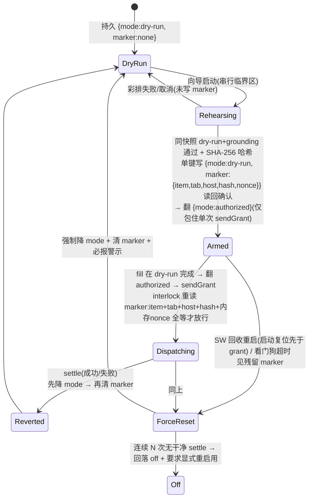
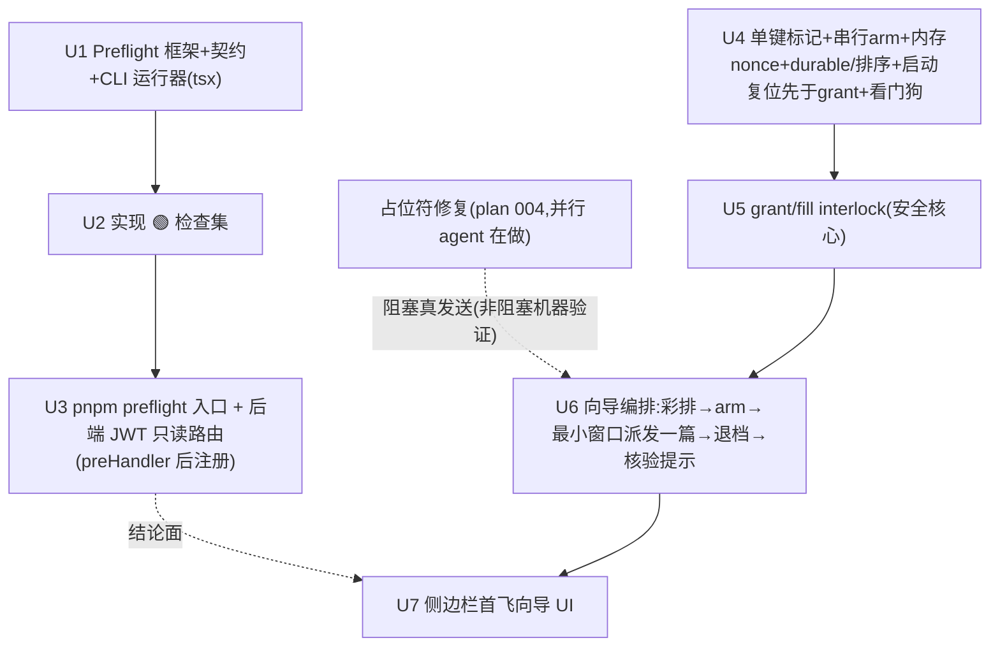

# Trustworthy First Flight — preflight self-check + one-shot wizard

## Overview

把「从未发生的第一次真实发布」变得可信。两个交付物:

1. **Preflight 自检**(Part A / PR-A):可在 CLI/CI 运行的 `pnpm preflight`,机械验证 runbook 所有 🟢 可逆项,输出**一条红/绿总结论** + 逐项 pass/fail/原因,并显式列出无法验证的 🔴 不可逆残项。只读、非破坏。
2. **一键首飞向导**(Part B / PR-B):侧边栏向导把 `authorized` 真发布**锁在一次「同快照」的 dry-run + grounding 彩排之后**,只解锁**恰好一篇**,派发后(无论成败)**自动退回 `dry-run`**;并以「item-绑定授权标记 + SW 内存 arm-nonce + grant/fill 双重 interlock + 启动复位先于 grant + 时间看门狗」把 MV3 service worker 的回收/弃用/并发边角兜住。

**这个向导证明的是「闸门时序正确(恰好一篇、只发彩排 item、发完退档)」,不是「真发布成功」** —— 真后台是否接受、帖子是否正确落地,仍需运营者核验(见 R7 注 + Unit 6)。

「质量更高的版本」在本项目里的定义不是加功能,而是让首发**可逆设置确定性绿灯化、不可逆首发受结构护栏**(见 origin)。

## Problem Frame

单运营者工具,代码侧已就绪,但 `docs/runbooks/first-flight-runbook.md` 是人工勾选、混着 🟢 可逆/可验证与 🔴 不可逆步骤的清单。两个缺口让首飞停在愿望:🟢 设置无法廉价自证;🔴 首发缺结构护栏(可能在未彩排内容上、乱序、或发完停在 authorized 被二次误发)。

## Requirements Trace

源自 origin R1–R11:

- **R1.** Preflight 可在 CLI/CI 运行,一条红/绿结论;同源同时供向导第一步展示。
- **R2.** Preflight 覆盖:CORS_ORIGIN = 算得扩展 id 单值(非 `*`/通配)、构建产物不含疑似密钥、后端 fail-closed 启动、对冻结 fixture 一次 dry-run 出绿 DryRunReport(闸链正常、零提交)、`verifyTrajectory` 通过。**(metrics 自增本轮移出必检项——死指标,见 Key Decisions。)**
- **R3.** Preflight 只读非破坏:绝不触碰真后端/线上站点,绝不执行任何 🔴 动作。
- **R4.** 每项报 pass/fail + 人类可读原因;任一失败总红。**清楚区分**「🟢 检查未过」与「🔴 运营步骤尚未做」,显式列出无法代验的 🔴 残项。
- **R5.** 锁在一次强制彩排之后:必须先对**同一 snapshot** 出绿 dry-run + grounding 硬闸通过,`authorized` 才对该篇可选;**彩排的 draft 字节哈希必须等于派发的 draft 字节哈希**(对象级一致;DOM/渲染保真仍依赖既有 sendFill + dry-run 的 fillResults 校验,见 Unit 5 注)。
- **R6.** 展示**将授权的真实 host**(取自目标 tab,绝不取自消息),解锁前确认;**派发只许发到运营者确认的那个 host**(钉入标记,派发时等值校验,而非「任一授权 host」)。
- **R7.** 只为**恰好一篇**解锁;该篇派发后(成功/失败)**自动退回 `dry-run`**。**「恰好一篇、只发彩排 item」是 authorized 状态的结构不变量(由 grant/fill interlock 在咽喉强制,任何调用方皆受约束),非「向导是唯一调用者」的约定。** 注:此不变量保证的是**发射时序与对象**,不保证真后台发布成功 —— 后者需运营者核验。
- **R8.** 不削弱既有不变量(第三方零提交、`PUBLISH_GRANT` 仅 background 发、host 取自 `chrome.tabs.get`、grounding fail-closed)。**叠加在闸门之上(消费 `canSubmit` 不改其判定),非绕过**。
- **R9.** 明示不可逆,要求闸门本就需要的显式 `publish` 手势(且 UI 手势设计防误触);只增加「时序/一次性/自动退档」,不新增旁路或 auto-approve。
- **R10.** 向导是仅服务首飞的一次性脚手架、非日常发布路径(首飞成功后可退化/隐藏,日常 authorized 发布仍走现有手动切档)。已于 Scope Boundaries / Alternatives 体现。
- **R11.** 向导交互状态:🔴 残项清单在全绿路径也展示;中断(SW 回收/关闭/跳页)重开显式提示已复位 dry-run、并据轨迹/已发布登记区分「可重启」vs「先查登记」;派发中/成功/失败各有明确终态。已于 Unit 7 体现。

## Scope Boundaries

- **不自动化任何 🔴 不可逆步骤**(撤密钥、对真后端的 CORS 负向核验、真发布本身)——保持运营者受闸。
- **不改 safety-gate 匹配逻辑**(`canSubmit`/`labelBoundaryMatch`/`normalizeHost`)——原样消费。interlock 是叠在 grant/fill 发射点之上的额外约束,不进 `canSubmit`。
- **不重写占位符填值修复** —— 独立、已评审的需求文档与计划,作前置依赖引用。
- **不新增任何发布旁路、批量授权或 auto-approve**;严格「一篇即退档」。
- 域名单一来源、可观测性漏斗、CI 覆盖率闸、漂移 canary —— 属另两条主线,不在此。

## Context & Research

### Relevant Code and Patterns

- **safety-gate**(`packages/extension/lib/safety-gate.ts`):`canSubmit({host, mode, authorizedHosts})` 纯函数,仅 `mode==='authorized'` 且 host 命中才放行,**只读全局 mode、无 item 绑定**;`off`/`dry-run` 恒 false。**不改**(R8)。
- **安全档存储**(`packages/extension/lib/storage.ts`):`getSafetyMode`/`setSafetyMode`(key `local:safetyMode`,**fail-closed 默认 `off`**)。**注意:`chrome.storage.local` 无 CAS/事务;既有 tombstone/published 写是 best-effort fire-and-forget**(`.catch(()=>{})`)—— 首飞标记写**不可照搬**(见 Unit 4)。批量状态变更已有 **`createSerialQueue`**(`batch-orchestrator.ts`)可复用做 arm 临界区。
- **grant/fill 发射点(已按 #28 重新核准 2026-06-15)**:#28 移除了 `handlePublish`/`PUBLISH_PAGE` 裸单条路径,**批量审批是唯一授权出口**。`buildApproveDeps(tabId, itemIdFilter)`(`background.ts:~250-290`)是**唯一**持有 `sendFill`(:258)/`sendGrant`(:269,零参)/`evaluateGate`(:268)/`checkGrounding=evaluateGrounding`(:286)的地方;`sendFill`/`sendGrant` 在 `approveBatch` 循环内对当前 `item` 调用(`batch-orchestrator.ts` sendFill :435 / sendGrant :464)。`sendGrant` 零参拿不到 item 身份——**per-item interlock 上下文只在 approveBatch 循环内有**,故 guard 应注入 `ApproveBatchDeps`、在循环里 fill+grant 之前对当前 item 求值(**非** orchestratePublish 函数体,**非** item-agnostic 的 background 闭包)。
- **fill 早于 grant**(`batch-orchestrator.ts`):`sendFill(item.draft)` 在 `orchestratePublish` **之前**执行,且无 filter 时对**每个** awaiting-approval item 都 fill。authorized 自家站点上 fill 即有副作用(写进真 Quill、可能被 layui 自动存草稿)。**故 interlock 须同时门控 fill,不能只挡 grant。**
- **发布入口(已按 #28 重新核准)**:`evaluateGate(tabId)`(host 取自 `chrome.tabs.get`,非消息)现仅供**批量路径**:`handleApproveBatch`(:323,无 filter→全批 fill+发,入口独有 draftOverrides 预存)与 `handleApproveSingleItem`(:344→`runApprove(tabId,itemId)`),二者经 `runApprove`(:294)→`approveBatch(buildApproveDeps(...))`。`handlePublish`/`PUBLISH_PAGE` 已删(#28),裸授权出口归零。`runStartupTombstoneScan` 在 SW 启动 **`void` 调用(不 await)**;keep-alive `alarms` 周期最小 1min(`if(browser.alarms)` 守卫,可能缺)。`createSerialQueue` 在 `batch-orchestrator.ts:50`(:219 已实例化 serialQueue)。
- **DryRunReport**(`shared/src/types.ts` + `batch-orchestrator.ts` `dry-run` 时 `saveDryRunReport`)、**`verifyTrajectory`**(`lib/trajectory.ts`,seq + **FNV-1a 32-bit 非加密**哈希链,注释明说「检测而非防止」)、**grounding-gate**(`lib/grounding-gate.ts`,【待补】/无来源连结即 block;`verifyLinks` 用 `DOMParser`,SW/Node 无 DOM 时跳过)。
- **后端 fail-closed**(`packages/backend/src/config/env-check.ts`:`checkEnv()`/`validateEnv()`,CORS 仅判 `!corsOrigin || corsOrigin === '*'`——**不比对 id**)。**路由注册在 `app.ts`**(非 CLAUDE.md 旧说的 index.ts);JWT preHandler 在 `app.ts` 加,**healthz/metrics 在 hook 之前注册故公开**,`PUBLIC_ROUTES` 白名单放行。
- **构建产物**:`packages/extension/.output/chrome-mv3/`;`LLM_API_KEY` 仅 backend 读,不进 bundle。扩展 id 由 `wxt.config.ts` 的 `EXTENSION_KEY` 公钥推导(SHA-256 DER → 前 16 字节 → a–p 映射),固定为 `iljimdgfajpgnmanklehhmapojbcjecd`。
- **运行器现状**:`scripts/` 仅 `.sh`/`.mjs`,**无 `.ts` 脚本先例**;`tsx` 仅在 `packages/backend` devDep,根无;扩展 `storage.ts` 等 `import "#imports"`(WXT 虚拟模块,Node 直 import 会炸)。

### Institutional Learnings

- **「自检绿但验错目标」是 preflight 头号陷阱**(`docs/solutions/security-issues/fixture-secret-gate-false-green-relative-path-2026-06-15.md`):问三问;路径锚脚本位置;「扫到 0 目标」判红;植入坏样验转红。
- **幻影 P0**(`docs/solutions/developer-experience/vitest-excludes-dist-phantom-backend-p0-2026-06-15.md`):每条命令先实跑确认;包名 `--filter publisher-backend` / `publisher-fill-assistant`。
- **HTTP client 注入接缝不一致**(`docs/solutions/developer-experience/extension-http-client-testability-injection-seam-2026-06-15.md`):涉及 client 单测先读其 `*-client.ts`。
- **MV3 拥抱 SW 短命 + 持久化恢复**(plan `2026-06-04-005` tombstone)。但 keep-alive alarm 让 SW 长存活 + alarm 1min floor,使「启动扫描」与「时间看门狗」有相关失效面,需分别证明哪个是 load-bearing(见 Unit 4/Risks)。
- **小独立 PR 交付纪律**:拆 PR-A / PR-B,依赖单向。

### External References

未做外部研究:全部建立在仓库既有接缝;MV3 SW 短命有 tombstone 先例。

## Key Technical Decisions

- **核心不变量 = 「authorized 窗口内,只有被彩排的那一篇 item、在确认的 tab+host、用彩排的字节,才能拿到 fill 与 grant」**(爆炸半径),不是「绝不滞留 authorized」(那只是时长)。两轮独立评审一致:`canSubmit` 读**全局** mode,向导置 authorized 后其它三入口会顺势过闸、可能 fill+发整批。**修法:grant/fill interlock。**
- **interlock 真实落点 = `approveBatch` 循环内、fill+grant 之前的 per-item guard(已按 #28 重新核准)。** per-item 上下文(itemId、`item.draft` 字节)只在循环内有,故 guard 作为 `ApproveBatchDeps` 注入依赖,在 `sendFill`(:435)与 `sendGrant`(:464)之前对当前 item 求值:标记在场时 `item+tab+host+sha256(item.draft)+内存nonce` 全等才放行 fill 与 grant,否则 block。`handleApproveBatch`(全批,无 filter)→ 每个非匹配 item 的 fill+grant 都被挡;`handleApproveSingleItem` 别 itemId → 挡。**guard 在循环内即时读标记**(不缓存),关 TOCTOU。#28 已删 `handlePublish` 裸路径,无需再为它特判。
- **同时门控 fill,且向导自己那篇「dry-run 下填充、仅 grant 前后瞬时翻 authorized」。** 因 `sendFill` 早于 grant 且在 authorized 自站点有副作用:非匹配 item 的 fill 也必须被 interlock 挡;向导本篇用最小窗口(填充在 dry-run、翻 authorized 仅包住单次 sendGrant),把全局 authorized 窗口压到「仅 grant」。
- **内容哈希用 SHA-256(SubtleCrypto,SW 可用),不用 FNV。** FNV-1a 32-bit 是非加密检测哈希(对 LLM 正文这类最不可信输入可行碰撞);此哈希是绑定「彩排字节=派发字节」的安全控制,须加密强度。FNV 仅留给 trajectory 链。哈希对象 = **实际派发的 `item.draft` 字节**(sendFill 送的就是 draft);grounding 校的是 `assembledDraftSnapshot`(不同关注点),Unit 5 额外比对 sendFill 返回的 `fillResults` 与 draft 一致,以缩「draft 对象 vs 页面 DOM」缝。
- **arm 串行 + SW 内存 arm-nonce + 单键存储,封并发/伪造/durability。** arm 全流程(查标记→写→读回→翻 authorized)用 `createSerialQueue` 包成临界区(`chrome.storage.local` 无 CAS,读回不防并发第二写)。标记携带一个 **arm 时在 SW 内存生成、不持久化的 nonce**,interlock 额外要求活动 nonce 相等 —— 并发第二 arm 拿不同 nonce、纯 storage 层伪造标记无匹配内存 nonce,均被挡。`{mode, firstFlightPending}` **存同一 storage key**(单一 durability 边界),使「标记是 authorized 窗口超集」的非对称排序成立。
- **durable 写 + 非对称退档 + 启动复位先于 grant + 时间看门狗(四重,且明确各自职责)。** arm:`串行临界区内 写 {mode:dry-run→保持, marker} → 读回确认 → 才翻 authorized`,写失败/读回不符即**拒绝 arm**(不 fire-and-forget)。revert:`先降 mode → 再清 marker`。**SW 启动复位必须在 publish 类 handler 发 grant 之前完成**(handler block-by-default 直到本 SW 生命周期内复位已跑完);复位**无条件**于 marker 在场(独立于 batch 是否存在)、**必报警示**(安全事件)。**连续 N 次(如 2)强制复位无干净 settle → 回落 `off`(真 fail-closed)+ 要求显式重启用**,防持续 wedge 被当噪音。
- **时间看门狗:承认 MV3 alarm ~60s floor → 取 ≥90s**;它**只兜「派发卡死不返回且 SW 不被回收」窄缝**(其余由 settle/finally/启动复位覆盖);alarm 触发本身有 ~1 周期延迟,故 interlock 须在整个看门狗延迟内保持权威。alarm 可能缺(`if(browser.alarms)`)—— preflight 可顺带验 `alarms` 权限在 manifest。**此守卫边际价值最低,是「若实测无 wedge 即可后置」的候选**(见 Alternatives)。
- **首篇走批量 + `itemIdFilter`(批量路径是 #28 后唯一授权出口)。** 单条裸路径已被 #28 删除,无需规避;`approveBatch` 已对实际派发的 `item.draft` 做 grounding **双评**(snapshot :411 + draft :415,缺 snapshot 即 fail :402),向导复用同一闸,不另起。
- **Preflight 双受众靠共享检查模块**:CLI 跑全集;后端 `/api/v1/preflight` 只读路由(**必须在 `app.ts` 的 JWT preHandler 注册之后注册**——Fastify preHandler 仅作用于其后路由,否则像 healthz/metrics 一样变公开;**不要与 healthz/metrics 同组**)报后端可自评子集(env/CORS,只布尔/expected-vs-actual 一致性、绝不回显明文)。向导消费路由 + 浏览器内纯检查,跑不了的项(bundle 扫描、后端启动)显式标注交 CLI。
- **CORS「= 期望 id」是新逻辑,非复用 `validateEnv`。** env-check 只判非空非 `*`;「= 算得 id」须 preflight 新写:读公钥 → SHA-256(DER) → 前 16 字节 → nibble 映射 a–p → 拼 `chrome-extension://<id>` → 严格字符串相等(标为本 check 最易错处,植 wrongid 坏样测试)。
- **Preflight fail-closed 三原则** + **CLI 运行器钉死**:`tsx` 提到根 devDep,`"preflight": "tsx scripts/preflight/runner.ts"`;preflight **只 import 不依赖 `#imports` 的纯模块**(env-check、trajectory、grounding 纯分支、safety-gate),dry-run 走专用 fixture harness 复用 `approveBatch` 的 dry-run 分支(注入桩 deps),不 import 扩展运行时;grounding 的 `verifyLinks`(需 `DOMParser`)在 Node 端用 linkedom 或跳过并标注。
- **标记坏值语义**:present-but-unparseable → **阻 fill+grant + 强制复位**;仅 cleanly-absent → 忽略。
- **metrics 自增检查移出 preflight 必检集(本次评审修正)。** feasibility 评审(代码证实)发现 `packages/backend/src/services/metrics.ts` 的 counter(`draftsGenerated`/`publishAttempts` 等)恒为 0、生产路径从不调用自增——死指标。「断言 metrics 自增」当前无法实现且无意义;要纳入须先把自增接入真实生成/发布路径(独立前置,类比占位符修复),本计划不含该前置。

## Alternatives Considered

- **运营者手动设 `authorized`、向导只做彩排+preflight+手势(不程序化翻全局 mode)。** 评审尖锐质疑:全局 authorized 是所有护栏机器的根源,若运营者手动翻档,就没有「滞留/其它入口 riding/并发」问题,marker/interlock/watchdog 全可省。**否决理由**:origin 的 Key Decision 明确以「向导解锁一篇 + 自动退档」作为对抗「停在 authorized 二次误发」的**结构护栏**;手动方案恰好把这个保证交还给容易忘记退档的人,重新引入 origin 要消灭的风险。但本方案的复杂度由此而来,**已在交接时点给运营者复核**(若接受「手动翻档 + 仅彩排向导」的更轻形态,Part B 可大幅简化)。
- **一次性 grant token、不持久化 authorized**(learnings-researcher 提议):要么改 `canSubmit`/`evaluateGate`、要么新增放行路径 → R8/R9 禁止。否决。
- **时间看门狗后置**(scope-guardian):interlock + settle + finally + 启动复位已覆盖绝大多数;看门狗只兜「派发卡死 + SW 不回收」窄缝且受 alarm floor 限制。**保留但标为最低优先 / 可后置**,若实测无 wedge 则不阻塞 PR-B。

## Open Questions

### Resolved During Planning

- **[R2] 查 key 不进 bundle / fail-closed 启后端 / CORS=期望 id / dry-run 绿 / trajectory** → 见 Unit 2(含 SHA-256 id 推导为新逻辑、Node 端 DOMParser 处理)。metrics 已移出(死指标)。
- **[R5] 同快照强制** → SHA-256 哈希 draft 字节钉标记、grant 前重算比对 + fillResults 一致性(Unit 5)。
- **[R6] 确认 host = 派发 host** → host 钉标记、派发等值校验。
- **[R7] 跨 SW 回收/弃用/并发退档** → 单键 {mode,marker} + 串行 arm + 内存 nonce + durable 写 + 非对称退档 + 启动复位先于 grant + 看门狗(Unit 4/5)。
- **[安全] interlock 落点** → background sendGrant/fill 决策点,注入 dispatch-ctx(非 orchestratePublish 体)。
- **[安全] `/preflight` 鉴权与注册顺序** → JWT preHandler 之后注册,非 public,字段白名单,401 测试。
- **[CLI] preflight 运行器** → 根 tsx + 只 import 纯模块 + dry-run harness。
- **[Unit 4] 标记坏值/连续复位** → 阻+复位;连续 N 次回落 off。

### Deferred to Implementation

- 看门狗具体秒数(≥90s)与载体(alarm 主兜 SW-recycle,编排内 timeout race 兜「SW 存活但卡死」;后者不跨 SW 死亡,故二者职责须分开声明)。
- SHA-256 的规范化序列化口径(字段顺序、空白)——要求确定性可复算。
- preflight dry-run harness 复用 `approveBatch` dry-run 分支的桩 deps 形状。
- (若日后要恢复 metrics 检查)先决:把 counter 自增接入真实生成/发布路径,使其不再恒为 0。

## High-Level Technical Design

> *以下示意「意图形状」,是供评审校准方向的指导,非实现规范。实现代理应当作上下文,而非照抄的代码。*

**首飞授权结构安全:单键状态 + 串行 arm + 内存 nonce,标记是 authorized 窗口超集。**



**Grant/fill interlock(Unit 5,封住全局 authorized 被其它入口消费 + fill 副作用):**

```
批量发布入口 (handleApproveBatch 全批 / handleApproveSingleItem 单条 / 向导)
        │
        ▼  approveBatch 循环内 per-item guard(经 ApproveBatchDeps 注入,fill/grant 前即时读 marker)
  ┌─ marker 不在场 → 走既有 canSubmit 常态
  └─ marker 在场(首飞窗口):
       fill 与 grant 均仅当
         dispatch.item==marker.item AND dispatch.tab==marker.tab
         AND dispatch.host==marker.host AND sha256(dispatch.draft)==marker.hash
         AND liveArmNonce(SW内存)==marker.nonce
       才放行;否则 block(其它入口/item/host/改过字节/伪造标记全挡,含 fill)
```

**Preflight 双受众的检查归属:**

| 检查(runbook 🟢 项) | CLI `pnpm preflight` | 后端 `/preflight`(JWT,preHandler 后注册) | 向导内可跑 |
|---|:---:|:---:|:---:|
| CORS_ORIGIN = 期望 id 且非 `*`(新逻辑) | ✓ | ✓ | (经路由) |
| 后端 fail-closed 启动 | ✓ | — | — |
| `LLM_API_KEY` 不进 bundle | ✓ | — | — |
| dry-run 出绿 DryRunReport(零提交) | ✓(harness) | — | ✓ |
| `verifyTrajectory` 通过 | ✓ | — | ✓ |
| `alarms` 权限在 manifest | ✓ | — | — |
| 🔴 残项(撤密钥/真后端 CORS 负验/真发布+核验) | 仅列出 | 仅列出 | 仅列出 |

## Implementation Units



Part A(U1→U2→U3)与 Part B(U4→U5→U6→U7)基本独立;唯一跨界是 U7 消费 U3。

> **状态(2026-06-15):PR-A 已合并 main(#31,commit 18b1b91b),含 U1/U2/U3 + 原本延后的 dryrun-green(共 6 个 green 检查)。实现用 `GreenCheck`/`RedResidual`/`PreflightSummary` 形状 + `extension-id.ts`,与下文 Unit 1–3 的意图一致(细节以已合并代码为准)。本计划剩余 = PR-B(U4–U7)。Unit 4–7 的接缝已按 #28(单条裸路径移除)/#25(grounding Phase 2 双评)重新核准。**

---

- [x] **Unit 1: Preflight 框架 + 结果契约 + CLI 运行器** ✅ 合并 #31

**Goal:** 检查框架(id、label、tier 🟢/🔴、runner →`{status,reason}`)+ 聚合器(汇一条红/绿、逐项打印、始终列 🔴 残项)+ 可运行的 `pnpm preflight` 入口。

**Requirements:** R1, R4

**Dependencies:** 无

**Files:**
- Create: `scripts/preflight/runner.ts`、`scripts/preflight/types.ts`
- Modify: 根 `package.json`(加 `tsx` devDep + `"preflight": "tsx scripts/preflight/runner.ts"`)
- Test: `scripts/preflight/runner.test.ts`

**Approach:** 任一 🟢 fail → 总红;🔴 残项不计红/绿只列「需运营者亲手」。退出码:全绿 0、任一 🟢 红非 0、**0 个 🟢 目标判红**。CLI 用 tsx 跑(仓库 `scripts/` 此前无 .ts,本单元确立先例)。

**Patterns to follow:** `scripts/check-all.sh` 逐步 + 末尾总结 + 失败非 0。

**Test scenarios:**
- Happy:全 🟢 pass + 🔴 残项 → 绿、退出 0、🔴 列出。
- Edge:🟢 集空(0 目标)→ 红。
- Error:某 🟢 runner 抛 → fail + reason,总红。
- Edge:仅 🔴 无 🟢 → 按 0 目标判红 + 标 🔴 未做。

**Verification:** 单测覆盖红/绿聚合与 🟢-vs-🔴 分区;`pnpm preflight` 能在终端实跑出结论。

---

- [x] **Unit 2: 实现 🟢 检查集(env / build / runtime)** ✅ 合并 #31(含 dryrun-green)

**Goal:** runbook 每 🟢 项 1:1 实现:(a) CORS_ORIGIN = 算得 id 且非 `*`/通配;(b) 后端 fail-closed 启动;(c) `LLM_API_KEY` 不进 `.output/chrome-mv3/`;(d) 冻结 fixture dry-run 出绿 DryRunReport 且零提交;(e) `verifyTrajectory`;(f) `alarms` 权限在 manifest。(metrics 自增已移出——死指标,见 Key Decisions。)

**Requirements:** R2, R3, R4

**Dependencies:** Unit 1

**Files:**
- Create: `scripts/preflight/checks/cors-id.ts`、`backend-failclosed.ts`、`bundle-key-scan.ts`、`dryrun-green.ts`、`trajectory-verify.ts`、`alarms-permission.ts`
- Modify: 若 grounding/trajectory 纯解读需被向导复用,抽到 `packages/shared/src/preflight/`(**仅在向导确有复用时**,否则不抽)
- Test: 各 `*.test.ts`(每检查一份,**含植入坏样**)

**Approach:**
- **cors-id 是新逻辑**:env-check 仅复用其「非空非 `*`」分支;「= 期望 id」自写(公钥 base64 → SHA-256(DER) → 前 16 字节 → a–p 映射 → 拼 origin → 严格相等)。标为最易错处。
- fail-closed:复用 `validateEnv()`/`checkEnv()` 对坏样断言(无需真监听端口)。
- bundle 扫描:读产物 grep key 形态,**只报布尔**(R3);`.output/` 不存在 → 判红(0 目标)。
- dry-run:专用 fixture harness 复用 `approveBatch` dry-run 分支(注入桩 deps),**不 import 扩展运行时**;`verifyLinks` 需 `DOMParser` → Node 端 linkedom 或跳过并标注。
- **全跑 fixture/本地/测试态,绝不连真后端或线上(R3)。**

**Execution note:** characterization-first —— 每检查先写「植入坏样必转红」测试(`CORS_ORIGIN=*`、`chrome-extension://wrongid`、弱 JWT、bundle 塞 key、dry-run 报告变红),再写本体。

**Patterns to follow:** `env-check.ts`、`test-setup.ts`、`pending-client.test.ts`。

**Test scenarios:**
- Happy(每检查):正确 → pass。
- Error/坏样:`CORS_ORIGIN=*` → 红指名;`wrongid` → 红;弱 JWT → 红;bundle 含 key → 红;dry-run 非绿或 submit>0 → 红;trajectory 缺口/断链 → 红;manifest 缺 `alarms` → 红。
- Edge:`.output/` 不存在 → 红(0 目标)提示先 build;key 检查 reason **不含明文**(R3)。
- Integration:六检查经 Unit 1 聚合 → 全对总绿、任一坏样总红可定位。

**Verification:** 正确环境全绿;逐个植入坏样均转红指名。

---

- [x] **Unit 3: `pnpm preflight` 入口接全集 + 后端 `/api/v1/preflight` JWT 只读路由** ✅ 合并 #31

**Goal:** CLI 接 Unit 2 全集;后端**在 `app.ts` JWT preHandler 注册之后**注册只读路由,报后端可自评子集 JSON(只布尔/一致性)。

**Requirements:** R1, R3, R4

**Dependencies:** Unit 2

**Files:**
- Create: `packages/backend/src/preflight-routes.ts`
- Modify: `packages/backend/src/app.ts`(`registerPreflightRoutes`,**置于 preHandler hook 之后、与 config 等鉴权路由同组,绝不与 healthz/metrics 同组**)
- Test: `packages/backend/src/preflight-routes.test.ts`

**Approach:** CLI 调 Unit 1 聚合器全集 + 退出码。路由只读非破坏,返回 `{checks,residuals}`,**绝不回显** `JWT_SECRET`/`LLM_API_KEY`/`CORS_ORIGIN` 明文(只 expected-vs-actual 是否一致)。CI 集成可选、不强制纳入 `ci.yml`。

**Patterns to follow:** `src/*-routes.ts` + `app.ts` 统一 register;JWT preHandler + `authHeaders()`;`{ok}` 约定。

**Test scenarios:**
- Happy:正确 → 子集全 pass + 列 🔴 残项。
- Error:`CORS_ORIGIN=*` → 对应项 fail 不泄其它敏感值。
- **Edge/安全:未带 token → 401**(断言注册顺序正确);响应字段**白名单快照**不含明文密钥。
- Integration:`pnpm preflight` 端到端一条红/绿 + 正确退出码。

**Verification:** 正确环境 `pnpm preflight` 全绿退出 0;路由需鉴权(401 测试绿)且不泄敏感值。

---

- [ ] **Unit 4: 单键标记 + 串行 arm + 内存 nonce + durable/非对称退档 + 启动复位(先于 grant) + 看门狗**

**Goal:** 持久 `local:firstFlight = {mode, pending:{itemId,tabId,host,contentHash,nonce,ts}|null}`(**与 mode 同键**);arm 全流程串行临界区;SW 内存 arm-nonce;durable-confirmed 写;非对称退档(先降 mode 后清 pending);启动复位**先于 publish handler 发 grant**、无条件于 pending 在场、必报警示;连续 N 次复位 → 回落 `off`;`alarms` 时间看门狗(≥90s)。

**Requirements:** R7, R8

**Dependencies:** 无

**Files:**
- Modify: `packages/extension/lib/storage.ts`(单键 {mode,pending} read/write/clear;**await + 读回确认,非 fire-and-forget**;坏值=阻+复位;arm-nonce 仅存 pending、另在 SW 内存持有活动 nonce)
- Modify: `packages/extension/entrypoints/background.ts`(arm 串行队列复用 `createSerialQueue`;启动复位接入启动路径并**门控 publish handler 直到复位完成**;`alarms` 看门狗注册)
- Test: `packages/extension/lib/storage.test.ts`、`packages/extension/entrypoints/background.test.ts`

**Approach:** arm 写失败/读回不符 → **拒绝 arm**(不在「authorized 已置、标记缺」下继续)。单键使 mode 与 pending 共享 durability 边界,非对称退档的超集保证成立。内存 nonce 不持久化:SW 重启后活动 nonce 丢失 → 任何残留 pending 的 nonce 必不匹配 → interlock block + 触发复位(顺带封 storage 层伪造)。启动复位**必须在 grant 发射前完成**:publish 类 handler block-by-default 直到本 SW 生命周期复位已跑完。复位无条件于 pending 在场(独立于 batch)。连续 N(如 2)次复位无干净 settle → `setSafetyMode('off')` + 要求显式重启用。看门狗用 one-shot `delayInMinutes≥1.5`(≈90s,避 1min clamp),只兜「派发卡死 + SW 存活」;承认 alarm 触发 ~1 周期延迟,interlock 须在此延迟内权威;**强制复位目标 `dry-run`(非默认 `off`)是刻意**(dry-run 不提交且保留工作能力),在此点明以免被读成弱化默认。

**Patterns to follow:** `createSerialQueue`(批量互斥)、`writeFillTombstone`/`getFillTombstones`、`runStartupTombstoneScan` 启动调用、keep-alive `alarms` 注册。

**Test scenarios:**
- Happy:无 pending → 启动不动 mode。
- Edge/安全核心:pending 残留 + mode=authorized → 启动复位前 publish handler 被 block;复位后强制 dry-run + 清 pending + 记警示。
- Error/durable:写失败或读回不符 → 拒绝 arm、不升 authorized。
- Error/坏值:pending present-but-unparseable → 阻 fill+grant + 强制复位(断言两效果)。
- Edge/nonce:SW 重启后内存 nonce 丢失 + pending 残留 → interlock block + 复位。
- Edge/并发:两次 arm 经串行队列 → 第二次见 pending 在场即拒绝(不 stack)。
- Edge:pending 残留但其 batch item 已不存在 → 仍复位(独立 batch)。
- Edge/连续:连续 2 次强制复位无干净 settle → 回落 `off` + 需显式重启用。
- Integration/看门狗:置 pending + authorized + 不退档 + 不重启 SW(模拟 keep-alive 存活)→ 看门狗超时 → 终态 dry-run、pending 空。

**Verification:** 单测证明任何「残留/写失败/坏值/nonce 丢失/并发/超时/连续」路径终态都回 dry-run(或连续后 off);既有 tombstone/启动扫描测试无回归。

---

- [ ] **Unit 5: grant/fill interlock(安全核心)**

**Goal:** 在 `approveBatch` 循环内、`sendFill`(:435)/`sendGrant`(:464)之前注入 per-item guard(经 `ApproveBatchDeps`),pending 在场时**仅当 item+tab+host+sha256(item.draft)+内存nonce 全等才放行 fill 与 grant**,否则 block。封死 `handleApproveBatch`(全批)/`handleApproveSingleItem` riding 全局 authorized 及其 fill 副作用(#28 已删 `handlePublish` 裸路径,无需特判)。**guard 在循环内即时读 marker**(非缓存)。不改 `canSubmit`。

**Requirements:** R5, R6, R7, R8

**Dependencies:** Unit 4

**Files:**
- Modify: `packages/extension/lib/batch-orchestrator.ts`(`ApproveBatchDeps` 加 `firstFlightGuard?(itemId, draftBytes): Promise<boolean>` 注入;循环内 `sendFill`(:435)/`sendGrant`(:464)之前对当前 item 求值,false 即 block 该 item)
- Modify: `packages/extension/entrypoints/background.ts`(`buildApproveDeps` 的**唯一** sendGrant/sendFill 旁注入 guard 实现:读 pending/算 SHA-256(item.draft)/比对 host+tab+itemId/读内存 nonce)
- Test: `packages/extension/lib/batch-orchestrator.test.ts`、`packages/extension/__tests__/entrypoints/background.test.ts`

**Approach:** guard 纯函数化(注入读 pending/算哈希/读内存 nonce)。无 pending → 走既有 `canSubmit` 常态;有 pending → 五项全等(含 nonce)才放行 **fill 与 grant**。哈希用 SHA-256 over 派发的 `item.draft` 字节(approveBatch :435 sendFill 的就是它);额外比对 sendFill 返回 `fillResults` 与 draft 一致(缩 draft-vs-DOM 缝)。guard 在 `approveBatch` 循环内对每个 item **即时读 pending**(非缓存 loop 顶部),关「读 gate 后 marker 才写」的 TOCTOU。全批里非匹配 item / `handleApproveSingleItem` 别 itemId → block 该 item。

**Execution note:** test-first —— 先写「窗口内非匹配 item / 别 tab / 别 host / 改过字节 / 伪造 nonce / `APPROVE_BATCH` 全批 一律拿不到 fill 与 grant」及**对抗交织**(下)的失败测试,再实现。

**Patterns to follow:** `orchestratePublish` 写→动作→收尾顺序与重入防护;host 取自 `chrome.tabs.get`。

**Test scenarios:**
- Happy:pending 在场 + 完全匹配 → 放行一次 fill + 一次 grant。
- Error/P0:pending 在场 + `APPROVE_BATCH`(无 filter,全批)→ 每个非匹配 item 的 **fill 与 grant 均 block**,无 fill 副作用、无 grant 外溢。
- Error:pending + `APPROVE_SINGLE_ITEM` 别 itemId → block。(`PUBLISH_PAGE` 裸路径已被 #28 删除,无需测。)
- Edge/R6:派发 host ≠ pending host(即便都在授权名单)→ block。
- Edge/R5:draft 字节 SHA-256 ≠ pending hash(彩排后被改)→ block + 触发退档。
- Edge/nonce:活动内存 nonce ≠ pending nonce(伪造/SW 重启)→ block。
- **对抗交织**:(1) 并发 APPROVE_BATCH 在 arm 前已过 evaluateGate → 断言 sendGrant 仍重读 pending 并 block;(2) 看门狗在合法在途派发期间触发 → 定义并测试预期(合法在途是否优先 / 看门狗是否中止);(3) revert 清 pending 与到达的 grant 结果竞争。
- Integration/R8:无 pending 常态下既有批量发布(全批 + 单条 itemIdFilter)与 `canSubmit` 行为零回归;第三方零提交不变。

**Verification:** 单测覆盖「窗口内仅匹配项可 fill+grant、其余全挡」「host/hash/nonce 不符即挡」「sendGrant 重读关 TOCTOU」对抗交织;既有 zero-submit/grant/safety-gate 测试无回归。

---

- [ ] **Unit 6: 向导编排 —— 彩排 → arm → 最小窗口派发一篇 → 退档 → 核验提示**

**Goal:** background 侧编排:(1) 对同一 snapshot 出绿 dry-run + grounding 通过,**SHA-256 哈希 draft 字节**;(2) 串行临界区内 durable 写单键 {mode:dry-run, pending:{...host,hash,nonce}} 读回确认;(3) **fill 在 dry-run 完成 → 仅包住单次 sendGrant 翻 authorized**(最小窗口),经 `approveBatch({itemIdFilter})` 派发一篇(受 Unit 5 interlock 兜底);(4) settle → 先降 mode 再清 pending,`finally` 兜;(5) 派发后提示运营者**核验真帖落地**(URL/内容)。全程消费 `canSubmit`/`PUBLISH_GRANT`/`chrome.tabs.get` host 不变。

**Requirements:** R5, R6, R7, R9

**Dependencies:** Unit 4、Unit 5。**真发送一篇**额外依赖占位符修复落地(但**机器验证不依赖**,见下)。

**Files:**
- Create: `packages/extension/lib/first-flight-orchestrator.ts`(纯编排,依赖注入)
- Modify: `packages/extension/entrypoints/background.ts`(`FIRST_FLIGHT_*` 路由,注入真实依赖 + 串行队列)
- Modify: `packages/shared/src/types.ts`(首飞 `RuntimeMessage` 类型)
- Test: `packages/extension/lib/first-flight-orchestrator.test.ts`

**Approach:** 纯函数 + 注入。最小窗口:填充在 dry-run、翻 authorized 仅瞬时包住单次 grant,降低全局 authorized 暴露(与 interlock 叠加)。**「同快照」= 派发 draft 哈希 == 彩排 draft 哈希(对象级);DOM/渲染保真依赖既有 sendFill + dry-run fillResults 校验,不在哈希闸内 —— 在 ⑤ 提示运营者肉眼核验真帖。** 退档两路 + Unit 4 看门狗/启动兜底。不新增 auto-approve/旁路。**机器验证与占位符前置解耦**:interlock/退档/看门狗用**无害的授权 fixture/staging host**(无占位符依赖、不触真帖)端到端验「一次 grant 放行、退档、第二篇被挡」,作为 PR-B 验收闸,而非等运营者首次真发才暴露。

**Execution note:** test-first —— 先写「派发后必回 dry-run(成功 AND 失败)」「未彩排不得 arm」「写失败/读回不符拒绝 arm」失败测试,再实现。

**Patterns to follow:** `orchestratePublish`、`approveBatch` 的 `itemIdFilter`、`createSerialQueue`。

**Test scenarios:**
- Happy:同快照彩排绿 → 写 pending 读回 → 最小窗口 authorized → 派发成功 → 终态 dry-run、pending 清、提示核验真帖。
- Error:彩排未过 → 绝不 arm。
- Error/durable:写失败或读回不符 → 拒绝 arm。
- Error:派发失败 → 先降 mode 后清 pending。
- Edge/R7:连续触发只解锁一篇 —— 第二篇未重新彩排不可达。
- Integration/解耦验证:对无害授权 fixture host 端到端跑「一次放行 + 退档 + 第二篇挡」,不依赖占位符修复。
- Integration/R8:host 取自 tab;无 pending 常态零回归;第三方零提交不变。

**Verification:** 单测覆盖「成功/失败均退档」「未彩排/写失败不 arm」「一篇即止」「最小窗口」;对无害 host 的端到端机器验证绿;既有 zero-submit/grant/grounding/safety-gate 测试无回归。

---

- [ ] **Unit 7: 侧边栏首飞向导 UI**

**Goal:** 按 origin User Flow 的 stepper:① preflight 结论条 → ② 强制彩排 → ③ 真实 host + 不可逆警示 + 防误触 publish 手势 → ④ 解锁一篇 → ⑤ 结果 + 核验提示(反映已退 dry-run)。覆盖进行中/在途/复位重入态。

**Requirements:** R1, R4, R5, R6, R7, R9

**Dependencies:** Unit 6、Unit 3

**Files:**
- Create: `packages/extension/entrypoints/sidepanel/FirstFlightWizard.tsx`
- Modify: `packages/extension/entrypoints/sidepanel/App.tsx`(入口/路由)
- Test: `packages/extension/entrypoints/sidepanel/FirstFlightWizard.test.tsx`

**Approach:**
- **导航 = 线性 stepper**(顶部步骤指示 + 一次渲一步);③ 解锁屏 host + 不可逆警示**必与手势控件同屏可见**(无需滚动)。
- **preflight 结论条三分区 IA**(R4):总结论 + 计数;「🟢 自检未过」区(红,每项 reason + 修复指引如「改 .env 后重跑 pnpm preflight」);视觉分隔的「🔴 待运营者亲手(代码不可验证)」区(中性/信息色,**非红** —— 它不是失败是清单)。复用 banner-info/banner-error 与 text-success/warning 色板。
- **不可逆警示三要素**:这是真发布 / 目标 host(醒目、可与授权清单期望值对比)/ 发后自动退 dry-run。**publish 手势防误触**:需主动操作(如键入目标 host 末段或两步确认),**确认按钮不默认聚焦、不回车直发**。
- **过程态**:彩排进行中(禁前进 + 进度 + 是否可取消)、派发在途(锁面板「派发中勿关闭」+ 超看门狗界限后提示已强制退档)、**后台复位重入**(向导订阅 mode/pending 变化,检测到非自身触发的 authorized→dry-run 翻转即把当前步打回 ①/② 并显示「首飞授权已被强制复位」)。
- **重入流**:复位/失败后重开向导默认落 ①(或至少 ② 重新彩排,与 R5 一致);⑤ 失败态给「重新彩排并再试」(非「再发一篇」直发),无常驻直发入口。
- **a11y(③ 确认屏特例)**:进入 ③ 初始焦点落警示/host(非确认钮);aria-live 播报派发进行中/结果/后台复位;在途禁用态对辅助技术可感知。其余步骤沿用既有约定。

**Patterns to follow:** 现有 sidepanel 结构、`FillResultPanel` 的 aria-live、`Loading`/`ProgressBar`、`BatchReviewPanel`/`BatchView` 的 mode 展示。

**Test scenarios:**
- Happy:preflight 绿 → 彩排绿 → 显示真实 host + 警示 → 手势 → 解锁一篇 → 结果成功 + mode=dry-run + 核验提示。
- Edge/门控:preflight 部分红 → 授权步不可达;🟢-fail 与 🔴-残项**视觉分区**(断言不同样式/区块)、各列出。
- Edge/门控:彩排未过 → 授权步不可达。
- Edge/过程态:派发在途 → 面板锁定、禁重复点;后台强制复位 → 向导打回 ①/② 显示复位提示。
- Error:派发失败 → 显示原因 + mode 已回 dry-run + 「重新彩排并再试」入口。
- Integration/R6:展示 host 来自目标 tab(断言不取自任意消息注入值)。
- a11y:进入 ③ 焦点落警示/host;复位/结果经 aria-live 播报。

**Verification:** 组件测试覆盖逐步门控、三分区呈现、过程/复位态、手势防误触、host 来源、a11y;手动侧边栏冒烟(真发一篇待占位符修复后由运营者执行 + 核验真帖)。

## System-Wide Impact

- **Interaction graph:** 新增 `FIRST_FLIGHT_*` 消息;**fill 决策点与 grant 闭包**新增 interlock(影响所有发布入口);background 启动路径新增首飞复位(门控 publish handler)+ `alarms` 看门狗;arm 经 `createSerialQueue`;向导消费后端 `/preflight`(JWT)。**不**改 `canSubmit`/`evaluateGate`/`PUBLISH_GRANT` 协议。
- **Error propagation:** 彩排失败、派发失败、SW 回收、SW 存活卡死(看门狗)、写失败/坏值/nonce 丢失/并发 arm 八类都收敛到「回 dry-run / 拒绝 arm / 连续后 off」终态;preflight 异常计 fail。
- **State lifecycle risks:** ①滞留 authorized;②全局 authorized 被其它入口消费(含 fill 副作用);③彩排≠派发字节;④并发/伪造标记;⑤启动复位竞态。分别由「单键 durable + 非对称退档 + 启动复位先于 grant + 看门狗」「grant/fill interlock」「SHA-256 哈希 + fillResults 一致 + ⑤核验」「串行 arm + 内存 nonce」「复位先于 grant 的 block-by-default」封住。
- **API surface parity:** #28 已删单条裸路径(`handlePublish`/`PUBLISH_PAGE`),批量审批是唯一授权出口;interlock 在 approveBatch 循环覆盖全批与单条(itemIdFilter)两种入口,窗口内仅匹配 item 可 fill+grant。
- **Integration coverage:** 「窗口内其它入口拿不到 fill+grant」「设标记→未退档→SW 回收/看门狗→复位」「host/hash/nonce 不符即挡」「对抗交织」「成功/失败均退档」均需集成式断言,非纯 mock 可证;**安全机器须对无害授权 host 端到端验证(不等真帖)**。
- **Unchanged invariants:** 第三方零提交、`PUBLISH_GRANT` 仅 background 发、host 取自 `chrome.tabs.get`、grounding fail-closed、`canSubmit` 判定逻辑 —— 全部不变。

## Risks & Dependencies

| Risk | Mitigation |
|------|------------|
| **全局 authorized 被其它入口消费(整批 fill+发)** | Unit 5 grant/fill interlock:窗口内仅匹配 item+tab+host+hash+nonce 放行 fill 与 grant(P0 核心) |
| sendFill 早于 grant、authorized 自站点 fill 有副作用 | interlock 同时门控 fill;向导本篇填充在 dry-run、仅 grant 前后瞬时翻 authorized(最小窗口) |
| 内容哈希被碰撞/伪造(LLM 正文最不可信) | SHA-256(非 FNV);+ SW 内存 arm-nonce 封纯 storage 层伪造 |
| 滞留 authorized 二次误发 | 单键 {mode,pending} durable 写 + 非对称退档 + 启动复位先于 grant + 看门狗 |
| 并发 arm / arm-vs-启动扫描竞态(无 CAS) | `createSerialQueue` 临界区 + 内存 nonce(第二 arm 拒绝,残留 nonce 不匹配) |
| 启动复位 void 调用、message 抢跑 | publish handler block-by-default 直到本 SW 生命周期复位完成 |
| MV3 alarm ~60s floor + 可能缺 | 看门狗 ≥90s、只兜「卡死+SW 存活」窄缝、interlock 在延迟内权威;preflight 验 `alarms` 权限;**看门狗为最低优先,可后置** |
| 连续强制复位掩盖持续 wedge | 连续 N 次无干净 settle → 回落 `off` + 需显式重启用 |
| `/preflight` 注册在 preHandler 前 → 公开侦察 oracle | 必须在 preHandler 之后注册(非与 healthz/metrics 同组)+ 401 测试 + 字段白名单 |
| preflight CLI 跑不起来(无 .ts 先例 / `#imports`) | 根 tsx + 只 import 纯模块 + dry-run harness + Node 端 DOMParser(linkedom) |
| 「恰好一篇」≠「真发布成功」 | ⑤ 提示运营者核验真帖(URL/内容);文案明示向导证明的是闸门时序非发布成功 |
| 安全机器仅 mock 验、首次真发才暴露 bug | 对无害授权 fixture/staging host 端到端机器验证作 PR-B 验收闸,与占位符前置解耦 |
| 真发送在占位符 bug 未修时污染真帖 | 占位符修复为真发硬前置;PR-B 代码/机器验证可先行 |
| **占位符填值修复(前置)** `docs/brainstorms/2026-06-15-inline-placeholder-fill-requirements.md` / `docs/plans/2026-06-15-004-feat-fill-missing-facts-reassemble-plan.md`(并行 agent 在 `feat/fill-missing-facts-reassemble` 实现,Unit 1a/1b 已 commit) | 单向依赖:PR-A 完全独立;PR-B 代码/机器验证独立,「真发一篇」等其进 main |

## Phased Delivery

### Phase 1 — PR-A:Preflight 自检 ✅ 已合并 main(#31)
- Unit 1 → 2 → 3 + dryrun-green(整体随 #31 落,含后端 JWT 路由)。只读、不依赖向导/占位符。

### Phase 2 — PR-B:首飞向导(依赖 PR-A 结论面 + 占位符前置 for 真发)
- Unit 4 → 5 → 6 → 7。**Unit 5(grant/fill interlock)是安全核心,优先于 6/7 的可发布性。** 代码 + 对无害 host 的机器验证可在占位符修复进 main 前完成;runbook 🔴「真发布一篇 + 核验」待占位符进 main 后由运营者亲手执行。

## Documentation / Operational Notes

- 更新 `docs/runbooks/first-flight-runbook.md`:每 🟢 项标「由 `pnpm preflight` 覆盖」,🔴 项标「运营者亲手、代码不可验证」,**新增 🔴「真发后核验帖子落地」**。
- `pnpm preflight` 加入 README/AGENTS 首飞前自检步骤。
- 运营提示:向导仅解锁一篇即自动退档;见「首飞授权已被强制复位」属预期保守行为但是**安全事件**应留意;连续复位会回落 `off` 需显式重启用。

## Sources & References

- **Origin:** [docs/brainstorms/2026-06-15-trustworthy-first-flight-requirements.md](docs/brainstorms/2026-06-15-trustworthy-first-flight-requirements.md)
- 前置依赖:[inline-placeholder-fill](docs/brainstorms/2026-06-15-inline-placeholder-fill-requirements.md)、[plan 004](docs/plans/2026-06-15-004-feat-fill-missing-facts-reassemble-plan.md)
- Runbook:`docs/runbooks/first-flight-runbook.md`
- 关键代码(#28 后核准):`lib/safety-gate.ts`(`canSubmit`:105 未变)、`lib/storage.ts`(`getSafetyMode`:160/`setSafetyMode`:167、FillTombstone)、`lib/batch-orchestrator.ts`(`createSerialQueue`:50、approveBatch 循环 grounding 双评 :411/:415、sendFill :435、sendGrant :464、itemIdFilter :389)、`entrypoints/background.ts`(`buildApproveDeps` 唯一 grant/fill 点 :258/:269、`runApprove` :294、`handleApproveBatch` :323/`handleApproveSingleItem` :344、启动扫描、keep-alive alarm)、`lib/trajectory.ts`(FNV)、`lib/grounding-gate.ts`、`backend/src/config/env-check.ts`、`backend/src/app.ts`(preHandler/路由注册)、`wxt.config.ts`(EXTENSION_KEY)。**已删:`handlePublish`/`PUBLISH_PAGE`(#28)。**
- Learnings:`docs/solutions/security-issues/fixture-secret-gate-false-green-relative-path-2026-06-15.md`、`docs/solutions/developer-experience/vitest-excludes-dist-phantom-backend-p0-2026-06-15.md`、`docs/solutions/developer-experience/extension-http-client-testability-injection-seam-2026-06-15.md`、`docs/plans/2026-06-04-005-feat-batch-observability-reliability-plan.md`(tombstone)
- 相关 PR:[#23](https://github.com/redredchen02-rgb/51publisher/pull/23)(grounding 校已发布 draft)
- 深化:架构 + 安全 + document-review(coherence/feasibility/design/security/scope/adversarial)双轮 8 评审(2026-06-15)。收敛 P0「全局 authorized 被其它入口消费(含 fill 副作用)」→ Unit 5 grant/fill interlock + 单键标记 + 内存 nonce;并整合 SHA-256、串行 arm、路由注册顺序、CLI 运行器、看门狗 floor、UI 状态、Alternatives。
- 第三轮(2026-06-15,ce:brainstorm 复跑 + 7/7 persona document-review 全通):修正 **metrics 死指标**(`metrics.ts` counter 恒为 0、从不自增 → 移出 preflight 必检集);R-trace 对齐至 origin R1–R11(R10 仅首飞脚手架 / R11 交互态)。占位符前置 plan 004 已 **completed**(`feat/fill-missing-facts-reassemble` 分支),真发硬前置满足。
- 第四轮(2026-06-15,PR-A 合并后 PR-B 接缝重新核准):**PR-A(U1–U3 + dryrun-green)已合并 main(#31)**。按 **#28**(移除 `handlePublish`/`PUBLISH_PAGE` 裸单条路径——批量审批成唯一授权出口)与 **#25**(grounding Phase 2:approveBatch 对 snapshot+draft 双评)重新核准 Unit 4–7:interlock 落点改为 **`approveBatch` 循环内 per-item guard(经 `ApproveBatchDeps` 注入)**,非 item-agnostic 的 background 闭包;删去对 `handlePublish`/`first-flight-locked`/单条 publish-orchestrator 路径的所有引用;「单条 vs 批量」悬决已解(仅批量,单条经 itemIdFilter)。
