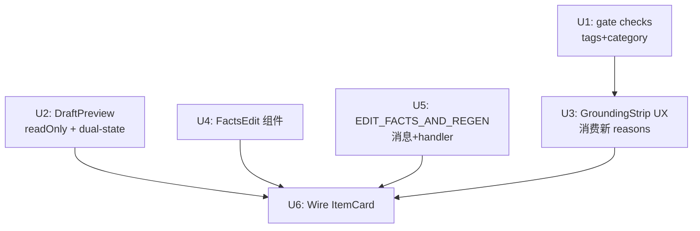

# feat: grounding Phase 2 — 完整字段防护

## Overview

Phase 1 已止血「gate 求值对象错位」。Phase 2 把防护升级为全覆盖：grounded 字段改为只读（改它须改 facts → 重新生成），口吻散文可编 + 扫描，新增 tags/category 允许集校验，补 FactsEdit 内联 UI 解死锁，更新 GroundingStrip 诚实文案。全部变更维持 snapshot provenance 不变量：只有 `assembleDraft()` 的产物可写入 `assembledDraftSnapshot`。

## Problem Frame

操作者（或模型）可手编**会发布的字段**，绕过防幻觉铁律：

- `DraftPreview.tsx` title/body/description 均无 `readOnly`，注释说「只读」但实际可编辑
- `evaluateGrounding` 无 tags 成员校验、无 category 合法值校验
- title 只读后，抓错作品名会死锁（无修正路径），需 facts 编辑 UI 解锁
- `GroundingStrip` 文案硬编码，无分字段原因、无修正路径提示

(见 origin: `docs/brainstorms/2026-06-15-grounding-phase2-full-field-protection-requirements.md`)

## Requirements Trace

- R1/R4. grounded 字段（title、body）审核 UI 只读 + 闸 defense-in-depth
- R2. 口吻散文（subtitle）保持可编 + 【待补】扫描
- R3. description 双态：`facts.简介` 在场 → 只读；缺 → prose 可编 + 扫描
- R5/R6/R7. facts 编辑 UI + 手动「重新生成」+ 解 title 死锁
- R8. tags 逐元素 ∈ recommendedTags（如配置）；category ∈ {"2","4"}；不在即拦
- R10/R11. GroundingStrip 分字段原因 + 诚实文案 + 修正路径指向 facts 编辑
- R12. 全发布字段已审计：coverImageUrl/postStatus/mediaId/publishedAt 归类明确

## Scope Boundaries

- 不引入「手编后不重新生成 snapshot 直接改 snapshot」机制（provenance 不变量）
- body 整块只读，不做结构化分块编辑
- 不改 off/dry-run 档行为（只 authorized 拦截）
- 后端服务器（server）不新增 grounding 路由
- 单条发布路径已在 Phase 2 PR #25 退役，不在本次范围
- off-mode trajectory status 命名（TODOS.md P3）不在本次处理

## Context & Research

### Relevant Code and Patterns

- `packages/extension/entrypoints/sidepanel/DraftPreview.tsx` (133 行) — props `{ draft, onChange }`；所有字段均无 readOnly，onChange 内联 `set()` helper
- `packages/extension/entrypoints/sidepanel/batch-review/sub-blocks.tsx` — `GroundingStrip({ draft, facts })` 在此；reasons[] 已从 `evaluateGrounding` 拿到，但渲染为单块文字
- `packages/extension/entrypoints/sidepanel/batch-review/ItemCard.tsx` — `draftOverrides` Map 入口；DraftPreview + GroundingStrip 均挂载于此
- `packages/extension/lib/grounding-gate.ts` — `evaluateGrounding(draft, facts?, qualityScore?): GroundingVerdict`；有 5 个 `reasons.push()` 检查，无 tags/category 校验
- `packages/extension/lib/batch-orchestrator.ts` — `retryItem()` 已含 `assembleDraft` provenance 路径（`markFilled(..., draft, gen.slots)` 第 7 参即 snapshot）
- `packages/extension/lib/messaging.ts` — `RETRY_BATCH_ITEM` 模式（sendMsg + handler + timeout）
- `packages/shared/src/facts.ts` — `FactsBlock` 类型；`FACT_TARGET` 映射已在 Phase 1 实施
- `packages/shared/src/vocab.ts` — `normalizeCategory()`：只接受 `"2"` 和 `"4"`，其余归 null
- `packages/shared/src/field-mapping.ts` — 9 个发布字段：title/subtitle/category/tags/description/body/coverImageUrl/postStatus/mediaId/publishedAt — 后四字段为操作者元数据，不需 grounding 校验

### Key Pattern: retryItem / refillGateFailed 原子写入

`retryItem()` 第 7 参（`assembledDraftSnapshot`）= `gen.draft`（assembleDraft 产物），provenance 正确。`refillGateFailed`（batch.ts:213）是另一个原子模式的例证：facts + draft + snapshot **必须同时提交**，不存在「只写 facts」的中间路径。`regenItemWithFacts` 必须遵循同一原子性原则：generateDraft 失败则 facts 不写，保留旧状态。

### evaluateGrounding 调用点普查（架构评审确认）

实际 6 个调用点，分布 4 个模块（计划初稿遗漏 3 个）：

| 位置 | 类型 | 备注 |
|------|------|------|
| `lib/batch-orchestrator.ts:309,312` | 备稿 gate（RunBatchDeps 注入） | 无 tags 参数 |
| `lib/batch-orchestrator.ts:430,434` | 授权发布闸（ApproveBatchDeps 注入） | 无 tags |
| `lib/batch/orchestrate-approve.ts:102,106` | **并行 approveBatch 实现**（计划初稿遗漏） | 同上，**两份实现必须同步改** |
| `background.ts:526` | checkGrounding 注入点 | 同上 |
| `background.ts:751` | refill 路径（via batch.ts GroundingFn） | 三参数含 qualityScore |
| `background.ts:817,822` | **rehearseIntent 首飞排演路径**（计划初稿遗漏） | 排演需与发布闸语义一致 |
| `sub-blocks.tsx:28` | GroundingStrip UI（直接调用，非注入） | 加新参数须同步 |

**类型定义须同步更新（4 处）**：`GroundingFn`（batch.ts）、`RunBatchDeps.evaluateGrounding`（×1）、`ApproveBatchDeps.checkGrounding`（×2：batch-orchestrator.ts + orchestrate-approve.ts）。

### Category allow-list 权威源

`normalizeCategory()` in `vocab.ts` 是唯一权威：合法值 `"2"`（漫画）/ `"4"`（动漫）。Category 校验直接硬编码此集合，无需配置化。

### Tags allow-list 权威源（研究结论）

`Settings.recommendedTags?: string[]` 是唯一可用来源（用户配置）。后台无真正的合法标签白名单。本次策略：**配置了 recommendedTags 则强校验；未配置则降级跳过**（graceful degradation）。这是 R8 Outstanding Question 的 planning-owned 决议。

### Institutional Learnings

- **负向断言为主**：测试「编造作品名被拦」比「合法名通过」更能证明防护有效（见 `docs/solutions/best-practices/incremental-pr-adversarial-verification-2026-06-15.md`）
- **实施前先读源码**：不信计划文档的状态描述（历史多次计划描述与代码不符）
- **snapshot 两层防护**：evaluateGrounding 防「快照里有幻觉」；readOnly UI 防「快照干净但手编输出被污染」——两层防护目的不同，本次两层都做

### External References

无需外部研究——本仓库有直接可跟随的模式（reasons.push / RETRY_BATCH_ITEM / readOnly input）。

## Key Technical Decisions

- **DraftPreview 新增 `readonlyFields` + `facts` props**，而非让 ItemCard 渲染两套组件：最小 prop surface，ItemCard 决策「哪些字段只读」，DraftPreview 只负责渲染。

- **tags 校验 graceful degradation**（recommendedTags 未配置 → 跳过）：R8 允许来源是推荐集，强行空集校验会拦全部 tags；降级比报假阳性错误对操作者友好。

- **facts 编辑 + 重新生成 = 新消息 `EDIT_FACTS_AND_REGEN`**（而非先 UPDATE_FACTS 再 RETRY）：两步合一避免中间态，facts 更新与 snapshot 刷新原子发生。handler 内部：patch item.facts → 调用与 retryItem 相同管线 → provenance 正确。

- **GroundingStrip reasons 来自 evaluateGrounding 现有 `reasons[]`**（不新增第二套理由机制）：evaluateGrounding 已返回 `{ ok, reasons }`，只需改 GroundingStrip 渲染层，不改 gate 核心逻辑。

- **description 双态由 `facts.简介?.trim()` 在场判定**（自动，非手动切换）：与 `post-assembler.ts` 中已有的 fallback 逻辑保持一致。

- **coverImageUrl/postStatus/mediaId/publishedAt 归类为「操作者元数据」不做 grounding 校验**（见 R12）：这些字段来源于 scraper 或 operator 元操作，不含 LLM 生成内容，不在防幻觉铁律范围内。

## Open Questions

### Resolved During Planning

- **tags allow-list 权威源**（R8 Outstanding）→ 决议：`Settings.recommendedTags` 强校验 / 未配置降级跳过（见上方 Key Technical Decisions）
- **description 双态判定**（R3 Outstanding）→ 决议：`facts.简介?.trim()` 在场即只读，逻辑内联于 DraftPreview，ItemCard 传 `facts` prop
- **单条路径 R9** → 已在 PR #25 退役，不再规划

### Deferred to Implementation

- FactsEdit 的 UI 布局细节（折叠还是展开、字段顺序）→ 参考 GroundingStrip 现有样式，实施时决定
- 重新生成期间 FactsEdit 的 loading state 细节
- `evaluateGrounding` 中 recommendedTags 参数注入路径（从 Settings storage 读还是 ItemCard 传下来）→ 实施时查 ItemCard 拿 settings 的现有模式

## High-Level Technical Design

> *这是方向性设计示意，供审查方向，不是实施规范。实施代理应以此为上下文，而非原样复制。*

```
ItemCard (awaiting-approval)
  ├── DraftPreview
  │     props: draft, onChange, readonlyFields={Set['title','body']}, facts
  │     title  → <input readOnly> [grounded]
  │     body   → <textarea readOnly> [grounded]
  │     subtitle → <input> editable [prose]
  │     description → readOnly if facts.简介 present, else editable [dual-state]
  │     tags/category → editable [operator metadata, gate validates]
  │
  ├── FactsEdit (new component)
  │     fields: 作品名, 集数, 制作, 漢化, 無修, 简介, 题材, 标签
  │     [重新生成] → dispatch EDIT_FACTS_AND_REGEN { itemId, newFacts }
  │                    → background: patch item.facts
  │                                  → generateDraft(topic, newFacts, enrichment)
  │                                  → markFilled(..., draft, draft)  ← snapshot = draft
  │                                  → presentForApproval
  │
  └── GroundingStrip
        props: draft, facts, recommendedTags
        calls evaluateGrounding(draft, facts, score, recommendedTags)
        renders: per-field reasons + honest verdict + 修正路径提示

Gate (evaluateGrounding)
  existing: 【待补】checks, URL source check, quality score
  new U1: category ∈ {"2","4"}; tags ∈ recommendedTags (if configured)
  returns: { ok, reasons[] }  ← reasons now cover all fields
```

## Implementation Units



---

- [ ] **Unit 1: Gate 新增 tags/category 校验 + description 裸 URL 扫描 + 类型定义同步**

**Goal:** `evaluateGrounding` 增加三个检查：category ∈ {"2","4"}；tags 逐元素 ∈ recommendedTags（如配置）；description/subtitle 裸 URL 正则扫描（补 grounding-gate.ts:L43 TODO）。同时更新 4 处 callback 类型定义（使第 4 参数全链路生效）。

**Requirements:** R3, R8；description 裸 URL 是 U2 dual-state 可编辑的前提安全条件

**Dependencies:** 无

**Files:** （4 处类型定义 + 1 处 gate 核心 + 1 处测试）
- Modify: `packages/extension/lib/grounding-gate.ts` — gate 核心逻辑新增 3 个检查 + 第 4 参 `recommendedTags` 接收
- Modify: `packages/shared/src/batch.ts` — `GroundingFn` 类型别名新增 `recommendedTags` 参数 [类型定义 1/4]
- Modify: `packages/extension/lib/batch-orchestrator.ts` — 更新 `RunBatchDeps.evaluateGrounding` 及 `ApproveBatchDeps.checkGrounding` callback 类型 [类型定义 2-3/4]
- Modify: `packages/extension/lib/batch/orchestrate-approve.ts` — 更新 `ApproveBatchDeps.checkGrounding` 并行实现中的 callback 类型 [类型定义 4/4]；须与 batch-orchestrator.ts 同步
- Test: `packages/extension/lib/grounding-gate.test.ts` — 新增 category/tags/description URL 校验 test cases

**Approach:**
- `evaluateGrounding` 新增第 4 个参数 `recommendedTags?: string[]`（可选，不传即降级）
- **category 检查**：`!["2","4"].includes(draft.category)` → reason push
- **tags 检查**：`recommendedTags?.length` 为真才执行；任一 tag 不在集合 → reason push；空 tags 不拦
- **description/subtitle 裸 URL 扫描**：正则 `/(https?:\/\/[^\s<>"]+)/g` 提取纯文本 URL，验证不在 `factUrls(facts)` 集合内 → reason push（与 body 的 `<a href>` 扫描并列）
- **类型定义**：4 处 callback 类型加 `recommendedTags?: string[]` 可选参数（TypeScript 子集兼容，现有调用方不传则不变）
- **rehearseIntent 调用点**（background.ts:817/822）：传 `undefined` 降级（排演不做 tags 校验，与发布行为一致：`if !recommendedTags → skip`）
- GroundingStrip（sub-blocks.tsx:28）直接调用：加第 4 参（props 透传）

**Patterns to follow:**
- 现有 `reasons.push()` 模式（grounding-gate.ts:29-50）
- 现有 body URL 扫描逻辑（grounding-gate.ts:40-48）作为 description 裸 URL 扫描参考

**Test scenarios:**
- Happy path: category="2", tags 全在 recommendedTags, description 无裸 URL → ok:true
- Edge case: category="99" → ok:false，reasons 含分类错误
- Edge case: tags 含不在列表项 → ok:false
- Edge case: recommendedTags=undefined 或 [] → tags 任意值不触发拦截
- Edge case: description 含非 factUrls 裸 URL → ok:false
- Edge case: description 含 factUrls 内的裸 URL → 不拦截
- Edge case: draft.tags="" 空字符串 → 不拦截
- Integration: 现有 5 个 check 行为不变（回归）

**Verification:** `pnpm --filter publisher-extension test` 全绿；`pnpm -r compile` 无类型错误（4 处类型定义已更新）。

---

- [ ] **Unit 2: DraftPreview — readonlyFields prop + description 双态**

**Goal:** DraftPreview 接受 `readonlyFields` 与 `facts` props，grounded 字段渲染为只读，description 按 `facts.简介` 在场自动判定只读/可编。

**Requirements:** R1, R2, R3, R4

**Dependencies:** 无

**Files:**
- Modify: `packages/extension/entrypoints/sidepanel/DraftPreview.tsx`
- Test: `packages/extension/entrypoints/sidepanel/DraftPreview.test.tsx`

**Approach:**
- 新增 props：`readonlyFields?: ReadonlySet<keyof ContentDraft>`（默认空集）；`facts?: FactsBlock`
- `isReadonly(field)` helper：`readonlyFields?.has(field) ?? false`
- description 双态：`const descReadOnly = isReadonly('description') || !!facts?.简介?.trim()`
- readOnly 字段：`<input readOnly>` / `<textarea readOnly>`，加 CSS class `field-input--readonly`（视觉区分，灰底或锁图标）
- onChange 调用不变（readOnly input 不触发，无副作用），现有调用方不需改

**Patterns to follow:**
- 现有 `<input className="field-input">` 结构（DraftPreview.tsx:33-50）
- 现有 `onChange` set helper 模式

**Test scenarios:**
- Happy path: `readonlyFields=Set(['title','body'])` → title/body input 有 readOnly 属性
- Happy path: readonlyFields 不传 → 全部可编（向后兼容）
- Edge case: `facts.简介` 存在 → description textarea 有 readOnly 属性
- Edge case: `facts.简介` 缺失/空字符串 → description 可编辑
- Edge case: `readonlyFields` 含 'description' 且 `facts.简介` 缺失 → description 仍只读（union）
- Integration: readOnly 字段渲染不因 onChange 回调缺失而报错

**Verification:** `pnpm --filter publisher-extension test` 绿；DraftPreview.test.tsx 覆盖上述 6 个场景。

---

- [ ] **Unit 3: GroundingStrip — 分字段 reasons + 诚实文案 + 修正路径提示**

**Goal:** GroundingStrip 改为逐条显示 evaluateGrounding reasons，绿态文案诚实（区分「通过」和「发布必过」），红态指向 facts 编辑修正路径。

**Requirements:** R10, R11

**Dependencies:** U1（tags/category reasons 来源）

**Files:**
- Modify: `packages/extension/entrypoints/sidepanel/batch-review/sub-blocks.tsx`

**Approach:**
- GroundingStrip props 新增 `recommendedTags?: string[]`（透传给 evaluateGrounding）
- 调用 `evaluateGrounding(draft, facts, undefined, recommendedTags)` → `{ ok, reasons }`
- ok=true 显示：`✓ grounding 已通过 · 发布时还将核验快照`（取代现有硬编码「✓ grounding 通过」）
- ok=false 每条 reason 独立一行显示（`<ul>` / `<li>`）
- 底部加修正提示（仅 ok=false 时）：`修正路径: 编辑 facts → 重新生成`
- 原有「缺失 facts 警告」和「URL 来源」逻辑保留，不改结构

**Patterns to follow:**
- 现有 `GroundingStrip` 内部结构（sub-blocks.tsx）
- 现有 `evaluateGrounding` 调用模式

**Test scenarios:**
- Happy path: all checks pass → 单行诚实绿文（含「发布时还将核验快照」）
- Error path: category 错误 → reasons list 含分类 reason；修正路径提示出现
- Error path: tags 违规 → reasons list 含 tags reason
- Edge case: ok=false + 多条 reasons → 全部显示，不合并
- Integration: 原「缺失 facts 警告」在 reasons 之外仍显示（回归）

**Verification:** `pnpm --filter publisher-extension test` 绿；可视检查 GroundingStrip 在 dry-run 批次中的文案符合诚实要求（人工确认）。

---

- [ ] **Unit 4: FactsEdit 内联组件**

**Goal:** 新组件 `FactsEdit.tsx`，操作者可在批次审核区编辑 FactsBlock 并触发「重新生成」。

**Requirements:** R5, R7

**Dependencies:** U2（概念相邻，视觉配合 DraftPreview）

**Files:**
- Create: `packages/extension/entrypoints/sidepanel/batch-review/FactsEdit.tsx`
- Create: `packages/extension/entrypoints/sidepanel/batch-review/FactsEdit.test.tsx`

**Approach:**
- Props: `{ facts: FactsBlock; onRegenerate: (newFacts: FactsBlock) => void; disabled?: boolean }`
- 渲染 FactsBlock 的可编 fields：作品名、集数、制作、漢化、無修、简介、题材、标签（共 8 字段）
- 本地 state 持有编辑中的 facts（`useState(props.facts)`）
- 「重新生成」button → `onRegenerate(localFacts)` → disabled 期间按钮 loading 态
- 组件不直接 dispatch，保持纯 UI（onRegenerate 由 ItemCard 提供 handler）
- 初始展示状态：根据 ItemCard 决定（title 只读时默认展开，否则折叠）

**Patterns to follow:**
- GroundingStrip 结构（sub-blocks.tsx）——同层组件
- 现有 `<input className="field-input">` 渲染

**Test scenarios:**
- Happy path: 渲染 facts 初始值；修改作品名 → 本地 state 更新
- Happy path: 点击「重新生成」→ `onRegenerate` 以当前 localFacts 调用
- Edge case: `disabled=true` → 按钮 disabled，字段 readOnly
- Edge case: facts 部分字段为 undefined → 对应 input 显示空字符串
- Integration: onRegenerate 收到完整 FactsBlock（非 partial）

**Verification:** `pnpm --filter publisher-extension test` FactsEdit.test.tsx 全绿；≥5 test cases。

---

- [ ] **Unit 5: EDIT_FACTS_AND_REGEN 消息 + background handler**

**Goal:** 新消息类型 `EDIT_FACTS_AND_REGEN`，携带 `{ itemId, newFacts }`，background **原子地**更新 item.facts + 重生成 draft + 刷新 snapshot（generateDraft 失败则 facts 不写，保留旧状态）。

**Requirements:** R6, R7

**Dependencies:** 无（复用已有 retryItem 流程）

**Files:**
- Modify: `packages/extension/lib/messaging.ts`（新增消息类型 + timeout）
- Modify: `packages/extension/entrypoints/background.ts`（注册 handler）
- Modify: `packages/extension/lib/batch-orchestrator.ts`（新增 `regenItemWithFacts` 函数）
- Test: `packages/extension/lib/batch-orchestrator.test.ts`（或新增 test 文件）

**Approach:**
- `messaging.ts`：新增 `EDIT_FACTS_AND_REGEN: { itemId: string; newFacts: FactsBlock }` → `BatchResponse`，timeout 同 `RETRY_BATCH_ITEM`（10_000ms）
- `batch-orchestrator.ts`：新增 `regenItemWithFacts(deps, itemId, newFacts)`
  - 加载 batch → 找 item → `markGenerating`（status 切为 generating）→ save
  - 调用 `generateDraft(topic, newFacts, enrichment)`
  - **失败路径**：`markGenerateFailed(batch, itemId, gen.error)` → save → return（facts **不写**，保留旧 facts）
  - **成功路径**：`markFilled(batch, itemId, draft, undefined, undefined, undefined, draft, gen.slots)` 其中第 7 参 snapshot = gen.draft；**此时** patch item.facts = newFacts（facts 与 draft+snapshot 同一 save 调用提交，原子）
  - `presentForApproval(batch)` → save → return
- **原子性原则**（与 `refillGateFailed` 对齐）：facts + draft + snapshot 三者同时写入同一 save，无中间态
- `background.ts`：注册 handler，与 `RETRY_BATCH_ITEM` 相同注入方式
- **FactsBlock 基本守卫**（安全评审建议）：入口处校验 newFacts 为对象、各字段为 string | undefined、长度 ≤ 500 chars/field

**Patterns to follow:**
- `retryItem()` 实现（batch-orchestrator.ts:636–683）
- `refillGateFailed` 原子提交模式（batch.ts:213）
- `RETRY_BATCH_ITEM` 消息注册模式（messaging.ts + background.ts）

**Test scenarios:**
- Happy path: 生成成功 → item.facts = newFacts, assembledDraftSnapshot = gen.draft, status = awaiting-approval（三者同时写入）
- Error path: generateDraft 失败 → item.facts **保持旧值**，status = error，batch 可用
- Edge case: itemId 不存在 → batch 原样返回，不抛
- Edge case: newFacts 含超长字符串 → handler 拒绝（守卫触发）
- Integration: 生成成功后 GroundingStrip 重新评估新 draft（UI 层由 ItemCard storage watch 触发）
- Integration: 生成成功后 evaluateGrounding 以新 facts 的 factUrls 为基准（URL gate 用新 facts）

**Verification:** batch-orchestrator.test.ts 覆盖上述场景；`pnpm --filter publisher-extension test` 全绿；facts 旧值保留 case 明确断言 item.facts 未变。

---

- [ ] **Unit 6: Wire ItemCard + BatchReviewPanel**

**Goal:** 串联上述所有 Unit：ItemCard 传 readonlyFields/facts 给 DraftPreview，挂载 FactsEdit + regenerate handler，传 recommendedTags 给 GroundingStrip。

**Requirements:** R1, R3, R5, R6, R10, R11（集成层）

**Dependencies:** U2, U3, U4, U5

**Files:**
- Modify: `packages/extension/entrypoints/sidepanel/batch-review/ItemCard.tsx`
- Modify: `packages/extension/entrypoints/sidepanel/BatchReviewPanel.tsx`（透传 recommendedTags）
- Test: `packages/extension/entrypoints/sidepanel/batch-review/ItemCard.test.tsx`

**Approach:**
- ItemCard 接收 `recommendedTags?: string[]` prop（由 BatchReviewPanel 从 settings 取得后传入）
- 向 DraftPreview 传：`readonlyFields={new Set(['title', 'body'])}`, `facts={item.facts}`
- 挂载 `FactsEdit`：`facts={item.facts}`, `onRegenerate={(newFacts) => sendMsg({ type: "EDIT_FACTS_AND_REGEN", itemId: item.id, newFacts })}`, `disabled={item.status === 'generating'}`
- 向 GroundingStrip 传：`recommendedTags={recommendedTags}`
- FactsEdit 默认展开条件：仅在 `item.status === 'awaiting-approval'` 时渲染（与 DraftPreview 同）

**Patterns to follow:**
- 现有 ItemCard draftOverrides + onDraftChange 传参模式
- 现有 settings 读取模式（BatchReviewPanel 已有 settings 访问）

**Test scenarios:**
- Happy path: ItemCard 渲染时 DraftPreview 收到 readonlyFields 含 title/body
- Happy path: description readOnly 当 item.facts.简介 存在
- Happy path: description 可编 当 item.facts.简介 为 undefined
- Integration: FactsEdit 的 onRegenerate 触发 sendMsg EDIT_FACTS_AND_REGEN
- Integration: GroundingStrip 收到 recommendedTags（mocked）
- Edge case: item.status=generating 时 FactsEdit disabled

**Verification:** ItemCard.test.tsx 新增 ≥6 集成 case；`pnpm -r test` 全绿；人工 dry-run 验证：title 灰底无法编辑，FactsEdit 展开，修改作品名点「重新生成」后 DraftPreview title 更新。

---

## System-Wide Impact

- **Interaction graph:** `evaluateGrounding` 新参数 `recommendedTags` 影响 **6 个调用点**（架构评审确认）：
  - `batch-orchestrator.ts` RunBatch gate + ApproveBatch gate
  - `batch/orchestrate-approve.ts` 并行 approveBatch 实现（**必须同步改，否则两条 approve 路径语义分歧**）
  - `background.ts:526` checkGrounding 注入、`background.ts:751` refill 路径、`background.ts:817/822` rehearseIntent（传 undefined 降级）
  - `sub-blocks.tsx:28` GroundingStrip 直接调用（第 4 参从 props 透传）
- **Error propagation:** `EDIT_FACTS_AND_REGEN` 失败 → item status 回 error，facts **保持旧值**（原子性），UI 显示重试入口，与 retryItem 失败路径一致
- **State lifecycle risks:** 原子写入消除中间态风险；generateDraft 失败 → facts 不变 → 状态一致；snapshot 缺失时 gate fail-closed 保持兜底
- **API surface parity:** `evaluateGrounding` 4 处类型定义同步更新（GroundingFn + RunBatchDeps + ApproveBatchDeps×2）；所有调用方向后兼容（可选参数）
- **Integration coverage:** U5 须测试「facts 旧值保留在失败路径」；U1 须验证所有 6 个调用点在 `pnpm -r compile` 无类型错误
- **Unchanged invariants:** `assembledDraftSnapshot` 来源仍只能是 `assembleDraft()` / `gen.draft` 产物；GroundingStrip 展示语义与发布闸语义一致（同一 evaluateGrounding 调用）

## Risks & Dependencies

| Risk | Mitigation |
|------|------------|
| `orchestrate-approve.ts` 并行 approveBatch 实现漏改：两条发布路径 gate 语义分歧 | U1 明确列出此文件为必改项；`pnpm -r compile` 类型检查会暴露漏改（类型定义同步后） |
| `rehearseIntent` 排演通过但真发被拦（tag/category 排演不校验）| 排演调用传 `undefined` 降级，排演与发布在此维度行为一致（都降级）；不做排演强校验 |
| regenItemWithFacts 非原子写入导致状态不一致 | U5 采用原子写入：generateDraft 成功后才同一 save 提交 facts+draft+snapshot；失败不写 facts |
| recommendedTags 透传链路长（settings → BatchReviewPanel → ItemCard → GroundingStrip/evaluateGrounding） | U6 实施时一处统一读取 settings 再逐层传下 |
| description dual-state 可编辑后裸 URL 未被 gate 扫描（安全评审发现） | **U1 先于 U2 落地**：description 裸 URL 扫描在 U1 完成，U2 方可开启 dual-state 可编辑 |
| tags allow-list 降级误导：未配置时操作者以为已校验 | GroundingStrip 仅在 recommendedTags 配置时显示 tags 校验维度，否则该维度不渲染 |
| FactsBlock 字段注入（LLM prompt 投毒） | U5 入口加基本守卫（字段类型 + 500 char 上限）；gate 兜底；操作者读后发布是最终防线 |

## Documentation / Operational Notes

- 操作者首次使用后可能困惑 title 无法手编 → `docs/ops-runbook.md` 补充：「发现作品名有误 → 展开 FactsEdit → 修改作品名 → 点重新生成」
- recommendedTags 校验行为依赖 Settings 配置 → 建议在 install-and-usage.md 说明配置项用途

## Sources & References

- **Origin document:** [docs/brainstorms/2026-06-15-grounding-phase2-full-field-protection-requirements.md](docs/brainstorms/2026-06-15-grounding-phase2-full-field-protection-requirements.md)
- Archived prior plan: [docs/plans/archive/2026-06-15-005-feat-grounding-full-field-protection-plan.md](docs/plans/archive/2026-06-15-005-feat-grounding-full-field-protection-plan.md)
- grounding gate: `packages/extension/lib/grounding-gate.ts`
- retryItem pattern: `packages/extension/lib/batch-orchestrator.ts:636`
- GroundingStrip: `packages/extension/entrypoints/sidepanel/batch-review/sub-blocks.tsx`
- DraftPreview: `packages/extension/entrypoints/sidepanel/DraftPreview.tsx`
- Category 权威: `packages/shared/src/vocab.ts:normalizeCategory`
- Field mapping: `packages/shared/src/field-mapping.ts`
