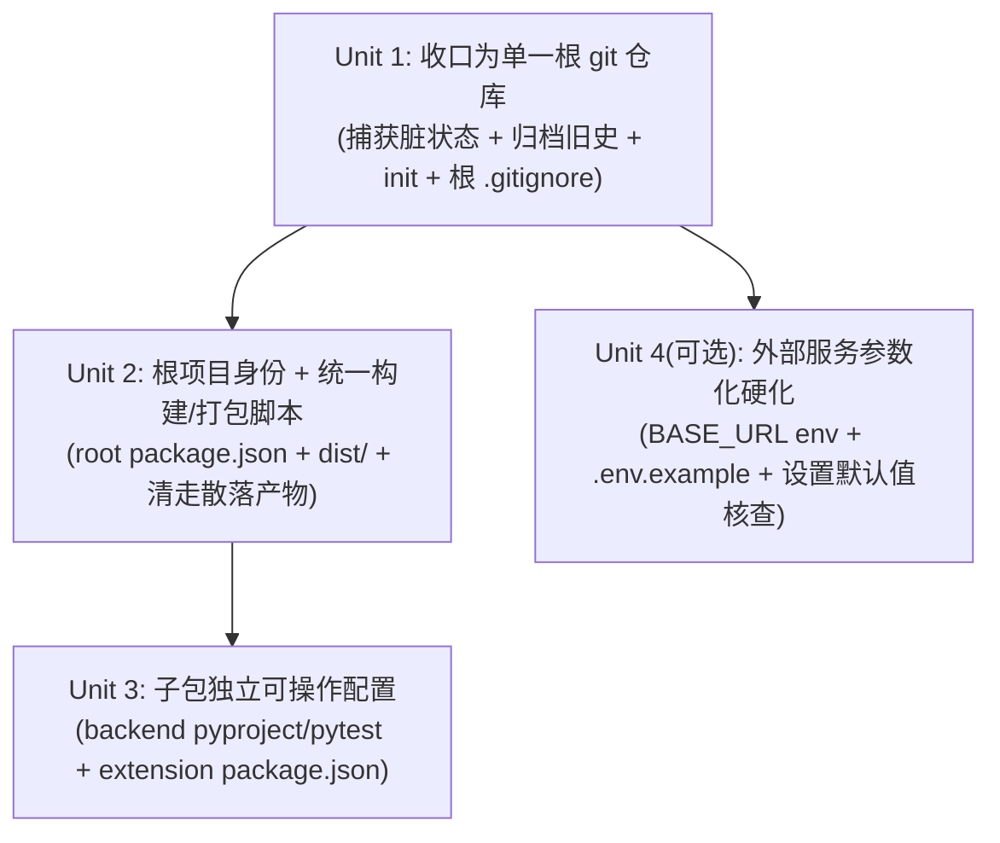

# refactor: 将 51publisher 收口为可独立打包的单一专案

## Overview

把 `51publisher/` 这个目录从「松散抽出的快照」收口成**一个可被 `git clone`、单独打包、单独操作的独立专案**。

**关键前提(已勘查验证):功能代码已经自洽**——不存在指向父 monorepo / 兄弟目录 `OmniPublisher` / `shared` 包的破损引用。因此本计划的工作**不是去改一堆断掉的引用**,而是:
1. 先**完整、可证伪地列出**仓库里所有「指向外部」的功能性引用(用户的首要诉求,见下方 Inventory),把「有意为之的外部服务」与「会断的耦合」分开,并附上「不漏」的负向证据。
2. 补上目前缺失的**顶层工程骨架**(单一根 git 仓库、根项目身份、统一构建/打包、测试可复现、产物与工具状态卫生),让它真正能当成「一个独立专案」操作。

文档类引用(README / CHANGELOG / 注释里的链接)按用户指示**本轮不扫**,留待后续单独处理。

## Problem Frame

`51publisher/` 当前形态:

- 根目录只有 `packages/`(下含 `extension/` 与 `backend/`)、`.gstack/`(本地 QA 工具状态)、`.DS_Store`、两个散落的构建产物 `51acgs-scraper-v3.0.0.{crx,zip}`。
- **根目录与 `packages/` 层没有任何 git、没有 root manifest、没有统一构建**。
- `packages/backend/.git` 与 `packages/extension/.git` 是**两个互相独立、且都无 remote 的孤立 git 仓库**;`51publisher/` 之上也无任何 git 根(`git rev-parse` 确认 not a repo)。
- 因此它既不是「一个专案」,也无法被 clone / 版本化 / 一键打包。用户要把它变成「**一个**独立专案,能被打包、单独操作」。

## Requirements Trace

- **R1.** 完整列出仓库里所有「指向外部」的功能性引用,且可证明「不漏」(负向扫描留痕)。
- **R2.** 区分「有意为之的运行时外部服务」(保留)与「会让搬出来就坏的耦合」(本轮确认为零)。
- **R3.** 让目录成为**单一根 git 仓库**的独立专案(已拍板:删除两个嵌套 `.git`,根目录 `git init`)。
- **R4.** 提供**可复现的打包流程**,产出扩展 `.zip` 与 backend 源码包,产物进 gitignored `dist/`,不再散落在源码树。
- **R5.** 让两个子包都能在**新环境从根目录独立操作**(测试可跑、依赖声明齐全、构建可跑)。
- **R6.**(可选)把两类有意为之的外部服务**显式参数化**,而非隐式写死,提升异地可操作性。

## Scope Boundaries

- **不改**任何业务逻辑 / 爬虫解析 / LLM 提示词。
- **不动**两类有意为之的外部服务的「目标」(`51acgs.com` 仍是爬取对象;LLM 仍由用户配置)——只在 R6 做可选的「参数化」硬化。
- **不扫文档**(README/CHANGELOG/注释链接)——按用户指示后续单独处理。
- **不引入** monorepo 工具链(pnpm/turborepo/nx)——两个子包技术栈异构(Python vs Chrome 扩展),根层只做最薄的脚本聚合,不强加 JS workspace。
- **不做** crx 私钥签名 / Chrome Web Store 自动上架(留作 deferred)。

## Context & Research

### 外部引用完整清单(R1 / R2 核心交付)

> 勘查方法:对 `packages/**` 的 `*.js / *.py / *.json / *.sh / *.html` 全量 grep,排除 `.git/` 与 `__pycache__/`。

**A. 有意为之的运行时外部引用 —— 保留,不视为「待改耦合」**

| # | 文件:行 | 引用 | 性质 | 处置 |
|---|---|---|---|---|
| A1 | `packages/backend/scraper/config.py:3` | `BASE_URL = "https://51acgs.com"` | 爬取目标站 | 保留;R6 可选改为 env 覆盖 |
| A2 | `packages/backend/scraper/config.py:9` | `Referer: BASE_URL` | 派生自 A1 | 随 A1 |
| A3 | `packages/extension/manifest.json:11` | `host_permissions: ["https://51acgs.com/*"]` | 扩展抓取权限 | 保留 |
| A4 | `packages/extension/background/service-worker.js`(行 21,60,61,123,139,177,196,228) | 拼接 `https://51acgs.com/...` 抓取 URL | 爬取目标站 | 保留 |
| A5 | `packages/extension/lib/llm.js:23,30,62` | `apiUrl / apiKey / model` 读自 `chrome.storage.local` | 用户运行时配置的 LLM 服务 | 保留(非写死,无内嵌密钥) |
| A6 | `packages/extension/settings/settings.html:28` | 占位示例 `https://api.openai.com/v1/chat/completions` | 设置表单 placeholder | 保留(仅 UI 示例) |
| A7 | `packages/backend/tests/*.py`、`packages/extension/tests/background-test.html` | `pic.example.com / ads.example.com / example.com` | **测试 fixture**,非真实外部 | 保留 |

**B. 「会让搬出来就坏」的耦合引用 —— 逐类穷举,结果为零(R2「不漏」负向证据)**

| 扫描类别 | 命中 |
|---|---|
| 绝对路径(`/Users`、`/home/<user>`) | **0** |
| `OmniPublisher` / `@shared` / `/shared/` / `from 'shared'` / `workspace:` / `monorepo` / `webwright` | **0** |
| 父目录相对 import(`../../` 越出包根) | **0**(扩展内最深 `background/` → `../lib/`,仍在 `extension/` 内;Python 全为 `.config`/`..config`/`.base` 包内相对) |
| `localhost` / `127.0.0.1` / 写死端口(:8000/:5000/:3000/:8080) | **0**(扩展与 backend **互不通信**) |
| `chrome-extension://` / 写死扩展 ID / `nativeMessaging` / `connectNative` / `externally_connectable` / `file://` | **0** |
| 内嵌 API key / token / secret | **0**(LLM 凭证全走 `chrome.storage`) |
| symlink / CDN 外链 `<script src="http...">` | **0** |
| 越出包的 `process.env` / `import.meta` / `__dirname` / `require()`(扩展侧) | **0**(纯浏览器全局) |

> 结论:**B 类全空**。功能代码模块层面已自洽,可移植。`config.py:17` 的 `PROJECT_ROOT = dirname(dirname(abspath(__file__)))` 亦为相对推导,路径可移植。

**C. 结构 / 打包层缺口 —— 本计划真正要做的工作**

| # | 现状 | 问题 |
|---|---|---|
| C1 | 根目录与 `packages/` 层无 git | 无法作为「一个专案」clone / 版本化 |
| C2 | `backend/.git` + `extension/.git` 两个嵌套孤立仓库,均无 remote | 不是单一专案;根级 git 工具失灵 |
| C3 | 扩展工作树脏:8 个文件 modified,`.eslintrc.json` + `tests/` untracked | 收口 git 前必须先捕获,否则丢改动 |
| C4 | `packages/51acgs-scraper-v3.0.0.{crx,zip}` 散落源码树、无 git 跟踪、无复现脚本 | 产物混入源码,不可复现 |
| C5 | 无 root manifest / 统一构建脚本 | 无项目身份、无一键打包 |
| C6 | backend 测试 `from scraper...` 隐式依赖 CWD/PYTHONPATH,无 `pytest.ini`/`pyproject.toml` | 异地从根目录跑测试会失败 |
| C7 | `.gstack/`、`data/`、`exports/`、`dist/logs`、`*.db`、`.DS_Store`、`.pytest_cache`、`.benchmarks` 混在树内 | 打包卫生差;根级无 `.gitignore` |
| C8 | 扩展无 `.gitignore`;两包与根三处版本各异(manifest 3.0.0 / backend 提交标 v1.0.0 / 产物 v3.0.0) | 版本口径不一(本轮仅记录,不强行对齐) |

### Institutional Learnings(来自项目记忆)

- 原始全功能专案是更复杂的 monorepo(pnpm workspace + `shared` 包 + iframe/content-script 架构,记忆 `repo-ops-gotchas` / `content-quality-gated-baseline`);**本 `51publisher/` 是更简化的 v3.0.0「51acgs Scraper」形态**,与记忆里那套不是同一棵树。规划以**实际磁盘内容为准**,不照搬记忆里的架构。
- 记忆 `repo-ops-gotchas`:`/ship` 版本号曾因 `VERSION`(4 位)与 `package.json`(npm 3 位)不锁步出问题 → 本计划**不**用根 `package.json` 充当扩展版本源,扩展版本仍以 `manifest.json` 为准(见 Key Technical Decisions)。
- 无 `docs/solutions/` 目录;无可复用的既往解法文件。

### External References

未做外部研究。理由:目标是「纯 Chrome MV3 扩展 + 小型 Python 爬虫」的工程结构收口,本地形态已勘查清楚,模式成熟,外部研究增益低(符合 ce:plan「本地模式清晰即跳过」)。

## Key Technical Decisions

- **单一根 git 仓库(已拍板)**:删除 `backend/.git`、`extension/.git`,在 `51publisher/` 根 `git init`。理由:最贴合「一个独立专案、单独操作」——clone 一次、根目录一处操作;两种异构产物仍以子目录逻辑分离。
- **历史处置 = 不强行合并,改为归档**:两个孤立仓库历史独立,合并历史复杂且低价值。做法:收口前对两仓各 `git bundle` 出一份归档(放到 `dist/` 外的本地备份或 `docs/` 旁),根仓从干净快照起步。理由:零丢失 + 不背历史包袱。
- **根层只做最薄聚合,不引 JS monorepo 工具**:根 `package.json` 仅承载元数据 + `scripts`(调用 shell/python),不声明 workspaces、不装 pnpm/turbo。理由:两包技术栈异构,强加 JS workspace 是过度抽象(违背「简单优先」)。
- **版本源各自为政**:扩展版本以 `manifest.json` 为准,backend 版本以其 `CHANGELOG.md`/自身约定为准,根 `package.json` 只记「专案版本」。理由:规避记忆里 VERSION/npm 版本不锁步的坑;本轮不强行三处对齐(记入 Open Questions)。
- **产物外置到 gitignored `dist/`**:所有 `.zip`/`.crx`/源码包由脚本生成进根 `dist/`,源码树不留产物。理由:可复现 + 打包卫生(解决 C4/C7)。
- **backend 用 `pyproject.toml` 同时解决「可安装」与「测试根」**:声明包与依赖、设定 pytest `rootdir`/`pythonpath`,使 `pytest` 可从根目录跑(解决 C6)。理由:一份配置消两个问题。

## Open Questions

### Resolved During Planning

- **git/项目结构如何收口?** → 用户拍板:统一为单一根仓库(删两个嵌套 `.git`)。
- **`51acgs.com` / LLM API 算不算「待改的外部引用」?** → 不算;属有意为之的运行时服务,保留(R6 仅做可选参数化)。
- **打包目标产物?** → 扩展 `.zip`(沿用现有 v3.0.0 产物形态,供 CWS/解压加载);backend 源码包(tar)+ `setup.sh` 运行。crx 签名留作 deferred。
- **要不要引 pnpm/turbo monorepo?** → 不引;根层薄脚本聚合。

### Deferred to Implementation

- 两仓 `git bundle` 归档的落地位置与命名(执行时定;不入根仓跟踪)。
- 扩展打包脚本的精确排除清单(`tests/`、`.git`、`.eslintrc` 是否随包)——执行时按「CWS 加载所需最小集」定。
- backend 打包到底用 `tar` 源码包还是 `python -m build` sdist——执行时按是否需 `pip install` 决定;先从 `tar` 起步。
- 三处版本是否统一、由谁统一(扩展/backend/根)——本轮不动,留作后续(可能需 `ce:brainstorm` 版本策略)。
- crx 私钥签名 / CWS 自动上架。

## High-Level Technical Design

> *以下仅说明目标结构与单元依赖关系,是评审用的方向性示意,不是实现规格;实现者应当作上下文而非照抄。*

目标结构(收口后):

```
51publisher/                      <- 唯一 .git(根仓库)
├─ package.json                   <- 根:专案元数据 + scripts(build/package/test/clean)
├─ .gitignore                     <- 根:统一忽略 .gstack/ data/ exports/ dist/ *.db *.crx *.zip __pycache__ .DS_Store .pytest_cache .benchmarks node_modules .env
├─ dist/                          <- (gitignored) 构建产物输出:extension-<ver>.zip / backend-<ver>.tar.gz
├─ docs/
│  └─ plans/ ...
└─ packages/
   ├─ extension/                  <- 无独立 .git
   │  ├─ package.json             <- lint/test 脚本(可选)
   │  └─ (manifest.json = 版本源)
   └─ backend/                    <- 无独立 .git
      └─ pyproject.toml           <- 包声明 + 依赖 + pytest rootdir/pythonpath
```

单元依赖(Unit 1 是不可逆地基,必须先安全捕获脏状态):



## Implementation Units

- [x] **Unit 1: 收口为单一根 git 仓库(不可逆地基)** — 完成(commit 112e215;历史归档 ../51publisher-git-archive/*.bundle 已 verify)

**Goal:** 安全地把两个嵌套孤立仓库收口成 `51publisher/` 根的单一 git 仓库,过程中零丢失。

**Requirements:** R3

**Dependencies:** 无(必须最先做,后续单元都基于根仓库)

**Files:**
- Remove: `packages/backend/.git/`、`packages/extension/.git/`(先归档后删除)
- Create: `51publisher/.gitignore`(根)
- Create(执行期临时,不入仓):两仓 `git bundle` 归档文件

**Approach:**
- **先捕获脏状态**:`extension` 工作树有 8 个 modified + `.eslintrc.json`/`tests/` untracked(C3)。先在 extension 旧仓 `git add -A && git commit` 固化,**再**做归档与删 `.git`,否则改动随 `.git` 一起丢。
- 对两仓各 `git bundle create` 一份历史归档,落到根仓之外的本地备份位置(执行时定),保留可追溯性。
- 删除两个 `.git/`;在 `51publisher/` 根 `git init`;写根 `.gitignore`(覆盖 `.gstack/ data/ exports/ dist/ *.db *.db-shm *.db-wal *.crx *.zip __pycache__/ *.pyc .DS_Store .pytest_cache/ .benchmarks/ node_modules/ .env`);首个根提交纳入两子包源码(排除 ignored 项)。

**Execution note:** 不可逆操作(删 `.git`)。执行前先完成「捕获脏状态 + 归档」,并向用户确认归档落点后再删除。

**Patterns to follow:** 复用 `packages/backend/.gitignore` 已有条目(`__pycache__/ data/ exports/ *.db *.pyc .env venv/`)作为根 `.gitignore` 的子集来源。

**Test scenarios:**
- Test expectation: none —— 纯 git/结构操作,无行为代码变更。以 Verification 的可观察结果替代。

**Verification:**
- `git -C 51publisher rev-parse --show-toplevel` 指向 `51publisher/`;`packages/*/.git` 已不存在。
- `git -C 51publisher status` 干净,且 `.gstack/`、`data/`、`exports/`、`*.crx`、`*.zip` 均未被跟踪。
- 两份 `git bundle` 归档存在且 `git bundle verify` 通过;extension 收口前的 8 处改动已包含在归档/根仓快照中(无丢失)。

---

- [x] **Unit 2: 根项目身份 + 统一构建/打包脚本** — 完成(root package.json + scripts/build-{extension,backend}.sh;npm run build 产出 dist/extension-3.0.0.zip + dist/backend-1.0.0.tar.gz 并验证内容;散落 .crx/.zip 已删)

**Goal:** 给专案一个根身份与一键打包能力,产物输出到 gitignored `dist/`,源码树不再散落 `.crx/.zip`。

**Requirements:** R4, R5

**Dependencies:** Unit 1

**Files:**
- Create: `51publisher/package.json`(根:`name/version/description/private:true` + `scripts`)
- Create: `51publisher/scripts/build-extension.sh`、`51publisher/scripts/build-backend.sh`(或内联进 npm scripts)
- Remove: `packages/51acgs-scraper-v3.0.0.crx`、`packages/51acgs-scraper-v3.0.0.zip`(散落产物,改由脚本生成)
- Output(gitignored): `51publisher/dist/extension-<manifest.version>.zip`、`51publisher/dist/backend-<ver>.tar.gz`

**Approach:**
- 根 `package.json.scripts`:`build:extension`(打 `packages/extension/` 为 zip,排除 `tests/`、`.eslintrc.json` 视需要、任何 `.git` 残留)、`build:backend`(打 `packages/backend/` 源码为 tar,排除 `data/ exports/ dist/ .pytest_cache __pycache__`)、`build`(两者)、`clean`(清 `dist/`)。脚本读 `manifest.json` 的 `version` 命名扩展产物。
- 删除 `packages/` 下散落的 `.crx/.zip`(它们无 git 跟踪),改为 `dist/` 可复现产出。
- crx 签名不在本单元(deferred);`build:extension` 先只产 zip(CWS 上传 + 解压加载均够用)。

**Execution note:** Execution target: external-delegate(纯脚本编写,可委派)。

**Patterns to follow:** 现有 `packages/backend/setup.sh`/`run.sh` 的 `cd "$(dirname "$0")"` 相对定位风格,保持脚本可移植。

**Test scenarios:**
- Happy path: 跑 `build:extension` → `dist/` 出现 `extension-3.0.0.zip`,解压后 `manifest.json` 在包根、`tests/` 不在包内。
- Happy path: 跑 `build:backend` → `dist/` 出现 `backend-*.tar.gz`,解压后含 `scraper/`、`requirements.txt`、`run.sh`,不含 `data/`/`exports/`/`__pycache__`。
- Edge case: 在已有 `dist/` 上重跑 `build` 幂等,不报错、产物被覆盖而非叠加。
- Edge case: `clean` 后 `dist/` 为空且不影响源码树。

**Verification:**
- `npm run build`(或等价)从根目录零参数成功;`git status` 仍干净(产物全在被忽略的 `dist/`)。
- 生成的扩展 zip 可在 Chrome「加载已解压的扩展」成功加载并打开 side panel。

---

- [x] **Unit 3: 子包独立可操作配置** — 完成(backend pyproject.toml 显式 pytest 配置,根目录 48 passed;extension package.json+eslint devDep+.gitignore)。诚实修正:C6 比计划设想轻,pytest 本就能从根解析(tests/__init__.py 触发 sys.path 插入),pyproject 是把隐式行为固化为显式意图。扩展 lint 为标准 `npm install && npm run lint`,未在此环境网络安装。

**Goal:** 让两个子包在新环境从**根目录**即可独立操作(测试可跑、依赖可装、lint 可跑),消除隐式 CWD/PYTHONPATH 依赖。

**Requirements:** R5

**Dependencies:** Unit 1(建议在 Unit 2 后,但不强制)

**Files:**
- Create: `packages/backend/pyproject.toml`(声明包元数据、运行依赖镜像 `requirements.txt`、`[tool.pytest.ini_options]` 设 `pythonpath`/`testpaths`)
- Create: `packages/extension/package.json`(`scripts.lint` = eslint、`scripts.test` 占位;`devDependencies` 视需要列 eslint)
- Create: `packages/extension/.gitignore`(`node_modules/`、`*.zip`、`.DS_Store`)
- Modify: 无源码改动

**Approach:**
- backend:`pyproject.toml` 用 `[tool.pytest.ini_options] pythonpath = ["."]`(或 `["src"]` 结构不适用,这里平铺即 `.`),使 `from scraper...` 在根目录 `pytest packages/backend` 或包内 `pytest` 都能解析,去掉对 CWD 的隐式依赖(C6);运行依赖与 `requirements.txt` 保持单一事实源(`pyproject` 引用或注明同步)。
- extension:补 `package.json` 收编现有 `.eslintrc.json`,`scripts.lint` 调 eslint;补 `.gitignore`(C8)。

**Execution note:** 配置文件为主,无行为变更。

**Patterns to follow:** `requirements.txt`(`httpx/beautifulsoup4/lxml/pytest`)作为 backend 依赖事实源;`.eslintrc.json` 已定义 `chrome/DB/LLM` 全局,沿用。

**Test scenarios:**
- Happy path: 从 `51publisher/` 根目录运行 backend 测试 → 5 个测试文件全部被发现并通过,无需手动设 `PYTHONPATH`/`cd`。
- Edge case: 在干净虚拟环境 `pip install -r packages/backend/requirements.txt` 后跑测试通过(依赖声明完整)。
- Happy path: `packages/extension` 下 `lint` 脚本可跑且对现有 JS 不报 `no-undef`(`chrome/DB/LLM` 全局已声明)。

**Verification:**
- 根目录一条命令即可跑通 backend 全测试(此前依赖 `cd backend`)。
- `git status` 下 `.eslintrc.json` 已被跟踪、`tests/` 已入仓(此前 untracked)。

---

- [ ] **Unit 4(可选): 外部服务参数化硬化**

**Goal:** 把两类有意为之的外部服务从「隐式写死」改为「显式可配」,提升异地独立操作性(R6)。仅在用户确认需要时做。

**Requirements:** R6

**Dependencies:** Unit 1(与 Unit 2/3 独立,可并行或后置)

**Files:**
- Modify: `packages/backend/scraper/config.py`(`BASE_URL = os.environ.get("SCRAPER_BASE_URL", "https://51acgs.com")`)
- Create: `packages/backend/.env.example`(`SCRAPER_BASE_URL=https://51acgs.com`)
- Test: `packages/backend/tests/test_config.py`
- Verify(无需改): `packages/extension/settings/settings.js`(确认 `apiUrl/apiKey/model` 有合理默认/占位与必填校验)

**Approach:**
- backend `config.py` 已 `import os`,仅需把 `BASE_URL` 改为读 env 带默认;`Referer`(`config.py:9`)自动随之。`.env`/`.env.example`:`.env` 已在 backend `.gitignore`,补 `.env.example` 作模板。
- 扩展侧 LLM 本就走 `chrome.storage`(A5),无需改写死值;只**核查**设置页对必填项的校验与默认占位是否清晰(`llm.js:29` 已有「请先配置 API 设置」防御)。

**Execution note:** 本单元含行为变更(配置读取路径),test-first:先写 `test_config.py` 失败用例再改 `config.py`。

**Patterns to follow:** `config.py` 现有 `os.path` 用法;不引入额外依赖(不上 `python-dotenv`,保持零新依赖,env 由 shell/`setup.sh` 注入)。

**Test scenarios:**
- Happy path: 设 `SCRAPER_BASE_URL=https://staging.example.com` → `config.BASE_URL` 与 `HEADERS["Referer"]` 均为该值。
- Edge case: 未设环境变量 → `BASE_URL` 回落默认 `https://51acgs.com`(保持现状,零回归)。
- Edge case: 设为空字符串 → 行为明确(回落默认或显式报错,二选一并在测试固定)。

**Verification:**
- 现有 5 个 backend 测试在默认(未设 env)下仍全绿(零回归)。
- 新增 `test_config.py` 覆盖「env 覆盖 / 默认回落」两条路径。

## System-Wide Impact

- **Interaction graph:** 扩展与 backend **无任何进程间/网络耦合**(已验证:无 nativeMessaging、无 localhost、无共享 ID),两者改动互不影响。根脚本只读子包、不改其运行时行为。
- **Error propagation:** Unit 1 是唯一高风险点——删 `.git` 不可逆;缓解=先 commit 脏状态 + `git bundle` 归档 + 用户确认归档落点。
- **State lifecycle risks:** 运行时数据(`data/scraper.db`、`exports/*.json`、`dist/logs`)必须进 `.gitignore`,避免被打包/提交;backend `.gitignore` 已含,根 `.gitignore` 需补齐(Unit 1)。
- **API surface parity:** 扩展产物形态(zip)与 backend 产物形态(源码包)经统一脚本产出,口径一致;版本源各自为政(扩展 `manifest`、backend 自身),根脚本读取而非覆盖。
- **Unchanged invariants:** 不改任何爬虫解析、LLM 提示词、`chrome.storage` 配置模型、`51acgs.com` 目标;Unit 4 默认行为与现状完全一致(env 未设即回落)。

## Risks & Dependencies

| 风险 | 缓解 |
|---|---|
| 删 `.git` 前 extension 8 处脏改动未捕获 → 丢失 | Unit 1 强制「先 commit/归档,后删」,Verification 校验改动在快照中 |
| 两仓历史被丢弃引发追溯需求 | `git bundle` 双归档,`bundle verify` 通过后才删 `.git` |
| 散落 `.crx/.zip` 被误当源码打进发布包 | Unit 2 删散落产物 + 根 `.gitignore` 忽略 `*.crx/*.zip`,产物只出现在 `dist/` |
| 运行时数据/日志/`.gstack/` 被打包 | 根 `.gitignore` 覆盖 + 打包脚本显式排除清单 |
| backend 测试异地仍依赖 CWD | Unit 3 `pyproject.toml` 设 `pythonpath`,Verification 从根目录验证发现+通过 |
| 三处版本口径不一致引发混乱 | 本轮不强行对齐,记入 Open Questions,后续单独定版本策略 |

## Documentation / Operational Notes

- 文档(README/CHANGELOG/安装说明)按用户指示**本轮不扫**;Unit 完成后会改变「如何 clone / 构建 / 打包」的事实,需在**后续文档轮**统一更新(根 README 缺失是已知项,留待文档轮)。
- 运行性:`setup.sh`/`run.sh` 仍可用;新增根 `npm run build` 作为打包入口。

## Sources & References

- 关键代码:`packages/backend/scraper/config.py`、`packages/extension/manifest.json`、`packages/extension/lib/llm.js`、`packages/extension/background/service-worker.js`
- 勘查证据:B 类负向扫描(绝对路径 / `OmniPublisher` / 父目录 import / localhost / 扩展 ID / 内嵌密钥 / symlink / CDN 均为 0)
- 项目记忆:`repo-ops-gotchas`(版本不锁步坑)、`content-quality-gated-baseline`(原始 monorepo 形态背景)
