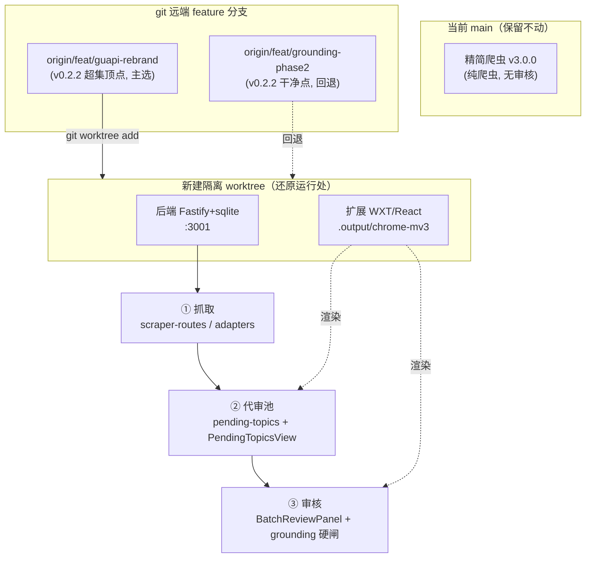
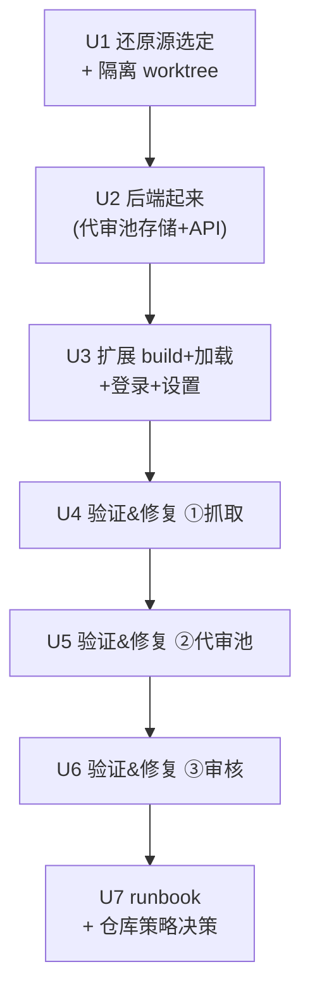

# fix: 恢复 抓取→代审池→审核 主流水线

## Overview

用户的核心工作流——**抓取 51acgs.com 最新资源 → 进入代审池 → 审核**——「按钮全坏了」。

根因不是按钮坏了，而是**今天（2026-06-18）的「独立打包/精简快照」重构把整条审核流水线删掉了**。当前磁盘与 `origin/main` 上是一个 vanilla-JS 纯爬虫（`manifest` 名 `51acgs Scraper` v3.0.0），只有「全量爬取 / AI 生成 / 复制导出」，**没有代审池、没有审核界面**。

用户上周的完整 pipeline 是另一套系统——**51guapi 吃瓜小幫手**：WXT/React 扩展 + Fastify/better-sqlite3 本地后端。它现在**只存活在 git feature 分支上**，最完整顶点是 `origin/feat/guapi-rebrand`（v0.2.2，含全部其他分支）。

本计划采用 **Path A：把老版整体还原到隔离 worktree、跑起来、逐段验证三段流水线、修掉真正坏的环节**；今天的精简快照原封保留。这是恢复成本最低、可逆性最高的路径。

## Problem Frame

- **用户体验**：打开扩展，找不到/点不动「代审池」「审核」相关按钮，主工作流瘫痪。
- **真实状态**：当前 working dir + `origin/main` = 精简爬虫；审核 pipeline 不在这份代码里。
- **资产位置**：完整 pipeline 在 `origin/feat/guapi-rebrand`（git 远端 feature 分支）。
- **用户决策**（本次对话）：现状判断＝「不确定，换过好几个版本」；修复方向＝「你先帮我判断再给建议」。判断结论已采纳为 Path A（见 Key Technical Decisions）。

## Requirements Trace

- **R1.** 三段主流水线重新可用：① 抓取 51acgs.com 最新资源 → ② 资源进入代审池 → ③ 进入审核界面逐条审核。
- **R2.** 恢复过程**不破坏**今天的精简快照成果（`main`、`dist/extension-3.0.0.zip` 保持可回到）。
- **R3.** 还原后的版本能**端到端跑通**：后端起得来（healthz ok）、扩展装得上（侧边栏渲染）、三段各自有可观察的成功信号。
- **R4.** 防幻觉/fail-closed 硬闸等原有安全约束随老版一起回来，不被旁路（grounding gate 是该项目铁律）。
- **R5.** 产出一份「日常如何启动」的简短 runbook，并就「精简版 vs 还原版」的长期取舍留下明确记录。

## Scope Boundaries

- **非目标**：不在 vanilla-JS 精简爬虫上重写代审池/审核（那是 Path B，已否决）。
- **非目标**：不做新功能开发、不升级框架、不改产品形态——只「还原 + 修复到能跑」。
- **非目标**：不删除、不强推、不改写 `origin/main`（远端策略决策单独处理，见 Open Questions）。
- **非目标**：不把今天的精简 Python 爬虫与老 Node 后端做融合（列为未来可选，见 Deferred）。
- **非目标**：不做真发到第三方平台（zero-submit 铁律对第三方仍适用；验证止于 dry-run / 自家后台）。

## Context & Research

### Relevant Code and Patterns（均在 `origin/feat/guapi-rebrand`）

三段流水线的实际落点：

| 阶段 | 后端 | 扩展 UI |
| --- | --- | --- |
| ① 抓取 | `packages/backend/src/routes/scraper-routes.ts`（`POST /api/v1/scraper/trigger`、`GET /scraper/adapters`、`GET /scraper/sites`、`POST /scraper/auto-generate`）；`src/scraper/adapters/{generic,template,demo}-adapter.ts` | 抓取触发入口（侧边栏） |
| ② 代审池 | `src/routes/pending-routes.ts`（`GET/POST/PUT/DELETE /api/v1/pending-topics(/:id)`）；`src/scraper/pending-{store,queue,db}.ts` | `entrypoints/sidepanel/PendingTopicsView.tsx`、`lib/pending-client.ts` |
| ③ 审核 | `src/routes/batch-routes.ts`、`draft-routes.ts` | `entrypoints/sidepanel/BatchReviewPanel.tsx` + `batch-review/*`（ApprovalBar / DriftView / FactsEdit / QuarantineBlock / SummaryBar）、`TodayBatchView.tsx`、`today-batch/ReviewableItemsList.tsx`、`DraftPreview.tsx`、`DryRunReport.tsx` |

- 主导航：`entrypoints/sidepanel/App.tsx`（view: main/settings/auth/metrics）+ `WorkflowNav.tsx`（workflow-grid 卡片）。
- 运行形态：pnpm monorepo（`backend` / `extension` / `shared`），Node 20（`.nvmrc`=20），WXT 扩展，better-sqlite3 原生编译。
- 启动脚本：根 `package.json` → `pnpm dev:backend`、`pnpm build:extension`、`pnpm -r test`；另有 `docker-compose.yml`、`Makefile`、`scripts/launchd/*`、`scripts/preflight/`（dryrun-green 预检）。
- 安装文档：`docs/install-and-usage.md`（含「九、常见问题」故障表，直接对应本计划诊断单元）。

### Institutional Learnings（来自项目 memory）

- **LLM 凭证已轮换**（2026-06-12）：旧 key 返回 403；新 endpoint `https://la-sealion.inaiai.com/v1`，model `gemma4-31b-heretic`，需在 prompt 内指定 JSON 格式。→ 还原后 403 的首要怀疑对象。
- **仓库操作陷阱**：改 content script 须「重载扩展 + 刷新目标页」；仅 Chromium；pnpm；后台 iframe 架构；hook 需手动启用（`git config core.hooksPath scripts/git-hooks`）。
- **grounding 闸铁律**：闸只查 `assembledDraftSnapshot`；发布对象必须==快照，否则铁律泄漏（历史上修过两次旁路）。还原后审核段须确认硬闸仍在。
- **选择器漂移被动发现**：后台改版会导致填充错位；轻则改「字段映射」，重则改代码（`docs/field-mapping-guide.md`）。
- **scraper 自动发现已合并**、首飞路径 A 已完成、Unit5 真发已完成——证明老版在 ~2026-06-15/17 是**可运行、已验收**的，还原风险低。

### External References

- 老版 `README.md`（`51guapi 吃瓜小幫手`）「快速開始」四步 + `docs/install-and-usage.md`「九、常见问题」是本计划验证/诊断步骤的一手依据。
- WXT（扩展构建）、Fastify v5 + @fastify/cors + better-sqlite3（后端）——版本锁定在各 `package.json`，按 lockfile 安装即可，无需外部调研。

## Key Technical Decisions

| 决策 | 理由 |
| --- | --- |
| **采用 Path A（整体还原），否决 Path B（精简版上重搭）** | 完整 pipeline 现成且测过（300+ 测试、首飞已验收）。还原≈小时级；Path B 要把整套 React 审核 UI 用 vanilla JS 重写≈周级且高风险。符合「简单胜于聪明」。 |
| **还原源 = `origin/feat/guapi-rebrand`（主），`origin/feat/grounding-phase2-full-field-protection`（v0.2.2，回退）** | guapi-rebrand 是所有 feature 分支超集顶点（比 grounding-phase2 多 45 提交，含全部）、最新（06-17）。但它是 WIP 改名分支，若 build/preflight 不绿，回退到干净的 v0.2.2 版本号点。 |
| **用 `git worktree` 隔离签出，不切当前 `main`** | 当前 main = 精简快照，今天的成果。worktree 让老版与精简版**并存**，零破坏、全可逆，符合「不可逆操作先确认」。 |
| **先「特征化重现」每段的坏点，再修**（characterization-first） | 用户说「都坏了」，但精简快照本身没这些按钮——「坏」很可能是「环境没配/后端没起/凭证过期/选择器漂移」而非代码 bug。先重现定位，避免盲目改代码。 |
| **远端 `origin/main` 暂不动** | 它已被精简版覆盖。是否把还原版重新设为 canonical main 是产品/仓库策略决策，不在本次修复范围（见 Open Questions）。 |

## Open Questions

### Resolved During Planning

- **「按钮坏了」到底是坏还是没了？** → 当前磁盘/`origin/main` 是纯爬虫，**根本没有**代审池/审核按钮；用户「换过好几个版本」故自己也不确定。结论：按「功能被精简掉、需从老版还原」处理（Path A）。
- **哪个 ref 是「上周能跑的完整版」？** → `guapi-rebrand`（超集顶点）为主、`grounding-phase2`/v0.2.2 为回退。`origin/main` 已不再代表老版。
- **还原需要后端吗？** → 需要。代审池/审核依赖 Fastify + better-sqlite3 持久化与 grounding 硬闸，非纯前端可替代。

### Deferred to Implementation

- **每段「真正坏在哪」**：是执行期发现项（凭证 403 / 选择器漂移 / CORS fail-closed / json_schema 降级 / content-script 未重载）。Unit 4–6 用「常见问题」表逐一排查；具体 bug 待重现后定位。
- **guapi-rebrand 是否 build/test 全绿**：执行期 Unit 1 第一道闸验证；不绿则回退 v0.2.2。
- **LLM/JWT/CORS 等密钥的实际取值**：用户本地持有（la-sealion key、JWT 生成），计划只给生成步骤，不含明文。

## High-Level Technical Design

> *以下示意「还原策略 + 三段流水线映射」，是供评审确认方向的指引，不是实现规格；执行者按当前真实代码为准。*

## Implementation Units

> 单元 4→5→6 是一条流水线（每段以上一段产出为输入），建议按序验证：上一段不通，下一段无意义。

- [ ] **Unit 1: 选定还原源 + 创建隔离 worktree**

**Goal:** 在不动当前 `main` 的前提下，把老版完整代码签出到独立 worktree，并确认它能装能 build。

**Requirements:** R2, R3

**Dependencies:** 无

**Files:**
- 新建：git worktree 目录（建议仓库外同级，如 `../51publisher-restore`，避免嵌套触发 biome/hook 冲突——见 memory「biome worktree 嵌套」陷阱）
- 不修改任何当前仓库受版本控制的文件

**Approach:**
- `git fetch` 后从 `origin/feat/guapi-rebrand` 建 worktree（detached 或新分支 `restore/pipeline`）。
- 第一道闸：`pnpm install`（注意 better-sqlite3 原生编译、`onlyBuiltDependencies`）→ `pnpm -r compile` / `pnpm -r test` / `pnpm preflight`。
- 若 guapi-rebrand 不绿 → 回退 `origin/feat/grounding-phase2-full-field-protection`（v0.2.2）重建 worktree。
- 启用 hook：`git config core.hooksPath scripts/git-hooks`。

**Execution note:** 这是「先确认地基能立」的特征化步骤；build/test 不绿就回退，别在坏地基上往下走。

**Patterns to follow:** 老版 `README.md`「快速開始 1」；memory「仓库操作陷阱」（pnpm、仅 Chromium、worktree 嵌套）。

**Test scenarios:**
- Happy path：worktree 内 `pnpm install` 成功、`pnpm -r test` 全绿、`pnpm preflight` 通过 → 选定该 ref。
- Edge case：guapi-rebrand 安装/编译失败 → 自动回退 v0.2.2 并复跑，记录回退原因。
- 验证不破坏：回到主仓库 `git status` 干净、`main` 仍指向 176b3aa、`dist/extension-3.0.0.zip` 仍在。

**Verification:** 选定一个 build+test 全绿的 ref；当前 `main` 与精简快照零改动。

- [ ] **Unit 2: 后端起来——还原代审池存储 + API**

**Goal:** 让 Fastify 后端在 `:3001` 跑起来，代审池/抓取/审核相关路由可响应。

**Requirements:** R1(②③ 基座), R3, R4

**Dependencies:** Unit 1

**Files:**
- 新建（worktree 内，不进版本库或仅本地）：`packages/backend/.env`（由 `.env.example` 复制填写）
- 涉及（只读理解，必要时修）：`src/index.ts`、`src/middleware/*`（CORS/JWT fail-closed）、`src/routes/healthz-routes.ts`、`pending-routes.ts`、`scraper-routes.ts`、`batch-routes.ts`、`draft-routes.ts`

**Approach:**
- 按 `.env.example` 填：`LLM_API_KEY`（la-sealion 新 key）、`LLM_ENDPOINT=https://la-sealion.inaiai.com/v1`、`JWT_SECRET`（32+ 随机）、`JWT_ADMIN_PASSWORD_HASH`（`node packages/backend/scripts/hash-password.mjs` 生成）、`CORS_ORIGIN=chrome-extension://iljimdgfajpgnmanklehhmapojbcjecd`（扩展 ID 由 wxt 固定，dev==prod）。
- `pnpm dev:backend` → `curl http://127.0.0.1:3001/api/v1/healthz` 期望 `{"status":"ok"}`。
- 注意 fail-closed：CORS/JWT 留占位值会拒绝启动（见故障表）。

**Execution note:** 密钥只在本地 `.env`；计划与提交不含明文（脱敏 pre-commit hook 已启用）。

**Patterns to follow:** 老版 `README.md`「快速開始 2」；`docs/install-and-usage.md`「九、常见问题：后端启动报 fail-closed」。

**Test scenarios:**
- Happy path：`curl /api/v1/healthz` → `{"status":"ok"}`；`GET /api/v1/scraper/adapters` 返回适配器列表。
- Error path：`.env` 缺 `JWT_ADMIN_PASSWORD_HASH` 或 `CORS_ORIGIN=*` → 服务 fail-closed 拒启，错误信息明确（确认安全约束 R4 仍在）。
- Edge case：better-sqlite3 原生模块未编译 → 启动报错；记录修复（rebuild / 切 Node 20）。
- 回归：`pnpm --filter @51guapi/backend test` 全绿（含 pending-store / pending-routes 测试）。

**Verification:** 后端常驻，healthz ok，三段相关路由均非 404/500。

- [ ] **Unit 3: 扩展 build + 加载 + 登录 + LLM 设置**

**Goal:** 构建并加载 WXT 扩展，侧边栏渲染出主工作流导航（含代审池、审核入口），完成鉴权与 LLM 配置。

**Requirements:** R1(UI 入口), R3

**Dependencies:** Unit 2（鉴权/CORS 需后端在线）

**Files:**
- 构建产物：`packages/extension/.output/chrome-mv3/`
- 涉及（只读理解，必要时修）：`entrypoints/sidepanel/App.tsx`、`WorkflowNav.tsx`、`AuthView.tsx`、`Settings.tsx`、`manifest`/`wxt.config.ts`（host_permissions、EXTENSION_KEY）

**Approach:**
- `pnpm build:extension` → `chrome://extensions` 开发者模式 →「載入已解壓」选 `.output/chrome-mv3/`。
- 确认扩展 ID == `.env` 的 `CORS_ORIGIN`（不一致则 CORS 全挡）。
- 侧边栏：登录（AuthView，密码＝hash 对应明文）→「⚙ 设置」填 endpoint `https://la-sealion.inaiai.com/v1` + model `gemma4-31b-heretic` + API key →「拉取模型列表」成功。

**Patterns to follow:** 老版 `README.md`「快速開始 3、4」；memory「改 content script 须重载扩展+刷新页」。

**Test scenarios:**
- Happy path：侧边栏渲染、`WorkflowNav` 卡片可见（度量 + 代审池/审核/今日批次入口）、登录成功、模型列表拉到。
- Error path：「拉取模型列表」网络错 → 查 endpoint 拼写 / `host_permissions` 缺该域名（需加后重新 build）。
- Integration：登录态下扩展调后端命中 CORS（无 `CORS policy` 报错）；ID 与 `CORS_ORIGIN` 一致。
- 回归：`pnpm --filter @51guapi/extension test` 全绿。

**Verification:** 侧边栏可登录、可进设置、可拉模型；三段入口在 UI 上都点得到（点进去是否有数据由 U4–U6 验证）。

- [ ] **Unit 4: 验证 & 修复 ① 抓取（51acgs.com 最新资源）**

**Goal:** 触发抓取，确认能从 51acgs.com 取到最新资源并落库。

**Requirements:** R1①, R3

**Dependencies:** Unit 3

**Files:**
- 涉及（诊断驱动，按需修）：`src/routes/scraper-routes.ts`、`src/scraper/adapters/{generic,template}-adapter.ts`、抓取触发的侧边栏入口
- 测试：对应 `*-adapter.test.ts`；如修选择器，补一条回归用例

**Approach:**
- 触发 `POST /api/v1/scraper/trigger`（或 UI 抓取按钮），观察是否抓到条目。
- 失败优先怀疑：**选择器漂移**（51acgs.com 改版，adapter 解析空）、SSRF allowlist（`ALLOWED_HOSTS` 未含目标）、请求被反爬限流。
- 先重现（characterization）再定位修复点；改 adapter 选择器须配回归用例。

**Execution note:** characterization-first——先让「抓 0 条/报错」稳定重现，再改解析逻辑。

**Patterns to follow:** memory「选择器漂移被动发现」、`docs/field-mapping-guide.md`；e2e fixture 迭代法（本地 fixture + 真解析）。

**Test scenarios:**
- Happy path：触发抓取 → 返回 N>0 条最新资源，落入待处理存储。
- Error path：adapter 解析返回空 → 定位选择器漂移；修后用真实页面快照 fixture 跑回归绿。
- Edge case：目标站限流/超时 → 重试退避生效，不崩溃、有可读错误。

**Verification:** 一次抓取产出 ≥1 条最新资源条目，可在后端存储/日志确认。

- [ ] **Unit 5: 验证 & 修复 ② 代审池（进入待审）**

**Goal:** 抓取产出的资源正确进入代审池，`PendingTopicsView` 能列出、可操作。

**Requirements:** R1②, R3

**Dependencies:** Unit 4

**Files:**
- 涉及（诊断驱动，按需修）：`src/routes/pending-routes.ts`、`src/scraper/pending-{store,queue,db}.ts`、`entrypoints/sidepanel/PendingTopicsView.tsx`、`lib/pending-client.ts`
- 测试：`pending-store.test.ts`、`pending-routes.test.ts`、`pending-client.test.ts`、`PendingTopicsView.test.tsx`

**Approach:**
- 确认 U4 抓取的资源经 pending-queue/store 入代审池；`GET /api/v1/pending-topics` 返回这些条目；侧边栏代审池视图渲染。
- 失败优先怀疑：抓取产出未接入 pending 写入、pending-client 调用鉴权/CORS、列表渲染数据契约不匹配。

**Test scenarios:**
- Happy path：U4 抓的条目出现在代审池列表，状态=待审。
- Integration：`pending-client` → `pending-routes` → `pending-store` 全链路一条写入能在 UI 读出（mock 证明不了，须真链路）。
- Error path：写入失败/列表空 → 区分「抓取没产出」vs「pending 写入断」vs「UI 拉取断」，分别定位。

**Verification:** 代审池里能看到刚抓的最新资源，且可选中进入下一步。

- [ ] **Unit 6: 验证 & 修复 ③ 审核（含防幻觉硬闸）**

**Goal:** 从代审池选条目进入审核（`BatchReviewPanel`），AI 草稿生成 + 事实注入 + grounding 硬闸 + dry-run 预演全部可用。

**Requirements:** R1③, R3, R4

**Dependencies:** Unit 5

**Files:**
- 涉及（诊断驱动，按需修）：`entrypoints/sidepanel/BatchReviewPanel.tsx`、`batch-review/*`（ApprovalBar/DriftView/FactsEdit/QuarantineBlock/SummaryBar）、`DraftPreview.tsx`、`DryRunReport.tsx`；后端 `batch-routes.ts`、`draft-routes.ts`、grounding gate 服务
- 测试：`BatchReviewPanel.test.tsx`、`batch-review/ItemCard.test.tsx`、draft/grounding 相关后端测试

**Approach:**
- 选代审池条目 → 生成草稿 → 检视事实注入状态、连结来源红/绿标、硬闸预判 → dry-run 报告。
- 失败优先怀疑：**LLM 403/凭证过期**（memory：旧 key 失效，须用 la-sealion 新 key）；`json_schema` 不支持需降级 `json_object`；grounding 闸读取的 `assembledDraftSnapshot` 与审核对象不一致（铁律泄漏，须确认闸==发布对象）。
- 止于 dry-run / 自家后台 fill 预演，**不真发第三方**（zero-submit 对第三方仍适用）。

**Execution note:** characterization-first；特别确认 grounding 硬闸不被旁路（历史踩过两次，见 memory）。

**Patterns to follow:** memory「grounding 闸求值=发布对象」「grounding gate rewrite bypass 修复」；`docs/install-and-usage.md`「九、常见问题」生成失败条目。

**Test scenarios:**
- Happy path：代审池条目 → 草稿生成成功 → 事实(作品名/集数/连结)原样注入 → 硬闸放行（无【待補】、连结来源匹配）→ dry-run 绿。
- Error path：LLM 403 → 换新 key 后恢复；模型不返回合法 JSON → 降级/重试路径生效。
- Security/铁律：草稿含【待補】或连结非来源 → 硬闸 fail-closed 拦截，authorized 发布被挡（确认 R4）。
- Integration：审核「通过」后进入一键填表预演（自家后台/dry-run），不触发任何自动提交。

**Verification:** 能把一条最新资源走完「抓取→代审池→审核→dry-run 填表」，硬闸行为正确。

- [ ] **Unit 7: Runbook + 仓库策略决策记录**

**Goal:** 写下「日常如何启动这套」的简短步骤，并就「精简版 vs 还原版」长期取舍留明确决定。

**Requirements:** R5

**Dependencies:** Unit 6

**Files:**
- 新建：`docs/runbooks/restore-pipeline-run.md`（启动后端、build/加载扩展、设置、三段自检清单）
- 更新：项目 memory（还原结论、选定 ref、坏点与修法）

**Approach:**
- Runbook 用 U2–U6 验证过的真实命令与自检项。
- 决策记录：还原版作为日常运行版；当前精简 `main` 的去向（保留为子工具 / 重新设 canonical / 归档）作为待用户拍板项列出，不在本次擅自改远端。

**Test scenarios:** Test expectation: none —— 纯文档/记录单元。

**Verification:** 照 runbook 从零能把三段跑起来；决策记录可被下次会话读到。

## System-Wide Impact

- **Interaction graph:** 还原版引入「扩展 ↔ `:3001` 后端」依赖（精简爬虫无此依赖，直连 51acgs.com + IndexedDB）。后端 down 则代审池/审核全挂——日常启动须先起后端。
- **Error propagation:** 后端 fail-closed（CORS/JWT 缺失拒启）、LLM 403、选择器漂移——三类是最可能的连锁失败源，U2/U6/U4 分别兜底。
- **State lifecycle risks:** 代审池用 better-sqlite3 本地库；worktree 与精简版各自独立存储，不互通（预期行为）。
- **API surface parity:** 扩展 ID 由 `wxt.config.ts` 的 `EXTENSION_KEY` 固定，故 `CORS_ORIGIN` 单值即可；ID 漂移会让整条后端调用被 CORS 挡。
- **Unchanged invariants（明确不动）:** 当前 `main`（176b3aa 精简快照）、`origin/main`、`dist/extension-3.0.0.zip` 全程不改；还原在隔离 worktree 进行，随时可丢弃回到现状。

## Risks & Dependencies

| 风险 | 缓解 |
| --- | --- |
| `guapi-rebrand` 是 WIP 改名分支，可能 build/test 不绿 | Unit 1 第一道闸先验证；不绿即回退干净的 `grounding-phase2`/v0.2.2 |
| LLM 凭证过期（旧 key 403） | 用 memory 记录的 la-sealion 新 endpoint/model；U6 把 403 列为首查项 |
| 51acgs.com 改版导致选择器漂移、抓取产出 0 | U4 characterization-first 重现 + fixture 回归；轻则字段映射、重则改 adapter |
| 后端 fail-closed 拒启（CORS/JWT 占位） | U2 按 `.env.example` 生成真实 JWT_SECRET / 密码 hash / 固定 CORS_ORIGIN |
| better-sqlite3 原生编译失败（Node 版本不符） | 锁 Node 20（`.nvmrc`）；`onlyBuiltDependencies` 已声明；失败则 rebuild |
| worktree 嵌套触发 biome/prettier hook 冲突 | worktree 建在仓库**外**同级目录（见 memory「biome worktree 嵌套」陷阱） |
| 密钥误入提交 | 脱敏 pre-commit hook（`core.hooksPath`）+ `.env` 不进版本库 |

## Documentation / Operational Notes

- 产出 `docs/runbooks/restore-pipeline-run.md`（日常启动 + 三段自检）。
- 还原后日常启动顺序固定：**先 `pnpm dev:backend`（确认 healthz）→ 再用已加载扩展**。
- 长期仓库策略（精简版去向、是否重设 canonical main）需用户单独决策，本计划只记录、不执行远端变更。

## Sources & References

- 还原源：`origin/feat/guapi-rebrand`（主）、`origin/feat/grounding-phase2-full-field-protection`（v0.2.2 回退）
- 关键代码：`packages/backend/src/routes/{scraper,pending,batch,draft,healthz}-routes.ts`、`src/scraper/{adapters,pending-store,pending-queue,pending-db}`、`packages/extension/entrypoints/sidepanel/{App,WorkflowNav,PendingTopicsView,BatchReviewPanel}.tsx` + `batch-review/*`
- 文档：老版 `README.md`、`docs/install-and-usage.md`（「九、常见问题」）、`docs/field-mapping-guide.md`
- 项目 memory：`llm-credentials-updated`、`repo-ops-gotchas`、`grounding-gate-publish-basis`、`feedback-grounding-gate-rewrite-bypass`、`release-readiness-2026-06-11`、`standalone-packaging-2026-06-18`
- 相关计划：`docs/plans/2026-06-18-001-refactor-standalone-packaging-plan.md`（造成本次回归的重构）
