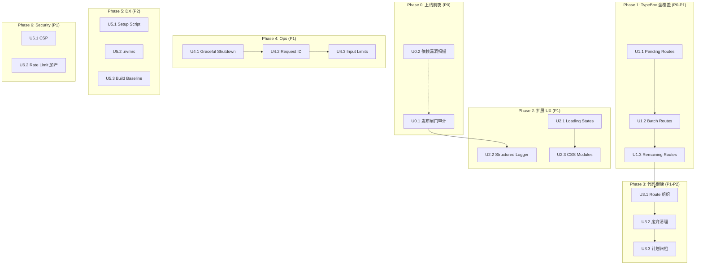

# 全面系统优化计划 — 收口所有剩余缺口

## Overview

51publisher 经历了多轮迭代优化（2026-06-09 七维度大重构 → 06-10 技术债清理 → 06-11 Phase2-5 功能迭代 → 06-15 上线就绪修复），核心脊椎（三世界模型、防幻觉事实注入、安全闸门链、CI 管线）已硬。但多轮迭代后仍残留若干**已知但延后**的缺口。

本计划对所有剩余优化项做**一次完整收口**，让项目从「功能完备」进入「生产就绪」状态。

### 当前状态基线

> ⚠️ **代码核查（2026-06-15 17:00）**：以下状态经实际代码 grep 验证，非仅读计划文件推断。

| 维度 | 状态 | 数据 |
|------|------|------|
| 类型检查 | ✅ | `pnpm -r compile` 全绿 |
| 测试 | ✅ | 后端 ~300 / 扩展 ~666-674 / e2e 绿 |
| 构建 | ✅ | 双端 build 成功，CI 断言产物存在 |
| CI | ✅ | compile + lint + test + e2e + fixture + gitleaks |
| 安全闸门 | ✅ | SSRF/grounding/XSS/auth/CORS/rate-limit |
| 日志 | ✅ | pino redaction 已配 |
| 首飞准备 | ✅ | runbook 已产出 |
| TypeBox schemas | ✅ 部分 | 已有 17 个 schema（batch/prompt/auth/draft），缺 pending/gossip/scraper 等 |
| Loading states | ⚠️ 部分 | `useLoadingState` hook 存在，PendingTopicsView 有基础 loading，BatchView/HistoryPanel 无 |
| Extension logger | ❌ | 38 个 console.log 散布，无结构化 logger 抽象 |
| CSS Modules | ❌ | Settings.tsx 仍有 15 处 inline `style={{}`，无 `.module.css` |
| 优雅关闭 | ❌ | 无 SIGTERM/SIGINT 处理 |
| .nvmrc | ❌ | 不存在 |
| 版本 | v0.2.0 | 仍未正式发布 |

---

## 优化项全景（按优先级分组）

### P0 — 上线阻塞（必须先做完才能发布）

这些项直接影响「发布后不出事」的可信度。

### P1 — 重要但不阻塞上线

这些项显著提升可维护性和安全性，但缺了也不影响首飞。

### P2 — 卫生与可维护性（原 E 组）

这些项不影响功能正确性，但降低长期维护成本。

---

## Phase 0: 上线前安全检查（P0，1-2 天）

### U0.1. 发布闸门最终审计

**Goal:** 在 authorized 模式真发前，对所有安全闸门做一次 live 端到端验证。

**Files:**
- Review: `lib/safety-gate.ts` — `canSubmit()` logic
- Review: `lib/grounding-gate.ts` — `evaluateGrounding()` logic
- Review: `lib/publish-orchestrator.ts` — orchestration flow
- Review: `lib/batch-orchestrator.ts` — batch publish flow

**Approach:**
1. 人工逐闸走首飞 runbook
2. 确认 dry-run 模式返回正确 DryRunReport
3. 确认 authorized 模式需要 `publish` 手势确认
4. 确认 grounding 闸在含【待补】或无来源连结时拦截
5. 确认 off 模式只填充不提交

**Verification:** 首飞 runbook 所有勾选完成

### U0.2. 依赖漏洞扫描集成

**Goal:** 在 CI 中加入自动化依赖漏洞检测，防止发布后已知 CVE 上线。

**Files:**
- Modify: `.github/workflows/ci.yml`

**Approach:**
- 在 CI 中加入 `pnpm audit --audit-level=high` step（或 `npm audit` 等效）
- 对 high/critical 级别的漏洞 fail pipeline
- 加入 dependency review GitHub Action（检查新增依赖的漏洞）

```yaml
- name: Dependency audit
  run: pnpm audit --audit-level=high || echo "::warning::高/严重依赖漏洞"
```

**Test scenarios:**
- Integration: CI 故意引入有已知漏洞的依赖 → pipeline 红/警告
- Happy: 当前依赖安全 → step 绿

**Verification:** CI run 显示 dependency audit step 通过

---

## Phase 1: TypeBox 全覆盖（P0，1 天）

> ⚠️ **代码核查结果（2026-06-15）**: `schemas.ts` 已非常完善 — 已有 GenerateDraftBody、ReviewDraftBody、RewriteDraftBody、LoginBody、LoginResponse、AuthStatusResponse、ModelsResponse、CreateBatchBody、TriggerScrapeBody、CreatePromptBody、UpdatePromptBody、OkStatus、ErrorBody、SettingsSchema、FactsBlockSchema、GenerateDraftResponse、DraftSlotsSchema。**batch 和 prompt 路由已有 schema，不需要再改。**

### U1.1. Pending Routes TypeBox 注入

**Goal:** 为 `pending-routes.ts` 的端点添加 TypeBox schema 验证。

**Requirements:** P0 — 防止无效输入污染 pending 队列

**Dependencies:** None

**Files:**
- Modify: `packages/backend/src/utils/schemas.ts`（已有 17 个 schema，扩增 Pending 相关）
- Modify: `packages/backend/src/scraper/pending-routes.ts`
- Verify: `packages/backend/src/scraper/gossip-routes.ts`（可能也有缺失）
- Verify: `packages/backend/src/scraper/scraper-routes.ts`
- Verify: `packages/backend/src/routes/config-routes.ts`
- Verify: `packages/backend/src/routes/preflight-routes.ts`
- Verify: `packages/backend/src/routes/published-posts-routes.ts`

**Approach:**
- 在 `schemas.ts` 中添加 Pending 相关 schema：
  - `CreatePendingBody`
  - `UpdatePendingBody`
  - `PendingIdParams`
- pending-routes.ts 中引入这些 schema 并挂到 route `schema` 上
- **逐一核查** gossip/scraper/config/preflight/published-posts 各 route 文件是否已有 schema（很可能大多数还没有）
- 对缺失的 route 逐个补上
- 保留现有手动验证作为纵深防御

**Test scenarios:**
- Happy: 有效 body → 200
- Edge: 空 body → 400 (Fastify schema validation)
- Edge: 缺少必填字段 → 400
- Edge: 非数字 `:id` param → 404 或 400

**Verification:**
- `pnpm --filter "@51publisher/backend" test` 全绿
- 每个缺失 schema 的 route 补完后独立验证

### U1.2. Migrations 编号整理

**Goal:** 清理 migrations 编号跳空（当前有 001-initial.sql → 008-add-domain.sql，缺 002-007）。

**Dependencies:** None

**Files:**
- Review: `packages/backend/src/migrations/`
- Create missing migration files if needed

**Approach:**
- 检查 008-add-domain.sql 是否确实是第 8 个 migration
- 若是编号跳跃，重新编号或补充 `notes/` 说明
- 不影响现有运行逻辑（runner.ts 按文件名排序执行）

---

## Phase 2: 扩展端 UX 补强（P1，1-2 天）

### U2.1. Loading States 全线连接

**Goal:** 在 PendingTopicsView、BatchView、HistoryPanel 三个面板中加入或统一 loading spinner 状态。

> ⚠️ **代码核查结果（2026-06-15）**:
> - `useLoadingState` hook 已存在（`hooks/useLoadingState.ts`，带 progress/message/start/complete API）
> - `Loading.tsx` 组件已存在
> - `PendingTopicsView.tsx` 已有 `loading` state，但渲染仅为 `<div className="text-muted">加载中…</div>` 纯文本而非 `<Loading>` 组件
> - `BatchView.tsx` 和 `HistoryPanel.tsx` 完全没有 loading state

**Dependencies:** None

**Files:**
- Modify: `packages/extension/entrypoints/sidepanel/PendingTopicsView.tsx`（改用 `<Loading>` 组件替换纯文本）
- Modify: `packages/extension/entrypoints/sidepanel/BatchView.tsx`（新增完整 loading state）
- Modify: `packages/extension/entrypoints/sidepanel/HistoryPanel.tsx`（新增完整 loading state）

**Approach:**
- PendingTopicsView: 将 `{loading && <div className="text-muted">加载中…</div>}` 替换为 `<Loading />`
- BatchView: 添加 loading state、初始加载和刷新时显示 `<Loading />`
- HistoryPanel: 添加 loading state、初始加载和刷新时显示 `<Loading />`
- 优先使用 `useLoadingState` hook 统一模式

**Pattern to follow:** `App.tsx` line 114 已有 Loading 使用例

**Test scenarios:**
- Happy: Load view → show spinner → data arrives → list appears
- Edge: Network failure → spinner transitions to error state
- Edge: Empty list → no spinner (already loaded), shows empty state

**Verification:**
- 肉眼观察：`<Loading>` 用 `role="status"` + `aria-live="polite"`
- DevTools Network throttling 确认 spinner 出现

### U2.2. Extension 结构化 Logger

**Goal:** 取代散落的 `console.log('[module] msg')`，统一为带 level/context 的结构化 logger。

**Dependencies:** None

**Files:**
- Create: `packages/extension/lib/logger.ts`
- Create: `packages/extension/lib/logger.test.ts`
- Modify: `packages/extension/lib/config-client.ts`
- Modify: `packages/extension/lib/batch-orchestrator.ts`
- Modify: `packages/extension/lib/batch-sync.ts`（如有 console.log）
- Modify: `packages/extension/lib/publish-orchestrator.ts`
- Modify: `packages/extension/lib/grounding-gate.ts`
- Modify: `packages/extension/lib/fillers.ts`（保留纯函数区域不动，只动有 side effect 的 log 调用）

**Logger design:**
```typescript
type LogLevel = 'info' | 'warn' | 'error' | 'debug';
type LogContext = Record<string, unknown>;

export const logger = {
  info(module: string, msg: string, ctx?: LogContext): void,
  warn(module: string, msg: string, ctx?: LogContext): void,
  error(module: string, msg: string, ctx?: LogContext): void,
  debug(module: string, msg: string, ctx?: LogContext): void,
};
```

Format: `[51publisher] [level] [module] message {json_context}`

Debug level gated by `import.meta.env.DEV` — silent in production build.

**Test scenarios:**
- Happy: `logger.info('test', 'hello', { id: 1 })` → format matches expected pattern
- Edge: `logger.debug('test', 'detail')` → silent when `DEV=false`
- Edge: No context → output without trailing JSON

**Verification:**
- Unit test covers format and level gating
- Build succeeds
- Existing lib/ files compile without errors after migration

### U2.3. CSS 治理：Settings 迁移至 CSS Modules

**Goal:** 将 Settings.tsx 中的 inline CSSProperties 迁移至 CSS Modules，建立样式复用基础。

**Dependencies:** None（纯样式改动）

**Files:**
- Create: `packages/extension/entrypoints/sidepanel/Settings.module.css`
- Modify: `packages/extension/entrypoints/sidepanel/Settings.tsx`

**Approach:**
- 抽取 `inputStyle`, `labelStyle`, `buttonStyle` 等为 CSS classes
- 使用 BEM 命名: `.settings__input`, `.settings__label` 等
- 动态样式（如 variant 颜色）保留 inline，静态样式迁移
- 建立 CSS 变量文件 `styles/variables.css` 定义颜色/spacing token

**Verification:**
- Build 成功
- 肉眼对比 Settings 页面前后一致
- `lsp_diagnostics` 零错误

---

## Phase 3: 代码健康与架构（P1→P2，2-3 天）

### U3.1. Route 文件组织重整

**Goal:** 把 `src/scraper/` 下的 `*-routes.ts` 移到 `src/routes/`，统一路由注册位置。

**Requirements:** P2（原 E 组 R12）

**Dependencies:** U1.1-U1.3（TypeBox 注入后动路由，减少后续冲突）

**Files:**
- Move:
  - `src/scraper/pending-routes.ts` → `src/routes/pending-routes.ts`
  - `src/scraper/gossip-routes.ts` → `src/routes/gossip-routes.ts`
  - `src/scraper/prompt-routes.ts` → `src/routes/prompt-routes.ts`
  - `src/scraper/scraper-routes.ts` → `src/routes/scraper-routes.ts`
- Move tests correspondingly
- Modify: `src/app.ts` — 更新 import 路径
- Modify: `src/scraper/` 下保留 adapters/ ssrf/ scheduler/ — 只移 routes

**Approach:**
- 纯文件移动 + import 路径更新
- 不改任何逻辑
- 按 git mv 操作保持历史追踪

**Test expectation:** 测试全绿（纯移动，零行为变更）

**Verification:** `pnpm test` + `pnpm compile` 全绿

### U3.2. 废弃代码清理

**Goal:** 删除 `@deprecated` 的 `fewShotExamples` 相关代码和 YAGNI 死字段。

**Requirements:** P2（原 E 组 R13, R15）

**Dependencies:** None

**Files:**
- Search: `git grep -n 'fewShotExamples\|@deprecated'` 确定全部引用
- Delete or simplify as appropriate
- `TodayBatchView.tsx:212` 的 `void postStatus; // 计划中的字段` — 删除

**Approach:**
- `fewShotExamples`: 检查是否 <10 引用且均有 `fewShotPairs` 替代 → 删除 + 迁移垫片
- `postStatus` 死字段: 直接删除
- 清理后确认 compile 通过

**Verification:** `pnpm compile` 全绿，无 deprecated 引用残留

### U3.3. 计划文件归档

**Goal:** 把已完成的旧计划移到 `docs/plans/archive/`。

**Requirements:** P2（原 E 组 R14）

**Dependencies:** None

**Files:**
- Create: `docs/plans/archive/` directory
- Move all completed/superseded plans

**归档判定标准:**
```
docs/plans/2026-06-03-001-feat-publisher-fill-assistant-plan.md          ← completed
docs/plans/2026-06-04-001-feat-iteration-e2e-testing-plan.md             ← completed
docs/plans/2026-06-04-002-feat-autonomous-publisher-pivot-plan.md        ← superseded
docs/plans/2026-06-04-003-refactor-batch-orchestrator-plan.md            ← completed
docs/plans/2026-06-04-004-feat-batch-reliability-ux-plan.md              ← completed
docs/plans/2026-06-04-005-feat-batch-observability-reliability-plan.md   ← completed
docs/plans/2026-06-05-001-feat-stage0-premise-baseline-plan.md           ← completed
docs/plans/2026-06-05-002-feat-source-grounded-generation-plan.md        ← completed
docs/plans/2026-06-05-003-feat-structured-generation-anti-hallucination-plan.md ← completed
docs/plans/2026-06-09-001-refactor-comprehensive-optimization-plan.md    ← superseded
docs/plans/2026-06-10-001-refactor-tech-debt-optimization-plan.md        ← superseded
docs/plans/2026-06-10-002-fix-stabilize-first-flight-security-plan.md    ← completed
docs/plans/2026-06-10-003-feat-path-b-first-flight-plan.md               ← completed?
docs/plans/2026-06-11-001-feat-phase-2-learning-measurement-plan.md      ← completed
docs/plans/2026-06-11-002-feat-phase4-topic-intelligence-ops-plan.md     ← needs review
docs/plans/2026-06-11-003-feat-phase5-daily-batch-review-plan.md         ← needs review
docs/plans/2026-06-11-004-feat-release-readiness-ops-plan.md             ← active?
docs/plans/2026-06-11-005-fix-grounding-gate-rewrite-bypass-plan.md      ← completed
docs/plans/2026-06-12-001-feat-complete-publish-workflow-plan.md         ← completed
docs/plans/2026-06-12-002-feat-gossip-site-pipeline-plan.md              ← completed
docs/plans/2026-06-15-001-feat-harden-safety-net-plan.md                 ← completed
docs/plans/2026-06-15-001-refactor-release-readiness-remediation-plan.md ← completed
docs/plans/2026-06-15-002-refactor-orchestration-cleanup-plan.md         ← needs review
docs/plans/2026-06-15-003-feat-product-ux-upgrades-plan.md               ← needs review
docs/plans/2026-06-15-004-feat-fill-missing-facts-reassemble-plan.md     ← needs review
docs/plans/2026-06-15-004-fix-grounding-gate-publish-basis-plan.md       ← needs review
docs/plans/2026-06-15-005-feat-grounding-full-field-protection-plan.md   ← needs review
```

Status meanings:
- **completed**: 显然已落地（功能已存在/测试已加/文档已改）
- **superseded**: 被后面计划取代/否决
- **needs review**: 不确定是否完成，保留检查
- **active**: 仍在进行中

**Approach:** 人工判定后 mv 到 archive/，保留 git 历史。

---

## Phase 4: 运维与可观测性（P1，1-2 天）

### U4.1. Graceful Shutdown

**Goal:** 后端收到 SIGTERM/SIGINT 时优雅关闭连接。

**Dependencies:** None

**Files:**
- Modify: `packages/backend/src/index.ts`

**Approach:**
```typescript
const gracefulShutdown = async (signal: string) => {
  app.log.info(`Received ${signal}, shutting down gracefully...`);
  await app.close();
  process.exit(0);
};

process.on('SIGTERM', () => gracefulShutdown('SIGTERM'));
process.on('SIGINT', () => gracefulShutdown('SIGINT'));
```

**Test scenario:**
- Start backend, send SIGTERM → server closes cleanly, no open handles
- `curl` during shutdown receives proper Connection: close

### U4.2. Request ID 追踪

**Goal:** 为每个后端请求生成唯一 ID，串联 request log。

**Dependencies:** None

**Files:**
- Modify: `packages/backend/src/app.ts`

**Approach:**
- Fastify 已支持 `genReqId` 选项
```typescript
const server = Fastify({
  logger: { ... },
  genReqId: () => crypto.randomUUID(),
});
```
- 请求日志自动带 `reqId` 字段
- 考虑在响应头中返回 `X-Request-Id` 供 debug

### U4.3. 输入大小限制

**Goal:** 对 LLM prompt 和请求 body 加大小限制，防止恶意大请求。

**Dependencies:** None

**Files:**
- Modify: `packages/backend/src/index.ts`（全局限制）
- Modify: `packages/backend/src/routes/draft-routes.ts`（prompt 专项限制，其实在 app.ts registerDraftRoutes）

**Approach:**
```typescript
// 全局 body 限制 1MB
app.addContentTypeParser('application/json', { bodyLimit: 1024 * 1024 }, ...)

// 或者 Fastify 实例选项
const server = Fastify({ bodyLimit: 1048576 }) // 1MB
```

**Test scenario:**
- `curl -X POST ... -d '{"prompt":"a".repeat(2*1024*1024)}'` → 413

---

## Phase 5: 开发者体验（P2，1 天）

### U5.1. Local Setup 自动化

**Goal:** 提供一键开发环境初始化脚本。

**Dependencies:** None

**Files:**
- Modify: `scripts/setup.sh`（已有，确认内容）
- Or Create: `scripts/dev-setup.sh`

**Approach:**
检查现有 `scripts/setup.sh` 内容，按需增强：
1. `pnpm install`
2. `git config core.hooksPath scripts/git-hooks`
3. 检查 Node.js 版本
4. 检查 pnpm 版本
5. 提示复制 `.env.example`
6. 构建 shared 包

### U5.2. .nvmrc / .node-version

**Goal:** 锁定 Node.js 版本。

**Files:**
- Create: `.nvmrc` — `20`
- Create: `.node-version` — `20`

### U5.3. 构建性能基线

**Goal:** 了解当前构建时间，建立后续优化的基准。

**Files:**
- Create: `docs/baselines/build-baseline.md`

**Approach:**
```bash
hyperfine --warmup 1 'pnpm --filter "@51publisher/backend" build' 'pnpm --filter "@51publisher/extension" build'
```

记录结果到 `docs/baselines/build-baseline.md`。

---

## Phase 6: 安全强化（P1，0.5 天）

### U6.1. Content Security Policy

**Goal:** 为后端添加 CSP headers。

**Dependencies:** None

**Files:**
- Modify: `packages/backend/src/app.ts`

**Approach:**
```typescript
app.addHook('onSend', async (request, reply, payload) => {
  reply.header('Content-Security-Policy', 
    "default-src 'self'; script-src 'self'; style-src 'self' 'unsafe-inline'"
  );
});
```

### U6.2. 关键端点 Rate Limit 加严

**Goal:** 对 scraper/generate 等消耗型端点加严 rate limit。

**Dependencies:** None（已有 `@fastify/rate-limit`）

**Files:**
- Modify: `packages/backend/src/app.ts` 中的 route config

**Approach:**
```typescript
// POST /api/v1/drafts/generate: 20/min (AI 生成是昂贵的)
// POST /api/v1/scraper/trigger: 5/min (防止爬虫滥用)
// POST /api/v1/auth/login: 5/min (暴力破解)
```

---

## 执行顺序建议



### 建议并行分组

| Wave | 可并行执行的任务 |
|------|-----------------|
| 1 | U0.2 + U4.1 + U4.3 + U5.2 + U6.1 |
| 2 | U1.1 + U2.1 + U2.2 |
| 3 | U1.2 + U1.3 + U3.2 + U5.1 |
| 4 | U2.3 + U3.1 + U4.2 + U6.2 |
| 5 | U3.3 + U5.3 |
| 6 | U0.1（最后人工总体验收） |

---

## 风险评估

| 风险 | 影响 | 缓解 |
|------|------|------|
| TypeBox 注入破坏现有 route 行为 | 测试会红 | U1.x 每个 route 改完即跑测试 |
| Route 移动后 import 路径错误 | compile 不通过 | `git mv` + 全局搜索替换 |
| Logger 抽象改变生产日志行为（debug 泄漏） | 信息泄露 | Debug level 被 `import.meta.env.DEV` 守卫 |
| CSS Modules 迁移引入视觉回归 | UX 降级 | 改前后肉眼对比，无感官差异才合 |
| graceful shutdown 引入新 bug（close 前请求被中断） | 请求丢失 | 加入关闭前 drain 等待（`app.close()` 默认等 pending 请求） |

---

## 明确不做（Not Doing）

- **JWT refresh token**：单人运营场景，7d access token 够用
- **JSON → SQLite 全迁移**：此前已评估否决，保持双轨
- **全量测试覆盖率门**：不设硬性 % 门槛，免受覆盖率数字驱动
- **CSS Modules 全量迁移**：只改 Settings.tsx，其余保留 inline — YAGNI
- **Turborepo/Nx**：monorepo 规模不需要
- **Tailwind 引入**：增加 bundle size，收益有限
- **测试并行化优化**：现有 ~30s 全跑完，不是瓶颈
- **Vite/Parcel 迁移**：WXT 已用 Vite，保持现状
- **Firefox 支持**：仅 Chromium
- **E2E 真浏览器自动化**：jsdom 已够用，加 headless 增加 CI 复杂度

---

## 实现后验证清单

### Phase 0
- [ ] 首飞 runbook 通过，≥1 篇真发成功
- [ ] CI dependency audit step 存在且通过

### Phase 1
- [ ] `schemas.ts` 覆盖所有 route 的 body/params/query schema
- [ ] 每个 POST/PUT/PATCH route 有 TypeBox 验证
- [ ] `pnpm test` 全绿

### Phase 2
- [ ] PendingTopicsView/BatchView/HistoryPanel 有 loading spinner
- [ ] `logger.ts` 存在且被 4+ 模块使用
- [ ] Settings.tsx CSS Modules 迁移完成，视觉无回归

### Phase 3
- [ ] `src/scraper/` 下无 `*-routes.ts` 文件
- [ ] `src/routes/` 包含所有 route 文件
- [ ] `@deprecated` 和死字段已清理
- [ ] 完成计划已归档

### Phase 4
- [ ] SIGTERM/SIGINT 优雅关闭
- [ ] 请求日志带 reqId
- [ ] 大 body (≥1MB) 被 413 拒绝

### Phase 5
- [ ] `.nvmrc` / `.node-version` 存在
- [ ] setup 脚本可一键完成开发环境初始化
- [ ] 构建基线记录在案

### Phase 6
- [ ] CSP headers 存在
- [ ] 关键端点 rate limit 加严
